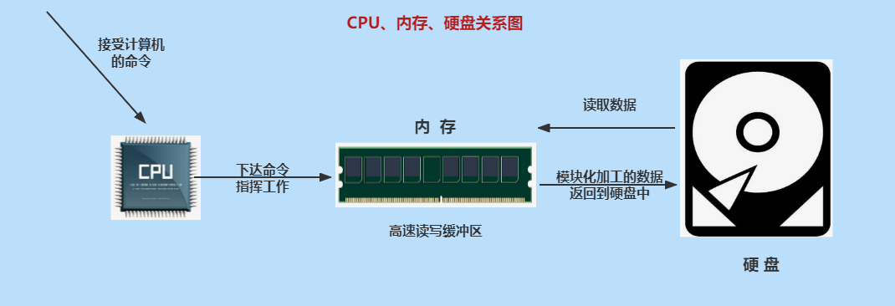

# 第一章：Java 语言概述

**目录：**

[TOC]

---

## 一、课程目录说明

> JDK：Java 程序员需要的一套环境。

## 二、Java 基础全程学习路线

### 2.1 Java 基础全程脉络图

> 大处着眼，小处着手。

> 线程：即一条执行路径。

## 三、抽丝剥茧话 Java

Java 是学习 JavaEE 后台、大数据、Android 开发的基石！

> 后台：进行数据的交互。

* 移动应用领域（集成 Android 平台）：Java 在 Android 端是主要开发的语言，占有重要的地位；
* 企业级应用领域（JavaEE 后台）：用来开发企业级的应用程序，大型网站如淘宝、京东、12306，以及各大物流、银行、金融、社交、医疗、交通、各种 OA 系统等都是用 JavaEE 技术开发的；
* 大数据分析、人工智能领域：流行的大数据框架，如 Hadoop、Flink 都是用 Java 编写的；Spark 使用 Scala 编写，但可以用 Java 开发应用；
* 游戏领域、桌面应用、嵌入式领域：很多大型游戏的后台、桌面应用等也是 Java 开发的。

## 四、Java 工程师全程学习路线

Java 系列课程体系：见《尚硅谷_宋红康_Java中高级程序员全程学习路线图.xmind》。

## 五、计算机硬件的介绍

### 5.1 计算机组成：硬件 + 软件

### 5.2 CPU、内存与硬盘

CPU（Central Processing Unit，中央处理器）：
* 人靠大脑思考，电脑靠 CPU 来运算、控制。

硬盘（Hard Disk Drive）：
* 计算机最主要的存储设备，容量大，断电数据不丢失；
* 正常分类：机械硬盘（HDD）、固态硬盘（SSD）以及混合硬盘（SSHD）；
* 固态硬盘在开机速度和程序加载速度远远高于机械硬盘，缺点就是贵，所以无法完全取代机械硬盘。

内存（Memory）：
* 负责硬盘上的数据与 CPU 之间数据交换处理；
* 具体的：保存从硬盘读取的数据，提供给 CPU 使用；保存 CPU 的一些临时执行结果，以便 CPU 下次使用或保存到硬盘；
* 断电后数据丢失。

