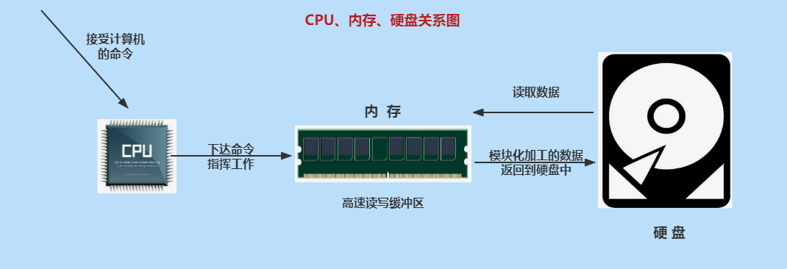
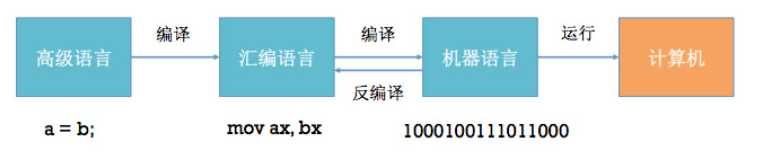

# 第一章：Java 语言概述

**目录：**

[TOC]

---

## 一、课程目录说明

> JDK：Java 程序员需要的一套环境。

## 二、Java 基础全程学习路线

### 2.1 Java 基础全程脉络图

> 大处着眼，小处着手。

> 线程：即一条执行路径。

## 三、抽丝剥茧话 Java

Java 是学习 JavaEE 后台、大数据、Android 开发的基石！

> 后台：进行数据的交互。

* 移动应用领域（集成 Android 平台）：Java 在 Android 端是主要开发的语言，占有重要的地位；
* 企业级应用领域（JavaEE 后台）：用来开发企业级的应用程序，大型网站如淘宝、京东、12306，以及各大物流、银行、金融、社交、医疗、交通、各种 OA 系统等都是用 JavaEE 技术开发的；
* 大数据分析、人工智能领域：流行的大数据框架，如 Hadoop、Flink 都是用 Java 编写的；Spark 使用 Scala 编写，但可以用 Java 开发应用；
* 游戏领域、桌面应用、嵌入式领域：很多大型游戏的后台、桌面应用等也是 Java 开发的。

## 四、Java 工程师全程学习路线

Java 系列课程体系：见《尚硅谷_宋红康_Java中高级程序员全程学习路线图.xmind》。

## 五、计算机软硬件的介绍

### 5.1 计算机硬件的介绍

#### 5.1.1 计算机组成：硬件 + 软件

#### 5.1.2 CPU、内存与硬盘

CPU（Central Processing Unit，中央处理器）：
* 人靠大脑思考，电脑靠 CPU 来运算、控制。

硬盘（Hard Disk Drive）：
* 计算机最主要的存储设备，容量大，断电数据不丢失；
* 正常分类：机械硬盘（HDD）、固态硬盘（SSD）以及混合硬盘（SSHD）；
* 固态硬盘在开机速度和程序加载速度远远高于机械硬盘，缺点就是贵，所以无法完全取代机械硬盘。

内存（Memory）：
* 负责硬盘上的数据与 CPU 之间数据交换处理；
* 具体的：保存从硬盘读取的数据，提供给 CPU 使用；保存 CPU 的一些临时执行结果，以便 CPU 下次使用或保存到硬盘；
* 断电后数据丢失。

#### 5.1.3 输入设备：键盘输入

### 5.2 软件相关介绍

#### 5.2.1 什么是软件

软件，即一系列按照特定顺序组织的计算机数据和指令的集合。有系统软件和应用软件之分。

> Pascal 之父 Nicklaus Wirth：“Programs = Data Structures + Algorithms”。

#### 5.2.2 人机交互方式

图形化界面（Graphical User Interface，GUI），这种方式简单直观，使用者易于接受，容易上手操作。

命令行方式（Command Line Interface，CLI），需要在控制台输入特定的指令，让计算机完成一些操作。需要记忆一些指令，较为麻烦。

## 六、常见的 DOS 命令

DOS（Disk Operating System，磁盘操作系统）是 Microsoft 公司在 Windows 之前推出的一个操作系统，是单用户、单任务（即只能执行一个任务）的操作系统。现在被 Windows 系统取代。

进入 DOS 操作窗口：按下 `Windows + R` 键盘，打开运行窗口，输入 `cmd` 回车，进入到 DOS 的操作窗口。

**常用指令：**

* 操作 1：进入和回退

| 操作 | 说明 |
| :--: | :--: |
| `盘符名称:` | 盘符切换 |
| `dir` | 列出当前目录下的文件以及文件夹 |
| `cd 目录` | 进入指定单级目录 |
| `cd 目录1\目录2\\...` | 进入指定多级目录 |
| `cd ..` | 回退到上一级目录 |
| `cd \` 或 `cd /` | 回退到盘符目录 |

* 操作 2：增、删

| 操作 | 说明 |
| :--: | :--: |
| `md 文件目录名` | 创建指定的文件目录 |
| `rd 文件目录名` | 删除指定的文件目录（如文件目录内有数据，删除失败） |
| `del 文件名` | 删除指定文件，例如 `del test1.txt` |
| `del *.文件后缀` | 删除指定后缀的文件，例如 `del *.txt` |

* 操作 3：其他

| 操作 | 说明 |
| :--: | :--: |
| `cls` | 清屏 |
| `exit` | 退出命令提示符窗口 |
| `←`  `→` | 移动光标 |
| `↑`  `↓` | 调阅历史操作命令 |
| Delete 和 Backspace | 删除字符 |

## 七、不同编程语言的介绍

计算机编程语言，就是人与计算机交流的方式。人们可以使用编程语言对计算机下达命令，让计算机完成人们需要的功能。

计算机语言有很多种。如：C、C++、Java、Go、JavaScript、Python、Scala 等。

> 体会：语言 = 语法 + 逻辑。

计算机语言简史：
* 第一代：机器语言（相当于人类的石器时代）：
  * 1946 年 2 月 14 日，世界上第一台计算机 ENAC 诞生，使用的是最原始的穿孔卡片。这种卡片使用的是用二进制代码表示的语言，与人类语言差别极大，这种语言就称为机器语言。
  * 这种语言本质上是计算机能识别的唯一语言，人类很难理解。
* 第二代：汇编语言（相当于人类的青铜&铁器时代）：
  * 使用英文缩写的助记符来表示基本的操作，这些助记符构成了汇编语言的基础。比如：`LOAD`、`MOVE` 等，使人更容易使用。因此，汇编语言也成为符号语言。
  * 优点：能编写高效率的程序。
  * 缺点：汇编语言是面向机器的，不同计算机机型特点不同，因此会有不同的汇编语言，彼此之间不能通用。程序不易移植，较难调试。
  * 比起机器语言，汇编大大进步了，是机器语言向更高级的语言进化的桥梁。目前仍然应用于工业电子编程领域、软件的加密解密、计算机病毒分析等。
* 第三代：高级语言（相当于人类的信息时代）：
  * 高级语言发展于 20 世纪 50 年代中叶到 70 年代，是一种接近于人们使用习惯的程序设计语言。它允许程序员使用接近日常英语的指令来编写程序，程序中的符号和算式也与日常用的数学式子差不多，接近于自然语言和数学语言，容易为人们掌握。
  * 高级语言独立于机器，有一定的通用性；计算机不能直接识别和执行用高级语言编写的程序，需要使用编译器或者解释器，转换为机器语言才能被识别和执行。

此外，高级语言按照程序设计方法的不同，又分为：面向过程的语言、面向对象的语言。
* C、Pascal、Fortran 面向过程的语言；
* C++ 面向过程 / 面向对象；
* Java 跨平台的纯面向对象的语言；
* C#、Python、JavaScript、Scala...

> 目前以及可预见的将来，计算机语言仍然处于“第三代高级语言”阶段。但是不管是什么语言，最后都要向机器语言靠近，因为 CPU 只认识 0 和 1。

编程语言，该学哪个？
* C语言：万物之源；
* C++语言：难学的语言；
* C#语言：背靠大树的语言；
* PHP语言：最好的语言？
* Python：易学的语言；
* JavaScript语言：前端为王；
* Java语言：需求旺盛；
* Go语言：夹缝中生存。

> Talk is cheap, show me the code.