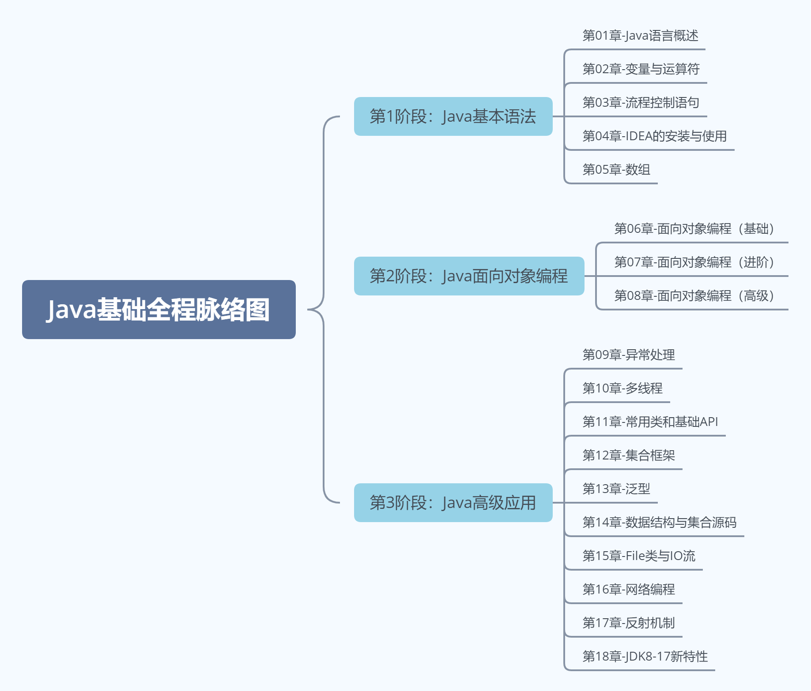

# 第一章：Java 语言概述

**目录：**

[TOC]

---

## 一、课程目录说明

> JDK：Java 程序员需要的一套环境。

## 二、Java 基础全程学习路线

### 2.1 Java 基础全程脉络图

> 大处着眼，小处着手。



> 线程：即一条执行路径。

## 三、抽丝剥茧话 Java

Java 是学习 JavaEE 后台、大数据、Android 开发的基石！


> 后台：进行数据的交互。

* 移动应用领域（集成 Android 平台）：Java 在 Android 端是主要开发的语言，占有重要的地位；
* 企业级应用领域（JavaEE 后台）：用来开发企业级的应用程序，大型网站如淘宝、京东、12306，以及各大物流、银行、金融、社交、医疗、交通、各种 OA 系统等都是用 JavaEE 技术开发的；
* 大数据分析、人工智能领域：流行的大数据框架，如 Hadoop、Flink 都是用 Java 编写的；Spark 使用 Scala 编写，但可以用 Java 开发应用；
* 游戏领域、桌面应用、嵌入式领域：很多大型游戏的后台、桌面应用等也是 Java 开发的。

## 四、Java 工程师全程学习路线

Java 系列课程体系：见《尚硅谷_宋红康_Java中高级程序员全程学习路线图.xmind》。

## 五、计算机软硬件的介绍

### 5.1 计算机硬件的介绍

#### 5.1.1 计算机组成：硬件 + 软件


#### 5.1.2 CPU、内存与硬盘

CPU（Central Processing Unit，中央处理器）：
* 人靠大脑思考，电脑靠 CPU 来运算、控制。

硬盘（Hard Disk Drive）：
* 计算机最主要的存储设备，容量大，断电数据不丢失；
* 正常分类：机械硬盘（HDD）、固态硬盘（SSD）以及混合硬盘（SSHD）；
* 固态硬盘在开机速度和程序加载速度远远高于机械硬盘，缺点就是贵，所以无法完全取代机械硬盘。

内存（Memory）：
* 负责硬盘上的数据与 CPU 之间数据交换处理；
* 具体的：保存从硬盘读取的数据，提供给 CPU 使用；保存 CPU 的一些临时执行结果，以便 CPU 下次使用或保存到硬盘；
* 断电后数据丢失。


#### 5.1.3 输入设备：键盘输入

### 5.2 软件相关介绍

#### 5.2.1 什么是软件

软件，即一系列按照特定顺序组织的计算机数据和指令的集合。有系统软件和应用软件之分。

> Pascal 之父 Nicklaus Wirth：“Programs = Data Structures + Algorithms”。

#### 5.2.2 人机交互方式

图形化界面（Graphical User Interface，GUI），这种方式简单直观，使用者易于接受，容易上手操作。

命令行方式（Command Line Interface，CLI），需要在控制台输入特定的指令，让计算机完成一些操作。需要记忆一些指令，较为麻烦。

## 六、常见的 DOS 命令

DOS（Disk Operating System，磁盘操作系统）是 Microsoft 公司在 Windows 之前推出的一个操作系统，是单用户、单任务（即只能执行一个任务）的操作系统。现在被 Windows 系统取代。

进入 DOS 操作窗口：按下 `Windows + R` 键盘，打开运行窗口，输入 `cmd` 回车，进入到 DOS 的操作窗口。

**常用指令：**

* 操作 1：进入和回退

| 操作 | 说明 |
| :--: | :--: |
| `盘符名称:` | 盘符切换 |
| `dir` | 列出当前目录下的文件以及文件夹 |
| `cd 目录` | 进入指定单级目录 |
| `cd 目录1\目录2\\...` | 进入指定多级目录 |
| `cd ..` | 回退到上一级目录 |
| `cd \` 或 `cd /` | 回退到盘符目录 |

* 操作 2：增、删

| 操作 | 说明 |
| :--: | :--: |
| `md 文件目录名` | 创建指定的文件目录 |
| `rd 文件目录名` | 删除指定的文件目录（如文件目录内有数据，删除失败） |
| `del 文件名` | 删除指定文件，例如 `del test1.txt` |
| `del *.文件后缀` | 删除指定后缀的文件，例如 `del *.txt` |

* 操作 3：其他

| 操作 | 说明 |
| :--: | :--: |
| `cls` | 清屏 |
| `exit` | 退出命令提示符窗口 |
| `←`  `→` | 移动光标 |
| `↑`  `↓` | 调阅历史操作命令 |
| Delete 和 Backspace | 删除字符 |

## 七、不同编程语言的介绍

计算机编程语言，就是人与计算机交流的方式。人们可以使用编程语言对计算机下达命令，让计算机完成人们需要的功能。

计算机语言有很多种。如：C、C++、Java、Go、JavaScript、Python、Scala 等。

> 体会：语言 = 语法 + 逻辑。

计算机语言简史：
* 第一代：机器语言（相当于人类的石器时代）：
  * 1946 年 2 月 14 日，世界上第一台计算机 ENAC 诞生，使用的是最原始的穿孔卡片。这种卡片使用的是用二进制代码表示的语言，与人类语言差别极大，这种语言就称为机器语言。
  * 这种语言本质上是计算机能识别的唯一语言，人类很难理解。
* 第二代：汇编语言（相当于人类的青铜&铁器时代）：
  * 使用英文缩写的助记符来表示基本的操作，这些助记符构成了汇编语言的基础。比如：`LOAD`、`MOVE` 等，使人更容易使用。因此，汇编语言也成为符号语言。
  * 优点：能编写高效率的程序。
  * 缺点：汇编语言是面向机器的，不同计算机机型特点不同，因此会有不同的汇编语言，彼此之间不能通用。程序不易移植，较难调试。
  * 比起机器语言，汇编大大进步了，是机器语言向更高级的语言进化的桥梁。目前仍然应用于工业电子编程领域、软件的加密解密、计算机病毒分析等。
* 第三代：高级语言（相当于人类的信息时代）：
  * 高级语言发展于 20 世纪 50 年代中叶到 70 年代，是一种接近于人们使用习惯的程序设计语言。它允许程序员使用接近日常英语的指令来编写程序，程序中的符号和算式也与日常用的数学式子差不多，接近于自然语言和数学语言，容易为人们掌握。
  * 高级语言独立于机器，有一定的通用性；计算机不能直接识别和执行用高级语言编写的程序，需要使用编译器或者解释器，转换为机器语言才能被识别和执行。


此外，高级语言按照程序设计方法的不同，又分为：面向过程的语言、面向对象的语言。
* C、Pascal、Fortran 面向过程的语言；
* C++ 面向过程 / 面向对象；
* Java 跨平台的纯面向对象的语言；
* C#、Python、JavaScript、Scala...

> 目前以及可预见的将来，计算机语言仍然处于“第三代高级语言”阶段。但是不管是什么语言，最后都要向机器语言靠近，因为 CPU 只认识 0 和 1。

编程语言，该学哪个？
* C语言：万物之源；
* C++语言：难学的语言；
* C#语言：背靠大树的语言；
* PHP语言：最好的语言？
* Python：易学的语言；
* JavaScript语言：前端为王；
* Java语言：需求旺盛；
* Go语言：夹缝中生存。

> Talk is cheap, show me the code.

## 八、Java 相关历史

Java 是 SUN（Stanford University Network，斯坦福大学网络公司）1995 年推出的一门高级编程语言，是一种面向 Internet 的编程语言。伴随着互联网的迅猛发展，以及 Java 技术在 web 方面的不断成熟，已经成为 Web 应用程序的首选开发语言。

Java 语言简史：
* 起步阶段：
* 发展阶段：
  * （2004.09.30）Java 5.0：版本号从 1.4 直接更新至5.0；平台更名为 JavaSE、JavaEE、JavaME；
  * （2014.03.18）Java 8.0：此版本是继 Java 5.0 以来变化最大的版本，是长期支持版本（LTS）；
  * （2018.09.25）Java 11.0：JDK 安装包取消独立 JRE 安装包，是长期支持版本（LTS）；
  * （2021.09）Java 17.0：发布 Java 17.0，版本号也称为 21.9，是长期支持版本。

詹姆斯·高斯林（James Gosling）先生以“Java 技术之父”而闻名于世。他是 Java 技术的创始人，他亲手设计了 Java 语言，并开发了 Java 编译器和 Java 虚拟机，使 Java 成为了世界上最流行的开发语言。

Java 技术体系平台：
* Java SE（Java Standard Edition）标准版：支持面向**桌面级应用**（如 Windows 下的应用程序）的 Java 平台，即定位个人计算机的应用开发；
* Java EE（Java Enterprise Edition）企业版：为开发企业环境下的应用程序提供的一套解决方案，即定位**在服务器端的 Web 应用开发**。
* Java ME（Java Micro Edition）小型版：支持 Java 程序运行在**移动终端（手机、机顶盒）上的平台**，即定位在消费性电子产品的应用开发。


## 九、JDK 的选择和下载

JDK（Java Development Kit）是 Java 程序开发工具包，包含 JRE 和开发人员使用的工具。

JRE（Java Runtime Environment）是 Java 程序的运行时环境，包含 JVM 和运行时所需要的核心类库。

如下是 Java 8.0 Platform：


> 小结：
> * JDK = JRE + 开发工具集（例如 Javac 编译工具等）；
> * JRE = JVM + Java SE 标准类库。

JDK 下载网址（Oracle 公司官网）：[JDK 下载网址](www.oracle.com)。

接下来，我们需要配置 path 环境变量。

path 环境变量是指 windows 操作系统执行命令时所要搜寻的路径，我们希望在命令行使用 javac.exe 等工具时，任意目录下都可以找到这个工具所在的目录，因此我们需要配置 path。

在 JDK8 配置方案选择方面，推荐配置 JAVA_HOME + path。即在 系统变量 中，单击 新建，创建新的环境变量，变量名输入 `JAVA_HOME`，变量值输入 `D:\Developer\Java\Java_SE_24_0_2`，单击 确定；在 系统变量 中选中 Path 环境变量，双击 或者 点击编辑，在变量值的最前面，键入 `%JAVA_HOME%\bin`，即可配置完成环境变量。重启 DOS 命令行，在任意目录下输入 `javac` 或 `java` 命令或 `java -version`，运行成功。

> 注意：强烈建议将 `%JAVA_HOME%\bin`声明在 path 环境变量中所有变量的最前面！

小结如下：


不管大家有没有提前安装 JDK8 或其他版本 JDK，在我们安装完 JDK17 之后，理应按 JDK8 的方式配置 path 环境变量。但是，我们发现安装完 JDK17 以后，配置环境变量之前，在 CMD 中执行命令 `java -version` 竟然成功了！而且是 17.0.2 版本。因为 JDK17 在安装之后，自动进行了环境变量的配置。如下：


如上图所示，在 JDK17 安装完成后，自动创建上图中红框标出的环境变量，即自动进行了环境变量的配置。

如果仍然希望在 JDK8 下开发 Java 程序，需要将 `%JAVA_HOME%\bin` 上移到首位，并重启 CMD 窗口。

如果此后使用 JDK17 进行开发，这里建议，将 JDK17 安装的路径，设置为 `JAVA_HOME`，并将 `%JAVA_HOME%\bin` 上移到首位：


## 十、HelloWorld 的编写和执行

JDK 安装完毕，我们就可以开发第一个 Java 程序了，习惯性的称为：HelloWorld。

> 都有哪些开发 Java 的工具：
> * 级别一：文本开发工具；
> * 级别二：集成开发环境（Integrated Development Environment，IDE）。
>
> 前期我们先使用文本开发工具，培养代码感，利用公司笔、面试。
> 后期我们使用 IDE，提供更强大的功能支持。

### 10.1 开发步骤

Java 程序开发三步骤：编写、编译、运行：
* 将 Java 代码编写到扩展名为 `.java` 的源文件中；
* 通过 javac.exe 命令对该 java 文件进行编译，生成一个或多个字节码文件；
* 通过 java.exe 命令对生成的 class 文件进行运行。


### 10.2 编写

示例代码：
```java
class HelloChina{
  public static void main(String[] args){
    System.out.println("hello, world!!你好，中国！");
  }
}
```

> 对于 Java 来说，我们编写的代码需要放在一个一个的类（class）当中。

第一个 HelloWorld 源程序就编写完成了，但是这个文件是程序员编写的，JVM 是看不懂的，也就不能运行，因此我们必须将编写好的 Java 源文件编译成 JVM 可以看懂的字节码文件，也就是 `.class` 文件。

### 10.3 编译

在 DOS 命令行中，使用 `javac` 命令进行编译：
```dos
javac Java源文件名.后缀名java
```

举例：
```dos
javac HelloWorld.java
```

> 在使用 `javac` 命令时，可以指定源文件的字符编码：
> ```cmd
> javac -encoding utf-8 Review01.java
> ```
> 上述方式可以解决当 CMD 命令行窗口的字符编码与 `.java` 源文件的字符编码不一致的问题。

编译成功后，命令行没有任何提示，在目录下发现产生了一个新的文件 `HelloChina.class`，该文件就是编译后的文件，是 Java 的可运行文件，称为字节码文件，有了字节码文件，就可以运行程序了。

### 10.4 运行

在 DOS 命令行中，在字节码文件目录下，使用 `java` 命令进行运行：
```dos
java 主类名字
```

主类是指包括 main 方法的类，main 方法是 Java 程序的入口：
```java
public static void main(String[] args){

}
```

举例：
```dos
java HelloChina
```

> 错误演示：
> ```java
> java HelloChina.class
> ```
> 在使用 `java` 命令运行时不需要添加后缀 `.class`！

### 10.5 建议

注意缩进！
* 一定要有缩进。缩进就像人得体的衣着一样！
* 只要遇到 `{}` 就缩进，缩进的快捷键 tab 键。

必要的空格：
* 变量类型、变量、赋值符号、变量值之间填充相应空格，更美观。
* 比如：`int num = 10;`。

## 十一、第一个 HelloWorld 程序的总结

### 11.1 Java 程序编写和执行的过程

步骤 1：编写。将 Java 代码编写在 `.java` 结尾的源文件中。

步骤 2：编译。针对 `.java` 结尾的源文件进行编译操作，格式为 `javac 源文件名.java`。

步骤 3：运行。针对编译后生成的字节码文件，进行解释运行，格式为 `java 字节码文件名`。

### 11.2 针对步骤 1 的编写进行说明

```java
class HelloChina{
  public static void main(String[] args){
    System.out.println("hello, world!!你好，中国！");
  }
}
```

Java 程序的结构如下：
```java
类{
  方法{
    语句;
  }
}
```

Java 程序的格式如下：
* 每一级缩进一个 Tab 键；
* `{}` 的左半部分在行尾，右半部分单独一行，与和它成对的 `{` 的行首对齐。

其中：
1. `class`：关键字，表示“类”，后面跟着类名。
2. `main()` 方法的格式是固定的，表示 Java 程序的入口：
   * `public static void main(String[] args)`；
   * 如果非要有些变化的话，只能变化 `String[] args` 结构。
     * 可以写成：
       * 方式 1：`String args[]`；
       * 方式 2：`String[] a`。

> `args`：全称是 arguments，简写成 args。

3. Java 程序，是严格区分大小写的。
4. 从控制台输出数据的操作：
   * （换行输出语句）`System.out.println()`：输出数据之后，会换行；
     * 换行输出语句，括号内可以什么都不写，只做换行处理。
   * （直接输出语句）`System.out.print()`：输出数据之后，不会换行；
     * 直接输出语句，括号内什么都不写的话，编译报错。
5. 每一句执行语句必须要以 `;` 结束。

### 11.3 针对于步骤 2 的编译进行说明

如果编译不通过，可以考虑的问题：
1. 查看编译的文件名、文件路径是否书写错误；

> 在 Windows 下使用 `javac` 进行编译时，由于 Windows 下的文件名不区分大小写，因此编译指定的文件名的大小写可以与实际的文件名的大小写不一致。

2. 查看代码中是否存在语法问题。如果存在，就可能导致编译不通过。

编译以后，会生成一个或多个字节码文件。每一个字节码文件对应一个 Java 类，并且字节码文件名与类名相同。

> `.class` 文件是用于给 JVM 看的，而不是给人看的。

### 11.4 针对于步骤 3 的运行进行说明

我们是针对于字节码文件对应的 Java 类进行解释运行的，所以要注意区分大小写！

如果运行不通过，可以考虑的问题：
1. 查看解释运行的类名、字节码文件路径是否书写错误；
2. 可能存在运行时异常（放到第 9 章中具体讲解）。

### 11.5 源文件名与类名

一个源文件中可以声明多个类，但是最多只能有一个类使用 public 进行声明，且要求声明为 public 的类名必须与源文件名一致。

总结如下：

1. 源文件名是否必须与类名一致？`public` 呢？
* 如果这个类不是 `public`，那么源文件名可以和类名不一致。但是不便于代码维护。
* 如果这个类是 public，那么要求源文件名必须与类名一致。否则编译报错。
* 我们建议大家，不管是否是 `public`，都与源文件名保持一致，而且一个源文件尽量只写一个类，目的是为了好维护。

2. 一个源文件中是否可以有多个类？`public` 呢？
* 一个源文件中可以有多个类，编译后会生成多个 `.class` 字节码文件。
* 但是一个源文件只能有一个 `public` 的类。