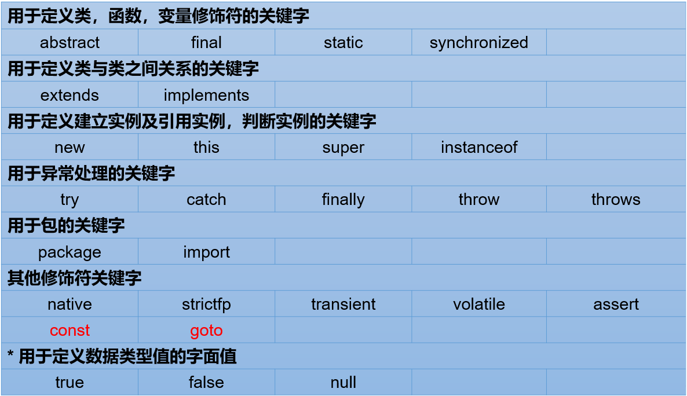
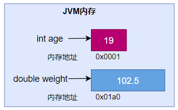
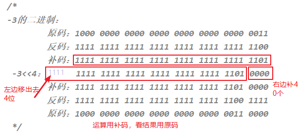

# 第二章：变量与运算符

**目录：**

[TOC]

---

本章专题与脉络：


## 一、关键字（keyword）

关键字定义：被 Java 语言赋予了特殊含义，用做专门用途的字符串（或单词）。
* HelloWorld 案例中，出现的关键字有 `class`、`public`、`static`、`void` 等，这些单词已经被 Java 定义好了。

关键字的特点：全部关键字都是小写字母。

关键字比较多，不需要死记硬背，学到哪里记到哪里即可。

官方地址：[官方地址](https://docs.oracle.com/javase/tutorial/java/nutsandbolts/_keywords.html)。


> 说明：
> 1. 关键字一共 50 个，其中 `const` 和 `goto` 是保留字（reserved word）；
> 2. `true`、`false`、`null` 不在其中，它们看起来像关键字，其实是字面量，表示特殊的布尔值和空值；虽然这三种不是关键字，但是可以当做关键字来看待。




## 二、标识符（identifier）

Java 中变量、方法、类等要素命名时使用的字符序列，称为标识符。

技巧：凡是自己可以起名字的地方都叫标识符。比如：类名、方法名、变量名、包名、常量名等。

标识符的命名规则（必须遵守的硬性规定）：
* 由 26 个英文字母大小写、`0` - `9`、`_` 或 `$` 组成；
* 数字不可以开头；
* 不可以使用关键字和保留字，但能包含关键字和保留字；
* Java 中严格区分大小写，长度无限制；
* 标识符不能包含空格。

> 练习：miles（√）、Test（√）、a++（×）、--a（×）、4#R（×）、$4（√）、#44（×）、apps（√）、class（×）、public（×）、int（√）、x（√）、y（√）、radius（√）。

标识符的命名规范（建议遵守的软性要求，否则工作时容易被鄙视）：
* 包名：多单词组成时所有字母都小写：`xxxyyyzzz`。
  * 例如：`java.lang`、`com.atguigu.bean`。
* 类名、接口名：多单词组成时，所有单词的首字母大写（大驼峰）：`XxxYyyZzz`。
  * 例如：`HelloWorld`、`String`、`System` 等。
* 变量名、方法名：多单词组成时，第一个单词首字母小写，第二个单词开始每个单词首字母大写（小驼峰）：`xxxYyyZzz`。
  * 例如：`age`、`name`、`bookName`、`main`、`binarySearch`、`getName`。
* 常量名：所有字母都大写，多单词时每个单词用下划线连接：`XXX_YYY_ZZZ`。
  * 例如：`MAX_VALUE`、`PI`、`DEFAULT_CAPACITY`。

> 注意：在起名字时，为了提高阅读性，要尽量有意义，“见名知意”。

> 更多细节详见《代码整洁之道_关于标识符.txt》《阿里巴巴Java开发手册-1.7.1-黄山版》。

## 三、变量

### 3.1 为什么需要变量


一花一世界，如果把一个程序看做一个世界或一个社会的话，那么变量就是程序世界的花花草草、万事万物。即，变量是程序中不可或缺的组成单位，最基本的存储单元。

### 3.2 初识变量

变量的概念：内存中的一个存储区域，该区域的数据可以在同一类型范围内不断变化。

变量的构成包含三个要素：数据类型、变量名、存储的值。

Java 中变量声明的格式：`数据类型 变量名 = 变量值`。


> 根据定义变量时是否需要强制指定数据类型，编程语言可分为强类型语言和弱类型语言。
> 
> Java 为强类型语言。

变量的作用：用于在内存中保存数据。

使用变量时需注意：
* Java 中每个变量必须先声明、后使用。
* 使用变量名来访问这块区域的数据。
* 变量的作用域为其定义所在的一对 `{ }` 内。
* 变量都有其作用域，变量只有在其作用域内才有效；出了作用域，变量不可以再被调用。
* 同一个作用域内，不能定义重名的变量。

定义变量时，变量名要遵循标识符命名的规则和规范。

定义变量的方式有两种：
* 方式 1 - 先声明后赋值：
```java
char gender;    // 过程 1：变量的声明
gender = '男';  // 过程 2：变量的赋值（或初始化）
```
* 方式 2 - 声明与初始化合并：
```java
int age = 10;
```

> 说明：
> * 变量都有其作用域。变量只在作用域内是有效的，出了作用域就失效了。
> * 在同一个作用域内，不能声明两个同名的变量。
> * 定义好变量以后，就可以通过变量名的方式对变量进行调用和运算。
> * 变量值在赋值时，必须满足变量的数据类型，并且在数据类型有效的范围内变化。

### 3.3 Java 中变量的数据类型

Java 中的变量按照数据类型来分类，可分为两大类：
* 基本数据类型（8 种）：
  * 整型：`byte`、`short`、`int`、`long`；
  * 浮点型：`float`、`double`；
  * 字符型：`char`；
  * 布尔型：`boolean`。
* 引用数据类型：
  * 类（class）；
  * 数组（array）；
  * 接口（interface）；
  * 枚举（enum）；
  * 注解（annotation）；
  * 记录（record）。


### 3.4 变量的使用

#### 3.4.1 步骤 1：变量的声明

变量声明的语法格式：
```java
数据类型 变量名
```

示例代码：
```java
// 例如：
// 存储一个整数类型的年龄
int age;

// 存储一个小数类型的体重
double weight;

// 存储一个单字符类型的性别
char gender;

// 存储一个布尔类型的婚姻状态
boolean marry;

// 存储一个字符串类型的姓名
String name;

// 声明多个同类型的变量
int a, b, c;    // 表示 a、b、c 三个变量都是 int 类型
```

> 注意：变量的数据类型可以是基本数据类型，也可以是引用数据类型。

#### 3.4.2 步骤 2：变量的赋值

给变量赋值，就是把“值”存到该变量代表的内存空间中。同时，给变量赋的值类型必须与变量声明的类型一致或兼容。

变量赋值的语法格式：
```java
变量名 = 值;
```

举例 1 - 可以使用合适类型的常量值给已经声明的变量赋值：
```java
age = 18;
weight = 109;
gender = '女';
```

举例 2 - 可以使用其他变量或者表达式给变量赋值：
```java
int m = 1;
int n = m;

int x = 1;
int y = 2;
int z = 2 * x + y;
```

举例 3 - 变量可以反复赋值：
```java
// 先声明，后初始化
char gender;
gender = '女';

// 给变量重新赋值，修改 gender 变量的值
gender = '男';
System.out.println("gender = " + gender);   // gender = 男
```

举例 4 - 也可以将变量的声明和赋值一并执行：
```java
boolean isBeauty = true;
String name = "迪丽热巴";
```

内存结构如图：


## 四、基本数据类型介绍

### 4.1 整数类型：byte、short、int、long

Java 各整数类型有固定的表数范围和字段长度，不受具体操作系统的影响，以保证 Java 程序的可移植性。


若定义 `long` 类型的变量，在赋值时需要以“`l`”或“`L`”作为后缀。

Java 程序中变量通常声明为 `int` 型，除非不足以表示较大的数，才使用 `long`。

Java 的整型常量默认为 `int` 型。

#### 4.1.1 补充：计算机存储单位

字节（Byte）：是计算机用于计量存储容量的基本单位，一个字节等于 8 bit。

位（bit）：是数据存储的最小单位。二进制数系统中，每个 0 或 1 就是一个位，叫做 bit（比特），其中 8 bit 就称为一个字节（Byte）。

转换关系：
* 8 bit = 1 Byte；
* 1024 Byte = 1 KB；
* 1024 KB = 1 MB；
* 1024 MB = 1 GB；
* 1024 GB = 1 TB。

### 4.2 浮点类型：float、double

与整数类型类似，Java 浮点类型也有固定的表数范围和字段长度，不受具体操作系统的影响。


浮点型常量有两种表示形式：
* 十进制数形式。如：`5.12`、`512.0f`、`.512`（必须有小数点）；
* 科学计数法形式。如：`5.12e2`、`512E2`、`100E-2`。

`float`：单精度，尾数可以精确到 7 位有效数字。
* `float` 类型占用的空间比 `long` 类型小，但表示的范围比 `long` 类型更大；
* 很多情况下，精度很难满足需求。

`double`：双精度，精度是 `float` 的两倍。
* 通常采用此类型。

定义 `float` 类型的变量，赋值时需要以“`f`”或“`F`”作为后缀。

Java 的浮点型常量默认为 `double` 型。

#### 4.2.1 关于浮点型精度的说明

并不是所有的小数都能可以精确地用二进制浮点数表示。二进制浮点数不能精确地表示 `0.1`、`0.01`、`0.001` 这样的 10 的负次幂。

浮点类型 `float`、`double` 的数据不适合在不容许舍入误差的金融计算领域。如果需要精确数字计算或保留指定位数的精度，需要使用 `BigDecimal` 类。

测试用例：
```java
// 测试 1：
// （解释见章末企业真题：为什么 0.1 + 0.2 不等于 0.3）
System.out.println(0.1 + 0.2) // 0.30000000000000004

// 测试 2：
float ff1 = 123123123f;
float ff2 = ff1 + 1;
System.out.println(ff1);  // 1.2312312E8
System.out.println(ff2);  // 1.2312312E8
System.out.println(ff1 == ff2); // true
```

#### 4.2.2 应用举例

案例 1：定义圆周率并赋值为 3.14，现有 3 个圆的半径分别为 1.2、2.5、6，求它们的面积。
```java
public class FloatDoubleExer {
    public static void main(String[] args) {
        // 定义圆周率变量
        double pi = 3.14;
        // 定义三个圆的半径
        double radius1 = 1.2;
        double radius2 = 2.5;
        int radius3 = 6;

        // 计算面积
        double area1 = pi * radius1 * radius1;
        double area2 = pi * radius2 * radius2;
        double area3 = pi * radius3 * radius3;

        System.out.println("圆 1 的半径为：" + radius1 + "，面积为：" + area1);
        System.out.println("圆 2 的半径为：" + radius2 + "，面积为：" + area2);
        System.out.println("圆 3 的半径为：" + radius3 + "，面积为：" + area3);
    }
}
```

案例 2：小明要到美国旅游，可是那里的温度是以华氏度为单位记录的。它需要一个程序将华氏温度（80 度）转换为摄氏度，并以华氏度和摄氏度为单位分别显示该温度。
> 提示：`℃ = (℉ - 32) / 1.8`。
```java
public class FloatDoubleExer1 {
    public static void main(String[] args) {
        double oF = 80;
        double oC = (oF - 32) / 1.8;

        System.out.println("华氏度 " + oF + "℉ 对应的摄氏度为 " + oC + "℃");
    }
}
```

### 4.3 字符类型：char

`char` 型数据用来表示通常意义上“字符”（占 2 字节）。

Java 中的所有字符都使用 Unicode 编码，故一个字符可以存储一个字母、一个汉字，或其他书面语的一个字符。

> Unicode 编码相当于一种映射关系（函数），其将字符（如 `a`、`中`、`9` 等）映射为编码（即 `\uXXXX` 的形式）。

字符型变量的三种表现形式：
* 形式 1：使用单引号（`' '`）括起来的单个字符（单引号 `''` 内部有且仅有一个字符）。
  * 例如：`char c1 = a;`、`char c2 = '中';`、`char c3 = '9';`。
* 形式 2：直接使用 Unicode 值来表示字符型常量 `\uXXXX`，其中 `XXXX` 代表一个十六进制整数。
  * 例如：`\u0023` 表示 `#`。
* 形式 3：Java 中还允许使用转义字符 `\` 来将其后的字符转变为特殊字符型常量。
  * 例如：`char c3 = '\n';`，其中 `\n` 表示换行符。
  * 转义字符汇总：
    | 转义字符 | 说明 | Unicode 表示方式 |
    | :--: | :--: | :--: |
    | `\n` | 换行符 | `\u000a` |
    | `\t` | 制表符 | `\u0009` |
    | `\"` | 双引号 | `\u0022` |
    | `\'` | 单引号 | `\u0027` |
    | `\\` | 反斜线 | `\u005c` |
    | `\b` | 退格符 | `\u0008` |
    | `\r` | 回车符 | `\u000d` |
* 形式 4：使用具体字符对应的数值（比如 ASCII 码）。
  * 例如：
    ```java
    char c11 = 97;
    System.out.println(c11);  // a
    ```

`char` 类型是可以进行运算的，因为它都对应有 Unicode 码，可以看做是一个数值。

### 4.4 布尔类型：boolean

`boolean` 类型用来判断逻辑条件，一般用于流程控制语句中（比如：条件判断、循环结构等）：
* `if` 条件控制语句；
* `while` 循环控制语句；
* `for` 循环控制语句；
* `do - while` 循环控制语句。

`boolean` 类型数据只有两个值：`true`、`false`，无其他。
* 不可以使用 `0` 或 非 `0` 的整数替代 `false` 和 `true`，这点和 C 语言不同。
* 拓展：
  * Java 虚拟机中没有任何供 `boolean` 值专用的字节码指令，Java 语言表达所操作的 `boolean` 值，在编译之后都使用 java 虚拟机中的 `int` 数据类型来代替：`true` 用 `1` 表示，`false` 用 `0` 表示。  ——《java 虚拟机规范 8版》

示例代码：
```java
boolean isFlag = true;

if (isFlag) {
  // true 分支
} else {
  // false 分支
}
```

> 经验之谈：Less is More!
> 
> 建议不要这样写：
> ```java
> if (isFlag == true)
> ```
> 只有新手才如此。关键也很容易写错成 `if (isFlag = true)`，这样就变成赋值 `isFlag` 为 `true` 而不是判断！
> 老鸟的写法是 `if (isFlag)` 或 `if (!isFlag)`。

## 五、基本数据类型变量间运算规则

在 Java 程序中，不同的基本数据类型（只有 7 种，不包含 `boolean` 类型）变量的值经常需要进行相互转换。

转换的方式（即运算规则）有两种：自动类型提升和强制类型转换。

### 5.1 自动类型提升

规则：将取值范围小（或容量小）的类型自动提升为取值范围大（或容量大）的类型。

> 说明：此时的容量小或大，并非指占用的内存空间的大小，而是指表示数据的范围的大小。

基本数据类型的转换规则如下图所示：

即：`byte、short、char -> int -> long -> float -> double`。

1. 当把存储范围小的值（常量值、变量的值、表达式计算的结果值）赋值给了存储范围大的变量时：
```java
int i = 'A';  // char 自动升级为 int，其实就是把字符的编码值赋值给 i 变量了
double d = 10;  // int 自动升级为 double
long num = 1234567; // 右边的整数常量值如果在 int 范围内，编译和运行都可以通过，这里涉及到数据类型转换

// byte bigB = 130;  // 错误，右边的整数常量值超过 byte 范围
long bigNum = 12345678912L; // 右边的整数常量值如果超过 int 范围，必须加 L 以显式表示 long 类型，否则编译不通过

float f1 = 12.3F;
// float f2 = 12.3;  // 编译不通过，不满足自动类型提升的规则（double -> float），所以报错

byte b1 = 10;
// byte b2 = b1 + 1; // 编译不通过，因为整型常量规定为 int 类型，所以报错

double d1 = b1 + 12.3;  // 浮点型常量规定为 double 类型
```

2. 当存储范围小的数据类型与存储范围大的数据类型变量一起混合运算时，会按照其中最大的类型运算：
```java
int i = 1;
byte b = 1;
double d = 1.0;

double sum = i + b + d; // 混合运算，升级为 double
```

3. 当 `byte`、`short`、`char` 数据类型的变量进行算术运算时，按照 `int` 类型处理：
```java
byte b1 = 1;
byte b2 = 2;
// byte b3 = b1 + b2;  // 编译报错，b1 + b2 自动升级为 int

char c1 = '0';
char c2 = 'A';
int i = c1 + c2;  // 至少需要使用 int 类型来接收
System.out.println(c1 + c2);  // 113
```

> 为什么标识符的声明规则里要求不能以数字开头？
> ```java
> // 如果允许数字开头，则如下的声明编译就可以通过：
> int 123L = 12;
> // 进而，如下的声明中 l 的值到底是 123 还是变量 123L 对应的取值 12 呢？出现歧义了！
> long l = 123L;
> ```
> 如果允许变量名以数字开头，则上述代码中的 `123L` 无法确定究竟为数字还是变量名。
> 
> 因此，不允许变量名以数字开头是为了“自洽”。

练习：
> 设 `x` 为 `float` 型变量，`y` 为 `double` 型变量，`a` 为 `int` 型变量，`b` 为 `long` 型变量，`c` 为 `char` 型变量，则表达式 `x + y * a / x + b / y + c` 的值类型为：
> A. `int`    B. `long`    C. `double`    D. `char`
>
> 答案：C

### 5.2 强制类型转换

将 `3.14` 赋值到 `int` 类型变量会发生什么？
```java
int i = 3.14; // 编译报错
```
产生编译失败，肯定无法赋值。

想要赋值成功，只有通过强制类型转换，将 `double` 类型强制转换成 `int` 类型才能赋值。

规则：将取值范围大（或容量大）的类型强制转换成取值范围小（或容量小）的类型，需要使用强制类型转换；强制类型转换需要使用强转符 `()`，在 `()` 内指明要转换为的数据类型。

自动类型提升是 Java 自动执行的，而强制类型转换是自动类型提升的逆运算，需要我们自己手动执行。

转换格式：
```java
数据类型1 变量名 = (数据类型1)被强转数据值; // ()中的数据类型必须 <= 变量值的数据类型
```

1. 当把存储范围大的值（常量值、变量的值、表达式计算的结果值）强制转换为存储范围小的变量时，可能会损失精度或溢出：
```java
int i = (int)3.14;  // 损失精度（截断）

double d = 1.2;
int num = (int)d; // 损失精度（截断）

int i = 200;
byte b = (byte)i; // 溢出

int i3 = 12;
float f = (float)i3;  // 编译可以通过，只不过可以省略 () 而已
```

2. 当某个值想要提升数据类型时，也可以使用强制类型转换；这种情况的强制类型转换是没有风险的，通常省略：
```java
int i = 1;
int j = 2;
double bigger = (double)(i / j);
```

3. 声明 `long` 类型变量时，可以出现省略后缀的情况；`float` 则不同：
```java
long l1 = 123L;
long l2 = 123;  // 如何理解呢？此时可以看做是 int 类型的 123 自动类型提升为 long 类型

// long l3 = 123123123123; // 报错，因为 123123123123 超出了 int 的范围
long l4 = 123123123123L;

// float f1 = 12.3;  // 报错，因为 12.3 看做是 double，不能自动转换为 float 类型
float f2 = 12.3F;
float f3 = (float)12.3;
```

练习：
> 判断是否能通过编译。
1.
```java
short s = 5;
s = s - 2;  // 判断：no
```
2.
```java
byte b = 3;
b = b + 4;  // 判断：no
b = (byte)(b + 4);  // 判断：yes
```
3.
```java
char c = 'a';
int i = 5;
float d = .314F;
double result = c + i + d;  // 判断：yes
```
4.
```java
byte b = 5;
short s = 3;
short t = s + b;  // 判断：no
```

实际开发举例：
```java
class VariableTest4 {
  public static void main(String[] args) {
    // 实际开发举例：
    byte b2 = 12;
    method(b2);

    long l2 = 12L;
    // 编译不通过
    // method(l2);
    method((int)l2);
  }

  public static void method(int num) {  // int num = b2; 自动类型提升
    System.out.println("num = " + num);
  }
}
```

### 5.3 基本数据类型与 String 的运算

#### 5.3.1 字符串类型：String

`String` 不是基本数据类型，属于引用数据类型，俗称字符串；其使用一对 `""` 来表示一个字符串，内部可以包含 0 个、1 个或多个字符。`String` 声明方式与基本数据类型类似，例如：`String str = "尚硅谷";`。

#### 5.3.2 运算规则

1. 任意八种基本数据类型的数据与 `String` 类型只能进行连接“`+`”运算，且结果一定也是 `String` 类型：
```java
System.out.println("" + 1 + 2); // 12

int num = 10;
boolean b1 = true;
String s1 = "abc";

String s2 = s1 + num + b1;
System.out.println(s2); // abc10true

// String s3 = num + b1 + s1;  // 编译不通过，因为 int 类型不能与 boolean 运算
// String s3 = b1 + num + s1;  // 编译不通过，因为 int 类型不能与 boolean 运算
String s4 = num + (b1 + s1);  // 编译通过
```

2. `String` 类型不能通过强制类型转换 `()` 转为其他的类型：
```java
String str= "123";
// int num = (int)str; // 错误的

int num = Integer.parseInt(str);  // 正确的，后面才能讲到，借助包装类的方法才能转
```

#### 5.3.3 案例与练习

案例：
> 公安局身份登记：
> 要求填写自己的姓名、年龄、性别、体重、婚姻状况（已婚用 `true` 表示，单身用 `false` 表示）、联系方式等等。

示例代码：
```java
/*
要求填写自己的姓名、年龄、性别、体重、婚姻状况（已婚用 true 表示，单身用 false 表示）、联系方式等等。
*/
class StringExer {
    public static void main(String[] args) {
        String name = "李进";
        int age = 24;
        char gender = '男';
        double weight = 130.5;
        boolean isMarried = false;
        String phoneNumber = "13012341234";

        String info = "name = " + name + "，age = " + age + "，gender = " + gender + "，weight = " + 
            weight + "，isMarried = " + isMarried + "，phoneNumber = " + phoneNumber;

        System.out.println(info);
    }
}
```

练习：
* 练习 1：
```java
String str1 = 4;  // 判断对错：no
String str2 = 3.5f + "";  // 判断 str2 对错：yes
System.out.println(str2); //输出：3.5
System.out.println(3 + 4 + "Hello!"); // 输出：7Hello!
System.out.println("Hello!" + 3 + 4); // 输出：Hello!34
System.out.println('a' + 1 + "Hello!"); // 输出：98Hello!
System.out.println("Hello" + 'a' + 1);  // 输出：Helloa1
```
* 练习 2：
```java
System.out.println("*    *"); // 输出：*    *
System.out.println("*\t*"); // 输出：*  *
System.out.println("*" + "\t" + "*"); // 输出：*  *
System.out.println('*' + "\t" + "*"); // 输出：*  *
System.out.println('*' + '\t' + "*"); // 输出：51*
System.out.println('*' + "\t" + '*'); // 输出：*  *
System.out.println("*" + '\t' + '*'); // 输出：*  *
System.out.println('*' + '\t' + '*'); // 输出：93
```

## 六、计算机底层如何存储数据

计算机世界中只有二进制，所以计算机中存储和运算的所有数据都要转为二进制，包括数字、字符、图片、声音、视频等。


### 6.1 进制的分类

十进制（decimal）：
* 数字组成：0 - 9；
* 进位规则：满十进一。

二进制（binary）：
* 数字组成：0 - 1；
* 进位规则：满二进一，以 `0b` 或 `0B` 开头。

八进制（octal）（很少使用）：
* 数字组成：0 - 7；
* 进位规则：满八进一，以数字 `0` 开头表示。

十六进制：
* 数字组成：0 - 9、a - f（此处的 a - f 不区分大小写）；
* 进位规则：满十六进一，以 `0x` 或 `0X` 开头表示。

示例代码：
```java
class BinaryTest {
  public static void main(String[] args) {

    int num1 = 123; // 十进制
    int num2 = 0b101; // 二进制
    int num3 = 0127;  // 八进制
    int num4 = 0x12aF;  // 十六进制

    System.out.println(num1);
    System.out.println(num2);
    System.out.println(num3);
    System.out.println(num4);

  }
}
```

### 6.2 进制的换算举例

| 十进制 | 二进制 | 八进制 | 十六进制 |
| :--: | :--: | :--: | :--: |
| 0 | 0 | 0 | 0 |
| 1 | 1 | 1 | 1 |
| 2 | 10 | 2 | 2 |
| 3 | 11 | 3 | 3 |
| 4 | 100 | 4 | 4 |
| 5 | 101 | 5 | 5 |
| 6 | 110 | 6 | 6 |
| 7 | 111 | 7 | 7 |
| 8 | 1000 | 10 | 8 |
| 9 | 1001 | 11 | 9 |
| 10 | 1010 | 12 | a 或 A |
| 11 | 1011 | 13 | b 或 B |
| 12 | 1100 | 14 | c 或 C |
| 13 | 1101 | 15 | d 或 D |
| 14 | 1110 | 16 | e 或 E |
| 15 | 1111 | 17 | f 或 F |
| 16 | 10000 | 20 | 10 |

### 6.3 二进制的由来

二进制，是计算机技术中广泛采用的一种数制，由德国数理哲学大师莱布尼茨于 1679 年发明。

二进制数据是用 0 和 1 两个数码来表示的数。它的基数为 2，进位规则是“逢二进一”。

二进制广泛应用于我们生活的方方面面。比如，广泛使用的摩尔斯电码（Morse Code），它由两种基本信号组成：短促的点信号“`·`”，读“滴”；保持一定时间的长信号“`—`”，读“嗒”。然后，组成了 26 个字母，从而拼写出相应的单词。

记忆技巧：

我们偶尔会看到的 SOS，即为：


### 6.4 二进制转十进制

二进制如何表示整数？
* 计算机数据的存储使用二进制补码形式存储，并且最高位是符号位：
  * 正数：最高位是 `0`；
  * 负数：最高位是 `1`。
* 规定：
  * 正数的补码与反码、原码一样，称为“三码合一”。
  * 负数的补码与反码、原码不一样：
    * 负数的原码：把十进制转为二进制，然后最高位设置为 `1`；
    * 负数的反码：在原码的基础上，最高位不变，其余位取反（`0` 变 `1`，`1` 变 `0`）；
    * 负数的补码：反码 + `1`。

二进制转十进制采用 权相加法。
针对于 `byte` 数据举例来说：

例如：`byte` 类型（1 个字节，8 位）
* `25`：原码 `0001 1001` -> 反码 `0001 1001` -> 补码 `0001 1001`；
* `-25`：原码 `1001 1001` -> 反码 `1110 0110` -> 补码 `1110 0111`。
```java
整数：
正数：25   00000000 00000000 000000000 00011001（原码）
正数：25   00000000 00000000 000000000 00011001（反码）
正数：25   00000000 00000000 000000000 00011001（补码）

负数：-25  10000000 00000000 000000000 00011001（原码）
负数：-25  11111111 11111111 111111111 11100110（反码）
负数：-25  11111111 11111111 111111111 11100111（补码）
```

一个字节可以存储的整数范围是多少？
```java
// 1 个字节：8 位

0000 0001 ~ 0111 1111 -> 1 ~ 127

1000 0001 ~ 1111 1111 -> -127 ~ -1

0000 0000 -> 0

1000 0000 -> -128（特殊规定）= -127 - 1
```

### 6.5 十进制转二进制

十进制转二进制：除 2 取余的逆。


### 6.6 二进制与八进制、十六进制间的转换

二进制转八进制：
* 从低位向高位扫描，每三位二进制数计算为一位八进制数：


二进制转十六进制：
* 从低位向高位扫描，每四位二进制数计算为一位十六进制数：


八进制、十六进制转二进制：
* 将每一位八进制数转换为三位二进制数，或将每一位十六进制数转换为四位二进制数：


### 6.7 各进制间的转换


练习：
1. 将以下十进制数转换为十六进制和二进制。

| 十进制 | 十六进制 | 二进制 |
| :--: | :--: | :--: |
| 123 |  |  |
| 256 |  |  |
| 87 |  |  |
| 62 |  |  |

2. 将以下十六进制数转换为十进制和二进制。

| 十六进制 | 十进制 | 二进制 |
| :--: | :--: | :--: |
| 0x123 |  |  |
| 0x25F |  |  |
| 0x38 |  |  |
| 0x62 |  |  |

## 七、运算符（Operator）

运算符是一种特殊的符号，用以表示数据的运算、赋值和比较等。

运算符的分类：
* 按照功能分为：算术运算符、赋值运算符、比较（或关系）运算符、逻辑运算符、位运算符、条件运算符、Lambda 运算符。
  | 分类 | 运算符 |
  | :--: | :--: |
  | 算术运算符（7）个 | `+`、`-`、`*`、`/`、`%`、`++`、`--` |
  | 赋值运算符（12）个 | `=`、`+=`、`-=`、`*=`、`/=`、`%=`、`>>=`、`<<=`、`>>>=`、`&=`、`\|=`、`^=` 等 |
  | 逻辑运算符（6）个 | `&`、`\|`、`^`、`!`、`&&`、`\|\|` |
  | 位运算符（7）个 | `&`、`\|`、`^`、`~`、`<<`、`>>`、`>>>` |
  | 条件运算符（1）个 | `(条件表达式)?结果1:结果2` |
  | Lambda 运算符（1）个 | `->` |
* 按照操作数个数分为：一元运算符（单目运算符）、二元运算符（双目运算符）、三元运算符（三目运算符）。
  | 分类 | 运算符 |
  | :--: | :--: |
  | 一元运算符（单目运算符） | 正号（`+`）、负号（`-`）、`++`、`--`、`!`、`~` |
  | 二元运算符（双目运算符） | 除了一元和三元运算符剩下的都是二元运算符 |
  | 三元运算符（三目运算符） | `(条件表达式)?结果1:结果2` |

### 7.1 算术运算符


#### 7.1.1 加减乘除模

除法：
```java
int m1 = 12;
int n1 = 5;
int k1 = m1 / n1;
System.out.println(k1); // 2
System.out.println(m1 / n1 * n1); // 10
```

取模（或取余）：
* 开发中，经常用来判断某个数 `num1` 是否能整除另外一个数 `num2`：`num1 % num2 == 0`。
  * 比如：判断 `num1` 是否是偶数：`num1 % 2 == 0`。
* 取模以后，结果与被模数的符号相同：
  ```java
  // 结论：取模以后，结果与被模数的符号相同
  int i2 = -12;
  int j2 = 5;
  System.out.println(i2 % j2);    // -2

  int i3 = 12;
  int j3 = -5;
  System.out.println(i3 % j3);    // 2

  int i4 = -12;
  int j4 = -5;
  System.out.println(i4 % j4);    // -2
  ```

#### 7.1.2 “`+`”号的两种用法

第一种：对于 `+` 两边都是数值的话，`+` 就是加法的意思；

第二种：对于 `+` 两边至少有一边是字符串的话，`+` 就是拼接的意思。

#### 7.1.3 自加自减运算

理解：`++` 运算，表示自增 `1`；同理，`--` 运算，表示自减 `1`，用法与 `++` 一致。

使用方式：
* 单独使用：
  * 变量在单独运算的时候，变量 前 `++` 和变量 后 `++`，是没有区别的。
    * 变量 前 `++`：例如 `++a`；
    * 变量 后 `++`：例如 `a++`。
* 复合使用：
  * 和其他变量放在一起使用或者和输出语句放在一起使用，前 `++` 和 后 `++` 就产生了不同：
    * 变量 前 `++`：变量先自增 `1`，然后再运算；
    * 变量 后 `++`：变量先运算，然后再自增 `1`。

需要注意的是，`++` 或 `--` 运算不会改变变量的数据类型。因此，此前我们遇到的会出现报错的语句
```java
byte b1 = 1;
b1 = b1 + 1;
```
现在可以利用自增运算改写为正确的语句：
```java
byte b1 = 1;
b1++;
```

对于如下程序：
```java
int i = 1;
int j = i++ + ++i * i++;
System.out.println("j = " + j);
```
分析操作过程：
1. 对于第一个 `i++`，参与运算的 `i` 的值为 `1`；
2. 对于中间的 `++i`，参与运算的 `i` 的值为 `3`；
3. 对于最后的 `i++`，参与运算的 `i` 的值为 `3`。

因此，最后输出结果为：
```java
j = 10
```

对于如下程序（企业真题）：
```java
int i = 2;
int j = i++;
System.out.println(j);

int m = 2;
m = m++;
System.out.println(m);
```
其中对于变量 `m` 的操作，操作结束后 `m` 的值仍为 `2`。分析操作过程：
1. 先取 `m` 的值 “`2`” 放操作数栈；
2. `m` 再自增，自增后 `m` 值为 `3`；
3. 再把操作数栈中的 “`2`” 赋值给 `m`，因此 `m` 仍为 `2`。

因此，最后输出结果为：
```java
2
2
```

### 7.2 赋值运算符

#### 7.2.1 符号 `=` 的基本语法

当 `=` 两侧数据类型不一致时，可以使用自动类型转换或使用强制类型转换原则进行处理。

`=` 支持连续赋值：
```java
// 操作方式 1：
int a1 = 10;
int b1 = 10;

// 操作方式 2：连续赋值
int a2;
int b2;
// 或合并：int a2, b2;
a2 = b2 = 10;

System.out.println(a2 + "，" + b2);

// 操作方式 3：
int a3 = 10, b3 = 20;
System.out.println(a3 + "，" + b3);
```

#### 7.2.2 扩展赋值运算符

扩展赋值运算符：`+=`、`-=`、`*=`、`/=`、`%=`。
| 赋值运算符 | 符号解释 |
| :--: | :--: |
| `+=` | 将符号左边的值和右边的值进行相加操作，最后将结果赋值给左边的变量 |
| `-=` | 将符号左边的值和右边的值进行相减操作，最后将结果赋值给左边的变量 |
| `*=` | 将符号左边的值和右边的值进行相乘操作，最后将结果赋值给左边的变量 |
| `/=` | 将符号左边的值和右边的值进行相除操作，最后将结果赋值给左边的变量 |
| `%=` | 将符号左边的值和右边的值进行取余操作，最后将结果赋值给左边的变量 |

需要注意的是，扩展赋值运算符的操作不会改变变量本身的数据类型。

举例 `+=` 的使用方式：
```java
int m1 = 10;
m1 += 5;  // 类似于 m1 = m1 + 5;
System.out.println(m1); // 15

byte by1 = 10;
by1 += 5; // by1 = by1 + 5; 操作会编译报错，应该写为：by1 = (byte)(by1 + 5);
System.out.println(by1);

int m2 = 1;
m2 *= 0.1;
System.out.println(m2); // 0
```
对于变量 `by1` 的操作，可以得出结论：`+=` 的操作不会改变变量本身的数据类型；其他拓展的运算符也如此。

如何实现变量的值增加 `2`？
```java
// 方式 1
int n1 = 10;
n1 = n1 + 2;

// 方式 2（推荐）
int n2 = 10;
n2 += 2;
```

如何实现变量的值增加 `1`？
```java
// 方式 1
int i1 = 10;
i1 = i1 + 1;

// 方式 2
int i2 = 10;
i2 += 1;

// 方式 3（推荐）
int i3 = 10;
i3++; // ++i3;
```

小技巧：在分析一些比较复杂的扩展赋值运算符操作时，可以先将该操作写回成以赋值运算符 `=` 连接的普通运算式，之后再分析；但要注意两种操作方式是有区别的，只是为了便于理解。例如如下程序：
```java
int n = 10;
n += (n++) + (++n); // n = n + (n++) + (++n)
System.out.println(n);  // 32
```

### 7.3 比较（关系）运算符


> `instanceof` 在面向对象的多态性的位置讲解。

比较运算符的结果都是 `boolean` 型，也就是要么是 `true`，要么是 `false`。

需要注意的是：
* `>`、`<`、`>=`、`<=` 只适用于基本数据类型（除 `boolean` 类型之外）；
* `==`、`!=` 适用于基本数据类型和引用数据类型。

示例代码：
```java
int m1 = 10;
int m2 = 20;
boolean compare1 = m1 > m2;
System.out.println(compare1);
```
输出结果：
```java
false
```

> 注意：比较运算符“`==`”不能误写成“`=`”！
> ```java
> int n1 = 10;
> int n2 = 20;
> System.out.pritnln(n1 == n2); // false
> System.out.println(n1 = n2);  // 20
> ```
> 其中，`System.out.println(n1 = n2)` 表示将变量 `n2` 的值赋值给变量 `n1`，并将赋值后的变量 `n1` 的值打印出来。

### 7.4 逻辑运算符


逻辑运算符操作的都是 `boolean` 类型的变量或常量，而且运算的结果也是 `boolean` 类型的值。

逻辑运算符常使用条件判断结构、循环结构中。

运算符说明：
* `&`（逻辑与） 和 `&&`（短路与）：表示“且”关系，当符号左右两边布尔值都是 `true` 时，结果才能为 `true`；否则为 `false`。
* `|`（逻辑或） 和 `||`（短路或）：表示“或”关系，当符号两边布尔值有一边为 `true` 时，结果为 `true`；当两边都为 `false` 时，结果为 `false`。
* `!`：表示“非”关系，当变量布尔值为 `true` 时，结果为 `false`；当变量布尔值为 `false` 时，结果为 `true`。
* `^`：当符号左右两边布尔值不同时，结果为 `true`；当两边布尔值相同时，结果为 `false`。
  * 理解：异或，追求的是“异”！

逻辑运算符用于连接布尔型表达式，在 Java 中不可以写成 `3 < x < 6`，应该写成 `x > 3 & x < 6`。

> 注意：
>
> **区分“`&`”和“`&&`”：**
> * 相同点：如果符号左边是 `true`，则二者都执行符号右边的操作。
> * 不同点：
>   * `&`：如果符号左边是 `false`，则继续执行符号右边的操作；
>   * `&&`：如果符号左边是 `false`，则不再继续执行符号右边的操作。
> 
> 示例代码：
> ```java
> boolean b1 = false;
> int num1 = 10;
> if (b1 & (num1++ > 0)) {
>   System.out.println("床前明月光");
> } else {
>   System.out.println("我叫郭德纲");
> }
> System.out.println("num1 = " + num1); // 11
> 
> boolean b2 = false;
> int num2 = 10;
> if (b2 && (num2++ > 0)) {
>   System.out.println("床前明月光");
> } else {
>   System.out.println("我叫郭德纲");
> }
> System.out.println("num2 = " + num2); // 10
> ```
> 建议：开发中推荐使用 `&&`。
> 
> **区分“`|`”和“`||`”：**
> * 相同点：如果符号左边是 `false`，则二者都执行符号右边的操作。
> * 不同点：
>   * `|`：如果符号左边是 `true`，则继续执行符号右边的操作；
>   * `||`：如果符号左边是 `true`，则不再继续执行符号右边的操作。
> 示例代码：
> ```java
> boolean b3 = true;
> int num3 = 10;
> if (b3 | (num3++ > 0)) {
>   System.out.println("床前明月光");
> } else {
>   System.out.println("我叫郭德纲");
> }
> System.out.println("num3 = " + num3); // 11
> 
> boolean b4 = true;
> int num4 = 10;
> if (b4 || (num4++ > 0)) {
>   System.out.println("床前明月光");
> } else {
>   System.out.println("我叫郭德纲");
> }
> System.out.println("num4 = " + num4); // 10
> ```
> 建议：开发中，推荐使用 `||`。

### 7.5 位运算符


位运算符的运算过程都是基于二进制的补码运算（即针对数值类型的变量或常量进行运算），运算的结果也是数值。

#### 7.5.1 左移：<<

运算规则：在一定范围内，数据每向左移动一位，相当于`原数据 * 2`（正数、负数都适用）。

> 注意：当左移的位数 n 超过该数据类型的总位数时，相当于左移 `(n - 总位数)` 位。

示例 1：
```java
3 << 4  // 类似于 3 * 2 的 4 次幂 -> 3 * 16 -> 48
```


示例 2：
```java
-3 << 4 // 类似于 -3 * 2 的 4 次幂 -> -3 * 16 -> -48
```


> 面试题：高效的方式计算 `2 * 8`？
> 
> 答案：`2 << 3` 或 `8 << 1`。

#### 7.5.2 右移：>>

运算规则：在一定范围内，数据每向右移动一位，相当于`原数据 / 2`（正数、负数都适用）。

> 注意：如果不能整除，则向下取整。

示例 1：
```java
69 >> 4 // 类似于 69 / 2 的 4 次幂 -> 69 / 16 -> 4
```


示例 2：
```java
-69 >> 4  // 类似于 -69 / 2 的 4 次幂 -> -69 / 16 -> -5
```


#### 7.5.3 无符号右移：>>>

运算规则：往右移动后，左边空出来的位`直接补 0`（正数、负数都适用）。

示例 1：
```java
69 >>> 4  // 类似于 69 / 2 的 4 次幂 -> 69 / 16 -> 4
```


示例 2：
```java
-69 >>> 4 // 结果：268435451
```


#### 7.5.4 按位与：&

运算规则：对应位都是 1 才为 1，否则为 0。
* 1 `&` 1 结果为 1；
* 1 `&` 0 结果为 0；
* 0 `&` 1 结果为 0；
* 0 `&` 0 结果为 0。

示例：
```java
9 & 7 // 结果：1
```


示例 2：
```java
-9 & 7  // 结果：7
```


#### 7.5.5 按位或：|

运算规则：对应位只要有 1 即为 1，否则为 0。
* 1 `|` 1 结果为 1；
* 1 `|` 0 结果为 1；
* 0 `|` 1 结果为 1；
* 0 `|` 0 结果为 0。

示例 1：
```java
9 | 7 // 结果：15
```


示例 2：
```java
-9 | 7  // 结果：-9
```


#### 7.5.6 按位异或：^

运算规则：对应位一个为 1 一个为 0，才为 1；否则为 0。
* 1 `^` 1 结果为 0；
* 1 `^` 0 结果为 1；
* 0 `^` 1 结果为 1；
* 0 `^` 0 结果为 0。

示例 1：
```java
9 ^ 7 // 结果：14
```


示例 2：
```java
-9 ^ 7  // 结果：-16
```


#### 7.5.7 按位取反：~

运算规则：对应位为 1，则结果为 0；对应位为 0，则结果为 1。
* `~0` 就是 1；
* `~1` 就是 0。

示例 1：
```java
~9  // 结果：-10
```


示例 2：
```java
~-9 // 结果：8
```


#### 7.5.8 应用举例

如何交换两个 `int` 型变量的值？`String` 呢？

实现方式 1（推荐）- 声明一个临时变量：
```java
int m = 10;
int n = 20;

int temp = m;
m = n;
n = temp;
```

实现方式 2：
```java
int m = 10;
int n = 20;

m = m + n;  // 30 = 10 + 20
n = m - n;  // 10 = 30 - 20
m = m - n;  // 20 = 30 - 10
```
* 优点：不需要定义临时变量，节省空间；
* 缺点：难于理解，适用性差（不适用于非数值类型），可能超出 int 的范围。

实现方式 3 - `m = k ^ n = (m ^ n) ^ n`：
```java
m = m ^ n;
n = m ^ n;  // (m ^ n) ^ n -> m
m = m ^ n;
```
* 优点：不需要定义临时变量；
* 缺点：难于理解，适用性差（不适用于非数值类型）。

### 7.6 条件运算符

条件运算符格式：
```java
(条件表达式)? 表达式1 : 表达式2
```

条件表达式是 `boolean` 类型的结果，根据 `boolean` 的值选择表达式 1 或 表达式 2：


如果运算后的结果赋给新的变量，要求表达式 1 和表达式 2 为同种或兼容的类型。

示例代码：
```java
String info = (2 > 1)? "表达式 1" : "表达式 2";
System.out.println(info); // 输出：表达式 1

double result = (2 > 1)? 1 : 2.0;
System.out.println(result); // 输出：1.0
```

练习 1 - 获取两个整数的较大值：
```java
int m = 10;
int n = 20;

int max = (m > n)? m : n;
System.out.println("较大值为：" + max);
```

练习 2 - 获取三个整数的最大值：
```java
int i = 20;
int j = 30;
int k = 23;

int tempMax = (i > j)? i : j;
int finalMax = (tempMax > k)? tempMax : k;
// 上述两行代码可以合并为以下一行代码（但不建议以下写法，可读性较差）：
// int finalMax = (((i > j)? i : j) > k)? ((i > j)? i : j) : k;
System.out.println("最大值为：" + finalMax);
```

凡是可以使用条件运算符的地方，都可以改写为 `if - else` 结构；反之，能使用 `if - else` 结构，不一定能改写为条件运算符。
开发中，如果既可以使用条件运算符，又可以使用 `if - else`，推荐使用条件运算符，因为执行效率稍高。

### 7.7 运算符优先级

运算符有不同的优先级，所谓优先级就是在表达式运算中的运算符顺序。

在下表中，上一行中的运算符总是优先于下一行的：
| 优先级 | 运算符说明 | Java 运算符 |
| :--: | :--: | :--: |
| 1 | 括号 | `()`、`[]`、`{}` |
| 2 | 正负号 | `+`、`-` |
| 3 | 单元运算符 | `++`、`--`、`~`、`!` |
| 4 | 乘法、除法、求余 | `*`、`/`、`%` |
| 5 | 加法、减法 | `+`、`-` |
| 6 | 移位运算符 | `<<`、`>>`、`>>>` |
| 7 | 关系运算符 | `<`、`<=`、`>=`、`>`、`instanceof` |
| 8 | 等价运算符 | `==`、`!=` |
| 9 | 按位与 | `&` |
| 10 | 按位异或 | `^` |
| 11 | 按位或 | `\|` |
| 12 | 条件与 | `&&` |
| 13 | 条件或 | `\|\|` |
| 14 | 三元运算符 | `? :` |
| 15 | 赋值运算符 | `=`、`+=`、`-=`、`*=`、`/=`、`%=` |
| 16 | 位赋值运算符 | `&=`、`\|=`、`<<=`、`>>=`、`>>>=` |

> 开发建议：
> 1. 不要过多的依赖运算的优先级来控制表达式的执行顺序，这样可读性太差，尽量使用 `()` 来控制表达式的执行顺序。
> 2. 不要把一个表达式写得过于复杂；如果一个表达式过于复杂，则把它分成几步来完成。例如：`(num1 + num2) * 2 > num3 && num2 > num3 ? num3 : num1 + num2;`。

## 八、【拓展】关于字符集

### 8.1 字符集

编码与解码：计算机中存储的信息都是用二进制数表示的，而我们在屏幕上看到的数字、英文、标点符号、汉字等字符是二进制数转换之后的结果。按照某种规则，将字符存储到计算机中，称为编码；反之，将存储在计算机中的二进制数按照某种规则解析显示出来，称为解码。

字符编码（Character Encoding）：就是一套自然语言的字符与二进制数之间的对应规则。

字符集：也叫编码表，是一个系统支持的所有字符的集合，包括各国家文字、标点符号、图形符号、数字等。

### 8.2 ASCII 码

ASCII 码（American Standard Code for Information Interchange，美国信息交换标准代码）：上个世纪 60 年代，美国制定了一套字符编码，对英语字符与二进制位之间的关系，做了统一规定，这被称为 ASCII 码。

ASCII 码用于显示现代英语，主要包括控制字符（回车键、退格、换行键等）和可显示字符（英文大小写字符、阿拉伯数字和西文符号）。

基本的 ASCII 字符集，使用 7 位（bits）表示一个字符（最前面的 1 位统一规定为 0），共 128 个字符。比如：空格“SPACE”是 32（二进制 00100000），大写的字母 A 是 65（二进制 01000001）。

ASCII 码的缺点在于不能表示所有字符。


### 8.3 ISO-8859-1 字符集

拉丁码表，别名 Latin-1，用于显示欧洲使用的语言，包括荷兰语、德语、意大利语、葡萄牙语等。

ISO-8859-1 使用单字节编码，兼容 ASCII 编码。

### 8.4 GBxxx 字符集

GB 就是国标的意思，是为了显示中文而设计的一套字符集。

GB2312：简体中文码表。一个小于 127 的字符的意义与原来相同，即向下兼容 ASCII 码；但两个大于 127 的字符连在一起时，就表示一个汉字。这样大约可以组合了包含7000多个简体汉字，此外数学符号、罗马希腊的字母、日文的假名们都编进去了，这就是常说的“全角”字符；而原来在 127 号以下的那些符号就叫“半角”字符了。

GBK：最常用的中文码表。是在 GB2312 标准基础上的扩展规范，使用了双字节编码方案，共收录了 21003 个汉字，完全兼容 GB2312 标准，同时支持繁体汉字以及日韩汉字等。

GB18030：最新的中文码表。收录汉字 70244 个，采用多字节编码，每个字可以由 1 个、2 个或 4 个字节组成。支持中国国内少数民族的文字，同时支持繁体汉字以及日韩汉字等。

### 8.5 Unicode 码

Unicode 编码为表达任意语言的任意字符而设计，也称为统一码、标准万国码。Unicode 将世界上所有的文字用 2 个字节统一进行编码，为每个字符设定唯一的二进制编码，以满足跨语言、跨平台进行文本处理的要求。

Unicode 的缺点在于有三个问题：
* 第一，英文字母只用一个字节表示就够了，如果用更多的字节存储是极大的浪费。
* 第二，如何才能区别 Unicode 和 ASCII？计算机怎么知道两个字节表示一个符号，而不是分别表示两个符号呢？
* 第三，如果和 GBK 等双字节编码方式一样，用最高位是 1 或 0 表示两个字节和一个字节，就少了很多值无法用于表示字符，不够表示所有字符。

Unicode 在很长一段时间内无法推广，直到互联网的出现。为解决 Unicode 如何在网络上传输的问题，于是面向传输的众多 UTF（UCS Transfer Format）标准出现。具体来说，有三种编码方案，分别为 UTF-8、UTF-16 和 UTF-32。

### 8.6 UTF-8

Unicode 是字符集，UTF-8、UTF-16、UTF-32 是三种将数字转换到程序数据的编码方案；顾名思义，UTF-8 就是每次 8 个位传输数据，而 UTF-16 就是每次 16 个位。其中，UTF-8 是在互联网上使用最广的一种 Unicode 的实现方式。

互联网工程工作小组（IETF）要求所有互联网协议都必须支持 UTF-8 编码。所以，我们开发 Web 应用也要使用 UTF-8 编码。UTF-8 是一种变长的编码方式，它可以使用 1 - 4 个字节表示一个符号，即它使用一至四个字节为每个字符编码。编码规则：
1. 128 个 US-ASCII 字符，只需一个字节编码；
2. 拉丁文等字符，需要二个字节编码；
3. 大部分常用字（含中文），使用三个字节编码；
4. 其他极少使用的 Unicode 辅助字符，使用四字节编码。

示例：
| Unicode 符号范围（十六进制） | UTF-8 编码方式（二进制） |
| :--: | :--: |
| 0000 0000-0000 007F | 0xxxxxxx（兼容原来的ASCII） |
| 0000 0080-0000 07FF | 110xxxxx 10xxxxxx |
| 0000 0800-0000 FFFF | 1110xxxx 10xxxxxx 10xxxxxx |
| 0001 0000-0010 FFFF | 11110xxx 10xxxxxx 10xxxxxx 10xxxxxx |


### 8.7 小结


> 注意：在中文操作系统上，ANSI（AMERICAN NATIONAL STANDARDS INSTITUTE，美国国家标准学会）编码即为 GBK；在英文操作系统上，ANSI 编码即为 ISO-8859-1。

## 九、企业真题

**1. （文 \*\* 辉、轮 \* 科技）高效的方式计算 2 * 8 的值。**
答：
* 使用 `<<`。

**2. （恒 \* 电子、\* 度）`&` 和 `&&` 的区别？**
答：
* 略。

**3. （恒 \* 电子）Java 中的基本类型有哪些？`String` 是最基本的数据类型吗？**
答：
* 8 种基本数据类型。
* `String` 不是最基本的数据类型，属于引用数据类型。

**4. （\* 米）Java 中的基本数据类型包括哪些？**
> 类似问题：（贝壳）Java 的基础数据类型有哪些？`String` 是吗？

答：
* 略。

**5. （5 \* 到家）Java 开发中计算金额时使用什么数据类型？**
答：
* 不能使用 `float` 或 `double`，因为精度不高。
* 使用 `BigDecimal` 类替换，可以实现任意精度的数据的运算。

**6. （\* 通快递）`char` 型变量中能不能存储一个中文汉字，为什么？**
答：
* 可以。
* 因为 `char` 使用的是 Unicode 字符集，包含了世界范围内的所有的字符。

**7. （君 \* 科技、新 \* 陆）代码分析：**
```java
short s1 = 1;
s1 = s1 + 1;  // 有什么错？ -> 右边是 int 类型，需要强转
```
```java
short s1 = 1;
s1 += 1;  // 有什么错？ -> 没错
```

**8. （\* 软）`int i = 0; i = i++;` 执行这两句代码后变量 i 的值为？**
答；
* `0`。

**9. （北京 \* 彩、中外 \* 译咨询）如何将两个变量的值互换？**
答：
```java
String s1 = "abc";
String s2 = "123";

String temp = s1;
s1 = s2;
s2 = temp;
```

**10. （阿 \*\* 巴）boolean 占几个字节？**
答：
* 编译时不谈占几个字节。
* 但是 JVM 在给 `boolean` 类型分配内存空间时，`boolean` 类型的变量占据一个槽位（slot，等于 4 个字节）。
  * 细节：`true` 使用 `1` 存储，`false` 使用 `0` 存储。

> 拓展：在内存中，`byte`、`short`、`char`、`boolean`、`int`、`float` 占用 1 个 slot，`double`、`long` 占用 2 个 slot。

**11. （字 \* 跳动）为什么 Java 中 `0.1 + 0.2` 结果不是 `0.3`？**
答：
* 在代码中测试 `0.1 + 0.2` ，你会惊讶地发现，结果不是 `0.3`，而是 `0.3000……4`。这是为什么？
* 几乎所有现代的编程语言都会遇到上述问题，包括 JavaScript、Ruby、Python、Swift 和 Go 等。引发这个问题的原因是，它们都采用了 IEEE 754 标准。

> IEEE 754 是指“电气与电子工程师协会”，其在 1985 年发布了一个 IEEE 754 计算标准；根据这个标准，小数的二进制表达能够有最大的精度上限提升。但无论如何，物理边界是突破不了的，它仍然不能实现“每一个十进制小数，都对应一个二进制小数”。正因如此，产生了 `0.1 + 0.2` 不等于 `0.3` 的问题。

* 具体的：
  * 整数变为二进制，能够做到“每个十进制整数都有对应的二进制数”，比如数字 3，二进制就是 11；再比如，数字 43 就是二进制 101011，这个毫无争议。
  * 对于小数，并不能做到“每个小数都有对应的二进制数字”。举例来说，二进制小数 0.0001 表示十进制数 0.0625（至于它是如何计算的，不用深究）；二进制小数 0.0010 表示十进制数 0.125；二进制小数 0.0011 表示十进制数 0.1875。看，对于四位的二进制小数，二进制小数虽然是连贯的，但是十进制小数却不是连贯的。比如，你无法用四位二进制小数的形式表示 0.125 ~ 0.1875 之间的十进制小数。
* 所以在编程中，遇见小数判断相等的情况，比如开发银行、交易等系统，可以采用四舍五入或者“同乘同除”等方式进行验证，避免上述问题。