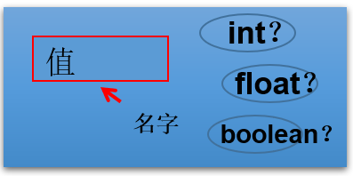
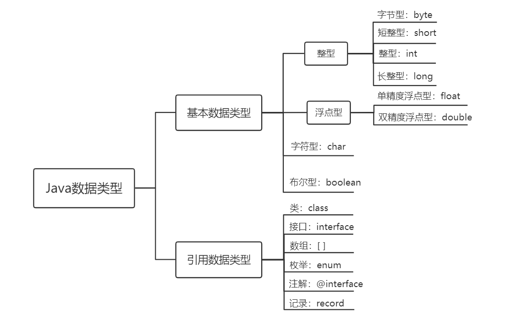

# 第二章：变量与运算符

**目录：**

[TOC]

---

本章专题与脉络：


## 一、关键字（keyword）

关键字定义：被 Java 语言赋予了特殊含义，用做专门用途的字符串（或单词）。
* HelloWorld 案例中，出现的关键字有 `class`、`public`、`static`、`void` 等，这些单词已经被 Java 定义好了。

关键字的特点：全部关键字都是小写字母。

关键字比较多，不需要死记硬背，学到哪里记到哪里即可。

官方地址：[官方地址](https://docs.oracle.com/javase/tutorial/java/nutsandbolts/_keywords.html)。


> 说明：
> 1. 关键字一共 50 个，其中 `const` 和 `goto` 是保留字（reserved word）；
> 2. `true`、`false`、`null` 不在其中，它们看起来像关键字，其实是字面量，表示特殊的布尔值和空值。


## 二、标识符（identifier）

Java 中变量、方法、类等要素命名时使用的字符序列，称为标识符。

技巧：凡是自己可以起名字的地方都叫标识符。比如：类名、方法名、变量名、包名、常量名等。

标识符的命名规则（必须遵守的硬性规定）：
* 由 26 个英文字母大小写、`0` - `9`、`_` 或 `$` 组成；
* 数字不可以开头；
* 不可以使用关键字和保留字，但能包含关键字和保留字；
* Java 中严格区分大小写，长度无限制；
* 标识符不能包含空格。

> 练习：miles（√）、Test（√）、a++（×）、--a（×）、4#R（×）、$4（√）、#44（×）、apps（√）、class（×）、public（×）、int（√）、x（√）、y（√）、radius（√）。

标识符的命名规范（建议遵守的软性要求，否则工作时容易被鄙视）：
* 包名：多单词组成时所有字母都小写：`xxxyyyzzz`。
  * 例如：`java.lang`、`com.atguigu.bean`。
* 类名、接口名：多单词组成时，所有单词的首字母大写（大驼峰）：`XxxYyyZzz`。
  * 例如：`HelloWorld`、`String`、`System` 等。
* 变量名、方法名：多单词组成时，第一个单词首字母小写，第二个单词开始每个单词首字母大写（小驼峰）：`xxxYyyZzz`。
  * 例如：`age`、`name`、`bookName`、`main`、`binarySearch`、`getName`。
* 常量名：所有字母都大写，多单词时每个单词用下划线连接：`XXX_YYY_ZZZ`。
  * 例如：`MAX_VALUE`、`PI`、`DEFAULT_CAPACITY`。

> 注意：在起名字时，为了提高阅读性，要尽量有意义，“见名知意”。

> 更多细节详见《代码整洁之道_关于标识符.txt》《阿里巴巴Java开发手册-1.7.1-黄山版》。

## 三、变量

### 3.1 为什么需要变量


一花一世界，如果把一个程序看做一个世界或一个社会的话，那么变量就是程序世界的花花草草、万事万物。即，变量是程序中不可或缺的组成单位，最基本的存储单元。

### 3.2 初识变量

变量的概念：内存中的一个存储区域，该区域的数据可以在同一类型范围内不断变化。

变量的构成包含三个要素：数据类型、变量名、存储的值。

Java 中变量声明的格式：`数据类型 变量名 = 变量值`。


> 根据定义变量时是否需要强制指定数据类型，编程语言可分为强类型语言和弱类型语言。
> 
> Java 为强类型语言。

变量的作用：用于在内存中保存数据。

使用变量时需注意：
* Java 中每个变量必须先声明、后使用。
* 使用变量名来访问这块区域的数据。
* 变量的作用域为其定义所在的一对 `{ }` 内。
* 变量都有其作用域，变量只有在其作用域内才有效；出了作用域，变量不可以再被调用。
* 同一个作用域内，不能定义重名的变量。

定义变量时，变量名要遵循标识符命名的规则和规范。

定义变量的方式有两种：
* 方式 1 - 先声明后赋值：
```java
char gender;    // 过程 1：变量的声明
gender = '男';  // 过程 2：变量的赋值（或初始化）
```
* 方式 2 - 声明与初始化合并：
```java
int age = 10;
```

> 说明：
> * 变量都有其作用域。变量只在作用域内是有效的，出了作用域就失效了。
> * 在同一个作用域内，不能声明两个同名的变量。
> * 定义好变量以后，就可以通过变量名的方式对变量进行调用和运算。
> * 变量值在赋值时，必须满足变量的数据类型，并且在数据类型有效的范围内变化。

### 3.3 Java 中变量的数据类型

Java 中的变量按照数据类型来分类，可分为两大类：
* 基本数据类型（8 种）：
  * 整型：`byte`、`short`、`int`、`long`；
  * 浮点型：`float`、`double`；
  * 字符型：`char`；
  * 布尔型：`boolean`。
* 引用数据类型：
  * 类（class）；
  * 数组（array）；
  * 接口（interface）；
  * 枚举（enum）；
  * 注解（annotation）；
  * 记录（record）。



### 3.4 变量的使用

#### 3.4.1 步骤 1：变量的声明

变量声明的语法格式：
```java
数据类型 变量名
```

示例代码：
```java
// 例如：
// 存储一个整数类型的年龄
int age;

// 存储一个小数类型的体重
double weight;

// 存储一个单字符类型的性别
char gender;

// 存储一个布尔类型的婚姻状态
boolean marry;

// 存储一个字符串类型的姓名
String name;

// 声明多个同类型的变量
int a, b, c;    // 表示 a、b、c 三个变量都是 int 类型
```

> 注意：变量的数据类型可以是基本数据类型，也可以是引用数据类型。

#### 3.4.2 步骤 2：变量的赋值

给变量赋值，就是把“值”存到该变量代表的内存空间中。同时，给变量赋的值类型必须与变量声明的类型一致或兼容。

变量赋值的语法格式：
```java
变量名 = 值;
```

举例 1 - 可以使用合适类型的常量值给已经声明的变量赋值：
```java
age = 18;
weight = 109;
gender = '女';
```

举例 2 - 可以使用其他变量或者表达式给变量赋值：
```java
int m = 1;
int n = m;

int x = 1;
int y = 2;
int z = 2 * x + y;
```

举例 3 - 变量可以反复赋值：
```java
// 先声明，后初始化
char gender;
gender = '女';

// 给变量重新赋值，修改 gender 变量的值
gender = '男';
System.out.println("gender = " + gender);   // gender = 男
```

举例 4 - 也可以将变量的声明和赋值一并执行：
```java
boolean isBeauty = true;
String name = "迪丽热巴";
```

内存结构如图：


## 四、基本数据类型介绍

### 4.1 整数类型：byte、short、int、long

Java 各整数类型有固定的表数范围和字段长度，不受具体操作系统的影响，以保证 Java 程序的可移植性。


若定义 `long` 类型的变量，在赋值时需要以“`l`”或“`L`”作为后缀。

Java 程序中变量通常声明为 `int` 型，除非不足以表示较大的数，才使用 `long`。

Java 的整型常量默认为 `int` 型。

#### 4.1.1 补充：计算机存储单位

字节（Byte）：是计算机用于计量存储容量的基本单位，一个字节等于 8 bit。

位（bit）：是数据存储的最小单位。二进制数系统中，每个 0 或 1 就是一个位，叫做 bit（比特），其中 8 bit 就称为一个字节（Byte）。

转换关系：
* 8 bit = 1 Byte；
* 1024 Byte = 1 KB；
* 1024 KB = 1 MB；
* 1024 MB = 1 GB；
* 1024 GB = 1 TB。

### 4.2 浮点类型：float、double

与整数类型类似，Java 浮点类型也有固定的表数范围和字段长度，不受具体操作系统的影响。


浮点型常量有两种表示形式：
* 十进制数形式。如：`5.12`、`512.0f`、`.512`（必须有小数点）；
* 科学计数法形式。如：`5.12e2`、`512E2`、`100E-2`。

`float`：单精度，尾数可以精确到 7 位有效数字。
* `float` 类型占用的空间比 `long` 类型小，但表示的范围比 `long` 类型更大；
* 很多情况下，精度很难满足需求。

`double`：双精度，精度是 `float` 的两倍。
* 通常采用此类型。

定义 `float` 类型的变量，赋值时需要以“`f`”或“`F`”作为后缀。

Java 的浮点型常量默认为 double 型。

#### 4.2.1 关于浮点型精度的说明

并不是所有的小数都能可以精确地用二进制浮点数表示。二进制浮点数不能精确地表示 `0.1`、`0.01`、`0.001` 这样的 10 的负次幂。

浮点类型 `float`、`double` 的数据不适合在不容许舍入误差的金融计算领域。如果需要精确数字计算或保留指定位数的精度，需要使用 `BigDecimal` 类。

测试用例：
```java
// 测试 1：
// （解释见章末企业真题：为什么 0.1 + 0.2 不等于 0.3）
System.out.println(0.1 + 0.2) // 0.30000000000000004

// 测试 2：
float ff1 = 123123123f;
float ff2 = ff1 + 1;
System.out.println(ff1);  // 1.2312312E8
System.out.println(ff2);  // 1.2312312E8
System.out.println(ff1 == ff2); // true
```

#### 4.2.2 应用举例

案例 1：定义圆周率并赋值为 3.14，现有 3 个圆的半径分别为 1.2、2.5、6，求它们的面积。
```java
public class FloatDoubleExer {
    public static void main(String[] args) {
        // 定义圆周率变量
        double pi = 3.14;
        // 定义三个圆的半径
        double radius1 = 1.2;
        double radius2 = 2.5;
        int radius3 = 6;

        // 计算面积
        double area1 = pi * radius1 * radius1;
        double area2 = pi * radius2 * radius2;
        double area3 = pi * radius3 * radius3;

        System.out.println("圆 1 的半径为：" + radius1 + "，面积为：" + area1);
        System.out.println("圆 2 的半径为：" + radius2 + "，面积为：" + area2);
        System.out.println("圆 3 的半径为：" + radius3 + "，面积为：" + area3);
    }
}
```

案例 2：小明要到美国旅游，可是那里的温度是以华氏度为单位记录的。它需要一个程序将华氏温度（80 度）转换为摄氏度，并以华氏度和摄氏度为单位分别显示该温度。
> 提示：`℃ = (℉ - 32) / 1.8`。
```java
public class FloatDoubleExer1 {
    public static void main(String[] args) {
        double oF = 80;
        double oC = (oF - 32) / 1.8;

        System.out.println("华氏度 " + oF + "℉ 对应的摄氏度为 " + oC + "℃");
    }
}
```

