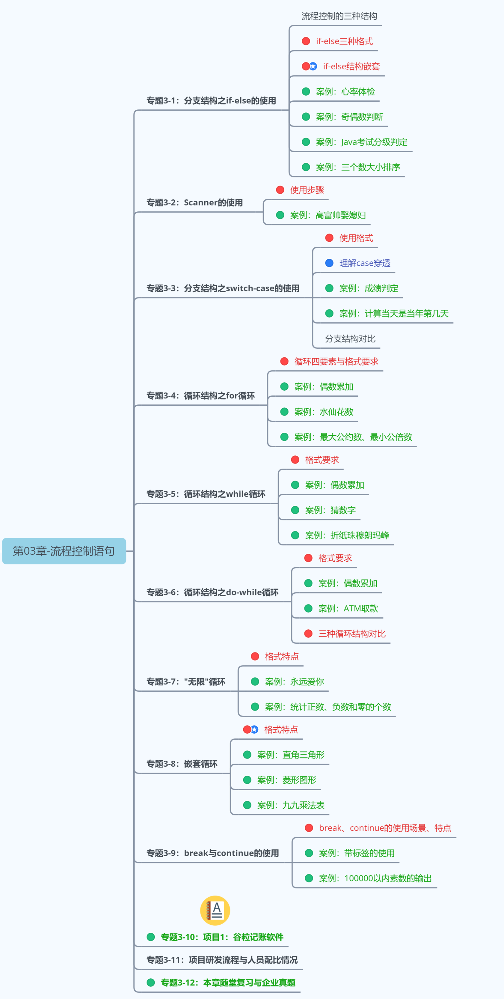
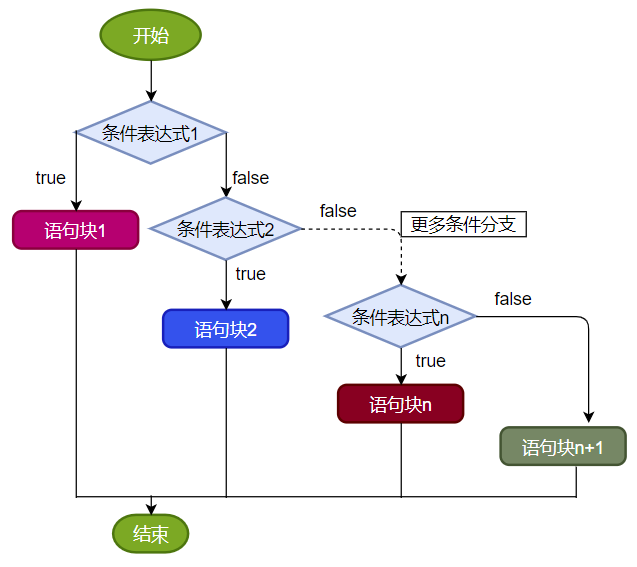
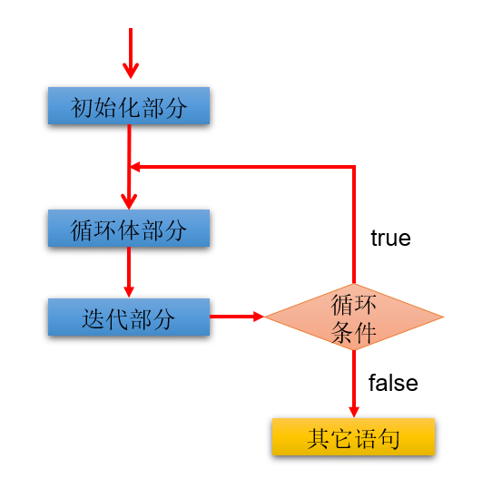
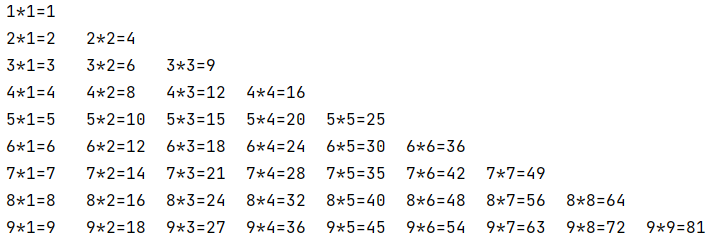
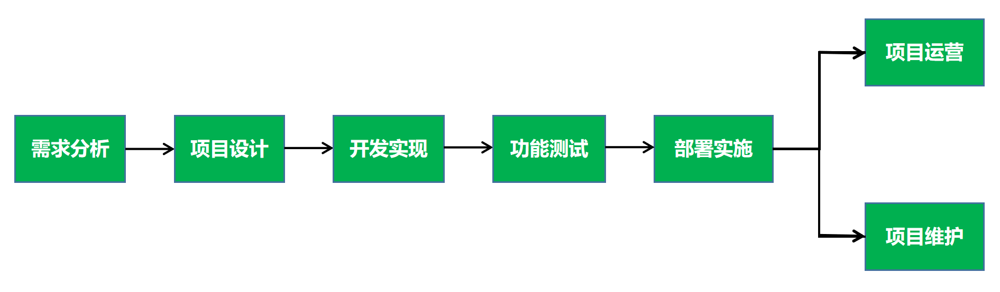
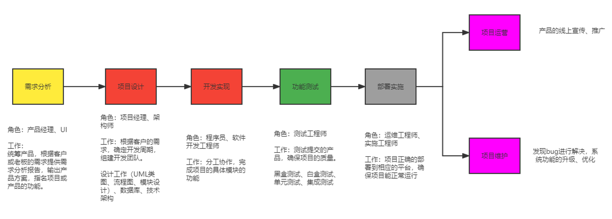
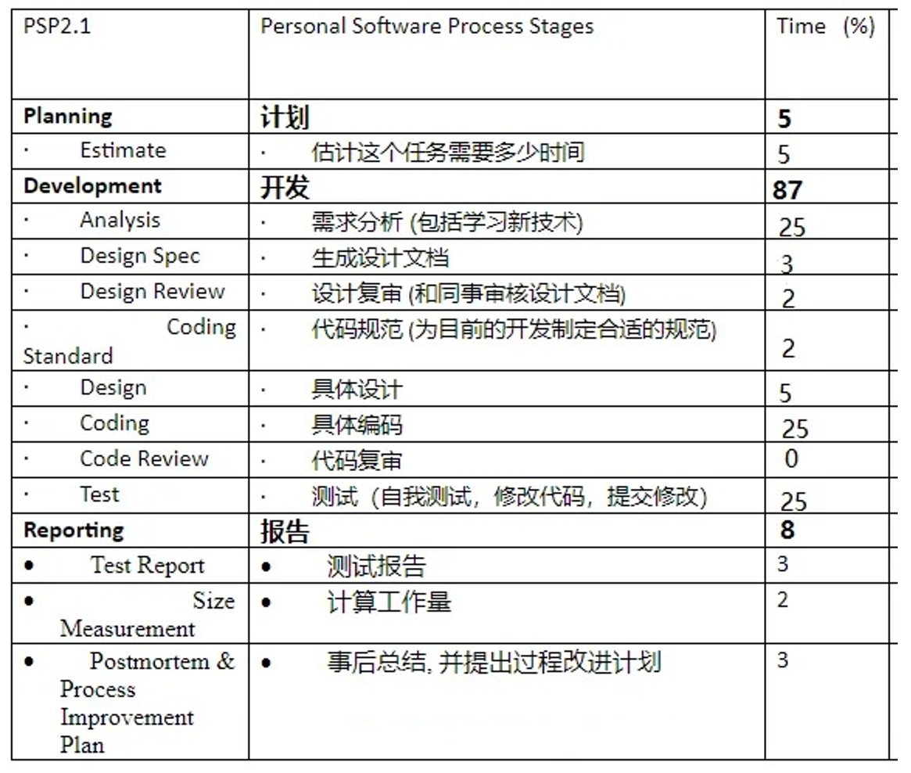
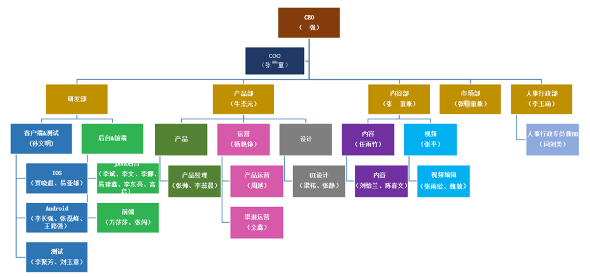

# 第三章：流程控制语句

**目录：**

[TOC]

---

本章专题与脉络：


流程控制语句是用来控制程序中各语句执行顺序的语句，可以把语句组合成能完成一定功能的小逻辑模块。

程序设计中规定的三种流程结构，即：
* 顺序结构：程序从上到下逐行地执行，中间没有任何判断和跳转。
* 分支结构：根据条件，选择性地执行某段代码。
  * 有 `if…else`（条件判断结构）和 `switch - case`（选择结构）两种分支语句。
* 循环结构：根据循环条件，重复性地执行某段代码。
  * 有 `for`、`while`、`do - while` 三种循环语句。
  * 补充：JDK 5.0 提供了 `foreach` 循环（增强 `for` 循环），方便遍历集合、数组元素（第 12 章 集合 中讲解）。

## 一、顺序结构

顺序结构就是程序从上到下逐行地执行。表达式语句都是顺序执行的，并且上一行对某个变量的修改对下一行会产生影响。


示例代码：
```java
public class StatementTest {
    public static void main(String[] args) {
        int x = 1;
        int y = 2;
        System.out.println("x = " + x);
        System.out.println("y = " + y);
        // 对 x、y 的值进行修改
        x++;
        y = 2 * x + y;
        x = x * 10;
        System.out.println("x = " + x);
        System.out.println("y = " + y);
    }
}

```

Java 中定义变量时采用合法的前向引用，如：
```java
public static void main(String[] args) {
    int num1 = 12;
    int num2 = num1 + 2;
}
```
错误形式：
```java
public static void main(String[] args) {
    int num2 = num1 + 2;
    int num1 = 12;
}
```

## 二、分支语句

### 2.1 if - else 条件判断结构

#### 2.1.1 结构 1：单分支条件判断

单分支条件判断 `if` 格式：
```java
if (条件表达式) {
    语句块;
}
```
需要注意的是，当语句块只有一条执行语句时，对应的语句块的一对 `{}` 可以省略，但建议保留。

> 说明：条件表达式必须是布尔表达式（关系表达式或逻辑表达式）或布尔变量。
>
> 条件表达式错误示例如下：
> ```java
> if (60 <= heartBeats <= 100) {
>     ...
> }
> ```
> 程序在执行时会首先计算 `60 <= heartBeats` 表达式的值，计算得出的 `boolean` 类型的结果无法与整数类型的 `100` 进行比较，因此会报错。
>
> 条件表达式正确示例如下：
> ```java
> if (heartBeats >= 60 && heartBeats <= 100) {
>     ...
> }
> ```
> 也可以将上述正确示例中的条件表达式改为 `!(heartBeats < 60 || heartBeats > 100)`，判断结果是一样的。

执行流程：
1. 首先判断条件表达式看其结果是 `true` 还是 `false`；
2. 根据条件表达式的结果进行分支：
   * 如果是 `true` 就执行语句块；
   * 如果是 `false` 就不执行语句块。


#### 2.1.2 结构 2：双分支条件判断

双分支条件判断 `if ... else` 格式：
```java
if (条件表达式) {
    语句块 1;
} else {
    语句块 2;
}
```

执行流程：
1. 首先判断条件表达式看其结果是 `true` 还是 `false`；
2. 根据条件表达式的结果进行分支：
   * 如果是 `true` 就执行语句块 1；
   * 如果是 `false` 就执行语句块 2。


#### 2.1.3 结构 3：多分支条件判断

多分支条件判断 `if ... else if ... else` 格式：
```java
if (条件表达式 1) {
    语句块 1;
} else if (条件表达式 2) {
    语句块 2;
}
...
} else if (条件表达式 n) {
    语句块 n;
} else {
    语句块 n + 1;
}
```
在实际开发中，当 `if - else` 结构是“多选一”时，最后的 `else` 是可选的，根据需要可以省略。

> 说明：一旦条件表达式为 `true`，则进入执行相应的语句块；执行完对应的语句块之后，就跳出当前结构。

执行流程：
1. 首先判断关系表达式 1 看其结果是 `true` 还是 `false`；
2. 根据条件表达式 1 的结果进行分支：
   * 如果是 `true` 就执行语句块 1，然后结束当前多分支；
   * 如果是 `false` 就继续判断关系表达式 2 看其结果是 `true` 还是 `false`：
     * 如果是 `true` 就执行语句块 2，然后结束当前多分支；
     * 如果是 `false` 就继续判断关系表达式 3 看其结果是 `true` 还是 `false`：
       * ...
         * 如果没有任何关系表达式为 `true`，就执行语句块 n + 1，然后结束当前多分支。



案例：
> 岳小鹏参加 Java 考试，他和父亲岳不群达成承诺：如果成绩为 100 分时，奖励一辆跑车；成绩为 (80, 99] 时，奖励一辆山地自行车；当成绩为 [60, 80] 时，奖励环球影城一日游；其他时，胖揍一顿。
>
> 说明：默认成绩是在 [0, 100] 范围内。

示例代码：
```java
int score = 61;
if (score == 100) {
    System.out.println("奖励一辆跑车");
} else if (score > 80 && score <= 99) {
    System.out.println("奖励一辆山地自行车");
} else if (score >= 60 && score <= 80) {
    System.out.println("奖励环球影城一日游");
} else {
    System.out.println("胖揍一顿");
}
```

> 注意：
> * 当条件表达式之间是“互斥”关系时（即彼此没有交集），条件判断语句及执行语句间顺序无所谓：
> 
> * 当条件表达式之间是“包含”关系时，例如“小上大下 / 子上父下”，则需要将范围小的条件表达式声明在范围大的条件表达式的上面，不能随意调换条件的顺序，否则范围小的条件表达式将不可能被执行：
> 

#### 2.1.4 结构 4：if ... else 嵌套

在 `if` 的语句块中或者是在 `else` 的语句块中，又包含了另外一个条件判断（可以是单分支、双分支、多分支），就构成了嵌套结构。

嵌套结构执行的特点：
* 如果是嵌套在 `if` 语句块中的，只有当外部的 `if` 条件满足，才会去判断内部的条件；
* 如果是嵌套在 `else` 语句块中的，只有当外部的 `if` 条件不满足从而进入 `else` 后，才会去判断内部的条件。

从开发经验上讲，没有写过超过三层的嵌套 `if - else` 结构。

案例：
> 由键盘输入三个整数，分别存入变量 `num1`、`num2`、`num3`，对它们进行排序（使用 `if - else if - else`），并且从小到大输出。

示例代码：
```java
int num1 = 30;
int num2= 21;
int num3 = 44;

if (num1 >= num2) {
    if (num3 >= num1) {
        System.out.println(num2 + "，" + num1 + "，" + num3);
    } else if (num3 <= num2) {
        System.out.println(num3 + "，" + num2 + "，" + num1);
    } else {
        System.out.println(num2 + "，" + num3 + "，" + num1);
    }
} else {    // num1 < num2
    if (num3 >= num2) {
        System.out.println(num1 + "，" + num2 + "，" + num3);
    } else if (num3 <= num1) {
        System.out.println(num3 + "，" + num1 + "，" + num2);
    } else {
        System.out.println(num1 + "，" + num3 + "，" + num2);
    }
}
```

### 2.2 switch - case 选择结构

#### 2.2.1 基本语法

`switch - case` 选择结构基本语法如下：
```java
switch (表达式) {
    case 常量值 1:
        语句块 1;
        [break;]
    case 常量值 2:
        语句块 2;
        [break;]
    ...
    [default:
        语句块 n + 1;
        [break;]
    ]
}
```

执行流程图如下所示：


执行过程：
1. 根据 `switch` 中表达式的值，依次匹配各个 `case`；如果表达式的值等于某个 `case` 中的常量值，则执行对应 `case` 中的执行语句。
2. 执行完此 `case` 的执行语句以后：
    * 情况 1：如果遇到 `break`，则执行 `break` 并跳出当前的 `switch - case` 结构；
    * 情况 2：如果没有遇到 `break`，则会继续执行当前 `case` 之后的其他 `case` 中的执行语句（`case` 穿透）；
      * ...
      * 直到遇到 `break` 关键字或执行完所有的 `case` 及 `default` 的执行语句，跳出当前的 `switch - case` 结构。

> 注意：
> * `switch (表达式)` 中表达式的值必须是下述几种类型之一：`byte`、`short`、`char`、`int`、`枚举`（jdk 5.0）、`String`（jdk 7.0）。
> * `case` 子句中的值必须是常量，不能是变量名、不确定的表达式值或范围。
> * 同一个 `switch` 语句，所有 `case` 子句中的常量值互不相同。
> * `break` 语句用来在执行完一个 `case` 分支后使程序跳出 `switch` 语句块；如果没有 `break`，程序会顺序执行到 `switch` 结尾。
> * `default` 子句是可选的，同时位置也是灵活的（如果 `default` 子句非置于 `switch - case` 结构末尾，需要注意 `default `子句的 `case` 穿透）；当没有匹配的 `case` 时，执行 `default` 语句。

示例代码：
```java
int num = 1;
switch (num) {
    case 0:
        System.out.println("zero");
        break;
    case 1:
        System.out.println("one");
        break;  // 结束当前的 switch - case 结构
    case 2:
        System.out.println("two");
        break;
    case 3:
        System.out.println("three");
        break;
    default:
        System.out.println("other");
        break;
}

// 另例
String season = "summer";
switch (season) {
    case "spring":
        System.out.println("春暖花开");
        break;
    case "summer":
        System.out.println("夏日炎炎");
        break;
    case "autumn":
        System.out.println("秋高气爽");
        break;
    case "winter":
        System.out.println("冬雪皑皑");
        break;
    default:
        System.out.println("季节输入有误");
        break;
}

// 错误的例子：编译不通过
/*
int number = 20;
switch (number) {
    case number > 0:
        System.out.println("正数");
        break;
    case number < 0:
        System.out.println("负数");
        break;
    default:
        System.out.println("零");
        break;
}
*/
```

#### 2.2.2 利用 case 的穿透性

在 `switch` 语句中，如果 `case` 的后面不写 `break`，将出现穿透现象；也就是一旦匹配成功，不会再判断下一个 `case` 的值，而是直接向后运行，直到遇到 `break` 或者整个 `switch` 语句结束，执行终止。

#### 2.2.3 if - else 语句与 switch - case 语句比较

结论：凡是使用 `switch - case` 的结构都可以转换为 `if - else` 结构；反之，不成立。

开发经验：如果既可以使用 `switch - case`，又可以使用 `if - else`，建议使用 `switch - case`，因为效率稍高。

细节对比：
* `if - else` 语句优势：
  * `if` 语句的条件是一个布尔类型值，`if` 条件表达式为 `true` 则进入分支，可以用于范围的判断，也可以用于等值的判断，使用范围更广。
  * `switch` 语句的条件是一个常量值（`byte`、`short`、`int`、`char`、`枚举`、`String`），只能判断某个变量或表达式的结果是否等于某个常量值，使用场景较狭窄。
* `switch` 语句优势：
  * 当条件是判断某个变量或表达式是否等于某个固定的常量值时，使用 `if` 和 `switch` 都可以，但习惯上使用 `switch` 更多，因为效率稍高；当条件是区间范围的判断时，只能使用 `if` 语句。
  * 使用 `switch` 可以利用穿透性，同时执行多个分支，而 `if ... else` 没有穿透性。

#### 2.2.4 课后练习

**案例 1：**
> 使用 `switch - case` 实现：对学生成绩大于 60 分的，输出“合格”；低于 60 分的，输出“不合格”。

示例代码：
* 方式 1（不推荐）：
```java
class SwitchCaseTest1 {
    public static void main(String[] args) {
        // 定义一个学生成绩的变量
        int score = 78;

        // 根据需求，进行分支
        switch (score) {
            case 0:
                System.out.println("不及格");
                break;
            case 1:
                System.out.println("不及格");
                break;
            // ...

            case 100:
                System.out.println("及格");
                break;
            default:
                System.out.println("成绩输入有误");
                break;
        }
    }
}

```
* 方式 2（`case` 穿透）：
```java
class SwitchCaseTest1 {
    public static void main(String[] args) {
        // 定义一个学生成绩的变量
        int score = 78;

        // 根据需求，进行分支
        switch (score / 10) {
            case 0:
            case 1:
            case 2:
            case 3:
            case 4:
            case 5:
                System.out.println("不及格");
                break;
            case 6:
            case 7:
            case 8:
            case 9:
            case 10:
                System.out.println("及格");
                break;
            default:
                System.out.println("成绩输入有误");
                break;
        }
    }
}

```
* 方式 3：
```java
class SwitchCaseTest1 {
    public static void main(String[] args) {
        // 定义一个学生成绩的变量
        int score = 78;

        // 根据需求，进行分支
        switch (score / 60) {
            case 0:
                System.out.println("不及格");
                break;
            case 1:
                System.out.println("及格");
                break;
            default:
                System.out.println("成绩输入有误");
                break;
        }
    }
}

```

**案例 2：**
> 编写程序：从键盘上输入 2023 年的“`momth`”和“`day`”，要求通过程序输出输入的日期为 2023 年的第几天。

示例代码：
```java
import java.util.Scanner;

public class SwitchCaseTest2 {
    public static void main(String[] args) {
        // 1. 使用 Scanner，从键盘获取 2023 年的 month、day
        Scanner input = new Scanner(System.in);

        System.out.println("请输入 2023 年的月份：");
        int month = input.nextInt();    // 阻塞式方法

        System.out.println("请输入 2023 年的天：");
        int day = input.nextInt();    // 阻塞式方法

        // 假设用户输入的数据是合法的；后期我们在开发中，使用正则表达式进行校验

        // 2. 使用 switch - case 实现分支结构
        int sumDays = 0;    // 记录总天数
        switch (month) {
            case 12:
                sumDays += 30;  // 30：11 月份的总天数
            case 11:
                sumDays += 31;  // 31：10 月份的总天数
            case 10:
                sumDays += 30;  // 30：9 月份的总天数
            case 9:
                sumDays += 31;  // 31：8 月份的总天数
            case 8:
                sumDays += 31;  // 31：7 月份的总天数
            case 7:
                sumDays += 30;  // 30：6 月份的总天数
            case 6:
                sumDays += 31;  // 31：5 月份的总天数
            case 5:
                sumDays += 30;  // 30：4 月份的总天数
            case 4:
                sumDays += 31;  // 31：3 月份的总天数
            case 3:
                sumDays += 28;  // 28：2 月份的总天数
            case 2:
                sumDays += 31;  // 31：1 月份的总天数
            case 1:
                sumDays += day;
                break;
        }

        System.out.println("2023 年" + month + "月" + day + "日是当前的第" + sumDays + "天");

        input.close();  // 为了防止内存泄漏
    }
}

```
> 拓展：
> 
> 上述题目的需求可进一步改写为：从键盘分别输入年、月、日，判断这一天是当年的第几天。修改后的题目需要判断当年是否为闰年，以决定二月的天数。
> 判断一年是否是闰年的标准为：可以被 4 整除但不可被 100 整除，或可以被 400 整除。例如：1900、2200 能被 4 整除但同时能被 100 整除，也不能被 400 整除，因此不是闰年。

## 三、循环语句

理解：循环语句具有在某些条件满足的情况下，反复执行特定代码的功能。

循环结构分类：
* `for` 循环；
* `while` 循环；
* `do - while` 循环。

循环结构四要素：
* 初始化部分；
* 循环条件部分；
* 循环体部分；
* 迭代部分。

### 3.1 for 循环

#### 3.1.1 基本语法

`for` 循环语法格式：
```java
for (①初始化部分; ②循环条件部分; ④迭代部分) {
    ③循环体部分;
}
```
执行过程：① -> ② -> ③ -> ④ -> ② -> ③ -> ④ -> ② -> ③ -> ④ -> ... -> ②。

图示：


说明：
* `for ( ; ;)` 中的两个 `;` 不能多也不能少；
* `①初始化部分` 可以声明多个变量，但必须是同一个类型，用逗号分隔；
* `②循环条件部分` 为 `boolean` 类型的变量或表达式，当值为 `false` 时，退出循环；
* `④迭代部分` 可以有多个变量更新，用逗号分隔。

#### 3.1.2 应用举例

**案例 1** - 使用 `for` 循环重复执行某些语句：
> 题目：输出 5 行 `HelloWorld`。

示例代码：
```java
class ForTest {
    public static void main(String[] args) {
        for (int i = 1; i <= 5; i++) {
            System.out.println("HelloWorld");
        }
    }
}

```

在上述示例代码中，变量 `i` 的作用域为 `for` 循环内部。如果将上述示例代码修改为以下：
```java
class ForTest {
    public static void main(String[] args) {
        for (int i = 1; i <= 5; i++) {
            System.out.println("HelloWorld");
        }

        System.out.println(i);
    }
}

```
此时编译不通过，因为 `i` 已经出了其作用域范围。

**案例 2** - 格式的多样性：
> 题目：
>
> 给出以下代码：
> ```java
> class ForTest {
>     public static void main(String[] args) {
>         int num = 1;
>         for (System.out.print("a"); num < 3; System.out.print("c"), num++) {
>             System.out.print("b");
>         }
>     }
> }
> 
> ```
> 写出输出的结果。

输出结果：
```java
abcbc
```

**案例 3** - 累加的思想：
> 题目：遍历 1 - 100 以内的偶数，并获取偶数的个数以及所有的偶数的和。

示例代码：
```java
class ForTest {
    public static void main(String[] args) {
        int count = 0;  // 记录偶数的个数
        int sum = 0;    // 记录所有偶数的和
        for (int i = 1; i <= 100; i++) {
            if (i % 2 == 0) {
                System.out.println(i);
                count++;
                sum += i;
            }
        }

        System.out.println("偶数的个数为：" + count);
        System.out.println("偶数的总和为：" + sum);
    }
}

```

**案例 4** - 结合分支结构使用：
> 题目：输出所有的水仙花数，所谓水仙花数是指一个 3 位数，其各个位上数字立方和等于其本身。例如：153 = 1 * 1 * 1 + 3 * 3 * 3 + 5 * 5 * 5。

示例代码：
```java
class ForTest1 {
    public static void main(String[] args) {
        // 遍历所有的 3 位数
        for (int i = 100; i <= 999; i++) {
            // 针对每一个三位数 i，获取其各个位上数值
            int unit_digit = i % 10;    // 个位
            int ten_digit = i / 10 % 10;    // 十位
            int hundred_digit = i / 100;    // 百位

            // 判断是否满足水仙花数的规则
            if (i == unit_digit * unit_digit * unit_digit + ten_digit * ten_digit * ten_digit + hundred_digit * hundred_digit * hundred_digit) {
                System.out.println(i);
            }
        }
    }
}

```

**案例 5** - 结合 `break` 使用：
> 题目：输入两个正整数 `m` 和 `n`，求其最大公约数和最小公倍数。
> 
> 比如：12 和 20 的最大公约数是 4，最小公倍数是 60。
>
> 提示：
> * 约数：
>   * 12 为例，约数有 1、2、3、4、6、12；
>   * 20 为例，约数有 1、2、4、5、10、20。
> * 倍数：
>   * 12 为例，倍数有 12、24、36、48、60、72 ...
>   * 20 为例，倍数有 20、40、60、80 ...

示例代码：
```java
class ForTest2 {
    public static void main(String[] args) {
        int m = 12;
        int n = 20;

        // 需求 1：最大公约数
        // 获取 m 和 n 中的较小值
        int min = (m < n) ? m : n;
        // 方式 1：
        int result = 1;
        for (int i = 1; i <= min; i++) {
            if (m % i == 0 && n % i == 0) {
                // System.out.println(i);
                result = i;
            }
        }

        System.out.println(result);

        // 方式 2（推荐）：
        for (int i = min; i >= 1; i--) {
            if (m % i == 0 && n % i == 0) {
                System.out.println(i);
                break;  // 一旦执行，就跳出当前循环结构
            }
        }

        // 需求 2：最小公倍数
        // 获取 m 和 n 中的较大值
        int max = (m > n) ? m : n;
        for (int i = max; i <= m * n; i++) {
            if (i % m == 0 && i % n == 0) {
                System.out.println(i);
                break;
            }
        }
    }
}

```

说明：
1. 我们可以在循环中使用 `break`；一旦执行 `break`，就跳出当前循环结构。
2. 小结：如何结束一个循环结构？
    * 结束情况 1：循环结构中的循环条件部分返回 `false`；
    * 结束情况 2：循环结构中执行了 `break`。
3. 如果一个循环结构不能结束，那就是一个死循环！我们在开发中要避免出现死循环。

### 3.2 while 循环

#### 3.2.1 基本语法

while 循环的语法格式：
```java
①初始化部分;
while (②循环条件部分) {
    ③循环体部分;
    ④迭代部分;
}
```
执行过程：① -> ② -> ③ -> ④ -> ② -> ③ -> ④ -> ② -> ③ -> ④ -> ... -> ②。

图示：


说明：
* `while (循环条件)` 中循环条件必须是 `boolean` 类型。
* 注意不要忘记声明 `④迭代部分`；否则，循环将不能结束，变成死循环。
* `for` 循环和 `while` 循环可以相互转换，二者没有性能上的差别；实际开发中，根据具体结构的情况，选择格式更合适、美观者。
* `for` 循环与 `while` 循环的区别：初始化条件部分的作用域不同，while 循环中的初始化条件在 while 循环结束后依然有效。

#### 3.2.2 应用举例

**案例 1** - 使用 `while` 循环重复执行某些语句：
> 题目：遍历 50 次 `HelloWorld!`。

示例代码：
```java
class WhileTest {
    public static void main(String[] args) {
        int i = 1;
        while (i <= 50) {
            System.out.println("HelloWorld!");
            i++;    // 一定要小心！不要丢了！
        }
    }
}

```

**案例 2** - 累加的思想：
> 题目：遍历 1 - 100 的偶数，并计算所有偶数的和以及偶数的个数。

示例代码：
```java
class WhileTest {
    public static void main(String[] args) {
        int j = 1;
        
        int count = 0;  // 记录偶数的个数
        int sum = 0;    // 记录偶数的总和
        while (j <= 100) {
            if (j % 2 == 0) {
                System.out.println(j);
                count++;
                sum += j;
            }
            j++;
        }

        System.out.println("偶数的个数为：" + count);
        System.out.println("偶数的总和为：" + sum);
    }
}

```

**案例 3** - 猜数字游戏：
> 题目：
>
> 随机生成一个 100 以内的数，猜这个随机数是多少？
> 从键盘输入数，如果大了则提示大了，如果小了则提示小了，如果对了就不再猜了，并统计一共猜了多少次。
>
> 提示：生成一个 `[a, b]` 范围的随机数的方式：`(int)(Math.random() * (b - a + 1) + a)`。

示例代码：
```java
import java.util.Scanner;
class WhileTest1 {
    public static void main(String[] args) {
        // 1. 生成一个 [1, 100] 范围的随机整数
        int random = (int)(Math.random() * 100) + 1;

        // 2. 使用 Scanner，从键盘获取数据
        Scanner scan = new Scanner(System.in);
        System.out.println("请输入 1 - 100 范围的一个整数：");
        int guess = scan.nextInt();

        // 3. 声明一个变量，记录猜的次数
        int guessCount = 1;

        // 4. 使用循环结构，进行多次循环的对比和获取数据
        while (random != guess) {
            if (guess > random) {
                System.out.println("你输入的数据大了");
            } else if (guess < random) {
                System.out.println("你输入的数据小了");
            }// else {
            //    break;
            //}

            System.out.println("请输入 1 - 100 范围的一个整数：");
            guess = scan.nextInt();
            guessCount++;
        }

        // 能结束循环，就意味着 random 和 guess 相等了
        System.out.println("恭喜你！猜对了！");
        System.out.println("共猜了 " + guessCount + " 次");

        scan.close();
    }
}

```

**案例 4** - 折纸珠穆朗玛峰：
> 题目：
> 
> 世界最高山峰是珠穆朗玛峰，它的高度是 8848.86 米。假如我有一张足够大的纸，它的厚度是 0.1 毫米。
> 请问，我折叠多少次，可以折成珠穆朗玛峰的高度（即纸的厚度超过珠峰的高度）？

示例代码：
```java
class WhileTest2 {
    public static void main(String[] args) {
        // 1. 声明珠峰的高度、纸的默认厚度
        double paper = 0.1; // 单位：毫米
        double zf = 8848860;    // 单位：毫米

        // 2. 定义一个变量，记录折纸的次数
        int count = 0;

        // 3. 通过循环结构，不断调整纸的厚度（当纸的厚度超过珠峰高度时，停止循环）
        while (paper <= zf) {
            paper *= 2;
            count++;
        }

        System.out.println("paper 的高度为：" + (paper / 1000) + " 米，超过了珠峰的高度 " + (zf / 1000) + " 米");
        System.out.println("共折纸 " + count + "次");
    }
}

```

### 3.3 do - while 循环

#### 3.3.1 基本语法

`do - while` 循环的语法格式：
```java
①初始化部分;
do {
    ③循环体部分;
    ④迭代部分;
} while (②循环条件部分);
```
执行过程：① -> ③ -> ④ -> ② -> ③ -> ④ -> ② -> ③ -> ④ -> ... -> ②。

图示：


说明：
* 结尾 `while (循环条件)` 中循环条件必须是 `boolean` 类型；
* `do { ... } while ( ... );` 最后有一个分号；
* `do - while` 结构的循环体语句是至少会执行一次，这个和 `for` 与 `while` 是不一样的；
* 循环的三个结构 `for`、`while`、`do - while` 三者是可以相互转换的。

#### 3.3.2 应用举例

**案例 1** - 累加的思想：
> 题目：遍历 1 - 100 的偶数，并计算所有偶数的和、偶数的个数。

示例代码：
```java
class DoWhileTest {
    public static void main(String[] args) {
        int i = 1;
        int count = 0;  // 记录偶数的个数
        int sum = 0;    // 记录偶数的总和

        do {
            if (i % 2 == 0) {
                System.out.println(i);
                count++;
                sum += i;
            }

            i++;
        } while (i <= 100);

        System.out.println("偶数的个数为：" + count);
        System.out.println("偶数的总和为：" + sum);
    }
}

```

**案例 2** - 体会 `do - while` 至少会执行一次循环体：

示例代码：
```java
class DoWhileTest {
    public static void main(String[] args) {
        int num1 = 10;
        while (num1 > 10) {
            System.out.println("while: hello");
            num1--;
        }

        int num2 = 10;
        do {
            System.out.println("do - while: hello");
            num2--;
        } while (num2 > 10);
    }
}

```

**案例 3** - ATM 取款：
> 题目：
>
> 声明变量 `balance` 并初始化为 `0`，用以表示银行账户的余额。
> 下面通过 ATM 机程序实现存款、取款等功能。
>
> 程序界面：
> ```java
> ========= ATM =========
>   1、存款
>   2、取款
>   3、显示余额
>   4、退出
> 请选择 (1 - 4)：
> ```
>
> 请完成该 ATM 机程序，实现上述功能。

示例代码：
```java
import java.util.Scanner;
class DoWhileTest1 {
    public static void main(String[] args) {
        // 1. 定义 balance 的变量，记录账户余额
        double balance = 0.0;

        boolean flag = true;    // 控制循环的结束

        Scanner scan = new Scanner(System.in);  // 实例化 Scanner

        // 2. 生成 ATM 取款的界面
        do {
            // 2. 生成 ATM 取款的界面
            System.out.println("========= ATM =========");
            System.out.println("  1、存款");
            System.out.println("  2、取款");
            System.out.println("  3、显示余额");
            System.out.println("  4、退出");
            System.out.println("请选择 (1 - 4)：");

            // 3. 使用 Scanner 获取用户的选择
            int selection = scan.nextInt();

            switch (selection) {
                // 4. 根据用户的选择，决定执行存款、取款、显示余额、退出的操作
                case 1:
                    System.out.println("请输入存款的金额：");
                    double money1 = scan.nextDouble();
                    if (money1 > 0) {
                        balance += money1;
                    }
                    break;
                case 2:
                    System.out.println("请输入取款的金额：");
                    double money2 = scan.nextDouble();
                    if (money2 > 0 && money2 <= balance) {
                        balance -= money2;
                    } else {
                        System.out.println("输入的数据有误或余额不足");
                    }
                    break;
                case 3:
                    System.out.println("账户余额为：" + balance);
                    break;
                case 4:
                    flag = false;
                    System.out.println("感谢使用，欢迎下次光临 ^_^");
                    break;
                default:
                    System.out.println("输入有误，请重新输入");
                    //break;
            }
        } while (flag);

        // 关闭资源
        scan.close();
    }
}

```

### 3.4 对比三种循环结构

三种循环结构都具有四个要素：
* 循环变量的初始化条件；
* 循环条件；
* 循环体语句块；
* 循环变量的修改的迭代表达式。

从循环次数角度分析：
* `do - while` 循环至少执行一次循环体语句；
* `for` 和 `while` 循环先判断循环条件语句是否成立，然后决定是否执行循环体。

如何选择：
* 遍历有明显的循环次数（范围）的需求，选择 `for` 循环；
* 遍历没有明显的循环次数（范围）的需求，选择 `while` 循环；
* 如果循环体语句块至少执行一次，可以考虑使用 `do - while` 循环；
* 本质上：三种循环之间完全可以互相转换，都能实现循环的功能。

### 3.5 “无限”循环

#### 3.5.1 基本语法

最简单的“无限”循环的语法格式：
* `while (true)`；
* `for (;;)`。

适用场景：
* 开发中，有时并不确定需要循环多少次，需要根据循环体内部某些条件来控制循环的结束（使用 `break`）；
* 如果此循环结构不能终止，则构成了死循环！开发中要避免出现死循环。

#### 3.5.2 应用举例

**案例 1**：
> 实现爱你到永远……

示例代码：
```java
class ForWhileTest {
    public static void main(String[] args) {
        for (;;) {//for (;true ; ) {//while (true) {
            System.out.println("I love you!");
        }

        // 死循环的后面不能有执行语句
        //System.out.println("end");
    }
}

```

> 思考：
> 
> 如下代码的执行效果是什么？
> ```java
> public class EndlessFor3 {
>     public static void main(String[] args) {
>         for (int i = 1; i <= 10; ) {    // 循环变量没有修改，条件永远成立，死循环
>             System.out.println("我爱你！");
>         }
>     }
> }
> 
> ```
> 由于 `for (int i = 1; i <= 10; )` 中循环变量没有修改，因此条件永远成立，造成死循环。
>
> 那么，如下代码的执行效果是什么？
> ```java
> public class EndlessFor4 {
>     public static void main(String[] args) {
>         for (int i = 1; i >= 10; ) {    // 一次都不执行
>             System.out.println("我爱你！");
>         }
>     }
> }
> 
> ```
> 由于 `for (int i = 1; i >= 10; )` 中初始化部分不满足循环条件，因此即使缺少迭代部分，循环体部分也一次都不执行。

**案例 2**：
> 从键盘读入个数不确定的整数，并判断读入的正数和负数的个数，输入为 `0` 时结束程序。

示例代码：
```java
import java.util.Scanner;
class ForWhileTest1 {
    public static void main(String[] args) {
        Scanner scan = new Scanner(System.in);

        int positiveCount = 0;  // 记录正数的个数
        int negativeCount = 0;  // 记录负数的个数

        while (true) {
            System.out.println("请输入一个整数（输入为 0 时结束程序）：");
            int num = scan.nextInt();   // 获取用户输入的整数

            if (num > 0) {  // 正数
                positiveCount++;
            } else if (num < 0) {   // 负数
                negativeCount++;
            } else {    // 零
                System.out.println("程序结束");
                break;
            }
        }

        System.out.println("正数的个数为：" + positiveCount);
        System.out.println("负数的个数为：" + negativeCount);

        scan.close();
    }
}

```

### 3.6 嵌套循环（或 多重循环）

#### 3.6.1 使用说明

所谓嵌套循环，是指一个循环结构 A 的循环体是另一个循环结构 B。比如，`for` 循环里面还有一个 `for` 循环，就是嵌套循环。其中，`for`、`while`、`do - while` 均可以作为外层循环或内层循环。具体而言：
* 外层循环：循环结构 A；
* 内层循环：循环结构 B。

实质上，嵌套循环就是把内层循环当成外层循环的循环体。只有当内层循环的循环条件为 `false` 时，才会完全跳出内层循环，即才可结束外层的当次循环，从而开始下一次的外层循环。

设外层循环次数为 m 次，内层为 n 次，则内层循环体实际上需要执行 m * n 次。

技巧：从二维图形的角度看，外层循环控制行数，内层循环控制列数。

开发经验：实际开发中，我们最多见到的嵌套循环是两层，一般不会出现超过三层的嵌套循环。如果将要出现，一定要停下来重新梳理业务逻辑，重新思考算法的实现，将嵌套循环控制在三层以内；否则，可读性会很差。

例如，两个 `for` 嵌套循环格式如下：
```java
for (初始化语句①; 循环条件语句②; 迭代语句⑦) {
    for (初始化语句③; 循环条件语句④; 迭代语句⑥) {
        循环体语句⑤;
    }
}
```
执行过程：① -> ② -> ③ -> ④ -> ⑤ -> ⑥ -> ④ -> ⑤ -> ⑥ -> ... -> ④ -> ⑦ -> ② -> ③ -> ④ -> ⑤ -> ⑥ -> ④ -> ...

执行特点：外层循环执行一次，内层循环执行一轮。

#### 3.6.2 应用举例

**案例 1**：
> 打印 5 行 6 个 `*`。

示例代码：
```java
class ForForTest {
    public static void main(String[] args) {
        for (int j = 1; j <= 5; j++) {
            // ******
            for (int i = 1; i <= 6; i++) {
                System.out.print('*');
            }

            System.out.println();
        }
    }
}

```

**案例 2**：
> 打印 5 行直角三角形，如下所示：
> ```java
> *
> **
> ***
> ****
> *****
> ```
> 请利用嵌套循环完成以上需求。

示例代码：
```java
class ForForTest {
    public static void main(String[] args) {
        for (int i = 1; i <= 5; i++) {
            for (int j = 1; j <= i; j++) {
                System.out.print("*");
            }

            System.out.println();
        }
    }
}

```

**案例 3**：
> 打印 6 行倒直角三角形，如下所示：
> ```java
> ******
> *****
> ****
> ***
> **
> *
> ```
> 请利用嵌套循环完成以上需求。

示例代码：
```java
class ForForTest {
    public static void main(String[] args) {
        for (int i = 1; i <= 6; i++) {
            for (int j = 1; j <= 7 - i; j++) {
                System.out.print("*");
            }

            System.out.println();
        }
    }
}

```

**案例 4**：
> 打印“菱形”形状的图案，如下所示：
> ```java
>         *
>       * * *
>     * * * * *
>   * * * * * * *
> * * * * * * * * *
>   * * * * * * *
>     * * * * *
>       * * *
>         *
> ```
> 请利用嵌套循环完成以上需求。

示例代码：
```java
class ForForTest {
    public static void main(String[] args) {
        // 上半部分
        for (int i = 1; i <= 5; i++) {
            // " "
            for (int j = 1; j <= 10 - 2 * i; j++) {
                System.out.print(" ");
            }
            // "*"
            for (int k = 1; k <= 2 * i - 1; k++) {
                System.out.print("* ");
            }

            System.out.println();
        }

        // 下半部分
        for (int i = 1; i <= 4; i++) {
            // " "
            for (int j = 1; j <= 2 * i; j++) {
                System.out.print(" ");
            }
            // "*"
            for (int k = 1; k <= 9 - 2 * i; k++) {
                System.out.print("* ");
            }

            System.out.println();
        }
    }
}

```

**案例 5**：
> 打印输出九九乘法表，如下所示：
> 

示例代码：
```java
class NineNineTable {
    public static void main(String[] args) {
        for (int i = 1; i <= 9; i++) {
            for (int j = 1; j <= i; j++) {
                System.out.print(i + "*" + j + "=" + i * j + "\t");
            }

            System.out.println();
        }
    }
}

```

## 四、关键字 break 和 continue 的使用

### 4.1 break 和 continue 的说明

| 关键字 | 适用范围 | 在循环结构中使用的作用 | 相同点 |
| :--: | :--: | :--: | :--: |
| `break` | `switch - case` 分支结构或循环结构 | 一旦执行，就结束（或跳出）当前循环结构 | 此关键字的后面，不能声明语句 |
| `continue` | 循环结构 | 一旦执行，就结束（或跳出）当次循环结构 | 此关键字的后面，不能声明语句 |

此外，很多语言都有 `goto` 语句。`goto` 语句可以随意将控制转移到程序中的任意一条语句上，然后执行它；但它将使程序容易出错。Java 中的 `break` 和 `continue` 是不同于 `goto` 的。

示例代码：
```java
class BreakContinueTest {
    public static void main(String[] args) {
        for (int i = 1; i <= 10; i++) {
            if (i % 4 == 0) {
                // break;
                continue;

                // 编译不通过
                //System.out.println("是否能执行到此处？");
            }

            System.out.print(i);
        }

        System.out.println();

        // 嵌套循环中的使用
        for (int j = 1; j <= 4; j++) {
            for (int i = 1; i <= 10; i++) {
                if (i % 4 == 0) {
                    // break;
                    continue;
                }

                System.out.print(i);
            }
            System.out.println();
        }
    }
}

```

### 4.2 带标签的使用

`break` 语句用于终止某个语句块的执行：
```java
{
    ...
    break;
    ...
}
```

`break` 语句出现在多层嵌套的语句块中时，可以通过标签指明要终止的是哪一层语句块：
```java
label1: {
label2:     {
label3:         {
                    ...
                    break label2;
                    ...
                }
            }
        }
```

`continue` 语句出现在多层嵌套的循环语句体中时，也可以通过标签指明要跳过的是哪一层循环。

标号语句必须紧接在循环的头部，且标号语句不能用在非循环语句的前面。

示例代码 1 - `break`：
```java
class BreakContinueTest {
    public static void main(String[] args) {
        // 嵌套循环中的使用
        label1: for (int j = 1; j <= 4; j++) {
            for (int i = 1; i <= 10; i++) {
                if (i % 4 == 0) {
                    // break;
                    // continue;

                    break label1;
                    // continue label1;
                }

                System.out.print(i);
            }
            System.out.println();
        }
    }
}

```
输出结果：
```java
123
```

示例代码 2 - `continue`：
```java
class BreakContinueTest {
    public static void main(String[] args) {
        // 嵌套循环中的使用
        label1: for (int j = 1; j <= 4; j++) {
            for (int i = 1; i <= 10; i++) {
                if (i % 4 == 0) {
                    // break;
                    // continue;

                    // break label1;
                    continue label1;
                }

                System.out.print(i);
            }
            System.out.println();
        }
    }
}

```
输出结果：
```java
123123123123
```

### 4.3 经典案例

> 题目：找出 100 以内所有的素数（质数）？100000 以内的呢？

目的：理解不同的代码实现方式的效率可以差别很大。

分析：素数（质数）为只能被 1 和它本身整除的自然数；即从 `2` 开始到 `这个数 - 1` 为止，此范围内没有这个数的约数，则此数是一个质数。比如：2、3、5、7、11、13、17、19、23 ……

实现方式 1（100 以内）：
```java
class PrimeNumberTest {
    public static void main(String[] args) {
        for (int i = 2; i <= 100; i++) {    // 遍历 100 以内的自然数
            int number = 0; // 记录 i 的约数的个数（从 2 开始，到 i - 1 为止）

            // 判定 i 是否是质数
            for (int j = 2; j < i; j++) {
                if (i % j == 0) {
                    number++;
                }
            }

            if (number == 0) {
                System.out.println(i);
            }
        }
    }
}

```

实现方式 2（100000 以内） - 针对实现方式 1 进行优化：
```java
class PrimeNumberTest2 {
    public static void main(String[] args) {
        // 获取系统当前的时间
        long start = System.currentTimeMillis();
        boolean isFlag = true;

        int count = 0;  // 记录质数的个数
        
        for (int i = 2; i <= 100000; i++) {    // 遍历 100000 以内的自然数
            // 判定 i 是否是质数
            // for (int j = 2; j < i; j++) {
            for (int j = 2; j <= Math.sqrt(i); j++) {
                if (i % j == 0) {
                    isFlag = false;
                    break;  // 针对于非质数有效果
                }
            }

            if (isFlag) {//if (isFlag == true) {
                count++;
            }

            // 重置 isFlag
            isFlag = true;
        }

        // 获取系统当前的时间
        long end = System.currentTimeMillis();

        System.out.println("质数的总个数为：" + count); // 9592
        System.out.println("花费的时间为：" + (end - start));   // 6004 -> 加上 break：548 -> 加上 Math.sqrt()：5
    }
}

```

## 五、Scanner：键盘输入功能的实现

我们可以使用 `Scanner` 类从键盘获取不同类型（基本数据类型、`String` 类型）的变量。

键盘输入代码的四个步骤：
1. 导包：`import java.util.Scanner;`；
2. 提供（或创建）一个 `Scanner` 类型的实例（对象）：`Scanner scan = new Scanner(System.in)`；
3. 调用 `Scanner` 类的相关方法（`next()` / `nextXxx()`），来获取指定类型的变量；
4. 释放资源，避免内存泄漏：`scan.close();`。

`Scanner` 是一个引用数据类型，它的全名称是 `java.util.Scanner`；`scan` 就是一个引用数据类型的变量了，赋给它的值是一个对象（对象的概念我们后面学习，暂时先这么叫）；`new Scanner(System.in)` 是一个 `new` 表达式，该表达式的结果是一个对象。

以上过程可以抽象为以下等式：
```java
引用数据类型 变量 = 对象;
```
这个等式的意思可以理解为用一个引用数据类型的变量代表一个对象，所以这个变量的名称又称为对象名。我们也把 `scan` 变量叫做 `scan` 对象。

`Scanner` 类中提供了获取 `byte`、`short`、`int`、`long`、`float`、`double`、`boolean`、`String` 类型变量的方法，而没有提供获取 `char` 类型变量的方法，需要使用 `next().charAt(0)`。

> 注意：需要根据相应的方法，来输入指定类型的值；如果输入的数据类型与要求的类型不匹配时，会报异常，从而导致程序终止。

案例 1：
> 小明注册某交友网站，要求录入个人相关信息，如下：请输入你的网名、你的年龄、你的体重、你是否单身、你的性别等情况。

示例代码：
```java
// 步骤 1：导包 import java.util.Scanner;
import java.util.Scanner;
class ScannerTest {
    public static void main(String[] args) {
        // 步骤 2：提供（或创建）一个 Scanner 类的实例
        Scanner scan = new Scanner(System.in);  // System.in 默认代表键盘输入
        System.out.println("欢迎光临 你来我往 交友网");
        // 步骤 3：根据提示，调用 Scanner 类的方法，获取不同类型的变量
        System.out.print("请输入你的网名：");
        String name = scan.next();
        System.out.print("请输入你的年龄：");
        int age = scan.nextInt();
        System.out.print("请输入你的体重：");
        double weight = scan.nextDouble();
        System.out.print("你是否单身（单身 true，不单身 false）：");
        boolean isSingle = scan.nextBoolean();
        System.out.print("请输入你的性别：（男 \\ 女）");
        char gender = scan.next().charAt(0);    // 先按照字符串接收，然后再取字符串的第一个字符（下标为 0）

        System.out.println("网名：" + name + "，年龄：" + age + "，体重：" + weight + "，是否单身：" + isSingle + "，性别" + gender);
        System.out.println("注册完成，欢迎继续进入体验！");

        // 步骤 4：关闭资源，调用 Scanner 类的 close()
        scan.close();
    }
}

```

案例 2：
> 大家都知道，“男大当婚，女大当嫁”。那么女方家长要嫁女儿，当然要提出一定的条件：高 - 180cm 以上；富 - 财富 1 千万以上；帅 - 是。
> 
> 如果这三个条件同时满足，则：“我一定要嫁给他！！！”
> 如果三个条件有为真的情况，则：“嫁吧，比上不足，比下有余。”
> 如果三个条件都不满足，则：“不嫁！”
>
> 提示：
> ```java
> System.out.println("身高：（cm）");
> -> scanner.nextInt();
> 
> System.out.println("财富：（千万）");
> -> scanner.nextDouble();
> 
> System.out.println("帅否：（true / false）");
> -> scanner.nextBoolean();
> ```
> 
> 其中，对于“帅”的输入还可以为如下方式：
> ```java
> System.out.println("帅否：（是 / 否）");
> -> scanner.next();
> ```
> 对于第二种“帅”的输入方式，判断“帅否”需要通过 `"是".equals(str)` 来判断，而不能使用 `str == "是"` 的方式。

示例代码：
```java
import java.util.Scanner;
class ScannerExer {
    public static void main(String[] args) {
        Scanner scan = new Scanner(System.in);

        System.out.println("请输入你的身高：（cm）");
        int height = scan.nextInt();

        System.out.println("请输入你的财富：（以千万为单位）");
        double wealth = scan.nextDouble();

        // 方式 1：关于是否帅的问题，我们使用 boolean 类型接收
        System.out.println("帅否？（true / false）");
        boolean isHandsome = scan.nextBoolean();

        // 判断
        if (height >= 180 && wealth >= 1.0 && isHandsome) { // 不建议 isHandsome == true
            System.out.println("我一定要嫁给他！！！");
        } else if (height >= 180 || wealth >= 1.0 || isHandsome) {
            System.out.println("嫁吧，不上不足，比下有余。");
        } else {
            System.out.println("不嫁！");
        }

        // 关闭资源
        scan.close();
    }
}

```

其中。关于是否帅的问题，我们可以使用另一种方式接收：
```java
...
// 方式 2：关于是否帅的问题，我们使用 String 类型接收
System.out.println("帅否？（是 / 否）");
String isHandsome = scan.next();

// 判断
if (height >= 180 && wealth >= 1.0 && isHandsome.equals("是")) {    // 知识点：判断两个字符串是否相等，使用 String 的 equals()
    System.out.println("我一定要嫁给他！！！");
} else if (height >= 180 || wealth >= 1.0 || isHandsome.equals("是")) {
    System.out.println("嫁吧，比上不足，比下有余。");
} else {
    System.out.println("不嫁！");
}
...
```

对于关于是否帅的问题的接收方式 2，判断“帅否”需要通过 `isHandsome.equals("是")` 来判断，而不能使用 `isHandsome == "是"` 去判断。因为 `equals()` 方法用来判断两个字符串的内容是否相同，而 `==` 则用来判断两个字符串是否相等；`isHandsome` 和 `"是"` 两个字符串的内容可能是相同的，但是并不是同一个字符串，因此二者并不相等，不能使用 `==` 来判断二者的内容是否相同。

因此，判断两个字符串是否相等（这里的“相等”是指两个字符串的内容相同），需要使用 `String` 的 `equals()` 来判断。

## 六、如何获取一个随机数？

如何产生一个指定范围的随机整数？

可以使用 Java 提供的 API：Math 类的 random()。

`Math` 类的 `random()` 的调用，会返回一个 `[0.0, 1.0)` 范围的一个 `double` 型值。

例如：
```java
Math.random() * 100 -> [0, 100)
(int)(Math.random() * 100) -> [0, 99]
(int)(Math.random() * 100) + 5 -> [5, 104]
```

综上所述，可以采用如下方式获取 `[a, b]` 范围内的随机整数：
```java
(int)(Math.random() * (b - a + 1)) + a
// 或：
(int)(Math.random() * (b - a + 1) + a)
```

示例代码：
```java
// 获取一个 [0.0, 1.0) 范围的随机 double 型值
double d1 = Math.random();
System.out.println("d1 = " + d1);

// 需求 1：获取一个 [0, 100] 范围的随机整数
int num1 = (int)(Math.random() * 101); // [0.0, 1.0) -> [0.0, 101.0) -> [0, 100]
System.out.println("num1 = " + num1);

// 需求 2：获取一个 [1, 100] 范围的随机整数
int num2 = (int)(Math.random() * 100) + 1; // [0.0, 1.0) -> [0.0, 100.0) -> [0, 99] -> [1, 100]
System.out.println("num2 = " + num2);
```

## 七、项目一：谷粒记账软件

项目的详细需求说明参见《尚硅谷_宋红康_谷粒记账软件.pptx》。

> 习惯上，Oracle 提供的包称为第一方，而非 Oracle 提供的包称为第三方。

`GuLiAccount.java` 的实现：
```java
/*
阶段一的项目：谷粒记账软件的实现

*/
class GuLiAccount {
    public static void main(String[] args) {

        boolean isFlag = true;  // 控制循环的结束

        // 初始金额
        int balance = 10000;

        String info = "";   // 记录收支的信息

        while (isFlag) {
            System.out.println("\n-----------------谷粒记账软件-----------------\n");
            System.out.println("                   1 收支明细");
            System.out.println("                   2 登记收入");
            System.out.println("                   3 登记支出");
            System.out.println("                   4 退    出\n");
            System.out.print("                   请选择(1-4)：");

            char selection = Utility.readMenuSelection();    // 获取用户的选择：'1'、'2'、'3'、'4'

            switch (selection) {
                case '1':
                    System.out.println("-----------------当前收支明细记录-----------------");
                    System.out.println("收支\t账户金额\t收支金额\t说  明");
                    System.out.println(info);
                    System.out.println("--------------------------------------------------");
                    break;
                case '2':
                    System.out.print("本次收入金额：");
                    int money1 = Utility.readNumber();

                    if (money1 > 0) {
                        balance += money1;
                    }

                    System.out.print("本次收入说明：");
                    String addDesc = Utility.readString();

                    info += "收入\t" + balance + "\t\t" + money1 + "\t\t" + addDesc + "\n";

                    System.out.println("---------------------登记完成---------------------");
                    break;
                case '3':
                    System.out.print("本次支出金额：");
                    int money2 = Utility.readNumber();

                    if (money2 > 0 && balance >= money2) {
                        balance -= money2;
                    }

                    System.out.print("本次支出说明：");
                    String decDesc = Utility.readString();

                    info += "支出\t" + balance + "\t\t" + money2 + "\t\t" + decDesc + "\n";

                    System.out.println("---------------------登记完成---------------------");
                    break;
                case '4':
                    System.out.print("\n确认是否退出(Y/N)：");
                    char isExit = Utility.readConfirmSelection();
                    if (isExit == 'Y') {
                        isFlag = false;
                    }
                    break;
            }
        }
    }
}

```

`GuLiAccount.java` 调用 `Utility.java` 中的方法实现字符的输入效果。`Utility.java` 的实现如下：
```java
import java.util.Scanner;
/**
Utility工具类：
将不同的功能封装为方法，就是可以直接通过调用方法使用它的功能，而无需考虑具体的功能实现细节。
*/
public class Utility {
    private static Scanner scanner = new Scanner(System.in);
    /**
	用于界面菜单的选择。该方法读取键盘，如果用户键入’1’-’4’中的任意字符，则方法返回。返回值为用户键入字符。
	*/
	public static char readMenuSelection() {
        char c;
        for (; ; ) {
            String str = readKeyBoard(1);
            c = str.charAt(0);
            if (c != '1' && c != '2' && c != '3' && c != '4') {
                System.out.print("选择错误，请重新输入：");
            } 
			else 
				break;
        }
        return c;
    }
	/**
	用于收入和支出金额的输入。该方法从键盘读取一个不超过4位长度的整数，并将其作为方法的返回值。
	*/
    public static int readNumber() {
        int n;
        for (; ; ) {
            String str = readKeyBoard(4);
            try {
                n = Integer.parseInt(str);
                break;
            } catch (NumberFormatException e) {
                System.out.print("数字输入错误，请重新输入：");
            }
        }
        return n;
    }
	/**
	用于收入和支出说明的输入。该方法从键盘读取一个不超过8位长度的字符串，并将其作为方法的返回值。
	*/
    public static String readString() {
        String str = readKeyBoard(8);
        return str;
    }
	
	/**
	用于确认选择的输入。该方法从键盘读取‘Y’或’N’，并将其作为方法的返回值。
	*/
    public static char readConfirmSelection() {
        char c;
        for (; ; ) {
            String str = readKeyBoard(1).toUpperCase();
            c = str.charAt(0);
            if (c == 'Y' || c == 'N') {
                break;
            } else {
                System.out.print("选择错误，请重新输入：");
            }
        }
        return c;
    }
	
	
    private static String readKeyBoard(int limit) {
        String line = "";

        while (scanner.hasNext()) {
            line = scanner.nextLine();
            if (line.length() < 1 || line.length() > limit) {
                System.out.print("输入长度（不大于" + limit + "）错误，请重新输入：");
                continue;
            }
            break;
        }

        return line;
    }
}

```

由于本项目中 `GuLiAccount.java` 和 `Utility.java` 位于同一级目录中，因此 `GuLiAccount.java` 在调用 `Utility.java` 中的方法时不需要导包。

## 八、项目开发流程与角色

企业中项目的研发流程如下所示：


逐一阐述：
* 需求分析：
  * 角色：产品经理、UI 工程师；
  * 工作：统筹产品，根据客户或老板的需求提供需求分析报告，输出产品方案，指明项目或产品的功能。
* 项目设计：
  * 角色：项目经理、架构师；
  * 工作：根据客户的需求，确定开发周期，组建开发团队；完成设计工作（UML 类图、流程图、模块设计）、数据库、技术架构。
* 开发实现：
  * 角色：程序员、软件开发工程师；
  * 工作：分工协作，完成项目的具体模块的功能。
* 功能测试：
  * 角色：测试工程师；
  * 工作：测试提交的产品，确保项目的质量；完成黑盒测试、白盒测试、单元测试、集成测试。
* 部署实施：
  * 角色：运维工程师、实施工程师；
  * 工作：项目正确部署到相应的平台，确保项目能正常运行。
* 项目运营：
  * 工作：产品的线上宣传、推广。
* 项目维护：
  * 工作：发现 bug 进行解决，完成系统功能的升级、优化。

整体概览图：


时间分配占比：


公司人员架构：


## 九、企业真题

**1. （智 \* 图）`break` 和 `continue` 的作用？**
答：
* 略。

**2. （智 \* 图）`if` 分支语句和 `switch` 分支语句的异同之处？**
答：
* `if - else` 语句优势：
  * `if` 语句的条件是一个布尔类型值，`if` 条件表达式为 `true` 则进入分支，可以用于范围的判断，也可以用于等值的判断，使用范围更广。
  * `switch` 语句的条件是一个常量值（`byte`、`short`、`int`、`char`、`枚举`、`String`），只能判断某个变量或表达式的结果是否等于某个常量值，使用场景较狭窄。
* `switch` 语句优势：
  * 当条件是判断某个变量或表达式是否等于某个固定的常量值时，使用 `if` 和 `switch` 都可以，习惯上使用 `switch` 更多，因为 `switch` 的效率稍高。当条件是区间范围的判断时，只能使用 `if` 语句。
  * 使用 `switch` 可以利用穿透性，同时执行多个分支，而 `if - else` 没有穿透性。

**3. （灵伴 \* 来科技）什么时候用语句 `if`，什么时候选用语句 `switch`？**
答：
* 同上。

**4. （北京 \* 蓝）`switch` 语句中忘写 `break` 会发生什么？**
答：
* `case` 穿透。

**5. （上海 \* 睿）Java 支持哪些类型循环？**
答：
* `for`；
* `while`；
* `do ... while`；
* 增强 `for` 循环（或 `foreach` 循环）。

**6. （国 \* 科技研究院）`while` 和 `do ... while` 循环的区别？**
答：
* `do ... while` 循环至少会执行一次。