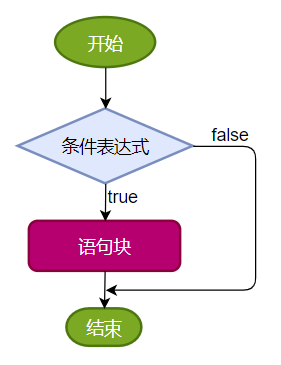

# 第三章：流程控制语句

**目录：**

[TOC]

---

本章专题与脉络：


流程控制语句是用来控制程序中各语句执行顺序的语句，可以把语句组合成能完成一定功能的小逻辑模块。

程序设计中规定的三种流程结构，即：
* 顺序结构：程序从上到下逐行地执行，中间没有任何判断和跳转。
* 分支结构：根据条件，选择性地执行某段代码。
  * 有 `if…else`（条件判断结构）和 `switch - case`（选择结构）两种分支语句。
* 循环结构：根据循环条件，重复性地执行某段代码。
  * 有 `for`、`while`、`do - while` 三种循环语句。
  * 补充：JDK 5.0 提供了 `foreach` 循环（增强 `for` 循环），方便遍历集合、数组元素（第 12 章 集合 中讲解）。

## 一、顺序结构

顺序结构就是程序从上到下逐行地执行。表达式语句都是顺序执行的，并且上一行对某个变量的修改对下一行会产生影响。


示例代码：
```java
public class StatementTest {
    public static void main(String[] args) {
        int x = 1;
        int y = 2;
        System.out.println("x = " + x);
        System.out.println("y = " + y);
        // 对 x、y 的值进行修改
        x++;
        y = 2 * x + y;
        x = x * 10;
        System.out.println("x = " + x);
        System.out.println("y = " + y);
    }
}
```

Java 中定义变量时采用合法的前向引用，如：
```java
public static void main(String[] args) {
    int num1 = 12;
    int num2 = num1 + 2;
}
```
错误形式：
```java
public static void main(String[] args) {
    int num2 = num1 + 2;
    int num1 = 12;
}
```

## 二、分支语句

### 2.1 if - else 条件判断结构

#### 2.1.1 结构 1：单分支条件判断

单分支条件判断 `if` 格式：
```java
if (条件表达式) {
    语句块;
}
```
需要注意的是，当语句块只有一条执行语句时，对应的语句块的一对 `{}` 可以省略，但建议保留。

> 说明：条件表达式必须是布尔表达式（关系表达式或逻辑表达式）或布尔变量。
>
> 条件表达式错误示例如下：
> ```java
> if (60 <= heartBeats <= 100) {
>     ...
> }
> ```
> 程序在执行时会首先计算 `60 <= heartBeats` 表达式的值，计算得出的 `boolean` 类型的结果无法与整数类型的 `100` 进行比较，因此会报错。
>
> 条件表达式正确示例如下：
> ```java
> if (heartBeats >= 60 && heartBeats <= 100) {
>     ...
> }
> ```
> 也可以将上述正确示例中的条件表达式改为 `!(heartBeats < 60 || heartBeats > 100)`，判断结果是一样的。

执行流程：
1. 首先判断条件表达式看其结果是 `true` 还是 `false`；
2. 根据条件表达式的结果进行分支：
   * 如果是 `true` 就执行语句块；
   * 如果是 `false` 就不执行语句块。



#### 2.1.2 结构 2：双分支条件判断

双分支条件判断 `if ... else` 格式：
```java
if (条件表达式) {
    语句块 1;
} else {
    语句块 2;
}
```

执行流程：
1. 首先判断条件表达式看其结果是 `true` 还是 `false`；
2. 根据条件表达式的结果进行分支：
   * 如果是 `true` 就执行语句块 1；
   * 如果是 `false` 就执行语句块 2。


#### 2.1.3 结构 3：多分支条件判断

多分支条件判断 `if ... else if ... else` 格式：
```java
if (条件表达式 1) {
    语句块 1;
} else if (条件表达式 2) {
    语句块 2;
}
...
} else if (条件表达式 n) {
    语句块 n;
} else {
    语句块 n + 1;
}
```
在实际开发中，当 `if - else` 结构是“多选一”时，最后的 `else` 是可选的，根据需要可以省略。

> 说明：一旦条件表达式为 `true`，则进入执行相应的语句块；执行完对应的语句块之后，就跳出当前结构。

执行流程：
1. 首先判断关系表达式 1 看其结果是 `true` 还是 `false`；
2. 根据条件表达式 1 的结果进行分支：
   * 如果是 `true` 就执行语句块 1，然后结束当前多分支；
   * 如果是 `false` 就继续判断关系表达式 2 看其结果是 `true` 还是 `false`：
     * 如果是 `true` 就执行语句块 2，然后结束当前多分支；
     * 如果是 `false` 就继续判断关系表达式 3 看其结果是 `true` 还是 `false`：
       * ...
         * 如果没有任何关系表达式为 `true`，就执行语句块 n + 1，然后结束当前多分支。


案例：
> 岳小鹏参加 Java 考试，他和父亲岳不群达成承诺：如果成绩为 100 分时，奖励一辆跑车；成绩为 (80, 99] 时，奖励一辆山地自行车；当成绩为 [60, 80] 时，奖励环球影城一日游；其他时，胖揍一顿。
>
> 说明：默认成绩是在 [0, 100] 范围内。

示例代码：
```java
int score = 61;
if (score == 100) {
    System.out.println("奖励一辆跑车");
} else if (score > 80 && score <= 99) {
    System.out.println("奖励一辆山地自行车");
} else if (score >= 60 && score <= 80) {
    System.out.println("奖励环球影城一日游");
} else {
    System.out.println("胖揍一顿");
}
```

> 注意：
> * 当条件表达式之间是“互斥”关系时（即彼此没有交集），条件判断语句及执行语句间顺序无所谓：
> 
> * 当条件表达式之间是“包含”关系时，例如“小上大下 / 子上父下”，则需要将范围小的条件表达式声明在范围大的条件表达式的上面，不能随意调换条件的顺序，否则范围小的条件表达式将不可能被执行：
> 

#### 2.1.4 结构 4：if ... else 嵌套

在 `if` 的语句块中或者是在 `else` 的语句块中，又包含了另外一个条件判断（可以是单分支、双分支、多分支），就构成了嵌套结构。

嵌套结构执行的特点：
* 如果是嵌套在 `if` 语句块中的，只有当外部的 `if` 条件满足，才会去判断内部的条件；
* 如果是嵌套在 `else` 语句块中的，只有当外部的 `if` 条件不满足从而进入 `else` 后，才会去判断内部的条件。

从开发经验上讲，没有写过超过三层的嵌套 `if - else` 结构。

案例：
> 由键盘输入三个整数，分别存入变量 `num1`、`num2`、`num3`，对它们进行排序（使用 `if - else if - else`），并且从小到大输出。

示例代码：
```java
int num1 = 30;
int num2= 21;
int num3 = 44;

if (num1 >= num2) {
    if (num3 >= num1) {
        System.out.println(num2 + "，" + num1 + "，" + num3);
    } else if (num3 <= num2) {
        System.out.println(num3 + "，" + num2 + "，" + num1);
    } else {
        System.out.println(num2 + "，" + num3 + "，" + num1);
    }
} else {    // num1 < num2
    if (num3 >= num2) {
        System.out.println(num1 + "，" + num2 + "，" + num3);
    } else if (num3 <= num1) {
        System.out.println(num3 + "，" + num1 + "，" + num2);
    } else {
        System.out.println(num1 + "，" + num3 + "，" + num2);
    }
}
```

## 五、Scanner：键盘输入功能的实现

我们可以使用 `Scanner` 类从键盘获取不同类型（基本数据类型、`String` 类型）的变量。

键盘输入代码的四个步骤：
1. 导包：`import java.util.Scanner;`；
2. 提供（或创建）一个 `Scanner` 类型的实例（对象）：`Scanner scan = new Scanner(System.in)`；
3. 调用 `Scanner` 类的相关方法（`next()` / `nextXxx()`），来获取指定类型的变量；
4. 释放资源，避免内存泄漏：`scan.close();`。

`Scanner` 是一个引用数据类型，它的全名称是 `java.util.Scanner`；`scan` 就是一个引用数据类型的变量了，赋给它的值是一个对象（对象的概念我们后面学习，暂时先这么叫）；`new Scanner(System.in)` 是一个 `new` 表达式，该表达式的结果是一个对象。

以上过程可以抽象为以下等式：
```java
引用数据类型 变量 = 对象;
```
这个等式的意思可以理解为用一个引用数据类型的变量代表一个对象，所以这个变量的名称又称为对象名。我们也把 `scan` 变量叫做 `scan` 对象。

`Scanner` 类中提供了获取 `byte`、`short`、`int`、`long`、`float`、`double`、`boolean`、`String` 类型变量的方法，而没有提供获取 `char` 类型变量的方法，需要使用 `next().charAt(0)`。

> 注意：需要根据相应的方法，来输入指定类型的值；如果输入的数据类型与要求的类型不匹配时，会报异常，从而导致程序终止。

案例 1：
> 小明注册某交友网站，要求录入个人相关信息，如下：请输入你的网名、你的年龄、你的体重、你是否单身、你的性别等情况。

示例代码：
```java
// 步骤 1：导包 import java.util.Scanner;
import java.util.Scanner;
class ScannerTest {
    public static void main(String[] args) {
        // 步骤 2：提供（或创建）一个 Scanner 类的实例
        Scanner scan = new Scanner(System.in);  // System.in 默认代表键盘输入
        System.out.println("欢迎光临 你来我往 交友网");
        // 步骤 3：根据提示，调用 Scanner 类的方法，获取不同类型的变量
        System.out.print("请输入你的网名：");
        String name = scan.next();
        System.out.print("请输入你的年龄：");
        int age = scan.nextInt();
        System.out.print("请输入你的体重：");
        double weight = scan.nextDouble();
        System.out.print("你是否单身（单身 true，不单身 false）：");
        boolean isSingle = scan.nextBoolean();
        System.out.print("请输入你的性别：（男 \\ 女）");
        char gender = scan.next().charAt(0);    // 先按照字符串接收，然后再取字符串的第一个字符（下标为 0）

        System.out.println("网名：" + name + "，年龄：" + age + "，体重：" + weight + "，是否单身：" + isSingle + "，性别" + gender);
        System.out.println("注册完成，欢迎继续进入体验！");

        // 步骤 4：关闭资源，调用 Scanner 类的 close()
        scan.close();
    }
}
```

案例 2：
> 大家都知道，“男大当婚，女大当嫁”。那么女方家长要嫁女儿，当然要提出一定的条件：高 - 180cm 以上；富 - 财富 1 千万以上；帅 - 是。
> 
> 如果这三个条件同时满足，则：“我一定要嫁给他！！！”
> 如果三个条件有为真的情况，则：“嫁吧，比上不足，比下有余。”
> 如果三个条件都不满足，则：“不嫁！”
>
> 提示：
> ```java
> System.out.println("身高：（cm）");
> -> scanner.nextInt();
> 
> System.out.println("财富：（千万）");
> -> scanner.nextDouble();
> 
> System.out.println("帅否：（true / false）");
> -> scanner.nextBoolean();
> ```
> 
> 其中，对于“帅”的输入还可以为如下方式：
> ```java
> System.out.println("帅否：（是 / 否）");
> -> scanner.next();
> ```
> 对于第二种“帅”的输入方式，判断“帅否”需要通过 `"是".equals(str)` 来判断，而不能使用 `str == "是"` 的方式。

示例代码：
```java
import java.util.Scanner;
class ScannerExer {
    public static void main(String[] args) {
        Scanner scan = new Scanner(System.in);

        System.out.println("请输入你的身高：（cm）");
        int height = scan.nextInt();

        System.out.println("请输入你的财富：（以千万为单位）");
        double wealth = scan.nextDouble();

        // 方式 1：关于是否帅的问题，我们使用 boolean 类型接收
        System.out.println("帅否？（true / false）");
        boolean isHandsome = scan.nextBoolean();

        // 判断
        if (height >= 180 && wealth >= 1.0 && isHandsome) { // 不建议 isHandsome == true
            System.out.println("我一定要嫁给他！！！");
        } else if (height >= 180 || wealth >= 1.0 || isHandsome) {
            System.out.println("嫁吧，不上不足，比下有余。");
        } else {
            System.out.println("不嫁！");
        }

        // 关闭资源
        scan.close();
    }
}
```

其中。关于是否帅的问题，我们可以使用另一种方式接收：
```java
...
// 方式 2：关于是否帅的问题，我们使用 String 类型接收
System.out.println("帅否？（是 / 否）");
String isHandsome = scan.next();

// 判断
if (height >= 180 && wealth >= 1.0 && isHandsome.equals("是")) {    // 知识点：判断两个字符串是否相等，使用 String 的 equals()
    System.out.println("我一定要嫁给他！！！");
} else if (height >= 180 || wealth >= 1.0 || isHandsome.equals("是")) {
    System.out.println("嫁吧，比上不足，比下有余。");
} else {
    System.out.println("不嫁！");
}
...
```

对于关于是否帅的问题的接收方式 2，判断“帅否”需要通过 `isHandsome.equals("是")` 来判断，而不能使用 `isHandsome == "是"` 去判断。因为 `equals()` 方法用来判断两个字符串的内容是否相同，而 `==` 则用来判断两个字符串是否相等；`isHandsome` 和 `"是"` 两个字符串的内容可能是相同的，但是并不是同一个字符串，因此二者并不相等，不能使用 `==` 来判断二者的内容是否相同。

因此，判断两个字符串是否相等（这里的“相等”是指两个字符串的内容相同），需要使用 `String` 的 `equals()` 来判断。

## 六、如何获取一个随机数？

如何产生一个指定范围的随机整数？