# 第四章：IDEA 的安装与使用

**目录：**

[TOC]

---

本章专题与脉络：

为什么选择 IDEA？

> 注：
>
> JetBrains 官方说明：尽管我们采取了多种措施确保受访者的代表性，但结果可能会略微偏向 JetBrains 产品的用户，因为这些用户更有可能参加调查。

此外，2022 年某美国软件开发商在对近千名专业的Java开发者调研后，发布了《2022年Java开发者生产力报告》。报告提到：JetBrains 的 IntelliJ IDEA是最受欢迎的 Java IDE，占 48%，其次是 Eclipse，占 24%，Visual Studio Code 占 18%。

本着"工欲善其事必先利其器"的精神，本章从 IDEA 的介绍、安装、设置入手，讲解 IDEA 中项目的创建、快捷键与模板的使用、断点调试、常用插件等。

## 一、认识 IntelliJ IDEA

### 1.1 JetBrains 公司介绍

IDEA，是 JetBrains（https://www.jetbrains.com/）公司的产品；该公司成立于 2000 年，总部位于捷克的布拉格，致力于为开发者打造最高效智能的开发工具。

公司旗下还有其它产品，比如：

* WebStorm：用于开发 JavaScript、HTML5、CSS3 等前端技术；
* PyCharm：用于开发 python；
* PhpStorm：用于开发 PHP；
* RubyMine：用于开发 Ruby/Rails；
* AppCode：用于开发 Objective - C/Swift；
* CLion：用于开发 C/C++；
* DataGrip：用于开发数据库和 SQL；
* Rider：用于开发.NET；
* GoLand：用于开发 Go。

用于开发 Android 的 Android Studio，也是 Google 基于 IDEA 社区版进行迭代的。

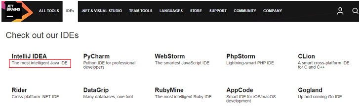

### 1.2 IntelliJ IDEA 介绍

IDEA，全称 IntelliJ IDEA，是 Java 语言的集成开发环境，目前已经（基本）代替了 Eclipse 的使用。IDEA 在业界被公认为是最好的 Java 开发工具（之一），因其功能强悍、设置人性化而深受 Java、大数据、移动端程序员的喜爱。

> IntelliJ IDEA 在 2015 年的官网上这样介绍自己：
>
> Excel at enterprise, mobile and web development with Java, Scala and Groovy,with all the latest modern technologies and frameworks available out of thebox.

### 1.3 IDEA 的主要优势（vs Eclipse）

功能强大：
* 强大的整合能力，比如：Git、Maven、Spring 等：

* 开箱即用的体验（集成版本控制系统、多语言支持的框架随时可用，无需额外安装插件）。

符合人体工程学：
* 高度智能（快速的智能代码补全、实时代码分析、可靠的重构工具）：
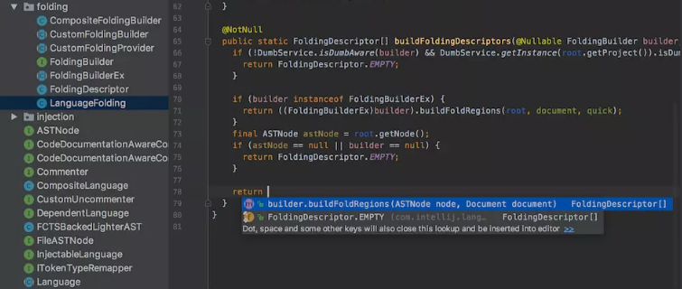
* 提示功能的快速、便捷、范围广：

* 好用的快捷键和代码模板；
* 精准搜索。

### 1.4 IDEA 的下载

下载网址：[下载网址](https://www.jetbrains.com/idea/download/#section=windows)。

IDEA 分为两个版本：旗舰版（Ultimate）和社区版（Community）：
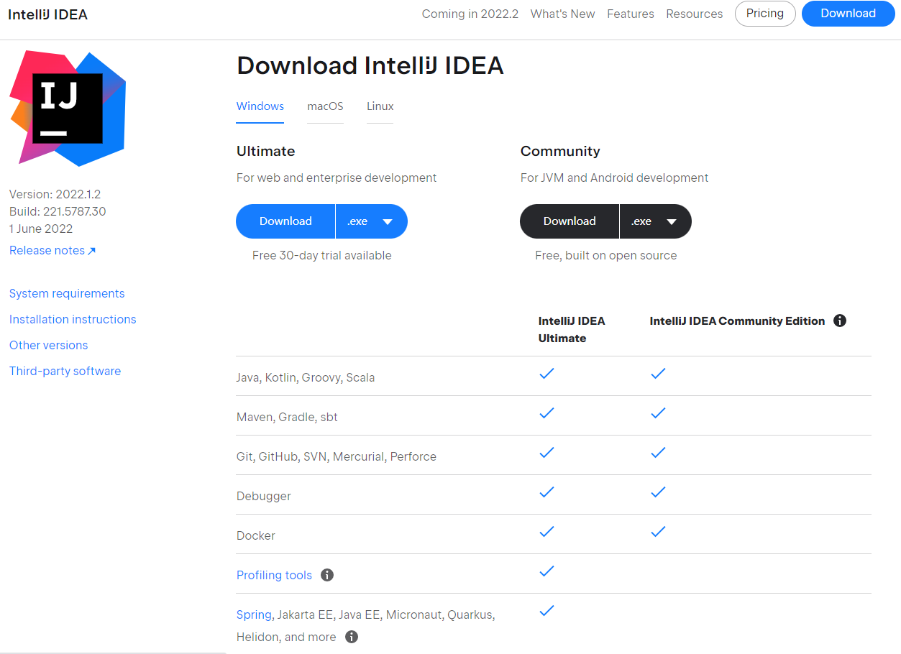

两个不同版本的详细对比，可以参照[官网](https://www.jetbrains.com/idea/features/editions_comparison_matrix.html)。

IDEA 的大版本每年迭代一次，大版本下的小版本（如：2022.x）迭代时间不固定，一般每年 3 个小版本。

官网提供了详细的[使用文档](https://www.jetbrains.com/help/idea/meet-intellij-idea.html)。

## 二、卸载与安装

### 2.1 卸载过程

这里以卸载 2022.1.2 版本为例说明。在 控制面板 找到 卸载程序：
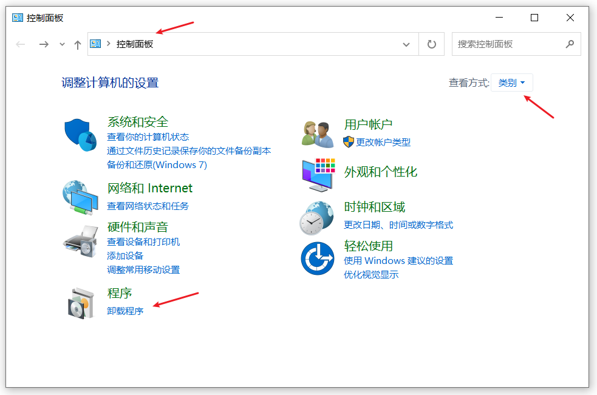

右键点击或左键双击 IntelliJ IDEA 2022.1.2 进行卸载：

如果需要保留下述数据，就不要打 √；如果想彻底删除 IDEA 所有数据，那就打上 √。如下所示：
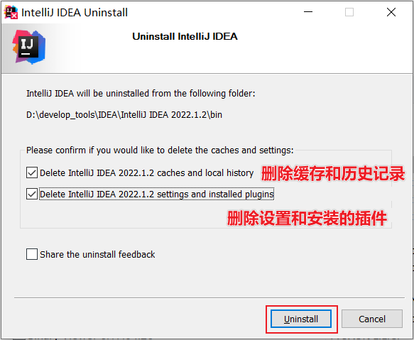

卸载过程：
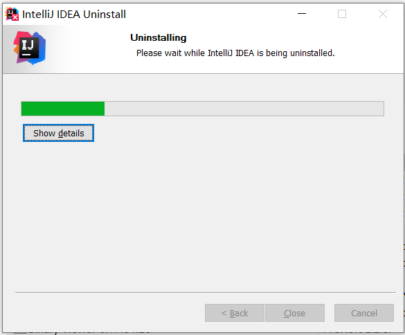
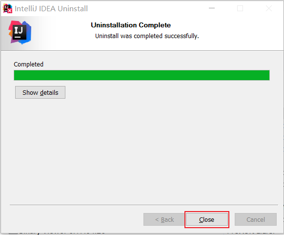

软件卸载完以后，还需要删除其它几个位置的残留：
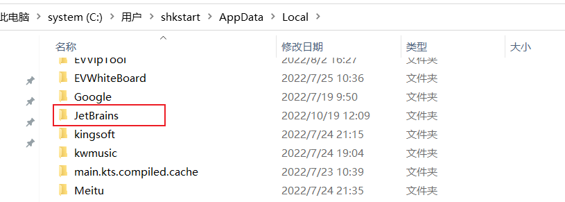

### 2.2 安装前的准备

安装要求如下：
* 64 位 Microsoft Windows 11、10、8；
* 最低 2 GB 可用 RAM，推荐 8 GB 系统总 RAM；
* 2.5 GB 硬盘空间，推荐 SSD；
* 最低屏幕分辨率 1024x768。

从安装上来看，IntelliJ IDEA 对硬件的要求似乎不是很高。可是在实际开发中并不是这样的，因为 IntelliJ IDEA 执行时会有大量的缓存、索引文件；所以如果你正在使用 Eclipse / MyEclipse，想通过 IntelliJ IDEA 来解决计算机的卡、慢等问题，这基本上是不可能的，本质上你应该对自己的硬件设备进行升级。

### 2.3 安装过程

1. 下载完安装包，双击直接安装：

2. 欢迎安装：

3. 是否删除电脑上低版本的 IDEA（如果有，可以选择忽略）：
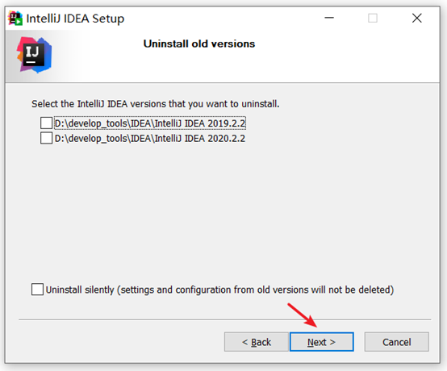
    * 如果电脑上有低版本的IDEA，可以选择删除或保留；
    * 这里没有卸载旧版本，如果需要卸载，记得勾选下面的保留旧的设置和配置。
4. 选择安装目录：

    * 选择安装目录，目录中要避免中文和空格：
        
5. 创建桌面快捷图标等：
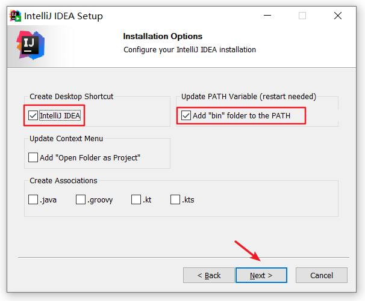
    * 确认是否与 `.java`、`.groovy`、`.kt` 格式文件进行关联，这里建议不关联。
6. 在【开始】菜单新建一个文件夹（这里需要确认文件夹的名称），来管理IDEA的相关内容：

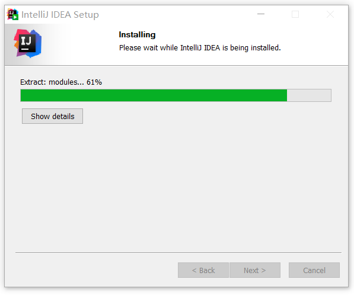
7. 完成安装：

重启以后（建议重启后再使用），即可使用。