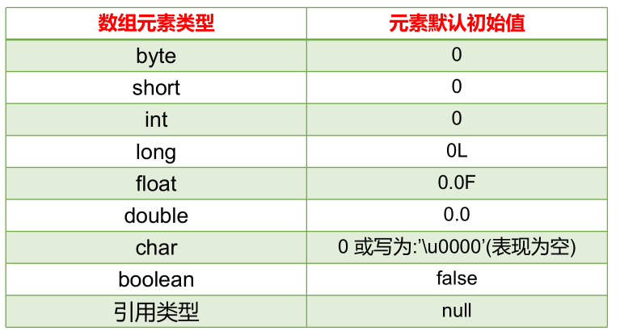

# 第五章：数组

**目录：**

[TOC]

---

本章专题与脉络：


## 一、数组的概述

### 1.1 为什么需要数组

需求分析 1：
需要统计某公司 50 个员工的工资情况，例如计算平均工资、找到最高工资等。利用之前所学知识，首先需要声明 50 个变量来分别记录每位员工的工资，这样会很麻烦。因此我们可以将所有的数据全部存储到一个容器中统一管理，并使用容器进行计算。

需求分析 2：


容器的概念：
* 生活中的容器：水杯（装水等液体）、衣柜（装衣服等物品）、集装箱（装货物等）。
* 程序中的容器：将多个数据存储到一起，每个数据称为该容器的元素。

Java 中的容器包括数组、集合框架（第 12 章），其功能为可完成在内存中对多个数据的存储。

### 1.2 数组的概念

数组（Array）：是多个相同类型数据按一定顺序排列的集合，并使用一个名字命名，且通过编号的方式对这些数据进行统一管理。

数组中的概念包括数组名、下标（或角标、下角标、索引、index，即找到指定数组元素所使用的编号）、元素（即数组内部存储的多个元素）、数组的长度（即数组容器中存储的元素的个数）等，其示意图如下所示：


> 注意：数组的下标（或索引）是从 `0` 开始的。

数组的特点：
* 数组本身是引用数据类型。而数组中的元素可以是任何数据类型，包括基本数据类型和引用数据类型；例如，当一维数组中的元素又为数组时，即为二维数组。
* 创建数组对象会在内存中开辟一整块连续的空间，占据的空间的大小取决于数组的长度和数组中元素的类型。
* 数组中的元素在内存中是依次紧密排列的、有序的。
* 数组一旦初始化完成，其长度就是确定的；数组的长度一旦确定，就不能修改。
* 我们可以直接通过下标（或索引）的方式调用指定位置的元素，速度很快。
* 数组名中引用的是这块连续空间的首地址。

### 1.3 数组的分类

按照元素类型分：
* 基本数据类型元素的数组：每个元素位置存储基本数据类型的值；
* 引用数据类型元素的数组：每个元素位置存储对象（本质是存储对象的首地址）。（在面向对象部分讲解）

按照维度分：
* 一维数组：存储一组数据；
* 二维数组：存储多组数据，相当于二维表，一行代表一组数据，只是这里的二维表每一行的长度不要求一样。


### 1.4 一维数组的使用（6 个基本点）

要想了解自己对一维数组的掌握程度，可以从以下 6 个基本点进行评测：
* 数组的声明和初始化；
* 调用数组的指定元素；
* 数组的属性 `length`，表示数组的长度；
* 数组的遍历；
* 数组元素的默认初始化值；
* 一维数组的内存解析（难）。

## 二、一维数组的使用

### 2.1 一维数组的声明

一维数组声明的格式：
```java
// 推荐
元素的数据类型[] 一维数组的名称;

// 不推荐
元素的数据类型 一维数组名[];
```

示例代码：
```java
int[] arr;
int arr1[];
double[] arr2;
String[] arr3;  // 引用类型变量数组
```

数组的声明需要明确：
* 数组的维度：在 Java 中数组的符号是 `[]`，例如 `[]` 表示一维、`[][]` 表示二维。
* 数组的元素类型：即创建的数组容器可以存储什么数据类型的数据；元素的类型可以是任意的 Java 的数据类型。例如 `int`、`String`、`Student` 等。
* 数组名：就是代表某个数组的标识符；数组名其实也是变量名，按照变量的命名规范来命名。数组名是个引用数据类型的变量，因为它代表一组数据。

> 注意：
>
> Java 语言中声明数组时不能指定其长度（即数组中元素的个数）。例如：
> ```java
> int a[5];   // 非法
> ```
> 以上数组的声明方式是非法的。

### 2.2 一维数组的初始化

#### 2.2.1 静态初始化

如果数组变量的初始化和数组元素的赋值操作同时进行，那就称为静态初始化。

静态初始化本质是用静态数据（编译时已知）为数组初始化。此时数组的长度由静态数据的个数决定。

一维数组声明和静态初始化格式 1：
```java
数据类型[] 数组名 = new 数据类型[]{元素 1, 元素 2, 元素 3, ...};
```
或：
```java
数据类型[] 数组名;
数组名 = new 数据类型[]{元素 1, 元素 2, 元素 3, ...};
```

其中 new 为创建数组使用的关键字。因为数组本身是引用数据类型，所以要用 new 创建数组实体。

示例代码：
> 定义存储 1、2、3、4、5 整数的数组容器。
```java
int[] arr = new int[]{1, 2, 3, 4, 5};   // 正确

// 或：

int[] arr;
arr = new int[]{1, 2, 3, 4, 5}; //正确
```

一维数组声明和静态初始化格式 2：
```java
数据类型[] 数组名 = {元素 1, 元素 2, 元素 3, ...}   // 必须在一个语句中完成，不能分成两个语句写
```

示例代码：
> 定义存储 1、2、3、4、5 整数的数组容器。
```java
int[] arr = {1, 2, 3, 4, 5};    // 正确

int[] arr;
arr = {1, 2, 3, 4, 5};  // 错误
```

#### 2.2.2 动态初始化

数组变量的初始化和数组元素的赋值操作分开进行，即为动态初始化。

动态初始化中，只确定了元素的个数（即数组的长度），而元素值此时只是默认值，还并未真正赋自己期望的值；真正期望的数据需要后续单独一个一个赋值。

动态初始化格式：
```java
数组存储的元素的数据类型[] 数组名字 = new 数组存储的元素的数据类型[长度];
```
或：
```java
数组存储的数据类型[] 数组名字;
数组名字 = new 数组存储的数据类型[长度];
```

其中，[长度] 是指数组的长度，表示数组容器中可以最多存储多少个元素。

> 注意：数组有定长特性，长度一旦指定就不可更改；和水杯道理相同，买了一个 2 升的水杯，总容量就是 2 升是固定的。

示例代码 1 - 正确写法：
```java
int[] arr = new int[5];

int[] arr;
arr = new int[5];
```

示例代码 2 - 错误写法：
```java
int[] arr = new int[5]{1, 2, 3, 4, 5};  // 错误的；如果后面有 {} 指定元素列表，就不需要在 [] 中指定元素个数了
```

#### 2.2.3 一维数组的声明与初始化

结合一维数组的声明与静态、动态初始化方法，给出以下示例代码：
```java
public class OneArrayTest {
    public static void main(String[] args) {
        // 1. 数组的声明与初始化

        // 方式 1：
        // 1.1 声明数组
        double[] prices;
        // 1.2 数组的初始化
        // 静态初始化：数组变量的赋值与数组元素的赋值操作同时进行
        prices = new double[]{20.32, 43.21, 43.22};

//        String[] foods;
//        foods = new String[]{"拌海蜇", "龙须菜", "炝冬笋", "玉兰片"};

        // 方式 2：
        // 数组的声明和初始化
        // 动态初始化：数组变量的赋值与数组元素的赋值操作分开进行
        String[] foods = new String[4];

        // 其他正确的方式
        int arr[] = new int[4]; // 动态方式
        int[] arr1 = {1, 2, 3, 4};  // 静态方式 - 类型推断

        // 错误的方式
//        int[] arr2 = new int[3]{1, 2, 3};
//        int[3] arr3 = new int[];
    }
}

```

### 2.3 一维数组的使用

#### 2.3.1 数组的长度

数组的元素总个数即为数组的长度。

每个数组都有一个属性 `length` 指明它的长度。例如 `arr.length` 指明数组 `arr` 的长度（即元素个数）。

每个数组都具有长度，而且一旦初始化，其长度就是确定且是不可变的。

示例代码：
```java
public class OneArrayTest {
    public static void main(String[] args) {
        double[] prices;
        prices = new double[]{20.32, 43.21, 43.22};

        String[] foods = new String[4];

        // 3. 数组的长度：用来描述数组容器中容量的大小
        // 使用length 属性表示
        System.out.println(foods.length);   // 4
        System.out.println(prices.length);  // 3
    }
}

```

#### 2.3.2 数组元素的引用

**如何表示数组中的一个元素？**

每一个存储到数组的元素，都会自动地拥有一个编号，且编号从 0 开始；这个自动编号称为数组索引（index）或下标，可以通过数组的索引或下标访问到数组中的元素。

语法格式：
```java
数组名[索引 / 下标]
```

**数组的下标范围？**

Java 中数组的下标从 `[0]` 开始，下标范围是 `[0, 数组的长度 - 1]`，即 `[0, 数组名.length - 1]`。

数组元素下标可以是整型常量或整型表达式。例如 `a[3]`、`b[i]`、`c[6 * i]`。

示例代码：
```java
public class OneArrayTest {
    public static void main(String[] args) {
        double[] prices;

        String[] foods = new String[4];

        // 2. 数组元素的调用
        // 通过角标的方式，获取数组的元素
        // 角标的范围从 0 开始，到 数组的长度 - 1 结束
        prices = new double[]{20.32, 43.21, 43.22};
        System.out.println(prices[0]);
        System.out.println(prices[2]);
//        System.out.println(prices[4]);  // 报异常：ArrayIndexOutOfBoundsException

        foods[0] = "拌海蜇";
        foods[1] = "龙须菜";
        foods[2] = "炝冬笋";
        foods[3] = "玉兰片";
//        foods[4] = "酱茄子";   // 报异常：ArrayIndexOutOfBoundsException
    }
}

```

### 2.4 一维数组的遍历

将数组中的每个元素分别获取出来，就是遍历。for 循环与数组的遍历是绝配。

示例代码：
```java
public class OneArrayTest {
    public static void main(String[] args) {
        double[] prices;
        prices = new double[]{20.32, 43.21, 43.22};

        String[] foods = new String[4];
        foods[0] = "拌海蜇";
        foods[1] = "龙须菜";
        foods[2] = "炝冬笋";
        foods[3] = "玉兰片";

        // 4. 如何遍历数组？
        for (int i = 0; i < foods.length; i++) {
            System.out.println(foods[i]);
        }

        for (int i = 0; i < prices.length; i++) {
            System.out.println(prices[i]);
        }
    }
}

```

### 2.5 数组元素的默认值

数组是引用类型，当我们使用动态初始化方式创建数组时，元素值只是默认值。

对于基本数据类型而言，默认初始化值各有不同；对于引用数据类型而言，默认初始化值为 `null`（注意与 `0` 不同！）。具体如下图所示：


示例代码：
```java
public class OneArrayTest1 {
    public static void main(String[] args) {
        // 5. 数组元素的默认初始化值

        // 整型数组元素的默认初始化值：0
        int[] arr1 = new int[3];
        System.out.println(arr1[0]);

        short[] arr2 = new short[4];
        for (int i = 0; i < arr2.length; i++) {
            System.out.println(arr2[i]);
        }

        // 浮点型数组元素的默认初始化值：0.0
        double[] arr3 = new double[5];
        System.out.println(arr3[0]);

        // 字符型数组元素的默认初始化值：0（或理解为 '\u0000'）
        char[] arr4 = new char[4];
        System.out.println(arr4[0]);

        if (arr4[0] == 0) {
            System.out.println("1111");
        }

        if (arr4[0] == '0') {
            System.out.println("2222");
        }

        if (arr4[0] == '\u0000') {
            System.out.println("3333");
        }

        System.out.println(arr4[0] + 1);

        // boolean 型数组元素的默认初始化值：false
        boolean[] ar5 = new boolean[4];
        System.out.println(ar5[0]);

        // 引用数据类型数组元素的默认初始化值：null
        String[] arr6 = new String[5];
        for (int i = 0; i < arr6.length; i++) {
            System.out.println(arr6[i]);
        }

        if (arr6[0] == null) {
            System.out.println("aaaa");
        }

        if (arr6[0] == "null") {
            System.out.println("bbbb");
        }
    }
}

```