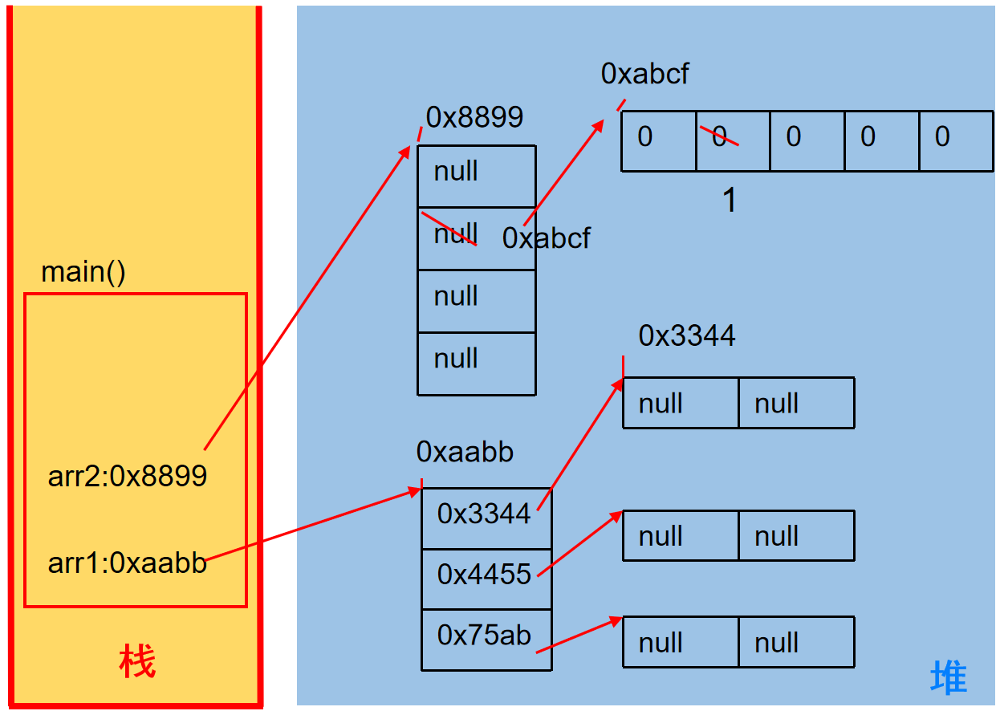
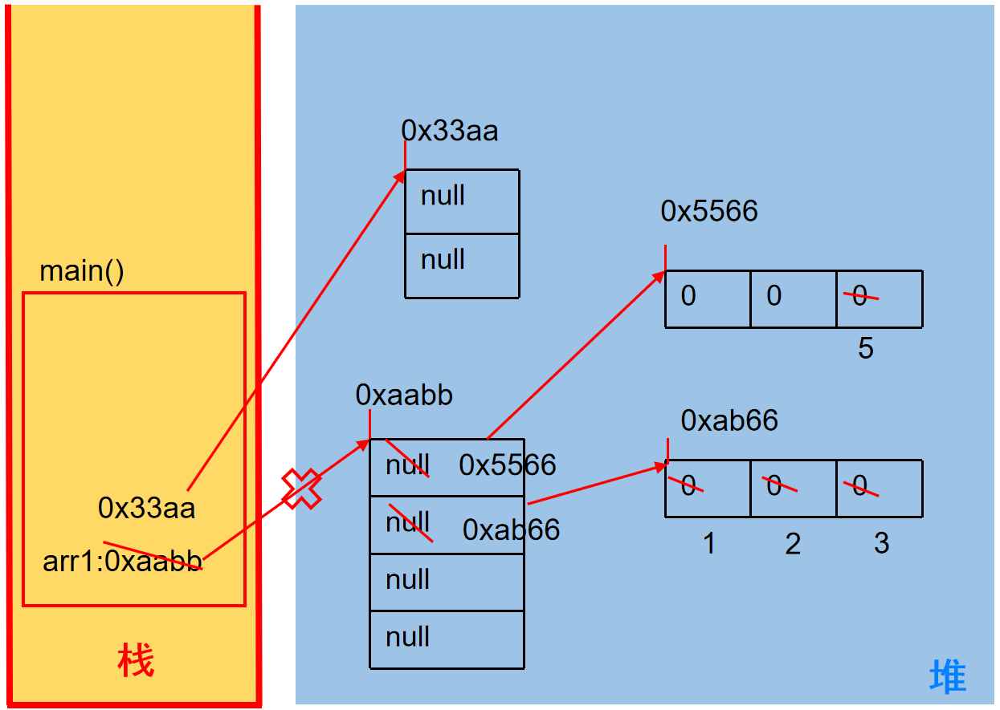
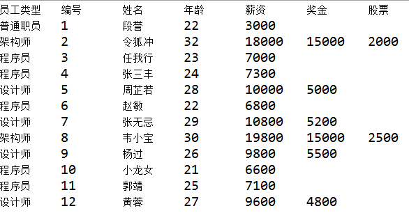
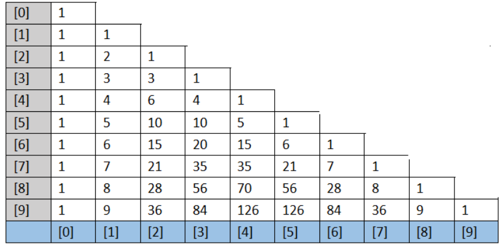
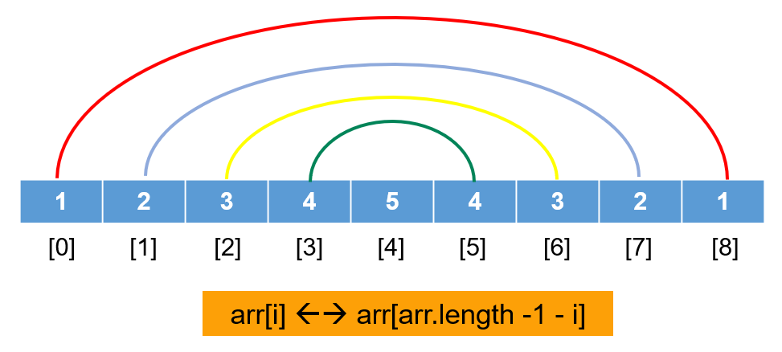

# 第五章：数组

**目录：**

[TOC]

---

本章专题与脉络：


## 一、数组的概述

### 1.1 为什么需要数组

需求分析 1：
需要统计某公司 50 个员工的工资情况，例如计算平均工资、找到最高工资等。利用之前所学知识，首先需要声明 50 个变量来分别记录每位员工的工资，这样会很麻烦。因此我们可以将所有的数据全部存储到一个容器中统一管理，并使用容器进行计算。

需求分析 2：


容器的概念：
* 生活中的容器：水杯（装水等液体）、衣柜（装衣服等物品）、集装箱（装货物等）。
* 程序中的容器：将多个数据存储到一起，每个数据称为该容器的元素。

Java 中的容器包括数组、集合框架（第 12 章），其功能为可完成在内存中对多个数据的存储。

### 1.2 数组的概念

数组（Array）：是多个相同类型数据按一定顺序排列的集合，并使用一个名字命名，且通过编号的方式对这些数据进行统一管理。

数组中的概念包括数组名、下标（或角标、下角标、索引、index，即找到指定数组元素所使用的编号）、元素（即数组内部存储的多个元素）、数组的长度（即数组容器中存储的元素的个数）等，其示意图如下所示：


> 注意：数组的下标（或索引）是从 `0` 开始的。

数组的特点：
* 数组本身是引用数据类型。而数组中的元素可以是任何数据类型，包括基本数据类型和引用数据类型；例如，当一维数组中的元素又为数组时，即为二维数组。
* 创建数组对象会在内存中开辟一整块连续的空间，占据的空间的大小取决于数组的长度和数组中元素的类型。
* 数组中的元素在内存中是依次紧密排列的、有序的。
* 数组一旦初始化完成，其长度就是确定的；数组的长度一旦确定，就不能修改。
* 我们可以直接通过下标（或索引）的方式调用指定位置的元素，速度很快。
* 数组名中引用的是这块连续空间的首地址。

### 1.3 数组的分类

按照元素类型分：
* 基本数据类型元素的数组：每个元素位置存储基本数据类型的值；
* 引用数据类型元素的数组：每个元素位置存储对象（本质是存储对象的首地址）。（在面向对象部分讲解）

按照维度分：
* 一维数组：存储一组数据；
* 二维数组：存储多组数据，相当于二维表，一行代表一组数据，只是这里的二维表每一行的长度不要求一样。


### 1.4 一维数组的使用（6 个基本点）

要想了解自己对一维数组的掌握程度，可以从以下 6 个基本点进行评测：
* 数组的声明和初始化；
* 调用数组的指定元素；
* 数组的属性 `length`，表示数组的长度；
* 数组的遍历；
* 数组元素的默认初始化值；
* 一维数组的内存解析（难）。

## 二、一维数组的使用

### 2.1 一维数组的声明

一维数组声明的格式：
```java
// 推荐
元素的数据类型[] 一维数组的名称;

// 不推荐
元素的数据类型 一维数组名[];
```

示例代码：
```java
int[] arr;
int arr1[];
double[] arr2;
String[] arr3;  // 引用类型变量数组
```

数组的声明需要明确：
* 数组的维度：在 Java 中数组的符号是 `[]`，例如 `[]` 表示一维、`[][]` 表示二维。
* 数组的元素类型：即创建的数组容器可以存储什么数据类型的数据；元素的类型可以是任意的 Java 的数据类型。例如 `int`、`String`、`Student` 等。
* 数组名：就是代表某个数组的标识符；数组名其实也是变量名，按照变量的命名规范来命名。数组名是个引用数据类型的变量，因为它代表一组数据。

> 注意：
>
> Java 语言中声明数组时不能指定其长度（即数组中元素的个数）。例如：
> ```java
> int a[5];   // 非法
> ```
> 以上数组的声明方式是非法的。

### 2.2 一维数组的初始化

#### 2.2.1 静态初始化

如果数组变量的初始化和数组元素的赋值操作同时进行，那就称为静态初始化。

静态初始化本质是用静态数据（编译时已知）为数组初始化。此时数组的长度由静态数据的个数决定。

一维数组声明和静态初始化格式 1：
```java
数据类型[] 数组名 = new 数据类型[]{元素 1, 元素 2, 元素 3, ...};
```
或：
```java
数据类型[] 数组名;
数组名 = new 数据类型[]{元素 1, 元素 2, 元素 3, ...};
```

其中 `new` 为创建数组使用的关键字。因为数组本身是引用数据类型，所以要用 `new` 创建数组实体。

示例代码：
> 定义存储 1、2、3、4、5 整数的数组容器。
```java
int[] arr = new int[]{1, 2, 3, 4, 5};   // 正确

// 或：

int[] arr;
arr = new int[]{1, 2, 3, 4, 5}; //正确
```

一维数组声明和静态初始化格式 2：
```java
数据类型[] 数组名 = {元素 1, 元素 2, 元素 3, ...}   // 必须在一个语句中完成，不能分成两个语句写
```

示例代码：
> 定义存储 1、2、3、4、5 整数的数组容器。
```java
int[] arr = {1, 2, 3, 4, 5};    // 正确

int[] arr;
arr = {1, 2, 3, 4, 5};  // 错误
```

#### 2.2.2 动态初始化

数组变量的初始化和数组元素的赋值操作分开进行，即为动态初始化。

动态初始化中，只确定了元素的个数（即数组的长度），而元素值此时只是默认值，还并未真正赋自己期望的值；真正期望的数据需要后续单独一个一个赋值。

动态初始化格式：
```java
数组存储的元素的数据类型[] 数组名字 = new 数组存储的元素的数据类型[长度];
```
或：
```java
数组存储的数据类型[] 数组名字;
数组名字 = new 数组存储的数据类型[长度];
```

其中，[长度] 是指数组的长度，表示数组容器中可以最多存储多少个元素。

> 注意：数组有定长特性，长度一旦指定就不可更改；和水杯道理相同，买了一个 2 升的水杯，总容量就是 2 升是固定的。

示例代码 1 - 正确写法：
```java
int[] arr = new int[5];

int[] arr;
arr = new int[5];
```

示例代码 2 - 错误写法：
```java
int[] arr = new int[5]{1, 2, 3, 4, 5};  // 错误的；如果后面有 {} 指定元素列表，就不需要在 [] 中指定元素个数了
```

#### 2.2.3 一维数组的声明与初始化

结合一维数组的声明与静态、动态初始化方法，给出以下示例代码：
```java
public class OneArrayTest {
    public static void main(String[] args) {
        // 1. 数组的声明与初始化

        // 方式 1：
        // 1.1 声明数组
        double[] prices;
        // 1.2 数组的初始化
        // 静态初始化：数组变量的赋值与数组元素的赋值操作同时进行
        prices = new double[]{20.32, 43.21, 43.22};

//        String[] foods;
//        foods = new String[]{"拌海蜇", "龙须菜", "炝冬笋", "玉兰片"};

        // 方式 2：
        // 数组的声明和初始化
        // 动态初始化：数组变量的赋值与数组元素的赋值操作分开进行
        String[] foods = new String[4];

        // 其他正确的方式
        int arr[] = new int[4]; // 动态方式
        int[] arr1 = {1, 2, 3, 4};  // 静态方式 - 类型推断

        // 错误的方式
//        int[] arr2 = new int[3]{1, 2, 3};
//        int[3] arr3 = new int[];
    }
}

```

### 2.3 一维数组的使用

#### 2.3.1 数组的长度

数组的元素总个数即为数组的长度。

每个数组都有一个属性 `length` 指明它的长度。例如 `arr.length` 指明数组 `arr` 的长度（即元素个数）。

每个数组都具有长度，而且一旦初始化，其长度就是确定且是不可变的。

示例代码：
```java
public class OneArrayTest {
    public static void main(String[] args) {
        double[] prices;
        prices = new double[]{20.32, 43.21, 43.22};

        String[] foods = new String[4];

        // 3. 数组的长度：用来描述数组容器中容量的大小
        // 使用length 属性表示
        System.out.println(foods.length);   // 4
        System.out.println(prices.length);  // 3
    }
}

```

#### 2.3.2 数组元素的引用

**如何表示数组中的一个元素？**

每一个存储到数组的元素，都会自动地拥有一个编号，且编号从 0 开始；这个自动编号称为数组索引（index）或下标，可以通过数组的索引或下标访问到数组中的元素。

语法格式：
```java
数组名[索引 / 下标]
```

**数组的下标范围？**

Java 中数组的下标从 `[0]` 开始，下标范围是 `[0, 数组的长度 - 1]`，即 `[0, 数组名.length - 1]`。

数组元素下标可以是整型常量或整型表达式。例如 `a[3]`、`b[i]`、`c[6 * i]`。

示例代码：
```java
public class OneArrayTest {
    public static void main(String[] args) {
        double[] prices;

        String[] foods = new String[4];

        // 2. 数组元素的调用
        // 通过角标的方式，获取数组的元素
        // 角标的范围从 0 开始，到 数组的长度 - 1 结束
        prices = new double[]{20.32, 43.21, 43.22};
        System.out.println(prices[0]);
        System.out.println(prices[2]);
//        System.out.println(prices[4]);  // 报异常：ArrayIndexOutOfBoundsException

        foods[0] = "拌海蜇";
        foods[1] = "龙须菜";
        foods[2] = "炝冬笋";
        foods[3] = "玉兰片";
//        foods[4] = "酱茄子";   // 报异常：ArrayIndexOutOfBoundsException
    }
}

```

### 2.4 一维数组的遍历

将数组中的每个元素分别获取出来，就是遍历。for 循环与数组的遍历是绝配。

示例代码：
```java
public class OneArrayTest {
    public static void main(String[] args) {
        double[] prices;
        prices = new double[]{20.32, 43.21, 43.22};

        String[] foods = new String[4];
        foods[0] = "拌海蜇";
        foods[1] = "龙须菜";
        foods[2] = "炝冬笋";
        foods[3] = "玉兰片";

        // 4. 如何遍历数组？
        for (int i = 0; i < foods.length; i++) {
            System.out.println(foods[i]);
        }

        for (int i = 0; i < prices.length; i++) {
            System.out.println(prices[i]);
        }
    }
}

```

### 2.5 数组元素的默认值

数组是引用类型，当我们使用动态初始化方式创建数组时，元素值只是默认值。

对于基本数据类型而言，默认初始化值各有不同；对于引用数据类型而言，默认初始化值为 `null`（注意与 `0` 不同！）。具体如下图所示：


示例代码：
```java
public class OneArrayTest1 {
    public static void main(String[] args) {
        // 5. 数组元素的默认初始化值

        // 整型数组元素的默认初始化值：0
        int[] arr1 = new int[3];
        System.out.println(arr1[0]);

        short[] arr2 = new short[4];
        for (int i = 0; i < arr2.length; i++) {
            System.out.println(arr2[i]);
        }

        // 浮点型数组元素的默认初始化值：0.0
        double[] arr3 = new double[5];
        System.out.println(arr3[0]);

        // 字符型数组元素的默认初始化值：0（或理解为 '\u0000'）
        char[] arr4 = new char[4];
        System.out.println(arr4[0]);

        if (arr4[0] == 0) {
            System.out.println("1111");
        }

        if (arr4[0] == '0') {
            System.out.println("2222");
        }

        if (arr4[0] == '\u0000') {
            System.out.println("3333");
        }

        System.out.println(arr4[0] + 1);

        // boolean 型数组元素的默认初始化值：false
        boolean[] ar5 = new boolean[4];
        System.out.println(ar5[0]);

        // 引用数据类型数组元素的默认初始化值：null
        String[] arr6 = new String[5];
        for (int i = 0; i < arr6.length; i++) {
            System.out.println(arr6[i]);
        }

        if (arr6[0] == null) {
            System.out.println("aaaa");
        }

        if (arr6[0] == "null") {
            System.out.println("bbbb");
        }
    }
}

```

## 三、一维数组内存分析

### 3.1 Java 虚拟机的内存划分

为了提高运算效率，就对空间进行了不同区域的划分，因为每一片区域都有特定的处理数据方式和内存管理方式。


Java 将内存区域划分为 5 个部分，如下表所示：
| 区域名称 | 作用 |
| :--: | :--: |
| 虚拟机栈 | 用于存储正在执行的每个 Java 方法的局部变量表等。局部变量表存放了编译期可知长度的各种基本数据类型、对象引用；方法执行完，自动释放。 |
| 堆内存 | 存储对象（包括数组对象）；即 `new` 来创建的，都存储在堆内存。 |
| 方法区 | 存储已被虚拟机加载的类信息、常量、（静态变量）、即时编译器编译后的代码等数据。 |
| 本地方法栈 | 当程序中调用了 `native` 的本地方法时，本地方法执行期间的内存区域。 |
| 程序计数器 | 程序计数器是 CPU 中的寄存器，它包含每一个线程下一条要执行的指令的地址。 |

与目前数组相关的内存结构：虚拟机栈、堆。
比如：
```java
int[] arr = new int[]{1, 2, 3};
```
其中：
* 虚拟机栈：用于存放方法中声明的变量，比如 `arr`。
* 堆：用于存放数组的实体（即数组中的所有元素），比如 `1`、`2`、`3`。

### 3.2 一维数组在内存中的存储

#### 3.2.1 一个一维数组内存图

示例代码 1：
```java
public static void main(String[] args) {
    int[] arr = new int[3];
    System.out.println(arr);    // [I@5f150435
}
```
代码 1 图解：


> 注意：`[I@f150435` 中，`[` 表示数组，`I` 表示 `int` 型，`@` 表示位置。

示例代码 2：
```java
public static void main(String[] args) {
    int[] arr1 = new int[4];
    arr1[0] = 10;
    arr1[2] = 20;

    String[] arr2 = new String[2];
    arr2[1] = "周杰伦";
    arr2 = new String[3];
}
```
代码 2 图解：


> 注意：只要出现 `new`，即说明需要重新再开辟一块新的内存空间。

#### 3.2.2 数组下标为什么是从 0 开始？

数组下标从 `0` 开始的原因为：第一个元素距离数组首地址间隔 `0` 个单元格。

#### 3.2.3 两个一维数组内存图

若声明两个数组，则这两个数组相互独立。

示例代码：
```java
public static void main(String[] args) {
    int[] arr = new int[3];
    int[] arr2 = new int[2];
    System.out.println(arr);
    System.out.println(arr2);
}
```


#### 3.2.4 两个变量指向一个一维数组

若两个变量指向一个一维数组，则这两个数组变量本质上代表同一个数组。

示例代码 1：
```java
public static void main(String[] args) {
    // 定义数组，存储 3 个元素
    int[] arr = new int[3];
    // 数组索引进行赋值
    arr[0] = 5;
    arr[1] = 6;
    arr[2] = 7;
    // 输出 3 个索引上的元素值
    System.out.println(arr[0]);
    System.out.println(arr[1]);
    System.out.println(arr[2]);
    // 定义数组变量 arr2，将 arr 的地址赋值给 arr2
    int[] arr2 = arr;
    arr2[1] = 9;
    System.out.println(arr[1]);
}
```
代码 1 图解：


示例代码 2：
```java
public static void main(String[] args) {
    int[] arr = new int[3];
    arr[0] = 5;
    arr[1] = 6;
    arr[2] = 7;

    System.out.println(arr[0]);
    System.out.println(arr[1]);
    System.out.println(arr[2]);

    // 定义数组变量 arr1，将 arr 的地址赋值给 arr1
    int[] arr1 = arr;
    arr1[1] = 9;
    System.out.println(arr[1]); // 9
}
```
代码 2 图解：


## 四、一维数组的应用

**案例 1：**
> 升景坊单间短期出租 4 个月，550 元/月（水电煤公摊，网费 35 元/月），空调、卫生间、厨房齐全。屋内均是 IT 行业人士，喜欢安静，所以要求来租者最好是同行或者刚毕业的年轻人，爱干净、安静。

示例代码：
```java
public class ArrayExer {
    public static void main(String[] args) {
        int[] arr = new int[] { 8, 2, 1, 0, 3 };
        int[] index = new int[] { 2, 0, 3, 2, 4, 0, 1, 3, 2, 3, 3 };

        String tel = "";

        for (int i = 0; i < index.length; i++) {
            int value = index[i];
            tel += arr[value];
        }
        System.out.println("联系方式：" + tel);  // 18013820100

    }
}

```

**案例 2 - 输出英文星期几：**
> 用一个数组，保存星期一到星期天的 7 个英语单词。从键盘输入 1 - 7，显示对应的单词：“Monday”、“Tuesday”、“Wednesday”、“Thursday”、“Friday”、“Saturday”、“Sunday”。

示例代码：
```java
public class ArrayExer02 {
    public static void main(String[] args) {
        // 定义包含 7 个单词的数组
        String[] weeks = { "Monday", "Tuesday",  "Wednesday", "Thursday", "Friday", "Saturday", "Sunday" };

        // 从键盘获取指定的数值，使用 Scanner
        Scanner scan = new Scanner(System.in);
        System.out.println("请输入数值（1 - 7）：");
        int day = scan.nextInt();

        // 针对获取的数据进行判断即可
        if (day < 1 || day > 7) {
            System.out.println("你输入的数据有误。");
        } else {
            System.out.println(weeks[day - 1]);
        }

        scan.close();
    }
}

```

**案例 3：**
> 从键盘读入学生成绩，找出最高分，并输出学生成绩等级：
> * 成绩 >= 最高分 - 10 -> 等级为 `A`；
> * 成绩 >= 最高分 - 20 -> 等级为 `B`；
> * 成绩 >= 最高分 - 30 -> 等级为 `C`；
> * 其余 -> 等级为 `D`。
>
> 示例：
> 
> 提示：先读入学生人数，根据人数创建 `int` 数组，存放学生成绩。

示例代码 1：
```java
public class ArrayExer03 {
    public static void main(String[] args) {
        // 1. 从键盘输入学生的人数，根据人数创建数组（动态初始化）
        Scanner scan = new Scanner(System.in);
        System.out.print("请输入学生人数：");
        int count = scan.nextInt();

        int[] scores = new int[count];

        // 2. 根据提示，依次输入学生的成绩，并将成绩保存在数组元素中
        System.out.println("请输入 " + count + " 个成绩");
        for (int i = 0; i < scores.length; i++) {
            scores[i] = scan.nextInt();
        }

        // 3. 获取学生成绩的最大值
        int maxScore = scores[0];
        for (int i = 0; i < scores.length; i++) {
            if (maxScore < scores[i]) {
                maxScore = scores[i];
            }
        }

        System.out.println("最高分是：" + maxScore);

        // 4. 遍历数组元素，根据学生成绩与最高分的差值，得到每个学生的等级，并输出成绩和等级
        for (int i = 0; i < scores.length; i++) {
            if (scores[i] >= maxScore - 10) {
                System.out.println("student " + i + " score is " + scores[i] + " grade is A");
            } else if (scores[i] >= maxScore - 20) {
                System.out.println("student " + i + " score is " + scores[i] + " grade is B");
            }  else if (scores[i] >= maxScore - 30) {
                System.out.println("student " + i + " score is " + scores[i] + " grade is C");
            } else {
                System.out.println("student " + i + " score is " + scores[i] + " grade is D");
            }
        }

        scan.close();

    }
}

```

示例代码 2（针对示例代码 1 进行优化）：
```java
public class ArrayExer03_1 {
    public static void main(String[] args) {
        // 1. 从键盘输入学生的人数，根据人数创建数组（动态初始化）
        Scanner scan = new Scanner(System.in);
        System.out.print("请输入学生人数：");
        int count = scan.nextInt();

        int[] scores = new int[count];

        // 2. 根据提示，依次输入学生的成绩，并将成绩保存在数组元素中
        int maxScore = scores[0];
        System.out.println("请输入 " + count + " 个成绩");
        for (int i = 0; i < scores.length; i++) {
            scores[i] = scan.nextInt();
            // 3. 获取学生成绩的最大值
            if (maxScore < scores[i]) {
                maxScore = scores[i];
            }
        }

        System.out.println("最高分是：" + maxScore);

        // 4. 遍历数组元素，根据学生成绩与最高分的差值，得到每个学生的等级，并输出成绩和等级
        char grade = 0;
        for (int i = 0; i < scores.length; i++) {
            if (scores[i] >= maxScore - 10) {
                grade = 'A';
            } else if (scores[i] >= maxScore - 20) {
                grade = 'B';
            }  else if (scores[i] >= maxScore - 30) {
                grade = 'C';
            } else {
                grade = 'D';
            }

            System.out.println("student " + i + " score is " + scores[i] + " grade is " + grade);
        }

        scan.close();

    }
}

```

## 五、多维数组的使用

### 5.1 概述

Java 语言里提供了支持多维数组的语法。

如果说可以把一维数组当作几何中的线性图形，那么二维数组就相当于是一个表格，像 Excel 中的表格、围棋棋盘一样。如下图所示：


应用举例 1：
* 某公司 2022 年全年各个月份的销售额进行登记：
  * 按月份存储，可以使用一维数组，如下：
    ```java
    int[] monthData = new int[]{23, 43, 22, 34, 55, 65, 44, 67, 45, 78, 67, 66};
    ```
  * 如果改写为按“季度”为单位存储，怎么办呢？
    ```java
    int[][] quarterData = new int[][]{{23, 43, 22}, {34, 55, 65}, {44, 67, 45}, {78, 67, 66}};
    ```
应用举例 2：
* 高一年级三个班级均由多个学生姓名构成一个个数组，如下：
    ```java
    String[] class1 = new String[]{"段誉", "令狐冲", "任我行"};

    String[] class2 = new String[]{"张三丰", "周芷若"};

    String[] class3 = new String[]{"赵敏", "张无忌", "韦小宝", "杨过"};

    ```
  * 那从整个年级看，我们可以声明一个二维数组，如下：
    ```java
    String[][] grade = new String[][]{{"段誉", "令狐冲", "任我行"}, {"张三丰", "周芷若"}, {"赵敏", "张无忌", "韦小宝", "杨过"}};
    ```
应用举例 3：

* 蓝框的几个元素，可以使用一维数组来存储。但现在发现每个元素下还有下拉框，其内部还有元素，那就需要使用二维数组来存储：
    

对于二维数组的使用说明：


> 注意：
> * 对于二维数组的理解，可以看成是一维数组 `array1` 又作为另一个一维数组 `array2` 的元素而存在。
> * 其实，从数组底层的运行机制来看，其实没有多维数组。

### 5.2 声明与初始化

#### 5.2.1 声明

二维数组声明的语法格式：
```java
// 推荐
元素的数据类型[][] 二维数组的名称;

// 不推荐
元素的数据类型 二维数组名[][];
// 不推荐
元素的数据类型[] 二维数组名[];
```

> 面试题：
>
> 请阅读以下代码：
> ```java
> int[] x, y[];
> // x 是一维数组，y 是二维数组
> ```
> 代码解释：

#### 5.2.2 静态初始化

静态初始化语法格式：
```java
int[][] arr = new int[][]{{3, 8, 2}, {2, 7}, {9, 0, 1, 6}};
```

上述代码定义了一个名称为 arr 的二维数组，二维数组中有三个一维数组。其中：
* 每一个一维数组中具体元素也都已初始化：
  * 第一个一维数组 arr[0] = {3, 8, 2}；
  * 第二个一维数组 arr[1] = {2, 7}；
  * 第三个一维数组 arr[2] = {9, 0, 1, 6}。
* 第三个一维数组的长度的表示方式：`arr[2].length`。

> 注意：
> 
> 存在以下特殊写法情况：
> ```java
> int[] x, y[];
> ```
> 其中，`x` 是一维数组，`y` 是二维数组。

#### 5.2.3 动态初始化

如果二维数组的每一个数据，甚至是每一行的列数，需要后期单独确定，那么就只能使用动态初始化方式了。

动态初始化方式分为两种格式：
* 格式 1 - 规则二维表（每一行的列数是相同的）：
  * 语法格式：
    ```java
    // 1. 确定行数和列数
    元素的数据类型[][] 二维数组名 = new 元素的数据类型[m][n];
        // 其中，m：表示这个二维数组有多少个一维数组，或者说二维表一共有多少行
        // 其中，n：表示每一个一维数组的元素有多少个，或者说每一行共有多少个单元格

    // 此时创建完数组，行数、列数确定，而且元素也都有默认值

    // 2. 再为元素赋新值
    二维数组名[行下标][列下标] = 值;
    ```
  * 示例代码：
    ```java
    int[][] arr = new int[3][2];
    ```
    * 定义了名称为 `arr` 的二维数组；
    * 二维数组中有 3 个一维数组；
    * 每一个一维数组中有 2 个元素；
    * 一维数组的名称分别为 `arr[0]`、`arr[1]`、`arr[2]`；
    * 给第一个一维数组 1 角标位赋值为 78 的写法是：`arr[0][1] = 78`。
* 格式 2 - 不规则二维表（每一行的列数不一样）：
  * 语法格式：
    ```java
    // 1. 先确定总行数
    元素的数据类型[][] 二维数组名 = new 元素的数据类型[总行数][];

    // 此时只是确定了总行数，每一行里面现在是 null

    // 2. 再确定每一行的列数，创建每一行的一维数组
    二维数组名[行下标] = new 元素的数据类型[该行的总列数];

    // 此时已经 new 完的行的元素就有默认值了，没有 new 的行还是 null

    // 3. 再为元素赋值
    二维数组名[行下标][列下标] = 值;
    ```
  * 示例代码：
    ```java
    int[][] arr = new int[3][];
    ```
    * 二维数组中有 3 个一维数组；
    * 每个一维数组都是默认初始化值 `null`（注意：区别于格式 1）；
    * 可以对这个 3 个一维数组分别进行初始化，如 `arr[0] = new int[3];`、`arr[1] = new int[1];`、`arr[2] = new int[2];`；
    * 注意此写法 `int[][] arr = new int[][3];` 是非法的。

#### 5.2.4 二维数组的声明与初始化

结合二维数组的声明与静态、动态初始化方法，给出以下示例代码：
```java
public class TwoArrayTest {
    public static void main(String[] args) {
        // 1. 数组的声明与初始化
        // 方式 1 - 静态初始化：数组变量的赋值和数组元素的赋值同时进行
        int[][] arr2 = new int[][] { {1, 2, 3}, {4, 5}, {6, 7, 8, 9} };

        // 方式 2 - 动态初始化 1：数组变量的赋值和数组元素的赋值分开进行
        String[][] arr3 = new String[3][4];
        // 方式 2 - 动态初始化 2
        double[][] arr4 = new double[2][];

        // 其他正确的写法
        int arr5[][] = new int[][] { {1, 2, 3}, {4, 5}, {6, 7, 8, 9} };
        int[] arr6[] = new int[][] { {1, 2, 3}, {4, 5}, {6, 7, 8, 9} };
        int arr7[][] = { {1, 2, 3}, {4, 5}, {6, 7, 8, 9} }; // 类型推断
        String arr8[][] = new String[3][4];

        // 错误的写法
//        int[][] arr9 = new int[3][3] { {1, 2, 3}, {4, 5, 6}, {7, 8, 9} };
//        int[3][3] arr10 = new int[][] { {1, 2, 3}, {4, 5, 6}, {7, 8, 9} };
//        int[][]arr11 =new int[][10];
    }
}

```

### 5.3 数组的长度和角标

二维数组的长度 / 行数 的获取方式为 `二维数组名.length`。

二维数组的某一行的获取方式为 `二维数组名[行下标]`，行下标的范围为 `[0, 二维数组名.length - 1]`。此时相当于获取其中一组数据，获取到的数组本质上是一个一维数组。此时把二维数组看成一维数组的话，元素是行对象。

某一行的列数的获取方式为 `二维数组名[行下标].length`，因为二维数组的每一行是一个一维数组。

某一个元素的获取方式为 `二维数组名[行下标][列下标]`，即先确定行 / 组，再确定列。

示例代码：
```java
public class TwoArrayTest {
    public static void main(String[] args) {
        // 1. 数组的声明与初始化
        // 方式 1 - 静态初始化：数组变量的赋值和数组元素的赋值同时进行
        int[][] arr2 = new int[][] { {1, 2, 3}, {4, 5}, {6, 7, 8, 9} };

        // 方式 2 - 动态初始化 1：数组变量的赋值和数组元素的赋值分开进行
        String[][] arr3 = new String[3][4];
        // 方式 2 - 动态初始化 2
        double[][] arr4 = new double[2][];

        // 其他正确的写法
        int arr5[][] = new int[][] { {1, 2, 3}, {4, 5}, {6, 7, 8, 9} };
        int[] arr6[] = new int[][] { {1, 2, 3}, {4, 5}, {6, 7, 8, 9} };
        int arr7[][] = { {1, 2, 3}, {4, 5}, {6, 7, 8, 9} }; // 类型推断
        String arr8[][] = new String[3][4];

        // 错误的写法
//        int[][] arr9 = new int[3][3] { {1, 2, 3}, {4, 5, 6}, {7, 8, 9} };
//        int[3][3] arr10 = new int[][] { {1, 2, 3}, {4, 5, 6}, {7, 8, 9} };
//        int[][] arr11 = new int[][10];

        // 2. 数组元素的调用
        // 针对 arr2 来说，外层元素 {1, 2, 3}、{4, 5}、{6, 7, 8, 9}，内层元素：1、2、3、4、5、6、7、8、9
        // 调用内层元素
        System.out.println(arr2[0][0]); // 1
        System.out.println(arr2[2][1]); // 7

        // 调用外层元素
        System.out.println(arr2[0]);    // [I@27716f4

        // 测试 arr3、arr4
        arr3[0][1] = "Tom";
        System.out.println(arr3[0][1]);
        System.out.println(arr3[0]);    // [Ljava.lang.String;@8efb846

        arr4[0] = new double[4];
        arr4[0][0] = 1.0;

        // 3. 数组的长度
        System.out.println(arr2.length);    // 3
        System.out.println(arr2[0].length); // 3
        System.out.println(arr2[1].length); // 2
        System.out.println(arr2[2].length); // 4
    }
}

```

> 注意：
>
> 上述示例代码中，执行 `System.out.println(arr3[0]);` 后输出结果为 `// [Ljava.lang.String;@8efb846`，其中：
> * `[` 表示这是一维数组（同理，`[[` 表示这是二维数组）；
> * `L` 表示这是一个对象；
> * `java.lang.String` 表示该对象的类型；
> * `@` 后面的字符串表示该对象的 HashCode。

### 5.4 二维数组的遍历

遍历二维数组的语法格式：
```java
for (int i = 0; i < 二维数组名.length; i++) {   // 二维数组对象.length
    for (int j = 0; j < 二维数组名[i].length; j++) {    // 二维数组行对象.length
        System.out.print(二维数组名[i][j]);
    }
    System.out.println();
}
```

示例代码：
```java
public class TwoArrayTest {
    public static void main(String[] args) {
        int[][] arr2 = new int[][] { {1, 2, 3}, {4, 5}, {6, 7, 8, 9} };

        // 4. 如何遍历数组
        for (int i = 0; i < arr2.length; i++) {
            for (int j = 0; j < arr2[i].length; j++) {
                System.out.print(arr2[i][j] + "\t");
            }
            System.out.println();
        }
    }
}

```

### 5.5 二维数组元素的默认值

对于动态初始化方式 1（比如 `int[][] arr = new int[3][4]`）：
* 示例代码：
    ```java
    public class TwoArrayTest1 {
        public static void main(String[] args) {
            // 5. 数组元素的默认初始化值
            // 以动态初始化方式 1 说明：
            int[][] arr1 = new int[3][2];
            // 外层元素默认值：
            System.out.println(arr1[0]);    // 地址值：[I@27716f4
            System.out.println(arr1[1]);    // 地址值：[I@8efb846

            // 内层元素默认值：
            System.out.println(arr1[0][0]); // 0


            boolean[][] arr2 = new boolean[3][4];
            // 外层元素默认值：
            System.out.println(arr2[0]);    // 地址值：[Z@2a84aee7
            // 内层元素默认值：
            System.out.println(arr2[0][1]); // false

            String[][] arr3 = new String[4][2];
            // 外层元素默认值：
            System.out.println(arr3[0]);    // 地址值：[Ljava.lang.String;@a09ee92
            // 内层元素默认值：
            System.out.println(arr3[0][1]); // null
        }
    }

    ```
  * 外层元素：默认存储一维数组的类型和地址值；
  * 内层元素：默认与一维数组元素的不同类型的默认值规定相同。

对于动态初始化方式 2（比如 `int[][] arr = new int[3][]`）：
* 示例代码：
    ```java
    public class TwoArrayTest1 {
        public static void main(String[] args) {
            // 5. 数组元素的默认初始化值
            // 以动态初始化方式 2 说明：
            int[][] arr4 = new int[4][];
            // 外层元素默认值：
            System.out.println(arr4[0]);    // null
            // 内层元素默认值：
            System.out.println(arr4[0][0]); // 报错

            String[][] arr5 = new String[5][];
            // 外层元素默认值：
            System.out.println(arr5[0]);    // null
            // 内层元素默认值：
            System.out.println(arr5[0][0]); // 报错
        }
    }

    ```
  * 外层元素：默认存储 `null`；
  * 内层元素：不存在的，如果调用会报错（`NullPointerException`）。

### 5.5 内存解析

二维数组本质上是元素类型是一维数组的一维数组。


示例代码 1：
```java
int[][] arr = {
    {1},
    {2, 2},
    {3, 3, 3},
    {4, 4, 4, 4},
    {5, 5, 5, 5, 5}
};
```
对上述示例代码 1 的内存解析：


示例代码 2：
```java
// 1. 声明二维数组，并确定行数和列数
int[][] arr = new int[4][5];

// 2. 确定元素的值
for (int i = 0; i < arr.length; i++) {
    for (int j = 0; j < arr.length; j++) {
        arr[i][j] = i + 1;
    }
}
```
对上述示例代码 2 的内存解析：


示例代码 3：
```java
// 1. 声明一个二维数组，并且确定行数
// 因为每一行的列数不同，这里无法直接确定列数
int[][] arr = new int[5][];

// 2. 确定每一行的列数
for (int i = 0; i < arr.length; i++) {
    /*
        arr[0] 的列数是 1
        arr[1] 的列数是 2
        arr[2] 的列数是 3
        arr[3] 的列数是 4
        arr[4] 的列数是 5
    */
    arr[i] = new int[i + 1];
}

// 3. 确定元素的值
for (int i = 0; i < arr.length; i++) {
    for (int j = 0; j < arr[i].length; j++) {
        arr[i][j] = i + 1;
    }
}
```
对上述示例代码 3 的内存解析：


示例代码 4：
```java
public static void main(String[] args) {
    String[][] arr1 = new String[3][2];
    int[][] arr2 = new int[4][];
    arr2[1] = new int[5];
    arr2[1][1] = 1;
    arr2[2][2] = 1; // 报错
}
```
对上述示例代码 4 的内存解析：


示例代码 5：
```java
public static void main(String[] args) {
    int[][] arr1 = new int[4][];
    arr1[0] = new int[3];
    arr1[1] = new int[]{1, 2, 3};
    arr1[0][2] = 5;
    arr1 = new int[2][];
}
```
对上述代码 5 的内存解析：


### 5.6 应用举例

**案例 1：**
> 获取 `arr` 数组中所有元素的和。
>
> 提示：使用 `for` 的嵌套循环即可。
>
> 

示例代码：
```java
public class ArrayExer01 {
    public static void main(String[] args) {
        // 初始化数组：静态初始化
        int[][] arr = new int[][]{{3, 5, 8}, {12, 9}, {7, 0, 6, 4}};

        /*
        * 不建议使用动态初始化
        * int[][] arr = new int[3][];
        * arr[0] = new int[3];
        * arr[0][0] = 3;
        * ...
        *
        * */

        int sum = 0;    // 记录元素的总和
        for (int i = 0; i < arr.length; i++) {
            for (int j = 0; j < arr[i].length; j++) {
                sum += arr[i][j];
            }
        }

        System.out.println("总和为：" + sum);
    }
}

```

**案例 2：**
> 声明 `int[] x, y[];`，在给 `x`、`y` 变量赋值以后，以下选项允许通过编译的是：
> ```java
> a)  x[0] = y;
> b)  y[0] = x;
> c)  y[0][0] = x;
> d)  x[0][0] = y;
> e)  y[0][0] = x[0];
> f)  x = y;
> ```
>
> 提示：
> * 一维数组：`int[] x` 或者 `int x[]`；
> * 二维数组：`int[][] y` 或者 `int[] y[]` 或者 `int y[][]`。

示例代码：
```java
public class ArrarExer02 {
    public static void main(String[] args) {
        // =：赋值符号
        int i = 10;
        int j = i;
        byte b = (byte)i;   // 强制类型转换

        long l = i; // 自动类型转换


        // 举例：数组
        int[] arr1 = new int[10];
        byte[] arr2 = new byte[20];
//        arr1 = arr2;    // 编译不通过。原因：int[]、byte[] 是两种不同类型的引用变量

        System.out.println(arr1);
        System.out.println(arr2);

        int[][] arr3 = new int[3][2];

//        arr3 = arr1;    // 编译不通过。

        arr3[0] = arr1;
        System.out.println(arr3[0]);
        System.out.println(arr1);

        System.out.println(arr3);
    }
}

```

答案：
```java
x：一维 int[]，y：二维 int[][]
a)  x[0] = y;               no
b)  y[0] = x;               yes
c)  y[0][0] = x;            no
d)  x[0][0] = y;            no
e)  y[0][0] = x[0];         yes
f)  x = y;                  no
```

总结：只有当两个数组的数据类型和维数大小均一致时，才能进行赋值操作。

**案例 3：**
> 二维数组存储数据，并遍历。数据如下所示：
> ```java
> String[][] employees = {
>     {"10", "1", "段 誉", "22", "3000"},
>     {"13", "2", "令狐冲", "32", "18000", "15000", "2000"},
>     {"11", "3", "任我行", "23", "7000"},
>     {"11", "4", "张三丰", "24", "7300"},
>     {"12", "5", "周芷若", "28", "10000", "5000"},
>     {"11", "6", "赵 敏", "22", "6800"},
>     {"12", "7", "张无忌", "29", "10800","5200"},
>     {"13", "8", "韦小宝", "30", "19800", "15000", "2500"},
>     {"12", "9", "杨 过", "26", "9800", "5500"},
>     {"11", "10", "小龙女", "21", "6600"},
>     {"11", "11", "郭 靖", "25", "7100"},
>     {"12", "12", "黄 蓉", "27", "9600", "4800"}
> };
> ```
> 其中 “`"10"`”代表普通职员，“`"11"`”代表程序员，“`"12"`”代表设计师，“`"13"`”代表架构师。显示效果如下图所示：
> 

示例代码：
```java
public class ArrayExer03 {
    public static void main(String[] args) {
        // 定义二维 employees 数组：
        String[][] employees = {
                {"10", "1", "段 誉", "22", "3000"},
                {"13", "2", "令狐冲", "32", "18000", "15000", "2000"},
                {"11", "3", "任我行", "23", "7000"},
                {"11", "4", "张三丰", "24", "7300"},
                {"12", "5", "周芷若", "28", "10000", "5000"},
                {"11", "6", "赵 敏", "22", "6800"},
                {"12", "7", "张无忌", "29", "10800","5200"},
                {"13", "8", "韦小宝", "30", "19800", "15000", "2500"},
                {"12", "9", "杨 过", "26", "9800", "5500"},
                {"11", "10", "小龙女", "21", "6600"},
                {"11", "11", "郭 靖", "25", "7100"},
                {"12", "12", "黄 蓉", "27", "9600", "4800"}
        };

        System.out.println("员工类型\t编号\t姓名\t\t年龄\t薪资\t\t奖金\t\t股票");

        for (int i = 0; i < employees.length; i++) {
            // "10"代表普通职员，"11"代表程序员，"12"代表设计师，"13"代表架构师
            String employeeType = employees[i][0];
            switch(employeeType) {
                case "10":
                    System.out.print("普通职员\t");
                    break;
                case "11":
                    System.out.print("程序员\t");
                    break;
                case "12":
                    System.out.print("设计师\t");
                    break;
                case "13":
                    System.out.print("架构师\t");
                    break;
            }

            for (int j = 0; j < employees[i].length; j++) {
                System.out.print(employees[i][j] + "\t");
            }
            System.out.println();
        }

    }
}

```

## 六、数组的常见算法

### 6.1 数值型数组特征值统计

这里的特征值涉及到：平均值、最大值、最小值、总和等。

**举例 1 - 数组统计：**
> 定义一个 `int` 型的一维数组，包含 10 个元素，分别赋一些随机整数，然后求出所有元素的最大值、最小值、总和、平均值，并输出出来。
>
> 要求：所有随机数都是两位数：`[10, 99]`。
>
> 提示：求 `[a, b]` 范围内的随机数：`(int)(Math.random() * (b - a + 1)) + a;`。

示例代码：
```java
public class ArrayExer01 {
    public static void main(String[] args) {
        // 1. 动态初始化方式创建数组
        int[] arr = new int[10];
        // 2. 通过循环给数组元素赋值
        for (int i = 0; i < arr.length; i++) {
            arr[i] = (int)(Math.random() * (99 - 10 + 1)) + 10;
            System.out.print(arr[i] + "\t");
        }

        System.out.println();

        // 3.1 求最大值
        int max = arr[0];
        for (int i = 1; i < arr.length; i++) {
            if (max < arr[i]) {
                max = arr[i];
            }
        }
        System.out.println("最大值为：" + max);

        // 3.2 求最小值
        int min = arr[0];
        for (int i = 1; i < arr.length; i++) {
            if (min > arr[i]) {
                min = arr[i];
            }
        }
        System.out.println("最小值为：" + min);

        // 3.3 求总和
        int sum = 0;
        for (int i = 0; i < arr.length; i++) {
            sum += arr[i];
        }
        System.out.println("总和为：" + sum);

        // 3.4 求平均值
        int avgValue = sum / arr.length;
        System.out.println("平均值为：" + avgValue);
    }
}

```

**举例 2 - 评委打分：**
> 分析以下需求，并用代码实现：
> 1. 在编程竞赛中，有 10 位评委为参赛的选手打分，分数分别为：`5, 4, 6, 8, 9, 0, 1, 2, 7, 3`；
> 2. 求选手的最后得分（去掉一个最高分和一个最低分后其余 8 位评委打分的平均值）。

示例代码：
```java
public class ArrayExer02 {
    public static void main(String[] args) {
        int[] scores = {5, 4, 6, 8, 9, 0, 1, 2, 7, 3};

        // 声明三个特征值
        int sum = 0;
        int max = scores[0];
        int min = scores[0];

        for (int i = 0; i < scores.length; i++) {
            sum += scores[i];   // 累加总分
            // 用于获取最高分
            if (max < scores[i]) {
                max = scores[i];
            }
            // 用于获取最低分
            if (min > scores[i]) {
                min = scores[i];
            }
        }

        int avg = (sum - max - min) / (scores.length - 2);
        System.out.println("去掉最高分和最低分之后，平均分为：" + avg);
    }
}

```

### 6.2 数组元素的赋值与数组复制

**举例 1 - 杨辉三角：**
> 使用二维数组打印一个 10 行杨辉三角。
>
> 提示：
> 1. 第一行有 1 个元素，第 n 行有 n 个元素；
> 2. 每一行的第一个元素和最后一个元素都是 `1`；
> 3. 从第三行开始，对于非第一个元素和最后一个元素的元素，即：`yanghui[i][j] = yanghui[i - 1][j - 1] + yanghui[i - 1][j];`。
>
> 

示例代码：
```java
public class YangHuiTest {
    public static void main(String[] args) {
        // 1. 创建二维数组
        int[][] yangHui = new int[10][];

        // 2.使用循环结构，初始化外层数组元素
        for (int i = 0; i < yangHui.length; i++) {
            yangHui[i] = new int[i + 1];
            // 3. 给数组的元素赋值
            // 3.1 给数组每行的首末元素赋值为 1
            yangHui[i][0] = yangHui[i][i] = 1;
            // 3.2 给数组每行的非首末元素赋值
            //if (i >= 2) {
                for (int j = 1; j < yangHui[i].length - 1; j++) {   // j 从每行的第 2 个元素开始，到倒数第 2 个元素结束
                    yangHui[i][j] = yangHui[i - 1][j] + yangHui[i - 1][j - 1];
                }
            //}
        }

        // 遍历二维数组
        for (int i = 0; i < yangHui.length; i++) {
            for (int j = 0; j < yangHui[i].length; j++) {
                System.out.print(yangHui[i][j] + "\t");
            }
            System.out.println();
        }
    }
}

```

**举例 2 - 复制、赋值：**
> 使用简单数组：
> 1. 创建一个名为 `ArrayTest` 的类，在 `main()` 方法中声明 `array1` 和 `array2` 两个变量，它们是 `int[]` 类型的数组；
> 2. 使用大括号 `{}`，把 `array1` 初始化为 8 个素数：`2, 3, 5, 7, 11, 13, 17, 19`；
> 3. 显示 `array1` 的内容；
> 4. 赋值 `array2` 变量等于 `array1`（即 `array2 = array1;`），修改 `array2` 中的偶索引元素，使其等于索引值（如 `array[0] = 0`、`array[2] = 2`），打印出 `array1`；
>
> 思考：`array1` 和 `array2` 是什么关系？

示例代码：
```java
public class ArrayExer04 {
    public static void main(String[] args) {
        // 1. 创建一个名为 `ArrayExer04` 的类，在 `main()` 方法中声明 `array1` 和 `array2` 两个变量，它们是 `int[]` 类型的数组
        int[] array1, array2;
        // 2. 使用大括号 `{}`，把 `array1` 初始化为 8 个素数：`2, 3, 5, 7, 11, 13, 17, 19`
        array1 = new int[]{2, 3, 5, 7, 11, 13, 17, 19};
        // 3. 显示 `array1` 的内容
        for (int i = 0; i < array1.length; i++) {
            System.out.print(array1[i] + "\t");
        }
        // 4. 赋值 `array2` 变量等于 `array1`（即 `array2 = array1;`），修改 `array2` 中的偶索引元素，使其等于索引值（如 `array[0] = 0`、`array[2] = 2`）
        array2 = array1;
        System.out.println();
        System.out.println(array1);
        System.out.println(array2);

        for (int i = 0; i < array2.length; i++) {
            if (i % 2 == 0) {
                array2[i] = i;
            }
        }

        System.out.println();   // 换行
        // 5. 打印出 `array1`
        for (int i = 0; i < array1.length; i++) {
            System.out.print(array1[i] + "\t");
        }
    }
}

```

答案：`array1` 和 `array2` 是两个变量，共同指向了堆空间中的同一个数组结构；即二者的地址值相同。

赋值时 `array1` 和 `array2` 的关系图解：


> 拓展：修改题目，实现 `array2` 对 `array1` 数组的复制。

示例代码：
```java
public class ArrayExer04_1 {
    public static void main(String[] args) {
        // 1. 创建一个名为 `ArrayExer04` 的类，在 `main()` 方法中声明 `array1` 和 `array2` 两个变量，它们是 `int[]` 类型的数组
        int[] array1, array2;
        // 2. 使用大括号 `{}`，把 `array1` 初始化为 8 个素数：`2, 3, 5, 7, 11, 13, 17, 19`
        array1 = new int[]{2, 3, 5, 7, 11, 13, 17, 19};
        // 3. 显示 `array1` 的内容
        for (int i = 0; i < array1.length; i++) {
            System.out.print(array1[i] + "\t");
        }
        // 4. 复制 `array1` 数组给 `array2`，修改 `array2` 中的偶索引元素，使其等于索引值（如 `array[0] = 0`、`array[2] = 2`）
        array2 = new int[array1.length];
        for (int i = 0; i < array1.length; i++) {
            array2[i] = array1[i];
        }

        System.out.println();
        System.out.println(array1);
        System.out.println(array2);

        for (int i = 0; i < array2.length; i++) {
            if (i % 2 == 0) {
                array2[i] = i;
            }
        }

        System.out.println();   // 换行
        // 5. 打印出 `array1`
        for (int i = 0; i < array1.length; i++) {
            System.out.print(array1[i] + "\t");
        }
    }
}

```

复制时 `array1` 和 `array2` 的关系图解：


### 6.3 数组元素的反转

实现思想：数组对称位置的元素互换。


或者也可以通过以下方式实现：


实现代码：
```java
public class ArrayExer05 {
    public static void main(String[] args) {
        int[] arr = new int[]{34, 54, 3, 2, 65, 7, 34, 5, 76, 34, 67};

        // 遍历
        for (int i = 0; i < arr.length; i++) {
            System.out.print(arr[i] + "\t");
        }
        System.out.println();

        //反转操作
        // 方式 1：
//        for (int i = 0; i < arr.length / 2; i++) {
//            // 交互 arr[i] 与 arr[arr.length - 1 - i] 位置的元素
//            int temp = arr[i];
//            arr[i] = arr[arr.length - i - 1];
//            arr[arr.length - i - 1] = temp;
//        }
        // 方式 2：
        for (int i = 0, j = arr.length - 1 /* 尾索引 */; i < j; i++, j--) {
            // 交互 arr[i] 与 arr[j] 位置的元素
            int temp = arr[i];
            arr[i] = arr[j];
            arr[j] = temp;
        }

        // 方式 3（不推荐）：
//        int[] newArr = new int[arr.length];
//        for (int i = arr.length - 1; i >= 0; i--) {
//            newArr[arr.length - 1 - i] = arr[i];
//        }
//
//        arr = newArr;

        // 遍历
        for (int i = 0; i < arr.length; i++) {
            System.out.print(arr[i] + "\t");
        }
    }
}

```

> 拓展：
> 
> 对称数组：
> 

### 6.4 数组的扩容与缩容

#### 6.4.1 数组的扩容

题目：
> 现有数组 `int[] arr = new int[]{1, 2, 3, 4, 5};`，现将数组长度扩容 1 倍，并将 `10`、`20`、`30` 三个数据添加到 `arr` 数组中，如何操作？

示例代码：
```java
public class ArrayExer01_1 {
    public static void main(String[] args) {
        int[] arr = new int[]{1, 2, 3, 4, 5};

        // 扩容 1 倍容量
//        int[] newArr = new int[arr.length * 2];
        // 或
        int[] newArr = new int[arr.length << 1];

        // 将原有数组中的元素复制到新的数组中
        for (int i = 0; i < arr.length; i++) {
            newArr[i] = arr[i];
        }

        // 将 `10`、`20`、`30` 三个数据添加到新数组中
        newArr[arr.length] = 10;
        newArr[arr.length + 1] = 20;
        newArr[arr.length + 2] = 30;

        // 将新的数组的地址赋值给原有的数组变量
        arr = newArr;

        // 遍历 arr
        for (int i = 0; i < arr.length; i++) {
            System.out.print(arr[i] + "\t");
        }
    }
}

```

#### 6.4.2 数组的缩容

题目：
> 现有数组 `int[] arr = {1, 2, 3, 4, 5, 6, 7};`；现需删除数组中索引为 `4` 的元素。

示例代码：
```java
public class ArrayExer01_2 {
    public static void main(String[] args) {
        int[] arr = {1, 2, 3, 4, 5, 6, 7};

        int deleteIndex = 4;

        // 方式 1：不新建数组
//        for (int i = deleteIndex; i < arr.length - 1; i++) {
//            arr[i] = arr[i + 1];
//        }
//
//        // 修改最后元素，设置为默认值
//        arr[arr.length - 1] = 0;

        // 方式 2：新建数组，新的数组的长度比原有数组的长度少 1 个
        int[] newArr = new int[arr.length - 1];
        for (int i = 0; i < deleteIndex; i++) {
            newArr[i] = arr[i];
        }

        for (int i = deleteIndex; i < arr.length - 1; i++) {
            newArr[i] = arr[i + 1];
        }

        arr = newArr;

        // 遍历 arr 数组
        for (int i = 0; i < arr.length; i++) {
            System.out.print(arr[i] + "\t");
        }
    }
}

```

### 6.5 数组的元素查找

#### 6.5.1 顺序查找

顺序查找的实现思想：挨个查看。

要求：对数组元素的顺序没有要求。

**案例 - 线性查找：**
> 定义数组 `int[] arr1 = new int[]{34, 54, 3, 2, 65, 7, 34, 5, 76, 34, 67};`，查找元素 `5` 是否在上述数组中出现过？如果出现，输出对应的索引值。

实现代码：
```java
public class LinearSearchTest {
    public static void main(String[] args) {
        int[] arr1 = new int[]{34, 54, 3, 2, 65, 7, 34, 5, 76, 34, 67};

        int target = 5;
//        target = 15;

        // 查找方式：线性查找
        // 方式 1：
//        boolean isFlag = true;
//        for (int i = 0; i < arr1.length; i++) {
//            if (target == arr1[i]) {
//                System.out.println("找到了 " + target + "，对应的位置为：" + i);
//                isFlag = false;
//                break;
//            }
//        }
//
//        if (isFlag) {
//            System.out.println("不好意思，没有找到此元素");
//        }

        // 方式 2：
        int i = 0;
        for (; i < arr1.length; i++) {
            if (target == arr1[i]) {
                System.out.println("找到了 " + target + "，对应的位置为：" + i);
                break;
            }
        }

        if (i == arr1.length) {
            System.out.println("不好意思，没有找到此元素");
        }
    }
}

```

顺序查找优缺点总结：
* 优点：算法简单；
* 缺点：效率低，执行的时间复杂度 `O(N)`。

#### 6.5.2 二分查找

举例：


实现步骤：


**案例 - 二分法查找：**
> 定义数组 `int[] arr2 = new int[]{2, 4, 5, 8, 12, 15, 19, 26, 37, 49, 51, 66, 89, 100};`，查找元素 `5` 是否在上述数组中出现过？如果出现，输出对应的索引值。

实现代码：
```java
public class BinarySearchTest {
    public static void main(String[] args) {
        int[] arr2 = new int[]{2, 4, 5, 8, 12, 15, 19, 26, 37, 49, };

        int target = 5;
//        target = 17;

        int head = 0;   // 默认的首索引
        int end = arr2.length - 1; // 默认的尾索引

        boolean isFlag = false; // 判断是否找到了指定元素

        while (head <= end) {

            int middle = (head + end) / 2;

            if (target == arr2[middle]) {
                System.out.println("找到了 " + target + "，对应的位置为：" + middle);
                isFlag = true;
                break;
            } else if (target > arr2[middle]) {
                head = middle + 1;
            } else {    // target < arr2[middle]
                end = middle - 1;
            }
        }

        if (!isFlag) {
            System.out.println("不好意思，未找到");
        }
    }
}

```

二分查找优缺点总结：
* 优点：执行效率高，执行的时间复杂度 `O(logN)`；
* 缺点：算法相较于顺序查找难一点。

### 6.6 数组元素排序

#### 6.6.1 算法概述

排序的定义：假设含有 n 个记录的序列为 `{R1, R2, ..., Rn}`，其相应的关键字序列为 `{K1, K2, ..., Kn}`。将这些记录重新排序为 `{Ri1, Ri2, ..., Rin}`，使得相应的关键字值满足条件 `Ki1 <= Ki2 <= ... <= Kin`。这样的一种操作称为排序。

通常来说，排序的目的是快速查找。

衡量排序算法的优劣（排序算法的衡量标准）：
* 时间复杂度：分析关键字的比较次数和记录的移动次数。
  * 常见的算法时间复杂度由小到大依次为：O(1) < O(log2n) < O(n) < O(nlog2n) < O(n<sup>2</sup>) < O(n<sup>3</sup>) < ... < O(2<sup>n</sup>) < O(n!) < O(n<sup>n</sup>)。
* 空间复杂度：分析排序算法中需要多少辅助内存。
  * 一个算法的空间复杂度 S(n) 定义为该算法所耗费的存储空间，它也是问题规模 n 的函数。
* 稳定性：若两个记录 A 和 B 的关键字值相等，但排序后 A、B 的先后次序保持不变，则称这种排序算法是稳定的。
    

#### 6.6.2 排序算法概述

排序算法分类：内部排序和外部排序。
* 内部排序：整个排序过程不需要借助于外部存储器（如磁盘等），所有排序操作都在内存中完成。
* 外部排序：参与排序的数据非常多，数据量非常大，计算机无法把整个排序过程放在内存中完成，必须借助于外部存储器（如磁盘）。外部排序最常见的是多路归并排序。可以认为外部排序是由多次内部排序组成。

数组的排序算法很多，实现方式各不相同，时间复杂度、空间复杂度、稳定性也各不相同。常见的十大内部排序算法如下图所示：


> 注意：
>
> 常见时间复杂度所消耗的时间从小到大排序：
> `O(1)` < `O(logn)` < `O(n)` < `O(nlogn)` < `O(n^2)` < `O(n^3)` < `O(2^n)` < `O(n!)` < `O(n^n)`。
>
> 注意，经常将以 `2` 为底 `n` 的对数简写成 `logn`。
>
> 

#### 6.6.3 冒泡排序（Bubble Sort）


排序思想：
1. 比较相邻的元素，如果第一个比第二个大（升序），就交换它们两个。
2. 对每一对相邻元素作同样的工作，从开始第一对到结尾的最后一对；这一步做完后，最后的元素会是最大的数。
3. 针对所有的元素重复以上的步骤，除了最后一个。
4. 持续每次对越来越少的元素重复上面的步骤，直到没有任何一对数字需要比较为止。

冒泡排序的时间复杂度：`O(n^2)`。

冒泡排序算法示例图：


动态演示：[冒泡排序算法动态演示](https://visualgo.net/zh/sorting "冒泡排序算法动态演示")。

案例：
> 使用冒泡排序，实现整型数组元素的排序操作；其中整型数组被定义为 `int[] arr = new int[]{34, 54, 3, 2, 65, 7, 34, 5, 76, 34, 67};`。

实现代码：
```java
public class BubbleSortTest {
    public static void main(String[] args) {
        int[] arr = new int[]{34, 54, 3, 2, 65, 7, 34, 5, 76, 34, 67};

        // 遍历
        for (int i = 0; i < arr.length; i++) {
            System.out.print(arr[i] + "\t");
        }

        // 冒泡排序，实现数组元素从小到大排列
        for (int j = 0; j < arr.length - 1; j++) {
            for (int i = 0; i < arr.length - 1 - j; i++) {
                if (arr[i] > arr[i + 1]) {
                    // 交互 arr[i] 和 arr[i + 1]
                    int temp = arr[i];
                    arr[i] = arr[i + 1];
                    arr[i + 1] = temp;
                }
            }
        }

        System.out.println();
        for (int i = 0; i < arr.length; i++) {
            System.out.print(arr[i] + "\t");
        }
    }
}

```

冒泡排序优化：
```java

```

#### 6.6.4 快速排序

快速排序（Quick Sort）由图灵奖获得者 Tony Hoare 发明，被列为“20 世纪十大算法之一”，是迄今为止所有内排序算法中速度最快的一种，快速排序的时间复杂度为 `O(nlog(n))`。

快速排序通常明显比同为 `O(nlogn)`的其他算法更快，因此常被采用；而且快排采用了分治法的思想，所以在很多笔试面试中能经常看到快排的影子。

快速排序是最快的，是开发中默认选择的排序方式。

排序思想：
1. 从数列中挑出一个元素，称为“基准（pivot）”。
2. 重新排序数列，所有元素比基准小的摆放在基准前面，所有元素比基准值大的摆在基准的后面（相同的数可以到任一边）；在这个分区结束之后，该基准就处于数列的中间位置。这个称为分区（partition）操作。
3. 递归地（recursive）把小于基准值元素的子数列和大于基准值元素的子数列排序。
4. 递归的最底部情形，是数列的大小是零或一，也就是永远都已经被排序好了。虽然一直递归下去，但是这个算法总会结束，因为在每次的迭代（iteration）中，它至少会把一个元素摆到它最后的位置去。

动态演示：[快速排序算法动态演示](https://visualgo.net/zh/sorting "快速排序算法动态演示")。

**举例 1：**


**举例 2：**
第一轮操作：

第二轮操作：


**案例：**
> 使用快速排序，实现整型数组元素的排序操作；其中整型数组被定义为 `int[] data = { 9, -16, 30, 23, -30, -49, 25, 21, 30 };`。

实现代码：
```java

```

#### 6.6.5 内部排序性能比较与选择

性能比较：
* 从平均时间而言：快速排序最佳；但在最坏情况下时间性能不如堆排序和归并排序。
* 从算法简单性看：由于直接选择排序、直接插入排序和冒泡排序的算法比较简单，将其认为是简单算法；对于 Shell 排序、堆排序、快速排序和归并排序算法，其算法比较复杂，认为是复杂排序。
* 从稳定性看：直接插入排序、冒泡排序和归并排序是稳定的；而直接选择排序、快速排序、Shell 排序和堆排序是不稳定排序。
* 从待排序的记录数 n 的大小看：n 较小时，宜采用简单排序；而 n 较大时宜采用改进排序。

选择：
* 若 n 较小（如 n <= 50），可采用直接插入或直接选择排序。
  * 当记录规模较小时，直接插入排序较好；否则因为直接选择移动的记录数少于直接插入，应选直接选择排序为宜。
* 若文件初始状态基本有序（指正序），则应选用直接插入、冒泡或随机的快速排序为宜。
* 若 n 较大，则应采用时间复杂度为 `O(nlgn)` 的排序方法：快速排序、堆排序或归并排序。