# 第六章：面向对象编程（基础）

**目录：**

[TOC]

---

本章专题与脉络：
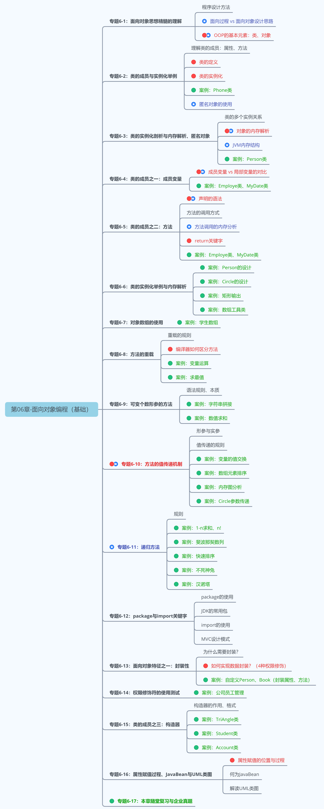

学习面向对象内容的三条主线：
* Java 类及类的成员：（重点）属性、方法、构造器；（熟悉）代码块、内部类；
* 面向对象的特征：封装、继承、多态（、抽象）；
* 其他关键字的使用：`this`、`super`、`package`、`import`、`static`、`final`、`interface`、`abstract` 等。

## 一、面向对象编程概述（了解）

### 1.1 程序设计的思路

面向对象，是软件开发中的一类编程风格、开发范式。除了面向对象，还有面向过程、指令式编程和函数式编程。在所有的编程范式中，我们接触最多的还是面向过程和面向对象两种。

> 类比 - 史书类型：
> * 纪传体：以人物传记为中心，“本纪”叙述帝王、“世家”记叙王侯封国和特殊人物，“列传”记叙民间人物。
> * 编年体：按年、月、日顺序编写。
> * 国别体：是一部分国记事的历史散文，分载多国历史。

早期先有面向过程思想，随着软件规模的扩大、问题复杂性的提高，面向过程的弊端越来越明显，出现了面向对象思想并成为目前主流的方式。

1. **面向过程的程序设计思想（Process-Oriented Programming）**，简称 `POP`：
   * 关注的焦点是**过程**：过程就是操作数据的步骤。如果某个过程的实现代码重复出现，那么就可以把这个过程抽取为一个**函数**。这样就可以大大简化冗余代码，便于维护。
   * 典型的语言：C 语言。
   * 代码结构：以**函数**为组织单位。
   * 是一种“**执行者思维**”，适合解决简单问题。扩展能力差、后期维护难度较大。
2. **面向对象的程序设计思想（Object Oriented Programming）**，简称 `OOP`：
   * 关注的焦点是**类**：在计算机程序设计过程中，参照现实中事物，将事物的属性特征、行为特征抽象出来，用类来表示。
   * 典型的语言：Java、C#、C++、Python、Ruby 和 PHP 等。
   * 代码结构：以**类**为组织单位。每种事物都具备自己的**属性**和**行为 / 功能**。
   * 是一种“**设计者思维**”，适合解决复杂问题。代码扩展性强、可维护性高。

### 1.2 由实际问题考虑如何设计程序

**思考 1：如何开车？**

面向过程思想思考问题时，我们首先思考“**怎么按步骤实现？**”并将步骤对应成方法，一步一步，最终完成。这个适合**简单任务**，不需要**过多协作**的情况。针对如何开车，可以列出步骤：
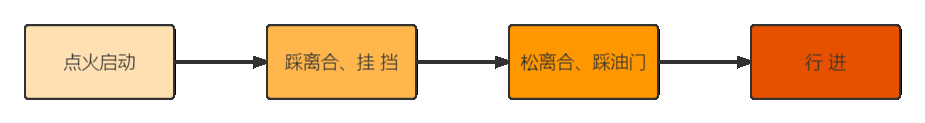

面向过程适合简单、不需要协作的事务，重点关注如何执行。

**思考 2：如何造车？**

造车太复杂，需要**很多协作**才能完成。此时我们思考的是“**车怎么设计？**”，而不是“怎么按特定步骤造车的问题”。这就是思维方式的转变，前者就是面向对象思想。所以，面向对象（Oriented-Object）思想更契合人的思维模式。

用面向对象思想思考“如何设计车”：


自然地，我们就会从“车由什么组成”开始思考。发现，车由如下结构组成：
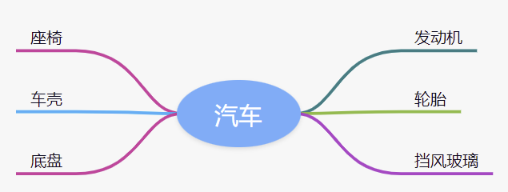

我们找轮胎厂完成制造轮胎的步骤，发动机厂完成制造发动机的步骤，……；这样，大家可以同时进行车的制造，最终进行组装，大大提高了效率。但是，具体到轮胎厂的一个流水线操作，仍然是有步骤的，还是离不开面向过程思维！

因此，**面向对象可以帮助我们从宏观上把握、从整体上分析整个系统。**但是，具体到实现部分的微观操作（就是一个个方法），仍然需要面向过程的思路去处理。

> 注意：我们千万不要把面向过程和面向对象对立起来。它们是相辅相成的。面向对象离不开面向过程！

**类比举例 1：**

> 当需求单一，或者简单时，我们一步步去操作没问题，并且效率也挺高。
>
> 可随着需求的更改、功能的增多，发现需要面对每一个步骤很麻烦了，这时就开始思索，**能不能把这些步骤和功能进行封装，封装时根据不同的功能，进行不同的封装，功能类似的封装在一起。**这样结构就清晰了很多。用的时候，找到对应的类就可以了。这就是面向对象的思想。

**类比举例 2 - 人把大象装进冰箱：**
* 面向过程：
    ```java
    1. 打开冰箱

    2. 把大象装进冰箱

    3. 把冰箱门关住

    ```
* 面向对象：
    ```java
    人{
        打开(冰箱){
            冰箱.开门();
        }
        操作(大象){
            大象.进入(冰箱);
        }
        关闭(冰箱){
            冰箱.关门();
        }
    }

    冰箱{
        开门(){ }
        关门(){ }
    }

    大象{
        进入(冰箱){ }
    }

    ```

练习：抽象出下面系统中的“类”及其关系。
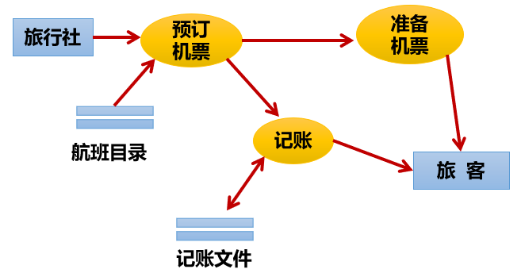

## 二、Java 语言的基本元素：类和对象

### 2.1 引入

人认识世界，其实就是面向对象的。比如，我们认识一下美人鱼（都没见过）：


经过“仔细学习”，发现美人鱼通常具备一些特征：
* 女孩；
* 有鱼尾；
* 美丽。

这个总结的过程，其实是**抽象化**的过程。抽象出来的美人鱼的特征，可以归纳为一个**美人鱼类**。而图片中的都是这个类呈现出来的**具体的对象**。

### 2.2 类和对象概述

**类（Class）**和**对象（Object）**是面向对象的核心概念。

**1. 什么是类？**
**类**：具有相同特征的事物的抽象描述，是**抽象的**、概念上的定义。

**2. 什么是对象？**
**对象**：实际存在的该类事物的**每个个体**，是**具体的**，因而也称为**实例（instance）**。


可以理解为：`类 => 抽象概念的人` 而 `对象 => 实实在在的某个人`。


**3. 类与对象的关系错误理解**

> 曰：“白马非马，可乎？”
> 曰：“可。”
> 曰：“何哉？”
> 曰：“马者，所以命形也。白者，所以命色也。命色者，非命形也，故曰白马非马。”


### 2.3 类的成员概述

> 面向对象程序设计的重点是**类的设计**。
>
> 类的设计，其实就是**类的成员的设计**。

现实世界的生物体，大到鲸鱼，小到蚂蚁，都是由最基本的**细胞**构成的。同理，Java 代码世界是由诸多个不同功能的**类**构成的。


现实生物世界中的细胞又是由什么构成的呢？细胞核、细胞质、……
Java 中用类 class 来描述事物也是如此。类，是一组相关**属性**和**行为**的集合，这也是类最基本的两个成员。
* **属性**：该类事物的状态信息。对应类中的**成员变量**。
  * `成员变量 <=> 属性 <=> Field（字段、域）`。
* **行为**：该类事物要做什么操作，或者基于事物的状态能做什么。对应类中的**成员方法**。
  * `（成员）方法 <=> 函数（、过程） <=> Method`。


举例：


### 2.4 面向对象完成功能的三步骤（重要）

**步骤 1：类的定义**

类的定义使用关键字：`class`。格式如下：
```java
[修饰符] class 类名{
    属性声明;
    方法声明;
}
```

**步骤 2：对象的创建**

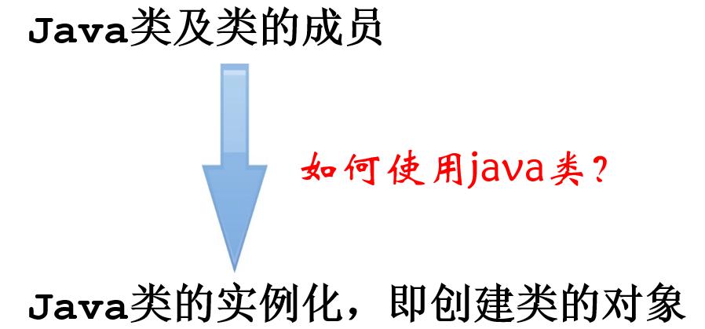

创建对象，使用关键字：`new`。

创建对象语法：
```java
// 方式 1：给创建的对象命名
// 把创建的对象用一个引用数据类型的变量保存起来，这样就可以反复使用这个对象了
类名 对象名 = new 类名();

// 方式 2：
new 类名(); // 也称为匿名对象
```

**步骤 3：对象调用属性或方法**

对象是类的一个**实例**，必然具备该类事物的属性和行为（即方法）。

使用 “`对象名.属性`” 或 “`对象名.方法`” 的方式访问对象成员（包括属性和方法）。

示例代码：
```java
/* Phone.java */

public class Phone {

    // 属性
    String name;    // 品牌
    double price;   // 价格


    // 方法
    public void call(){
        System.out.println("手机能够拨打电话");
    }

    public void sendMessage(String message){
        System.out.println("发送信息：" + message);
    }

    public void playGame(){
        System.out.println("手机可以玩游戏");
    }
}


/* PhoneTest.java */

public class PhoneTest {    // 是 Phone 类的测试类
    public static void main(String[] args) {

        // 复习：数据类型 变量名 = 变量值
//        Scanner scann = new Scanner(System.in);

        // 创建 Phone 的对象
        Phone p1 = new Phone();

        // 通过 Phone 的对象，调用其内部声明的属性或方法
        // 格式："对象.属性" 或 "对象.方法"
        p1.name = "huawei mate50";
        p1.price = 6999;

        System.out.println("name = " + p1.name + "，price = " + p1.price);

        // 调用方法
        p1.call();
        p1.sendMessage("有内鬼，终止交易");
        p1.playGame();
    }
}

```

### 2.5 匿名对象（anonymous object）

我们也可以不定义对象的句柄，而直接调用这个对象的方法。这样的对象叫做匿名对象。
  * 如：`new Person().shout();`。

使用情况：
* 如果一个对象只需要进行一次方法调用，那么就可以使用匿名对象。
* 我们经常将匿名对象作为实参传递给一个方法调用。

## 三、对象的内存解析

### 3.1 JVM 内存结构划分

HotSpot（Oracle 自己发布的 Java 虚拟机，即官方发布的虚拟机） Java 虚拟机的架构图如下。其中我们主要关心的是运行时数据区部分（Runtime Data Area）。
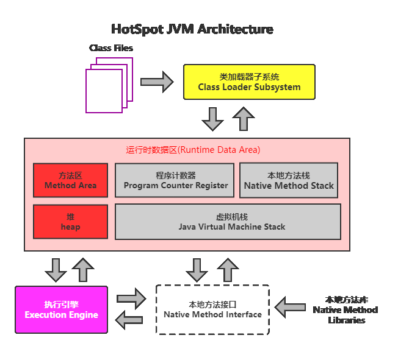

其中：
* **堆（Heap）**：此内存区域的唯一目的就是存放对象实例，几乎所有的对象实例都在这里分配内存。这一点在 Java 虚拟机规范中的描述是：所有的对象实例以及数组都要在堆上分配。
  * 即：`new` 出来的结构（比如：数组实体、对象的实体），包括对象中的属性。
* **栈（Stack）**：是指虚拟机栈。虚拟机栈用于存储局部变量等。局部变量表存放了编译器可知长度的各种基本数据类型（`boolean`、`byte`、`char`、`short`、`int`、`float`、`long`、`double`）、对象引用（`reference` 类型，它不等同于对象本身，是对象在堆内存的首地址）。方法执行完，自动释放。
  * 即：方法内定义的变量，存储在栈中。
* **方法区（Method Area）**：用于存储已被虚拟机加载的类信息、常量、静态变量、即时编译器编译后的代码等数据。
  * 即：存放类的模板，比如 `Person` 类的模板。

### 3.2 对象的内存解析

举例：
```java
class Person {  // 类：人
    String name;
    int age;
    boolean isMale;
}

public static PersonTest {  // 测试类
    public static void main(String[] args) {
        Person p1 = new Person();
        p1.name = "赵同学";
        p1.age = 20;
        p1.isMale = true;

        Person p2 = new Person();
        p2.age = 10;

        Person p3 = p1;
        p3.name = "郭同学";
    }
}

```
内存解析图：
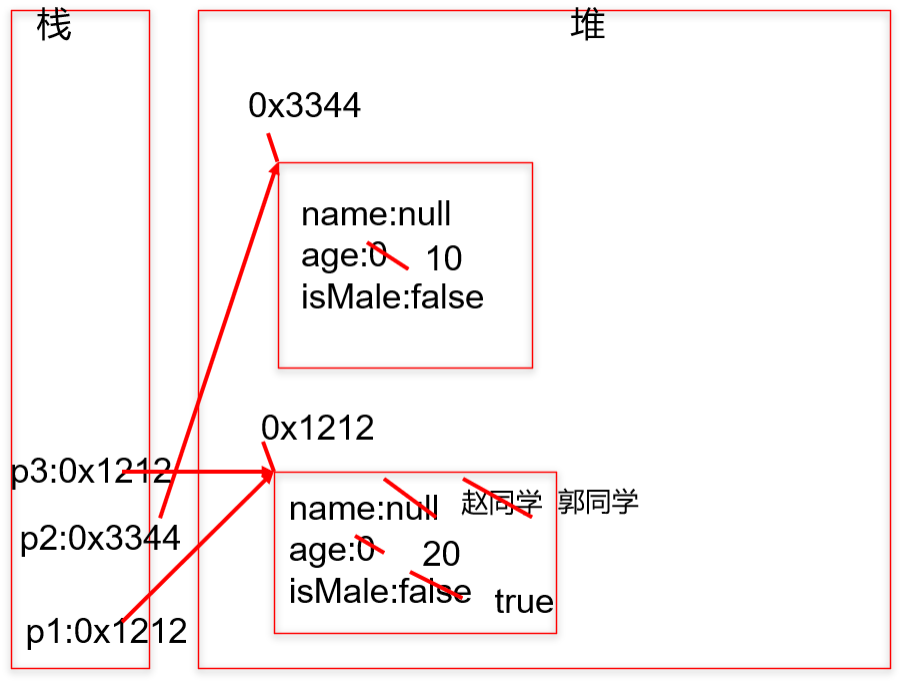

> 说明：
> * 堆：凡是 `new` 出来的结构（对象、数组）都存放在堆空间中。
> * 对象的属性存放在堆空间中。
> * 创建一个类的多个对象（比如 `p1`、`p2`），则每个对象都拥有当前类的一套“副本”（即属性）。当通过一个对象修改其属性时，不会影响其他对象此属性的值。
> * 当声明一个新的变量使用现有的对象进行赋值时（比如 `p3 = p1`），此时并没有在堆空间中创建新的对象，而是两个变量共同指向了堆空间中同一个对象；当通过一个对象修改属性时，会影响另外一个对象对此属性的调用。

**1. 创建类的一个对象，属性赋值：**

示例代码：
```java
public static void main(String[] args) {
    Person p1 = new Person();
    p1.name = "杰克";
    p1.age = 24;
    p1.gender = '男';
}
```

内存解析：
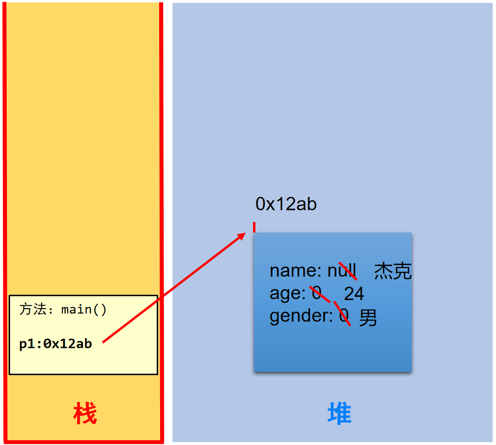

**2. 创建类的多个对象，属性赋值：**

示例代码 1：
```java
public static void main(String[] args) {
    Person p1 = new Person();
    p1.name = "杰克";
    p1.age = 24;

    // 创建 Person 的对象 2
    Person p2 = new Person();
    p2.name = "露丝";
    p2.age = 20;

    p1.age = 26;
    System.out.println(p2.age); // 20
}
```
内存解析 1：
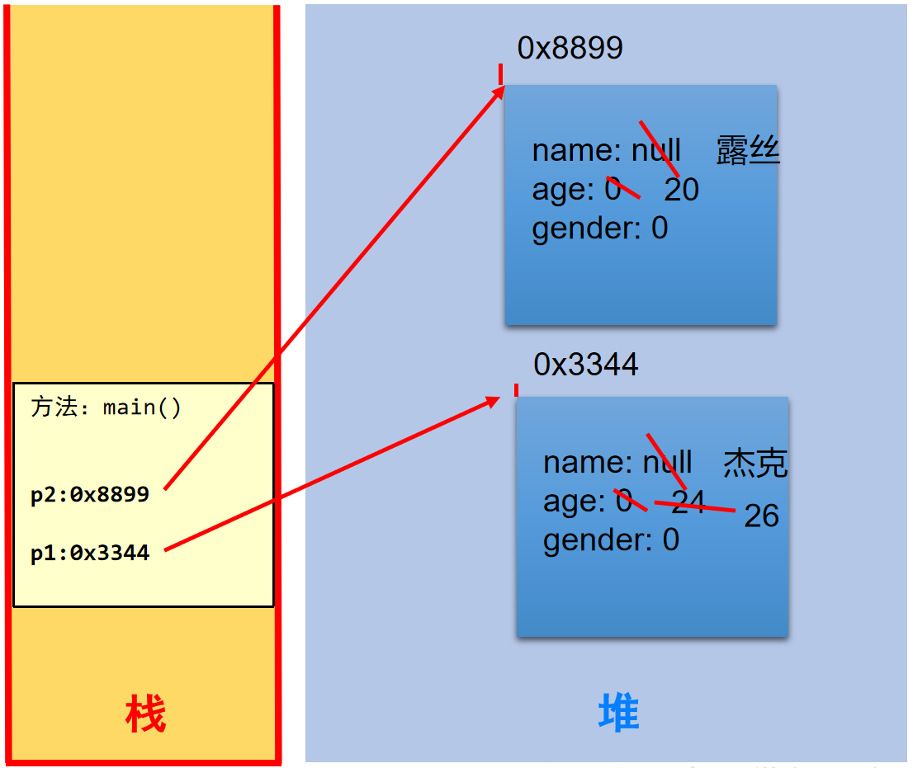

示例代码 2：
```java
public static void main(String[] args) {
    Person p1 = new Person();
    p1.name = "杰克";
    p1.age = 24;

    // 创建 Person 的对象 2
    Person p2 = new Person();
    p2.name = "露丝";
    p2.age = 20;

    p1.age = 26;
    System.out.println(p2.age); // 20

    Person p3 = p1;
    p3.age = 28;
}
```
内存解析 2：
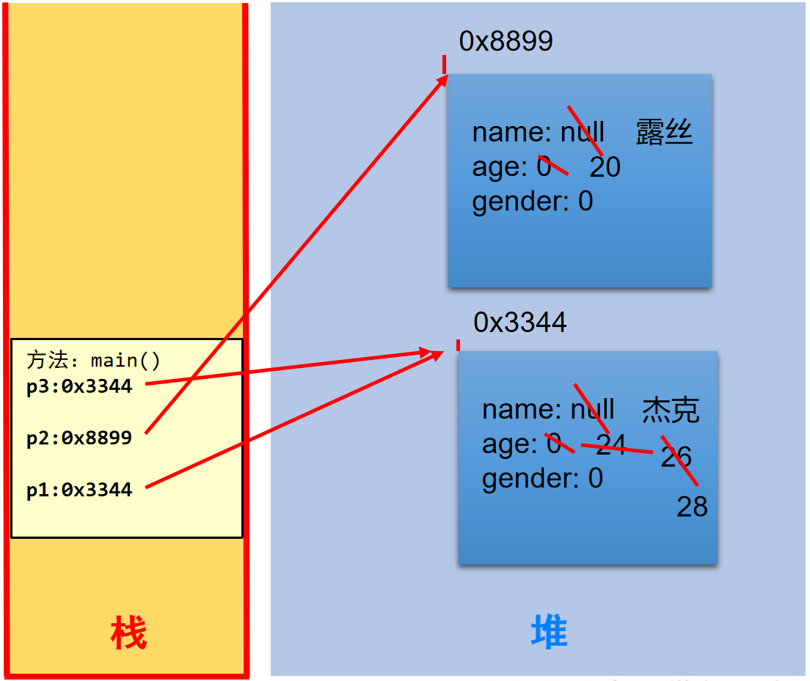

强调：
**1. 创建了 `Person` 类的两个对象：**

```java
Person p1 = new Person();
Person p2 = new Person();
```
说明：创建类的多个对象时，每个对象在堆空间中有一个对象实体，每个对象实体中保存着一份类的属性；如果修改某一个对象的某属性值时，不会影响其他对象此属性的值。

示例代码：
```java
p1.age = 10;
p2.age = 20;

p1.age = 30;
System.out.println(p2.age); // 20
```
**2. 声明类的两个变量：**

```java
Person p1 = new Person();
Person p3 = p1;
```
说明：此时的 `p1`、`p3` 两个变量指向了堆空间中的同一个对象实体（或 `p1`、`p3` 保存的地址值相同）；如果通过其中某一个对象变量修改对象的属性时，会影响另一个对象变量此属性的值。

示例代码：
```java
p1.age = 10;
p3.age = 20;
System.out.println(p1.age); // 20
```

> **面试题：对象名中存储的是什么呢？**
>
> 答：对象地址。
>
> ```java
> public class StudentTest{
>     public static void main(String[] args){
>         System.out.println(new Student());  // Student@7852e922
> 
>         Student stu = new Student();
>         System.out.println(stu);    // Student@4e25154f
> 
>         int[] arr = new int[5];
>         System.out.println(arr);    // [I@70dea4e
>     }
> }
> 
> ```
> 直接打印对象名和数组名都是显示 “`类型@对象的 hashCode 值`”，所以说**类、数组都是引用数据类型，引用数据类型的变量中存储的是对象的地址，或者说指向堆中对象的首地址。**
> 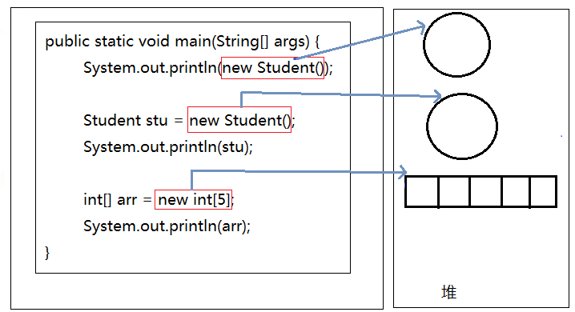

## 四、类的成员之一：成员变量（field）

### 4.1 如何声明成员变量

语法格式：
```java
[修饰符 1] class 类名{
    [修饰符 2] 数据类型 成员变量名 [= 初始化值];
}
```

说明：
* 位置要求：必须在类中，方法外。
* 修饰符 2（暂不考虑）：
  * 常用的权限修饰符有：`private`、缺省、`protected`、`public`（用于表明所修饰的结构可调用的范围的大小）；
  * 其他修饰符：`static`、`final`。
* 数据类型：
  * 任何基本数据类型（如 `int`、`Boolean`）或任何引用数据类型。
* 成员变量名：
  * 属于标识符，符合命名规则和规范即可。
* 初始化值：
  * 根据情况，可以显式赋值；也可以不赋值，使用默认值。

### 4.2 成员变量 vs 局部变量

#### 4.2.1 变量的分类：成员变量与局部变量

在方法体外、类体内声明的变量称为成员变量；在方法体内部（、方法形参、构造器内、构造器形参、代码块内）等位置声明的变量称为局部变量。

> 属性的几个称谓：成员变量、属性、field（字段、域）。

示例图：
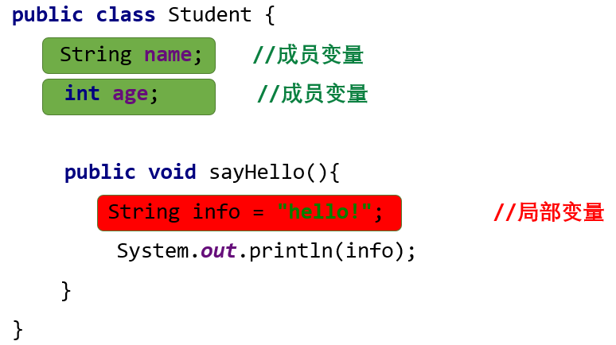

所有变量的分类结构图：
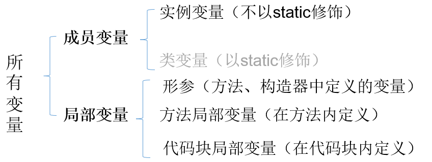

> 其中，`static` 可以将成员变量分为两大类，分别为静态变量和非静态变量。其中静态变量又称为类变量，非静态变量又称为实例变量或者属性。接下来先学习实例变量。

#### 4.2.2 成员变量与局部变量的对比

相同点：
* 变量声明的格式相同：`数据类型 变量名 = 初始化值`；
* 变量必须先声明、后初始化、再使用；
* 变量都有其对应的作用域，只在其作用域内是有效的。

不同点：
* 声明位置和方式：
  * 实例变量：在类中方法外。
  * 局部变量：在方法体 `{}` 中、构造器内部或方法的形参列表、代码块中。
* 在内存中存储的位置不同：
  * 实例变量：随着对象的创建，存储在堆空间中。
  * 局部变量：存储在栈空间中。
* 生命周期：
  * 实例变量：和对象的生命周期一样，随着对象的创建而存在，随着对象被 GC 回收而消亡，而且每一个对象的实例变量是独立的；
    * 即：随着对象的创建而创建，随着对象的消亡而消亡。
  * 局部变量：和方法调用的生命周期一样，每一次方法被调用而存在，随着方法执行的结束而消亡，而且每一次方法调用都是独立；
    * 即：随着方法对应的栈帧入栈，局部变量会在栈中分配；随着方法对应的栈帧出栈，局部变量消亡。
* 作用域：
  * 实例变量：通过对象就可以使用，本类中直接调用，其他类中通过 “`对象.实例变量`” 调用；
    * 即：在整个类的内部都是有效的。
  * 局部变量：出了作用域就不能使用；
    * 即：仅限于声明此局部变量所在的方法（或构造器、代码块）中。
* 是否可以有权限修饰符进行修饰：
  * 实例变量：`public`、`protected`、`private`、`final`、`volatile`、`transient` 等；
    * 即：属性是可以使用权限修饰符进行修饰的。
  * 局部变量：`final`；
    * 即：局部变量不能使用任何权限修饰符进行修饰的。
* 是否有默认值：
  * 实例变量：都有默认初始化值；
    * 即：意味着，如果没有给属性进行显式初始化赋值，则会有默认初始化值。
  * 局部变量：都没有默认初始化值，必须手动初始化；其中的形参比较特殊，靠实参给它初始化；
    * 即：意味着，在使用局部变量之前，必须要显式的赋值，否则报错。

> 注意：对于方法的形参而言，在调用方法时，给此形参赋值即可。

#### 4.2.3 对象属性的默认初始化赋值

当一个对象被创建时，会对其中各种类型的成员变量自动进行初始化赋值。
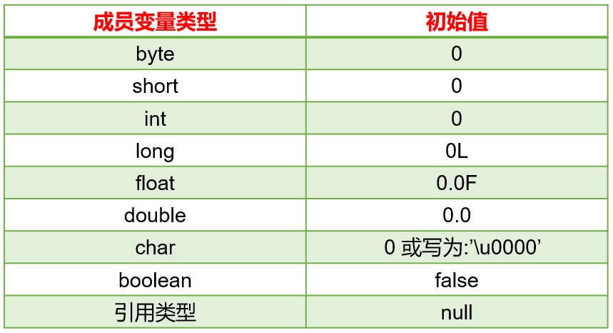

#### 4.2.4 举例

**举例 1：**

示例代码：
```java
class Person {  // 人类
    // 1. 属性
    String name;    // 姓名
    int age = 1;    // 年龄
    boolean isMale; // 是否是男性

    public void show(String nation) {
        // nation：局部变量
        String color;   // color：局部变量
        color = "yellow";
    }
}

// 测试类
class PersonTest {
    public static void main(String[] args) {
        Person p = new Person();
        p.show("CHN");
    }
}

```

上述示例代码对应内存解析如下图所示：
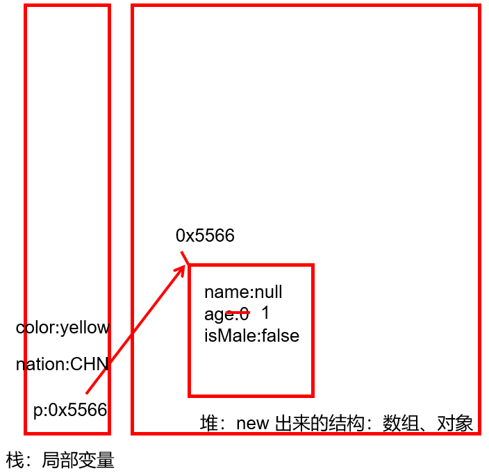

**举例 2：**
> 声明员工类 `Employee`，包含属性、编号 `id`、姓名 `name`、年龄 `age`、薪资 `salary`。
>
> 声明 `EmployeeTest` 测试类，并在 `main` 方法中，创建 2 个员工变量，并为属性赋值，并打印两个员工的信息。

示例代码：
```java
/* Employee.java */

public class Employee {

    // 属性（或成员变量）
    int id; // 编号
    String name;    // 姓名
    int age;    // 年龄
    double salary;  // 薪资


}


/* EmployeeTest.java */

public class EmployeeTest {
    public static void main(String[] args) {
        // 创建类的实例（或 创建类的对象、类的实例化）
        Employee emp1 = new Employee();

        System.out.println(emp1);   // 类型@地址值

        emp1.id = 1001;
        emp1.name = "Tom";
        emp1.age = 24;
        emp1.salary = 7800;

        System.out.println("id = " + emp1.id + "，name = " + emp1.name +
                "，age = " + emp1.age + "，salary = " + emp1.salary);

        // 创建 Employee 的第 2 个对象
//        Employee emp3 = emp1;   // 错误写法
        Employee emp2 = new Employee();

        System.out.println("id = " + emp2.id + "，name = " + emp2.name +
                "，age = " + emp2.age + "，salary = " + emp2.salary);

    }
}

```

**举例 3：**
> 1. 声明一个 `MyDate` 类型，有属性：年 `year`、月 `month`、日 `day`；
> 2. 声明一个 `Employee` 类型，包含属性：编号、姓名、年龄、薪资、生日（`Mydate` 类型）；
> 3. 在 `EmployeeTest` 测试类中的 `main()` 中，创建两个员工对象，并为他们的姓名和生日赋值，并显示。

示例代码：
```java
/* MyDate.java */

public class MyDate {
    int year;   // 年
    int month;  // 月
    int day;    // 日
}


/* Employee.java */

public class Employee {

    int id; // 编号
    String name;    // 姓名
    int age;    // 年龄
    double salary;  // 薪资
    MyDate birthday;    // 生日
}


/* EmployeeTest.java */

public class EmployeeTest {
    public static void main(String[] args) {

        // 创建 Employee 的一个实例
        Employee emp1 = new Employee();

        emp1.id = 1001;
        emp1.name = "杰克";   // emp1.name = new String("杰克");
        emp1.age = 24;
        emp1.salary = 8900;
        emp1.birthday = new MyDate();
        emp1.birthday.year = 1998;
        emp1.birthday.month = 2;
        emp1.birthday.day = 28;
        /*
        另一种写法：
        * MyDate mydate1 = new MyDate();
        * emp1.birthday = mydate1;
        * */

        // 打印员工信息
        System.out.println("id = " + emp1.id + "，name = " + emp1.name +
                "，age = " + emp1.age + "，salary = " + emp1.salary +
                "，birthday = [" + emp1.birthday.year + " 年 " + emp1.birthday.month +
                " 月 " + emp1.birthday.day + " 日]");

    }
}

```

## 五、类的成员之二：方法（method）

### 5.1 方法的引入


《街霸》游戏中，每次人物出拳、出脚或跳跃等动作都需要编写 50 - 80 行的代码，在每次出拳、出脚或跳跃的地方都需要重复地编写这 50 - 80 行代码，这样程序会变得**很臃肿**，可读性也非常差。为了解决代码重复编写的问题，可以将出拳、出脚或跳跃的代码提取出来放在一个 `{}` 中，并为这段代码起个名字，这样在每次的出拳、出脚或跳跃的地方通过这个名字来调用这个 `{}` 的代码就可以了。

上述过程中，所提取出来的代码可以被看作是程序中定义的一个方法，程序在需要出拳、出脚或跳跃时调用该方法即可。

### 5.2 方法（method、函数）的理解

**方法**是类或对象行为特征的抽象，用来完成某个功能操作。在某些语言中也称为**函数**或**过程**。

将功能封装为方法的目的是：可以**实现代码重用，减少冗余，简化代码**。

Java 里的方法**不能独立存在**，所有的方法必须定义在类里。

举例 1：
* `Math.random()` 的 `random()` 方法；
* `Math.sqrt(x)` 的 `sqrt(x)` 方法；
* `System.out.println(x)` 的 `println(x)` 方法；
* `new Scanner(System.in).nextInt()` 的 `nextInt()` 方法；
* `Arrays` 类中的 `binarySearch()` 方法、`sort()` 方法、`equals()` 方法。

举例 2：
```java
public class MethodTest {
    public static void main(String[] args) {

    }
}

class Person{

    // 属性
    String name;
    int age;
    char gender;

    // 方法
    public void eat(){
        System.out.println("人吃饭");
    }

    public void sleep(int hour){
        System.out.println("人至少每天睡眠 " + hour + " 小时");
    }

    public String interests(String hobby){
        String info = "我的爱好是" + hobby;
        System.out.println(info);
        return info;
    }

    public int getAge(){
        return age;
    }
}

```

### 5.3 如何声明方法

#### 5.3.1 声明方法的语法格式

声明方法的语法格式如下所示：
```java
权限修饰符 [其他修饰符] 返回值类型 方法名([形参列表]) [throws 异常列表]{  // 方法头
  方法体的功能代码  // 方法体
}
```
> 注意：`[]` 中的内容不是必须的，以后再讲。

**1. 一个完整的方法 = 方法头 + 方法体：**
* 方法头就是 `[修饰符] 返回值类型 方法名([形参列表])[throws 异常列表]`，也称为**方法签名**。通常调用方法时只需要关注方法头就可以，从方法头可以看出这个方法的功能和调用格式。
* 方法体就是方法被调用后要执行的代码。对于调用者来说，不了解方法体如何实现的，并不影响方法的使用。

**2. 方法头可能包含 5 个部分：**
* 修饰符：可选的。方法的修饰符也有很多，例如 `public`、`protected`、`private`、`static`、`abstract`、`native`、`final`、`synchronized` 等，后面会一一学习。
  * 其中，权限修饰符有 `private`、缺省、`protected`、`public`；在讲封装性之前，我们先默认使用 `public` 修饰方法。
  * 其中，根据是否有 `static`，可以将方法分为静态方法和非静态方法。其中静态方法又称为类方法，非静态方法又称为实例方法。咱们在讲 `static` 前先学习实例方法。
* 返回值类型：表示方法运行的结果的数据类型，方法执行后将结果返回到调用者。
  * 无返回值，则声明 `void`。比如 `System.out.println(x)` 的 `println(x)` 方法、`Arrays` 的 `sort()`。
  * 有返回值，则声明出返回值类型（可以是任意类型）；与方法体中 `return 返回值（即返回值类型的变量或常量）` 搭配使用。比如 `Math.random()`、`new Scanner(System.in).nextInt()` 等。

> [经验] 我们在声明方法时，要不要提供返回值类型呢？
> * 根据方法具体实现的功能来决定；换句话说，具体问题具体分析。
> * 根据题目要求。

* 方法名：属于标识符，命名时遵循标识符命名规则和规范，“见名知意”。
* 形参列表：表示完成方法体功能时需要外部提供的数据列表，可以包含零个、一个或多个参数。
  * 格式：`(形参类型1 形参1, 形参类型2 形参2, ...)`。
  * 分类：无形参列表、有形参列表。
    * 无形参列表：不能省略一对 `()`；比如 `Math.random()`、`new Scanner(System.in).nextInt()`。
    * 有形参列表：根据方法调用时需要的不确定的变量的类型和个数，确定形参的类型和个数；比如 `Arrays` 类中的 `binarySearch()` 方法、`sort()` 方法、`equals()` 方法。
  * 无论是否有参数，`()` 不能省略。
  * 如果有参数，每一个参数都要指定数据类型和参数名，多个参数之间使用逗号分隔，例如：
    * 一个参数：`(数据类型 参数名)`；
    * 二个参数：`(数据类型1 参数1, 数据类型2 参数2)`。
  * 参数的类型可以是基本数据类型、引用数据类型。
* `throws` 异常列表：可选。

> [经验] 我们在声明方法时，是否需要形参列表呢？
> * 根据方法具体实现的功能来决定；换句话说，具体问题具体分析。
> * 根据题目要求。

**3. 方法体：**
* 方法体必须有 `{}` 括起来，在 `{}` 中编写完成方法功能的代码。

**4. 关于方法体中 `return` 语句的说明：**
* `return` 语句的作用是结束方法的执行，并将方法的结果返回去。
* 如果返回值类型不是 `void`，方法体中必须保证一定有 `return 返回值;` 语句，并且要求该返回值结果的类型与声明的返回值类型一致或兼容。
* 如果返回值类型为 `void` 时，方法体中可以没有 `return` 语句；如果要用 `return` 语句提前结束方法的执行，那么 `return` 后面不能跟返回值，直接写 `return;` 就可以。
* `return` 语句后面就不能再写其他代码了，否则会报错：`Unreachable code`。

> 补充：
>
> 方法的分类 - 按照是否有形参及返回值：
> 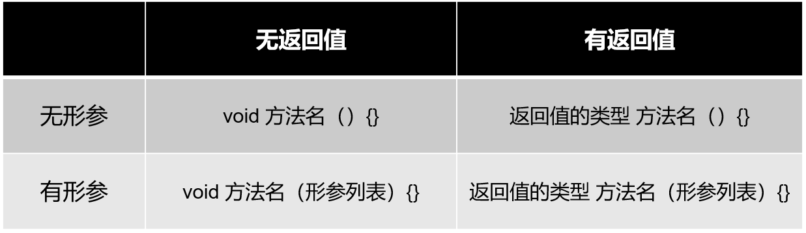

#### 5.3.2 类比举例

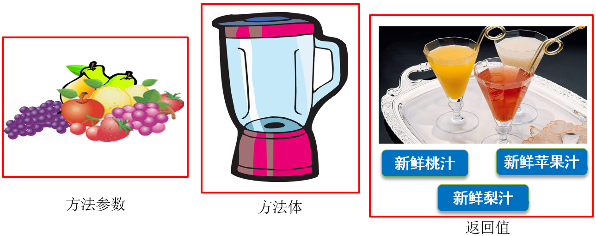

#### 5.3.3 代码示例

案例：
> 将属性测试的 exer1 中关于员工信息的输出内容放到方法中，通过调用方法显示。

示例代码：
```java
/* Employee.java */

public class Employee {

    // 属性（或成员变量）
    int id; // 编号
    String name;    // 姓名
    int age;    // 年龄
    double salary;  // 薪资

    // 定义一个方法，用于显示员工的信息
    public void show(){
        System.out.println("id = " + id + "，name = " + name +
                "，age = " + age + "，salary = " + salary);
    }

    public String show1(){
        return "id = " + id + "，name = " + name +
                "，age = " + age + "，salary = " + salary;
    }
}


/* EmployeeTest.java */

public class EmployeeTest {
    public static void main(String[] args) {
        // 创建类的实例（或 创建类的对象、类的实例化）
        Employee emp1 = new Employee();

        System.out.println(emp1);   // 类型@地址值

        emp1.id = 1001;
        emp1.name = "Tom";
        emp1.age = 24;
        emp1.salary = 7800;

//        System.out.println("id = " + emp1.id + "，name = " + emp1.name +
//                "，age = " + emp1.age + "，salary = " + emp1.salary);

        // 替换为：
        emp1.show();

//        System.out.println(emp1.show());  // 编译报错

        System.out.println(emp1.show1());   // 编译通过

        // 创建 Employee 的第 2 个对象
//        Employee emp3 = emp1;   // 错误写法
        Employee emp2 = new Employee();

//        System.out.println("id = " + emp2.id + "，name = " + emp2.name +
//                "，age = " + emp2.age + "，salary = " + emp2.salary);

        // 替换为：
        emp2.show();

    }
}

```

### 5.4 如何调用实例方法

方法通过方法名被调用，且只有被调用才会执行。

方法调用语法格式：
```java
对象.方法名([实参列表])
```

### 5.5 使用的注意点

方法使用的注意点如下：
1. 必须先声明后使用，且方法必须定义在类的内部。
2. 调用一次就执行一次，不调用不执行。
3. 方法中可以调用本类中的（其他）方法或属性。
4. 不可以在方法内部定义方法。

正确示例：
```java
类{
  方法 1(){

  }
  方法 2(){

  }
}
```
错误示例：
```java
类{
  方法 1(){
    方法 2(){ // 位置错误

    }
  }
}
```

### 5.6 关键字 `return` 的使用

`return` 在方法中的作用：
* 作用 1：结束一个方法。
* 作用 2：结束一个方法的同时，可以返回数据给方法的调用者（方法声明中如果有返回值类型，则方法内需要搭配 `return` 使用）。

注意点：在 `return` 关键字的直接后面不能声明执行语句。

### 5.7 方法调用内存分析

方法**没有被调用**的时候，都在**方法区**中的字节码文件（`.class`）中存储。

方法**被调用**的时候，需要进入到**栈内存**中运行。方法每调用一次就会在栈中有一个**入栈**动作，即给当前方法开辟一块独立的内存区域，用于存储当前方法的局部变量的值。

当方法执行结束后，会释放该内存，称为**出栈**。如果方法有返回值，就会把结果返回调用处；如果没有返回值，就直接结束，回到调用处继续执行下一条指令。

> 栈结构：先进后出，后进先出。

形参：方法在声明时，一对 `()` 内声明的一个或多个形式参数，简称为形参。
实参：方法在被调用时，实际传递给形参的变量或常量，就称为实际参数，简称实参。

对于对象调用方法的过程，示例代码如下所示：
```java
public static void main(String[] args) {
  Person p1 = new Person();
  p1.name = "杰克";
  p1.age = 24;
  p1.gender = '男';

  p1.eat();

  p1.sleep(6);
  p1.interests("编程");
}
```

内存解析：
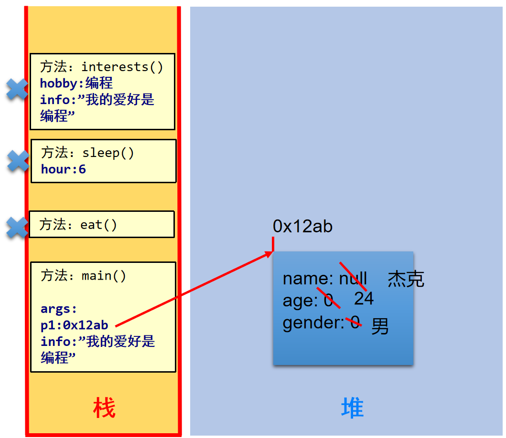

> 注意：栈中不存在 GC，只存在入栈和出栈；GC 存在于堆。

### 5.8 练习

**案例 1：**
> 1. 创建 `Person` 类的对象，设置该对象的 `name`、`age` 和 `gender` 属性。调用 `study` 方法，输出字符串“`studying`”；调用 `showAge()` 方法，返回 `age` 值；调用 `addAge(int addAge)` 方法给对象的 `age` 属性值增加 `addAge` 岁，比如 `2` 岁。
> 2. 创建第二个对象，执行上述操作，体会同一个类的不同对象之间的关系。

示例代码：
```java
/* Person.java */

public class Person {
    String name;
    int age;
    char gender;

    public void study(){
        System.out.println("studying");
    }

    public int showAge(){
        return age;
    }

    public void addAge(int addAge){
        age += addAge;
    }
}


/* PersonTest.java */

public class PersonTest {
    public static void main(String[] args) {
        Person p1 = new Person();

        // 调用属性
        p1.name = "Tom";
        p1.age = 12;
        p1.gender = '男';

        // 调用方法
        p1.study();

        p1.addAge(2);

        int age = p1.showAge();
        System.out.println("age = " + age); // 12 -> 14


        Person p2 = new Person();

        System.out.println(p2.age); // 0

        p2.addAge(10);

        System.out.println(p2.showAge());   // 10

        System.out.println(p1.showAge());   // 14
    }
}

```

**案例 2：**
> 1. 编写程序，声明一个 `method1` 方法，在方法中打印一个 10 * 8 的 `*` 型矩阵，在 `main` 方法中调用该方法。
> 2. 编写程序，声明一个 `method2` 方法，除打印一个 10 * 8 的 `*` 型矩阵外，再计算该矩形的面积，并将其作为方法的返回值。在 `main` 方法中调用该方法，接收返回的面积值并打印。
> 3. 编写程序，声明一个 `method3` 方法，在 `method3` 方法提供 `m` 和 `n` 两个参数，方法中打印一个 m * n 的 `*` 型矩形，并计算该矩形的面积，将其作为方法返回值。在 `main` 方法中调用该方法，接收返回的面积值并打印。

示例代码：
```java
/* Exer02.java */

public class Exer02 {

    public void method1(){
        for (int i = 0; i < 10; i++) {
            for (int j = 0; j < 8; j++) {
                System.out.print("*");
            }
            System.out.println();
        }
    }

    public int method2(){
        for (int i = 0; i < 10; i++) {
            for (int j = 0; j < 8; j++) {
                System.out.print("*");
            }
            System.out.println();
        }

        return 10 * 8;
    }

    public int method3(int m, int n){
        for (int i = 0; i < m; i++) {
            for (int j = 0; j < n; j++) {
                System.out.print("*");
            }
            System.out.println();
        }

        return m * n;
    }
}


/* Exer02Test.java */

public class Exer02Test {
    public static void main(String[] args) {

        // 创建 Exer02 的对象
        Exer02 exer = new Exer02();
//        exer.method1();

//        int area = exer.method2();
//        System.out.println("面积为：" + area);

        int area1 = exer.method3(3, 8);
        System.out.println("面积为：" + area1);
    }
}

```

**案例 3：**
> 利用面向对象的编程方法，设计类 `Circle` 计算圆的面积。

示例代码：
```java
/* Circle.java */

public class Circle {
    // 属性
    double radius;  // 半径

    // 方法
    public void findArea() {
        System.out.println("面积为：" + 3.14 * radius * radius);
    }
    // 或：
    public double findArea2() {
        return 3.14 * radius * radius;
    }

    // 错误的：
//    public void findArea1(double r) {
//        System.out.println("面积为：" + 3.14 * r * r);
//    }

}


/* CircleTest.java */

public class CircleTest {
    public static void main(String[] args) {
        Circle c1 = new Circle();

        c1.radius = 2.3;
        c1.findArea();

        System.out.println("面积为：" + c1.findArea2());
    }
}

```

**案例 4：**
> 根据上一章数组中常用的算法操作，自定义一个操作 `int[]` 的工具类。
>
> 涉及到的方法有：求最大值、最小值、总和、平均数、遍历数组、复制数组、数组反转、数组排序（默认从小到大排序）、查找等。

示例代码：
```java
/* MyArrays.java */

public class MyArrays {

    /**
     * 获取 int[] 数组的最大值
     * @param arr 要获取最大值的数组
     * @return 数组的最大值
     */
    public int getMax(int[] arr) {
        int max = arr[0];
        for (int i = 1; i < arr.length; i++) {
            if (max < arr[i]) {
                max = arr[i];
            }
        }
        return max;
    }

    /**
     * 获取 int[] 数组的最小值
     * @param arr 要获取最小值的数组
     * @return 数组的最小值
     */
    public int getMin(int[] arr) {
        int min = arr[0];
        for (int i = 1; i < arr.length; i++) {
            if (min > arr[i]) {
                min = arr[i];
            }
        }
        return min;
    }

    public int getSum(int[] arr) {
        int sum = 0;
        for (int i = 0; i < arr.length; i++) {
            sum += arr[i];
        }
        return sum;
    }

    public int getAvg(int[] arr) {

        return getSum(arr) / arr.length;
    }

    public void print(int[] arr) {  // [12, 231, 34, ...]
        System.out.print("[");
        for (int i = 0; i < arr.length; i++) {
            if (i == 0) {
                System.out.print(arr[i]);
            } else {
                System.out.print(", " + arr[i]);
            }
        }

        System.out.println("]");
    }

    public int[] copy(int[] arr) {
        int[] newArr = new int[arr.length];
        for (int i = 0; i < arr.length; i++) {
            newArr[i] = arr[i];
        }
        return newArr;
    }

    public void reverse(int[] arr) {
        for (int i = 0, j = arr.length - 1 /* 尾索引 */; i < j; i++, j--) {
            // 交互 arr[i] 与 arr[j] 位置的元素
            int temp = arr[i];
            arr[i] = arr[j];
            arr[j] = temp;
        }
    }

    public void sort(int[] arr) {
        for (int j = 0; j < arr.length - 1; j++) {
            for (int i = 0; i < arr.length - 1 - j; i++) {
                if (arr[i] > arr[i + 1]) {
                    // 交互 arr[i] 和 arr[i + 1]
                    int temp = arr[i];
                    arr[i] = arr[i + 1];
                    arr[i + 1] = temp;
                }
            }
        }
    }

    /**
     * 使用线性查找的算法，查找指定的元素
     * @param arr 待查找的数组
     * @param target 要查找的元素
     * @return target 元素在 arr 数组中的索引位置。若未找到，则返回 -1
     */
    public int linearSearch(int[] arr, int target) {
        for (int i = 0; i < arr.length; i++) {
            if (target == arr[i]) {
                return i;
            }
        }

        // 只要代码执行到此位置，一定是没找到
        return -1;
    }
}


/* MyArraysTest.java */

public class MyArraysTest {
    public static void main(String[] args) {

        MyArrays arrs = new MyArrays();
        int[] arr = new int[] {34, 56, 223, 2, 56, 24, 56, 67, 778, 45};

        // 求最大值
        System.out.println("最大值为：" + arrs.getMax(arr));
        // 求平均值
        System.out.println("平均值为：" + arrs.getAvg(arr));

        // 遍历
        arrs.print(arr);

        // 查找
        int index = arrs.linearSearch(arr, 24);
        if (index >= 0) {
            System.out.println("找到了，位置：" + index);
        } else {
            System.out.println("未找到");
        }

        // 排序
        arrs.sort(arr);
        // 遍历
        arrs.print(arr);
    }
}

```

## 六、对象数组

数组的元素可以是基本数据类型，也可以是引用数据类型。当元素是引用类型中的类时，我们称为对象数组。

### 6.1 案例

定义类 `Student`，包含三个属性：学号 `number`（`int`）、年级 `state`（`int`）、成绩 `score`（`int`）。创建 20 个学生对象，学号为 1 到 20，年级和成绩都由随机数确定。

问题一：打印出 3 年级（`state` 值为 `3`）的学生信息。

问题二：使用冒泡排序按学生成绩排序，并遍历所有学生信息。

> 提示：
> 1. 生成随机数：`Math.random()`，返回值类型为 `double`。
>   * 年级 `[1, 6]`：`(int)(Math.random() * 6 + 1);`。
>   * 分数 `[0, 100]`：`(int)(Math.random() * 101);`。
> 2. 四舍五入取整：`Math.round(double d)`，返回值类型为 `long`。

示例代码：
```java
/* Student.java */

package com.anxin_hitsz_04.example.exer5_objarr;

/**
 * ClassName: Student
 * Package: com.anxin_hitsz_04.example.exer5_objarr
 * Description:
 *
 * @Author AnXin
 * @Create 2026/1/13 20:19
 * @Version 1.0
 */
public class Student {

    // 属性
    int number; // 学号
    int state;  // 年级
    int score;  // 成绩

    // 声明一个方法，显示学生的属性信息
    public String show() {
        return "number：" + number + "，state：" +
                state + "，score：" +  score;
    }
}


/* StudentTest.java */

package com.anxin_hitsz_04.example.exer5_objarr;

/**
 * ClassName: StudentTest
 * Package: com.anxin_hitsz_04.example.exer5_objarr
 * Description:
 *
 * @Author AnXin
 * @Create 2026/1/13 20:19
 * @Version 1.0
 */
public class StudentTest {
    public static void main(String[] args) {

        // 创建 Student[]
        Student[] students = new Student[20];    // String[] strs = new String[20];

        // 使用循环，给数组的元素赋值
        for  (int i = 0; i < students.length; i++) {
            students[i] = new Student();
            // 给每一个学生对象的 number、state、score 属性赋值
            students[i].number = i;
            students[i].state = (int)(Math.random() * 6 + 1);
            students[i].score = (int)(Math.random() * 101);
        }
        // 需求 1：打印出 3 年级（state 值为 3）的学生信息
        for (int i = 0; i< students.length; i++) {
            if (3 == students[i].state) {
                Student stu = students[i];
//                System.out.println("number：" + stu.number + "，state：" +
//                        stu.state + "，score：" +  stu.score);

                System.out.println(stu.show());
            }
        }

        System.out.println("********************************************");


        // 需求 2 ：使用冒泡排序按学生成绩排序，并遍历所有学生信息
        // 排序前遍历
        for (int i = 0; i< students.length; i++) {
            System.out.println(students[i].show());
        }

        System.out.println("********************************************");

        for (int i = 0; i< students.length; i++) {
            for (int j = 0; j< students.length - 1 - i; j++) {
                if (students[j].score > students[j + 1].score) {
                    // 错误的，不满足实际需求！
//                    int temp = students[j].score;
//                    students[j].score = students[j + 1].score;
//                    students[j].score = temp;

                    // 正确的
                    Student temp = students[j];
                    students[j] = students[j + 1];
                    students[j + 1] = temp;
                }
            }
        }

        // 排序后遍历
        for (int i = 0; i< students.length; i++) {
            System.out.println(students[i].show());
        }
    }
}

```

拓展：
> 提供封装 Student 相关操作的工具类，如何实现？

示例代码：
```java
/* Student.java */

package com.anxin_hitsz_04.example.exer5_objarr1;

/**
 * ClassName: Student
 * Package: com.anxin_hitsz_04.example.exer5_objarr
 * Description:
 *
 * @Author AnXin
 * @Create 2026/1/13 20:19
 * @Version 1.0
 */
public class Student {

    // 属性
    int number; // 学号
    int state;  // 年级
    int score;  // 成绩

    // 声明一个方法，显示学生的属性信息
    public String show() {
        return "number：" + number + "，state：" +
                state + "，score：" +  score;
    }
}


/* StudentUtil.java */

package com.anxin_hitsz_04.example.exer5_objarr1;

/**
 * ClassName: StudentUtil
 * Package: com.anxin_hitsz_04.example.exer5_objarr1
 * Description:
 *
 * @Author AnXin
 * @Create 2026/1/13 20:39
 * @Version 1.0
 */
public class StudentUtil {
    /*
    * 打印出指定年级的学生信息
    * */
    public void printStudentsWithIndex(Student[] students, int state) {
        for (int i = 0; i< students.length; i++) {
            if (state == students[i].state) {
                Student stu = students[i];
                System.out.println(stu.show());
            }
        }
    }

    /*
    * 遍历指定多个学生数组
    * */
    public void printStudents(Student[] students) {
        for (int i = 0; i< students.length; i++) {
            System.out.println(students[i].show());
        }
    }

    /*
    * 针对于学生数组，按照 score属性从低到高排列
    * */
    public void sortStudents(Student[] students) {
        for (int i = 0; i< students.length; i++) {
            for (int j = 0; j< students.length - 1 - i; j++) {
                if (students[j].score > students[j + 1].score) {
                    Student temp = students[j];
                    students[j] = students[j + 1];
                    students[j + 1] = temp;
                }
            }
        }
    }
}


/* StudentTest.java */

package com.anxin_hitsz_04.example.exer5_objarr1;

/**
 * ClassName: StudentTest
 * Package: com.anxin_hitsz_04.example.exer5_objarr
 * Description:
 *
 * @Author AnXin
 * @Create 2026/1/13 20:19
 * @Version 1.0
 */
public class StudentTest {
    public static void main(String[] args) {

        // 创建 Student[]
        Student[] students = new Student[20];    // String[] strs = new String[20];

        // 使用循环，给数组的元素赋值
        for  (int i = 0; i < students.length; i++) {
            students[i] = new Student();
            // 给每一个学生对象的 number、state、score 属性赋值
            students[i].number = i;
            students[i].state = (int)(Math.random() * 6 + 1);
            students[i].score = (int)(Math.random() * 101);
        }
        // 需求 1：打印出 3 年级（state 值为 3）的学生信息
        StudentUtil util = new StudentUtil();
        util.printStudentsWithIndex(students, 3);

        System.out.println("********************************************");

        // 需求 2 ：使用冒泡排序按学生成绩排序，并遍历所有学生信息
        // 排序前遍历
        util.printStudents(students);

        System.out.println("********************************************");
        util.sortStudents(students);

        // 排序后遍历
        util.printStudents(students);
    }
}

```

内存解析：
* 示例代码：
    ```java
    public static void main(String[] args) {
        Student[] stus = new Student[3];
        for (int i = 0; i < stus.length; i++) {
            stus[i] = new Student();
        }

        stus[0].number = 1;
        stus[0].state = 5;
        stus[0].score = 78;

    }
    ```
* 内存解析：
    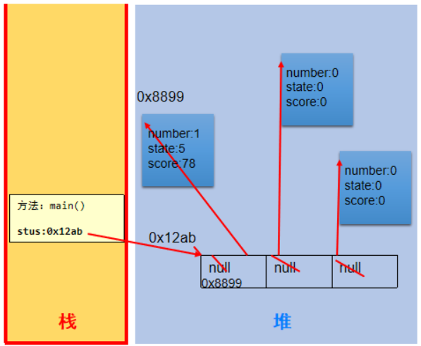

### 6.2 注意点

对象数组，首先要创建数组对象本身，即确定数组的长度，然后再创建每一个元素对象。如果不创建，数组的元素的默认值就是 `null`，所以很容易出现 `空指针异常 NullPointerException`。

## 七、再谈方法

### 7.1 方法的重载（overload）

#### 7.1.1 概念及特点

**方法重载**：在同一个类中，允许存在一个以上的同名方法，只要它们的参数列表不同即可；满足这样特征的多个方法，彼此之间构成方法的重载。
* 参数列表不同，意味着参数个数或参数类型的不同。

例如，`Arrays` 类中 `sort(xxx[] arr)`、`binarySearch(xxx[] arr, xxx)`、`equals(xxx[], yyy[])`。

> 总结为：“两同一不同”。
> * 两同：同一个类、相同的方法名。
> * 一不同：参数列表不同（1. 参数个数不同；2. 参数类型不同）。
>
> 注意：此处的“2. 参数类型不同”可指参数的顺序不同。

**重载的特点**：与修饰符、返回值类型无关，只看参数列表，且参数列表必须不同（参数个数或参数类型）。调用时，根据方法参数列表的不同来区别。

> 注意：方法的重载与形参的名、权限修饰符、返回值类型都没有关系。

**重载方法调用**：JVM 通过方法的参数列表，调用匹配的方法。
* 先找个数、类型最匹配的；
* 再找个数和类型可以兼容的，如果同时多个方法可以兼容将会报错。

> 注意：在同一个类中不允许定义两个相同的方法。
>
> 如何判断两个方法是相同的呢？（换句话说，编译器是如何确定调用的某个具体的方法呢？）
> * 方法名相同，且形参列表相同（形参列表相同指的是参数个数和类型都相同，与形参名没关系）。
>
> 要求：在一个类中，允许存在多个相同名字的方法，只要它们的形参列表不同即可。
>
> 编译器是如何确定调用的某个具体的方法呢？
> * 先通过方法名确定了某个或某些重载的方法，进而通过不同的形参列表，确定具体的某一个方法。

> 面试题：
>
> 问以下代码的执行结果是什么？
> ```java
> public class InterviewTest {
>     public static void main(String[] args) {
> 
>         int[] arr = new int[]{1, 2, 3};
>         System.out.println(arr);    // 地址值
> 
>         char[] arr1 = new char[]{'a', 'b', 'c', 'd', 'e'};
>         System.out.println(arr1);   // abcde
> 
>         boolean[] arr2 = new boolean[]{false, true, true};
>         System.out.println(arr2);   //地址值
> 
>     }
> }
> ```
>
> `System.out.println(arr1);` 的执行结果与其余两个 `sout` 的执行结果不同的原因在于，`System.out.println(arr1);` 对函数 `println()` 进行了重载。

#### 7.1.2 示例

示例代码：
```java
package com.anxin_hitsz_05.method_more._01overload;

/**
 * ClassName: OverloadTest
 * Package: com.anxin_hitsz_05.method_more._01overload
 * Description:
 *
 * @Author AnXin
 * @Create 2026/1/16 20:04
 * @Version 1.0
 */
public class OverloadTest {
    public static void main(String[] args) {

        OverloadTest test = new OverloadTest();

        test.add(1, 2, 3);

        test.add(10, 20);   // 优先调用 public void add(int i, int j)

        test.add(10, 20.0);

    }

    public void add(int i, int j) {
        System.out.println("1111");
    }

    public void add(double d1, double d2) {
        System.out.println("3333");
    }

    public void add(int i, int j, int k) {

    }

    public void add(String s1, String s2) {

    }

    public void add(int i, String s) {

    }

    public void add(String s, int i) {

    }

//    public void add(int m, int n) {
//        System.out.println("2222");
//    }

//    public int add(int m, int n) {
//        return m + n;
//    }
}

```

#### 7.1.3 练习

**练习 1：**
> 题目：判断与 void show(int a, char b, double c){} 构成重载的有：
> a) void show(int x, char y, double z){}
> b) int show(int a, double c, char b){}
> c) void show(int a, double c, char b){}
> d) boolean show(int c, char b){}
> e) void show(double c){}
> f) double show(int x, char y, double z){}
> g) void shows(){double c}

a) no；
b) yes；
c) yes；
d) yes；
e) yes；
f) no；
g) no。

**练习 2：**
> 题目：
>
> 编写程序，定义三个重载方法并调用。
> * 方法名为 `mOL`。
> * 三个方法分别接收一个 `int` 参数、两个 `int` 参数、一个字符串参数；分别执行平方运算并输出结果、相乘并输出结果、输出字符串信息。
> * 在主类的 `main()` 方法中分别用参数区别调用三个方法。

示例代码：
```java
package com.anxin_hitsz_05.method_more._01overload.exer;

/**
 * ClassName: OverLoadExer
 * Package: com.anxin_hitsz_05.method_more._01overload.exer
 * Description:
 *
 * @Author AnXin
 * @Create 2026/1/16 20:18
 * @Version 1.0
 */
public class OverLoadExer {
    // 练习二：
    public void mOL(int num) {
        System.out.println(num * num);
    }
    public void mOL(int num1, int num2) {
        System.out.println(num1 * num2);
    }
    public void mOL(String message) {
        System.out.println(message);
    }

    // 练习三：
    public int max(int i, int j) {
        return (i >= j) ? i : j;
    }
    public double max(double d1, double d2) {
        return (d1 >= d2) ? d1 : d2;
    }
    public double max(double d1, double d2, double d3) {
//        double tempMax = max(d1, d2);
//        return max(tempMax, d3);

        return (max(d1, d2) > d3) ? max(d1, d2) : d3;
    }
}

```

**练习 3：**
> 题目：
>
> 定义三个重载方法 `max()`，第一个方法中求两个 `int` 值中的最大值，第二个方法求两个 `double` 值中的最大值，第三个方法求三个 `double` 值中的最大值，并分别调用三个方法。

示例代码：
```java
package com.anxin_hitsz_05.method_more._01overload.exer;

/**
 * ClassName: OverLoadExer
 * Package: com.anxin_hitsz_05.method_more._01overload.exer
 * Description:
 *
 * @Author AnXin
 * @Create 2026/1/16 20:18
 * @Version 1.0
 */
public class OverLoadExer {
    // 练习二：
    public void mOL(int num) {
        System.out.println(num * num);
    }
    public void mOL(int num1, int num2) {
        System.out.println(num1 * num2);
    }
    public void mOL(String message) {
        System.out.println(message);
    }

    // 练习三：
    public int max(int i, int j) {
        return (i >= j) ? i : j;
    }
    public double max(double d1, double d2) {
        return (d1 >= d2) ? d1 : d2;
    }
    public double max(double d1, double d2, double d3) {
//        double tempMax = max(d1, d2);
//        return max(tempMax, d3);

        return (max(d1, d2) > d3) ? max(d1, d2) : d3;
    }
}

```

### 7.2 可变个数的形参

在 JDK 5.0 中提供了 Varargs（Variable number of arguments）机制。即当定义一个方法时，形参的类型可以确定，但是形参的个数不确定，那么可以考虑使用可变个数的形参。

#### 7.2.1 语法格式及特点

可变个数形参的格式如下：
```java
方法名(参数的类型名 ... 参数名)
```

举例：
```java
// JDK 5.0 以前，采用数组形参来定义方法，传入多个同一类型变量
public static void test(int a, String[] books);

// JDK 5.0：采用可变个数形参来定义方法，传入多个同一类型变量
public static void test(int a, String ... books);
```

特点：
1. 可变参数：方法参数部分指定类型的参数个数是可变多个：0 个、1 个或多个。
2. 可变个数形参的方法与同名的方法之间，彼此构成重载。
3. 可变参数方法的使用与方法参数部分使用数组是一致的，二者不能同时声明，否则报错。
4. 方法的参数部分有可变形参，需要放在形参声明的最后。
5. 在一个方法的形参中，最多只能声明一个可变个数的形参。

> 注意：可变个数形参的方法与同名的多个方法之间彼此构成重载，且优先调用形参个数对应的非可变个数形参的方法。

示例代码：
```java
package com.anxin_hitsz_05.method_more._02args;

/**
 * ClassName: ArgsTest
 * Package: com.anxin_hitsz_05.method_more._02args
 * Description:
 *
 * @Author AnXin
 * @Create 2026/1/16 21:02
 * @Version 1.0
 */
public class ArgsTest {

    public static void main(String[] args) {
        ArgsTest test = new ArgsTest();

        test.print();
        test.print(1);
        test.print(1, 2);

        test.print(new int[]{1, 2, 3});
//        test.print(1, 2, 3);
    }

    public void print(int ... nums) {
        System.out.println("1111");

        for (int i = 0; i < nums.length; i++) {
            System.out.println(nums[i]);
        }
    }

//    public void print(int[] nums) {
//        for (int i = 0; i < nums.length; i++) {
//            System.out.println(nums[i]);
//        }
//    }

    public void print(int i, int ... nums) {

    }

    // 编译不通过
//    public void print(int ... nums, int i) {
//
//    }

    public void print(int i) {
        System.out.println("2222");
    }

    public void print(int i, int j) {
        System.out.println("3333");
    }

    /*
    场景举例：
    * String sql = "update customers set name = ?,email = ? where id = ?";
    *
    * String sql1 = "update customers set name = ? where id = ?";
    *
    * public void update(String sql,String ... objs);
    *
    * */

}

```

#### 7.2.2 案例分析

> 题目：
>
> `n` 个字符串进行拼接，每一个字符串之间使用某字符进行分割，如果没有传入字符串，那么返回空字符串 `""`。

示例代码：
```java
package com.anxin_hitsz_05.method_more._02args.exer;

/**
 * ClassName: StringConCatTest
 * Package: com.anxin_hitsz_05.method_more._02args.exer
 * Description:
 *
 * @Author AnXin
 * @Create 2026/1/16 21:20
 * @Version 1.0
 */
public class StringConCatTest {

    public static void main(String[] args) {
        StringConCatTest test = new StringConCatTest();
        String info = test.concat("-", "hello", "world");
        System.out.println(info);   // hello-world

        System.out.println(test.concat("/", "hello"));

        System.out.println(test.concat("-"));
    }

    // n 个字符串进行拼接，每一个字符串之间使用某字符进行分割，如果没有传入字符串，那么返回空字符串 ""
    public String concat(String operator, String ... strs) {
        String result = "";

        for (int i = 0; i < strs.length; i++) {
            if (i == 0) {
                result += strs[i];
            } else {
                result += (operator + strs[i]);
            }
        }

        return result;
    }
}

```

### 7.3 方法的参数传递机制

#### 7.3.1 形参和实参

**形参**（formal parameter）：在定义方法时，方法名后面括号 `()` 中声明的变量称为形式参数，简称形参。

**实参**（actual parameter）：在调用方法时，方法名后面括号 `()` 中的使用的值 / 变量 / 表达式称为实际参数，简称实参。

#### 7.3.2 参数传递机制：值传递

Java 里方法的参数传递方式只有一种：**值传递**（不是引用传递）。即将实际参数值的副本（复制品）传入方法内，而参数本身不受影响。
* 形参是基本数据类型：将实参基本数据类型变量的“数据值”传递给形参。
* 形参是引用数据类型：将实参引用数据类型变量的“地址值”传递给形参。

示例代码：
```java
package com.anxin_hitsz_05.method_more._03valueTransferTest;

/**
 * ClassName: ValueTransferTest
 * Package: com.anxin_hitsz_05.method_more._03valueTransferTest
 * Description:
 *
 * @Author AnXin
 * @Create 2026/1/17 10:32
 * @Version 1.0
 */
public class ValueTransferTest {
    public static void main(String[] args) {
        // 1. 基本数据的局部变量
        int m = 10;
        int n = m;  // 传递的是数据值

        System.out.println("m = " + m + ", n = " + n);

        m++;

        System.out.println("m = " + m + ", n = " + n);

        // 2. 引用数据类型的局部变量
        // 2.1 数组类型
        int[] arr1 = new int[]{1, 2, 3, 4, 5};
        int[] arr2 = arr1;  // 传递的是地址值

        arr2[0] = 10;

        System.out.println(arr1[0]);    // 10

        // 2.2 对象类型
        Order order1 = new Order();
        order1.orderId = 1001;

        Order order2 = order1;  // 传递的是地址值
        order2.orderId = 1002;

        System.out.println(order1.orderId); // 1002
    }
}

class Order {
    int orderId;
}

```

#### 7.3.3 举例

**1. 形参是基本数据类型**

**案例：**
> 题目：编写方法，交换两个整型变量的值。

示例代码：
```java

```

内存解析：
* 示例代码：
    ```java
    public static void main(String[] args) {
        // ...
        int m = 10;
        int n = 20;
        test.swap(m, n);    // test 对象提前已经创建

    }
    public void swap(int m, int n) {
        int temp = m;
        m = n;
        n = temp;

    }
    ```
* 内存解析：
    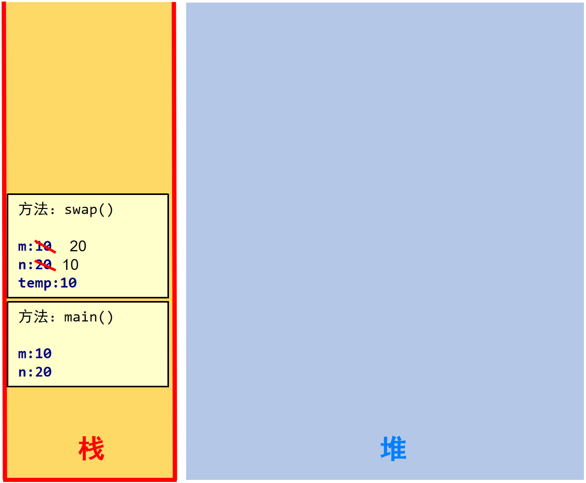

**2. 形参是引用数据类型**

**案例：**
> 题目：对一个类的两个属性的值实现换序操作。

示例代码：
```java
package com.anxin_hitsz_05.method_more._03valueTransferTest;

/**
 * ClassName: ValueTransferTest3
 * Package: com.anxin_hitsz_05.method_more._03valueTransferTest
 * Description:
 *
 * @Author AnXin
 * @Create 2026/1/17 11:03
 * @Version 1.0
 */
public class ValueTransferTest3 {
    public static void main(String[] args) {
        Data data =  new Data();
        ValueTransferTest3 test = new ValueTransferTest3();
        data.m = 10;
        data.n = 20;

        System.out.println("m = " + data.m + ", n = " + data.n);

        // 操作 1：
//        int temp = data.m;
//        data.m = data.n;
//        data.n = temp;

        // 操作 2：
        test.swap(data);
        System.out.println("m = " + data.m + ", n = " + data.n);
    }

    public void swap(Data data) {
        int temp = data.m;
        data.m = data.n;
        data.n = temp;
    }
}

class Data {
    int m;
    int n;
}

```

内存解析：
* 示例代码：
    ```java
    class Test {
        public static void main(String[] args) {
            // 创建 Test 对象 test（略）
            Data data = new Data;
            data.m = 10;
            data.n = 20;
            test.swap(data);
        }
        public void swap(Data data) {
            int temp = data.m;
            data.m = data.n;
            data.n = temp;
        }
    }
    class Data {
        int m;
        int n;
    }
    ```
* 内存解析：
    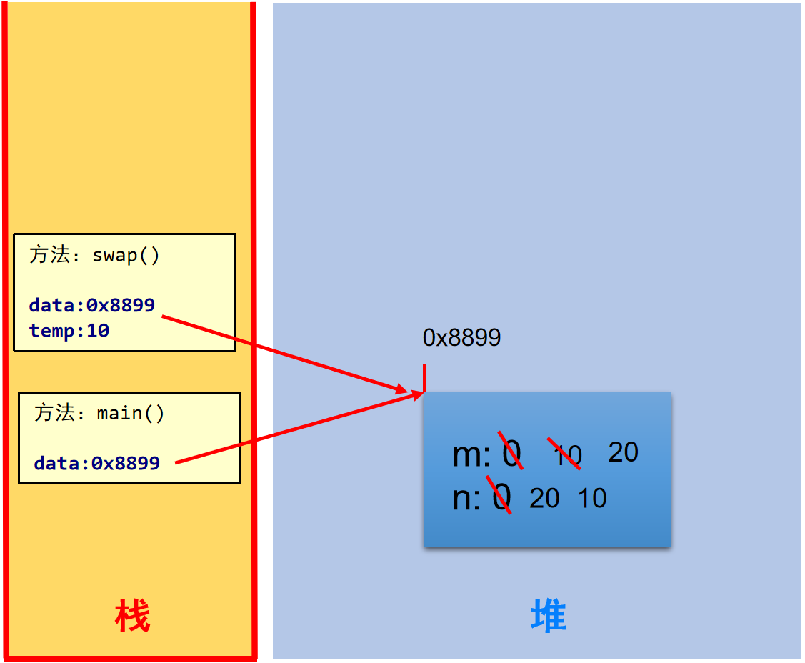

#### 7.3.4 练习

**练习 1：**
> 题目：定义一个 `Circle` 类，包含一个 `double` 型的 `radius` 属性代表圆的半径，一个 `findArea()` 方法返回圆的面积。

示例代码：
```java
package com.anxin_hitsz_05.method_more._03valueTransferTest.exer1;

/**
 * ClassName: Circle
 * Package: com.anxin_hitsz_05.method_more._03valueTransferTest.exer1
 * Description:
 *
 * @Author AnXin
 * @Create 2026/1/17 11:12
 * @Version 1.0
 */
public class Circle {
    double radius;  // 半径

    public double findArea() {
        return Math.PI * radius * radius;
    }
}

```

**练习 2：**
> 题目：
> 
> 定义一个类 `PassObject`，在类中定义一个方法 `printAreas()`，该方法的定义如下：
> ```java
> public void printAreas(Circle c, int time)
> ```
>
> 在 `printAreas` 方法中打印输出 `1` 到 `time` 之间的每个整数半径值，以及对应的面积。例如，`time` 为 `5`，则输出半径 `1`、`2`、`3`、`4`、`5` 以及对应的圆的面积。
>
> 在 `main` 方法中调用 `printAreas()` 方法，调用完毕后输出当前半径值。

示例代码：
```java
package com.anxin_hitsz_05.method_more._03valueTransferTest.exer1;

/**
 * ClassName: PassObject
 * Package: com.anxin_hitsz_05.method_more._03valueTransferTest.exer1
 * Description:
 *
 * @Author AnXin
 * @Create 2026/1/17 11:16
 * @Version 1.0
 */
public class PassObject {
    public static void main(String[] args) {
        PassObject obj = new PassObject();
        Circle c = new Circle();
        obj.printAreas(c, 5);

        System.out.println("now radius is: " + c.radius);
    }
    public void printAreas(Circle c, int time) {
        System.out.println("Radius\t\tArea");

        int i = 1;
        for (i = 1; i <= time; i++) {
            c.radius = i;
            System.out.println(c.radius + "\t\t\t" + c.findArea());
        }
        System.out.println();

        c.radius = i;
    }
}

```

**练习 3：**
> 题目：针对 atguigu04.example.exer4 中 `MyArrays` 类的如下方法进行改进：
>
> 数组排序，可以指明排序的方式（从小到大、从大到小）。

示例代码：
```java
/* MyArrays.java */

package com.anxin_hitsz_05.method_more._03valueTransferTest.exer2;

/**
 * ClassName: MyArrays
 * Package: com.anxin_hitsz_04.example.exer4
 * Description:
 *
 * @Author AnXin
 * @Create 2025/12/7 17:28
 * @Version 1.0
 */
public class MyArrays {

    /**
     * 获取 int[] 数组的最大值
     * @param arr 要获取最大值的数组
     * @return 数组的最大值
     */
    public int getMax(int[] arr) {
        int max = arr[0];
        for (int i = 1; i < arr.length; i++) {
            if (max < arr[i]) {
                max = arr[i];
            }
        }
        return max;
    }

    /**
     * 获取 int[] 数组的最小值
     * @param arr 要获取最小值的数组
     * @return 数组的最小值
     */
    public int getMin(int[] arr) {
        int min = arr[0];
        for (int i = 1; i < arr.length; i++) {
            if (min > arr[i]) {
                min = arr[i];
            }
        }
        return min;
    }

    public int getSum(int[] arr) {
        int sum = 0;
        for (int i = 0; i < arr.length; i++) {
            sum += arr[i];
        }
        return sum;
    }

    public int getAvg(int[] arr) {

        return getSum(arr) / arr.length;
    }

    public void print(int[] arr) {  // [12, 231, 34, ...]
        System.out.print("[");
        for (int i = 0; i < arr.length; i++) {
            if (i == 0) {
                System.out.print(arr[i]);
            } else {
                System.out.print(", " + arr[i]);
            }
        }

        System.out.println("]");
    }

    public int[] copy(int[] arr) {
        int[] newArr = new int[arr.length];
        for (int i = 0; i < arr.length; i++) {
            newArr[i] = arr[i];
        }
        return newArr;
    }

    public void reverse(int[] arr) {
        for (int i = 0, j = arr.length - 1 /* 尾索引 */; i < j; i++, j--) {
            // 交互 arr[i] 与 arr[j] 位置的元素
            int temp = arr[i];
            arr[i] = arr[j];
            arr[j] = temp;
        }
    }

    public void sort(int[] arr) {
        for (int j = 0; j < arr.length - 1; j++) {
            for (int i = 0; i < arr.length - 1 - j; i++) {
                if (arr[i] > arr[i + 1]) {
                    // 交互 arr[i] 和 arr[i + 1]
                    int temp = arr[i];
                    arr[i] = arr[i + 1];
                    arr[i + 1] = temp;
                }
            }
        }
    }

    /**
     * 针对于数组进行排序操作
     * @param arr 待排序的数组
     * @param sortMethod    acs: 升序     desc: 降序
     */
    public void sort(int[] arr, String sortMethod) {
        if("asc".equals(sortMethod)) {//if (sortMethod.equals("asc")) { // ascend: 升序
            for (int j = 0; j < arr.length - 1; j++) {
                for (int i = 0; i < arr.length - 1 - j; i++) {
                    if (arr[i] > arr[i + 1]) {
                        // 交互 arr[i] 和 arr[i + 1]
//                        int temp = arr[i];
//                        arr[i] = arr[i + 1];
//                        arr[i + 1] = temp;
                        // 错误的：
//                        swap(arr[i], arr[i + 1]);

                        // 正确的：
                        swap(arr, i, i + 1);
                    }
                }
            }
        } else if ("desc".equals(sortMethod)) {
            for (int j = 0; j < arr.length - 1; j++) {
                for (int i = 0; i < arr.length - 1 - j; i++) {
                    if (arr[i] < arr[i + 1]) {
                        // 交互 arr[i] 和 arr[i + 1]
//                        int temp = arr[i];
//                        arr[i] = arr[i + 1];
//                        arr[i + 1] = temp;
                        // 错误的：
//                        swap(arr[i], arr[i + 1]);

                        // 正确的：
                        swap(arr, i, i + 1);
                    }
                }
            }
        } else {
            System.out.println("你输入的排序方式有误！");
        }
    }

    public void swap(int i, int j) {
        int temp = i;
        i = j;
        j = temp;
    }

    public void swap(int[] arr, int i, int j) {
        int temp = arr[i];
        arr[i] = arr[j];
        arr[j] = temp;
    }

    /**
     * 使用线性查找的算法，查找指定的元素
     * @param arr 待查找的数组
     * @param target 要查找的元素
     * @return target 元素在 arr 数组中的索引位置。若未找到，则返回 -1
     */
    public int linearSearch(int[] arr, int target) {
        for (int i = 0; i < arr.length; i++) {
            if (target == arr[i]) {
                return i;
            }
        }

        // 只要代码执行到此位置，一定是没找到
        return -1;
    }
}


/* MyArraysTest.java */

package com.anxin_hitsz_05.method_more._03valueTransferTest.exer2;

/**
 * ClassName: MyArraysTest
 * Package: com.anxin_hitsz_04.example.exer4
 * Description:
 *
 * @Author AnXin
 * @Create 2025/12/7 17:31
 * @Version 1.0
 */
public class MyArraysTest {
    public static void main(String[] args) {

        MyArrays arrs = new MyArrays();
        int[] arr = new int[] {34, 56, 223, 2, 56, 24, 56, 67, 778, 45};

        // 求最大值
        System.out.println("最大值为：" + arrs.getMax(arr));
        // 求平均值
        System.out.println("平均值为：" + arrs.getAvg(arr));

        // 遍历
        arrs.print(arr);

        // 查找
        int index = arrs.linearSearch(arr, 24);
        if (index >= 0) {
            System.out.println("找到了，位置：" + index);
        } else {
            System.out.println("未找到");
        }

        // 排序
//        arrs.sort(arr);
        arrs.sort(arr, "asc");
        arrs.sort(arr, "desc");
        // 遍历
        arrs.print(arr);
    }
}

```

### 7.4 递归（recursion）方法

#### 7.4.1 递归方法介绍

**递归方法调用**：方法自己调用自己的现象就称为递归。

**递归的分类**：
* 直接递归：方法自身调用自己。
    ```java
    public void methodA() {
        methodA();
    }
    ```
* 间接递归：可以理解为 `A()` 方法调用 `B()` 方法，`B()` 方法调用 `C()` 方法，`C()` 方法调用 `A()` 方法。
```java
public static void A() {
    B();
}

public static void B() {
    C();
}

public static void C() {
    A();
}
```

**说明**：
* 递归方法包含了一种**隐式的循环**。
* 递归方法会**重复执行**某段代码，但这种重复执行无须循环控制。
* 递归一定要向**已知方向**递归，否则这种递归就变成了无穷递归，停不下来，类似于**死循环**，最终发生**栈内存溢出**。

示例代码：
```java
package com.anxin_hitsz_05.method_more._04recursion;

/**
 * ClassName: RecursionTest
 * Package: com.anxin_hitsz_05.method_more._04recursion
 * Description:
 *
 * @Author AnXin
 * @Create 2026/1/19 12:27
 * @Version 1.0
 */
public class RecursionTest {

    public static void main(String[] args) {
        RecursionTest test = new RecursionTest();

//        test.method1();

        System.out.println(test.getSum(100));   // 5050
        System.out.println(test.getSum1(100));  // 5050

        int n = 5;
        System.out.println(test.getMul(n)); // 120

        System.out.println(test.f(10));
    }

    /*
    * 举例 1：计算 1 - 100 内自然数的总和
    * */
    public int getSum(int num) {
        int sum = 0;
        for (int i = 1; i <= num; i++) {
            sum += i;
        }
        return sum;
    }

    public int getSum1(int num) {
        if (num == 1) {
            return 1;
        } else {
            return getSum1(num - 1) + num;
        }
    }

    /*
    * 举例 2：计算 n!
    * */
    public int getMul(int n) {
        if (n == 1) {
            return 1;
        } else {
            return n * getMul(n - 1);
        }
    }

    /*
    * 举例 3：快速排序
    * */

    /*
    * 举例 4：汉诺塔游戏
    * */

    /*
    * 举例 5：斐波那契数列
    *   数列如下：1 1 2 3 5 8 13 21 34 55 ...
    *
    *   f(n) = f(n - 1) + f(n - 2)
    * */
    public int f(int n) {
        if (n == 1) {
            return 1;
        } else if (n == 2) {
            return 1;
        } else {
            return f(n - 1) + f(n - 2);
        }
    }

    /*
    * 举例 6：
    *   File 类的对象表示一个文件目录
    *   计算指定的文件目录的大小，遍历指定多个文件目录中的所有的文件，删除指定的文件目录
    * */


    /*
    * 如下递归方法的调用，会导致 StackOverflowError
    * */
//    public void method1() {
//        System.out.println("method1() ...");
//        method1();
//    }
}

```

代码执行图解 1：
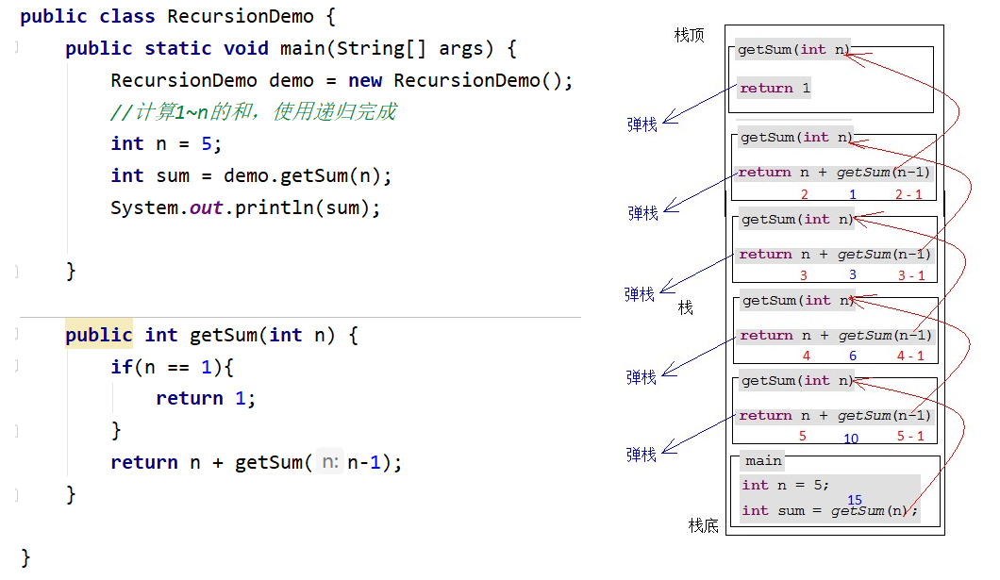
代码执行图解 2：
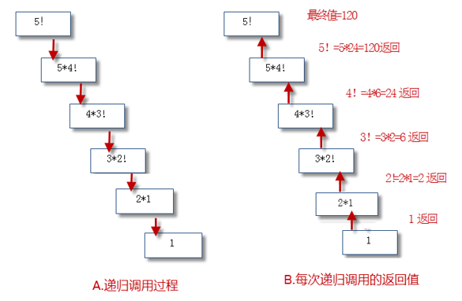

> 注意：
> 1. 递归调用会占用大量的系统堆栈，内存耗用多，在递归调用层次多时速度要比循环**慢得多**，所以在使用递归时要慎重。
> 2. 在要求高性能的情况下尽量避免使用递归，递归调用既花时间又**耗内存**；考虑使用循环迭代。

#### 7.4.2 练习

**练习 1：**
> 题目：
>
> 已知一个数列：f(20) = 1，f(21) = 4，f(n + 2) = 2 * f(n + 1) + f(n)；其中 n 是大于 0 的整数。
>
> 求 f(10) 的值。

示例代码：
```java
package com.anxin_hitsz_05.method_more._04recursion.exer1;

/**
 * ClassName: RecursionExer01
 * Package: com.anxin_hitsz_05.method_more._04recursion.exer1
 * Description:
 *
 * @Author AnXin
 * @Create 2026/1/19 12:51
 * @Version 1.0
 */
public class RecursionExer01 {
    public static void main(String[] args) {
        RecursionExer01 test = new RecursionExer01();

        System.out.println(test.f(10)); // -3771
        System.out.println(test.func(10));  // 243
    }

    public int f(int n) {
        if (n == 20) {
            return 1;
        } else if (n == 21) {
            return 4;
        } else {
            // 正确的
            return f(n + 2) - 2 * f(n + 1);

            // 错误的：
//            return 2 * f(n - 1) + f(n - 2);
        }
    }

    public int func(int n) {
        if (n == 0) {
            return 1;
        } else if (n == 1) {
            return 4;
        } else {
            // 错误的：
//            return func(n + 2) - 2 * func(n + 1);

            // 正确的：
            return 2 * func(n - 2) + func(n - 2);
        }
    }
}

```

**练习 2：**
> 题目：
> 
> 已知有一个数列：f(0) = 1，f(1) = 4，f(n + 2) = 2 * f(n + 1) + f(n)；其中 n 是大于 0 的整数。
>
> 求 f(10) 的值。

示例代码：
```java
package com.anxin_hitsz_05.method_more._04recursion.exer1;

/**
 * ClassName: RecursionExer01
 * Package: com.anxin_hitsz_05.method_more._04recursion.exer1
 * Description:
 *
 * @Author AnXin
 * @Create 2026/1/19 12:51
 * @Version 1.0
 */
public class RecursionExer01 {
    public static void main(String[] args) {
        RecursionExer01 test = new RecursionExer01();

        System.out.println(test.f(10)); // -3771
        System.out.println(test.func(10));  // 243
    }

    public int f(int n) {
        if (n == 20) {
            return 1;
        } else if (n == 21) {
            return 4;
        } else {
            // 正确的
            return f(n + 2) - 2 * f(n + 1);

            // 错误的：
//            return 2 * f(n - 1) + f(n - 2);
        }
    }

    public int func(int n) {
        if (n == 0) {
            return 1;
        } else if (n == 1) {
            return 4;
        } else {
            // 错误的：
//            return func(n + 2) - 2 * func(n + 1);

            // 正确的：
            return 2 * func(n - 2) + func(n - 2);
        }
    }
}

```

练习 3 - 不死神兔：
> 题目：
>
> 用递归实现不死神兔。
> 故事得从西元 1202 年说起，话说有一位意大利青年，名叫斐波那契（Fibonacci）。斐波那契在他的一部著作中提出了一个有趣的问题：假设一对刚出生的小兔一个月后就能长成大兔，再过一个月就能生下一对小兔，并且此后每个月都生一对小兔，没有发生死亡，问现有一对刚出生的兔子 2 年（24 个月）后会有多少对兔子？
>
> 示例过程如下：
>   月份          1   2   3   4   5   ...
>   兔子对数      1   1   2   3   5   ...

示例代码：
```java
package com.anxin_hitsz_05.method_more._04recursion.exer2;

/**
 * ClassName: RabbitExer
 * Package: com.anxin_hitsz_05.method_more._04recursion.exer2
 * Description:
 *
 * @Author AnXin
 * @Create 2026/1/19 12:59
 * @Version 1.0
 */
public class RabbitExer {
    public static void main(String[] args) {
        RabbitExer exer = new RabbitExer();
        int month = 24;
        System.out.println("兔子的对数为：" + exer.getRabbitNumber(month));    // 46368
    }

    public int getRabbitNumber(int month) {
        if (month == 1) {
            return 1;
        } else if (month == 2) {
            return 1;
        } else {
            return getRabbitNumber(month - 1) + getRabbitNumber(month - 2);
        }
    }
}

```

拓展 - 走台阶问题：
> 题目：
> 
> 假如有 10 阶楼梯，小朋友每次只能向上走 1 阶或者 2 阶，请问一共有多少种不同的走法呢？
>
> 示例过程如下：
>   阶数    1   2   3   4   ...
>   走法    1   2   3   5   ...
>
> 因此，从 n 为 3 开始：f(n) = f(n - 1) + f(n - 2)。

> 【奇妙的属性】随着数列的增加，斐波那契数列前一个数与后一个数的比值越来越逼近黄金分割的数值 0.618。

## 八、关键字：`package`、`import`

### 8.1 `package`（包）

`package`，称为包，用于指明该文件中定义的类、接口等结构所在的包。

#### 8.1.1 语法格式

```java
package 顶层包名.子包名;
```

举例 - pack1\pack2\PackageTest.java：
```java
package pack1.pack2;    // 指定类 PackageTest 属于包 pack1.pack2

public class PackageTest {
    public void display() {
        System.out.println("in method display()");
    }
}

```

说明：
* 一个源文件只能有一个声明包的 `package` 语句。
* `package` 语句作为 Java 源文件的第一条语句出现；若缺省该语句，则指定为无名包。
* 包名，属于标识符，满足标识符命名的规则和规范（全部小写）、见名知意。
  * 包通常使用所在公司域名的倒置：`com.atguigu.xxx`。
  * 大家取包名时不要使用 “`java.xx`” 包。
* 包对应于文件系统的目录，package 语句中用 “`.`” 来指明包（目录）的层次，每 `.` 一次就表示一层文件目录。
* 同一个包下可以声明多个结构（类、接口），但是不能定义同名的结构（类、接口）；不同的包下可以定义同名的结构（类、接口）。

#### 8.1.2 包的作用

包的作用如下：
* 包可以包含类和子包，划分**项目层次**，便于管理。
* 帮助**管理大型软件**系统：将功能相近的类划分到同一个包中。比如：MVC 的设计模式。
* 解决**类命名冲突**的问题。
* 控制**访问权限**。

#### 8.1.3 应用举例

**举例 1：**
> 某航运软件系统包括：一组域对象、GUI 和 reports 子系统。

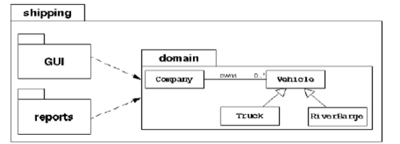

**举例 2：** MVC 设计模式。

MVC 是一种软件构件模式，目的是为了降低程序开发中代码业务的耦合度。

MVC 设计模式将整个程序分为三个层次：**视图模型（Viewer）层**、**控制器（Controller）层**与**数据模型（Model）层**。这种将程序输入输出、数据处理以及数据的展示分离开来的设计模式使程序结构变得灵活而且清晰，同时也描述了程序各个对象间的通信方式，降低了程序的耦合性。

> 视图层 viewer：显示数据，为用户提供使用界面，与用户直接进行交互。
> * 相关工具类：`view.utils`。
> * 自定义 view：`view.ui`。
>
> 控制层 controller：解析用户请求，处理业务逻辑，给予用户相应。
> * 应用界面相关：`controller.activity`。
> * 存放 fragment：`controller.fragment`。
> * 显示列表的适配器：`controller.adapter`。
> * 服务相关的：`controller.service`。
> * 抽取的基类：`controller.base`。
>
> 模型层 model：主要承载数据、处理数据。
> * 数据对象封装：`model.bean/domain`。
> * 数据库操作类：`model.dao`。
> * 数据库：`model.db`。

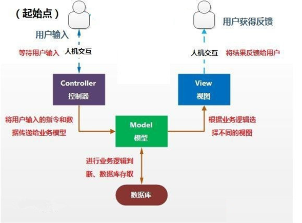

#### 8.1.4 JDK 中主要的包介绍

`java.lang`：包含一些 Java 语言的核心类，如 `String`、`Math`、`Integer`、`System` 和 `Thread`，提供常用功能。

`java.net`：包含执行与网络相关的操作的类和接口。

`java.io`：包含能提供多种输入 / 输出功能的类。

`java.util`：包含一些实用工具类，如定义系统特性、接口的集合框架类、使用与日期日历相关的函数。

`java.text`：包含了一些 Java 格式化相关的类。

`java.sql`：包含了 Java 进行 JDBC 数据库编程的相关类 / 接口。

`java.awt`：包含了构成抽象窗口工具集（abstract window toolkits）的多个类，这些类被用来构建和管理应用程序的图形用户界面（GUI）。

### 8.2 `import`（导入）

为了使用定义在其它包中的 Java 类，需用 `import` 语句来显式引入指定包下所需要的类。相当于 **`import` 语句告诉编译器到哪里去寻找这个类**。

#### 8.2.1 语法格式

```java
import 包名.类名;
```

#### 8.2.2 应用举例

```java
import pack1.pack2.Test;    // import pack1.pack2.*; 表示引入 pack1.pack2 包中的所有结构

public class PackTest {
    public static void main(String[] args) {
        Test t = new Test();    // Test 类在 pack1.pack2 包中定义
        t.display();
    }
}

```

#### 8.2.3 注意事项

`import` 语句，声明在包的声明和类的声明之间。

如果需要导入多个类或接口，那么就并列显示多个 `import` 语句即可。

如果使用 `a.*` 导入结构，表示可以导入 `a` 包下的所有的结构。举例：可以使用 `java.util.*` 的方式，一次性导入 `util` 包下所有的类或接口。

如果导入的类或接口是 `java.lang` 包下的，或者是当前包下的，则可以省略此 `import` 语句。

如果已经导入 `java.a` 包下的类，那么如果需要使用 `a` 包的子包下的类的话，仍然需要导入。

如果在代码总使用不同包下的同名的类，那么就需要使用类的全类名的方式指明调用的是哪个类，且使用类的全类名的方式指明调用类时不需要通过 `import` 导入。

（了解）`import static` 组合的使用：调用指定类或接口下的静态的属性或方法。

### 8.3 举例

示例代码：
```java
/* Person.java */

package com.anxin_hitsz_06.package_import;

/**
 * ClassName: Person
 * Package: com.anxin_hitsz_06.package_import
 * Description:
 *
 * @Author AnXin
 * @Create 2026/1/19 14:32
 * @Version 1.0
 */
public class Person {
}


/* PackageImportTest.java */

package com.anxin_hitsz_06.package_import;

//import java.util.ArrayList;
//import java.util.HashMap;
//import java.util.Scanner;

import com.anxin_hitsz_05.method_more._04recursion.RecursionTest;
import com.anxin_hitsz_05.method_more._04recursion.exer2.RabbitExer;

import java.lang.reflect.Field;
import java.util.*;

import static java.lang.System.out;
import static java.lang.Math.PI;

/**
 * ClassName: PackageImportTest
 * Package: com.anxin_hitsz_06.package_import
 * Description:
 *
 * @Author AnXin
 * @Create 2026/1/19 14:06
 * @Version 1.0
 */
public class PackageImportTest {
    public static void main(String[] args) {

        Scanner sc = new Scanner(System.in);

        ArrayList list = new ArrayList();

        HashMap map = new HashMap();

        HashSet set = new HashSet();

        String str = "hello";
        System.out.println("str");

        Person p =  new Person();

        Field field = null;

        RecursionTest test = null;

        RabbitExer exer = null;

        // Date 可以使用 import 的方式指明
        Date date = new Date();

        // 使用全类名的方式
        java.sql.Date date1 = new java.sql.Date(121231231L);

        out.println("hello");

        out.println(PI);

    }
}

```

## 九、面向对象特征一：封装性（encapsulation）

### 9.1 为什么需要封装？

> 客观世界里每一个事物的内部信息都隐藏在其内部，外界无法直接操作和修改，只能通过指定的方式进行访问和修改。

随着我们系统越来越复杂，类会越来越多，那么类之间的访问边界必须把握好，面向对象的开发原则要遵循“**高内聚、低耦合**”。

> 高内聚、低耦合是软件工程中的概念，也是 UNIX 操作系统设计的经典原则。
>
> 内聚，指一个模块内各个元素彼此结合的紧密程度；耦合指一个软件结构内不同模块之间互连程度的度量。内聚意味着重用和独立，耦合意味着多米诺效应——牵一发动全身。

而“高内聚、低耦合”的体现之一：
* **高内聚**：类的内部数据操作细节自己完成，不允许外部干涉；
* **低耦合**：仅暴露少量的方法给外部使用，尽量方便外部调用。

### 9.2 何为封装性？

所谓**封装**，就是把客观事物封装成抽象概念的类，并且类可以把自己的数据和方法只向可信的类或者对象开放，向没必要开放的类或者对象隐藏信息。

**通俗的讲，把该隐藏的隐藏起来，该暴露的暴露出来。这就是封装性的设计思想。**

### 9.3 Java 如何实现数据封装？

实现封装就是控制类或成员的可见性范围。这就需要依赖访问控制修饰符，也成为权限修饰符来控制。

我们可以使用 4 种权限修饰符来修饰类及类的内部成员。当这些成员被调用时，体现可见性的大小。

权限修饰符包括 `public`、`protected`、`缺省`、`private`。具体访问范围如下，访问范围从上至下依次增大：
| 修饰符 | 本类内部 | 本包内 | 其他包的子类 | 其他包非子类 |
| :--: | :--: | :--: | :--: | :--: |
| `private` | √ | × | × | × |
| `缺省` | √ | √ | × | × |
| `protected` | √ | √ | √ | × |
| `public` | √ | √ | √ | √ |

具体修饰的结构：
* 外部类：`public`、`缺省`。
* 成员变量、成员方法、构造器、成员内部类：`public`、`protected`、`缺省`、`private`。


开发中 4 种权限使用频率的情况：
* 比较高：`public`、`private`。
* 比较低：`缺省`、`protected`。

案例：
> 在题目中，我们给 `Animal` 的对象的 `legs` 属性赋值。在实际的常识中，我们知道 `legs` 不能赋值为负数；但是如果直接调用属性 `legs`，是不能加入判断逻辑的。那怎么办呢？
> * 将 `legs` 属性私有化（`private`），禁止在 `Animal` 类的外部直接调用此属性。
> * 提供给 `legs` 属性赋值的 `setLegs()` 方法，在此方法中加入 `legs` 赋值的判断逻辑 `if(legs >= 0 && legs % 2 == 0)`。将此方法暴露出去，使得在 `Animal` 类的外部调用此方法，对 `legs` 属性赋值。
> * 提供给 `legs` 属性获取的 `getLegs()` 方法，此方法对外暴露，使得在 `Animal` 类的外部还可以调用此属性的值。

示例代码：
```java
package com.anxin_hitsz_07.encapsulation;

/**
 * ClassName: AnimalTest
 * Package: com.anxin_hitsz_07.encapsulation
 * Description:
 *
 * @Author AnXin
 * @Create 2026/1/19 15:41
 * @Version 1.0
 */
public class AnimalTest {
    public static void main(String[] args) {
        Animal animal1 = new Animal();

        animal1.name = "金蟾";
        // 因为 legs 声明为 private ，是私有的，出了 Animal 类之外就不能调用了
//        animal1.legs = 4;
//        animal1.legs = -4;

        // 只能通过 setLegs()，间接地对 legs 属性进行赋值
        animal1.setLegs(2);
        animal1.setLegs(-2);

//        System.out.println("name = " + animal1.name + "，legs = " + animal1.legs);

        System.out.println("name = " + animal1.name + "，legs = " + animal1.getLegs());

        animal1.eat();

    }


}

class Animal {  // 动物
    // 属性
    String name;    // 名字
    private int legs;   // 腿的个数

    // 方法
    // 设置 legs 的属性值
    public void setLegs(int l) {
        if (l >= 0 && l % 2 == 0) {
            legs = l;
        } else {
            System.out.println("你输入的数据非法");
        }
    }

    // 获取 legs 的属性值
    public int getLegs() {
        return legs;
    }

    public void eat() {
        System.out.println("动物觅食");
    }
}

```

### 9.4 封装性的体现

场景体现：
1. 场景 1：私有化（`private`）类的属性，提供公共（`public`）的 `get` 和 `set` 方法，对此属性进行获取或修改。
2. 场景 2：将类中不需要对外暴露的方法，设置为 `private`。
3. 场景 3：单例模式中构造器被声明为 `private`，避免在类的外部创建实例。（放到 `static` 关键字后讲。）

#### 9.4.1 成员变量 / 属性私有化

**概述：私有化（`private`）类的成员变量，提供公共（`public`）的 `get` 和 `set` 方法，对外暴露获取和修改属性的功能。**

**实现步骤：**
**1. 使用 private 修饰成员变量：**

```java
private 数据类型 变量名;
```

代码如下：
```java
public class Person {
    private String name;
    private int age;
    private boolean marry;
}
```

**2. 提供 `getXxx` 方法 / `setXxx` 方法，可以访问成员变量：**

代码如下：
```java
public class Person {
    private String name;
    private int age;
    private boolean marry;

    public void setName(String n) {
        name = n;
    }

    public String getName() {
        return name;
    }

    public void setAge(int a) {
        age = a;
    }

    public int getAge() {
        return age;
    }

    public void setMarry(boolean m) {
        marry = m;
    }

    public boolean isMarry() {
        return marry;
    }
}

```

**3. 测试：**

代码如下：
```java
public class PersonTest {
    public static void main(String[] args) {
        Person p = new Person();

        // 实例变量私有化，跨类是无法直接使用的
        /* 
        p.name = "张三";
        p.age = 23;
        p.marry = true;
        */

       p.setName("张三");
       System.out.println("p.name = " + p.getName());

       p.setAge(23);
       System.out.println("p.age = " + p.getAge());

       p.setMarry(true);
       System.out.println("p.marry = " + p.isMarry());
    }
}

```

成员变量封装的好处：
* 让使用者只能通过事前预定的方法来**访问数据**，从而可以在该方法里面加入控制逻辑，限制对成员变量的不合理访问；还可以进行数据检查，从而有利于保证对象信息的完整性。
* **便于修改**，提高代码的可维护性。主要是指隐藏的部分若在内部进行修改，如果其对外可以访问的方式不变的话，外部根本感觉不到它的修改。例如：Java 8 -> Java 9，`String` 从 `char[]` 转为 `byte[]` 内部实现，而对外的方法不变，我们使用者根本感觉不到它内部的修改。

#### 9.4.2 私有化方法

示例代码：
```java

```

> 注意：
>
> 开发中，一般成员实例变量都习惯使用 `private` 修饰，再提供相应的 `public` 权限的 `get` / `set` 方法访问。
>
> 对于 `final` 的实例变量，不提供 `set()` 方法。（后面 `final` 关键字的时候会讲到。）
>
> 对于 `static final` 的成员变量，习惯上使用 `public` 修饰。

### 9.5 练习

练习 1：
> 题目：
> 
> 创建程序，在其中定义两个类，分别为 `Person` 类和 `PersonTest` 类。
> 
> 要求如下：
> 1. 用 `setAge()` 设置人的合法年龄（0 ~ 130），用 `getAge()` 返回人的年龄。
> 2. 在 `PersonTest` 类中实例化 `Person` 类的对象 `b`，调用 `setAge()` 和 `getAge()` 方法，体会 `Java` 的封装性。

示例代码：
```java
/* Person.java */

package com.anxin_hitsz_07.encapsulation.exer1;

/**
 * ClassName: Person
 * Package: com.anxin_hitsz_07.encapsulation.exer1
 * Description:
 *
 * @Author AnXin
 * @Create 2026/1/20 13:06
 * @Version 1.0
 */
public class Person {

    private int age;

    // 设置 age 属性
    public void setAge(int a) {
        if (a >= 0 && a <= 130) {
            age = a;
        } else {
            System.out.println("你输入的数据非法");
        }
    }

    // 获取 age 属性
    public int getAge() {
        return age;
    }

    // 错误的
//    public int doAge(int a) {
//        if (a >= 0 && a <= 130) {
//            age = a;
//            return age;
//        } else {
//            System.out.println("你输入的数据非法");
//            return -1;
//        }
//    }

}


/* PersonTest.java */

package com.anxin_hitsz_07.encapsulation.exer1;

/**
 * ClassName: PersonTest
 * Package: com.anxin_hitsz_07.encapsulation.exer1
 * Description:
 *
 * @Author AnXin
 * @Create 2026/1/20 13:07
 * @Version 1.0
 */
public class PersonTest {
    public static void main(String[] args) {
        // 创建 Person 实例 1
        Person p1 =  new Person();
//        p1.age = 10;  // 编译不通过
//        System.out.println(p1.age());

        p1.setAge(10);
        System.out.println(p1.getAge());

    }
}

```

练习 2 - 自定义图书类：
> 题目：
>
> 设定属性包括：
> * 书名 `bookName`；
> * 作者 `author`；
> * 价格 `price`。
>
> 方法包括：
> * 相应属性的 `get` / `set` 方法；
> * 图书信息介绍等。

示例代码：
```java
/* Book.java */

package com.anxin_hitsz_07.encapsulation.exer2;

/**
 * ClassName: Book
 * Package: com.anxin_hitsz_07.encapsulation.exer2
 * Description:
 *
 * @Author AnXin
 * @Create 2026/1/20 13:12
 * @Version 1.0
 */
public class Book {
    private String bookName;    // 书名
    private String author;  // 作者
    private double price;   // 价格

    public String getBookName() {
        return bookName;
    }

    public void setBookName(String bn) {
        bookName = bn;
    }

    public String getAuthor() {
        return author;
    }

    public void setAuthor(String a) {
        author = a;
    }
    public double getPrice() {
        return price;
    }

    public void setPrice(double p) {
        price = p;
    }

    // 获取图书信息
    public String showInfo() {
        return "bookName: " + bookName + ", author: " + author + ", price: " + price;
    }
}


/* BookTest.java */

package com.anxin_hitsz_07.encapsulation.exer2;

/**
 * ClassName: BookTest
 * Package: com.anxin_hitsz_07.encapsulation.exer2
 * Description:
 *
 * @Author AnXin
 * @Create 2026/1/20 13:15
 * @Version 1.0
 */
public class BookTest {
    public static void main(String[] args) {

        Book book1 = new Book();

        book1.setBookName("剑指 Java");
        book1.setAuthor("尚硅谷教育");
        book1.setPrice(180.0);

        System.out.println(book1.showInfo());

    }
}

```

练习 3 - 普通员工类：
> 题目：
>
> 1. 声明员工类 `Employee`：
>   * 包括属性：姓名、性别、年龄、电话，属性私有化；
>   * 提供 `get` / `set` 方法；
>   * 提供 `String getInfo()` 方法。
> 2. 在测试类的 `main` 中创建员工数组，并从键盘输入员工对象信息，最后遍历输出。

示例代码：
```java
/* Employee.java */

package com.anxin_hitsz_07.encapsulation.exer3;

/**
 * ClassName: Employee
 * Package: com.anxin_hitsz_07.encapsulation.exer3
 * Description:
 *
 * @Author AnXin
 * @Create 2026/1/20 13:19
 * @Version 1.0
 */
public class Employee {
    // 属性
    private String name;
    private char gender;
    private int age;
    private String phoneNumber;

    // 提供属性的 get 和 set 方法
    public void setName(String n) {
        name = n;
    }
    public String getName() {
        return name;
    }

    public void setGender(char g) {
        gender = g;
    }
    public char getGender() {
        return gender;
    }

    public void setAge(int a) {
        age = a;
    }
    public int getAge() {
        return age;
    }

    public void setPhoneNumber(String p) {
        phoneNumber = p;
    }
    public String getPhoneNumber() {
        return phoneNumber;
    }

    public String getinfo() {
//        return name + "\t" + gender + "\t" + age + "\t" + phoneNumber;
        return getName() + "\t" + getGender() + "\t" + getAge() + "\t" + getPhoneNumber();
    }

}


/* EmployeeTest.java */

package com.anxin_hitsz_07.encapsulation.exer3;

import java.util.Scanner;

/**
 * ClassName: EmployeeTest
 * Package: com.anxin_hitsz_07.encapsulation.exer3
 * Description:
 *
 * @Author AnXin
 * @Create 2026/1/20 14:36
 * @Version 1.0
 */
public class EmployeeTest {
    public static void main(String[] args) {
        Scanner scan = new Scanner(System.in);
        // 创建 Employee[]
        Employee[] emps = new Employee[2];

        for (int i = 0; i < emps.length; i++) {
            emps[i] = new Employee();
            System.out.println("---------- 添加第 " + (i + 1) + " 个员工 ----------");
            System.out.print("姓名：");
            String name = scan.next();
            System.out.print("性别：");
            char gender = scan.next().charAt(0);
            System.out.print("年龄：");
            int age = scan.nextInt();
            System.out.print("电话：");
            String phoneNumber = scan.next();

            // 给指定的 employee 对象的各属性赋值
            emps[i].setName(name);
            emps[i].setGender(gender);
            emps[i].setAge(age);
            emps[i].setPhoneNumber(phoneNumber);
        }

        // 遍历员工列表
        System.out.println("---------- 员工列表 ----------");
        System.out.println("编号\t姓名\t性别\t年龄\t电话");
        for (int i = 0; i < emps.length; i++) {
            System.out.println((i + 1) + "\t" + emps[i].getinfo());
        }
        System.out.println("---------- 员工列表完成 ----------");
    }
}

```

练习 4：
> 题目：
>
> 使用 com.atguigu07.encapsulation.exer4.test1 和 com.atguigu07.encapsulation.exer4.test2 两个包来测试几种常见的权限修饰符。

示例代码：
```java
/* com.anxin_hitsz_07.encapsulation.exer4.test1.Order.java */

package com.anxin_hitsz_07.encapsulation.exer4.test1;

/**
 * ClassName: Order
 * Package: com.anxin_hitsz_07.encapsulation.exer4.test1
 * Description:
 *
 * @Author AnXin
 * @Create 2026/1/20 14:44
 * @Version 1.0
 */
public class Order {
    // 声明不同权限的属性
    private int orderPrivate;
    int orderDefault;
    public int orderPublic;

    // 声明不同权限的方法
    private void methodPrivate() {

    }
    void methodDefault() {

    }
    public void methodPublic() {

    }

    public void test() {
        orderPrivate = 1;
        orderDefault = 2;
        orderPublic = 3;

        methodPrivate();
        methodDefault();
        methodPublic();
    }

}


/* com.anxin_hitsz_07.encapsulation.exer4.test1.OrderTest.java */

package com.anxin_hitsz_07.encapsulation.exer4.test1;

/**
 * ClassName: OrderTest
 * Package: com.anxin_hitsz_07.encapsulation.exer4.test1
 * Description:
 *
 * @Author AnXin
 * @Create 2026/1/20 14:47
 * @Version 1.0
 */
public class OrderTest {
    public static void main(String[] args) {

        Order order = new Order();

        // 调用属性
        order.orderDefault = 1;
        order.orderPublic = 2;
        // 调用方法
        order.methodDefault();
        order.methodPublic();


        // 不能调用
//        order.orderPrivate = 3;
//        order.methodPrivate();

    }
}


/* com.anxin_hitsz_07.encapsulation.exer4.test2.OrderTest.java */

package com.anxin_hitsz_07.encapsulation.exer4.test2;

import com.anxin_hitsz_07.encapsulation.exer4.test1.Order;

/**
 * ClassName: OrderTest
 * Package: com.anxin_hitsz_07.encapsulation.exer4.test2
 * Description:
 *
 * @Author AnXin
 * @Create 2026/1/20 14:50
 * @Version 1.0
 */
public class OrderTest {
    public static void main(String[] args) {
        Order order = new Order();

        // 调用属性
        order.orderPublic = 1;

        // 调用方法
        order.methodPublic();


        // 不能调用
//        order.oderPrivate = 1;
//        order.orderDefault = 2;

//        order.methodPrivate();
//        order.orderDefault();

    }
}

```

## 十、类的成员之三：构造器（Constructor）

> constructor：（n.）建设者、建造者。
> construct：（v.）建设、建造、创造。
> construction：（n.）建设、建造，如 中国建设银行（CCB）。

我们 `new` 完对象时，所有成员变量都是默认值，如果我们需要赋别的值，需要挨个为它们再赋值，太麻烦了。我们能不能在 `new` 对象时，直接为当前对象的某个或所有成员变量直接赋值呢？

可以，Java 给我们提供了**构造器（Constructor）**，也称为**构造方法**。

> 注意：凡是类（包括抽象类）都有构造器。

### 10.1 构造器的作用

构造器的作用如下：
1. 搭配 `new` 关键字，创建类的对象。
2. 在创建对象的同时，可以给对象的相关属性赋值。

因此，构造器的作用可总结为：`new` 对象，并在 `new` 对象的时候为实例变量赋值。

举例：
```java
Person p = new Person("Peter", 15);
```

解释：如同我们规定每个“人”一出生就必须先洗澡，我们就可以在“人”的构造器中加入完成“洗澡”的程序代码，于是每个“人”一出生就会自动完成“洗澡”，程序就不必在每个人刚出生时一个一个地告诉他们要“洗澡”了。

### 10.2 构造器的语法格式

构造器的语法格式如下：
```java
[修饰符] class 类名 {
    // 无参构造
    [修饰符] 构造器名（即类名）() {
        // 实例初始化代码
    }

    // 有参构造
    [修饰符] 构造器名（即类名）(形参列表) {
        // 实例初始化代码
    }
}
```

说明：
1. 构造器名必须与它所在的类名相同。
2. 构造器没有返回值，所以不需要返回值类型，也不需要 `void`。
3. 构造器的修饰符只能是权限修饰符，不能被其他任何修饰符修饰。比如，不能被 `static`、`final`、`synchronized`、`abstract`、`native` 修饰，不能有 `return` 语句返回值。

示例代码：
```java
/* Person.java */

package com.anxin_hitsz_08.constructor;

/**
 * ClassName: Person
 * Package: com.anxin_hitsz_08.constructor
 * Description:
 *
 * @Author AnXin
 * @Create 2026/1/20 15:53
 * @Version 1.0
 */
public class Person {
    // 属性
    String name;
    int age;

    // 构造器
    public Person() {
        System.out.println("Person() ...");
    }

    // 声明其它的构造器
    public Person(int a) {
        age = a;
    }
    public Person(String n) {
        name = n;
    }
    public Person(String n, int a) {
        name = n;
        age = a;
    }


    // 方法
    public void eat() {
        System.out.println("人吃饭");
    }

    public void sleep(int hour) {
        System.out.println("每天睡眠 " + hour + " 小时");
    }

}


/* PersonTest.java */

package com.anxin_hitsz_08.constructor;

import java.util.Scanner;

/**
 * ClassName: PersonTest
 * Package: com.anxin_hitsz_08.constructor
 * Description:
 *
 * @Author AnXin
 * @Create 2026/1/20 15:54
 * @Version 1.0
 */
public class PersonTest {
    public static void main(String[] args) {

        Person p1 = new Person();

        p1.eat();

        Person p2 = new Person(1);
        System.out.println(p2.age); // 1

        Scanner scan = new Scanner(System.in);

    }
}

```

### 10.3 使用说明

当我们没有显式地声明类中的构造器时，系统会默认提供一个无参（空参）的构造器并且该构造器的修饰符默认与类的修饰符相同。
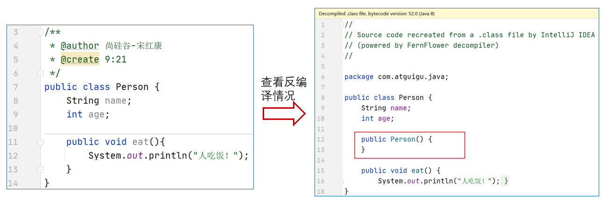

当我们显式地定义类地构造器以后，系统就不再提供默认的无参地构造器了。

在类中，至少会存在一个构造器。

构造器是可以重载的。

> 注意：**构造器可以重载，但不可以重写！**

> 注意：在测试类中，将光标放置在待创建实例的类的构造器的小括号内，通过组合键 `Ctrl + p` 即可调出全部构造器及其参数说明。

关于**匿名对象**：
1. 匿名对象往往只能被调用一次。
2. 匿名对象常常作为实参传递给方法的形参。

例如：
```java
// 创建 Customer 实例
Customer customer = new Customer("Jane", "Smith");

// Account account = new Account(1000, 2000, 0.0123);
// customer.setAccount(account);
// 或 使用匿名对象
customer.setAccount(new Account(1000, 2000, 0.0123));
```

### 10.4 练习

**练习 1：**
> 题目：
>
> 1. 定义 `Student` 类，有 4 个属性：
>   * `String name`；
>   * `int age`；
>   * `String school`；
>   * `String major`。
> 2. 定义 `Student` 类的 3 个构造器：
> * 第一个构造器 `Student(String n, int a)` 设置类的 `name` 和 `age` 属性；
> * 第二个构造器 `Student(String n, int a, String s)` 设置类的 `name`、`age` 和 `school` 属性。
> * 第三个构造器 `Student(String n, int a, String s, String m)` 设置类的 `name`、`age`、`school` 和 `major` 属性。
> 3. 在 `main` 方法中分别调用不同的构造器创建的对象，并输出其属性值。

示例代码：
```java
/* Student.java */

package com.anxin_hitsz_08.constructor.exer1;

/**
 * ClassName: Student
 * Package: com.anxin_hitsz_08.constructor.exer1
 * Description:
 *
 * @Author AnXin
 * @Create 2026/1/20 16:15
 * @Version 1.0
 */
public class Student {

    String name;
    int age;
    String school;
    String major;   // 专业


    public Student(String n, int a) {
        name = n;
        age = a;
    }

    public Student(String n, int a, String s) {
        name = n;
        age = a;
        school = s;
    }

    Student(String n, int a, String s, String m) {
        name = n;
        age = a;
        school = s;
        major = m;
    }

    public String getInfo() {
        return "name = " + name + ", age = " + age +
                ", school = " + school + ", major = " + major;
    }
}


/* StudentTest.java */

package com.anxin_hitsz_08.constructor.exer1;

/**
 * ClassName: StudentTest
 * Package: com.anxin_hitsz_08.constructor.exer1
 * Description:
 *
 * @Author AnXin
 * @Create 2026/1/20 16:18
 * @Version 1.0
 */
public class StudentTest {
    public static void main(String[] args) {

        Student s1 = new Student("An", 21, "哈尔滨工业大学", "计算机技术");
        System.out.println(s1.getInfo());

        Student s2 = new Student("Xin", 21, "哈尔滨工业大学");
        System.out.println(s2.getInfo());

    }
}

```

**练习 2：**
> 题目：
>
> 编写两个类 `TriAngle` 和 `TriAngleTest`。
> 
> 其中 `TriAngle` 类中声明私有的底边长 `base` 和高 `height`，同时声明公共方法访问私有变量；此外，提供类必要的构造器。
>
> 另一个类中使用这些公共方法，计算三角形的面积。

示例代码：
```java
/* TriAngle.java */

package com.anxin_hitsz_08.constructor.exer2;

/**
 * ClassName: TriAngle
 * Package: com.anxin_hitsz_08.constructor.exer2
 * Description:
 *
 * @Author AnXin
 * @Create 2026/1/20 16:22
 * @Version 1.0
 */
public class TriAngle {
    // 属性
    private double base;    // 底边长
    private double height;  // 高

    public double getBase() {
        return base;
    }
    public void setBase(double b) {
        base = b;
    }

    public double getHeight() {
        return height;
    }
    public void setHeight(double h) {
        height = h;
    }

    public TriAngle() {

    }
    public TriAngle(double b, double h) {
        base = b;
        height = h;
    }
    // ...

    // 求面积的方法
    public double findArea() {
        return base * height / 2;
    }

}


/* TriAngleTest.java */

package com.anxin_hitsz_08.constructor.exer2;

/**
 * ClassName: TriiAngleTest
 * Package: com.anxin_hitsz_08.constructor.exer2
 * Description:
 *
 * @Author AnXin
 * @Create 2026/1/20 16:25
 * @Version 1.0
 */
public class TriiAngleTest {
    public static void main(String[] args) {
        // 创建 TriAngle 的实例 1
        TriAngle t1 = new TriAngle();
        System.out.println("面积为：" + t1.findArea());

        t1.setHeight(2.3);
        t1.setBase(3.4);

        System.out.println("面积为：" + t1.findArea());

        // 创建 TriAngle 的实例 2
        TriAngle t2 = new TriAngle(2.4, 4.5);

        System.out.println("底边长为：" + t2.getBase());
        System.out.println("高为：" + t2.getHeight());
        System.out.println("面积为：" + t2.findArea());

    }
}

```

**练习 3：**
> 题目：
>
> 1. 写一个名为 `Account` 的类模拟账户。该类的属性和方法如下图所示：
> 
>   * 该类包括的属性：账号 `id`、余额 `balance`、年利率 `annualInterestRate`。
>   * 该类包含的构造器：自定义。
>   * 该类包含的方法：访问器方法（`getter` 和 `setter` 方法）、取款方法 `withdraw()`、存款方法 `deposit()`。
> 
> 提示：在提款方法 `withdraw()` 中，需要判断用户余额是否能够满足提款数额的要求，如果不能，应给出提示。
>
> 2. 创建 `Customer` 类。该类的属性和方法如下图所示：
> 
>   * 声明三个私有对象属性：`firstName`、`lastName` 和 `account`。
>   * 声明一个公有构造器，这个构造器带有两个代表对象属性的参数（`f` 和 `l`）。
>   * 声明两个公有存取器来访问该对象属性，方法 `getFirstName` 和 `getLastName` 返回相应的属性。
>   * 声明 `setAccount` 方法来对 `account` 属性赋值。
>   * 声明 `getAccount` 方法以获取 `account` 属性。
>
> 3. 写一个测试程序。
> * 创建一个 `Customer`，名字叫 Jane Smith，他有一个账号为 1000、余额为 2000 元、年利率为 1.23% 的账户。
> * 对 Jane Smith 操作：
>   * 存入 100 元，再取出 960 元；再取出 2000 元。
>   * 打印出 Jane Smith 的基本信息。

示例代码：
```java
/* Account.java */

package com.anxin_hitsz_08.constructor.exer3;

/**
 * ClassName: Account
 * Package: com.anxin_hitsz_08.constructor.exer3
 * Description:
 *
 * @Author AnXin
 * @Create 2026/1/20 16:29
 * @Version 1.0
 */
public class Account {
    private int id; // 账号
    private double balance; // 余额
    private double annualInterestRate;  // 年利率

    public Account(int i, double b, double a) {
        id = i;
        balance = b;
        annualInterestRate = a;
    }

    public void setId(int i) {
        id = i;
    }
    public int getId() {
        return id;
    }
    public void setBalance(double b) {
        balance = b;
    }
    public double getBalance() {
        return balance;
    }
    public void setAnnualInterestRate(double a) {
        annualInterestRate = a;
    }
    public double getAnnualInterestRate() {
        return annualInterestRate;
    }

    // 取钱
    public void withdraw(double ammount) {
        if (ammount <= balance && ammount > 0) {
            balance -= ammount;
            System.out.println("成功取出：" + ammount);
        } else {
            System.out.println("余额不足，取款失败");
        }
    }

    // 存款
    public void deposit(double ammount) {
        if (ammount > 0) {
            balance += ammount;
            System.out.println("成功存入：" + ammount);
        }
    }
}


/* Customer.java */

package com.anxin_hitsz_08.constructor.exer3;

/**
 * ClassName: Customer
 * Package: com.anxin_hitsz_08.constructor.exer3
 * Description:
 *
 * @Author AnXin
 * @Create 2026/1/20 16:40
 * @Version 1.0
 */
public class Customer {

    private String firstName;
    private String lastName;
    private Account account;

    public Customer(String f, String l) {
        firstName = f;
        lastName = l;
    }

    public String getFirstName() {
        return firstName;
    }
    public String getLastName() {
        return lastName;
    }
    public void setAccount(Account a) {
        account = a;
    }
    public Account getAccount() {
        return account;
    }

}


/* CustomerTest.java */

package com.anxin_hitsz_08.constructor.exer3;

/**
 * ClassName: CustomerTest
 * Package: com.anxin_hitsz_08.constructor.exer3
 * Description:
 *
 * @Author AnXin
 * @Create 2026/1/20 16:43
 * @Version 1.0
 */
public class CustomerTest {
    public static void main(String[] args) {
        // 创建 Customer 实例
        Customer customer = new Customer("Jane", "Smith");

//        Account account = new Account(1000, 2000, 0.0123);
//        customer.setAccount(account);
        // 或 使用匿名对象
        customer.setAccount(new Account(1000, 2000, 0.0123));

        // 针对于客户的账户进行取钱、存钱的操作
        customer.getAccount().deposit(100);
        customer.getAccount().withdraw(960);
        customer.getAccount().withdraw(2000);

        // 输出客户信息
        // Customer [Smith, Jane] has an account: id is 1000, annualInterestRate is 1.23%, balance is 1140.0
        System.out.println("Customer [" + customer.getLastName() + ", " + customer.getFirstName() +
                "] has an account: id is " + customer.getAccount().getId() + ", annualInterestRate is " +
                customer.getAccount().getAnnualInterestRate() * 100 + "%, balance is " +
                customer.getAccount().getBalance());


        /*
        * 关于匿名对象
        *
        * 1. 匿名对象往往只能被调用一次。
        * 2. 匿名对象常常作为实参传递给方法的形参。
        * */
        new Account(1001, 2000, 0.0123).withdraw(1000);
        System.out.println(new Account(1001, 2000, 0.0123).getBalance());

    }
}

```

## 十一、阶段性知识补充

### 11.1 类中属性赋值过程

**1. 在类的属性中，可以有哪些位置给属性赋值？**
① 默认初始化；
② 显式初始化；
③ 构造器中初始化；

> 注意：以上为对象创建之前的过程，称为初始化。

④ 通过 “`对象.方法`” 的方式赋值。
⑤ 通过 “`对象.属性`” 的方式赋值。

**2. 这些位置执行的先后顺序是怎样？**
顺序：① -> ② -> ③ -> ④ / ⑤。

**3. 说明：**
* 上述中的 ①、②、③ 在对象创建过程中，只能执行一次。
* ④、⑤ 是在对象创建后执行的，可以根据需求多次执行。

示例代码：
```java
package com.anxin_hitsz_09.bean_uml;

/**
 * ClassName: UserTest
 * Package: com.anxin_hitsz_09.bean_uml
 * Description:
 *
 * @Author AnXin
 * @Create 2026/1/20 17:43
 * @Version 1.0
 */
public class UserTest {
    public static void main(String[] args) {
        User u1 = new User();

        System.out.println(u1.age);

        User u2 = new User(2);
        System.out.println(u2.age);
        u2.age = 3;
        u2.age = 4;
    }
}

class User {
    // 属性（或实例变量）
    String name;
    int age = 10;

    public User() {

    }

    public User(int a) {
        age = a;
    }

    // 静态变量（或类变量，非实例变量）
//    static int age;

}

```

### 11.2 JavaBean

JavaBean 是一种 Java 语言写成的可重用组件。
* 好比你做了一个扳手，这个扳手会在很多地方被拿去用。这个扳手也提供多种功能（你可以拿这个扳手扳、锤、撬等等），而这个扳手就是一个组件。

所谓 JavaBean，是指符合如下标准的 Java 类：
* 类是公共的；
* 有一个无参的公共的构造器；
* 有属性，且有对应的 `get`、`set` 方法。

用户可以使用 JavaBean 将功能、处理、值、数据库访问和其他任何可以用 Java 代码创造的对象进行打包，并且其他的开发者可以通过内部的 JSP 页面、Servlet、其他 JavaBean、applet 程序或者应用来使用这些对象。用户可以认为 JavaBean 提供了一种随时随地的复制和粘贴的功能，而不用关心任何改变。

《Think in Java》中提到，JavaBean 最初是为 Java GUI 的可视化编程实现的。你拖动 IDE 构建工具创建一个 GUI 组件（如多选框），其实是工具给你创建 Java 类，并提供将类的属性暴露出来给你修改调整，将事件监听器暴露出来。

示例代码：
```java
package com.anxin_hitsz_09.bean_uml;

/**
 * ClassName: Customer
 * Package: com.anxin_hitsz_09.bean_uml
 * Description:
 *
 * @Author AnXin
 * @Create 2026/1/20 18:08
 * @Version 1.0
 */
public class Customer {

    public Customer() {

    }

    private int id;
    private String name;

    public void setId(int i) {
        id = i;
    }
    public int getId() {
        return id;
    }

    public void setName(String n) {
        name = n;
    }
    public String getName() {
        return name;
    }

}

```

### 11.3 UML 类图

UML（Unified Modeling Language，统一建模语言），用来描述**软件模型**和**架构**的图形化语言。

常用的 UML 工具软件有 PowerDesigner、Rose 和 Enterprise Architect。

UML 工具软件不仅可以绘制软件开发中所需的各种图表，还可以生成对应的源代码。

在软件开发中，使用 **UML 类图** 可以更加直观地描述类内部结构（类地属性和操作）以及类之间的关系（如关联、依赖、聚合等）。

示例如下：
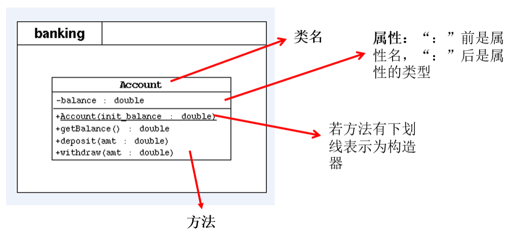
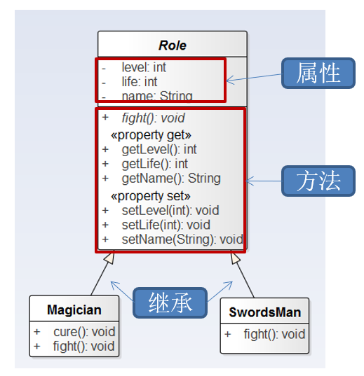
* `+` 表示 `public` 类型，`-` 表示 `private` 类型，`#` 表示 `protected` 类型。
* 方法的写法：
    ```uml
    方法的类型（+、-）方法名(参数名 : 参数类型) : 返回值类型
    ```
* 斜体表示抽象方法或类。

## 十二、企业真题

### 12.1 类与对象

**1. （平 \* 金服、英 \*\* 达）面向对象、面向过程的理解？**
答：
* 略。

**2. （阿 \* 校招）Java 的引用类型有哪几种？**
答：
* 类、数组、接口；
* 枚举、注解、记录。

**3. （凡 \* 科技、上 \* 银行）类和对象的区别？**
答：
* 略。

**4. （燕 \* 金融）面向对象，你解释一下，项目中哪些地方用到面向对象？**
答：
* “万事万物皆对象”。

### 12.2 Java 内存结构

**1. （神 \*\* 岳、数 \* 互融）Java 虚拟机中内存划分为哪些区域？详细介绍一下。**
答：
* 略。

**2. （阿 \*）对象存在 Java 内存的哪块区域里面？**
答：
* 堆空间。

> 注意：为了能够更好的进行优化，提出了“栈上分配”的思想，即将对象存放于栈空间中，利用栈的进出机制实现对象的快速弹出。

### 12.3 权限修饰符（封装性）

**1. （爱 \* 信、拓 \* 思、中 \* 瑞飞）`private`、`缺省`、`protected`、`public` 的表格化作用区域？**
答：
* 略。

**2. （凡 \* 科技、顺 \*）`main` 方法的 `public` 能不能换成 `private`？为什么？**
答：
* 能。
* 但是改了以后就不能作为程序的入口了，就只是一个普通的方法，在用时只能手动去调该方法。

### 12.4 构造器

**1. （凡 \* 科技、软 \* 动力、中 \* 软）构造方法和普通方法的区别？**
答：
* 编写代码的角度：没有共同点；声明格式、作用都不同。
* 字节码文件的角度：构造器会以 `<init>()方法` 的形式呈现，用以初始化对象。

**2. （鸿 \* 网络）构造器 Constructor 是否可被 overload？**
答：
* 可以。

**3. （北京楚 \* 龙）无参构造器和有参构造器的作用和应用？**
答：
* 略。

### 12.5 属性及属性赋值顺序

**1. （艾 \* 软件）成员变量与局部变量的区别？**
答：
* 6 个点。

**2. （凡 \* 科技、博 \* 软件）变量赋值和构造方法加载的优先级问题？**
答：
* 变量显式赋值先于构造器中的赋值。
* 如何证明？
  * 通过字节码文件查看。