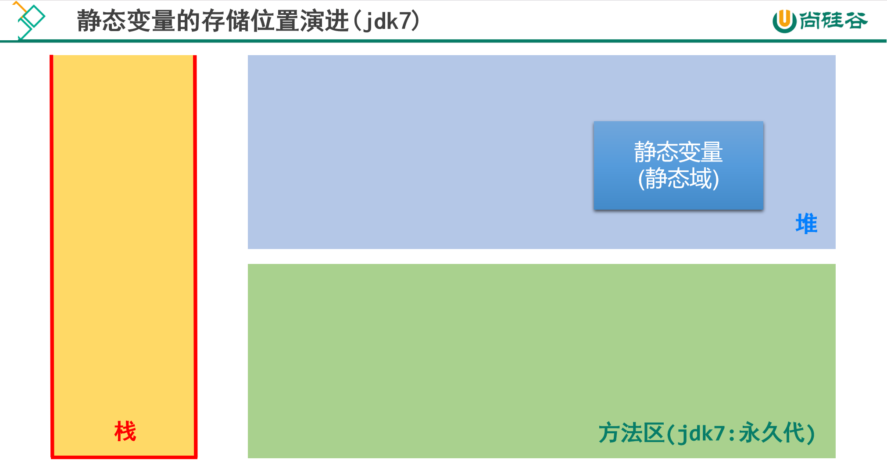

# 第八章：面向对象编程（高级）

**目录：**

[TOC]

---

本章专题与脉络：


## 一、关键字：`static`

**回顾类中的实例变量（即非 `static` 的成员变量）：**

```java
class Circle {
    private double radius;
    public Circle(double radius) {
        this.radius = radius;
    }
    public double findArea() {
        return Math.PI * radius * radius;
    }
}
```

创建两个 `Circle` 对象：
```java
Circle c1 = new Circle(2.0);    // c1.radius = 2.0
Circle c2 = new Circle(3.0);    // c2.radius = 3.0
```

`Circle` 类中的变量 `radius` 是一个实例变量（instance variable），它属于类的每一个对象，`c1` 中的 `radius` 变化不会影响 `c2` 的 `radius`，反之亦然。

**如果想让一个成员变量被类的所有实例所共享，就用 `static` 修饰即可，称为类变量（或类属性）！**

### 1.1 类属性、类方法的设计思想

当我们编写一个类时，其实就是在描述其对象的属性和行为，而并没有产生实质上的对象；只有通过 new 关键字才会产出对象，这时系统才会分配内存空间给对象，其方法才可以供外部调用。我们有时候希望无论是否产生了对象或无论产生了多少对象的情况下，**某些特定的数据在内存空间里只有一份**。例如，所有的中国人都有个国家名称，每一个中国人都共享这个国家名称，不必在每一个中国人的实例对象中都单独分配一个用于代表国家名称的变量。


此外，在类中声明的实例方法，在类的外面必须要先创建对象，才能调用；但是有些方法的调用者和当前类的对象无关，这样的方法通常被声明为**类方法**。由于不需要创建对象就可以调用类方法，从而简化了方法的调用。

这里的类变量、类方法，只需要使用 `static` 修饰即可，所以也被称为静态变量、静态方法。

### 1.2 `static` 关键字

> static：静态的。

使用范围：
* 在 Java 类中，可用 `static` 修饰属性、方法、代码块、内部类。

> 注意：构造器不能被 `static` 修饰。

被修饰后的成员具备以下特点：
* 随着类的加载而加载。
* 优先于对象存在。
* 修饰的成员，被所有对象所共享。
* 访问权限允许时，可不创建对象，直接被类调用。

### 1.3 静态变量

> 复习：
>
> 变量的分类：
> * 方式 1：按照数据类型。
>   * 基本数据类型；
>   * 引用数据类型。
> * 方式 2：按照类中声明的位置。
>   * 成员变量：按照是否使用 `static` 修饰进行分类。
>       * 使用 `static` 修饰的成员变量：静态变量（类变量）。
>       * 不使用 `static` 修饰的成员变量：非静态变量（实例变量）。
>   * 局部变量：方法内、方法形参、构造器内、构造器形参、代码块内等。

#### 1.3.1 语法格式

类中使用 `static` 修饰的成员变量就是静态变量（或类变量、类属性）。

其语法格式如下：
```java
[修饰符] class 类名 {
    [其他修饰符] static 数据类型 变量名;
}
```

#### 1.3.2 静态变量的特点

静态变量的默认值规则和实例变量一样。

静态变量值是所有对象共享。

静态变量在本类中，可以在任意方法、代码块、构造器中直接使用。

如果权限修饰符允许，在其他类中可以通过 “`类名.静态变量`” 直接访问，也可以通过 “`对象.静态变量`” 的方式访问（但是更推荐使用 “`类名.静态变量`” 的方式）。

静态变量的 `get` / `set` 方法也是静态的。当局部变量与静态变量重名时，使用 “`类名.静态变量`” 进行区分。

> 对比静态变量与实例变量：
> 1. 个数：
>   * 静态变量：在内存空间中只有一份，被类的多个对象所共享。
>   * 实例变量：类的每一个实例（或对象）都保存着一份实例变量。
> 2. 内存位置：
>   * 静态变量：JDK 6 及之前存放在方法区；JDK 7 及之后存放在堆空间。
>       * JDK 6：
>           
>       * JDK 7：
>           
>       * JDK 8：
>           
>   * 实例变量：存放在堆空间的对象实体中。
> 3. 加载时机：
>   * 静态变量：随着类的加载而加载；由于类只会加载一次，所以静态变量也只有一份。
>   * 实例变量：随着对象的创建而加载；每个对象拥有一份实例变量。
> 4. 调用者：
>   * 静态变量：可以被类直接调用，也可以使用对象调用。
>   * 实例变量：只能使用对象进行调用。
> 5. 判断是否可以调用 -> 从生命周期的角度解释：
>   * 类可以调用类变量，但不可以调用实例变量。
>   * 对象可以调用类变量，也可以调用实例变量。
> 6. 消亡时机：
>   * 静态变量：随着类的卸载而消亡。
>   * 实例变量：随着对象的消亡而消亡。

> 注意：
>
> 开发中，什么时候需要将属性声明为静态的？
> * 判断当前类的多个实例是否能共享此成员变量，且此成员变量的值是相同的。
> * 开发中，常将一些常量声明为静态的；比如 `Math` 类中的 `PI`。

#### 1.3.3 举例

示例代码：
```java
/* ChineseTest.java */

package com.anxin_hitsz_01._static;

/**
 * ClassName: ChineseTest
 * Package: com.anxin_hitsz_01._static
 * Description:
 *
 * @Author AnXin
 * @Create 2026/1/29 14:26
 * @Version 1.0
 */
public class ChineseTest {
    public static void main(String[] args) {

        System.out.println(Chinese.nation); // 中国


        Chinese c1 = new Chinese();
        c1.name = "姚明";
        c1.age = 40;
        c1.nation = "China";

        Chinese c2 = new Chinese();
        c2.name = "刘翔";
        c2.age = 39;

        System.out.println(c1);
        System.out.println(c2);

        System.out.println(c1.nation);  // China
        System.out.println(c2.nation);  // China

        c2.nation = "CHN";

        System.out.println(c1.nation);  // CHN
        System.out.println(c2.nation);  // CHN

    }
}

class Chinese { // 中国人类
    // 非静态变量（实例变量）
    String name;
    int age;

    // 静态变量（类变量）
    static String nation = "中国";

    @Override
    public String toString() {
        return "Chinese{" +
                "name='" + name + '\'' +
                ", age=" + age +
                '}';
    }
}

```

#### 1.3.4 内存解析

静态变量、实例变量与局部变量的内存解析：


静态变量的内存解析：


### 1.4 静态方法

#### 1.4.1 语法格式

用 `static` 修饰的成员方法就是静态方法（或称为类方法）。

其语法格式如下：
```java
[修饰符] class 类名 {
    [其他修饰符] static 返回值类型 方法名(形参列表) {
        方法体
    }
}
```

#### 1.4.2 静态方法的特点

静态方法随着类的加载而加载。

静态方法在本类的任意方法、代码块、构造器中都可以直接被调用。

只要权限修饰符允许，静态方法在其他类中可以通过 “`类名.静态方法`” 的方式调用；也可以通过 “`对象.静态方法`” 的方式调用（但是更推荐使用 “`类名.静态方法`” 的方式）。

在 `static` 方法内部只能访问类的 `static` 修饰的属性或方法，不能访问类的非 `static` 的结构。
> 静态方法内可以调用静态的属性或静态的方法（属性和方法的前缀使用的是当前类，可以省略），不可以调用非静态的结构（比如：属性、方法）。
> * 类可以调用类方法，但不可以调用实例方法。
> * 对象可以调用类方法，也可以调用实例方法。

> 补充：在类的非静态方法中，可以调用当前类的静态结构（属性、方法）或非静态结构（属性、方法）。

静态方法可以被子类继承，但不能被子类重写。

静态方法的调用都只看编译时类型。

因为不需要实例就可以访问 `static` 方法，因此 `static` 方法内部不能有 `this`，也不能有 `super`。由于静态的属性和静态的方法的前缀省略的是当前类，因此如果有重名问题，应使用 “`类名.`” 进行区别。

> 注意：
>
> 什么时候需要将方法声明为静态的？
> * 方法内操作的变量如果都是静态变量（而非实例变量）的话，则此方法建议声明为静态方法。
> * 开发中，常常将工具类中的方法声明为静态方法；比如 `Arrays` 类、`Math` 类。

#### 1.4.3 举例

示例代码：
```java
/* ChineseTest.java */

package com.anxin_hitsz_01._static;

/**
 * ClassName: ChineseTest
 * Package: com.anxin_hitsz_01._static
 * Description:
 *
 * @Author AnXin
 * @Create 2026/1/29 14:26
 * @Version 1.0
 */
public class ChineseTest {
    public static void main(String[] args) {

        System.out.println(Chinese.nation); // 中国
        Chinese.show();


        Chinese c1 = new Chinese();
        c1.name = "姚明";
        c1.age = 40;
        c1.nation = "China";

        Chinese c2 = new Chinese();
        c2.name = "刘翔";
        c2.age = 39;

        System.out.println(c1);
        System.out.println(c2);

        System.out.println(c1.nation);  // China
        System.out.println(c2.nation);  // China

        c2.nation = "CHN";

        System.out.println(c1.nation);  // CHN
        System.out.println(c2.nation);  // CHN

        c1.show();

        ChineseTest.test();
    }

    public static void test() {
        System.out.println("我是 static 的测试方法");
    }
}

class Chinese { // 中国人类
    // 非静态变量（实例变量）
    String name;
    int age;

    // 静态变量（类变量）
    static String nation = "中国";

    @Override
    public String toString() {
        return "Chinese{" +
                "name='" + name + '\'' +
                ", age=" + age +
                '}';
    }

    public void eat(String food) {
        System.out.println("我喜欢吃 " + food);
    }

    public static void show() {
        System.out.println("我是一个中国人");

        // 调用静态的结构
        System.out.println("nation = " + nation);
        method1();

        // 调用非静态的结构
//        System.out.println("name = " + this.name);
//        this.eat("饺子");
    }

    public static void method1() {
        System.out.println("我是静态的测试方法");
    }

    public void method2() {
        System.out.println("我是非静态的测试方法");
        // 调用非静态的结构
        System.out.println("name = " + this.name);
        this.eat("饺子");

        // 调用静态的结构
        System.out.println("nation = " + nation);
        method1();
    }

    public static String getNation() {
        return nation;
    }

    public static void setNation(String nation) {
        Chinese.nation = nation;
    }
}

```

### 1.5 应用举例

示例代码：
```java
/* CircleTest.java */

package com.anxin_hitsz_01._static.apply;

/**
 * ClassName: CircleTest
 * Package: com.anxin_hitsz_01._static.apply
 * Description:
 *
 * @Author AnXin
 * @Create 2026/1/29 15:35
 * @Version 1.0
 */
public class CircleTest {
    public static void main(String[] args) {

        Circle c1 = new Circle();
        System.out.println(c1);

        Circle c2 = new Circle();
        System.out.println(c2);

        Circle c3 = new Circle();
        System.out.println(c3);

        Circle c4 = new Circle(2.3);
        System.out.println(c4);

        System.out.println(Circle.total);

    }
}

class Circle {

    double radius;  // 实例变量

    int id; // 编号

    static int total;  // 创建的 Circle 实例的个数


    public Circle() {
        this.id = init;
        init++;
        total++;
    }

    public Circle(double radius) {
        this();
        this.radius = radius;
    }

    private static int init = 1001; // 自动给 id 赋值的基数

    @Override
    public String toString() {
        return "Circle{" +
                "radius=" + radius +
                ", id=" + id +
                '}';
    }
}

```

### 1.6 练习

**练习 1：**
> 题目：
>
> 编写一个类实现银行账户的概念，包含的属性有 “账号”、“密码”、“存款余额”、“利率”、“最小余额”；定义封装这些属性的方法。要求账号要自动生成。
>
> 编写主类，使用银行账户类，输入、输出 3 个储户的上述信息。
>
> 考虑：哪些属性可以设计成 `static` 属性。

示例代码：
```java
/* Account.java */

package com.anxin_hitsz_01._static.exer1;

/**
 * ClassName: Account
 * Package: com.anxin_hitsz_01._static.exer1
 * Description:
 *
 * @Author AnXin
 * @Create 2026/1/29 15:44
 * @Version 1.0
 */
public class Account {

    private int id; // 账号

    private String password;    // 密码

    private double balance; // 余额

    private static double interestRate; // 利率

    private static double minBalance = 1.0; // 最小余额

    private static int init = 1001; // 用于自动生成 id 的基数

    public Account() {
        this.id = init;
        init++;
        password = "000000";
    }

    public Account(String password, double balance) {
        this.password = password;
        this.balance = balance;
        this.id = init;
        init++;
    }

    public String getPassword() {
        return password;
    }

    public void setPassword(String password) {
        this.password = password;
    }

    public double getBalance() {
        return balance;
    }

    public void setBalance(double balance) {
        this.balance = balance;
    }

    public static double getInterestRate() {
        return interestRate;
    }

    public static void setInterestRate(double interestRate) {
        Account.interestRate = interestRate;
    }

    public static double getMinBalance() {
        return minBalance;
    }

    public static void setMinBalance(double minBalance) {
        Account.minBalance = minBalance;
    }

    @Override
    public String toString() {
        return "Account{" +
                "id=" + id +
                ", password='" + password + '\'' +
                ", balance=" + balance +
                '}';
    }
}


/* AccountTest.java */

package com.anxin_hitsz_01._static.exer1;

/**
 * ClassName: AccountTest
 * Package: com.anxin_hitsz_01._static.exer1
 * Description:
 *
 * @Author AnXin
 * @Create 2026/1/29 15:48
 * @Version 1.0
 */
public class AccountTest {
    public static void main(String[] args) {

        Account acct1 = new Account();
        System.out.println(acct1);

        Account acct2 = new Account("123456", 2000);
        System.out.println(acct2);

        Account.setInterestRate(0.0123);
        Account.setMinBalance(10);

        System.out.println("银行存款的利率为：" + Account.getInterestRate());
        System.out.println("银行最小存款额度为：" + Account.getMinBalance());
    }
}

```

**练习 2：**
> 题目：
>
> 自定义一个数组的工具类，封装常用的数组算法。

示例代码：
```java
/* MyArrays.java */

package com.anxin_hitsz_01._static.exer2;

/**
 * ClassName: MyArrays
 * Package: com.anxin_hitsz_04.example.exer4
 * Description:
 *
 * @Author AnXin
 * @Create 2025/12/7 17:28
 * @Version 1.0
 */
public class MyArrays {

    /**
     * 获取 int[] 数组的最大值
     * @param arr 要获取最大值的数组
     * @return 数组的最大值
     */
    public static int getMax(int[] arr) {
        int max = arr[0];
        for (int i = 1; i < arr.length; i++) {
            if (max < arr[i]) {
                max = arr[i];
            }
        }
        return max;
    }

    /**
     * 获取 int[] 数组的最小值
     * @param arr 要获取最小值的数组
     * @return 数组的最小值
     */
    public static int getMin(int[] arr) {
        int min = arr[0];
        for (int i = 1; i < arr.length; i++) {
            if (min > arr[i]) {
                min = arr[i];
            }
        }
        return min;
    }

    public static int getSum(int[] arr) {
        int sum = 0;
        for (int i = 0; i < arr.length; i++) {
            sum += arr[i];
        }
        return sum;
    }

    public static int getAvg(int[] arr) {

        return getSum(arr) / arr.length;
    }

    public static void print(int[] arr) {  // [12, 231, 34, ...]
        System.out.print("[");
        for (int i = 0; i < arr.length; i++) {
            if (i == 0) {
                System.out.print(arr[i]);
            } else {
                System.out.print(", " + arr[i]);
            }
        }

        System.out.println("]");
    }

    public static int[] copy(int[] arr) {
        int[] newArr = new int[arr.length];
        for (int i = 0; i < arr.length; i++) {
            newArr[i] = arr[i];
        }
        return newArr;
    }

    public static void reverse(int[] arr) {
        for (int i = 0, j = arr.length - 1 /* 尾索引 */; i < j; i++, j--) {
            // 交互 arr[i] 与 arr[j] 位置的元素
            int temp = arr[i];
            arr[i] = arr[j];
            arr[j] = temp;
        }
    }

    public static void sort(int[] arr) {
        for (int j = 0; j < arr.length - 1; j++) {
            for (int i = 0; i < arr.length - 1 - j; i++) {
                if (arr[i] > arr[i + 1]) {
                    // 交互 arr[i] 和 arr[i + 1]
                    int temp = arr[i];
                    arr[i] = arr[i + 1];
                    arr[i + 1] = temp;
                }
            }
        }
    }

    /**
     * 使用线性查找的算法，查找指定的元素
     * @param arr 待查找的数组
     * @param target 要查找的元素
     * @return target 元素在 arr 数组中的索引位置。若未找到，则返回 -1
     */
    public static int linearSearch(int[] arr, int target) {
        for (int i = 0; i < arr.length; i++) {
            if (target == arr[i]) {
                return i;
            }
        }

        // 只要代码执行到此位置，一定是没找到
        return -1;
    }
}


/* MyArraysTest.java */

package com.anxin_hitsz_01._static.exer2;

/**
 * ClassName: MyArraysTest
 * Package: com.anxin_hitsz_04.example.exer4
 * Description:
 *
 * @Author AnXin
 * @Create 2025/12/7 17:31
 * @Version 1.0
 */
public class MyArraysTest {
    public static void main(String[] args) {

        int[] arr = new int[] {34, 56, 223, 2, 56, 24, 56, 67, 778, 45};

        // 求最大值
        System.out.println("最大值为：" + MyArrays.getMax(arr));
        // 求平均值
        System.out.println("平均值为：" + MyArrays.getAvg(arr));

        // 遍历
        MyArrays.print(arr);

        // 查找
        int index = MyArrays.linearSearch(arr, 24);
        if (index >= 0) {
            System.out.println("找到了，位置：" + index);
        } else {
            System.out.println("未找到");
        }

        // 排序
        MyArrays.sort(arr);
        // 遍历
        MyArrays.print(arr);

    }
}

```

### 1.7 补充说明

静态变量和静态方法与实例对象无关。

示例代码：
```java
/* StaticTest.java */

package com.anxin_hitsz_01._static.interview;

/**
 * ClassName: StaticTest
 * Package: com.anxin_hitsz_01._static.interview
 * Description:
 *
 * @Author AnXin
 * @Create 2026/1/29 16:01
 * @Version 1.0
 */
public class StaticTest {
    public static void main(String[] args) {
        Order order = null;
        order.hello();  // hello!
        System.out.println(order.count);    // 1
    }
}

class Order {
    public static int count = 1;

    public static void hello() {
        System.out.println("hello!");
    }
}

```

在上述代码中，尽管对象 `order` 为空（`null`），但因为静态变量和静态方法与实例对象无关，因此 `order` 仍然可以正常调用静态方法 `hello()` 并输出静态变量 `count`，不会出现空指针异常的情况。

## 二、单例（Singleton）设计模式

### 2.1 设计模式概述

**设计模式**是在大量的**实践中总结**和**理论化**之后优选的代码结构、编程风格、以及解决问题的思考方式。设计模式免去我们自己再思考和摸索，就像是经典的棋谱，面对不同的棋局我们用不同的棋谱，本质是一种“套路”。

经典的设计模式共有 23 种，每个设计模式均是特定环境下特定问题的处理方法。如下图所示：


> 注意：
>
> 简单工厂模式并不是 23 种经典模式的一种，是其中工厂方法模式的简化版。

### 2.2 何为单例模式？

所谓类的单例设计模式，就是采取一定的方法保证在整个的软件系统中，对某个类**只能存在一个对象实例**，并且该类只提供一个取得其对象实例的方法。

### 2.3 实现思路

如果我们要让类在一个虚拟机中只能产生一个对象，我们首先必须将**类的构造器的访问权限设置为 `private`**；这样，就不能用 `new` 操作符在类的外部产生类的对象了，但在类内部仍可以产生该类的对象。因为在类的外部开始还无法得到类的对象，**只能调用该类的某个静态方法**以返回类内部创建的对象，静态方法只能访问类中的静态成员变量，所以指向类内部产生的**该类对象的变量也必须定义成静态的**。

### 2.4 单例模式的两种实现方式

#### 2.4.1 饿汉式

饿汉式 语法格式：
```java
class Singleton {
    // 1. 私有化构造器
    private Singleton() {
    }

    // 2. 内部提供一个当前类的实例
    // 4. 此实例也必须静态化
    private static Singleton single = new Singleton();

    // 3. 提供公共的静态的方法，返回当前类的对象
    public static Singleton getInstance() {
        return single;
    }
}

```

示例代码：
```java
/* BankTest.java */

package com.anxin_hitsz_02.singleton;

/**
 * ClassName: BankTest
 * Package: com.anxin_hitsz_02.singleton
 * Description:
 *
 * @Author AnXin
 * @Create 2026/1/29 17:18
 * @Version 1.0
 */
public class BankTest {
    public static void main(String[] args) {
//        Bank bank1 = new Bank();
//        Bank bank2 = new Bank();

        Bank bank1 = Bank.getInstance();
        Bank bank2 = Bank.getInstance();

        System.out.println(bank1 == bank2);
    }
}

// 饿汉式
class Bank {

    // 1. 类的构造器私有化
    private Bank() {

    }

    // 2. 在类的内部创建当前类的实例
    // 4. 此属性也必须声明为 static 的
    private static Bank instance = new Bank();

    // 3. 使用 getXxx() 方法获取当前类的实例，必须声明为 static 的
    public static Bank getInstance() {
        return instance;
    }

}

```

#### 2.4.2 懒汉式

懒汉式 语法格式：
```java
class Singleton {
    // 1. 私有化构造器
    private Singleton() {
    }
    // 2. 内部提供一个当前类的实例
    // 4. 此实例也必须静态化
    private static Singleton single;
    // 3. 提供公共的静态的方法，返回当前类的对象
    public static Singleton getInstance() {
        if (single == null) {
            single = new Singleton();
        }
        return single;
    }
}

```

示例代码：
```java
/* GirlFriendTest.java */

package com.anxin_hitsz_02.singleton;

/**
 * ClassName: GirlFriendTest
 * Package: com.anxin_hitsz_02.singleton
 * Description:
 *
 * @Author AnXin
 * @Create 2026/1/29 17:24
 * @Version 1.0
 */
public class GirlFriendTest {
    public static void main(String[] args) {

    }
}

// 懒汉式
class GirlFriend {

    // 1. 类的构造器私有化
    private GirlFriend() {

    }

    // 2. 声明当前类的实例
    // 4. 此属性也必须声明为 static 的
    private static GirlFriend instance = null;

    // 3. 通过 getXxx() 获取当前类的实例，如果未创建对象，则在方法内部进行创建
    public static GirlFriend getInstance() {
        if (instance == null) {
            instance = new GirlFriend();
        }

        return instance;

    }
}

```

#### 2.4.3 饿汉式 vs 懒汉式

**饿汉式：**
* 特点：**立即加载**，即在使用类的时候已经将对象创建完毕。（随着类的加载，当前的唯一实例就创建了。）
* 优点：实现起来**简单**；由于内存中较早加载，使用更方便、更快；没有多线程安全问题，即是线程安全的。
* 缺点：当类被加载的时候，会初始化 `static` 的实例，静态变量被创建并分配内存空间；从这以后，这个 `static` 的实例便一直占着这块内存，直到类被卸载时，静态变量被摧毁，并释放所占有的内存。因此在某些特定条件下会**耗费内存**。（即内存中占用时间较长。）

**懒汉式：**
* 特点：**延迟加载**，即在调用静态方法时实例才被创建。（在需要使用的时候，进行创建。）
* 优点：实现起来比较简单；当类被加载的时候，`static` 的实例未被创建并分配内存空间，当静态方法第一次被调用时，初始化实例变量，并分配内存，因此在某些特定条件下会**节约内存**。（即在需要的时候进行创建，节省内存空间。）
* 缺点：在多线程环境中，这种实现方法是完全错误的，**线程不安全**，根本不能保证单例的唯一性。
  * 说明：在多线程章节，会将懒汉式改造成线程安全的模式。

### 2.5 单例模式的优点及应用场景

由于单例模式只生成一个实例，减少了**系统性能开销**，当一个对象的产生需要比较多的资源时（如读取配置、产生其他依赖对象时），则可以通过在应用启动时直接产生一个单例对象、然后永久驻留内存的方式来解决。

举例：


**应用场景：**

* Windows 的 Task Manager（任务管理器）就是很典型的单例模式。
* Windows 的 Recycle Bin（回收站）也是典型的单例应用；在整个系统运行过程中，回收站一直维护者仅有的一个实例。
* Application 也是单例的典型应用。
* 应用程序的日志应用，一般都使用单例模式实现，这一般是由于共享的日志文件一直处于打开状态，因为只能有一个实例去操作，否则内容不方便追加。
* 数据库连接池的设计一般也是采用单例模式，因为数据库连接是一种数据库资源。

## 三、理解 `main` 方法的语法

`main()` 方法的剖析：
```java
public static void main(String[] args[]) {}
```

由于 JVM 需要调用类的 `main()` 方法，所以该方法的访问权限必须是 `public`；又因为 JVM 在执行 `main()` 方法时不必创建对象，所以该方法必须是 `static` 的。该方法接收一个 `String` 类型的数组参数，该数组中保存执行 Java 命令时传递给所运行的类的参数。

又因为 `main()` 方法是静态的，我们不能直接访问该类中的非静态成员，必须创建该类的一个实例对象后，才能通过这个对象去访问类中的非静态成员。这种情况，我们在之前的例子中多次碰到。

> `main()` 方法的理解：
> * 理解 1：看做是一个普通的静态方法。
> * 理解 2：看做是程序的入口，格式是固定的。

示例代码：
```java
/* MainTest.java */

package com.anxin_hitsz_03.main;

/**
 * ClassName: MainTest
 * Package: com.anxin_hitsz_03.main
 * Description:
 *
 * @Author AnXin
 * @Create 2026/1/29 17:48
 * @Version 1.0
 */
public class MainTest {
    public static void main(String[] args) {    // 程序的入口
        String[] arr = new String[] {"AA", "BB", "CC"};
        Main.main(arr);
    }
}

class Main {

    public static void main(String[] args) {    // 看做是普通的静态方法
        System.out.println("Main 的 main() 方法的调用");
        for (int i = 0; i < args.length; i++) {
            System.out.println(args[i]);
        }
    }

}

```

应用：进行与控制台的交互时，如何从键盘获取数据？
* 方式 1：使用 `Scanner`。
* 方式 2：使用 `main()` 的形参进行传值。

示例代码：
```java
/* MainDemo.java */

package com.anxin_hitsz_03.main;

/**
 * ClassName: MainDemo
 * Package: com.anxin_hitsz_03.main
 * Description:
 *
 * @Author AnXin
 * @Create 2026/1/29 17:53
 * @Version 1.0
 */
public class MainDemo {
    public static void main(String[] args) {
        for (int i = 0; i < args.length; i++) {
            System.out.println("hello: " + args[i]);
        }
    }
}

```

**命令行参数用法举例：**

首先创建 `main()` 方法：
```java
public class CommandPara {
    public static void main(String[] args) {
        for (int i = 0; i < args.length; i++) {
            System.out.println("args[" + i + "] = " + args[i]);
        }
    }
}

```

之后运行程序 `CommandPara.java`：
```bash
// 运行程序 CommandPara.java
java CommandPara "Tom" Jerry "Shkstart" 89 true
```

输出结果：
```java
// 输出结果
args[0] = Tom
args[1] = Jerry
args[2] = Shkstart
args[3] = 89
args[4] = true
```

运行命令解析：


**IDEA 工具配置及运行：**
1. 配置运行参数：


2. 运行程序：


## 四、类的成员之四：代码块

> 回顾：
>
> 类中可以声明的结构：属性、方法、构造器；代码块（或初始化块）、内部类。

如果成员变量想要初始化的值不是一个硬编码的常量值，而是需要通过复杂的计算或读取文件、或读取运行环境信息等方式才能获取的一些值，该怎么办呢？此时，可以考虑代码块（或初始化块）。

代码块（或初始化块）的作用：
* 对 Java 类或对象进行初始化。
  * 即：用来初始化类或对象的信息（亦即：初始化类或对象的成员变量）。

代码块（或初始化块）的分类：
* 一个类中代码块若有修饰符，则只能被 `static` 修饰，称为静态代码块（static block）。
* 没有使用 `static` 修饰的，为非静态代码块。

### 4.1 静态代码块

如果想要为静态变量初始化，可以直接在静态变量的声明后面直接赋值，也可以使用静态代码块。

#### 4.1.1 语法格式

在代码块的前面加 `static`，就是静态代码块。

语法格式：
```java
[修饰符] class 类名 {
    static {
        静态代码块
    }
}
```

#### 4.1.2 静态代码块的特点

静态代码块具有以下特点：
1. 可以有输出语句。
2. 可以对类的属性、类的声明进行初始化操作。
3. 不可以对非静态的属性初始化；即：不可以调用非静态的属性和方法。
4. 若有多个静态的代码块，那么按照从上到下的顺序依次执行。
5. 静态代码块的执行要先于非静态代码块。
6. 静态代码块随着类的加载而加载，且只执行一次。

> 静态代码块的具体使用说明：
> * 随着类的加载而执行（或调用）。
> * 由于类的加载只会执行一次，进而静态代码块的执行也只会执行一次。
> * 作用：用来初始化类的信息。
> * 内部可以声明变量、调用属性或方法、编写输出语句等操作。
> * 静态代码块的执行要先于非静态代码块的执行。
> * 如果声明有多个静态代码块，则按照声明的先后顺序执行。
> * 静态代码块内部只能调用静态的结构（即静态的属性、方法），不能调用非静态的结构（即非静态的属性、方法）。

示例代码：
```java

```

### 4.2 非静态代码块

#### 4.2.1 语法格式

非静态代码块的语法格式如下所示：
```java
[修饰符] class 类名 {
    {
        非静态代码块
    }
    [修饰符] 构造器名() {
        // 实例初始化代码
    }
    [修饰符] 构造器名(参数列表) {
        // 实例初始化代码
    }
}
```

#### 4.2.2 非静态代码块的作用

和构造器一样，也是用于实例变量的初始化等操作。

#### 4.2.3 非静态代码块的意义

如果多个重载的构造器有公共代码，并且这些代码都是先于构造器其他代码执行的，那么可以将这部分代码抽取到非静态代码块中，减少冗余代码。

#### 4.2.4 非静态代码块的执行特点

非静态代码块具有以下执行特点：
1. 可以有输出语句。
2. 可以对类的属性、类的声明进行初始化操作。
3. 除了调用非静态的结构外，还可以调用静态的变量或方法。
4. 若有多个非静态的代码块，那么按照从上到下的顺序依次执行。
5. 每次创建对象的时候，都会执行一次；且先于构造器执行。

> 非静态代码块的具体使用说明：
> * 随着对象的创建而执行。
> * 每创建当前类的一个实例，就会执行一次非静态代码块。
> * 作用：用来初始化对象的信息。
> * 内部可以声明变量、调用属性或方法、编写输出语句等操作。
> * 如果声明有多个非静态代码块，则按照声明的先后顺序执行。
> * 非静态代码块内部可以调用静态的结构（即静态的属性、方法），也可以调用非静态的结构（即非静态的属性、方法）。

### 4.3 举例

示例代码：
```java
/* BlockTest.java */

package com.anxin_hitsz_04.block;

/**
 * ClassName: BlockTest
 * Package: com.anxin_hitsz_04.block
 * Description:
 *
 * @Author AnXin
 * @Create 2026/1/29 19:34
 * @Version 1.0
 */
public class BlockTest {
    public static void main(String[] args) {
        System.out.println(Person.info);
        System.out.println(Person.info);


        Person p1 = new Person();
        Person p2 = new Person();
        System.out.println(p1.age);
//        p1.eat();
    }
}

class Person {

    String name;
    int age;

    static String info = "我是一个人";

    public void eat() {
        System.out.println("人吃饭");
    }

    public Person() {}

    // 非静态代码块
    {
        System.out.println("非静态代码块 2");
    }
    {
        System.out.println("非静态代码块 1");
        age = 1;
        System.out.println("info = " + info);
    }

    // 静态代码块
    static {
        System.out.println("静态代码块 2");
    }
    static {
        System.out.println("静态代码块 1");
        System.out.println("info = " + info);
//        System.out.println("age = " + age);
//        eat();
    }

}

```

以上示例中代码块的作用可以被构造器代替。而下述情况中，代码块是必须的：
```java
private static DataSource dataSource = null;

static {
    InputStream is = null;
    try {
        is = DBCPTest.class.getClassLoader().getResourceAsStream("dbcp.properties");
        Properties pros = new Properties();
        pros.load(is);
        // 调用 BasicDataSourceFactory 的静态方法，获取数据源
        dataSource = BasicDataSourceFactory.createDataSource(pros);
    } catch (Exception e) {
        e.printStackTrace();
    } finally {
        if (is != null) {
            try {
                is.close();
            } catch (IOException e) {
                e.printStackTrace();
            }
        }
    }
}
```

### 4.4 小结：实例变量赋值顺序

实例变量赋值顺序如下：


### 4.5 练习

练习：
> 题目：
>
> 1. 声明 `User` 类：
> * 包含属性：`userName`（`String` 类型）、`password`（`String` 类型）、`registrationTime`（`long` 类型），且要求私有化。
> * 包含 `get` / `set` 方法，其中 `registrationTime` 没有 `set` 方法。
> * 包含无参构造：
>   * 输出“`新用户注册`”；
>   * `registrationTime` 赋值为当前系统时间；
>   * `userName` 默认为当前系统时间值；
>   * `password` 默认为“`123456`”。
> * 包含有参构造（即 `(String userName, String password)`）：
>   * 输出“`新用户注册`”；
>   * `registrationTime` 赋值为当前系统时间；
>   * `userName` 和 `password` 由参数赋值。
> * 包含 `public String getInfo()` 方法，返回：“`用户名：XX，密码：XX，注册时间：XX`”。
>
> 2. 编写测试类，测试类 `main()` 方法的代码。

示例代码：
```java
/* User.java */

package com.anxin_hitsz_04.block.exer;

/**
 * ClassName: User
 * Package: com.anxin_hitsz_04.block.exer
 * Description:
 *
 * @Author AnXin
 * @Create 2026/1/29 19:53
 * @Version 1.0
 */
public class User {
    private String userName;
    private String password;
    private long registrationTime;  // 注册时间

    public String getUserName() {
        return userName;
    }

    public void setUserName(String userName) {
        this.userName = userName;
    }

    public String getPassword() {
        return password;
    }

    public void setPassword(String password) {
        this.password = password;
    }

    public long getRegistrationTime() {
        return registrationTime;
    }

    public User() {
        System.out.println("新用户注册");
        registrationTime = System.currentTimeMillis();  // 获取系统当前时间（距离 1970-1-1 00:00:00 到现在的毫秒数）
        userName = System.currentTimeMillis() + "";
        password = "123456";
    }

    public User(String userName, String password) {
        System.out.println("新用户注册");
        registrationTime = System.currentTimeMillis();  // 获取系统当前时间（距离 1970-1-1 00:00:00 到现在的毫秒数）
        this.userName = userName;
        this.password = password;
    }

    public String getInfo() {
        return "用户名：" + userName + "，密码：" + password + "，注册时间：" + registrationTime;
    }
}


/* User1.java */

package com.anxin_hitsz_04.block.exer;

/**
 * ClassName: User1
 * Package: com.anxin_hitsz_04.block.exer
 * Description:
 *
 * @Author AnXin
 * @Create 2026/1/29 19:59
 * @Version 1.0
 */
public class User1 {
    private String userName;
    private String password;
    private long registrationTime;  // 注册时间

    public String getUserName() {
        return userName;
    }

    public void setUserName(String userName) {
        this.userName = userName;
    }

    public String getPassword() {
        return password;
    }

    public void setPassword(String password) {
        this.password = password;
    }

    public long getRegistrationTime() {
        return registrationTime;
    }

    // 代码块的使用
    {
        System.out.println("新用户注册");
        registrationTime = System.currentTimeMillis();  // 获取系统当前时间（距离 1970-1-1 00:00:00 到现在的毫秒数）
    }

    public User1() {
        userName = System.currentTimeMillis() + "";
        password = "123456";
    }

    public User1(String userName, String password) {
//        System.out.println("新用户注册");
//        registrationTime = System.currentTimeMillis();  // 获取系统当前时间（距离 1970-1-1 00:00:00 到现在的毫秒数）
        this.userName = userName;
        this.password = password;
    }

    public String getInfo() {
        return "用户名：" + userName + "，密码：" + password + "，注册时间：" + registrationTime;
    }
}


/* UserTest.java */

package com.anxin_hitsz_04.block.exer;

/**
 * ClassName: UserTest
 * Package: com.anxin_hitsz_04.block.exer
 * Description:
 *
 * @Author AnXin
 * @Create 2026/1/29 19:58
 * @Version 1.0
 */
public class UserTest {
    public static void main(String[] args) {
        User u1 = new User();
        System.out.println(u1.getInfo());

        User u2 = new User("Tom", "654321");
        System.out.println(u2.getInfo());

        System.out.println();
        User1 u3 = new User1();
        System.out.println(u3.getInfo());

    }
}

```

### 4.6 小结：类中属性赋值的位置及过程

可以给类的非静态的属性（即实例变量）赋值的位置有：
① 默认初始化；
② 显式初始化； 或 ⑤ 代码块中初始化；
③ 构造器中初始化；
④ 有了对象以后，通过 “`对象.属性`” 或 “`对象.方法`” 的方法进行赋值。

执行的先后顺序：① -> ②/⑤ -> ③ -> ④。

关于字节码文件中的 `<init>` 的简单说明（通过插件 jclasslib bytecode viewer 查看）：
* `<init>` 方法在字节码文件中可以看到；每个 `<init>` 方法都对应着一个类的构造器。（类中声明了几个构造器就会有几个 `<init>`。）
* 编写的代码中的构造器在编译以后就会以 `<init>` 方法的方式呈现。
* `<init>` 方法内部的代码包含了实例变量的显式赋值、代码块中的赋值和构造器中的代码。
* `<init>` 方法是用来初始化当前创建的对象的信息的。

给实例变量赋值的位置很多，开发中如何选择？
* 显式赋值：比较适合于每个对象的属性值相同的场景。
* 构造器中赋值：比较适合于每个对象的属性值不相同的场景。

示例代码：
```java
/* FieldTest.java */

package com.anxin_hitsz_05.field;

/**
 * ClassName: FieldTest
 * Package: com.anxin_hitsz_05.field
 * Description:
 *
 * @Author AnXin
 * @Create 2026/1/29 20:42
 * @Version 1.0
 */
public class FieldTest {
    public static void main(String[] args) {
        Order o1 = new Order();
        System.out.println(o1.orderId); // 1
    }
}

class Order {

    int orderId = 1;

    {
        orderId = 2;
    }


    public Order() {
        super();
//        orderId = 3;
    }

    public Order(int orderId) {
        this.orderId = orderId;
    }

    public void eat() {
        sleep();
    }

    public void sleep() {

    }
}

```

技巧：**由父及子，静态先行**。示例代码如下：
```java
/* LeafTest.java */

package com.anxin_hitsz_05.field.exer;

//技巧：由父及子，静态先行。

class Root{
	static{
		System.out.println("Root的静态初始化块");
	}
	{
		System.out.println("Root的普通初始化块");
	}
	public Root(){
		super();
		System.out.println("Root的无参数的构造器");
	}
}
class Mid extends Root{
	static{
		System.out.println("Mid的静态初始化块");
	}
	{
		System.out.println("Mid的普通初始化块");
	}
	public Mid(){
		System.out.println("Mid的无参数的构造器");
	}
	public Mid(String msg){
		//通过this调用同一类中重载的构造器
		this();
		System.out.println("Mid的带参数构造器，其参数值："
			+ msg);
	}
}
class Leaf extends Mid{
	static{
		System.out.println("Leaf的静态初始化块");
	}
	{
		System.out.println("Leaf的普通初始化块");
	}	
	public Leaf(){
		//通过super调用父类中有一个字符串参数的构造器
		super("尚硅谷");
		System.out.println("Leaf的构造器");
	}
}
public class LeafTest{
	public static void main(String[] args){
		new Leaf(); 
//		System.out.println();
//		new Leaf();
	}
}

```

## 五、`final` 关键字

### 5.1 `final` 的意义

final：最终的，不可更改的。

### 5.2 `final` 的使用

`final` 可以用来修饰的结构：类、方法、变量。

`final` 与 `static` 搭配：修饰成员变量时，此成员变量称为**全局常量**。比如 `Math` 类的 `PI`。

#### 5.2.1 `final` 修饰类

`final` 修饰类，表示这个类不能被继承，没有子类。可提高安全性，提高程序的可读性。

例如：`String` 类、`System` 类、`StringBuffer` 类、`StringBuffer` 类。

示例代码：
```java
/* FinalTest.java */

package com.anxin_hitsz_06._final;

/**
 * ClassName: FinalTest
 * Package: com.anxin_hitsz_06._final
 * Description:
 *
 * @Author AnXin
 * @Create 2026/1/30 14:35
 * @Version 1.0
 */
public class FinalTest {
}

final class A {

}

//class B extends A {}

//class SubString extends String{}

```

#### 5.2.2 `final` 修饰方法

`final` 修饰方法，表示这个方法不能被子类重写。

例如：`Object` 类中的 `getClass()`。

示例代码：
```java
/* FinalTest.java */

package com.anxin_hitsz_06._final;

/**
 * ClassName: FinalTest
 * Package: com.anxin_hitsz_06._final
 * Description:
 *
 * @Author AnXin
 * @Create 2026/1/30 14:35
 * @Version 1.0
 */
public class FinalTest {
}

final class A {

}

//class B extends A {}

//class SubString extends String{}

class C {
    public final void method() {

    }
}

class D extends C {
//    public void method() {
//
//    }
}

```

#### 5.2.3 `final` 修饰变量

`final` 修饰某个变量（成员变量或局部变量），一旦赋值，它的值就不能被修改，即为常量；常量名建议使用大写字母。

例如：
```java
final double MY_PI = 3.14;
```

示例代码：
```java
/* FinalTest.java */

package com.anxin_hitsz_06._final;

/**
 * ClassName: FinalTest
 * Package: com.anxin_hitsz_06._final
 * Description:
 *
 * @Author AnXin
 * @Create 2026/1/30 14:35
 * @Version 1.0
 */
public class FinalTest {
    public static void main(String[] args) {
        E e = new E();
        System.out.println(e.MIN_SCORE);
//        e.MIN_SCORE = 1;

        E e1 = new E(10);
//        e1.LEFT = 11;
    }
}

class E {
    // 成员变量
    final int MIN_SCORE = 0;
    final int MAX_SCORE;

    final int LEFT;

//    final int RIGHT;

    {
//        MIN_SCORE = 1;
        MAX_SCORE = 100;
    }

    public E() {
        LEFT = 2;
    }
    public E(int left) {
        LEFT = left;
    }

//    public void setRight(int right) {
//        RIGHT = right;
//    }

}

class F {
    public void method() {
        final int num;
        num = 10;
//        num++;
        System.out.println(num);
    }

    public void method(final int num) {
//        num++;
        System.out.println(num);
    }
}

final class A {

}

//class B extends A {}

//class SubString extends String{}

class C {
    public final void method() {

    }
}

class D extends C {
//    public void method() {
//
//    }
}

```

**修饰成员变量：**

> 注意：
>
> 如果某个成员变量使用 `final` 修饰后，则不应为其设置 `set` 方法，并且必须将其初始化（可以显式赋值，或在初始化块赋值；实例变量还可以在构造器中赋值）。

示例代码：
```java
public final class Test {
    public static int totalNumber = 5;
    public final int ID;

    public Test() {
        ID = ++totalNumber; // 可在构造器中给 final 修饰的“变量”赋值
    }
    public static void main(String[] args) {
        Test t = new Test();
        System.out.println(t.ID);
    }
}

```

**修饰局部变量：**

> 注意：
>
> `final` 修饰局部变量，一旦赋值就不能修改。
> * 方法内声明的局部变量：在调用局部变量之前，一定需要赋值；而且一旦赋值，就不可更改。
> * 方法的形参：在调用此方法时，给形参进行赋值；而且一旦赋值，就不可更改。

示例代码：
```java
public class TestFinal {
    public static void main(String[] args) {
        final int MIN_SCORE;
        MIN_SCORE = 0;
        final int MAX_SCORE = 100;
        MAX_SCORE = 200;    // 非法
    }
}

```

**错误演示：**
```java
class A {
    private final String INFO = "atguigu";  // 声明常量

    public void print() {
        // The final field A.INFO cannot be assigned
        // INFO = "尚硅谷";
    }
}

```

## 六、抽象类与抽象方法（或 `abstract` 关键字）

abstract 的概念：抽象的。

### 6.1 由来

**举例 1：**

随着继承层次中一个个新子类的定义，类变得越来越具体，而父类则更一般、更通用。类的设计应该保证父类和子类能够共享特征。有时将一个父类设计得非常抽象，以至于它没有具体的实例，这样的类叫做抽象类。

抽象类的示例：


**举例 2（`GeometricObject`-`Circle`-`Rectangle`）：**

我们声明一些几何图形类，例如圆、矩形、三角形类等，发现这些类都有共同特征，即求面积、求周长。那么这些共同特征应该抽取到一个共同父类——几何图形类中。但是这些方法在父类中又**无法给出具体的实现**，而是应该交给子类各自具体实现。那么父类在声明这些方法时，**就只有方法签名而没有方法体**；我们把没有方法体的方法称为**抽象方法**。Java 语法规定，包含抽象方法的类必须是**抽象类**。

示例代码：
```java
abstract class GeometricObject { // 几何图形
    // 求面积（只能考虑提供方法的声明，而没有办法提供方法体；所以，此方法适合声明为抽象方法）

    // 求周长（只能考虑提供方法的声明，而没有办法提供方法体；所以，此方法适合声明为抽象方法）

}

class Circle extends GeometricObject {

    // 求面积（必须重写（或实现）父类中的抽象方法）

    // 求周长（必须重写（或实现）父类中的抽象方法）
}

class Rectangle extends GeometricObject {

    // 求面积（必须重写（或实现）父类中的抽象方法）

    // 求周长（必须重写（或实现）父类中的抽象方法）
}
```

**举例 3（`Account`-`SavingAccount`-`CheckAccount`）：**

示例代码：
```java
abstract class Account {

    double balance; // 余额

    // 取钱（声明为抽象方法）

    // 存钱（声明为抽象方法）

}

class SavingAccount extends Account {   // 储蓄卡
    // 取钱（需要重写父类中的抽象方法）

    // 存钱（需要重写父类中的抽象方法）
}
class CheckAccount extends Account {    // 信用卡
    // 取钱（需要重写父类中的抽象方法）
    
    // 存钱（需要重写父类中的抽象方法）
}
// ...
```

### 6.2 语法格式

`abstract` 可以用来修饰：类、方法。

抽象类与抽象方法：
* **抽象类**：被 `abstract` 修饰的类。
  * 此类被称为抽象类。
  * 抽象类不能实例化。
  * 抽象类中是包含构造器的，因为子类对象实例化时，需要直接或间接地调用到父类的构造器。
  * 抽象类中可以没有抽象方法；反之，抽象方法所在的类一定是抽象类。
* **抽象方法**：被 `abstract` 修饰的没有方法体的方法。
  * 此方法即为抽象方法。
  * 抽象方法只有方法的声明，没有方法体。
  * 抽象方法其功能是确定的（通过方法的声明即可确定），只是不知道如何具体实现（体现为没有方法体）。
  * 子类必须重写父类中的所有的抽象方法之后，方可实例化；否则，此子类仍然是一个抽象类。

抽象类的语法格式：
```java
[权限修饰符] abstract class 类名 {

}
[权限修饰符] abstract class 类名 extends 父类 {

}
```

抽象方法的语法格式：
```java
[其他修饰符] abstract 返回值类型 方法名([形参列表]);
```
> 注意：
> 
> 抽象方法没有方法体。
> 

示例代码：
```java
/* Creature.java */

package com.anxin_hitsz_07._abstract;

/**
 * ClassName: Creature
 * Package: com.anxin_hitsz_07._abstract
 * Description:
 *
 * @Author AnXin
 * @Create 2026/1/30 16:29
 * @Version 1.0
 */
public abstract class Creature { // 生物类
    public abstract void breath();  // 呼吸
}


/* Person.java */

package com.anxin_hitsz_07._abstract;

/**
 * ClassName: Person
 * Package: com.anxin_hitsz_07._abstract
 * Description:
 *
 * @Author AnXin
 * @Create 2026/1/30 16:04
 * @Version 1.0
 */
public abstract class Person extends Creature {  // 抽象类
    String name;
    int age;

    public Person() {
    }

    public Person(String name, int age) {
        this.name = name;
        this.age = age;
    }

    public abstract void eat(); // 抽象方法

    public abstract void sleep();   // 抽象方法
}


/* Student.java */

package com.anxin_hitsz_07._abstract;

/**
 * ClassName: Student
 * Package: com.anxin_hitsz_07._abstract
 * Description:
 *
 * @Author AnXin
 * @Create 2026/1/30 16:05
 * @Version 1.0
 */
public class Student extends Person {
    String school;

    public Student() {
    }

    public Student(String name, int age, String school) {
        super(name, age);
        this.school = school;
    }

    public void eat() {
        System.out.println("学生吃饭");
    }

    public void sleep() {
        System.out.println("学生睡觉");
    }

    @Override
    public void breath() {
        System.out.println("学生应该多呼吸新鲜空气");
    }
}


/* Worker.java */

package com.anxin_hitsz_07._abstract;

/**
 * ClassName: Worker
 * Package: com.anxin_hitsz_07._abstract
 * Description:
 *
 * @Author AnXin
 * @Create 2026/1/30 16:27
 * @Version 1.0
 */
public abstract class Worker extends Person {

    @Override
    public void eat() {
        System.out.println("工人吃饭");
    }

}


/* AbstractTest.java */

package com.anxin_hitsz_07._abstract;

/**
 * ClassName: AbstractTest
 * Package: com.anxin_hitsz_07._abstract
 * Description:
 *
 * @Author AnXin
 * @Create 2026/1/30 16:07
 * @Version 1.0
 */
public class AbstractTest {
    public static void main(String[] args) {

//        Person p1 = new Person();
//        p1.eat();

        Student s1 = new Student();
        s1.eat();

//        Worker w1 = new Worker();

    }
}

```

此时的方法重写，是子类对父类抽象方法的完成实现，我们将这种方法重写的操作也叫做**实现方法**。

### 6.3 使用说明

抽象类**不能创建对象**，如果创建，则编译无法通过而报错；只能创建其非抽象子类的对象。
> 理解：假设创建了抽象类的对象，调用抽象的方法，而抽象方法没有具体的方法体，没有意义。
>
> 抽象类是用来被继承的，抽象类的子类必须重写父类的抽象方法，并提供方法体。若没有重写全部的抽象方法，仍为抽象类。

抽象类中也有构造方法，是供子类创建对象时初始化父类成员变量使用的。
> 理解：子类的构造方法中，有默认的 `super()` 或手动的 `super(实参列表)`，需要访问父类构造方法。

抽象类中，不一定包含抽象方法，但是有抽象方法的类必定是抽象类。
> 理解：未包含抽象方法的抽象类，目的就是不想让调用者创建该类对象，通常用于某些特殊的类结构设计。

抽象类的子类，必须重写抽象父类中所有的抽象方法，否则编译无法通过而报错；除非该子类也是抽象类。
> 理解：假设不重写所有抽象方法，则类中可能包含抽象方法；那么创建对象后，调用抽象的方法，没有意义。

> 注意：
>
> 在 IDEA 中，通过 `Alt + Insert` 组合键可调出 Generate 面板，选择其中的 `Implement Methods...` 选项即可快速实现抽象父类的抽象方法。
>
> 或者可以将光标悬停到待实现抽象父类的子类的声明上，通过 `Alt + Enter` 组合键同样可快速实现抽象父类的抽象方法。

### 6.4 注意事项

不能用 `abstract` 修饰变量、属性、代码块、构造器等。

`abstract` 不能与哪些关键字共用？（自洽）
* 不能用 `abstract` 修饰私有方法、静态方法、`final` 的方法、`final` 的类。
  * 私有方法不能重写。
  * 避免静态方法使用类进行调用。
  * `final` 的方法不能被重写。
  * `final` 修饰的类不能有子类。

示例代码：
```java
/* AbstractTest1.java */

package com.anxin_hitsz_07._abstract;

/**
 * ClassName: AbstractTest1
 * Package: com.anxin_hitsz_07._abstract
 * Description:
 *
 * @Author AnXin
 * @Create 2026/1/30 16:40
 * @Version 1.0
 */
public abstract class AbstractTest1 {
//    private abstract void method();

//    public static abstract void method();
}

```

### 6.5 应用举例 1


在航运公司系统中，`Vehicle` 类需要定义两个方法分别**计算运输工具的燃料效率**和**行驶距离**。

**问题：** 卡车（`Truck`）和驳船（`RiverBarge`）的燃料效率和行驶距离的计算方法完全不同。`Vehicle` 类不能提供计算方法，但子类可以。

**解决方案：** Java 允许类设计者指定超类声明一个方法但不提供实现，该方法的实现由子类提供；这样的方法称为抽象方法。有一个或更多抽象方法的类称为抽象类。

示例代码：
```java
// Vehicle 是一个抽象类，有两个抽象方法
public abstract class Vehicle {
    public abstract double calcFuelEfficiency();    // 计算燃料效率的抽象方法
    public abstract double calcTripDistance();  // 计算行驶距离的抽象方法
}
public class Truck extends Vehicle {
    public double calcFuelEfficiency() {
        // 写出计算卡车的燃料效率的具体方法
    }
    public double calcTripDistance() {
        // 写出计算卡车行驶距离的具体方法
    }
}
public class RiverBarge extends Vehicle {
    public double calcFuelEfficiency() {
        // 写出计算驳船的燃料效率的具体方法
    }
    public double calcTripDistance() {
        // 写出计算驳船行驶距离的具体方法
    }
}

```

### 6.6 应用举例 2：模板方法设计模式（TemplateMethod）

抽象类体现的就是一种模板模式的设计，抽象类作为多个子类的通用模板，子类在抽象类的基础上进行扩展、改造，但子类总体上会保留抽象类的行为方式。

**解决的问题：**
* 当功能内部一部分实现是确定的，另一部分实现是不确定的；这时可以把不确定的部分暴露出去，让子类去实现。
* 换句话说，在软件开发中实现一个算法时，整体步骤很固定、通用，这些步骤已经在父类中写好了；但是某些部分易变，因此可将易变部分抽象出来，供不同子类实现。这就是一种模板模式。

示例代码：
```java
/* TemplateTest.java */

package com.anxin_hitsz_07._abstract.template;

/**
 * ClassName: TemplateTest
 * Package: com.anxin_hitsz_07._abstract.template
 * Description:
 *      抽象应用案例：模板方法的设计模式
 * @Author AnXin
 * @Create 2026/1/30 17:31
 * @Version 1.0
 */
public class TemplateTest {
    public static void main(String[] args) {
        PrintPrimeNumber p = new PrintPrimeNumber();

        p.spendTime();
    }
}

abstract class Template {

    // 计算某段代码的执行，需要花费的时间
    public void spendTime() {

        long start = System.currentTimeMillis();

        code();

        long end = System.currentTimeMillis();

        System.out.println("花费的时间为：" + (end - start));

    }

    public abstract void code();

}

class PrintPrimeNumber extends Template {

    @Override
    public void code() {
        for (int i = 2; i <= 100000; i++) {
            boolean isFlag = true;
            for (int j = 2; j <= Math.sqrt(i); j++) {
                if (i % j == 0) {
                    isFlag = false;
                    break;
                }
            }
            if (isFlag) {
                System.out.println(i);
            }
        }

    }
}

```

模板方法设计模式是编程中经常用得到的模式，各个框架、类库中都有其影子。比如常见的有：
* 数据库访问的封装；
* Junit 单元测试；
* JavaWeb 的 Servlet 中关于 `doGet` / `doPost` 方法调用；
* Hibernate 中模板程序；
* Spring 中 JDBCTemlate、HibernateTemplate 等。

### 6.7 练习

**练习 1：**
> 题目：
>
> 针对多态性的练习 1 中的 `GeometricObject` 等类进行升级，体现抽象的使用。
>
> UML 类图如下所示：
> 

示例代码：
```java
/* GeometricObject.java */

package com.anxin_hitsz_07._abstract.exer1;

/**
 * ClassName: GeometricObject
 * Package: com.anxin_hitsz_06.polymorphism.exer1
 * Description:
 *
 * @Author AnXin
 * @Create 2026/1/27 17:31
 * @Version 1.0
 */
public abstract class GeometricObject {
    protected String color;
    protected double weight;

    protected GeometricObject(String color, double weight) {
        this.color = color;
        this.weight = weight;
    }

    public String getColor() {
        return color;
    }

    public void setColor(String color) {
        this.color = color;
    }

    public double getWeight() {
        return weight;
    }

    public void setWeight(double weight) {
        this.weight = weight;
    }

    public abstract double findArea();
}


/* Circle.java */

package com.anxin_hitsz_07._abstract.exer1;

/**
 * ClassName: Circle
 * Package: com.anxin_hitsz_06.polymorphism.exer1
 * Description:
 *
 * @Author AnXin
 * @Create 2026/1/27 17:35
 * @Version 1.0
 */
public class Circle extends GeometricObject {

    private double radius;  // 半径

    public Circle(String color, double weight, double radius) {
        super(color, weight);
        this.radius = radius;
    }

    public double getRadius() {
        return radius;
    }

    public void setRadius(double radius) {
        this.radius = radius;
    }

    @Override
    public double findArea() {
        return 3.14 * radius * radius;
    }
}


/* MyRectangle.java */

package com.anxin_hitsz_07._abstract.exer1;

/**
 * ClassName: MyRectangle
 * Package: com.anxin_hitsz_06.polymorphism.exer1
 * Description:
 *
 * @Author AnXin
 * @Create 2026/1/27 17:37
 * @Version 1.0
 */
public class MyRectangle extends GeometricObject {
    private double width;   // 宽
    private double height;  // 高

    public MyRectangle(String color, double weight, double width, double height) {
        super(color, weight);
        this.width = width;
        this.height = height;
    }

    public double getWidth() {
        return width;
    }

    public void setWidth(double width) {
        this.width = width;
    }

    public double getHeight() {
        return height;
    }

    public void setHeight(double height) {
        this.height = height;
    }

    @Override
    public double findArea() {

        return width * height;
    }
}


/* GeometricTest.java */

package com.anxin_hitsz_07._abstract.exer1;

/**
 * ClassName: GeometricTest
 * Package: com.anxin_hitsz_06.polymorphism.exer1
 * Description:
 *
 * @Author AnXin
 * @Create 2026/1/27 17:38
 * @Version 1.0
 */
public class GeometricTest {
    public static void main(String[] args) {
        GeometricTest test = new GeometricTest();

        Circle c1 = new Circle("red", 1.0, 2.3);
        Circle c2 = new Circle("red", 1.0, 3.3);

        test.displayGeometricObject(c1);
        test.displayGeometricObject(c2);

        boolean isEquals = test.equalsArea(c1, c2);
        if (isEquals) {
            System.out.println("面积相等");
        } else {
            System.out.println("面积不相等");
        }

        // 使用匿名对象
        test.displayGeometricObject(new MyRectangle("blue", 1.0, 2.3, 4.5));

    }

    /**
     * 比较两个几何图形的面积是否相等
     * @param g1
     * @param g2
     * @return true: 表示面积相等；false: 表示面积不相等
     */
    public boolean equalsArea(GeometricObject g1, GeometricObject g2) {
        return g1.findArea() == g2.findArea();
    }

    /**
     * 显示几何图形的面积
     * @param g
     */
    public void displayGeometricObject(GeometricObject g) { // GeometricObject g = new Circle("red", 1.0, 2.3);
        System.out.println("几何图形的面积为：" + g.findArea()); // 动态绑定 <---> 静态绑定
    }
}

```

**练习 2：**
> 题目：
>
> 编写工资系统，实现不同类型员工（多态）的按月发放工资。如果当月出现某个 `Employee` 对象的生日，则将该雇员的工资增加 100 元。
>
> 练习说明：
> 1. 定义一个 `Employee` 类，该类包含：
> * `private` 成员变量 `name`、`number`、`birthday`，其中 `birthday` 为 `MyDate` 类的对象。
> * 提供必要的构造器。
> * `abstract` 方法 `earnings()`，返回工资数额。
> * `toString()` 方法输出对象的 `name`、`number` 和 `birthday`。
> 2. `MyDate` 类包含：
> * `private` 成员变量 `year`、`month`、`day`。
> * 提供必要的构造器。
> * `toDateString()` 方法返回日期对应的字符串：`xxxx年xx月xx日`。
> 3. 定义 `SalariedEmployee` 类继承 `Employee` 类，实现按月计算工资的员工处理。该类包括：
> * `private` 成员变量 `monthlySalary`。
> * 提供必要的构造器。
> * 实现父类的抽象方法 `earnings()`。该方法返回 `monthlySalary` 值。
> * `toString()` 方法输出员工类型信息及员工的 `name`、`number`、`birthday`；比如：`SalariedEmployee[name = '', number = , birthday = xxxx年xx月xx日]`。
> 4. 参照 `SalariedEmployee` 类定义 `HourlyEmployee` 类，实现按小时计算工资的员工处理。该类包括：
> * `private` 成员变量 `wage` 和 `hour`。
> * 提供必要的构造器。
> * 实现父类的抽象方法 `earnings()`，该方法返回 `wage * hour` 值。
> * `toString()` 方法输出员工类型信息及员工的 `name`、`number`、`birthday`。
> 5. 定义 `PayrollSystem` 类，创建 `Employee` 变量数组并初始化，该数组存放各类雇员对象的引用。
> * 利用循环结构遍历数组元素，输出各个对象的类型、`name`、`number`、`birthday`。
> * 当键盘输入本月月份值时，如果本月是某个 `Employee` 对象的生日，还要输出增加工资信息。
>
> 提示：
> * 定义 `People` 类型的数组 `People[] c1 = new People[10];`。
> * 数组元素赋值：
>   ```java
>   c1[0] = new People("John", "0001", 20);
>   c1[1] = new People("Bob", "0002",  19);
>   ```
> * 若 `People` 有两个子类 `Student` 和 `Officer`，则数组元素赋值时，可以使父类类型的数组元素指向子类：
>   ```java
>   c1[0] = new Student("John", "0001", 20, 85.0);
>   c1[1] = new Officer("Bob", "0002", 19, 90.5);
>   ```
>
> 
> 以上为题目描述。

示例代码：
```java
/* MyDate.java */

package com.anxin_hitsz_07._abstract.exer2;

/**
 * ClassName: MyDate
 * Package: com.anxin_hitsz_07._abstract.exer2
 * Description:
 *
 * @Author AnXin
 * @Create 2026/1/30 17:46
 * @Version 1.0
 */
public class MyDate {
    private int year;
    private int month;
    private int day;

    public MyDate() {
    }

    public MyDate(int year, int month, int day) {
        this.year = year;
        this.month = month;
        this.day = day;
    }

    public int getYear() {
        return year;
    }

    public void setYear(int year) {
        this.year = year;
    }

    public int getMonth() {
        return month;
    }

    public void setMonth(int month) {
        this.month = month;
    }

    public int getDay() {
        return day;
    }

    public void setDay(int day) {
        this.day = day;
    }

    public String toDateString() {
        return year + "年" + month + "月" + day + "日";
    }

}


/* Employee.java */

package com.anxin_hitsz_07._abstract.exer2;

/**
 * ClassName: Employee
 * Package: com.anxin_hitsz_07._abstract.exer2
 * Description:
 *
 * @Author AnXin
 * @Create 2026/1/30 17:45
 * @Version 1.0
 */
public abstract class Employee {
    private String name;
    private int number;
    private MyDate birthday;

    public Employee() {
    }

    public Employee(String name, int number, MyDate birthday) {
        this.name = name;
        this.number = number;
        this.birthday = birthday;
    }

    public String getName() {
        return name;
    }

    public void setName(String name) {
        this.name = name;
    }

    public int getNumber() {
        return number;
    }

    public void setNumber(int number) {
        this.number = number;
    }

    public MyDate getBirthday() {
        return birthday;
    }

    public void setBirthday(MyDate birthday) {
        this.birthday = birthday;
    }

    public abstract double earnings();

    public String toString() {
        return "name = " + name + ", number = " + number +
                ", birthday = " + birthday.toDateString();
    }

}


/* SalariedEmployee.java */

package com.anxin_hitsz_07._abstract.exer2;

/**
 * ClassName: SalariedEmployee
 * Package: com.anxin_hitsz_07._abstract.exer2
 * Description:
 *
 * @Author AnXin
 * @Create 2026/1/30 17:50
 * @Version 1.0
 */
public class SalariedEmployee extends Employee {

    private double monthlySalary;   // 月工资

    public SalariedEmployee() {
    }

    @Override
    public double earnings() {
        return monthlySalary;
    }

    public SalariedEmployee(String name, int number, MyDate birthday, double monthlySalary) {
        super(name, number, birthday);
        this.monthlySalary = monthlySalary;
    }

//    public double getMonthlySalary() {
//        return monthlySalary;
//    }

    public void setMonthlySalary(double monthlySalary) {
        this.monthlySalary = monthlySalary;
    }

    public String toString() {
        return "SalariedEmployee[" + super.toString() + "]";
    }
}


/* HourlyEmployee.java */

package com.anxin_hitsz_07._abstract.exer2;

/**
 * ClassName: HourlyEmployee
 * Package: com.anxin_hitsz_07._abstract.exer2
 * Description:
 *
 * @Author AnXin
 * @Create 2026/1/30 17:53
 * @Version 1.0
 */
public class HourlyEmployee extends Employee {

    private double wage;    // 单位小时的工资
    private int hour;   // 月工作的小时数

    public HourlyEmployee() {
    }

    public HourlyEmployee(String name, int number, MyDate birthday, double wage, int hour) {
        super(name, number, birthday);
        this.wage = wage;
        this.hour = hour;
    }

    public double getWage() {
        return wage;
    }

    public void setWage(double wage) {
        this.wage = wage;
    }

    public int getHour() {
        return hour;
    }

    public void setHour(int hour) {
        this.hour = hour;
    }

    @Override
    public double earnings() {
        return wage * hour;
    }

    public String toString() {
        return "HourlyEmployee[" + super.toString() + "]";
    }

}


/* PayrollSystem.java */

package com.anxin_hitsz_07._abstract.exer2;

import java.util.Scanner;

/**
 * ClassName: PayrollSystem
 * Package: com.anxin_hitsz_07._abstract.exer2
 * Description:
 *
 * @Author AnXin
 * @Create 2026/1/30 17:55
 * @Version 1.0
 */
public class PayrollSystem {
    public static void main(String[] args) {

        Scanner scan = new Scanner(System.in);

        Employee[] emps = new Employee[2];

        emps[0] = new SalariedEmployee("Tom", 1001,
                new MyDate(1992, 12, 21), 18000);

        emps[1] = new HourlyEmployee("Jerry", 1002, new MyDate(1997, 11, 12),
                240, 100);

        System.out.println("请输入当前的月份：");
        int month = scan.nextInt();

        for (int i = 0; i < emps.length; i++) {
            System.out.println(emps[i].toString());
            System.out.println("工资为：" + emps[i].earnings());

            if (month == emps[i].getBirthday().getMonth()) {
                System.out.println("生日快乐！加薪 100！");
            }
        }

        scan.close();

    }
}

```

## 七、接口（`interface`）

### 7.1 类比

以 USB 接口为例。

> USB（Universal Serial Bus，通用串行总线）是 Intel 公司开发的总线架构，使得在计算机上添加串行设备（鼠标、键盘、打印机、扫描仪、摄像头、充电器、MP3 机、手机、数码相机、移动硬盘等）非常容易。

其实，不管是电脑上的 USB 插口，还是其他设备上的 USB 插口，都只是**遵循了 USB 规范**的一种具体设备而已。

只要设备遵循 USB 规范的，那么就可以与电脑互联，并正常通信。至于这个设备、电脑是哪个厂家制造的，内部是如何实现的，我们都无需关心。

Java 的软件系统会由很多模块组成，那么各个模块之间也应该采用这种**面向接口**的**低耦合**，为系统提供更好的可扩展性和可维护性。

### 7.2 概述

接口就是规范，定义的是一组规则，体现了现实世界中“如果你是 / 要 …… 则必须能 ……”的思想。继承是一个“是不是”的 `is - a` 关系，而接口实现则是“能不能”的 `has - a` 关系。
* 例如：电脑都预留了可以插入 USB 设备的 USB 接口，USB 接口具备基本的数据传输的开启功能和关闭功能。能否使用 USB 进行连接、或是否具备 USB 通信功能，就看该设备能否遵循 USB 接口规范。
    
* 例如：Java 程序是否能够连接使用某种数据库产品，那么要看该数据库产品能否实现 Java 设计的 JDBC 规范。
    

> 接口的本质是契约、标准、规范。

### 7.3 接口定义格式

接口的定义与定义类的方式相似，但是使用 `interface` 关键字。它也会被编译成 `.class` 文件，但一定要明确它并不是类，而是另外一种引用数据类型。

> 引用数据类型：数组、类、枚举、接口、注解。

#### 7.3.1 接口的声明格式

接口的声明格式如下所示：
```java
[修饰符] interface 接口名 {
    // 接口的成员列表
    //  公共的静态常量
    //  公共的抽象方法

    //  公共的默认方法（JDK 1.8 以上）
    //  公共的静态方法（JDK 1.8 以上）
    //  私有方法（JDK 1.9 以上）
}
```

示例代码：
```java
/* InterfaceTest.java */

package com.anxin_hitsz_08._interface;

/**
 * ClassName: InterfaceTest
 * Package: com.anxin_hitsz_08._interface
 * Description:
 *
 * @Author AnXin
 * @Create 2026/1/30 21:34
 * @Version 1.0
 */
public class InterfaceTest {
    public static void main(String[] args) {
        System.out.println(Flyable.MIN_SPEED);

        System.out.println(Flyable.MAX_SPEED);

//        Flyable.MAX_SPEED = 7800;

    }
}

interface Flyable { // 接口
    // 全局常量
    public static final int MIN_SPEED = 0;

    // 可以省略 public static final
    int MAX_SPEED = 7900;

    // 方法可以省略 public abstract 声明
    void fly();

}

interface Attackable {  // 接口

    public abstract void attack();

}

```

#### 7.3.2 接口的成员说明

接口内部结构的说明：
* 可以声明：
  * 属性：必须使用 `public static final` 修饰。
  * 方法：
    * JDK 8 之前：声明抽象方法，修饰为 `public abstract`。
    * JDK 8：声明静态方法、默认方法。
    * JDK 9：声明私有方法。
* 不可以声明：构造器、代码块等。

**在 JDK 8.0 之前**，接口中只允许出现：
1. 公共的静态的常量：其中 `public static final` 可以省略。
2. 公共的抽象的方法：其中 `public abstract` 可以省略。

> 理解：接口是从多个相似类中抽象出来的规范，不需要提供具体实现。

**在 JDK 8.0 时**，接口中允许声明默认方法和静态方法：
3. 公共的默认的方法：其中 `public` 可以省略，建议保留；但是 `default` 不能省略。
4. 公共的静态的方法：其中 `public` 可以省略，建议保留；但是 `static` 不能省略。

**在 JDK 9.0 时**，接口又增加了：
5. 私有方法。

除此之外，接口中没有构造器、没有初始化块，因为接口中没有成员变量需要动态初始化。

### 7.4 接口的使用规则

#### 7.4.1 类实现接口（`implements`）

接口**不能创建对象**，但是可以被类实现（`implements`，类似于被继承）。

类与接口的关系为实现关系，即**类实现接口**，该类可以称为接口的实现类。实现的动作类似继承，格式相仿，只是关键字不同，实现使用 `implements` 关键字。

类实现接口的语法格式：
```java
[修饰符] class 实现类名 implements 接口名 {
    // 重写接口中抽象方法（必须）；当然如果实现类是抽象类，那么可以不重写
    // 重写接口中默认方法（可选）
}

[修饰符] class 实现类名 extends 父类名 implements 接口名 {
    // 重写接口中抽象方法（必须）；当然如果实现类是抽象类，那么可以不重写
    // 重写接口中默认方法（可选）
}
```

格式：
```java
class A extends SuperA implements B, C {}
```
其中：
* `A` 相较于 `SuperA` 来讲，叫做子类。
* `A` 相较于 `B`、`C` 来讲，叫做实现类。

满足此关系之后，说明：
* 类可以实现多个接口。
* 类针对于接口的多实现，一定程度上就弥补了类的单继承的局限性。
* 类必须将实现的接口中的所有的抽象方法都重写（或实现），方可实例化；否则，此实现类必须声明为抽象类。

接口举例：


注意：
1. 如果接口的实现类是非抽象类，那么必须**重写接口中所有抽象方法**。
2. 默认方法可以选择保留，也可以重写。
   * 重写时，`default` 单词就不要再写了，它只用于在接口中表示默认方法，到类中就没有默认方法的概念了。
3. 接口中的静态方法不能被继承，也不能被重写。

示例代码：
```java
/* InterfaceTest.java */

package com.anxin_hitsz_08._interface;

/**
 * ClassName: InterfaceTest
 * Package: com.anxin_hitsz_08._interface
 * Description:
 *
 * @Author AnXin
 * @Create 2026/1/30 21:34
 * @Version 1.0
 */
public class InterfaceTest {
    public static void main(String[] args) {
        System.out.println(Flyable.MIN_SPEED);

        System.out.println(Flyable.MAX_SPEED);

//        Flyable.MAX_SPEED = 7800;

    }
}

interface Flyable { // 接口
    // 全局常量
    public static final int MIN_SPEED = 0;

    // 可以省略 public static final
    int MAX_SPEED = 7900;

    // 方法可以省略 public abstract 声明
    void fly();

}

interface Attackable {  // 接口

    public abstract void attack();

}

abstract class Plane implements Flyable {

}

class Bullet implements Flyable {

    @Override
    public void fly() {
        System.out.println("让子弹飞一会儿");
    }
}

```

> 注意：
>
> 在 IDEA 中，可以将光标悬停到待实现接口的类的声明上，通过 `Alt + Enter` 组合键打开 `Implement methods` 选项可快速实现指定接口。
>
> 或者可以将光标悬停到待实现接口的类的声明上，通过 `Ctrl + i` 组合键同样可快速实现指定接口。

#### 7.4.2 接口的多实现（`implements`）

之前提到，在继承体系中，一个类只能继承一个父类。而对于接口而言，一个类是可以实现多个接口的，这叫做接口的**多实现**。并且，一个类能继承一个父类，同时实现多个接口。

实现格式：
```java
[修饰符] class 实现类名 implements 接口名1[, 接口名2, 接口名3, ..., 接口名n] {
    // 重写接口中所有抽象方法（必须）；当然如果实现类是抽象类，那么可以不重写
    // 重写接口中默认方法（可选）
}

[修饰符] class 实现类名 extends 父类名 implements 接口名1[, 接口名2, 接口名3, ..., 接口名n] {
    // 重写接口中所有抽象方法（必须）；当然如果实现类是抽象类，那么可以不重写
    // 重写接口中默认方法（可选）
}
```

> 注意：
>
> 接口中，有多个抽象方法时，实现类必须重写所有抽象方法。**如果抽象方法有重名的，只需要重写一次。**

举例：
* 
* 
* 

示例代码：
```java
/* InterfaceTest.java */

package com.anxin_hitsz_08._interface;

/**
 * ClassName: InterfaceTest
 * Package: com.anxin_hitsz_08._interface
 * Description:
 *
 * @Author AnXin
 * @Create 2026/1/30 21:34
 * @Version 1.0
 */
public class InterfaceTest {
    public static void main(String[] args) {
        System.out.println(Flyable.MIN_SPEED);

        System.out.println(Flyable.MAX_SPEED);

//        Flyable.MAX_SPEED = 7800;

        Bullet b1 = new Bullet();
        b1.fly();
        b1.attack();

    }
}

interface Flyable { // 接口
    // 全局常量
    public static final int MIN_SPEED = 0;

    // 可以省略 public static final
    int MAX_SPEED = 7900;

    // 方法可以省略 public abstract 声明
    void fly();

}

interface Attackable {  // 接口

    public abstract void attack();

}

abstract class Plane implements Flyable {

}

class Bullet implements Flyable, Attackable {

    @Override
    public void fly() {
        System.out.println("让子弹飞一会儿");
    }

    @Override
    public void attack() {
        System.out.println("子弹可以击穿身体");
    }

}

```

#### 7.4.3 接口的多继承（`extends`）

一个接口能继承另一个或者多个接口，接口的继承也使用 `extends` 关键字，子接口继承父接口的方法。

定义父接口：
```java
package com.atguigu.interfacetype;

public interface Chargeable {
    void charge();
    void in();
    void out();
}
```

定义子接口：
```java
package com.atguigu.interfacetype;

public interface UsbC extends Chargeable, USB3 {
    void reverse();
}
```

定义子接口的实现类：
```java
package com.atguigu.interfacetype;

public class TypeCConverter implements UsbC {
    @Override
    public void reverse() {
        System.out.println("正反面都支持");
    }

    @Override
    public void charge() {
        System.out.println("可充电");
    }

    @Override
    public void in() {
        System.out.println("接收数据");
    }

    @Override
    public void out() {
        System.out.println("输出数据");
    }
}
```

> 注意：
> * 所有父接口的抽象方法都有重写。
> * 方法签名相同的抽象方法只需要实现一次。

示例代码：
```java
/* InterfaceTest.java */

package com.anxin_hitsz_08._interface;

/**
 * ClassName: InterfaceTest
 * Package: com.anxin_hitsz_08._interface
 * Description:
 *
 * @Author AnXin
 * @Create 2026/1/30 21:34
 * @Version 1.0
 */
public class InterfaceTest {
    public static void main(String[] args) {
        System.out.println(Flyable.MIN_SPEED);

        System.out.println(Flyable.MAX_SPEED);

//        Flyable.MAX_SPEED = 7800;

        Bullet b1 = new Bullet();
        b1.fly();
        b1.attack();

    }
}

interface Flyable { // 接口
    // 全局常量
    public static final int MIN_SPEED = 0;

    // 可以省略 public static final
    int MAX_SPEED = 7900;

    // 方法可以省略 public abstract 声明
    void fly();

}

interface Attackable {  // 接口

    public abstract void attack();

}

abstract class Plane implements Flyable {

}

class Bullet implements Flyable, Attackable {

    @Override
    public void fly() {
        System.out.println("让子弹飞一会儿");
    }

    @Override
    public void attack() {
        System.out.println("子弹可以击穿身体");
    }

}

// 测试接口的继承关系
interface AA {
    void method1();
}

interface BB {
    void method2();
}

interface CC extends AA, BB {   // 接口可以多继承

}

class DD implements CC {

    @Override
    public void method1() {

    }

    @Override
    public void method2() {

    }
}

```

#### 7.4.4 接口与实现类对象构成多态引用

实现类实现接口，类似于子类继承父类；因此，接口类型的变量与实现类的对象之间也可以构成多态引用。通过接口类型的变量调用方法，最终执行的是 `new` 的实现类对象实现的方法体。

接口的多态性：
```java
接口名 变量名 = new 实现类对象;
```

示例代码：
```java
/* InterfaceTest.java */

package com.anxin_hitsz_08._interface;

/**
 * ClassName: InterfaceTest
 * Package: com.anxin_hitsz_08._interface
 * Description:
 *
 * @Author AnXin
 * @Create 2026/1/30 21:34
 * @Version 1.0
 */
public class InterfaceTest {
    public static void main(String[] args) {
        System.out.println(Flyable.MIN_SPEED);

        System.out.println(Flyable.MAX_SPEED);

//        Flyable.MAX_SPEED = 7800;

        Bullet b1 = new Bullet();
        b1.fly();
        b1.attack();

        // 接口的多态性
        Flyable f1 = new Bullet();
        f1.fly();

    }
}

interface Flyable { // 接口
    // 全局常量
    public static final int MIN_SPEED = 0;

    // 可以省略 public static final
    int MAX_SPEED = 7900;

    // 方法可以省略 public abstract 声明
    void fly();

}

interface Attackable {  // 接口

    public abstract void attack();

}

abstract class Plane implements Flyable {

}

class Bullet implements Flyable, Attackable {

    @Override
    public void fly() {
        System.out.println("让子弹飞一会儿");
    }

    @Override
    public void attack() {
        System.out.println("子弹可以击穿身体");
    }

}

// 测试接口的继承关系
interface AA {
    void method1();
}

interface BB {
    void method2();
}

interface CC extends AA, BB {   // 接口可以多继承

}

class DD implements CC {

    @Override
    public void method1() {

    }

    @Override
    public void method2() {

    }
}

```

#### 7.4.5 使用接口的静态成员

接口不能直接创建对象，但是可以通过接口名直接调用接口的静态方法和静态常量。

示例代码：
```java
package com.atguigu.interfacetype;

public class TestUSB3 {
    public static void main(String[] args) {
        // 通过 “接口名.” 调用接口的静态方法（JDK 8.0 才能开始使用）
        USB3.show();
        // 通过 “接口名.” 直接使用接口的静态常量
        System.out.println(USB3.MAX_SPEED);
    }
}
```

#### 7.4.6 使用接口的非静态方法

对于接口的静态方法，直接使用 “`接口名.`” 进行调用即可。
* 也只能使用 “`接口名.`” 进行调用，不能通过实现类的对象进行调用。

对于接口的抽象方法、默认方法，只能通过实现类对象才可以调用。
* 接口不能直接创建对象，只能创建实现类的对象。

示例代码：
```java
package com.atguigu.interfacetype;

public class TestMobileHDD {
    public static void main(String[] agrs) {
        //  创建实现类对象
        MobileHDD b = new MobileHDD();

        // 通过实现类对象调用重写的抽象方法以及接口的默认方法。如果实现类重写了，就执行重写的默认方法；如果没有重写，就执行接口中的默认方法
        b.start();
        b.in();
        b.stop();

        // 通过接口名调用接口的静态方法
//        MobileHDD.show();
//        b.show();
        Usb3.show();
    }
}
```

#### 7.4.7 创建接口实现类的对象

创建接口实现类的对象时，有以下四种方式：
1. 创建接口实现类的对象。
2. 创建接口实现类的匿名对象。
3. 创建接口匿名实现类的对象。
4. 创建接口匿名实现类的匿名对象。

示例代码：
```java
/* USBTest.java */

package com.anxin_hitsz_08._interface.apply;

/**
 * ClassName: USBTest
 * Package: com.anxin_hitsz_08._interface.apply
 * Description:
 *
 * @Author AnXin
 * @Create 2026/1/30 22:03
 * @Version 1.0
 */
public class USBTest {
    public static void main(String[] args) {

        // 1. 创建接口实现类的对象
        Computer computer = new Computer();
        Printer printer = new Printer();

        computer.transferData(printer);

        // 2. 创建接口实现类的匿名对象
        computer.transferData(new Camera());

        System.out.println();

        // 3. 创建接口匿名实现类的对象
        USB usb1 = new USB() {
            public void start() {
                System.out.println("U 盘开始工作");
            }
            public void stop() {
                System.out.println("U 盘结束工作");
            }
        };
        computer.transferData(usb1);

        // 4. 创建接口匿名实现类的匿名对象
        computer.transferData(new USB() {
            public void start() {
                System.out.println("扫描仪开始工作");
            }
            public void stop() {
                System.out.println("扫描仪结束工作");
            }
        });

    }
}

class Computer {

    public void transferData(USB usb) { // 多态：USB usb = new Printer();
        System.out.println("设备连接成功 ……");
        usb.start();
        System.out.println("数据传输的细节操作 ……");

        usb.stop();

    }

}

class Camera implements USB {

    @Override
    public void start() {
        System.out.println("照相机开始工作");
    }

    @Override
    public void stop() {
        System.out.println("照相机结束工作");
    }
}

class Printer implements USB {

    @Override
    public void start() {
        System.out.println("打印机开始工作");
    }

    @Override
    public void stop() {
        System.out.println("打印机结束工作");
    }
}

interface USB {
    // 声明常量
    // USB 的长、宽、高 ……


    // 方法
    public abstract void start();
    void stop();

}

```

### 7.5 JDK 8 中相关冲突问题

#### 7.5.1 默认方法冲突问题

**1. 类优先原则**

当一个类，既继承一个父类，又实现若干个接口时，父类中的成员方法与接口中的抽象方法重名，子类就近选择执行父类的成员方法。

**2. 接口冲突（左右为难）**

当一个类同时实现了多个父接口，而多个父接口中包含方法签名相同的默认方法时，怎么办呢？
* 选择保留其中一个，通过 “`接口名.super.方法名()`” 的方法选择保留该接口的默认方法。

当一个子接口同时继承了多个接口，而多个父接口中包含方法签名相同的默认方法时，怎么办呢？

> 注意：
> * 子接口重写默认方法时，`default` 关键字可以保留。
> * 子类重写默认方法时，`default` 关键字不可以保留。

#### 7.5.2 常量冲突问题

常量冲突问题：
* 当子类继承父类又实现父接口，而父类中存在与父接口常量同名的成员变量，并且该成员变量名在子类中仍然可见。
* 当子类同时实现多个接口，而多个接口存在相同同名常量。

此时在子类中想要引用父类或父接口的同名的常量或成员变量时，就会有冲突问题。

#### 7.5.3 举例

示例代码：
```java
/* CompareA.java */

package com.anxin_hitsz_08._interface.jdk8;

/**
 * ClassName: CompareA
 * Package: com.anxin_hitsz_08._interface.jdk8
 * Description:
 *
 * @Author AnXin
 * @Create 2026/1/31 16:28
 * @Version 1.0
 */
public interface CompareA {

    // 属性：声明为 public static final
    // 方法：JDK 8 之前：只能声明抽象方法

    // 方法：JDK 8 中：静态方法
    public static void method1() {
        System.out.println("CompareA: 北京");
    }

    // 方法：JDK 8：默认方法
    public default void method2() {
        System.out.println("CompareA: 上海");
    }

    public default void method3() {
        System.out.println("CompareA: 广州");
    }

    public default void method4() {
        System.out.println("CompareA: 深圳");
    }

    // JDK 9 新特性：定义私有方法
    private void method5() {
        System.out.println("我是接口中定义的私有方法");
    }
}


/* CompareB.java */

package com.anxin_hitsz_08._interface.jdk8;

/**
 * ClassName: CompareB
 * Package: com.anxin_hitsz_08._interface.jdk8
 * Description:
 *
 * @Author AnXin
 * @Create 2026/1/31 16:36
 * @Version 1.0
 */
public interface CompareB {
    public default void method3() {
        System.out.println("CompareB: 广州");
    }
}


/* SuperClass.java */

package com.anxin_hitsz_08._interface.jdk8;

/**
 * ClassName: SuperClass
 * Package: com.anxin_hitsz_08._interface.jdk8
 * Description:
 *
 * @Author AnXin
 * @Create 2026/1/31 16:41
 * @Version 1.0
 */
public class SuperClass {
    public void method4() {
        System.out.println("SuperClass: 深圳");
    }
}


/* SubClass.java */

package com.anxin_hitsz_08._interface.jdk8;

/**
 * ClassName: SubClassTest
 * Package: com.anxin_hitsz_08._interface.jdk8
 * Description:
 *
 * @Author AnXin
 * @Create 2026/1/31 16:30
 * @Version 1.0
 */
public class SubClassTest {
    public static void main(String[] args) {
        // 知识点 1：接口中声明的静态方法只能被接口来调用，不能使用其实现类进行调用
        CompareA.method1();
//        SubCLass.method1();

        // 知识点 2：接口中声明的默认方法可以被实现类继承，实现类在没有重写此方法的情况下，默认调用接口中声明的
        //          默认方法；如果实现类重写了此方法，则调用的是自己重写的方法
        SubClass  s1 = new SubClass();
        s1.method2();

        // 知识点 3：类实现了两个接口，而两个接口中定义了同名同参数的默认方法；则实现类在没有重写此两个接口
        //          默认方法的情况下，会报错。 -> 接口冲突
        // 要求：此时实现类必须要重写接口中定义的同名同参数的方法
        s1.method3();

        // 知识点 4：子类（或实现类）继承了父类并实现了接口；父类和接口中声明了同名同参数的方法（其中 ，接口中的方法
        //          是默认方法）。默认情况下，子类（或实现类）在没有重写此方法的情况下，调用的是父类中的方法。 -> 类优先原则
        s1.method4();

    }
}


/* SubClassTest.java */

package com.anxin_hitsz_08._interface.jdk8;

/**
 * ClassName: SubClass
 * Package: com.anxin_hitsz_08._interface.jdk8
 * Description:
 *
 * @Author AnXin
 * @Create 2026/1/31 16:29
 * @Version 1.0
 */
public class SubClass extends SuperClass implements  CompareA, CompareB {

    @Override
    public void method2() {
        System.out.println("SubClass: 上海");
    }

    public void method3() {
        System.out.println("SubClass: 广州");
    }

    public void method4() {
        System.out.println("SubClass: 深圳");
    }

    public void method() {
        // 知识点 5：如果在子类（或实现类）中调用父类或接口中被重写的方法
        method4();  // 调用自己类中的方法

        super.method4();    // 调用父类中的方法

        method3();  // 调用自己类中的方法

        CompareA.super.method3();   // 调用接口 CompareA 中的默认方法
        CompareB.super.method3();   // 调用接口 CompareB 中的默认方法

    }
}

```

### 7.6 接口的总结与面试题

接口本身不能创建对象，只能创建接口的实现类对象，接口类型的变量可以与实现类对象构成多态引用。

声明接口使用关键字 `interface`，接口的成员声明有限制：
1. 公共的静态常量。
2. 公共的抽象方法。
3. 公共的默认方法（JDK 8.0 及以上）。
4. 公共的静态方法（JDK 8.0 及以上）。
5. 私有方法（JDK 9.0 及以上）。

类可以实现接口，关键字是 `implements`，而且支持多实现。如果实现类不是抽象类，就必须实现接口中所有的抽象方法。如果实现类既要继承父类又要实现父接口，那么继承（`extends`）在前，实现（`implements`）在后。

接口可以继承接口，关键字是 `extends`，而且支持多继承。

接口的默认方法可以选择重写或不重写。如果有冲突问题，另行处理。子类重写父接口的默认方法，要去掉 `default`；子接口重写父接口的默认方法，不要去掉 `default`。

接口的静态方法不能被继承，也不能被重写。接口的静态方法只能通过 “`接口名.静态方法名()`” 进行调用。

> 面试题：
>
> **1. 为什么接口中只能声明公共的静态的常量？**
> 
> 因为接口是标准规范，那么在规范中需要声明一些底线边界值，当实现者在实现这些规范时，不能去随意修改和触碰这些底线，否则就有“危险”。
>
> **2. 为什么 JDK 8.0  之后允许接口定义静态方法和默认方法呢？能否认为它违反了接口作为一个抽象标准定义的概念？**
>
> **静态方法**：因为之前的标准类库设计中，有很多 `Collection` / `Collections` 或者 `Path` / `Paths` 这样成对的接口和类，后面的类中都是静态方法，而这些静态方法都是为前面的接口服务的，那么这样设计一对 API，不如把静态方法直接定义到接口中使用和维护更方便。
>
> **默认方法**：
> 1. 我们要在已有的老版接口中提供新方法时，如果添加抽象方法，就会涉及到远来使用这些接口的类就会有问题，那么为了保持与旧版本代码的兼容性，只能允许在接口中定义默认方法实现。比如：Java 8 中对 `Collection`、`List`、`Comparator` 等 接口提供了丰富的默认方法。
> 2. 当我们接口的某个抽象方法在很多实现类中的实现代码是一样的时，此时将这个抽象方法设计为默认方法更为合适；那么实现类就可以选择重写，也可以选择不重写。
>
> **3. 为什么 JDK 1.9 要允许接口定义私有方法呢？因为我们说接口是规范，规范是需要公开让大家遵守的。**
> 
> **私有方法**：因为有了默认方法和静态方法这样具有具体实现的方法，那么就可能出现多个方法有共同的代码可以抽取，而这些共同的代码抽取出来的方法又只希望在接口内部使用，所以就增加了私有方法。

### 7.7 接口与抽象类之间的对比

接口与抽象类之间的对比如下：


> 面试题：
>
> 区分抽象类和接口：
> * 共性：
>   * 都可以声明抽象方法。
>   * 都不能实例化。
> * 不同：
>   * 抽象类一定有构造器，而接口没有构造器。
>   * 类与类之间为继承关系，类与接口之间为实现关系，接口与接口之间为多继承关系。

> 注意：
>
> 在开发中，常看到一个类不是去继承一个已经实现好的类；而是要么继承抽象类，要么实现接口。

### 7.8 练习

**练习 1：**
> 题目：
>
> 1. 声明接口 `Eatable`，包含抽象方法 `public abstract void eat()`。
> 2. 声明实现类中国人 `Chinese`，重写抽象方法，打印“`用筷子吃饭`”。
> 3. 声明实现类美国人 `American`，重写抽象方法，打印“`用刀叉吃饭`”。
> 4. 声明实现类印度人 `Indian`，重写抽象方法，打印“`用手抓饭`”。
> 5. 声明测试类 `EatableTest`，创建 `Eatable` 数组，存储各国人对象，并遍历数组，调用 `eat()` 方法。

示例代码：
```java
/* Eatable.java */

package com.anxin_hitsz_08._interface.exer1;

/**
 * ClassName: Eatable
 * Package: com.anxin_hitsz_08._interface.exer1
 * Description:
 *
 * @Author AnXin
 * @Create 2026/1/31 14:53
 * @Version 1.0
 */
public interface Eatable {
    void eat();
}


/* Chinese.java */

package com.anxin_hitsz_08._interface.exer1;

/**
 * ClassName: Chinese
 * Package: com.anxin_hitsz_08._interface.exer1
 * Description:
 *
 * @Author AnXin
 * @Create 2026/1/31 14:54
 * @Version 1.0
 */
public class Chinese implements Eatable {
    @Override
    public void eat() {
        System.out.println("中国人使用筷子吃饭");
    }
}


/* American.java */

package com.anxin_hitsz_08._interface.exer1;

/**
 * ClassName: American
 * Package: com.anxin_hitsz_08._interface.exer1
 * Description:
 *
 * @Author AnXin
 * @Create 2026/1/31 14:55
 * @Version 1.0
 */
public class American implements Eatable {
    @Override
    public void eat() {
        System.out.println("美国人使用刀叉吃饭");
    }
}


/* Indian.java */

package com.anxin_hitsz_08._interface.exer1;

/**
 * ClassName: Indian
 * Package: com.anxin_hitsz_08._interface.exer1
 * Description:
 *
 * @Author AnXin
 * @Create 2026/1/31 14:56
 * @Version 1.0
 */
public class Indian implements Eatable {
    @Override
    public void eat() {
        System.out.println("印度人使用手抓饭");
    }
}


/* EatableTest.java */

package com.anxin_hitsz_08._interface.exer1;

/**
 * ClassName: EatableTest
 * Package: com.anxin_hitsz_08._interface.exer1
 * Description:
 *
 * @Author AnXin
 * @Create 2026/1/31 14:57
 * @Version 1.0
 */
public class EatableTest {
    public static void main(String[] args) {
        Eatable[] eatables = new Eatable[3];

        eatables[0] = new Chinese();    // 多态性
        eatables[1] = new American();
        eatables[2] = new Indian();

        for (int i = 0; i < eatables.length; i++) {
            eatables[i].eat();
        }
    }
}

```

**练习 2：**
> 题目：
>
> 定义一个接口用来实现两个对象的比较：
> ```java
> interface CompareObject {
>     // 若返回值是 0，代表相等；若为正数，代表当前对象大；若为负数，代表当前对象小
>     public int compareTo(Object o);
> }
> ```
>
> 定义一个 `Circle` 类，声明 `radius` 属性，提供 `getter` 和 `setter` 方法。
>
> 定义一个 `ComparableCircle` 类，继承 `Circle` 类并且实现 `CompareObject` 接口。在 `ComparableCircle` 类中给出接口中方法 `compareTo()` 的实现体，用来比较两个圆的半径大小。
>
> 定义一个测试类 `InterfaceTest`，创建两个 `ComparableCircle` 对象，调用 `compareTo()` 方法比较两个类的半径大小。
>
> 拓展：参照上述做法定义矩形类 `Rectangle` 和 `ComparableRectangle` 类，在 `ComparableRectangle` 类中给出 `compareTo()` 方法的实现，比较两个矩形的面积大小。

示例代码：
```java
/* CompareObject.java */

package com.anxin_hitsz_08._interface.exer2;

/**
 * ClassName: CompareObject
 * Package: com.anxin_hitsz_08._interface.exer2
 * Description:
 *
 * @Author AnXin
 * @Create 2026/1/31 15:01
 * @Version 1.0
 */
public interface CompareObject {
    // 若返回值是 0，代表相等；若为正数，代表当前对象大；若为负数，代表当前对象小
    public int compareTo(Object o);
}


/* Circle.java */

package com.anxin_hitsz_08._interface.exer2;

/**
 * ClassName: Circle
 * Package: com.anxin_hitsz_08._interface.exer2
 * Description:
 *
 * @Author AnXin
 * @Create 2026/1/31 15:02
 * @Version 1.0
 */
public class Circle {
    private double radius;  // 半径

    public Circle() {
    }

    public Circle(double radius) {
        this.radius = radius;
    }

    public double getRadius() {
        return radius;
    }

    public void setRadius(double radius) {
        this.radius = radius;
    }

    @Override
    public String toString() {
        return "Circle{" +
                "radius=" + radius +
                '}';
    }

}


/* ComparableCircle.java */

package com.anxin_hitsz_08._interface.exer2;

/**
 * ClassName: ComparableCircle
 * Package: com.anxin_hitsz_08._interface.exer2
 * Description:
 *
 * @Author AnXin
 * @Create 2026/1/31 15:03
 * @Version 1.0
 */
public class ComparableCircle extends Circle implements CompareObject {
    public ComparableCircle() {
    }

    public ComparableCircle(double radius) {
        super(radius);
    }

    // 根据对象的半径的大小，比较对象的大小
    @Override
    public int compareTo(Object o) {
        if (this == o) {
            return 0;
        }

        if (o instanceof ComparableCircle) {
            ComparableCircle c = (ComparableCircle) o;
            // 错误的：
//            return (int) (this.getRadius() - c.getRadius());
            // 正确的写法 1：
//            if (this.getRadius() > c.getRadius()) {
//                return 1;
//            } else if (this.getRadius() < c.getRadius()) {
//                return -1;
//            } else {
//                return 0;
//            }
            // 正确的写法 2：
            return Double.compare(this.getRadius(), c.getRadius());
        } else {
            return 2;   // 如果输入的类型不匹配，则返回 2
//            throw new RuntimeException("输入的类型不匹配");
        }
    }
}


/* InterfaceTest.java */

package com.anxin_hitsz_08._interface.exer2;

/**
 * ClassName: InterfaceTest
 * Package: com.anxin_hitsz_08._interface.exer2
 * Description:
 *
 * @Author AnXin
 * @Create 2026/1/31 15:10
 * @Version 1.0
 */
public class InterfaceTest {
    public static void main(String[] args) {

        ComparableCircle c1 = new ComparableCircle(2.3);
        ComparableCircle c2 = new ComparableCircle(5.3);

        int compareValue = c1.compareTo(c2);
        if (compareValue > 0) {
            System.out.println("c1 对象大");
        } else if (compareValue < 0) {
            System.out.println("c2 对象大");
        } else {
            System.out.println("c1 和 c2 一样大");
        }
    }
}

```

**练习 3：**
> 题目：
>
> 某公司的一个工程师 `Developer`，结构如下图所示：
> 
>
> 其中，有一个乘坐交通工具的方法 `takingVehicle()`，在此方法中调用交通工具的 `run()`。
> 为了出行方便，他买了一辆捷安特自行车、一辆雅迪电动车和一辆奔驰轿车；这里涉及到的相关类及接口关系如下图所示。
> 
>
> 其中，电动车增加动力的方式是充电，轿车增加动力的方式是加油。在具体交通工具的 `run()` 中调用其所在类的相关属性信息。
>
> 请编写相关代码，并测试。
>
> 提示：创建 `Vehicle[]` 数组，保存该工程师的三辆交通工具，并分别在工程师的 `takingVehicle()` 中调用。

示例代码：
```java
/* Developer.java */

package com.anxin_hitsz_08._interface.exer3;

/**
 * ClassName: Developer
 * Package: com.anxin_hitsz_08._interface.exer3
 * Description:
 *
 * @Author AnXin
 * @Create 2026/1/31 15:15
 * @Version 1.0
 */
public class Developer {
    private String name;
    private int age;

    public Developer() {
    }

    public Developer(String name, int age) {
        this.name = name;
        this.age = age;
    }

    public String getName() {
        return name;
    }

    public void setName(String name) {
        this.name = name;
    }

    public int getAge() {
        return age;
    }

    public void setAge(int age) {
        this.age = age;
    }

    public void takingVehicle(Vehicle vehicle) {
        vehicle.run();
    }
}


/* IPower.java */

package com.anxin_hitsz_08._interface.exer3;

/**
 * ClassName: IPower
 * Package: com.anxin_hitsz_08._interface.exer3
 * Description:
 *
 * @Author AnXin
 * @Create 2026/1/31 15:23
 * @Version 1.0
 */
public interface IPower {
    void power();
}


/* Vehicle.java */

package com.anxin_hitsz_08._interface.exer3;

/**
 * ClassName: Vehicle
 * Package: com.anxin_hitsz_08._interface.exer3
 * Description:
 *
 * @Author AnXin
 * @Create 2026/1/31 15:17
 * @Version 1.0
 */
public abstract class Vehicle {
    private String brand;   // 品牌
    private String color;   // 颜色

    public Vehicle() {
    }

    public Vehicle(String brand, String color) {
        this.brand = brand;
        this.color = color;
    }

    public String getBrand() {
        return brand;
    }

    public void setBrand(String brand) {
        this.brand = brand;
    }

    public String getColor() {
        return color;
    }

    public void setColor(String color) {
        this.color = color;
    }

    public abstract void run();
}


/* Bicycle.java */

package com.anxin_hitsz_08._interface.exer3;

/**
 * ClassName: Bicycle
 * Package: com.anxin_hitsz_08._interface.exer3
 * Description:
 *
 * @Author AnXin
 * @Create 2026/1/31 15:18
 * @Version 1.0
 */
public class Bicycle extends Vehicle {

    public Bicycle() {
    }

    public Bicycle(String brand, String color) {
        super(brand, color);
    }

    @Override
    public void run() {
        System.out.println("自行车通过人力脚蹬行驶");
    }
}


/* ElectricVehicle.java */

package com.anxin_hitsz_08._interface.exer3;

/**
 * ClassName: ElectricVehicle
 * Package: com.anxin_hitsz_08._interface.exer3
 * Description:
 *
 * @Author AnXin
 * @Create 2026/1/31 15:20
 * @Version 1.0
 */
public class ElectricVehicle extends Vehicle implements IPower {

    public ElectricVehicle() {
    }

    public ElectricVehicle(String brand, String color) {
        super(brand, color);
    }

    @Override
    public void run() {
        System.out.println("电动车通过电机驱动行驶");
    }

    @Override
    public void power() {
        System.out.println("电动车使用电力提供动力");
    }
}


/* Car.java */

package com.anxin_hitsz_08._interface.exer3;

/**
 * ClassName: Car
 * Package: com.anxin_hitsz_08._interface.exer3
 * Description:
 *
 * @Author AnXin
 * @Create 2026/1/31 15:21
 * @Version 1.0
 */
public class Car extends Vehicle implements IPower {

    private String carNumber;

    public Car() {
    }

    public Car(String brand, String color, String carNumber) {
        super(brand, color);
        this.carNumber = carNumber;
    }

    public String getCarNumber() {
        return carNumber;
    }

    public void setCarNumber(String carNumber) {
        this.carNumber = carNumber;
    }

    @Override
    public void run() {
        System.out.println("汽车通过内燃机驱动行驶");
    }

    @Override
    public void power() {
        System.out.println("汽车通过汽油提供动力");
    }
}


/* VehicleTest.java */

package com.anxin_hitsz_08._interface.exer3;

/**
 * ClassName: VehicleTest
 * Package: com.anxin_hitsz_08._interface.exer3
 * Description:
 *
 * @Author AnXin
 * @Create 2026/1/31 15:26
 * @Version 1.0
 */
public class VehicleTest {
    public static void main(String[] args) {

        Developer developer = new Developer();

        // 创建三个交通工具，保存在数组中
        Vehicle[] vehicles = new Vehicle[3];
        vehicles[0] = new Bicycle("捷安特", "红色");
        vehicles[1] = new ElectricVehicle("雅迪", "蓝色");
        vehicles[2] = new Car("奔驰", "黑色", "沪Au888");

        for (int i = 0; i < vehicles.length; i++) {
            developer.takingVehicle(vehicles[i]);

            if (vehicles[i] instanceof IPower) {
                ((IPower) vehicles[i]).power();
            }
        }

    }
}

```

## 八、内部类（InnerClass）

> 知识点梳理：
> * 成员内部类的理解。
> * 如何创建成员内部类的实例。
> * 如何在成员内部类中调用外部类的结构。
> * 局部内部类的基本使用。

### 8.1 概述

#### 8.1.1 什么是内部类？

将一个类 `A` 定义在另一个类 `B` 里面，里面的那个类 `A` 就称为**内部类（InnerClass）**，类 `B` 则称为**外部类（OuterClass）**。

#### 8.1.2 为什么要声明内部类呢？

具体来说，当一个事物 `A` 的内部，还有一个部分需要一个完整的结构 `B` 进行描述，而这个内部的完整的结构 `B` 又只为外部事物 `A` 提供服务，不在其他地方单独使用，那么整个内部的完整结构 `B` 最好使用内部类。

总的来说，遵循**高内聚、低耦合**的面向对象开发原则。

内部类使用举例：
* `Thread` 类内部声明了 `State` 类，表示线程的生命周期。
* `HashMap` 类中声明了 `Node` 类，表示封装的 `key` 和 `value`。

#### 8.1.3 内部类的分类

根据内部类声明的位置（如同变量的分类），我们可以分为：


即内部类的分类：（参考变量的分类）
* 成员内部类：直接声明在外部类的里面。
  * 使用 `static` 修饰的：静态的成员内部类。
  * 不使用 `static` 修饰的：非静态的成员内部类。
* 局部内部类：声明在方法内、构造器内、代码块内的内部类。
  * 匿名的局部内部类。
  * 非匿名的局部内部类。

### 8.2 成员内部类

#### 8.2.1 概述

如果成员内部类中不使用外部类的非静态成员，那么通常将内部类声明为静态内部类，否则声明为非静态内部类。

**语法格式：**
```java
[修饰符] class 外部类名 {
    [其他修饰符] [static] class 内部类名 {

    }
}
```

**成员内部类的使用特征，概括来讲有如下两种角色：**
* 成员内部类作为**类的成员的角色**：
  * 和外部类不同，Inner class 还可以声明为 `private` 或 `protected`；
  * 可以调用外部类的结构（注意：在静态内部类中不能使用外部类的非静态成员）；
  * Inner class 可以声明为 `static` 的，但此时就不能再使用外层类的非 `static` 的成员变量。
* 成员内部类作为**类的角色**：
  * 可以在内部定义属性、方法、构造器等结构；
  * 可以继承自己的想要继承的父类，实现自己想要实现的父接口们，和外部类的父类和父接口无关；
  * 可以声明为 `abstract` 类，因此可以被其它的内部类继承；
  * 可以声明为 `final` 的，表示不能被继承；
  * 编译以后生成 `OuterClass$InnerClass.class` 字节码文件（也适用于局部内部类）。

注意点：
1. 外部类访问成员内部类的成员，需要使用 “`内部类.成员`” 或 “`内部类对象.成员`” 的方式。
2. 成员内部类可以直接使用 外部类的所有成员，包括私有的数据。
3. 当想要在外部类的静态成员部分使用内部类时，可以考虑将内部类声明为静态的。

> 关于成员内部类的理解：
> * 从类的角度看：
>   * 内部可以声明属性、方法、构造器、代码块、内部类等结构。
>   * 此内部类可以声明父类，可以实现接口。
>   * 可以使用 `final` 修饰。
>   * 可以使用 `abstract` 修饰。
> * 从外部类的成员的角度看：
>   * 在内部可以调用外部类的结构；比如：属性、方法等。
>   * 除了使用 `public`、`缺省` 权限修饰之外，还可以使用 `private`、`protected` 修饰。
>   * 可以使用 `static` 修饰。

#### 8.2.2 创建成员内部类对象

实例化静态内部类：
```java
外部类名.静态内部类名 变量 = 外部类名.静态内部类名();
变量.非静态方法();
```

实例化非静态内部类：
```java
外部类名 变量1 = new 外部类();
外部类名.非静态内部类名 变量2 = 变量1.new 非静态内部类名();
变量2.非静态方法();
```

### 8.3 局部内部类

#### 8.3.1 非匿名局部内部类

语法格式：
```java
[修饰符] class 外部类 {
    [修饰符] 返回值类型 方法名(形参列表) {
        [final / abstract] class 内部类 {

        }
    }
}
```

编译后有自己的独立的字节码文件，只不过在内部类名前面冠以外部类名、`$` 符号、编号。
* 这里有编号是因为同一个外部类中，不同的方法中存在相同名称的局部内部类。

注意：
* 和成员内部类不同的是，它前面不能有权限修饰符等。
* 局部内部类如果局部变量一样，有作用域。
* 局部内部类中是否能访问外部类的非静态的成员，取决于所在的方法。

示例代码：
```java

```

#### 8.3.2 匿名内部类

因为考虑到这个子类或实现类是一次性的，那么我们“费尽心机”地给它取名字就显得多余。那么我们完全可以使用匿名内部类的方式来实现，避免给类命名的问题。

语法格式 1：
```java
new 父类([实参列表]) {
    重写方法 ...
}
```

语法格式 2：
```java
new 父接口() {
    重写方法 ...
}
```

示例代码：
```java

```

### 8.4 举例

#### 8.4.1 内部类举例

示例代码：
```java
/* OuterClassTest.java */

package com.anxin_hitsz_09.inner;

/**
 * ClassName: OuterClassTest
 * Package: com.anxin_hitsz_09.inner
 * Description:
 *
 * @Author AnXin
 * @Create 2026/1/31 18:07
 * @Version 1.0
 */
public class OuterClassTest {
    public static void main(String[] args) {

        // 1. 创建 Person 的静态的成员内部类的实例
        Person.Dog dog = new Person.Dog();
        dog.eat();


        // 2. 创建 Person 的非静态的成员内部类的实例
//        Person.Bird bird = new Person.Bird(); // 报错

        Person p1 = new Person();
        Person.Bird bird = p1.new Bird();   // 正确的
        bird.eat();
        bird.show("黄鹂");

        bird.show1();

    }
}

class Person {  //  外部类
    String name = "Tom";
    int age = 1;

    // 静态的成员内部类
    static class Dog {
        public void eat() {
            System.out.println("狗吃骨头");
        }
    }

    // 非静态的成员内部类
    class Bird {
        String name = "啄木鸟";
        public void eat() {
            System.out.println("鸟吃虫子");
        }

        public void show(String name) {
            System.out.println("age = " + age); // 省略了 Person.this.
            System.out.println("name = " + name);
            System.out.println("name = " + this.name);
            System.out.println("name = " + Person.this.name);
        }

        public void show1() {
            eat();
            this.eat();
            Person.this.eat();
        }
    }

    public void eat() {
        System.out.println("人吃饭");
    }


    public void method() {

        // 局部内部类
        class InnerClass1 {

        }

    }

    public Person() {
        // 局部内部类
        class InnerClass1 {

        }
    }

    {
        // 局部内部类
        class InnerClass1 {

        }
    }

}

```

#### 8.4.2 不同的类的对象的提供方式举例

示例代码：
```java
/* OuterClassTest2.java */

package com.anxin_hitsz_09.inner;

/**
 * ClassName: OuterClassTest2
 * Package: com.anxin_hitsz_09.inner
 * Description:
 *
 * @Author AnXin
 * @Create 2026/1/31 18:51
 * @Version 1.0
 */
public class OuterClassTest2 {
    public static void main(String[] args) {

        SubA a = new SubA();
        a.method();

        // 举例 1：提供接口匿名实现类的对象
        A a1 = new A() {
            public void method() {
                System.out.println("匿名实现类重写的方法 method()");
            }
        };

        a1.method();

        // 举例 2：提供接口匿名实现类的匿名对象
        new A() {
            public void method() {
                System.out.println("匿名实现类重写的方法 method()");
            }
        }.method();

        // 举例 3：
        SubB s1 = new SubB();
        s1.method1();

        // 举例 4：提供了继承于抽象类的匿名子类的对象
        B b = new B() {
            public void method1() {
                System.out.println("继承于抽象类的子类调用的方法");
            }
        };

        b.method1();
        System.out.println(b.getClass());
        System.out.println(b.getClass().getSuperclass());

        // 举例 5：
        new B() {
            public void method1() {
                System.out.println("继承于抽象类的子类调用的方法 1");
            }
        }.method1();

        // 举例 6：
        C c = new C();
        c.method2();

        // 举例 7：提供了一个继承于 C 的匿名子类的对象
        C c1 = new C() {};
        c1.method2();
        System.out.println(c1.getClass());
        System.out.println(c1.getClass().getSuperclass());


        C c2 = new C() {
            public void method2() {
                System.out.println("SubC");
            }
        };
        c2.method2();

    }
}

interface A {
    public void method();
}

class SubA implements A {
    @Override
    public void method() {
        System.out.println("SubA");
    }
}

abstract class B {

    public abstract void method1();

}

class SubB extends B {

    @Override
    public void method1() {
        System.out.println("SubB");
    }
}


class C {
    public void method2() {
        System.out.println("C");
    }
}

```

### 8.4 练习

练习：
> 题目：
>
> 编写一个匿名内部类，它继承 `Object`，并在匿名内部类中声明一个方法 `public void test()` 打印“`尚硅谷`”。
>
> 请编写代码调用这个方法。

示例代码：
```java
/* ObjectTest.java */

package com.anxin_hitsz_09.inner.exer;

/**
 * ClassName: ObjectTest
 * Package: com.anxin_hitsz_09.inner.exer
 * Description:
 *
 * @Author AnXin
 * @Create 2026/1/31 18:46
 * @Version 1.0
 */
public class ObjectTest {
    public static void main(String[] args) {
//        SubObject sub1 = new SubObject();
//        sub1.test();


        // 提供一个继承于 Object 的匿名子类的匿名对象
        new Object() {
            public void test() {
                System.out.println("尚硅谷");
            }
        }.test();
        
    }
}

class SubObject extends Object {
    public void test() {
        System.out.println("尚硅谷");
    }
}

```