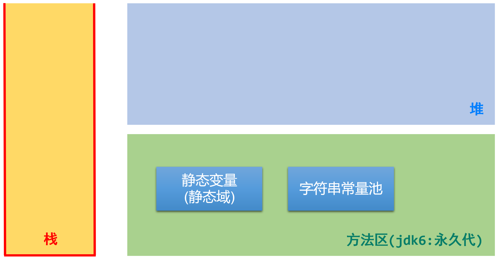
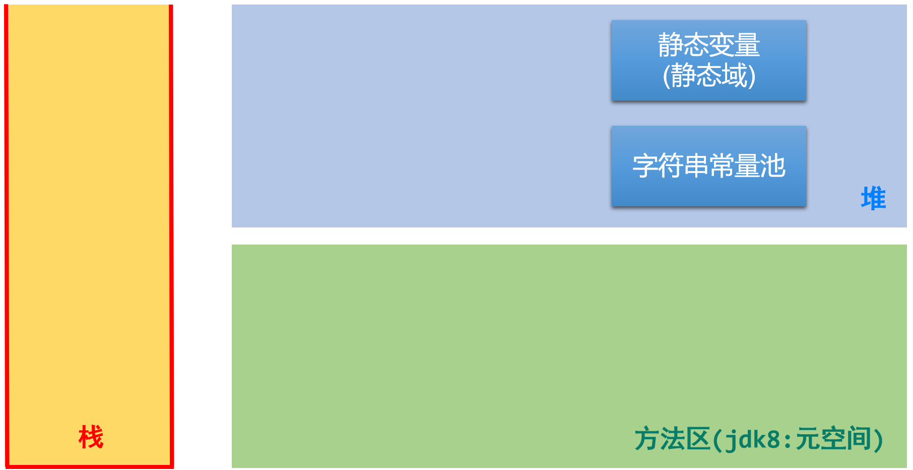
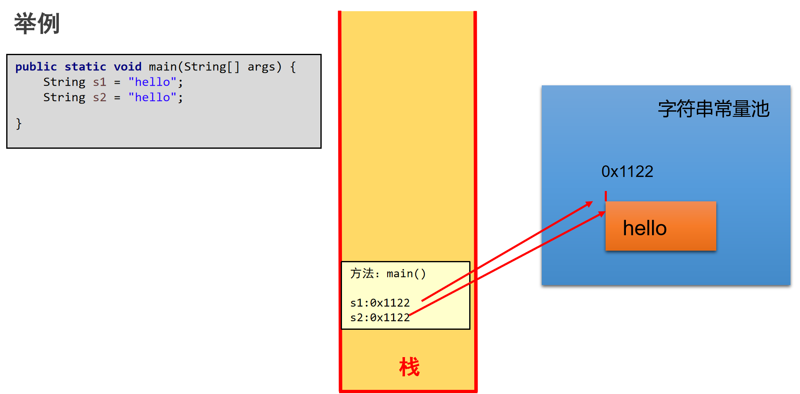
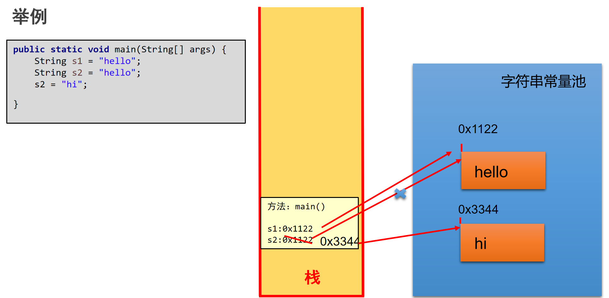
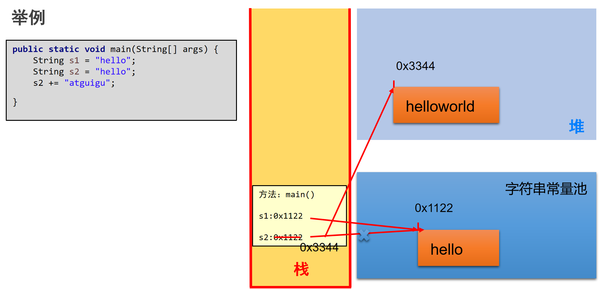
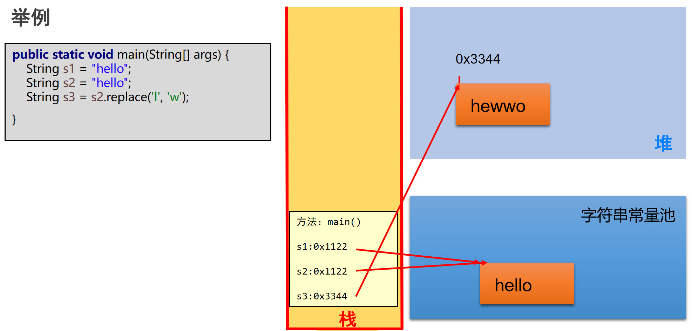
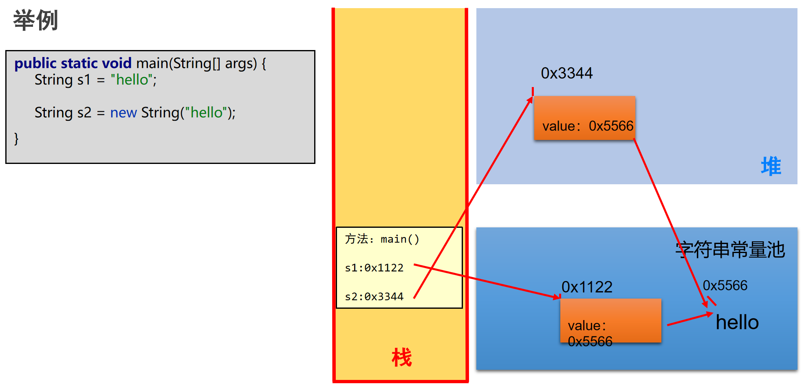

# 第十一章：常用类和基础 API

**目录：**

[TOC]

---

本章专题与脉络：


## 一、字符串相关类之不可变字符序列：`String`

对于 `String` 类的理解，以 JDK 8 为例说明。

### 1.1 `String` 的特性

`java.lang.String` 类代表字符串，Java 程序中所有的字符串文字（例如 `"hello"`）都可以看作是实现此类的实例。

类的声明：
```java
public final class String 
    implements java.io.Serializable, Comparable<String>, CharSequence {
        ...
}
```
* `final`：意味着 `String` 是不可被继承的。
* `Serializable`：可序列化的接口，凡是实现此接口的类的对象就可以通过网络或本地流进行数据的传输。
* `Comparable`：凡是实现此接口的类，其对象都可以比较大小。

内部声明的属性：
* JDK 8 中：
    ```java
    private final char value[]; // 存储字符串数据的容器
    ```
    * `final`：指明此 `value` 数组一旦初始化，其地址就不可变。
* JDK 9 开始 - 为了节省内存空间，做了优化：
    ```java
    private final byte[] value; // 存储字符串数据的容器
    ```

字符串是常量，用双引号引起来表示。它们的值在创建之后不能更改。

字符串 `String` 类型本身是 `final` 声明的，意味着我们不能继承 `String`。

`String` 对象的字符内容是存储在一个字符数组 `value[]` 中的；`"abc"` 等效于 `char[] data = {'h', 'e', 'l', 'l', 'o'}`。

`String` 内存结构：


Java 语言提供对字符串串联符号（`+`）以及将其他对象转换为字符串的特殊支持（`toString()` 方法）。

### 1.2 字符串常量的存储位置

因为字符串对象设计为不可变，那么所以字符串有常量池来保存很多常量对象；因此，字符串常量都存储在字符串常量池（StringTable）中。

字符串常量池不允许存放两个相同的字符串常量。

JDK 7 之前，字符串常量池在方法区；JDK 7 及之后，字符串常量池存放在堆空间。

> 注意：
>
> `String`、静态变量的存储位置演进：
> * jdk 6：
>   
> * jdk 7：
>   
> * jdk 8 及之后：
>   

举例内存结构分配：


示例代码：
```java
/* StringDemo.java */

package com.anxin_hitsz_01.string;

import org.junit.Test;

/**
 * ClassName: StringDemo
 * Package: com.anxin_hitsz_01.string
 * Description:
 *
 * @Author AnXin
 * @Create 2026/2/9 18:10
 * @Version 1.0
 */
public class StringDemo {
    @Test
    public void test1() {
        String s1 = "hello";    // 字面量的定义方式
        String s2 = "hello";

        System.out.println(s1 == s2);   // true
    }
}

```

### 1.3 `String` 的不可变性的理解

当对字符串变量重新赋值时，需要重新指定一个字符串常量的位置进行赋值，不能在原有的位置修改。

当对现有的字符串进行拼接操作时，需要重新开辟空间保存拼接以后的字符串，不能在原有的位置修改。

当调用字符串的 `replace()` 替换现有的某个字符时，需要重新开辟空间保存修改以后的字符串，不能在原有的位置修改。

示例代码：
```java
/* StringDemo.java */

package com.anxin_hitsz_01.string;

import org.junit.Test;

/**
 * ClassName: StringDemo
 * Package: com.anxin_hitsz_01.string
 * Description:
 *
 * @Author AnXin
 * @Create 2026/2/9 18:10
 * @Version 1.0
 */
public class StringDemo {
    @Test
    public void test1() {
        String s1 = "hello";    // 字面量的定义方式
        String s2 = "hello";

        System.out.println(s1 == s2);   // true
    }

    /*
    * String 的不可变性
    *   1. 当对字符串变量重新赋值时，需要重新指定一个字符串常量的位置进行赋值，不能在原有的位置修改
    *   2. 当对现有的字符串进行拼接操作时，需要重新开辟空间保存拼接以后的字符串，不能在原有的位置修改
    *   3. 当调用字符串的 replace() 替换现有的某个字符时，需要重新开辟空间保存修改以后的字符串，不能在原有的位置修改
    * */
    @Test
    public void test2() {
        String s1 = "hello";
        String s2 = "hello";

        s2 = "hi";

        System.out.println(s1); // hello
    }

    @Test
    public void test3() {
        String s1 = "hello";
        String s2 = "hello";

        s2 += "world";

        System.out.println(s1); // hello
        System.out.println(s2); // helloworld
    }

    @Test
    public void test4() {
        String s1 = "hello";
        String s2 = "hello";

        String s3 = s2.replace('l', 'w');

        System.out.println(s1); // hello
        System.out.println(s2); // hello
        System.out.println(s3); // hewwo
    }
}

```

`String` 的内存结构：


`String` 的不可变性举例 1：


`String` 的不可变性举例 2：


`String` 的不可变性举例 3：


### 1.4 `String` 的实例化与连接操作

#### 1.4.1 `String` 实例化的两种方式

第一种方式：
```java
String s1 = "hello";
```

第二种方式：
```java
String s2 = new String("hello");
```

> 注意：
>
> `new` 的方式创建 `String`：
> 

示例代码：
```java
/* StringDemo1.java */

package com.anxin_hitsz_01.string;

import org.junit.Test;

/**
 * ClassName: StringDemo1
 * Package: com.anxin_hitsz_01.string
 * Description:
 *
 * @Author AnXin
 * @Create 2026/2/9 19:17
 * @Version 1.0
 */
public class StringDemo1 {
    @Test
    public void test1() {
        String s1 = "hello";
        String s2 = "hello";

        String s3 = new String("hello");
        String s4 = new String("hello");

        System.out.println(s1 == s2);   // true
        System.out.println(s1 == s3);   // false
        System.out.println(s1 == s4);   // false
        System.out.println(s3 == s4);   // false

        System.out.println(s1.equals(s2));  // true

    }

    /*
    * String s = new String("hello"); 的内存解析？
    *
    * String s = new String("hello"); 在内存中创建了几个对象？
    *
    * */

    @Test
    public void test2() {
        Person p1 = new Person();
        Person p2 = new Person();

        p1.name = "Tom";
        p2.name = "Tom";

        p1.name = "Jerry";

        System.out.println(p2.name);    // Tom

    }

    /*
    * 测试 String 的连接符：+
    * */
    @Test
    public void test3() {
        String s1 = "hello";
        String s2 = "world";

        String s3 = "helloworld";
        String s4 = "hello" + "world";
        String s5 = s1 + "world";   // 通过查看字节码文件，发现调用了 StringBuilder 的 toString() -> new String()
        String s6 = "hello" + s2;
        String s7 = s1 + s2;

        System.out.println(s3 == s4);   // true
        System.out.println(s3 == s5);   // false
        System.out.println(s3 == s6);   // false
        System.out.println(s3 == s7);   // false
        System.out.println(s5 == s6);   // false
        System.out.println(s5 == s7);   // false

        System.out.println();

        String s8 = s5.intern();    // intern()：返回的是字符串常量池中字面量的地址
        System.out.println(s3 == s8);   // true

    }

    @Test
    public void test4() {
        final String s1 = "hello";
        final String s2 = "world";

        String s3 = "helloworld";
        String s4 = "hello" + "world";
        String s5 = s1 + "world";   // 通过查看字节码文件，发现调用了 StringBuilder 的 toString() -> new String()
        String s6 = "hello" + s2;
        String s7 = s1 + s2;

        System.out.println(s3 == s5);   // true
        System.out.println(s3 == s6);   // true
        System.out.println(s3 == s7);   // true

    }

    @Test
    public void test5() {
        String s1 = "hello";
        String s2 = "world";

        String s3 = s1.concat(s2);
        String s4 = "hello".concat("world");
        String s5 = s1.concat("world");

        System.out.println(s3 == s4);   // false
        System.out.println(s3 == s5);   // false
        System.out.println(s4 == s5);   // false

    }
}

class Person {
    String name;

}

```

> 注意：
>
> `String` 内存分析：
> 

> 面试题：
>
> 下述代码：
> ```java
> String s2 = new String("hello");
> ```
> 在内存中创建了多少个对象？
>
> 上述代码在内存中创建了两个对象：一个是堆空间中 `new` 的对象，另一个是在字符串常量池中生成的字面量。

#### 1.4.2 `String` 的连接操作：`+`

情况 1 - `常量 + 常量`：结果仍然存储在字符串常量池中，返回此字面量的地址。

> 注意：此时的常量可能是字面量，也可能是 `final` 修饰的常量。

情况 2 - `常量 + 变量` 或 `变量 + 变量`：都会通过 `new` 的方式创建一个新的字符串，返回堆空间中此字符串对象的地址。

情况 3 - 调用字符串的 `intern()`：返回的是字符串常量池中字面量的地址。

情况 4 - `concat(xxx)`：不管是常量还是变量调用此方法、不管参数是常量还是变量，总之调用完 `concat()` 方法都返回一个新 `new` 的对象。

示例代码：
```java
/* StringDemo1.java */

package com.anxin_hitsz_01.string;

import org.junit.Test;

/**
 * ClassName: StringDemo1
 * Package: com.anxin_hitsz_01.string
 * Description:
 *
 * @Author AnXin
 * @Create 2026/2/9 19:17
 * @Version 1.0
 */
public class StringDemo1 {
    @Test
    public void test1() {
        String s1 = "hello";
        String s2 = "hello";

        String s3 = new String("hello");
        String s4 = new String("hello");

        System.out.println(s1 == s2);   // true
        System.out.println(s1 == s3);   // false
        System.out.println(s1 == s4);   // false
        System.out.println(s3 == s4);   // false

        System.out.println(s1.equals(s2));  // true

    }

    /*
    * String s = new String("hello"); 的内存解析？
    *
    * String s = new String("hello"); 在内存中创建了几个对象？
    *
    * */

    @Test
    public void test2() {
        Person p1 = new Person();
        Person p2 = new Person();

        p1.name = "Tom";
        p2.name = "Tom";

        p1.name = "Jerry";

        System.out.println(p2.name);    // Tom

    }

    /*
    * 测试 String 的连接符：+
    * */
    @Test
    public void test3() {
        String s1 = "hello";
        String s2 = "world";

        String s3 = "helloworld";
        String s4 = "hello" + "world";
        String s5 = s1 + "world";   // 通过查看字节码文件，发现调用了 StringBuilder 的 toString() -> new String()
        String s6 = "hello" + s2;
        String s7 = s1 + s2;

        System.out.println(s3 == s4);   // true
        System.out.println(s3 == s5);   // false
        System.out.println(s3 == s6);   // false
        System.out.println(s3 == s7);   // false
        System.out.println(s5 == s6);   // false
        System.out.println(s5 == s7);   // false

        System.out.println();

        String s8 = s5.intern();    // intern()：返回的是字符串常量池中字面量的地址
        System.out.println(s3 == s8);   // true

    }

    @Test
    public void test4() {
        final String s1 = "hello";
        final String s2 = "world";

        String s3 = "helloworld";
        String s4 = "hello" + "world";
        String s5 = s1 + "world";   // 通过查看字节码文件，发现调用了 StringBuilder 的 toString() -> new String()
        String s6 = "hello" + s2;
        String s7 = s1 + s2;

        System.out.println(s3 == s5);   // true
        System.out.println(s3 == s6);   // true
        System.out.println(s3 == s7);   // true

    }

    @Test
    public void test5() {
        String s1 = "hello";
        String s2 = "world";

        String s3 = s1.concat(s2);
        String s4 = "hello".concat("world");
        String s5 = s1.concat("world");

        System.out.println(s3 == s4);   // false
        System.out.println(s3 == s5);   // false
        System.out.println(s4 == s5);   // false

    }
}

class Person {
    String name;

}

```

### 1.5 `String` 的常用 API - 1

#### 1.5.1 构造器

`public String()`：初始化新创建的 `String` 对象，以使其表示空字符序列。

`public String(String original)`：初始化一个新创建的 `String` 对象，使其表示一个与参数相同的字符序列；换句话说，新创建的字符串是该参数字符串的副本。

`public String(char[] value)`：通过当前参数中的字符数组来构造新的 `String`。

`public String(char[] value, int offset, int count)`：通过字符数组的一部分来构造新的 `String`。

`public String(byte[] bytes)`：通过使用平台的**默认字符集**解码当前参数中的字节数组来构造新的 `String`。

`public String(byte[] bytes, String charsetName)`：通过使用指定的字符集解码当前参数中的字节数组来构造新的 `String`。

示例代码：
```java
/* StringMethodTest.java */

package com.anxin_hitsz_01.string;

import org.junit.Test;

/**
 * ClassName: StringMethodTest
 * Package: com.anxin_hitsz_01.string
 * Description:
 *
 * @Author AnXin
 * @Create 2026/2/9 20:52
 * @Version 1.0
 */
public class StringMethodTest {
    /*
    * String 构造器的使用
    * */
    @Test
    public void test1() {
        String s1 = new String();
        String s2 = new String("");

        String s3 = new String(new char[] { 'a', 'b', 'c' });
        System.out.println(s3);
    }

}

```

#### 1.5.2 `String` 与其他结构间的转换

##### 1.5.2.1 字符串与基本数据类型、包装类

**字符串 -> 基本数据类型、包装类：**

`Integer` 包装类的 `public static int parseInt(String s)`：可以将由“数字”字符组成的字符串转换为整型。

类似地，使用 java.lang 包中的 `Byte`、`Short`、`Long`、`Float`、`Double` 类调相应的类方法可以将由“数字”字符组成的字符串转化为相应的基本数据类型。

**基本数据类型、包装类 -> 字符串：**

调用 `String` 类的 `public String valueOf(int n)` 可将 `int` 型转换为字符串。

相应的 `valueOf(byte b)`、`valueOf(long l)`、`valueOf(float f)`、`valueOf(double d)`、`valueOf(boolean b)` 可实现由参数的相应类型到字符串的转换。

##### 1.5.2.2 字符数组与字符串

**字符数组 -> 字符串：**

`String` 类的构造器 `String(char[])` 和 `String(char[], int offset, int length)` 分别用字符数组中的全部字符和部分字符创建字符串对象。

**字符串 -> 字符数组：**

`public char[] toCharArray()`：将字符串中的全部字符存放在一个字符数组中。

`public void getChars(int srcBegin, int srcEnd, char[] dst, int dstBegin)`：将指定索引范围内的字符串存放到数组中。

##### 1.5.2.3 字符串与字节数组

**字符串 -> 字节数组（编码）：**

`public byte[] getBytes()`：使用平台的默认字符集将此 `String` 编码为 `byte` 序列，并将结果存储到一个新的 `byte` 数组中。

`public byte[] getBytes(String charsetName)`：使用指定的字符集将此 `String` 编码到 `byte` 序列，并将结果存储到新的 `byte` 数组。

**字节数组 -> 字符串（解码）：**

`String(byte[])`：通过使用平台的默认字符集解码指定的 `byte` 数组，构造一个新的 `String`。

`String(byte[], int offset, int length)`：用指定的字节数组的一部分（即从数组起始位置 `offset` 开始取 `length` 个字节）构造一个字符串对象。

`String(byte[], String charsetName)` 或 `new String(byte[], int, int, String charsetName)`：解码，按照指定的编码方式进行解码。

##### 1.5.2.4 举例

示例代码：
```java
/* StringMethodTest.java */

package com.anxin_hitsz_01.string;

import org.junit.Test;

import java.io.UnsupportedEncodingException;

/**
 * ClassName: StringMethodTest
 * Package: com.anxin_hitsz_01.string
 * Description:
 *
 * @Author AnXin
 * @Create 2026/2/9 20:52
 * @Version 1.0
 */
public class StringMethodTest {
    /*
    * String 构造器的使用
    * */
    @Test
    public void test1() {
        String s1 = new String();
        String s2 = new String("");

        String s3 = new String(new char[] { 'a', 'b', 'c' });
        System.out.println(s3);
    }

    /*
    * String 与常见的其它结构之间的转换
    *
    * 1. String 与基本数据类型、包装类之间的转换（复习）
    *
    * 2. String 与 char[] 之间的转换
    *
    * 3. String 与 byte[] 之间的转换（难度）
    *
    * */
    @Test
    public void test2() {
        int num = 10;
        // 基本数据类型 -> String
        // 方式 1：
        String s1 = num + "";
        // 方式 2：
        String s2 = String.valueOf(num);

        // String -> 基本数据类型：调用包装类的 parseXxx(String str)
        String s3 = "123";
        int i1 = Integer.parseInt(s3);

    }

    // String 与 char[] 之间的转换
    @Test
    public void test3() {
        String str = "hello";
        // String -> char[]：调用 String 的 toCharArray()
        char[] arr = str.toCharArray();
        for (int i = 0; i < arr.length; i++) {
            System.out.println(arr[i]);
        }

        // char[] -> String：调用 String 的构造器
        String str1 = new String(arr);
        System.out.println(str1);   // hello

    }

    // String 与 byte[] 之间的转换（难度）
    /*
    * 在 utf-8 字符集中，一个汉字占用 3 个字节，一个字母占用 1 个字节
    * 在 gbk 字符集中，一个汉字占用 2 个字节，一个字母占用 1 个字节
    *
    * utf-8 或 gbk 都向下兼容了 ascii 码
    *
    * 编码与解码：
    *   编码：String -> 字节或字节数组
    *   解码：字节或字节数组 -> String
    * 要求：解码时使用的字符集必须与编码时使用的字符集一致！不一致，就会乱码。
    *
    * */
    @Test
    public void test4() throws UnsupportedEncodingException {
        String str = new String("abc中国");

        // String -> byte[]：调用 String 的 getBytes()
        byte[] arr = str.getBytes();    // 使用默认的字符集：utf-8
        for (int i = 0; i < arr.length; i++) {
            System.out.println(arr[i]);
        }

        System.out.println();

        // getBytes(String charsetName)：使用指定的字符集
        byte[] arr1 = str.getBytes("gbk");
        for (int i = 0; i < arr1.length; i++) {
            System.out.println(arr1[i]);
        }

        // byte[] -> String：
        String str1 = new String(arr);  // 使用默认的字符集：utf-8
        System.out.println(str1);

        String str2 = new String(arr, "utf-8"); // 显式地指明解码的字符集：utf-8
        System.out.println(str2);

        // 乱码
//        String str3 = new String(arr, "gbk"); // 显式地指明解码的字符集：gbk
//        System.out.println(str3);

        String str4 = new String(arr1, "gbk");
        System.out.println(str4);

    }

}

```

### 1.6 `String` 的常用 API - 2

`String` 类包括的方法可用于检查序列的单个字符、比较字符串、搜索字符串、提取子字符串、创建字符串副本并将所有字符全部转换为大写或小写。

#### 1.6.1 系列 1：常用方法

`boolean isEmpty()`：字符串是否为空。

`int length()`：返回字符串的长度。

`String concat(xx)`：拼接。

`boolean equals(Object obj)`：比较字符串是否相等，区分大小写。

`boolean equalsIgnoreCase(Object obj)`：比较字符串是否相等，不区分大小写。

`int compareTo(String other)`：比较字符串大小，区分大小写，按照 Unicode 编码值比较大小。

`int compareToIgnoreCase(String other)`：比较字符串大小，不区分大小写。

`String toLowerCase()`：将字符串中大写字母转为小写。

`String toUpperCase()`：将字符串中小写字母转为大写。

`String trim()`：去掉字符串前后空白符。

`public String intern()`：结果在常量池中共享。

#### 1.6.2 系列 2：查找

`boolean contains(xx)`：是否包含 `xx`。

`int indexOf(xx)`：从前往后找当前字符串中 `xx`；即如果有则返回第一次出现的下标，如果没有则返回 `-1`。

`int indexOf(String str, int fromIndex)`：返回指定子字符串在此字符串中第一次出现处的索引，从指定的索引开始。

`int lastIndexOf(xx)`：从后往前找当前字符串中 `xx`；即如果有则返回最后一次出现的下标，如果没有则返回 `-1`。

`int lastIndexOf(String str, int fromIndex)`：返回指定子字符串在此字符串中最后一次出现处的索引，从指定的索引开始反向搜索。

#### 1.6.3 系列 3：字符串截取

`String substring(int beginIndex)`：返回一个新的字符串，它是此字符串的从 `beginIndex` 开始截取到最后的一个子字符串。

`String substring(int beginIndex, int endIndex)`：返回一个新字符串，它是此字符串从 `beginIndex` 开始截取到 `endIndex`（不包含）的一个子字符串。

#### 1.6.4 系列 4：和字符 / 字符数组相关

`char charAt(index)`：返回 `[index]` 位置的字符。

`char[] toCharArray()`：将此字符串转换为一个新的字符数组返回。

`static String valueOf(char[] data)`：返回指定数组中表示该字符序列的 `String`。

`static String valueOf(char[] data, int offset, int count)`：返回指定数组中表示该字符序列的 `String`。

`static String copyValueOf(char[] data)`：返回指定数组中表示该字符序列的 `String`。

`static String copyValueOf(char[] data, int offset, int count)`：返回指定数组中表示该字符序列的 `String`。

#### 1.6.5 系列 5：开头与结尾

`boolean startsWith(xx)`：测试此字符串是否以指定的前缀开始。

`boolean startsWith(String prefix, int toffset)`：测试此字符串从指定索引开始的子字符串是否以指定前缀开始。

`boolean endsWith(xx)`：测试此字符串是否以指定的后缀结束。

#### 1.6.6 系列 6：替换

`String replace(char oldChar, char newChar)`：返回一个新的字符串，它是通过用 `newChar` 替换此字符串中出现的所有 `oldChar` 得到的；不支持正则。

`String replace(CharSequence target, CharSequence replacement)`：使用指定的字面值替换序列替换此字符串所有匹配字面值目标序列的子字符串。

`String replaceAll(String regex, String replacement)`：使用给定的 `replacement` 替换此字符串所有匹配给定的正则表达式的子字符串。

`String replaceFirst(String regex, String replacement)`：使用给定的 `replacement` 替换此字符串匹配给定的正则表达式的第一个子字符串。

#### 1.6.7 举例

示例代码：
```java
/* StringMethodTest1.java */

package com.anxin_hitsz_01.string;

import org.junit.Test;

/**
 * ClassName: StringMethodTest1
 * Package: com.anxin_hitsz_01.string
 * Description:
 *
 * @Author AnXin
 * @Create 2026/2/9 21:17
 * @Version 1.0
 */
public class StringMethodTest1 {

    /*
    * 系列 1：常用方法
    * */

    @Test
    public void test1() {
        String s1 = "";
        String s2 = new String();
        String s3 = new String("");

        System.out.println(s1.isEmpty());
        System.out.println(s2.isEmpty());
        System.out.println(s3.isEmpty());

        String s4 = null;
        System.out.println(s4.isEmpty());   // 报空指针异常

        String s5 = "hello";
        System.out.println(s5.length());    // 5

    }

    @Test
    public void test2() {
        String s1 = "hello";
        String s2 = "HellO";
        System.out.println(s1.equals(s2));
        System.out.println(s1.equalsIgnoreCase(s2));

        String s3 = "abcd";
        String s4 = "adef";
        System.out.println(s3.compareTo(s4));

        String s5 = "abcd";
        String s6 = "aBcd";
        System.out.println(s5.compareTo(s6));
        System.out.println(s5.compareToIgnoreCase(s6));

        String s7 = "张ab";
        String s8 = "李cd";
        System.out.println(s7.compareTo(s8));

        String s9 = " he  llo   ";
        System.out.println("*****" + s9.trim() + "*****");

    }

    /*
    * 系列 2：查找
    * */

    @Test
    public void test3() {
        String s1 = "教育尚硅谷教育";
        System.out.println(s1.contains("硅谷"));

        System.out.println(s1.indexOf("教育"));
        System.out.println(s1.indexOf("教育", 1));

        System.out.println(s1.lastIndexOf("教育"));
        System.out.println(s1.lastIndexOf("教育", 4));

    }

    /*
    * 系列 3：字符串截取
    * */

    @Test
    public void test4() {
        String s1 = "教育尚硅谷教育";
        System.out.println(s1.substring(2));
        System.out.println(s1.substring(2, 5)); // [2, 5)

    }

    /*
    * 系列 4：和字符 / 字符数组相关
    *
    * 系列 5：开头与结尾
    * */

    @Test
    public void test5() {
        String s1 = "教育尚硅谷教育";
        System.out.println(s1.charAt(2));

        String s2 = String.valueOf(new char[] { 'a', 'b', 'c' });
        String s3 = String.copyValueOf(new char[] { 'a', 'b', 'c' });
        System.out.println(s2);
        System.out.println(s3);
        System.out.println(s2 == s3);

        System.out.println(s1.startsWith("教育a"));
        System.out.println(s1.startsWith("教育", 5));

    }

    /*
    * 系列 6：替换
    * */

    @Test
    public void test6() {
        String s1 = "hello";
        String s2 = s1.replace('l', 'w');
        System.out.println(s1);
        System.out.println(s2);

        String s3 = s1.replace("ll", "wwww");
        System.out.println(s3);

    }

}

```

### 1.7 练习

**练习 1：**
> 题目 - 算法练习：
>
> **1.** 模拟一个 `trim` 方法，去除字符串两端的空格。
> 
> **2.** 将一个字符串进行反转，将字符串中指定部分进行反转。比如将 “`abcdefg`” 反转为 “`abfedcg`”。
>
> **3.** 获取一个字符串在另一个字符串中出现的次数。比如，获取 “`ab`” 在 “`abkkcadkabkebfkabkskab`” 中出现的次数。
>
> **4.** 获取两个字符串中最大相同字串。比如：
>   ```java
>   str1 = "abcwerthelloyuiodef";
>   str2 = "cvhellobnm";
>   ```
> 提示：将短的那个串进行长度依次递减的字串与较长的串比较。
>
> **5.** 对字符串中字符进行自然顺序排序。
> 提示：
> 1. 字符串变成字符数组。
> 2. 对数组排序，选择，冒泡，`Arrays.sort()`。
> 3. 将排序后的数组变成字符串。

示例代码：
```java
/* StringTest.java */

package com.anxin_hitsz_01.string.exer1;

import org.junit.Test;

/**
 * ClassName: StringTest
 * Package: com.anxin_hitsz_01.string.exer1
 * Description:
 *
 * @Author AnXin
 * @Create 2026/2/10 14:54
 * @Version 1.0
 */
public class StringTest {

    /*
    * 题目 2：
    * */

    @Test
    public void test() {
        String s = "abcdefg";
        String s1 = reverse(s, 2, 5);
        String s2 = reverse1(s, 2, 5);
        System.out.println(s1);
        System.out.println(s2);

    }

    /*
    * 方式 1：将 String 转为 char[]，针对 char[] 进行相应位置的反转，反转以后将 char[] 转为 String
    * */
    public String reverse(String str, int fromIndex, int toIndex) {
        //
        char[] arr = str.toCharArray();

        //
        for (int i = fromIndex, j = toIndex; i < j; i++, j--) {
            char temp = arr[i];
            arr[i] = arr[j];
            arr[j] = temp;
        }

        //
        return new String(arr);

    }

    /*
    * 方式 2：将 str 分为三部分，将第 1 部分、第 2 部分的反转、第 3 部分依次拼接
    * */
    public String reverse1(String str, int fromIndex, int toIndex) {
        // 获取 str 的第 1 部分
        String finalStr = str.substring(0, fromIndex);  // ab

        // 拼接上第 2 部分
        for (int i = toIndex; i >= fromIndex; i--) {
            finalStr += str.charAt(i);
        }   // abfedc

        // 拼接上第 3 部分
        finalStr = finalStr + str.substring(toIndex + 1);

        return finalStr;

    }

    /*
    * 题目 3：
    * */

    /**
     * 判断 subStr 在 str 中出现的次数
     * @param str
     * @param subStr
     * @return 返回次数
     */
    public int getSubStringCount(String str, String subStr) {
        int count = 0;  // 记录出现的次数

        if (str.length() >= subStr.length()) {
            int index = str.indexOf(subStr);
            while (index >= 0) {
                count++;
                index = str.indexOf(subStr, index + subStr.length());
            }
        }

        return count;
    }

    @Test
    public void test2() {
        String subStr = "ab";
        String str = "abkkcadkabkebfkabkskab";

        int count = getSubStringCount(str, subStr);
        System.out.println(count);

    }

}

```

**练习 2：**
> 题目 - 模拟用户登录：
>
> 1. 定义用户类，属性为用户名和密码，提供相关的 `getter` 和 `setter` 方法、构造器、`toString()`。
> 2. 使用数组存储多个用户对象。
> 3. 录入用户和密码，对比用户信息；匹配成功则登录成功，否则登录失败。
>   * 登录失败时，当用户名错误，提示没有该用户。
>   * 登录失败时，当密码错误时，提示密码有误。

示例代码：
```java
/* User.java */

package com.anxin_hitsz_01.string.exer2;

/**
 * ClassName: User
 * Package: com.anxin_hitsz_01.string.exer2
 * Description:
 *
 * @Author AnXin
 * @Create 2026/2/10 15:23
 * @Version 1.0
 */
public class User {
    private String name;
    private String password;    // 密码

    public User() {
    }

    public User(String name, String password) {
        this.name = name;
        this.password = password;
    }

    public String getName() {
        return name;
    }

    public void setName(String name) {
        this.name = name;
    }

    public String getPassword() {
        return password;
    }

    public void setPassword(String password) {
        this.password = password;
    }

    @Override
    public String toString() {
        return name + "-" + password;
    }

}


/* UserTest.java */

package com.anxin_hitsz_01.string.exer2;

import java.util.Scanner;

/**
 * ClassName: UserTest
 * Package: com.anxin_hitsz_01.string.exer2
 * Description:
 *
 * @Author AnXin
 * @Create 2026/2/10 15:24
 * @Version 1.0
 */
public class UserTest {
    public static void main(String[] args) {

        // 1. 创建数组，并初始化几个 User 对象
        User[] arr = new User[3];
        arr[0] = new User("Tom", "8888");
        arr[1] = new User("Bob", "123");
        arr[2] = new User("Jerry", "6666");

        System.out.println("库中的用户有：");
        for (int i = 0; i < arr.length; i++) {
            System.out.println(arr[i]);
        }


        // 2. 实例化 Scanner，获取输入的用户名和密码
        Scanner scan = new Scanner(System.in);
        System.out.print("请输入用户名：");
        String userName = scan.next();
        System.out.print("请输入密码：");
        String password = scan.next();

        // 3. 遍历数组元素，匹配用户名和密码
        boolean isFlag = true;
        for (int i = 0; i < arr.length; i++) {
            if (arr[i].getName().equals(userName)) {    // 存在此用户名
                isFlag = false;
                if (arr[i].getPassword().equals(password)) {
                    System.out.println("登录成功，" + userName);
                } else {
                    System.out.println("密码有误");
                }
                break;
            }
        }
        if (isFlag) {
            System.out.println("没有该用户");
        }


        scan.close();

    }
}

```

## 二、字符串相关类之可变字符序列：`StringBuffer`、`StringBuilder`

因为 `String` 对象是不可变对象，虽然可以共享常量对象，但是对于字符串频繁的修改和拼接操作效率较低，空间消耗也比较高。因此，JDK 又在 java.lang 包提供了可变字符序列 `StringBuffer` 和 `StringBuilder` 类型。

### 2.1 `StringBuffer` 与 `StringBuilder` 的理解

`java.lang.StringBuffer` 代表**可变的字符序列**；JDK 1.0 中声明，可以对字符串内容进行增删，此时不会产生新的对象。


继承结构：


`AbstractStringBuilder` 声明：


针对于 `StringBuilder` 而言，其内部的属性有：
* `char[] value`：存储字符序列。
* `int count`：实际存储的字符的个数。

针对于 `StringBuilder`：
```java
StringBuilder sBuffer1 = new StringBuilder();   // char[] value = new char[16];
StringBuilder sBuffer1 = new StringBuilder("abc");   // char[] value = new char[16 + "abc".length()];

sBuffer1.append("ac");  // value[0] = 'a';  value[1] = 'c';
sBuffer1.append("b");   // value[2] = 'b';

... // 不断地添加 ……

```
在添加的过程中，一旦 `count` 要超过 `value.length` 时，就需要扩容；默认扩容为 $原有容量的 2 倍 + 2$，并将原有 `value` 数组中的元素复制到新的数组中。

> 源码启示：
> * 如果开发中需要频繁地针对于字符串进行增、删、改等操作，建议使用 `StringBuffer` 或 `StringBuilder` 替换 `String`。
> * 如果开发中，不涉及到线程安全问题，建议使用 `StringBuilder` 替换 `StringBuffer`，因为使用 `StringBuilder` 效率高。
> * 如果开发中大体确定要操作的字符的个数，建议使用带 `int capacity` 参数的构造器，因为可以避免底层多次扩容操作，性能更高。

`StringBuilder` 和 `StringBuffer` 非常类似，均代表可变的字符序列，而且提供相关功能的方法也一样。

区分 `String`、`StringBuffer`、`StringBuilder`：
* `String`：不可变的字符序列；JDK 8.0 及之前底层使用 `char[]` 数组存储，JDK 9 及之后底层使用 `byte[]` 数组存储。
* `StringBuffer`：可变的字符序列；JDK 1.0 声明，线程安全（方法有 `synchronized` 修饰），效率低，JDK 8.0 及之前底层使用 `char[]` 数组存储，JDK 9 及之后底层使用 `byte[]` 数组存储。
* `StringBuilder`：可变的字符序列；JDK 5.0 声明，线程不安全，效率高，JDK 8.0 及之前底层使用 `char[]` 数组存储，JDK 9 及之后底层使用 `byte[]` 数组存储。

对比三者的执行效率，效率从高到低排列：`StringBuilder` > `StringBuffer` > `String`。

### 2.2 `StringBuilder`、`StringBuffer` 的 API

`StringBuilder`、`StringBuffer` 的 API 是完全一致的，并且很多方法与 `String` 相同。

#### 2.2.1 常用 API

`StringBuffer append(xx)`：提供了很多的 `append()` 方法，用于进行字符串追加的方式拼接。

`StringBuffer delete(int start, int end)`：删除 `[start, end)` 之间字符。

`StringBuffer deleteCharAt(int index)`：删除 `[index]` 位置字符。

`StringBuffer replace(int start, int end, String str)`：替换 `[start, end)` 范围的字符序列为 `str`。

`void setCharAt(int index, char c)`：替换 `[index]` 位置字符。

`char charAt(int index)`：查找指定 `index` 位置上的字符。

`StringBuffer insert(int index, xx)`：在 `[index]` 位置插入 `xx`。

`int length()`：返回存储的字符数据的长度。

`StringBuffer reverse()`：反转。

> 注意：
> * 当 `append` 和 `insert` 时，如果原来 `value` 数组长度不够，可扩容。
> * 如上 `StringBuffer append(xx)`、`StringBuffer delete(int start, int end)`、`StringBuffer deleteCharAt(int index)`、`StringBuffer replace(int start, int end, String str)`、`StringBuffer reverse()` 方法支持**方法链操作**；原理：
>   

#### 2.2.2 其它 API

`int indexOf(String str)`：在当前字符序列中查询 `str` 的第一次出现下标。

`int indexOf(String str, int fromIndex)`：在当前字符序列 `[fromIndex, 最后]` 中查询 `str` 的第一次出现下标。

`int lastIndexOf(String str)`：在当前字符序列中查询 `str` 的最后一次出现下标。

`int lastIndexOf(String str, int fromIndex)`：在当前字符序列 `[fromIndex, 最后]` 中查询 `str` 的最后一次出现下标。

`String substring(int start)`：截取当前字符序列 `[start, 最后]`。

`String substring(int start, int end)`：截取当前字符序列 `[start, end)`。

`String toString()`：返回此序列中数据的字符串表示形式。

`void setLength(int newLength)`：设置当前字符序列长度为 `newLength`。

#### 2.2.3 举例

示例代码：
```java
/* StringBufferBuilderTest.java */

package com.anxin_hitsz_02.stringmore;

import org.junit.Test;

/**
 * ClassName: StringBufferBuilderTest
 * Package: com.anxin_hitsz_02.stringmore
 * Description:
 *
 * @Author AnXin
 * @Create 2026/2/10 17:02
 * @Version 1.0
 */
public class StringBufferBuilderTest {

    /*
    * 常用 API
    * */

    @Test
    public void test1() {
        StringBuilder sBuilder = new StringBuilder();
        sBuilder.append("abc").append("123").append("def"); // 方法链的调用
        System.out.println(sBuilder);

    }

    @Test
    public void test2() {
        StringBuilder sBuilder = new StringBuilder("hello");
        sBuilder.insert(2, 1);
        sBuilder.insert(2, "abc");
        System.out.println(sBuilder);

        StringBuilder sBuilder1 = sBuilder.reverse();

        System.out.println(sBuilder);
        System.out.println(sBuilder1);

        System.out.println(sBuilder == sBuilder1);

        System.out.println(sBuilder.length());  // 实际存储的字符的个数

    }

    /*
    * 其它 API
    * */

    @Test
    public void test3() {
        StringBuilder sBuilder = new StringBuilder("hello");
        sBuilder.setLength(2);

        System.out.println(sBuilder);

        sBuilder.append("c");
        System.out.println(sBuilder);

        sBuilder.setLength(10);
        System.out.println(sBuilder);
        System.out.println(sBuilder.charAt(6) == 0);    // true

    }

    /*
    * 测试 String、StringBuffer、StringBuilder 在操作数据方面的效率
    * */
    @Test
    public void test4() {
        //初始设置
        long startTime = 0L;
        long endTime = 0L;


        String text = "";
        StringBuffer buffer = new StringBuffer("");
        StringBuilder builder = new StringBuilder("");

        //开始对比
        startTime = System.currentTimeMillis();
        for (int i = 0; i < 20000; i++) {
            buffer.append(String.valueOf(i));
        }
        endTime = System.currentTimeMillis();
        System.out.println("StringBuffer的执行时间：" + (endTime - startTime));

        startTime = System.currentTimeMillis();
        for (int i = 0; i < 20000; i++) {
            builder.append(String.valueOf(i));
        }
        endTime = System.currentTimeMillis();
        System.out.println("StringBuilder的执行时间：" + (endTime - startTime));

        startTime = System.currentTimeMillis();
        for (int i = 0; i < 20000; i++) {
            text = text + i;
        }
        endTime = System.currentTimeMillis();
        System.out.println("String的执行时间：" + (endTime - startTime));
    }

}

```

## 三、日期与时间 API

### 3.1 JDK 8 之前

#### 3.1.1 `java.lang.System` 类的方法

`System` 类提供的 `public static long currentTimeMillis()` 用来返回当前时间与 1970 年 1 月 1 日 0 时 0 分 0 秒之间以毫秒为单位的时间差。
* 获取当前时间对应的毫秒数，`long` 类型，即时间戳。
* 此方法适于计算时间差。

> 注意：
>
> 计算世界时间的主要标准有：
> * UTC（Coordinated Universal Time）；
> * GMT（Greenwich Mean Time）；
> * CST（Central Standard Time）。
>
> 在国际无线电通信场合，为了统一起见，使用一个统一的时间，称为通用协调时（UTC，Universal Time Coordinated）。UTC 与格林尼治平均时（GMT，Greenwich Mean Time）一样，都与英国伦敦的本地时相同。这里，UTC 与 GMT 含义完全相同。

#### 3.1.2 `java.util.Date`

表示特定的瞬间，精确到毫秒。

构造器：
* `Date()`：使用无参构造器创建的对象可以获取本地当前时间。
* `Date(long 毫秒数)`：把该毫秒值换算成日期时间对象。

常用方法：
* `getTime()`：返回自 1970 年 1 月 1 日 00:00:00 GMT 以来此 Date 对象表示的毫秒数。
* `toString()`：把此 `Date` 对象转换为以下形式的 `String`：`dow mon dd hh:mm:ss zzz yyyy`；其中，`dow` 是一周中的某一天（Sun、Mon、Tue、Wed、Thu、Fri、Sat），`zzz` 是时间标准。
* 其它很多方法都过时了。

#### 3.1.3 `java.text.SimpleDateFormat`

`java.text.SimpleDateFormat` 类是一个不与语言环境有关的方式来格式化和解析日期的具体类。

可以进行格式化：日期 -> 文本。

可以进行解析：文本 -> 日期。

构造器：
* `SimpleDateFormat()`：默认的模式和语言环境创建对象。
* `public SimpleDateFormat(String pattern)`：该构造方法可以用参数 `pattern` 指定的格式创建一个对象。

格式化：
* `public String format(Date date)`：方法格式化时间对象 `date`。

解析：
* `public Date parse(String source)`：从给定字符串的开始解析文本，以生成一个日期。

格式化常用字段：


#### 3.1.4 `java.util.Calendar`（日历）

`Date` 类的 API 大部分被废弃了，替换为 `Calendar`。

`Calendar` 类是一个抽象类，主要用于完成日期字段之间相互操作的功能。

获取 `Calendar` 实例的方法：
* 使用 `Calendar.getInstance()` 方法：
     方法")
* 调用它的子类 `GregorianCalendar`（公历）的构造器：
    

一个 `Calendar` 的实例时系统时间的抽象表示，可以修改或获取 `YEAR`、`MONTH`、`DAY_OF_WEEK`、`HOUR_OF_DAY`、`MINUTE、SECOND` 等**日历字段**对应的时间值。
* `public int get(int field)`：返回给定日历字段的值。
* `public void set(int field, int value)`：将给定的日历字段设置为指定的值。
* `public void add(int field, int amount)`：根据日历的规则，为给定的日历字段添加或者减去指定的时间量。
* `public final Date getTime()`：将 `Calendar` 转成 `Date` 对象。
* `public final void setTime(Date date)`：使用指定的 `Date` 对象重置 `Calendar` 的时间。

常用字段：


> 注意：
> * 获取月份时：一月是 `0`，二月是 `1`，……，以此类推，十二月是 `11`。
> * 获取星期时，周日是 `1`，周二是 `2`，……，以此类推，周六是 `7`。

#### 3.1.5 举例

示例代码：
```java
/* DateTimeTest.java */

package com.anxin_hitsz_03.date.before8;

import org.junit.Test;

import java.text.ParseException;
import java.text.SimpleDateFormat;
import java.util.Calendar;
import java.util.Date;

/**
 * ClassName: DateTimeTest
 * Package: com.anxin_hitsz_03.date.before8
 * Description:
 *
 * @Author AnXin
 * @Create 2026/2/10 18:13
 * @Version 1.0
 */
public class DateTimeTest {

    /*
    * Date 类的使用
    *
    * |-- java.util.Date
    *   > 两个构造器的使用
    *   > 两个方法的使用：1. toString() 2. long getTime()
    *       |----java.sql.Date：对应着数据库中的 date 类型
    *
    * */
    @Test
    public void test1() {
        Date date1 = new Date();    // 创建一个基于当前系统时间的 Date 的实例
        System.out.println(date1.toString());   // Tue Feb 10 18:22:34 CST 2026

        long milliTimes = date1.getTime();
        System.out.println("对应的毫秒数为：" + milliTimes);    // 1770718580726

        Date date2 = new Date(1370708580726L);  // 创建一个基于指定时间戳的 Date 的实例
        System.out.println(date2.toString());

    }
    @Test
    public void test2() {
        java.sql.Date date1 = new java.sql.Date(1370708580726L);
        System.out.println(date1.toString());   // 2013-06-09

        System.out.println(date1.getTime());    // 1370708580726

    }

    /*
    * SimpleDateFormat 类：用于日期时间的格式化和解析
    *
    * 格式化：日期 -> 字符串
    * 解析：字符串 -> 日期
    *
    * */
    @Test
    public void test3() throws ParseException {
        SimpleDateFormat sdf = new SimpleDateFormat();
        // 格式化：日期 -> 字符串
        Date date1 = new Date();
        String strDate = sdf.format(date1);
        System.out.println(strDate);    // 2026/2/10 18:26

        // 字符串 -> 日期
        Date date2 = sdf.parse("2026/2/10 15:26");
        System.out.println(date2);

    }
    @Test
    public void test4() throws ParseException {
        SimpleDateFormat sdf = new SimpleDateFormat("EEE, d MMM yyyy HH:mm:ss Z");
        sdf = new SimpleDateFormat("yyyy-MM-dd HH:mm:ss");
        // 格式化：日期 -> 字符串
        Date date1 = new Date();
        String strDate = sdf.format(date1);
        System.out.println(strDate);    // 2026-02-10 18:32:40

        // 解析：字符串 -> 日期
        Date date2 = sdf.parse("2026-02-10 18:32:40");
        System.out.println(date2);

        // 解析失败，因为参数的字符串不满足 SimpleDateFormat 可以识别的格式
//        Date date3 = sdf.parse("2026/2/10 18:26");
//        System.out.println(date3);

    }

    /*
    * Calendar：日历类
    *   1. 实例化：由于 Calendar 是一个抽象类，所以我们需要创建其子类的实例；这里我们通过 Calendar 的静态方法
    *             getInstance() 即可获取
    *   2. 常用方法：get(int field) / set(int field, xx) / add(int field, xx) / getTime() / setTime()
    * */
    @Test
    public void test5() {
        Calendar calendar = Calendar.getInstance();

//        System.out.println(calendar.getClass());

        // 测试方法
        // get(int field)
        System.out.println(calendar.get(Calendar.DAY_OF_MONTH));
        System.out.println(calendar.get(Calendar.DAY_OF_YEAR));

        // set(int field, xx)
        calendar.set(Calendar.DAY_OF_MONTH, 23);
        System.out.println(calendar.get(Calendar.DAY_OF_MONTH));

        // add(int field, xx)
        calendar.add(Calendar.DAY_OF_MONTH, 3);
        calendar.add(Calendar.DAY_OF_MONTH, -5);
        System.out.println(calendar.get(Calendar.DAY_OF_MONTH));

        // getTime()：Calendar -> Date
        Date date = calendar.getTime();
        System.out.println(date);

        // setTime()：使用指定的 Date 重置 Calendar
        Date date1 = new Date();
        calendar.setTime(date1);
        System.out.println(calendar.get(Calendar.DAY_OF_MONTH));

    }
}

```

#### 3.1.6 练习

**练习：**
> 题目：
>
> 如何将一个 `java.util.Date` 的实例转换为 `java.sql.Date` 的实例？
>
> 拓展：将控制台获取的年月日（比如：`2026-02-10`）的字符串数据，保存在数据库中。（简化为得到 `java.sql.Date` 的对象，此对象对应的时间为 `2026-02-10`。）

示例代码：
```java
/* Exer01.java */

package com.anxin_hitsz_03.date.exer1;

import org.junit.Test;

import java.text.ParseException;
import java.text.SimpleDateFormat;
import java.util.Date;

/**
 * ClassName: Exer01
 * Package: com.anxin_hitsz_03.date.exer1
 * Description:
 *
 * @Author AnXin
 * @Create 2026/2/10 18:50
 * @Version 1.0
 */
public class Exer01 {
    /*
    * 练习：
    * */
    @Test
    public void test1() {
        Date date1 = new Date();

        // 错误的：
//        java.sql.Date date2 = (java.sql.Date) date1;
//        System.out.println(date2);  // ClassCastException

        // 正确的：
        java.sql.Date date2 = new java.sql.Date(date1.getTime());
        System.out.println(date2);

    }

    /*
    * 拓展：
    *   字符串 -> java.util.Date -> java.sql.Date
    * */
    @Test
    public void test2() throws ParseException {
        SimpleDateFormat sdf = new SimpleDateFormat("yyyy-MM-dd");
        String pattern = "2026-02-10";

        // 得到 java.util.Date
        Date date1 = sdf.parse(pattern);
        // 转换为 java.sql.Date
        java.sql.Date date2 = new java.sql.Date(date1.getTime());
        System.out.println(date2);

    }
}

```

### 3.2 JDK 8：新的日期时间 API

JDK 1.0 中包含了一个 `java.util.Date` 类，但是它的大多数方法已经在 JDK 1.1 引入 `Calendar` 类之后被弃用了。而 `Calendar` 并不比 `Date` 好多少。它们面临的问题是：
* 可变性：像日期和时间这样的类应该是不可变的。
* 偏移性：`Date` 中的年份是从 1900 开始的，而月份都从 0 开始。
* 格式化：格式化只对 `Date` 有用，`Calendar` 则不行。
* 此外，它们也不是线程安全的；不能处理闰秒等。

> 闰秒，是指为保持协调世界时接近于世界时时刻，由国际计量局统一规定在年底或年中（也可能在季末）对协调世界时增加或减少 1 秒的调整。由于地球自转的不均匀性和长期变慢性（主要由潮汐摩擦引起的），会使世界时（民用时）和原子时之间相差超过到 ±0.9 秒时，就把协调世界时向前拨 1 秒（负闰秒，最后一分钟为 59 秒）或向后拨 1 秒（正闰秒，最后一分钟为 61 秒）；闰秒一般加在公历年末或公历六月末。
>
> 目前，全球已经进行了 27 次闰秒，均为正闰秒。

Java 8 以一个新的开始为 Java 创建优秀的 API，新的日期时间 API 包含：
* java.time：包含值对象的基础包。
* java.time.chrono：提供对不同的日历系统的访问。
* java.time.format：格式化和解析时间和日期。
* java.time.temporal：包括底层框架和扩展特性。
* java.time.zone：包含时区支持的类。

> 说明：新的 java.time 中包含了所有关于时钟（`Clock`）、本地日期（`LocalDate`）、本地时间（`LocalTime`）、本地日期时间（`LocalDateTime`）、时区（`ZonedDateTime`）和持续时间（`Duration`）的类。

### 4.1 本地日期时间：`LocalDate`、`LocalTime`、`LocalDateTime`

类似于 `Calendar`。

实例化：`now()` / `of(xxx, xx, xx)`。

方法：`get()` / `withXxx()` / `plusXxx()` / `minusXxx()` ……

### 4.2 瞬时：`Instant`

类似于 `Date`。

实例化：`now()` / `of(xxx, xx, xx)`。

方法：`get()` / `withXxx()` / `plusXxx()` / `minusXxx()` ……

### 4.3 日期时间格式化：`DateTimeFormatter`

类似于 `SimpleDateFormat`。

用于格式化和解析 `LocalDate`、`LocalTime`、`LocalDateTime`。

### 4.4 举例

示例代码：
```java
/* DateTimeTest.java */

package com.anxin_hitsz_03.date.jdk8;

import org.junit.Test;

import java.time.*;
import java.time.format.DateTimeFormatter;
import java.time.temporal.TemporalAccessor;
import java.util.Calendar;
import java.util.Date;

/**
 * ClassName: DateTimeTest
 * Package: com.anxin_hitsz_03.date.jdk8
 * Description:
 *
 * @Author AnXin
 * @Create 2026/2/10 19:54
 * @Version 1.0
 */
public class DateTimeTest {
    @Test
    public void test1() {
        String s1 = "hello";
        String s2 = s1.replace('l', 'w');   // String 的不可变性
        System.out.println(s1); // hello

        // 体会 Calendar 的可变性
        Calendar calendar = Calendar.getInstance();
        calendar.set(Calendar.DAY_OF_MONTH, 23);
        System.out.println(calendar.get(Calendar.DAY_OF_MONTH));

    }

    @Test
    public void test2() {
        // 偏移性：Date 中的年份是从 1900 开始的，而月份都从 0 开始
        Date date = new Date(2026, 2, 10);
        System.out.println(date);

    }

    /*
    * JDK 8 的 API：LocalDate / LocalTime / LocalDateTime
    * */
    @Test
    public void test3() {
        // now()：获取当前日期和时间对应的实例
        LocalDate localDate = LocalDate.now();
        LocalTime localTime = LocalTime.now();
        LocalDateTime localDateTime = LocalDateTime.now();

        System.out.println(localDate);  // 2026-02-10
        System.out.println(localTime);  // 20:04:17.835684400
        System.out.println(localDateTime);  // 2026-02-10T20:04:17.835684400

        // of()：获取指定的日期、时间对应的实例
        LocalDate localDate1 = LocalDate.of(2021, 5, 23);
        LocalDateTime localDateTime1 = LocalDateTime.of(2022, 12, 5, 11, 23, 45);
        System.out.println(localDate1);
        System.out.println(localDateTime1);

        // getXxx()
        LocalDateTime localDateTime2 = LocalDateTime.now();
        System.out.println(localDateTime2.getDayOfMonth());
        // 体现了不可变性
        // withXxx()
        LocalDateTime localDateTime3 = localDateTime2.withDayOfMonth(15);
        System.out.println(localDateTime2); // 2026-02-10T20:10:40.026545600
        System.out.println(localDateTime3); // 2026-02-15T20:10:40.026545600
        // plusXxx()
        LocalDateTime localDateTime4 = localDateTime2.plusDays(5);
        System.out.println(localDateTime2); // 2026-02-10T20:12:12.149302300
        System.out.println(localDateTime4); // 2026-02-15T20:12:12.149302300

    }

    /*
    * JDK 8 的 API：Instant
    * */
    @Test
    public void test4() {
        Instant instant = Instant.now();
        System.out.println(instant);    // 2026-02-10T12:18:22.922455100Z
        // 了解：
        OffsetDateTime instant1 = instant.atOffset(ZoneOffset.ofHours(8));
        System.out.println(instant1);

        Instant instant2 = Instant.ofEpochMilli(24123123312L);
        System.out.println(instant2);   // 1970-10-07T04:52:03.312Z

        long milliTime = instant.toEpochMilli();
        System.out.println(milliTime);

        System.out.println(new Date().getTime());

    }

    /*
    * JDK 8 的 API：DateTimeFormatter
    * */
    @Test
    public void test5() {
        // 自定义的格式：如 ofPattern("yyyy-MM-dd hh:mm:ss")
        DateTimeFormatter dateTimeFormatter = DateTimeFormatter.ofPattern("yyyy/MM/dd HH:mm:ss");

        //  格式化：日期、时间 -> 字符串
        LocalDateTime localDateTime = LocalDateTime.now();
        String strDateTime = dateTimeFormatter.format(localDateTime);
        System.out.println(strDateTime);    // 2026/02/10 20:27:30

        // 解析：字符串 -> 日期、时间
        TemporalAccessor temporalAccessor = dateTimeFormatter.parse("2026/02/10 15:27:30");
        LocalDateTime localDateTime1 = LocalDateTime.from(temporalAccessor);
        System.out.println(localDateTime1); // 2026-02-10T15:27:30

    }
}

```

### 4.5 练习

**练习：**
> 题目 - 百天推算：
>
> 使用 `Calendar` 获取当前时间，把这个时间设置为你的生日，再获取你的百天（出生后 100 天）日期。
>
> 使用 `LocalDateTime` 获取当前时间，把这个时间设置为你的生日，再获取你的百天（出生后 100 天）日期。

示例代码：
```java
/* Exer02.java */

package com.anxin_hitsz_03.date.exer2;

import org.junit.Test;

import java.time.LocalDateTime;
import java.util.Calendar;
import java.util.Date;

/**
 * ClassName: Exer02
 * Package: com.anxin_hitsz_03.date.exer2
 * Description:
 *
 * @Author AnXin
 * @Create 2026/2/10 20:32
 * @Version 1.0
 */
public class Exer02 {
    /*
    * 使用 `Calendar` 获取当前时间，把这个时间设置为你的生日，再获取你的百天（出生后 100 天）日期。
    * */
    @Test
    public void test1() {
        Calendar calendar = Calendar.getInstance();
        Date date = calendar.getTime();
        System.out.println("你的生日为：" + date);

        calendar.add(Calendar.DAY_OF_YEAR, 100);
        Date newDate = calendar.getTime();
        System.out.println("100 天以后是：" + newDate);

    }

    /*
    * 使用 `LocalDateTime` 获取当前时间，把这个时间设置为你的生日，再获取你的百天（出生后 100 天）日期。
    * */
    @Test
    public void test2() {
        LocalDateTime localDateTime = LocalDateTime.now();
        System.out.println("你的生日为：" + localDateTime);

        LocalDateTime localDateTime1 = localDateTime.plusDays(100);
        System.out.println("100 天以后是：" + localDateTime1);

    }
}

```