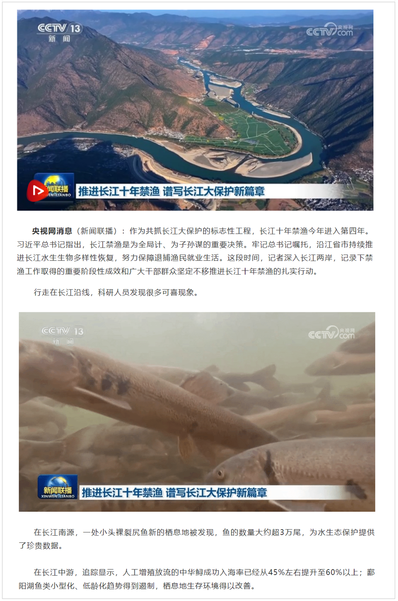
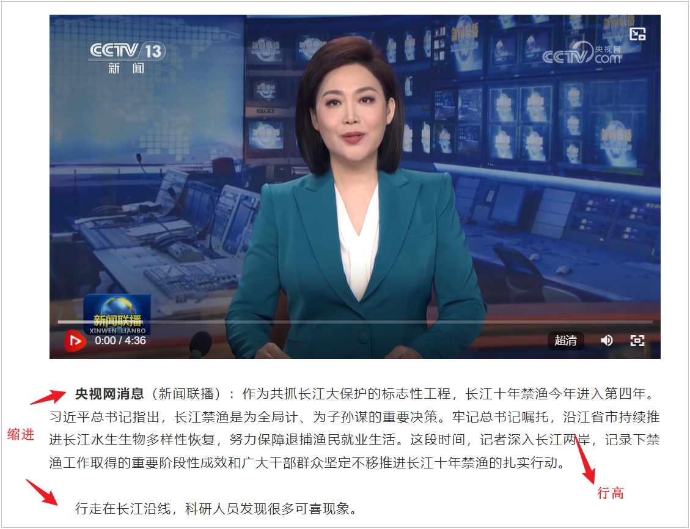
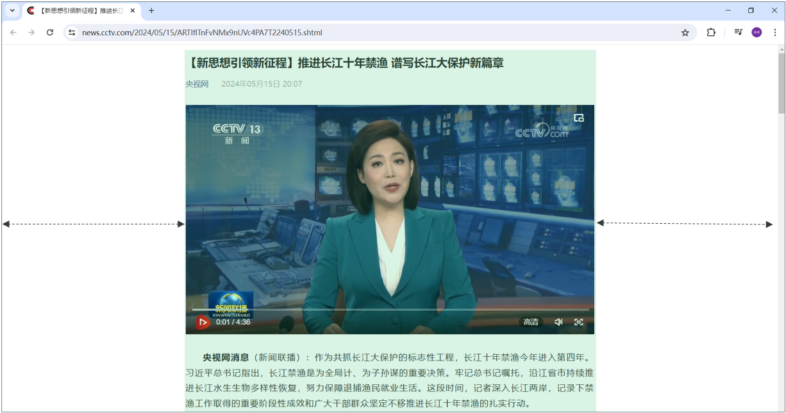
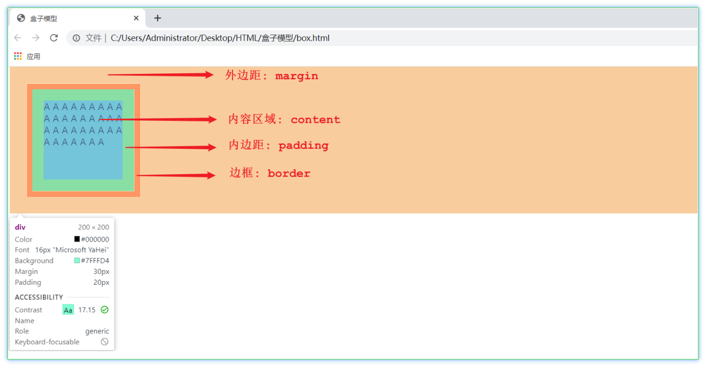
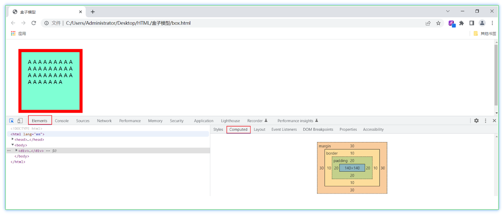
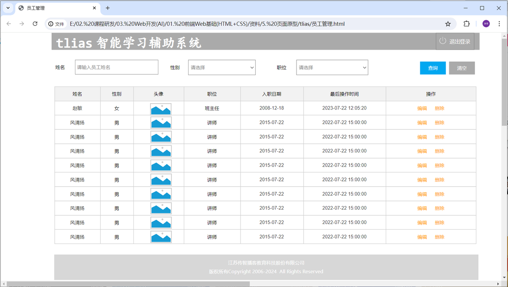
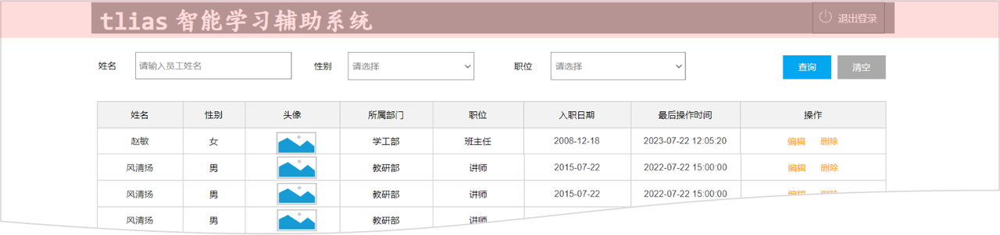
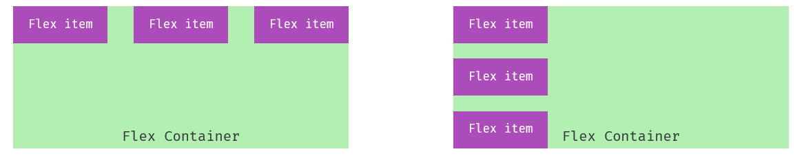
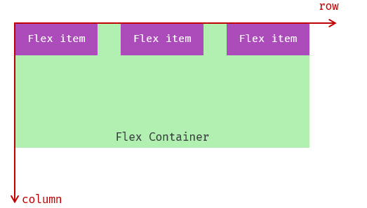
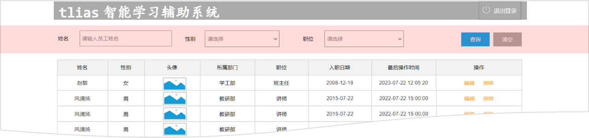

# 第一章：前端 Web 开发（HTML + CSS）

**目录：**

[TOC]

---

## 一、初识 Web 前端

### 1.1 介绍

我们介绍 Web 网站工作流程的时候提到，前端开发，主要的职责就是将数据以好看的样式呈现出来。说白了，就是开发网页程序，如下图所示：


主要明确以下三个问题：
1. 网页由哪些部分组成？
   * 文字、图片、音频、视频、超链接、表格等等。
2. 我们看到的网页，背后的本质是什么？
   * 前端程序员写的前端代码（备注：在前后端分离的开发模式中）。
3. 前端的代码是如何转换成用户眼中的网页的？
   * 通过浏览器转化（解析和渲染）成用户看到的网页。
   * 浏览器中对代码进行解析和渲染的部分，称为**浏览器内核**。

需要注意的是，不同的浏览器，内核不同，对于相同的前端代码解析的效果也会存在差异。那这就会造成一个问题：同一段前端程序，不同浏览器展示出来的效果是不一样的，那么用户的体验就很差了。而我们想达到的效果则是，即使用户使用的是不同的浏览器，解析同一段前端代码，最终展示出来的效果都是相同的。

要想达成这样一个目标，我们就需要定义一个统一的标准，然后让各大浏览器厂商都参照这个标准来实现即可。而这套标准其实早就已经定义好了，那就是接下来要介绍的 Web 标准。

### 1.2 Web 标准

**Web 标准**也称为**网页标准**，由一系列的标准组成，大部分由 W3C（World Wide Web Consortium，万维网联盟）负责制定。由三个部分组成：
* HTML：负责网页的**结构**（页面元素和内容）。
* CSS：负责网页的**表现**（页面元素的外观、位置等页面样式，如颜色、大小等）。
* JavaScript：负责网页的**行为**（交互效果）。

我们首先来讲解 Web 前端基础的第一部分：HTML 与 CSS。

> 什么是 HTML？
>
> **HTML**：**H**yper**T**ext **M**arkup **L**anguage，超文本标记语言。
> * 超文本：超越了文本的限制，比普通文本更强大。除了文字信息，还可以定义图片、音频、视频等内容。
> * 标记语言：由标签 “`<标签名>`” 构成的语言。
>   * HTML 标签都是预定义好的。例如：使用 `<h1>` 标签展示标题，使用 `<a>` 展示超链接，使用 `` 展示图片，使用 `<video>` 展示视频。
>   * HTML 代码直接在浏览器中运行，HTML 标签由浏览器解析。

下面展示的是一段 HTML 代码经过浏览器解析，呈现的效果如右图所示：


> 什么是 CSS？
>
> **CSS**：**C**ascading **S**tyle **S**heet，层叠样式表，用于控制页面的样式（表现）。

下面展示的是一段 HTML 代码及 CSS 样式经过浏览器解析，呈现的效果如右图所示：


## 二、HTML 快速入门

### 2.1 语法格式

HTML 文件的后缀名为 `.html`。

HTML 的基本骨架及标题定义如下：
```html
<html>
    <head>
        <title>HTML 快速入门</title>
    </head>
    <body>

    </body>
</html>
```

其中 `<html>` 是根标签，`<head>` 和 `<body>` 是子标签。
* `<head>`：定义网页的头部，用来存放给浏览器看的信息，如 CSS 样式、网页的标题。
* `<body>`：定义网页的主体部分，存放给用户看的信息，也是网页的主体内容，如文字、图片、视频、音频、表格等。

在 `<body>` 中编写 HTML 的核心内容：
```html
<html>
    <head>
        <title>HTML 快速入门</title>
    </head>
    <body>
        <h1>Hello HTML</h1>
        
    </body>
</html>
```

其中 `<h1>` 标签是一个一级标题的标签。`` 标签是一个图片标签，用来展示图片，而其中的 `src` 属性用来指定要展示的图片。

示例代码：
```html
<!-- 01.HTML快速入门.html --> 

<html>
    <head>
        <title>HTML 快速入门</title>
    </head>
    <body>
        <h1>Hello HTML</h1>
        
    </body>
</html>
```

### 2.2 总结

#### 2.2.1 HTML 页面的基础结构标签

HTML 页面的基础结构标签语法格式：
```html
<html>
    <head>
        <title> </title>
    </head>
    <body>

    </body>
</html>
```

`<title>` 中定义标题显式在浏览器的标题位置，`<body>` 中定义的你内容会呈现在浏览器的内容区域。

#### 2.2.2 HTML 中的标签特点

HTML 标签不区分大小写，建议小写。

HTML 标签的属性值，采用单引号、双引号都可以，一般写双引号。

HTML 语法相对比较松散。

## 三、前端开发工具

Visual Studio Code（简称 VS Code）是 Microsoft 于 2015 年 4 月发布的一款代码编辑器。VS Code 对前端代码有非常强大的支持，同时也支持其他编程语言（例如 C++、Java、Python、PHP、Go 等）。VS Code 提供了非常强大的插件库，大大提高了开发效率。

官网：[VS Code 官网](https://code.visualstudio.com "VS Code 官网")。

> 注意：
> * 不建议将软件装在包含中文名或空格的路径中。
> * 由于安装了 IDEA 快捷键的插件，因此 VSCode 快捷键与 IDEA 是一致的。

常用插件：
1. Chinese (Simplified) Language Pack。
2. HTML CSS Support。
3. JavaScript (ES6) code snippets。
4. Mithril Emmet。
5. Path Intellisense。
6. Vue 3 Snippets。
7. Auto Close Tag。
8. Auto Rename Tag。
9. open in browser。
10. Live Server。
11. Vue - Official。
12. File Utils。
13. IntelliJ IDEA Keybindings。
14. MarsCode AI：
    * MarsCode AI AI 助手账号注册：[MarsCode AI AI 助手账号注册](https://www.marscode.cn/home?utm_source=mkt&utm_medium=cpaitcast&utm_campaign=hmcxy "MarsCode AI AI 助手账号注册")。
15. TONGYI Lingma：
    * TONGYI Lingma AI 助手账号注册：[TONGYI Lingma AI 助手账号注册](https://account.aliyun.com/register/qr_register.htm?spm=5176.29741907.J_4VYgf18xNlTAyFFbOuOQe.d_register_1.e939154ab73d0j&oauth_callback=https%3A%2F%2Fwww.aliyun.com%2F "TONGYI Lingma AI 助手账号注册")。

在 VS Code 中，创建 .html 文件后，键入组合键 `! + Enter` 即可快速生成 HTML 文件的基本骨架。

示例代码：
```html
<!-- 02.HTML快速入门.html -->

<!-- 声明文档的类型为 HTML -->
<!DOCTYPE html>
<html lang="en">
<head>
    <!-- 字符集 -->
    <meta charset="UTF-8">
    <!-- 设置网页在移动设备上的显示宽度及缩放比例 -->
    <meta name="viewport" content="width=device-width, initial-scale=1.0">
    <title>HTML 快速入门</title>
</head>
<body>
    
    <h1>HTML 快速入门</h1>
    

    <!-- 定义一个一级标题，标题内容：Hello HTML -->
    <h1>Hello HTML</h1>

    <!-- 定义一个图片，路径：img/1.png -->
    </img>

</body>
</html>
```

## 四、常见标签和样式

在讲解 HTML 的常见基础标签及 CSS 的基本样式时，我们以新浪新闻页面为例来进行讲解。

央视新闻的具体页面效果如下：


我们可以看到，上述新闻网页其实分为两个部分，一个是新闻的标题部分，另一个是新闻的正文部分。

那么接下来，我们就先来完成央视新闻标题部分的制作。

### 4.1 央视新闻 - 标题


前面我们提到，我们在浏览器中看到的网页程序呈现出来的效果，实际上是浏览器解析并渲染了前端代码而呈现出来的。而我们所编写的 HTML 页面，在浏览器中渲染的时候，是从上往下逐行解析展示的。所以，我们在编写 HTML 页面的时候，要根据页面的布局，从上往下编写。

#### 4.1.1 标题排版


我们在 02.央视新闻-标题排版.html 文件中来制作新浪新闻网页，标题部分的排版内容为：
```html
<!-- 02.央视新闻-标题排版.html -->

```

那在上述我们用到的两个标签，一个是标题标签 `<h1></h1>`，另一个是超链接标题 `<a></a>`。这两个标签的具体用法如下。

标题标签 `h` 系列：
```html
<h1> 11111111111111 </h1>
<h2> 11111111111111 </h2>
<h3> 11111111111111 </h3>
<h4> 11111111111111 </h4>
<h5> 11111111111111 </h5>
<h6> 11111111111111 </h6>
```
效果：`h1` 为一级标题，字体也是最大的；`h6` 为六级标题，字体是最小的。

> 注意：
>
> HTML 标签是预定义好的，不能随意定义；也就意味着，标题标签就只有这六个，没有 `<h7>`。

超链接 `a` 标签：
* 标签：`<a href="..." target="...">央视网</a>`。
* 属性：
  * `href`：指定资源访问的 url。
  * `target`：指定在何处打开资源链接。
    * `_self`：默认值，在当前页面打开。
    * `_blank`：在空白页面打开。

#### 4.1.2 标题样式


我们可以看到，目前我们制作的新闻标题部分中，新闻发布时间 `2024年05月15日 20:07` 的字体颜色是黑色，而在原始的央视新闻页面中，字体的颜色呈现灰色。具体的呈现效果如下：


那接下来，我们要来控制字体的颜色，而这部分其实是属于网页的样式。所以这里需要通过 CSS 样式控制。

示例代码：
```html
<!-- 04.央视新闻-标题-样式.html -->

<!DOCTYPE html>
<html lang="en">
<head>
    <meta charset="UTF-8">
    <meta name="viewport" content="width=device-width, initial-scale=1.0">
    <title>【新思想引领新征程】推进长江十年禁渔 谱写长江大保护新篇章</title>
    <!-- 方式二：内部样式 -->
    <style>
        span {
            color: gray;
        }
    </style>

    <!-- 方式三：外部样式 -->
    <!-- <link rel="stylesheet" href="css/news.css"> -->
</head>
<body>
    <!-- 定义一个标题，标题的内容：【新思想引领新征程】推进长江十年禁渔 谱写长江大保护新篇章 -->
    <h1>【新思想引领新征程】推进长江十年禁渔 谱写长江大保护新篇章</h1>

    <!-- 定义一个超链接，里面展示 央视网 -->
    <a href="https://www.cctv.com/" target="_blank">央视网</a>

    <!-- 方式一：行内样式 -->
    <!-- <span style="color: gray;">2024年05月15日 20:07</span> -->
    
    <span>2024年05月15日 20:07</span>

</body>
</html>
```

##### 4.1.2.1 CSS 引入方式

在 HTML 的文件中，我们如何来编写 CSS 样式呢？此时涉及到 CSS 的三种引入方式。

具体有 3 种引入方式，语法如下表格所示：
| 名称 | 语法描述 | 示例 |
| :--: | :--: | :--: |
| 行内样式 | 在标签内使用 `style` 属性，属性值是 CSS 属性键值对 | `<h1 style="xxx:xxx;">中国新闻网</h1>` |
| 内部样式 | 定义 `<style>` 标签，在标签内部定义 CSS 样式 | `<style> h1 {...} </style>` |
| 外部样式 | 定义 `<link>` 标签，通过 `href` 属性引入外部 CSS 文件 | `link rel="stylesheet" href="css/news.css">` |

对于上述 3 种引入方式，企业开发的使用情况如下：
* 行内样式：会出现大量的代码冗余，不方便后期的维护，所以不常用（常配合 JS 使用）。
* 内部样式：通过定义 CSS 选择器，让样式作用于当前页面的指定的标签上（可以写在页面任何位置，但通常约定写在 `head` 标签中）。
* 外部样式：HTML 和 CSS 实现了完全的分离，企业开发常用方式。

##### 4.1.2.2 颜色表示方式

在前端程序开发中，颜色的表示方式常见的有如下三种：
| 表示方式 | 属性值 | 说明 | 取值 |
| :--: | :--: | :--: | :--: |
| 关键字 | 颜色英文单词 | `red`、`green`、`blue` | `red`、`green`、`blue` …… |
| rgb 表示法 | `rgb(r, g, b)` | 红绿蓝三原色，每项取值范围：0 - 255 | `rgb(0, 0, 0)`、`rgb(255, 255, 255)`、`rgb(255, 0, 0)` …… |
| rgba 表示法 | `rgba(r, g ,b, a)` | 红绿蓝三原色，`a` 表示透明度，取值：0 - 1 | `rgba(0, 0, 0, 0.3)`、`rgba(255, 255, 255, 0.5)` |
| 十六进制表示法 | `#rrggbb` | `#` 开头，将数字转换成十六进制表示 | `#000000`、`#ff0000`、`#cccccc`，简写：`#000`、`#f00`、`#ccc` |

> 注意：
>
> 在十六进制表示法中，`#` 后的 6 个数字两两为一组，分别表示红、绿、蓝，即 `#rrggbb`。当 `rr`、`gg` 或 `bb` 的两位数字相同时，即可简写为一位。

##### 4.1.2.3 设置字体颜色

示例代码：
```html
<!-- 04.央视新闻-标题-样式.html -->

<!DOCTYPE html>
<html lang="en">
<head>
    <meta charset="UTF-8">
    <meta name="viewport" content="width=device-width, initial-scale=1.0">
    <title>【新思想引领新征程】推进长江十年禁渔 谱写长江大保护新篇章</title>
    <!-- 方式二：内部样式 -->
    <style>
        span {
            /* 关键字 */
            /* color: gray; */

            /* RGB 表示法 */
            /* color: rgb(255, 0, 0); */

            /* RGBA 表示法 */
            /* color: rgba(255, 120, 0, 0); */

            /* 十六进制表示法 */
            /* color: #0000ff; */
            color: #b2b2b2;
        }
    </style>

    <!-- 方式三：外部样式 -->
    <!-- <link rel="stylesheet" href="css/news.css"> -->
</head>
<body>
    <!-- 定义一个标题，标题的内容：【新思想引领新征程】推进长江十年禁渔 谱写长江大保护新篇章 -->
    <h1>【新思想引领新征程】推进长江十年禁渔 谱写长江大保护新篇章</h1>

    <!-- 定义一个超链接，里面展示 央视网 -->
    <a href="https://www.cctv.com/" target="_blank">央视网</a>

    <!-- 方式一：行内样式 -->
    <!-- <span style="color: gray;">2024年05月15日 20:07</span> -->
    
    <span>2024年05月15日 20:07</span>

</body>
</html>
```

##### 4.1.2.4 CSS 选择器

顾名思义，选择器是选取需设置样式的元素（标签）。但是根据业务场景不同，选择的标签的需求也是多种多样的，所以选择器有很多种。

选择器通用语法如下：
```html
选择器名 {
    CSS 样式名: CSS 样式值;
    CSS 样式名: CSS 样式值;
}
```

常见的 CSS 选择器如下表所示：
| 选择器 | 写法 | 示例 | 示例说明 |
| :--: | :--: | :--: | :--: |
| 元素选择器 | `元素名称 {...}` | `h1 {...}` | 选择页面上所有的 `<h1>` 标签 |
| 类选择器 | `.class属性值 {...}` | `.cls {...}` | 选择页面上所有 `class` 属性为 `cls` 的标签 |
| id 选择器 | `#id属性值 {...}` | `#hid {...}` | 选择页面上 `id` 属性为 `hid` 的标签 |
| 分组选择器 | `选择器1, 选择器2 {...}` | `h1, h2 {...}` | 选择页面上所有的 `<h1>` 和 `<h2>` 标签 |
| 属性选择器 | `元素名称[属性] {...}` | `input[type] {...}` | 选择页面上有 `type` 属性的 `<input>` 标签 |
| 属性选择器 | `元素名称[属性名="值"] {...}` | `input[type="text"] {...}` | 选择页面上 `type` 属性为 `text` 的 `<input>` 标签 |
| 后代选择器 | `元素1 元素2 {...}` | `form input {...}` | 选择 `<form>` 标签内的所有 `<input>` 标签 |

> 注意：
>
> 优先级：id 选择器 > 类选择器 > 元素选择器。

那么接下来，我们需要将页面上所有的超链接中默认的下划线效果去掉。具体的代码实现如下：
```html
<!-- 05.央视新闻-标题-样式（选择器）.html -->

<!DOCTYPE html>
<html lang="en">
<head>
    <meta charset="UTF-8">
    <meta name="viewport" content="width=device-width, initial-scale=1.0">
    <title>【新思想引领新征程】推进长江十年禁渔 谱写长江大保护新篇章</title>
    <!-- 方式二：内部样式 -->
    <style>
        /* 元素选择器 */
        /* span {
            color: #b2b2b2;
        } */
        
        /* 类选择器 */
        /* .cls {
            color: #ff0000;
        } */
        
        /* ID 选择器 */
        #time {
            color: #b2b2b2;
        }

        a {
            text-decoration: none;
        }
    </style>

    <!-- 方式三：外部样式 -->
    <!-- <link rel="stylesheet" href="css/news.css"> -->
</head>
<body>
    <!-- 定义一个标题，标题的内容：【新思想引领新征程】推进长江十年禁渔 谱写长江大保护新篇章 -->
    <h1>【新思想引领新征程】推进长江十年禁渔 谱写长江大保护新篇章</h1>

    <!-- 定义一个超链接，里面展示 央视网 -->
    <a href="https://www.cctv.com/" target="_blank">央视网</a>

    <!-- 方式一：行内样式 -->
    <!-- <span style="color: gray;">2024年05月15日 20:07</span> -->
    
    <span class="cls" id="time">2024年05月15日 20:07</span>

</body>
</html>
```

到目前为止，标题部分的基本排版和样式，我们就已经制作完成了。

### 4.2 央视新闻 - 正文

在原始的央视新闻页面中，我们可以看到有视频，有文字，有图片，内容是非常丰富的：


#### 4.2.1 正文排版

##### 4.2.1.1 基本实现

浏览器在解析渲染页面的时候，是从上往下解析渲染的；那么接下来，我们就可以从上往下来布局这个页面。

正文排版之后，页面的代码如下：
```html
<!-- 06.央视新闻-正文-排版.html -->

<!DOCTYPE html>

<head>
    <meta charset="UTF-8">
    <meta name="viewport" content="width=device-width, initial-scale=1.0">
    <title>【新思想引领新征程】推进长江十年禁渔 谱写长江大保护新篇章</title>
    <!-- 方式二：内部样式 -->
    <style>
        /* 元素选择器 */
        /* span {
            color: #b2b2b2;
        } */
        
        /* 类选择器 */
        /* .cls {
            color: #ff0000;
        } */
        
        /* ID 选择器 */
        #time {
            color: #b2b2b2;
        }

        a {
            text-decoration: none;
        }
    </style>

    <!-- 方式三：外部样式 -->
    <!-- <link rel="stylesheet" href="css/news.css"> -->
</head>
<body>
    <!-- ------------------------- 新闻标题 ------------------------- -->

    <!-- 定义一个标题，标题的内容：【新思想引领新征程】推进长江十年禁渔 谱写长江大保护新篇章 -->
    <h1>【新思想引领新征程】推进长江十年禁渔 谱写长江大保护新篇章</h1>

    <!-- 定义一个超链接，里面展示 央视网 -->
    <a href="https://www.cctv.com/" target="_blank">央视网</a>
    
    <span class="cls" id="time">2024年05月15日 20:07</span>
    <br><br>

    <!-- ------------------------- 新闻正文 ------------------------- -->
    <!-- 定义一个视频，引入 video/news.mp4 -->
    <!-- video 标签属性 -->
    <!-- video 标签属性
        src：视频地址
        controls：显示播放控件
        autoplay：自动播放
        width：视频宽度（建议：宽度和高度只设置一个即可，另一个会等比例缩放）
        height：视频高度
            单位：
                px：像素
                %：百分比（相对于父元素的百分比）
    -->
    <video src="video/news.mp4" controls width="80%"></video>
    <!-- <audio src="audio/news.mp3" controls></audio> -->

    <p>
        央视网消息（新闻联播）：作为共抓长江大保护的标志性工程，长江十年禁渔今年进入第四年。习近平总书记指出，长江禁渔是为全局计、为子孙谋的重要决策。牢记总书记嘱托，沿江省市持续推进长江水生生物多样性恢复，努力保障退捕渔民就业生活。这段时间，记者深入长江两岸，记录下禁渔工作取得的重要阶段性成效和广大干部群众坚定不移推进长江十年禁渔的扎实行动。
    </p>

    <p>
        行走在长江沿线，科研人员发现很多可喜现象。
    </p>

    <!-- 定义一张图片，引入 img/1.gif -->
    <!-- img 标签属性：
            src：图片的访问地址
                1. 绝对路径
                    1.1 绝对磁盘路径：C\Users\Administrator\Desktop\img\1.gif（不推荐）
                    1.2 绝对网络路径：https://www.baidu.com/img/1.gif
                2. 相对路径
                    2.1 ./：当前目录（可以省略），如：./img/1.gif
                    2.2 ../：上一级目录
            width：图片宽度（建议：宽度和高度只设置一个即可，另一个会等比例缩放）
            height：图片高度
    -->
    </body>

    <p>
        在长江南源，一处小头裸裂尻鱼新的栖息地被发现，鱼的数量大约超3万尾，为水生态保护提供了珍贵数据。
    </p>

    <p>
        在长江中游，追踪显示，人工增殖放流的中华鲟成功入海率已经从45%左右提升至60%以上；鄱阳湖鱼类小型化、低龄化趋势得到遏制，栖息地生存环境得以改善。
    </p>

    <p>
        在长江下游，今年3月起，南京秦淮河入江口首次出现野生中华绒螯蟹大规模洄游现象，种群数量明显增加。
    </p>

    </img>

    <p>
        水生生物资源恢复向好，见证了长江十年禁渔三年多来的阶段性成果。
    </p>

    <p>
        实施长江十年禁渔，是以习近平同志为核心的党中央从中华民族长远利益出发作出的重要决策。党的十八大以来，总书记多次深入长江沿线考察调研，详细了解长江十年禁渔的实施情况，他指出，要坚定推进长江十年禁渔，巩固好已经取得的成果。
    </p>

    </img>

    <p>
        按照部署，自2021年1月1日起，在长江干流、大型通江湖泊、重要支流和长江口部分海域实行为期十年的禁渔，常年禁止天然渔业资源的生产性捕捞。禁渔三年多来，相关评估显示，长江干流和鄱阳湖、洞庭湖水生生物完整性指数由禁渔前最差的“无鱼”提升了两个等级。2022年，长江江豚数量达到1249头，实现历史性止跌回升。长江干流水质连续4年全线保持Ⅱ类。
    </p>

    <p>
        实施长江十年禁渔，解决好渔民上岸后的生产生活问题，禁渔才有稳定扎实的社会基础。
    </p>

    </img>

    <p>
        安徽退捕转产的3万多名渔民，在政府的引导下接受就业培训。在当涂县，免费学习养殖技术，养殖生态螃蟹成了退捕渔民的新选择。
    </p>

    <p>
        在拥有洞庭湖超六成水域的湖南岳阳，政府帮扶上岸渔民建起养殖场，发展风干鱼产业，还带领他们学习直播带货，拓宽销路。
    </p>

    <p>
        在渔民退捕上岸的鄱阳湖棠荫岛，当地在继续保护好生态的前提下，正探索规划利用独特的自然资源发展旅游产业。禁渔三年多来，有关部门对23.1万退捕渔民逐一建档立卡，多渠道提升就业、社保水平。
    </p>

    </img>

    <p>
        长江十年禁渔实施以来，沿江省市合力攻坚、久久为功，长江大保护不断向纵深推进，持续巩固禁渔成果。下一步，沿江省市还将加强水生生物重要栖息地修复，建立退捕渔民动态精准帮扶服务，完善跨区域、跨部门执法合作机制，确保一江清水绵延后世、惠泽人民。
    </p>
    
</body>
</html>
```

##### 4.2.1.2 常见标签

在上述的正文排版中，用到了如下标签：
| 标签 | 作用 | 属性 / 说明 |
| :--: | :--: | -- |
| `<video>` | 视频标签 | 1. `src`：指定视频的 url（绝对路径 / 相对路径）<br>2. `controls`：是否显示播放控件<br>3. `width`：宽度（像素 / 相对于父元素百分比）；备注：一般 `width` 和 `height` 我们只会指定一个，另外一个会自动地等比例缩放<br>4. `height`：高度（像素 / 相对于父元素百分比）；备注：一般 `width` 和 `height` 我们只会指定一个，另外一个会自动地等比例缩放 |
| `` | 图片标签 | 1. `src`<br>2. `width`<br>3. `height` |
| `<p>` | 段落标签 | - |
| `<br>` | 换行标签 | - |
| `<b>` / `<strong>` | <b>加粗 | `<strong>` 具有强调语义 |
| `<u>` / `<ins>` | <u>下划线 | `<ins>` 具有强调语义 |
| `<i>` / `<em>` | <i>倾斜 | `<em>` 具有强调语义 |
| `<s>` / `<del>` | <s>删除线 | `<del>` 具有强调语义 |

在 HTML 页面中，我们在代码中录入空格、<、> 这些符号的时候，是没有对应的效果的，因为浏览器并不能准确地识别；此时，我们就需要通过字符实体来表示空格、<、>。常见符号的字符实体如下：
| 字符实体 | 属性 / 说明 |
| :--: | :--: |
| `&nbsp;` | 空格 |
| `&lt;` | < |
| `&gt;` | > |

##### 4.2.1.3 路径表示

在引入图片、视频、音频、CSS 等内容时，我们需要指定文件的路径；而在前端开发中，路径的书写形式分为两类：
* 绝对路径：
  * 绝对磁盘路径：``。
  * 绝对网络路径：``。
* 相对路径：
  * `./`：当前目录，`./` 可以省略。
  * `../`：上一级目录。

#### 4.2.2 正文样式

正文的基本排版有了之后，接下来，我们要处理的是正文部分的样式。



具体的 CSS 样式如下：
```css
/* 设置段落首行缩进 */
p {
    text-indent: 2em;   /* 首行缩进 2em */
    line-height: 2; /* 行高 2 倍 */
}
```

示例代码：
```html
<!-- 07.央视新闻-正文-样式.html -->

<!DOCTYPE html>

<head>
    <meta charset="UTF-8">
    <meta name="viewport" content="width=device-width, initial-scale=1.0">
    <title>【新思想引领新征程】推进长江十年禁渔 谱写长江大保护新篇章</title>
    <!-- 方式二：内部样式 -->
    <style>
        /* 元素选择器 */
        /* span {
            color: #b2b2b2;
        } */
        
        /* 类选择器 */
        /* .cls {
            color: #ff0000;
        } */
        
        /* ID 选择器 */
        #time {
            color: #b2b2b2;
        }

        a {
            text-decoration: none;
        }

        p {
            /* 设置行高 */
            line-height: 2; /* 行高：2 倍行高 */
            /* 设置首行缩进 */
            text-indent: 2em;   /* 首行缩进 2 个字符 */
        }
    </style>

    <!-- 方式三：外部样式 -->
    <!-- <link rel="stylesheet" href="css/news.css"> -->
</head>
<body>
    <!-- ------------------------- 新闻标题 ------------------------- -->

    <!-- 定义一个标题，标题的内容：【新思想引领新征程】推进长江十年禁渔 谱写长江大保护新篇章 -->
    <h1>【新思想引领新征程】推进长江十年禁渔 谱写长江大保护新篇章</h1>

    <!-- 定义一个超链接，里面展示 央视网 -->
    <a href="https://www.cctv.com/" target="_blank">央视网</a>
    
    <span class="cls" id="time">2024年05月15日 20:07</span>
    <br><br>

    <!-- ------------------------- 新闻正文 ------------------------- -->
    <!-- 定义一个视频，引入 video/news.mp4 -->
    <!-- video 标签属性 -->
    <!-- video 标签属性
        src：视频地址
        controls：显示播放控件
        autoplay：自动播放
        width：视频宽度（建议：宽度和高度只设置一个即可，另一个会等比例缩放）
        height：视频高度
            单位：
                px：像素
                %：百分比（相对于父元素的百分比）
    -->
    <video src="video/news.mp4" controls width="80%"></video>
    <!-- <audio src="audio/news.mp3" controls></audio> -->

    <p>
        <!-- <b>央视网消息</b> -->
        <!-- <strong>&nbsp;&nbsp;&nbsp;&nbsp;央视网消息</strong> -->
        <strong>央视网消息</strong>
        （新闻联播）：作为共抓长江大保护的标志性工程，长江十年禁渔今年进入第四年。习近平总书记指出，长江禁渔是为全局计、为子孙谋的重要决策。牢记总书记嘱托，沿江省市持续推进长江水生生物多样性恢复，努力保障退捕渔民就业生活。这段时间，记者深入长江两岸，记录下禁渔工作取得的重要阶段性成效和广大干部群众坚定不移推进长江十年禁渔的扎实行动。
    </p>

    <p>
        行走在长江沿线，科研人员发现很多可喜现象。
    </p>

    <!-- 定义一张图片，引入 img/1.gif -->
    <!-- img 标签属性：
            src：图片的访问地址
                1. 绝对路径
                    1.1 绝对磁盘路径：C\Users\Administrator\Desktop\img\1.gif（不推荐）
                    1.2 绝对网络路径：https://www.baidu.com/img/1.gif
                2. 相对路径
                    2.1 ./：当前目录（可以省略），如：./img/1.gif
                    2.2 ../：上一级目录
            width：图片宽度（建议：宽度和高度只设置一个即可，另一个会等比例缩放）
            height：图片高度
    -->
    </body>

    <p>
        在长江南源，一处小头裸裂尻鱼新的栖息地被发现，鱼的数量大约超3万尾，为水生态保护提供了珍贵数据。
    </p>

    <p>
        在长江中游，追踪显示，人工增殖放流的中华鲟成功入海率已经从45%左右提升至60%以上；鄱阳湖鱼类小型化、低龄化趋势得到遏制，栖息地生存环境得以改善。
    </p>

    <p>
        在长江下游，今年3月起，南京秦淮河入江口首次出现野生中华绒螯蟹大规模洄游现象，种群数量明显增加。
    </p>

    </img>

    <p>
        水生生物资源恢复向好，见证了长江十年禁渔三年多来的阶段性成果。
    </p>

    <p>
        实施长江十年禁渔，是以习近平同志为核心的党中央从中华民族长远利益出发作出的重要决策。党的十八大以来，总书记多次深入长江沿线考察调研，详细了解长江十年禁渔的实施情况，他指出，要坚定推进长江十年禁渔，巩固好已经取得的成果。
    </p>

    </img>

    <p>
        按照部署，自2021年1月1日起，在长江干流、大型通江湖泊、重要支流和长江口部分海域实行为期十年的禁渔，常年禁止天然渔业资源的生产性捕捞。禁渔三年多来，相关评估显示，长江干流和鄱阳湖、洞庭湖水生生物完整性指数由禁渔前最差的“无鱼”提升了两个等级。2022年，长江江豚数量达到1249头，实现历史性止跌回升。长江干流水质连续4年全线保持Ⅱ类。
    </p>

    <p>
        实施长江十年禁渔，解决好渔民上岸后的生产生活问题，禁渔才有稳定扎实的社会基础。
    </p>

    </img>

    <p>
        安徽退捕转产的3万多名渔民，在政府的引导下接受就业培训。在当涂县，免费学习养殖技术，养殖生态螃蟹成了退捕渔民的新选择。
    </p>

    <p>
        在拥有洞庭湖超六成水域的湖南岳阳，政府帮扶上岸渔民建起养殖场，发展风干鱼产业，还带领他们学习直播带货，拓宽销路。
    </p>

    <p>
        在渔民退捕上岸的鄱阳湖棠荫岛，当地在继续保护好生态的前提下，正探索规划利用独特的自然资源发展旅游产业。禁渔三年多来，有关部门对23.1万退捕渔民逐一建档立卡，多渠道提升就业、社保水平。
    </p>

    </img>

    <p>
        长江十年禁渔实施以来，沿江省市合力攻坚、久久为功，长江大保护不断向纵深推进，持续巩固禁渔成果。下一步，沿江省市还将加强水生生物重要栖息地修复，建立退捕渔民动态精准帮扶服务，完善跨区域、跨部门执法合作机制，确保一江清水绵延后世、惠泽人民。
    </p>
    
</body>
</html>
```

### 4.3 央视新闻 - 布局

#### 4.3.1 功能实现

完成了标签及正文部分的排版制作以及样式处理之后，那么最后一步，我们就要来完成页面整体布局的设置了。从原始的央视新闻页面中，我们可以看到，新闻页面是处于整个版面的正中心的，在布局中被称为**版心居中**。



最终网页代码如下所示：
```html
<!-- 08.央视新闻-整体布局.html -->

<!DOCTYPE html>

<head>
    <meta charset="UTF-8">
    <meta name="viewport" content="width=device-width, initial-scale=1.0">
    <title>【新思想引领新征程】推进长江十年禁渔 谱写长江大保护新篇章</title>
    <!-- 方式二：内部样式 -->
    <style>
        /* 元素选择器 */
        /* span {
            color: #b2b2b2;
        } */
        
        /* 类选择器 */
        /* .cls {
            color: #ff0000;
        } */
        
        /* ID 选择器 */
        #time {
            color: #b2b2b2;
        }

        a {
            text-decoration: none;
        }

        p {
            /* 设置行高 */
            line-height: 2; /* 行高：2 倍行高 */
            /* 设置首行缩进 */
            text-indent: 2em;   /* 首行缩进 2 个字符 */
        }

        /* 整体的版面居中显示 */
        #content-container {
            width: 70%;
            margin-left: auto;
            margin-right: auto;
        }
    </style>

    <!-- 方式三：外部样式 -->
    <!-- <link rel="stylesheet" href="css/news.css"> -->
</head>
<body>
    <div id="content-container">
        <!-- ------------------------- 新闻标题 ------------------------- -->

        <!-- 定义一个标题，标题的内容：【新思想引领新征程】推进长江十年禁渔 谱写长江大保护新篇章 -->
        <h1>【新思想引领新征程】推进长江十年禁渔 谱写长江大保护新篇章</h1>

        <!-- 定义一个超链接，里面展示 央视网 -->
        <a href="https://www.cctv.com/" target="_blank">央视网</a>
        
        <span class="cls" id="time">2024年05月15日 20:07</span>
        <br><br>

        <!-- ------------------------- 新闻正文 ------------------------- -->
        <!-- 定义一个视频，引入 video/news.mp4 -->
        <video src="video/news.mp4" controls width="100%"></video>
        <!-- <audio src="audio/news.mp3" controls></audio> -->

        <p>
            <!-- <b>央视网消息</b> -->
            <!-- <strong>&nbsp;&nbsp;&nbsp;&nbsp;央视网消息</strong> -->
            <strong>央视网消息</strong>
            （新闻联播）：作为共抓长江大保护的标志性工程，长江十年禁渔今年进入第四年。习近平总书记指出，长江禁渔是为全局计、为子孙谋的重要决策。牢记总书记嘱托，沿江省市持续推进长江水生生物多样性恢复，努力保障退捕渔民就业生活。这段时间，记者深入长江两岸，记录下禁渔工作取得的重要阶段性成效和广大干部群众坚定不移推进长江十年禁渔的扎实行动。
        </p>

        <p>
            行走在长江沿线，科研人员发现很多可喜现象。
        </p>

        <!-- 定义一张图片，引入 img/1.gif -->
        <!-- img 标签属性：
                src：图片的访问地址
                    1. 绝对路径
                        1.1 绝对磁盘路径：C\Users\Administrator\Desktop\img\1.gif（不推荐）
                        1.2 绝对网络路径：https://www.baidu.com/img/1.gif
                    2. 相对路径
                        2.1 ./：当前目录（可以省略），如：./img/1.gif
                        2.2 ../：上一级目录
                width：图片宽度（建议：宽度和高度只设置一个即可，另一个会等比例缩放）
                height：图片高度
        -->
        </body>

        <p>
            在长江南源，一处小头裸裂尻鱼新的栖息地被发现，鱼的数量大约超3万尾，为水生态保护提供了珍贵数据。
        </p>

        <p>
            在长江中游，追踪显示，人工增殖放流的中华鲟成功入海率已经从45%左右提升至60%以上；鄱阳湖鱼类小型化、低龄化趋势得到遏制，栖息地生存环境得以改善。
        </p>

        <p>
            在长江下游，今年3月起，南京秦淮河入江口首次出现野生中华绒螯蟹大规模洄游现象，种群数量明显增加。
        </p>

        </img>

        <p>
            水生生物资源恢复向好，见证了长江十年禁渔三年多来的阶段性成果。
        </p>

        <p>
            实施长江十年禁渔，是以习近平同志为核心的党中央从中华民族长远利益出发作出的重要决策。党的十八大以来，总书记多次深入长江沿线考察调研，详细了解长江十年禁渔的实施情况，他指出，要坚定推进长江十年禁渔，巩固好已经取得的成果。
        </p>

        </img>

        <p>
            按照部署，自2021年1月1日起，在长江干流、大型通江湖泊、重要支流和长江口部分海域实行为期十年的禁渔，常年禁止天然渔业资源的生产性捕捞。禁渔三年多来，相关评估显示，长江干流和鄱阳湖、洞庭湖水生生物完整性指数由禁渔前最差的“无鱼”提升了两个等级。2022年，长江江豚数量达到1249头，实现历史性止跌回升。长江干流水质连续4年全线保持Ⅱ类。
        </p>

        <p>
            实施长江十年禁渔，解决好渔民上岸后的生产生活问题，禁渔才有稳定扎实的社会基础。
        </p>

        </img>

        <p>
            安徽退捕转产的3万多名渔民，在政府的引导下接受就业培训。在当涂县，免费学习养殖技术，养殖生态螃蟹成了退捕渔民的新选择。
        </p>

        <p>
            在拥有洞庭湖超六成水域的湖南岳阳，政府帮扶上岸渔民建起养殖场，发展风干鱼产业，还带领他们学习直播带货，拓宽销路。
        </p>

        <p>
            在渔民退捕上岸的鄱阳湖棠荫岛，当地在继续保护好生态的前提下，正探索规划利用独特的自然资源发展旅游产业。禁渔三年多来，有关部门对23.1万退捕渔民逐一建档立卡，多渠道提升就业、社保水平。
        </p>

        </img>

        <p>
            长江十年禁渔实施以来，沿江省市合力攻坚、久久为功，长江大保护不断向纵深推进，持续巩固禁渔成果。下一步，沿江省市还将加强水生生物重要栖息地修复，建立退捕渔民动态精准帮扶服务，完善跨区域、跨部门执法合作机制，确保一江清水绵延后世、惠泽人民。
        </p>
    </div>
    
</body>
</html>
```

#### 4.3.2 盒子模型

##### 4.3.2.1 介绍

盒子：页面中所有的元素（标签），都可以看做是一个盒子，由盒子将页面中的元素包含在一个矩形区域内，通过盒子的视角更方便地进行页面布局。

盒子模型组成：内容区域（content）、内边距区域（padding）、边框区域（border）、外边距区域（margin）。


CSS 盒子模型，其实和日常生活中的包装盒是非常类似的。盒子的大小，其实就包括三个部分 border、padding、content，而 margin 外边距是不包括在盒子之内的。

##### 4.3.2.2 布局标签

布局标签：实际开发网页中，会大量频繁地使用 `div` 和 `span` 这两个没有语义的布局标签。

标签：`<div>`、`<span>`。

特点：
* `<div>` 标签：
  * 一行只显示一个（独占一行）。
  * 宽度默认是父元素的宽度，高度默认由内容撑开。
  * 可以设置宽高（`width`、`height`）。
* `<span>` 标签：
  * 一行可以显示多个。
  * 宽度和高度默认由内容撑开。
  * 不可以设置宽高（`width`、`height`）。

#### 4.3.2.3 代码实现

代码如下：
```html
<!DOCTYPE html>
<html lang="en">
<head>
    <meta charset="UTF-8">
    <meta http-equiv="x-UA-Compatible" content="IE=edge">
    <meta name="viewport" content="width=device-width, initial-scale=1.0">
    <title>盒子模型</title>
    <style>
        div {
            width: 200px;   /* 宽度 */
            height: 200px;  /* 高度 */
            box-sizing: border-box; /* 指定 width height 为盒子的高宽 */
            background-color: aquamarine;   /* 背景色 */

            padding: 20px 20px 20px 20px;   /* 内边距：上 右 下 左（顺时针）；边距都一样，可以简写：padding: 20px; */
            border: 10px solid red; /* 边框：宽度 线条类型 颜色 */
            margin: 30px 30px 30px 30px;    /* 外边距：上 右 下 左（顺时针）；边距都一样，可以简写：margin: 30px; */
        }
    </style>
</head>

<body>

    <div>
        A A A A A A A A A A A A A A A A A A A A A A A A A A A A A A A A A A 
    </div>

</body>
</html>
```

代码编写好了，可以通过浏览器打开该页面。通过开发者工具，我们就可以看到盒子的大小，以及盒子各个组成部分（内容、内边距、边框、外边距）：


我们也可以通过浏览器的开发者工具清晰地看到这个盒子，以及每一个部分的大小：


> 注意：
>
> 上述的 `padding`、`margin` 属性值，可以是 4 个值，也可以是 2 个值，还可以是 1 个值。具体的含义如下：
> * `padding: 20px 20px 20px 20px;`：表示上、右、下、左（顺时针）都是 20px。
> * `padding: 20px 10px;`：表示上下是 20px、左右是 10px。
> * `padding: 20px;`：表示上、右、下、左都是 20 px。

示例代码：
```html
<!-- 09.盒子模型.html -->

<!DOCTYPE html>
<html lang="en">
<head>
  <meta charset="UTF-8">
  <meta name="viewport" content="width=device-width, initial-scale=1.0">
  <title>盒子模型</title>
  <style>
    #div1 {
      width: 400px; /* 宽度: 400像素; 默认是内容展示区域的宽度 */
      height: 300px; /* 高度: 300像素; 默认是内容展示区域的高度 */
      background-color: #ffff00;
      padding: 30px; /* 内边距: 30像素 */
      box-sizing: border-box; 
      border: 20px solid #ff00ff; /* 边框: 20像素 */
      margin: 30px auto; /* 外边距: 20像素 */
    }
  </style>
</head>

<body>
  <div id="div1">
    A A A A A A A A A A A A A A A A A A A A A A A A A A A A A A A A A A A A A A A A A A A A 
  </div>

  <!-- <div id="div2">
    A A A A A A A A A A A A A A A A A A A A A A A A A A A A A A A A A A A A A A A A A A A A
  </div>

  <span>
    B B B B B B B B B B B B B B B B
  </span>

  <span>
    B B B B B B B B B B B B B
  </span> -->
</body>
</html>
```

由以上可知，央视新闻整体的版面居中显示也可以如下方式实现：
```html
<!-- 08.央视新闻-整体布局.html -->

<!DOCTYPE html>

<head>
    <meta charset="UTF-8">
    <meta name="viewport" content="width=device-width, initial-scale=1.0">
    <title>【新思想引领新征程】推进长江十年禁渔 谱写长江大保护新篇章</title>
    <!-- 方式二：内部样式 -->
    <style>
        /* 元素选择器 */
        /* span {
            color: #b2b2b2;
        } */
        
        /* 类选择器 */
        /* .cls {
            color: #ff0000;
        } */
        
        /* ID 选择器 */
        #time {
            color: #b2b2b2;
        }

        a {
            text-decoration: none;
        }

        p {
            /* 设置行高 */
            line-height: 2; /* 行高：2 倍行高 */
            /* 设置首行缩进 */
            text-indent: 2em;   /* 首行缩进 2 个字符 */
        }

        /* 整体的版面居中显示 */
        #content-container {
            width: 70%; /* 宽度：70% */
            margin: 0 auto;
        }
    </style>

    <!-- 方式三：外部样式 -->
    <!-- <link rel="stylesheet" href="css/news.css"> -->
</head>
<body>
    <div id="content-container">
        <!-- ------------------------- 新闻标题 ------------------------- -->

        <!-- 定义一个标题，标题的内容：【新思想引领新征程】推进长江十年禁渔 谱写长江大保护新篇章 -->
        <h1>【新思想引领新征程】推进长江十年禁渔 谱写长江大保护新篇章</h1>

        <!-- 定义一个超链接，里面展示 央视网 -->
        <a href="https://www.cctv.com/" target="_blank">央视网</a>
        
        <span class="cls" id="time">2024年05月15日 20:07</span>
        <br><br>

        <!-- ------------------------- 新闻正文 ------------------------- -->
        <!-- 定义一个视频，引入 video/news.mp4 -->
        <video src="video/news.mp4" controls width="100%"></video>
        <!-- <audio src="audio/news.mp3" controls></audio> -->

        <p>
            <!-- <b>央视网消息</b> -->
            <!-- <strong>&nbsp;&nbsp;&nbsp;&nbsp;央视网消息</strong> -->
            <strong>央视网消息</strong>
            （新闻联播）：作为共抓长江大保护的标志性工程，长江十年禁渔今年进入第四年。习近平总书记指出，长江禁渔是为全局计、为子孙谋的重要决策。牢记总书记嘱托，沿江省市持续推进长江水生生物多样性恢复，努力保障退捕渔民就业生活。这段时间，记者深入长江两岸，记录下禁渔工作取得的重要阶段性成效和广大干部群众坚定不移推进长江十年禁渔的扎实行动。
        </p>

        <p>
            行走在长江沿线，科研人员发现很多可喜现象。
        </p>

        <!-- 定义一张图片，引入 img/1.gif -->
        <!-- img 标签属性：
                src：图片的访问地址
                    1. 绝对路径
                        1.1 绝对磁盘路径：C\Users\Administrator\Desktop\img\1.gif（不推荐）
                        1.2 绝对网络路径：https://www.baidu.com/img/1.gif
                    2. 相对路径
                        2.1 ./：当前目录（可以省略），如：./img/1.gif
                        2.2 ../：上一级目录
                width：图片宽度（建议：宽度和高度只设置一个即可，另一个会等比例缩放）
                height：图片高度
        -->
        </body>

        <p>
            在长江南源，一处小头裸裂尻鱼新的栖息地被发现，鱼的数量大约超3万尾，为水生态保护提供了珍贵数据。
        </p>

        <p>
            在长江中游，追踪显示，人工增殖放流的中华鲟成功入海率已经从45%左右提升至60%以上；鄱阳湖鱼类小型化、低龄化趋势得到遏制，栖息地生存环境得以改善。
        </p>

        <p>
            在长江下游，今年3月起，南京秦淮河入江口首次出现野生中华绒螯蟹大规模洄游现象，种群数量明显增加。
        </p>

        </img>

        <p>
            水生生物资源恢复向好，见证了长江十年禁渔三年多来的阶段性成果。
        </p>

        <p>
            实施长江十年禁渔，是以习近平同志为核心的党中央从中华民族长远利益出发作出的重要决策。党的十八大以来，总书记多次深入长江沿线考察调研，详细了解长江十年禁渔的实施情况，他指出，要坚定推进长江十年禁渔，巩固好已经取得的成果。
        </p>

        </img>

        <p>
            按照部署，自2021年1月1日起，在长江干流、大型通江湖泊、重要支流和长江口部分海域实行为期十年的禁渔，常年禁止天然渔业资源的生产性捕捞。禁渔三年多来，相关评估显示，长江干流和鄱阳湖、洞庭湖水生生物完整性指数由禁渔前最差的“无鱼”提升了两个等级。2022年，长江江豚数量达到1249头，实现历史性止跌回升。长江干流水质连续4年全线保持Ⅱ类。
        </p>

        <p>
            实施长江十年禁渔，解决好渔民上岸后的生产生活问题，禁渔才有稳定扎实的社会基础。
        </p>

        </img>

        <p>
            安徽退捕转产的3万多名渔民，在政府的引导下接受就业培训。在当涂县，免费学习养殖技术，养殖生态螃蟹成了退捕渔民的新选择。
        </p>

        <p>
            在拥有洞庭湖超六成水域的湖南岳阳，政府帮扶上岸渔民建起养殖场，发展风干鱼产业，还带领他们学习直播带货，拓宽销路。
        </p>

        <p>
            在渔民退捕上岸的鄱阳湖棠荫岛，当地在继续保护好生态的前提下，正探索规划利用独特的自然资源发展旅游产业。禁渔三年多来，有关部门对23.1万退捕渔民逐一建档立卡，多渠道提升就业、社保水平。
        </p>

        </img>

        <p>
            长江十年禁渔实施以来，沿江省市合力攻坚、久久为功，长江大保护不断向纵深推进，持续巩固禁渔成果。下一步，沿江省市还将加强水生生物重要栖息地修复，建立退捕渔民动态精准帮扶服务，完善跨区域、跨部门执法合作机制，确保一江清水绵延后世、惠泽人民。
        </p>
    </div>
    
</body>
</html>
```

### 4.4 案例

#### 4.4.1 需求

通过一个央视新闻页面的制作，我们已经熟悉了 HTML 中的常见标签及 CSS 中基础样式的写法及作用。接下来，我们将会通过一个案例，加深对于这些标签和样式的掌握和使用。

**需求：参照 Tlias 智能学习辅助系统，完成员工管理页面的制作。**

产品经理制作的页面原型如下：


> 页面原型：指在应用程序开发初期，由产品经理制作的一个早期项目模型，它用于展示页面的基本布局、功能和交互设计。通常用来帮助设计师、开发者等更好地理解和讨论最终产品的外观和行为。

#### 4.4.2 代码实现

##### 4.4.2.1 顶部导航栏

###### 4.4.2.1.1 基本实现

原型效果：


页面代码如下：
```html
<!-- 10.Tlias案例-顶部导航栏.html -->

<!DOCTYPE html>
<html lang="zh-CN">
<head>
    <meta charset="UTF-8">
    <title>Tlias智能学习辅助系统</title>
    <style>
        /* 导航栏样式 */
        .navbar {
            background-color: #b5b3b3; /* 灰色背景 */
            
            display: flex; /* flex弹性布局 */
            justify-content: space-between; /* 左右对齐 */

            padding: 10px; /* 内边距 */
            align-items: center; /* 垂直居中 */
        }
        .navbar h1 {
            margin: 0; /* 移除默认的上下外边距 */
            font-weight: bold; /* 加粗 */
            color: white;
            /* 设置字体为楷体 */
            font-family: "楷体";
        }
        .navbar a {
            color: white; /* 链接颜色为白色 */
            text-decoration: none; /* 移除下划线 */
        }
    </style>
</head>
<body>
    <!-- 顶部导航栏 -->
    <div class="navbar">
        <h1>Tlias智能学习辅助系统</h1>
        <a href="#">退出登录</a>
    </div>
</body>
</html>
```

###### 4.4.2.1.2 flex 布局

在上述的案例代码中，其实我们用到了一种布局模式，称为 **flex 布局**。

flex 是 flexible Box 的缩写，意为“弹性布局”。采用 flex 布局的元素，称为 Flex 容器（container），它的所有子元素自动称为容器成员，称为 Flex 项目（item）。

通过给父容器添加 flex 属性，来控制子元素的位置和排列方式。



测试代码如下：
```html
<!-- 11.flex布局.html -->

<!DOCTYPE html>
<html lang="en">
<head>
  <meta charset="UTF-8">
  <meta name="viewport" content="width=device-width, initial-scale=1.0">
  <title>flex弹性布局</title>
  <style>
    /* body {
      margin: 0;
    } */
    #container {
      background-color: #f1eeee;
      width: 500px;
      height: 300px;

      display: flex; /* flex弹性布局 */
      flex-direction: row; /* 默认为row水平布局, 设置主轴 */
      /* flex-start: 从头开始排列 */
      /* flex-end: 从尾部开始排列 */
      /* center: 在主轴上居中对齐 */
      /* space-around: 平分剩余空间 */
      /* space-between: 先两边贴边, 再平分剩余空间 */
      justify-content: space-between; 
    }
    .item {
      background-color: rgb(184, 246, 184);
      border: 1px solid rgb(141, 138, 138);
      width: 100px;
      height: 50px;
    }
  </style>
</head>
<body>
  <div id="container">
    <div class="item">1</div>
    <div class="item">2</div>
    <div class="item">3</div>
  </div>
</body>
</html>
```

flex 布局相关的 CSS 样式：
| 属性 | 说明 | 取值 |
| :--: | :--: | -- |
| `display` | 模式 | `flex`：使用 flex 布局 |
| `flex-direction` | 设置主轴 | 1. `row`：主轴方向为 x 轴，水平向右（默认）<br>2. `column`：主轴方向为 y 轴，垂直向下 |
| `justify-content` | 子元素在主轴上的对齐方式 | 1. `flex-start`：从头开始排列<br>2. `flex-end`：从尾部开始排列<br>3. `center`：在主轴居中对齐<br>4. `space-around`：平分剩余空间<br>5. `space-between`：先两边贴边，再平分剩余空间 |

如果主轴设置为 `row`，其实就是横向布局；主轴设置为 `column`，其实就是纵向布局。如下所示：


##### 4.4.2.2 搜索表单

接下来，我们要完成的是第二个部分，也就是搜索栏的制作。页面原型展示如下：


因此，这里需要用到 HTML 中的表单。那么接下来，我们先来介绍一下表单标签，然后再来实现搜索表单栏的制作。

###### 4.4.2.2.1 表单标签

在我们访问网站时出现的登录页面、注册页面、个人信息提交页面，其实都是一个一个的表单。当我们在这些表单中录入数据之后，一点击“提交”，就会将表单中我们填写的数据采集并提交；而填写的数据一般会提交到服务端，最终保存在数据库中。

整个表单窗口是一个表单；而表单是一项一项的，我们称为表单项或表单元素。
* 表单场景：表单就是在网页中负责数据采集功能的；如：注册、登录的表单。
* 表单标签：`<form>`。
* 表单属性：
  * `action`：规定表单提交时，向何处发送表单数据，即表单提交的 URL。
  * `method`：规定用于发送表单数据的方式，常见为 `GET`、`POST`。
    * `GET`：表单数据是拼接在 url 后面的，如 `xxxxxxxxxxx?username=Tom&age=12`；url 中能携带的表单数据大小是有限制的。
    * `POST`：表单数据是在请求体（消息体）中携带的，大小没有限制。
* 表单项标签：不同类型的 `input` 元素、下拉列表、文本域等。
  * `input`：定义表单项，通过 `type` 属性控制输入形式。
  * `select`：定义下拉列表。
  * `textarea`：定义文本域。

示例代码：
```html
<!-- 12.表单标签.html -->

<!DOCTYPE html>
<html lang="en">
<head>
    <meta charset="UTF-8">
    <meta name="viewport" content="width=device-width, initial-scale=1.0">
    <title>表单标签</title>
</head>
<body>
    <!-- form 表单：
        action：表单数据提交的 url 地址
        method：提交方式
            get：默认，表单数据会出现在 utl 后面，形式：/save?name=Tom&age=18
                特点：
                    1. 如果表单中包含了隐私数据，get 方式并不安全，不推荐使用该方式
                    2. 在浏览器中 get 请求的大小是有限制的，不适合提交大数据量的表单
            post：表单数据会在消息体 / 请求体中提交到服务器
                特点：
                    1. 安全
                    2. 请求大小没有限制
        注意：表单项要想能够采集数据，必须得设置 name 属性，表示当前表单项的名字
    -->
    <form action="/save" method="post">
        姓名：<input type="text" name="name">
        年龄：<input type="text" name="age">
        <input type="submit" value="提交">
    </form>
</body>
</html>
```

> 注意：
>
> 表单中的所有表单项，要想能够正常地采集数据并在提交的时候能提交到服务端，表单项必须指定 `name` 属性：
> ```html
> 用户名: <input type="text" name="username">
> ```
>
> 否则，无法提交该表单项。

###### 4.4.2.2.2 表单项标签

在一个表单中，可以存在很多的表单项。虽然表单项的形式各种各样，但是表单项的标签其实只有三个，分别是 `<input>`、`<select>`、`<textarea>`。

`<input>`：表单项，通过 `type` 属性控制输入形式。

| `type` 取值 | 描述 |
| :--: | :--: |
| `text` | 默认值，定义单行的输入字段 |
| `password` | 定义密码字段 |
| `radio` | 定义单选按钮 |
| `checkbox` | 定义复选框 |
| `file` | 定义文件上传按钮 |
| `date` / `time` / `datetime-local` | 定义日期 / 时间 / 日期时间 |
| `number` | 定义数字输入框 |
| `email` | 定义邮件输入框 |
| `hidden` | 定义隐藏域 |
| `submit` / `reset` / `button` | 定义提交按钮 / 重置按钮 / 可点击按钮 |

`<select>`：定义下拉列表，`<option>` 定义列表项。

`<textarea>`：文本域。

示例代码：
```html
<!-- 13.表单项标签.html -->

<!DOCTYPE html>
<html lang="en">
<head>
    <meta charset="UTF-8">
    <meta http-equiv="X-UA-Compatible" content="IE=edge">
    <meta name="viewport" content="width=device-width, initial-scale=1.0">
    <title>HTML-表单项标签</title>
</head>
<body>

<!-- value: 表单项提交的值 -->
<form action="/save" method="post">
     姓名: <input type="text" name="name"> <br><br>

     密码: <input type="password" name="password"> <br><br> 

     性别: <input type="radio" name="gender" value="1"> 男
          <label><input type="radio" name="gender" value="2"> 女 </label> <br><br>
     
     爱好: <label><input type="checkbox" name="hobby" value="java"> java </label>
          <label><input type="checkbox" name="hobby" value="game"> game </label>
          <label><input type="checkbox" name="hobby" value="sing"> sing </label> <br><br>
     
     图像: <input type="file" name="image">  <br><br>

     生日: <input type="date" name="birthday"> <br><br>

     时间: <input type="time" name="time"> <br><br>

     日期时间: <input type="datetime-local" name="datetime"> <br><br>

     学历: <select name="degree">
               <option value="">----------- 请选择 -----------</option>
               <option value="1">大专</option>
               <option value="2">本科</option>
               <option value="3">硕士</option>
               <option value="4">博士</option>
          </select>  <br><br>

     描述: <textarea name="description" cols="30" rows="10"></textarea>  <br><br>
     
     <input type="hidden" name="id" value="1">

     <!-- 表单常见按钮 -->
     <input type="button" value="按钮">
     <input type="reset" value="重置"> 
     <input type="submit" value="提交">   
     <br>
</form>

</body>
</html>
```

对于 `<input type="hidden">`，是一个隐藏域，在表单中并不会显示出来；但是在提交表单的时候，是会提交到服务端的。

###### 4.4.2.2.3 搜索表单实现

在基本的表单标签和表单项标签讲解完毕后，接下来我们就来完成搜索表单的实现。

代码实现如下：
```html
<!-- 14.Tlias案例-搜索表单区域.html -->

<!DOCTYPE html>
<html lang="zh-CN">
<head>
    <meta charset="UTF-8">
    <title>Tlias智能学习辅助系统</title>
    <style>
        /* 导航栏样式 */
        .navbar {
            background-color: #b5b3b3; /* 灰色背景 */
            
            display: flex; /* flex弹性布局 */
            justify-content: space-between; /* 左右对齐 */

            padding: 10px; /* 内边距 */
            align-items: center; /* 垂直居中 */
        }
        .navbar h1 {
            margin: 0; /* 移除默认的上下外边距 */
            font-weight: bold; /* 加粗 */
            color: white;
            /* 设置字体为楷体 */
            font-family: "楷体";
        }
        .navbar a {
            color: white; /* 链接颜色为白色 */
            text-decoration: none; /* 移除下划线 */
        }

        /* 搜索表单样式 */
        .search-form {
            display: flex;
            flex-wrap: nowrap;
            align-items: center;
            gap: 10px; /* 控件之间的间距 */
            margin: 20px 0;
        }
        .search-form input[type="text"], .search-form select {
            padding: 5px; /* 输入框内边距 */
            width: 300px; /* 宽度 */
        }
        .search-form button {
            padding: 5px 15px; /* 按钮内边距 */
        }
    </style>
</head>
<body>
    <!-- 顶部导航栏 -->
    <div class="navbar">
        <h1>Tlias智能学习辅助系统</h1>
        <a href="#">退出登录</a>
    </div>

    <!-- 搜索表单区域 -->
    <!-- form表单标签: 
            action: 表单提交的地址 - url
            method: 表单提交的方式 - get(默认) / post
                get: 提交时, 表单数据会在url后提交到服务端; 比如: /search?name=Tom&gender=2&position=3 ; 
                     get方式提交数据长度有限制, 不能提交大量数据; get方式不安全;
                post: 提交时, 表单数据会在请求体(消息体)中提交到服务端; 比如: /search -- name=Cat&gender=1&position=2
                     post方式提交数据长度无限制; post方式安全;
    -->
    <form class="search-form" action="/search" method="post">
        <label for="name">姓名：</label>
        <input type="text" id="name" name="name" placeholder="请输入姓名">

        <label for="gender">性别：</label>
        <select id="gender" name="gender">
            <option value=""></option>
            <option value="1">男</option>
            <option value="2">女</option>
        </select>

        <label for="position">职位：</label>
        <select id="position" name="position">
            <option value=""></option>
            <option value="1">班主任</option>
            <option value="2">讲师</option>
            <option value="3">学工主管</option>
            <option value="4">教研主管</option>
            <option value="5">咨询师</option>
        </select>

        <button type="submit">查询</button>
        <button type="reset">清空</button>
    </form>
</body>
</html>
```

##### 4.4.2.3 表格数据展示

###### 4.4.2.3.1 基本实现

页面效果如下：


代码实现如下：
```html
<!-- 15.Tlias案例-表格数据展示区域.html -->

<!DOCTYPE html>
<html lang="zh-CN">
<head>
    <meta charset="UTF-8">
    <title>Tlias智能学习辅助系统</title>
    <style>
        /* 导航栏样式 */
        .navbar {
            background-color: #b5b3b3; /* 灰色背景 */
            
            display: flex; /* flex弹性布局 */
            justify-content: space-between; /* 左右对齐 */

            padding: 10px; /* 内边距 */
            align-items: center; /* 垂直居中 */
        }
        .navbar h1 {
            margin: 0; /* 移除默认的上下外边距 */
            font-weight: bold; /* 加粗 */
            color: white;
            /* 设置字体为楷体 */
            font-family: "楷体";
        }
        .navbar a {
            color: white; /* 链接颜色为白色 */
            text-decoration: none; /* 移除下划线 */
        }

        /* 搜索表单样式 */
        .search-form {
            display: flex;
            flex-wrap: nowrap;
            align-items: center;
            gap: 10px; /* 控件之间的间距 */
            margin: 20px 0;
        }
        .search-form input[type="text"], .search-form select {
            padding: 5px; /* 输入框内边距 */
            width: 300px; /* 宽度 */
        }
        .search-form button {
            padding: 5px 15px; /* 按钮内边距 */
        }

        /* 表格样式 */
        table {
            width: 100%;
            border-collapse: collapse;
        }
        th, td {
            border: 1px solid #ddd; /* 边框 */
            padding: 8px; /* 单元格内边距 */
            text-align: center; /* 居中对齐 */
        }
        th {
            background-color: #f2f2f2;
            font-weight: bold;
        }
        tr:nth-child(even) {
            background-color: #f2f2f2;
        }
        .avatar {
            width: 50px;
            height: 50px;
        }
    </style>
</head>
<body>
    <!-- 顶部导航栏 -->
    <div class="navbar">
        <h1>Tlias智能学习辅助系统</h1>
        <a href="#">退出登录</a>
    </div>

    <!-- 搜索表单区域 -->
    <form class="search-form" action="/search" method="post">
        <label for="name">姓名：</label>
        <input type="text" id="name" name="name" placeholder="请输入姓名">

        <label for="gender">性别：</label>
        <select id="gender" name="gender">
            <option value=""></option>
            <option value="1">男</option>
            <option value="2">女</option>
        </select>

        <label for="position">职位：</label>
        <select id="position" name="position">
            <option value=""></option>
            <option value="1">班主任</option>
            <option value="2">讲师</option>
            <option value="3">学工主管</option>
            <option value="4">教研主管</option>
            <option value="5">咨询师</option>
        </select>

        <button type="submit">查询</button>
        <button type="reset">清空</button>
    </form>

    <!-- 表格展示区 -->
    <table>
        <!-- 表头 -->
        <thead>
            <tr>
                <th>姓名</th>
                <th>性别</th>
                <th>头像</th>
                <th>职位</th>
                <th>入职日期</th>
                <th>最后操作时间</th>
                <th>操作</th>
            </tr>
        </thead>

        <!-- 表格主体内容 -->
        <tbody>
            <tr>
                <td>令狐冲</td>
                <td>男</td>
                <td></td>
                <td>讲师</td>
                <td>2021-06-15</td>
                <td>2024-09-16 15:30</td>
                <td class="action-buttons">
                    <button type="button">编辑</button>
                    <button type="button">删除</button>
                </td>
            </tr>
            <tr>
                <td>任盈盈</td>
                <td>女</td>
                <td></td>
                <td>咨询师</td>
                <td>2021-07-20</td>
                <td>2024-09-17 09:00</td>
                <td class="action-buttons">
                    <button type="button">编辑</button>
                    <button type="button">删除</button>
                </td>
            </tr>
            <tr>
                <td>向问天</td>
                <td>男</td>
                <td></td>
                <td>教研主管</td>
                <td>2021-05-01</td>
                <td>2024-09-15 17:45</td>
                <td class="action-buttons">
                    <button type="button">编辑</button>
                    <button type="button">删除</button>
                </td>
            </tr>
            <tr>
                <td>任我行</td>
                <td>男</td>
                <td></td>
                <td>教研主管</td>
                <td>2021-05-01</td>
                <td>2024-09-15 17:45</td>
                <td class="action-buttons">
                    <button type="button">编辑</button>
                    <button type="button">删除</button>
                </td>
            </tr>
        </tbody>
    </table>

</body>
</html>
```

###### 4.4.2.3.2 表格标签

| 标签 | 描述 |
| :--: | :--: |
| `<table>` | 定义表格整体 |
| `<thead>` | 用于定义表格头部（可选） |
| `<tbody>` | 定义表格中的主体部分（可选） |
| `<tr>` | 表格的行，可以包裹多个 `<td>` |
| `<td>` | 表格单元格（普通），可以包裹内容；如果是表头单元格，可以替换为 `<th>` |

##### 4.4.2.4 底部版权区域

页面原型展示如下：


页面代码如下：
```html
<!-- 16.Tlias案例-底部版权区域.html -->

<!DOCTYPE html>
<html lang="zh-CN">
<head>
    <meta charset="UTF-8">
    <title>Tlias智能学习辅助系统</title>
    <style>
        /* 导航栏样式 */
        .navbar {
            background-color: #b5b3b3; /* 灰色背景 */
            
            display: flex; /* flex弹性布局 */
            justify-content: space-between; /* 左右对齐 */

            padding: 10px; /* 内边距 */
            align-items: center; /* 垂直居中 */
        }
        .navbar h1 {
            margin: 0; /* 移除默认的上下外边距 */
            font-weight: bold; /* 加粗 */
            color: white;
            /* 设置字体为楷体 */
            font-family: "楷体";
        }
        .navbar a {
            color: white; /* 链接颜色为白色 */
            text-decoration: none; /* 移除下划线 */
        }

        /* 搜索表单样式 */
        .search-form {
            display: flex;
            flex-wrap: nowrap;
            align-items: center;
            gap: 10px; /* 控件之间的间距 */
            margin: 20px 0;
        }
        .search-form input[type="text"], .search-form select {
            padding: 5px; /* 输入框内边距 */
            width: 260px; /* 宽度 */
        }
        .search-form button {
            padding: 5px 15px; /* 按钮内边距 */
        }

        /* 表格样式 */
        table {
            width: 100%;
            border-collapse: collapse;
        }
        th, td {
            border: 1px solid #ddd; /* 边框 */
            padding: 8px; /* 单元格内边距 */
            text-align: center; /* 左对齐 */
        }
        th {
            background-color: #f2f2f2;
            font-weight: bold;
        }
        tr:nth-child(even) {
            background-color: #f2f2f2;
        }
        .avatar {
            width: 30px;
            height: 30px;
        }

        /* 页脚样式 */
        .footer {
            background-color: #b5b3b3; /* 灰色背景 */
            color: white; /* 白色文字 */
            text-align: center; /* 居中文本 */
            padding: 10px 0; /* 上下内边距 */
            margin-top: 30px;
        }

        #container {
            width: 80%; /* 宽度为80% */
            margin: 0 auto; /* 水平居中 */
        }
    </style>
</head>
<body>
    <div id="container">
        <!-- 顶部导航栏 -->
        <div class="navbar">
            <h1>Tlias智能学习辅助系统</h1>
            <a href="#">退出登录</a>
        </div>

        <!-- 搜索表单区域 -->
        <form class="search-form" action="/search" method="post">
            <label for="name">姓名：</label>
            <input type="text" id="name" name="name" placeholder="请输入姓名">

            <label for="gender">性别：</label>
            <select id="gender" name="gender">
                <option value=""></option>
                <option value="1">男</option>
                <option value="2">女</option>
            </select>

            <label for="position">职位：</label>
            <select id="position" name="position">
                <option value=""></option>
                <option value="1">班主任</option>
                <option value="2">讲师</option>
                <option value="3">学工主管</option>
                <option value="4">教研主管</option>
                <option value="5">咨询师</option>
            </select>

            <button type="submit">查询</button>
            <button type="reset">清空</button>
        </form>

        <!-- 表格展示区 -->
        <table>
            <!-- 表头 -->
            <thead>
                <tr>
                    <th>姓名</th>
                    <th>性别</th>
                    <th>头像</th>
                    <th>职位</th>
                    <th>入职日期</th>
                    <th>最后操作时间</th>
                    <th>操作</th>
                </tr>
            </thead>

            <!-- 表格主体内容 -->
            <tbody>
                <tr>
                    <td>令狐冲</td>
                    <td>男</td>
                    <td></td>
                    <td>讲师</td>
                    <td>2021-06-15</td>
                    <td>2024-09-16 15:30</td>
                    <td class="action-buttons">
                        <button type="button">编辑</button>
                        <button type="button">删除</button>
                    </td>
                </tr>
                <tr>
                    <td>任盈盈</td>
                    <td>女</td>
                    <td></td>
                    <td>咨询师</td>
                    <td>2021-07-20</td>
                    <td>2024-09-17 09:00</td>
                    <td class="action-buttons">
                        <button type="button">编辑</button>
                        <button type="button">删除</button>
                    </td>
                </tr>
                <tr>
                    <td>向问天</td>
                    <td>男</td>
                    <td></td>
                    <td>班主任</td>
                    <td>2021-05-01</td>
                    <td>2024-09-15 17:45</td>
                    <td class="action-buttons">
                        <button type="button">编辑</button>
                        <button type="button">删除</button>
                    </td>
                </tr>
                <tr>
                    <td>任我行</td>
                    <td>男</td>
                    <td></td>
                    <td>教研主管</td>
                    <td>2021-05-01</td>
                    <td>2024-09-15 17:45</td>
                    <td class="action-buttons">
                        <button type="button">编辑</button>
                        <button type="button">删除</button>
                    </td>
                </tr>
                <tr>
                    <td>田伯光</td>
                    <td>男</td>
                    <td></td>
                    <td>班主任</td>
                    <td>2021-06-15</td>
                    <td>2024-09-16 15:30</td>
                    <td class="action-buttons">
                        <button type="button">编辑</button>
                        <button type="button">删除</button>
                    </td>
                </tr>
                <tr>
                    <td>不戒</td>
                    <td>女</td>
                    <td></td>
                    <td>班主任</td>
                    <td>2021-07-20</td>
                    <td>2024-09-17 09:00</td>
                    <td class="action-buttons">
                        <button type="button">编辑</button>
                        <button type="button">删除</button>
                    </td>
                </tr>
                <tr>
                    <td>左冷禅</td>
                    <td>男</td>
                    <td></td>
                    <td>班主任</td>
                    <td>2021-05-01</td>
                    <td>2024-09-15 17:45</td>
                    <td class="action-buttons">
                        <button type="button">编辑</button>
                        <button type="button">删除</button>
                    </td>
                </tr>
                <tr>
                    <td>定逸</td>
                    <td>女</td>
                    <td></td>
                    <td>班主任</td>
                    <td>2021-05-01</td>
                    <td>2024-09-15 17:45</td>
                    <td class="action-buttons">
                        <button type="button">编辑</button>
                        <button type="button">删除</button>
                    </td>
                </tr>
                <tr>
                    <td>东方兄弟</td>
                    <td>男</td>
                    <td></td>
                    <td>讲师</td>
                    <td>2021-05-01</td>
                    <td>2024-09-15 17:45</td>
                    <td class="action-buttons">
                        <button type="button">编辑</button>
                        <button type="button">删除</button>
                    </td>
                </tr>
                <tr>
                    <td>金庸</td>
                    <td>男</td>
                    <td></td>
                    <td>咨询师</td>
                    <td>2021-05-01</td>
                    <td>2024-09-15 17:45</td>
                    <td class="action-buttons">
                        <button type="button">编辑</button>
                        <button type="button">删除</button>
                    </td>
                </tr>
            </tbody>
        </table>

        <!-- 页脚版权区域 -->
        <footer class="footer">
            <p>江苏传智播客教育科技股份有限公司</p>
            <p>版权所有 Copyright 2006-2024 All Rights Reserved</p>
        </footer>
    </div>
</body>
</html>
```

##### 4.4.2.5 版心居中

Tlias 智能学习辅助系统案例类似于央视新闻页面，页面中的内容都需要居中显示，所以在这里我们就可以使用盒子模型来进行布局。

具体代码如下：
```html
<!-- 16.Tlias案例-底部版权区域.html -->

<!DOCTYPE html>
<html lang="zh-CN">
<head>
    <meta charset="UTF-8">
    <title>Tlias智能学习辅助系统</title>
    <style>
        /* 导航栏样式 */
        .navbar {
            background-color: #b5b3b3; /* 灰色背景 */
            
            display: flex; /* flex弹性布局 */
            justify-content: space-between; /* 左右对齐 */

            padding: 10px; /* 内边距 */
            align-items: center; /* 垂直居中 */
        }
        .navbar h1 {
            margin: 0; /* 移除默认的上下外边距 */
            font-weight: bold; /* 加粗 */
            color: white;
            /* 设置字体为楷体 */
            font-family: "楷体";
        }
        .navbar a {
            color: white; /* 链接颜色为白色 */
            text-decoration: none; /* 移除下划线 */
        }

        /* 搜索表单样式 */
        .search-form {
            display: flex;
            flex-wrap: nowrap;
            align-items: center;
            gap: 10px; /* 控件之间的间距 */
            margin: 20px 0;
        }
        .search-form input[type="text"], .search-form select {
            padding: 5px; /* 输入框内边距 */
            width: 260px; /* 宽度 */
        }
        .search-form button {
            padding: 5px 15px; /* 按钮内边距 */
        }

        /* 表格样式 */
        table {
            width: 100%;
            border-collapse: collapse;
        }
        th, td {
            border: 1px solid #ddd; /* 边框 */
            padding: 8px; /* 单元格内边距 */
            text-align: center; /* 左对齐 */
        }
        th {
            background-color: #f2f2f2;
            font-weight: bold;
        }
        tr:nth-child(even) {
            background-color: #f2f2f2;
        }
        .avatar {
            width: 30px;
            height: 30px;
        }

        /* 页脚样式 */
        .footer {
            background-color: #b5b3b3; /* 灰色背景 */
            color: white; /* 白色文字 */
            text-align: center; /* 居中文本 */
            padding: 10px 0; /* 上下内边距 */
            margin-top: 30px;
        }

        #container {
            width: 80%; /* 宽度为80% */
            margin: 0 auto; /* 水平居中 */
        }
    </style>
</head>
<body>
    <div id="container">
        <!-- 顶部导航栏 -->
        <div class="navbar">
            <h1>Tlias智能学习辅助系统</h1>
            <a href="#">退出登录</a>
        </div>

        <!-- 搜索表单区域 -->
        <form class="search-form" action="/search" method="post">
            <label for="name">姓名：</label>
            <input type="text" id="name" name="name" placeholder="请输入姓名">

            <label for="gender">性别：</label>
            <select id="gender" name="gender">
                <option value=""></option>
                <option value="1">男</option>
                <option value="2">女</option>
            </select>

            <label for="position">职位：</label>
            <select id="position" name="position">
                <option value=""></option>
                <option value="1">班主任</option>
                <option value="2">讲师</option>
                <option value="3">学工主管</option>
                <option value="4">教研主管</option>
                <option value="5">咨询师</option>
            </select>

            <button type="submit">查询</button>
            <button type="reset">清空</button>
        </form>

        <!-- 表格展示区 -->
        <table>
            <!-- 表头 -->
            <thead>
                <tr>
                    <th>姓名</th>
                    <th>性别</th>
                    <th>头像</th>
                    <th>职位</th>
                    <th>入职日期</th>
                    <th>最后操作时间</th>
                    <th>操作</th>
                </tr>
            </thead>

            <!-- 表格主体内容 -->
            <tbody>
                <tr>
                    <td>令狐冲</td>
                    <td>男</td>
                    <td></td>
                    <td>讲师</td>
                    <td>2021-06-15</td>
                    <td>2024-09-16 15:30</td>
                    <td class="action-buttons">
                        <button type="button">编辑</button>
                        <button type="button">删除</button>
                    </td>
                </tr>
                <tr>
                    <td>任盈盈</td>
                    <td>女</td>
                    <td></td>
                    <td>咨询师</td>
                    <td>2021-07-20</td>
                    <td>2024-09-17 09:00</td>
                    <td class="action-buttons">
                        <button type="button">编辑</button>
                        <button type="button">删除</button>
                    </td>
                </tr>
                <tr>
                    <td>向问天</td>
                    <td>男</td>
                    <td></td>
                    <td>班主任</td>
                    <td>2021-05-01</td>
                    <td>2024-09-15 17:45</td>
                    <td class="action-buttons">
                        <button type="button">编辑</button>
                        <button type="button">删除</button>
                    </td>
                </tr>
                <tr>
                    <td>任我行</td>
                    <td>男</td>
                    <td></td>
                    <td>教研主管</td>
                    <td>2021-05-01</td>
                    <td>2024-09-15 17:45</td>
                    <td class="action-buttons">
                        <button type="button">编辑</button>
                        <button type="button">删除</button>
                    </td>
                </tr>
                <tr>
                    <td>田伯光</td>
                    <td>男</td>
                    <td></td>
                    <td>班主任</td>
                    <td>2021-06-15</td>
                    <td>2024-09-16 15:30</td>
                    <td class="action-buttons">
                        <button type="button">编辑</button>
                        <button type="button">删除</button>
                    </td>
                </tr>
                <tr>
                    <td>不戒</td>
                    <td>女</td>
                    <td></td>
                    <td>班主任</td>
                    <td>2021-07-20</td>
                    <td>2024-09-17 09:00</td>
                    <td class="action-buttons">
                        <button type="button">编辑</button>
                        <button type="button">删除</button>
                    </td>
                </tr>
                <tr>
                    <td>左冷禅</td>
                    <td>男</td>
                    <td></td>
                    <td>班主任</td>
                    <td>2021-05-01</td>
                    <td>2024-09-15 17:45</td>
                    <td class="action-buttons">
                        <button type="button">编辑</button>
                        <button type="button">删除</button>
                    </td>
                </tr>
                <tr>
                    <td>定逸</td>
                    <td>女</td>
                    <td></td>
                    <td>班主任</td>
                    <td>2021-05-01</td>
                    <td>2024-09-15 17:45</td>
                    <td class="action-buttons">
                        <button type="button">编辑</button>
                        <button type="button">删除</button>
                    </td>
                </tr>
                <tr>
                    <td>东方兄弟</td>
                    <td>男</td>
                    <td></td>
                    <td>讲师</td>
                    <td>2021-05-01</td>
                    <td>2024-09-15 17:45</td>
                    <td class="action-buttons">
                        <button type="button">编辑</button>
                        <button type="button">删除</button>
                    </td>
                </tr>
                <tr>
                    <td>金庸</td>
                    <td>男</td>
                    <td></td>
                    <td>咨询师</td>
                    <td>2021-05-01</td>
                    <td>2024-09-15 17:45</td>
                    <td class="action-buttons">
                        <button type="button">编辑</button>
                        <button type="button">删除</button>
                    </td>
                </tr>
            </tbody>
        </table>

        <!-- 页脚版权区域 -->
        <footer class="footer">
            <p>江苏传智播客教育科技股份有限公司</p>
            <p>版权所有 Copyright 2006-2024 All Rights Reserved</p>
        </footer>
    </div>
</body>
</html>
```