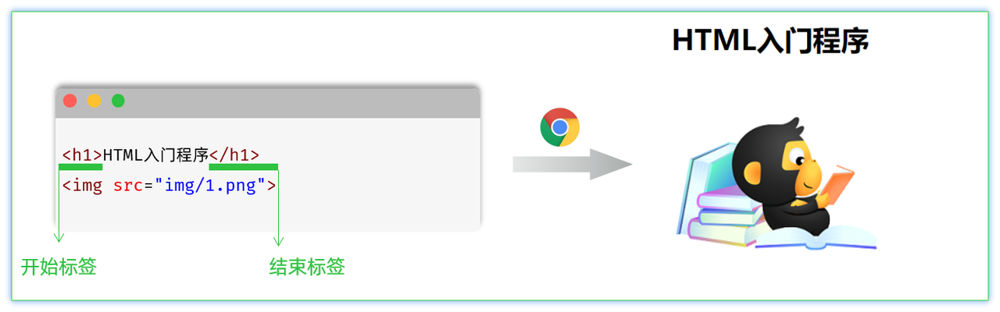
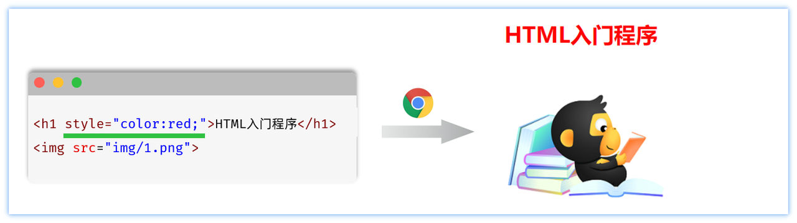
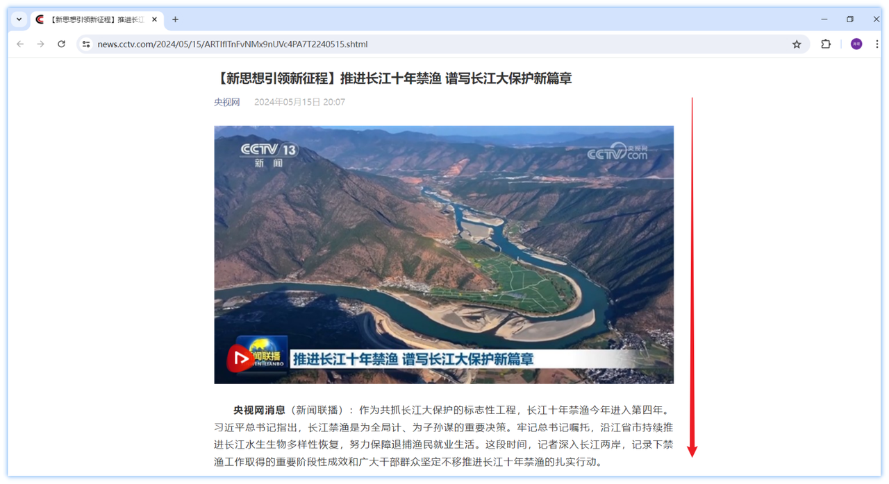
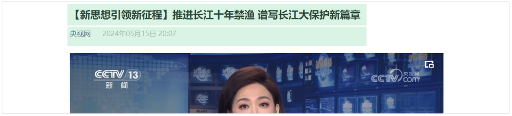
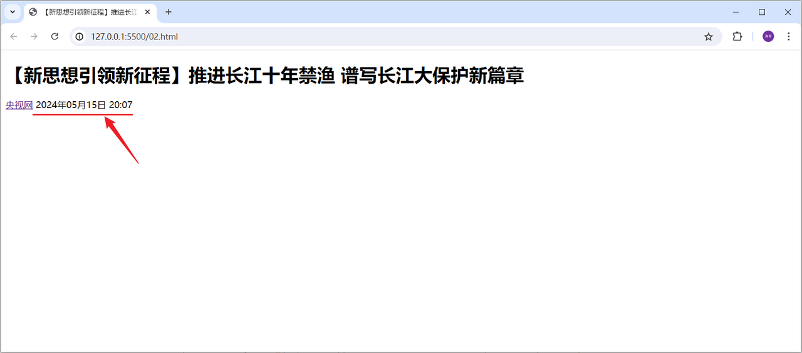
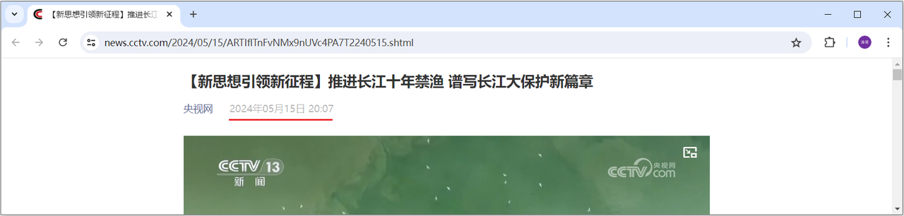

# 第一章：前端 Web 开发（HTML + CSS）

**目录：**

[TOC]

---

## 一、初识 Web 前端

### 1.1 介绍

我们介绍 Web 网站工作流程的时候提到，前端开发，主要的职责就是将数据以好看的样式呈现出来。说白了，就是开发网页程序，如下图所示：


主要明确以下三个问题：
1. 网页由哪些部分组成？
   * 文字、图片、音频、视频、超链接、表格等等。
2. 我们看到的网页，背后的本质是什么？
   * 前端程序员写的前端代码（备注：在前后端分离的开发模式中）。
3. 前端的代码是如何转换成用户眼中的网页的？
   * 通过浏览器转化（解析和渲染）成用户看到的网页。
   * 浏览器中对代码进行解析和渲染的部分，称为**浏览器内核**。

需要注意的是，不同的浏览器，内核不同，对于相同的前端代码解析的效果也会存在差异。那这就会造成一个问题：同一段前端程序，不同浏览器展示出来的效果是不一样的，那么用户的体验就很差了。而我们想达到的效果则是，即使用户使用的是不同的浏览器，解析同一段前端代码，最终展示出来的效果都是相同的。

要想达成这样一个目标，我们就需要定义一个统一的标准，然后让各大浏览器厂商都参照这个标准来实现即可。而这套标准其实早就已经定义好了，那就是接下来要介绍的 Web 标准。

### 1.2 Web 标准

**Web 标准**也称为**网页标准**，由一系列的标准组成，大部分由 W3C（World Wide Web Consortium，万维网联盟）负责制定。由三个部分组成：
* HTML：负责网页的**结构**（页面元素和内容）。
* CSS：负责网页的**表现**（页面元素的外观、位置等页面样式，如颜色、大小等）。
* JavaScript：负责网页的**行为**（交互效果）。

我们首先来讲解 Web 前端基础的第一部分：HTML 与 CSS。

> 什么是 HTML？
>
> **HTML**：**H**yper**T**ext **M**arkup **L**anguage，超文本标记语言。
> * 超文本：超越了文本的限制，比普通文本更强大。除了文字信息，还可以定义图片、音频、视频等内容。
> * 标记语言：由标签 “`<标签名>`” 构成的语言。
>   * HTML 标签都是预定义好的。例如：使用 `<h1>` 标签展示标题，使用 `<a>` 展示超链接，使用 `` 展示图片，使用 `<video>` 展示视频。
>   * HTML 代码直接在浏览器中运行，HTML 标签由浏览器解析。

下面展示的是一段 HTML 代码经过浏览器解析，呈现的效果如右图所示：


> 什么是 CSS？
>
> **CSS**：**C**ascading **S**tyle **S**heet，层叠样式表，用于控制页面的样式（表现）。

下面展示的是一段 HTML 代码及 CSS 样式经过浏览器解析，呈现的效果如右图所示：


## 二、HTML 快速入门

### 2.1 语法格式

HTML 文件的后缀名为 `.html`。

HTML 的基本骨架及标题定义如下：
```html
<html>
    <head>
        <title>HTML 快速入门</title>
    </head>
    <body>

    </body>
</html>
```

其中 `<html>` 是根标签，`<head>` 和 `<body>` 是子标签。
* `<head>`：定义网页的头部，用来存放给浏览器看的信息，如 CSS 样式、网页的标题。
* `<body>`：定义网页的主体部分，存放给用户看的信息，也是网页的主体内容，如文字、图片、视频、音频、表格等。

在 `<body>` 中编写 HTML 的核心内容：
```html
<html>
    <head>
        <title>HTML 快速入门</title>
    </head>
    <body>
        <h1>Hello HTML</h1>
        
    </body>
</html>
```

其中 `<h1>` 标签是一个一级标题的标签。`` 标签是一个图片标签，用来展示图片，而其中的 `src` 属性用来指定要展示的图片。

示例代码：
```html
<!-- 01.HTML快速入门.html --> 

<html>
    <head>
        <title>HTML 快速入门</title>
    </head>
    <body>
        <h1>Hello HTML</h1>
        
    </body>
</html>
```

### 2.2 总结

#### 2.2.1 HTML 页面的基础结构标签

HTML 页面的基础结构标签语法格式：
```html
<html>
    <head>
        <title> </title>
    </head>
    <body>

    </body>
</html>
```

`<title>` 中定义标题显式在浏览器的标题位置，`<body>` 中定义的你内容会呈现在浏览器的内容区域。

#### 2.2.2 HTML 中的标签特点

HTML 标签不区分大小写，建议小写。

HTML 标签的属性值，采用单引号、双引号都可以，一般写双引号。

HTML 语法相对比较松散。

## 三、前端开发工具

Visual Studio Code（简称 VS Code）是 Microsoft 于 2015 年 4 月发布的一款代码编辑器。VS Code 对前端代码有非常强大的支持，同时也支持其他编程语言（例如 C++、Java、Python、PHP、Go 等）。VS Code 提供了非常强大的插件库，大大提高了开发效率。

官网：[VS Code 官网](https://code.visualstudio.com "VS Code 官网")。

> 注意：
> * 不建议将软件装在包含中文名或空格的路径中。
> * 由于安装了 IDEA 快捷键的插件，因此 VSCode 快捷键与 IDEA 是一致的。

常用插件：
1. Chinese (Simplified) Language Pack。
2. HTML CSS Support。
3. JavaScript (ES6) code snippets。
4. Mithril Emmet。
5. Path Intellisense。
6. Vue 3 Snippets。
7. Auto Close Tag。
8. Auto Rename Tag。
9. open in browser。
10. Live Server。
11. Vue - Official。
12. File Utils。
13. IntelliJ IDEA Keybindings。
14. MarsCode AI：
    * MarsCode AI AI 助手账号注册：[MarsCode AI AI 助手账号注册](https://www.marscode.cn/home?utm_source=mkt&utm_medium=cpaitcast&utm_campaign=hmcxy "MarsCode AI AI 助手账号注册")。
15. TONGYI Lingma：
    * TONGYI Lingma AI 助手账号注册：[TONGYI Lingma AI 助手账号注册](https://account.aliyun.com/register/qr_register.htm?spm=5176.29741907.J_4VYgf18xNlTAyFFbOuOQe.d_register_1.e939154ab73d0j&oauth_callback=https%3A%2F%2Fwww.aliyun.com%2F "TONGYI Lingma AI 助手账号注册")。

在 VS Code 中，创建 .html 文件后，键入组合键 `! + Enter` 即可快速生成 HTML 文件的基本骨架。

示例代码：
```html
<!-- 02.HTML快速入门.html -->

<!-- 声明文档的类型为 HTML -->
<!DOCTYPE html>
<html lang="en">
<head>
    <!-- 字符集 -->
    <meta charset="UTF-8">
    <!-- 设置网页在移动设备上的显示宽度及缩放比例 -->
    <meta name="viewport" content="width=device-width, initial-scale=1.0">
    <title>HTML 快速入门</title>
</head>
<body>
    
    <h1>HTML 快速入门</h1>
    

    <!-- 定义一个一级标题，标题内容：Hello HTML -->
    <h1>Hello HTML</h1>

    <!-- 定义一个图片，路径：img/1.png -->
    </img>

</body>
</html>
```

## 四、常见标签和样式

在讲解 HTML 的常见基础标签及 CSS 的基本样式时，我们以新浪新闻页面为例来进行讲解。

央视新闻的具体页面效果如下：


我们可以看到，上述新闻网页其实分为两个部分，一个是新闻的标题部分，另一个是新闻的正文部分。

那么接下来，我们就先来完成央视新闻标题部分的制作。

### 4.1 央视新闻 - 标题



前面我们提到，我们在浏览器中看到的网页程序呈现出来的效果，实际上是浏览器解析并渲染了前端代码而呈现出来的。而我们所编写的 HTML 页面，在浏览器中渲染的时候，是从上往下逐行解析展示的。所以，我们在编写 HTML 页面的时候，要根据页面的布局，从上往下编写。

#### 4.1.1 标题排版



我们在 02.央视新闻-标题排版.html 文件中来制作新浪新闻网页，标题部分的排版内容为：
```html
<!-- 02.央视新闻-标题排版.html -->

```

那在上述我们用到的两个标签，一个是标题标签 `<h1></h1>`，另一个是超链接标题 `<a></a>`。这两个标签的具体用法如下。

标题标签 `h` 系列：
```html
<h1> 11111111111111 </h1>
<h2> 11111111111111 </h2>
<h3> 11111111111111 </h3>
<h4> 11111111111111 </h4>
<h5> 11111111111111 </h5>
<h6> 11111111111111 </h6>
```
效果：`h1` 为一级标题，字体也是最大的；`h6` 为六级标题，字体是最小的。

> 注意：
>
> HTML 标签是预定义好的，不能随意定义；也就意味着，标题标签就只有这六个，没有 `<h7>`。

超链接 `a` 标签：
* 标签：`<a href="..." target="...">央视网</a>`。
* 属性：
  * `href`：指定资源访问的 url。
  * `target`：指定在何处打开资源链接。
    * `_self`：默认值，在当前页面打开。
    * `_blank`：在空白页面打开。

#### 4.1.2 标题样式



我们可以看到，目前我们制作的新闻标题部分中，新闻发布时间 `2024年05月15日 20:07` 的字体颜色是黑色，而在原始的央视新闻页面中，字体的颜色呈现灰色。具体的呈现效果如下：


那接下来，我们要来控制字体的颜色，而这部分其实是属于网页的样式。所以这里需要通过 CSS 样式控制。

示例代码：
```html
<!-- 04.央视新闻-标题-样式.html -->

<!DOCTYPE html>
<html lang="en">
<head>
    <meta charset="UTF-8">
    <meta name="viewport" content="width=device-width, initial-scale=1.0">
    <title>【新思想引领新征程】推进长江十年禁渔 谱写长江大保护新篇章</title>
    <!-- 方式二：内部样式 -->
    <style>
        span {
            color: gray;
        }
    </style>

    <!-- 方式三：外部样式 -->
    <!-- <link rel="stylesheet" href="css/news.css"> -->
</head>
<body>
    <!-- 定义一个标题，标题的内容：【新思想引领新征程】推进长江十年禁渔 谱写长江大保护新篇章 -->
    <h1>【新思想引领新征程】推进长江十年禁渔 谱写长江大保护新篇章</h1>

    <!-- 定义一个超链接，里面展示 央视网 -->
    <a href="https://www.cctv.com/" target="_blank">央视网</a>

    <!-- 方式一：行内样式 -->
    <!-- <span style="color: gray;">2024年05月15日 20:07</span> -->
    
    <span>2024年05月15日 20:07</span>

</body>
</html>
```

##### 4.1.2.1 CSS 引入方式

在 HTML 的文件中，我们如何来编写 CSS 样式呢？此时涉及到 CSS 的三种引入方式。

具体有 3 种引入方式，语法如下表格所示：
| 名称 | 语法描述 | 示例 |
| :--: | :--: | :--: |
| 行内样式 | 在标签内使用 `style` 属性，属性值是 CSS 属性键值对 | `<h1 style="xxx:xxx;">中国新闻网</h1>` |
| 内部样式 | 定义 `<style>` 标签，在标签内部定义 CSS 样式 | `<style> h1 {...} </style>` |
| 外部样式 | 定义 `<link>` 标签，通过 `href` 属性引入外部 CSS 文件 | `link rel="stylesheet" href="css/news.css">` |

对于上述 3 种引入方式，企业开发的使用情况如下：
* 行内样式：会出现大量的代码冗余，不方便后期的维护，所以不常用（常配合 JS 使用）。
* 内部样式：通过定义 CSS 选择器，让样式作用于当前页面的指定的标签上（可以写在页面任何位置，但通常约定写在 `head` 标签中）。
* 外部样式：HTML 和 CSS 实现了完全的分离，企业开发常用方式。

##### 4.1.2.2 颜色表示方式

在前端程序开发中，颜色的表示方式常见的有如下三种：
| 表示方式 | 属性值 | 说明 | 取值 |
| :--: | :--: | :--: | :--: |
| 关键字 | 颜色英文单词 | `red`、`green`、`blue` | `red`、`green`、`blue` …… |
| rgb 表示法 | `rgb(r, g, b)` | 红绿蓝三原色，每项取值范围：0 - 255 | `rgb(0, 0, 0)`、`rgb(255, 255, 255)`、`rgb(255, 0, 0)` …… |
| rgba 表示法 | `rgba(r, g ,b, a)` | 红绿蓝三原色，`a` 表示透明度，取值：0 - 1 | `rgba(0, 0, 0, 0.3)`、`rgba(255, 255, 255, 0.5)` |
| 十六进制表示法 | `#rrggbb` | `#` 开头，将数字转换成十六进制表示 | `#000000`、`#ff0000`、`#cccccc`，简写：`#000`、`#f00`、`#ccc` |

> 注意：
>
> 在十六进制表示法中，`#` 后的 6 个数字两两为一组，分别表示红、绿、蓝，即 `#rrggbb`。当 `rr`、`gg` 或 `bb` 的两位数字相同时，即可简写为一位。

##### 4.1.2.3 设置字体颜色

示例代码：
```html
<!-- 04.央视新闻-标题-样式.html -->

<!DOCTYPE html>
<html lang="en">
<head>
    <meta charset="UTF-8">
    <meta name="viewport" content="width=device-width, initial-scale=1.0">
    <title>【新思想引领新征程】推进长江十年禁渔 谱写长江大保护新篇章</title>
    <!-- 方式二：内部样式 -->
    <style>
        span {
            /* 关键字 */
            /* color: gray; */

            /* RGB 表示法 */
            /* color: rgb(255, 0, 0); */

            /* RGBA 表示法 */
            /* color: rgba(255, 120, 0, 0); */

            /* 十六进制表示法 */
            /* color: #0000ff; */
            color: #b2b2b2;
        }
    </style>

    <!-- 方式三：外部样式 -->
    <!-- <link rel="stylesheet" href="css/news.css"> -->
</head>
<body>
    <!-- 定义一个标题，标题的内容：【新思想引领新征程】推进长江十年禁渔 谱写长江大保护新篇章 -->
    <h1>【新思想引领新征程】推进长江十年禁渔 谱写长江大保护新篇章</h1>

    <!-- 定义一个超链接，里面展示 央视网 -->
    <a href="https://www.cctv.com/" target="_blank">央视网</a>

    <!-- 方式一：行内样式 -->
    <!-- <span style="color: gray;">2024年05月15日 20:07</span> -->
    
    <span>2024年05月15日 20:07</span>

</body>
</html>
```

##### 4.1.2.4 CSS 选择器

顾名思义，选择器是选取需设置样式的元素（标签）。但是根据业务场景不同，选择的标签的需求也是多种多样的，所以选择器有很多种。

选择器通用语法如下：
```html
选择器名 {
    CSS 样式名: CSS 样式值;
    CSS 样式名: CSS 样式值
}
```