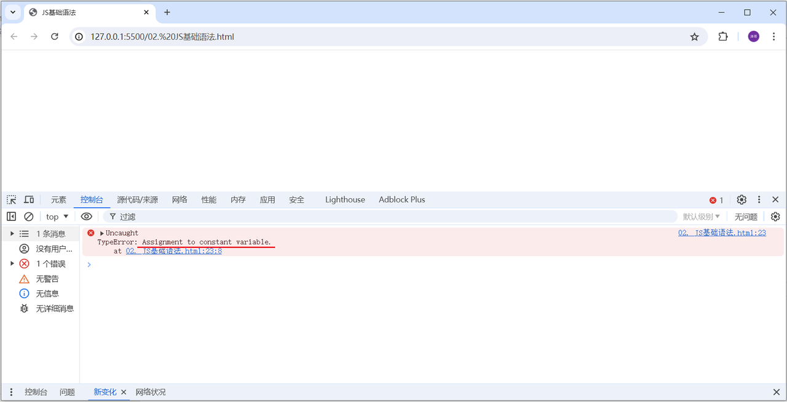
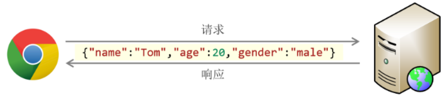
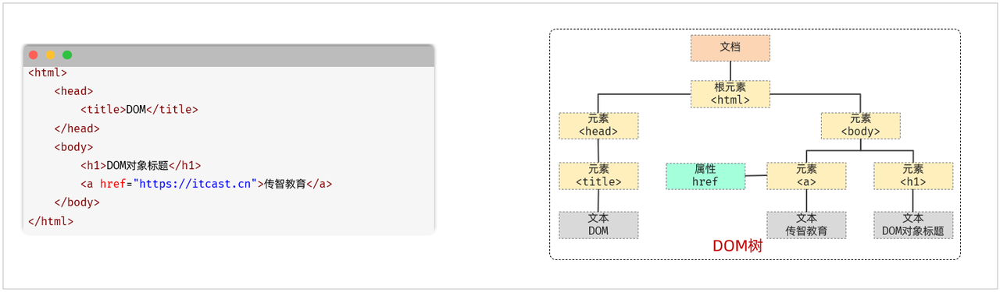
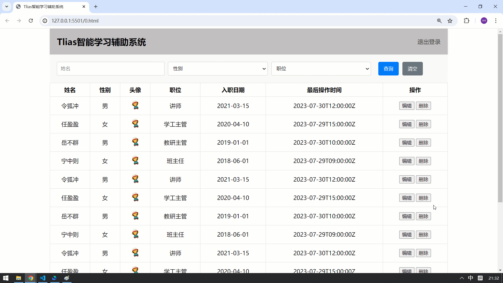
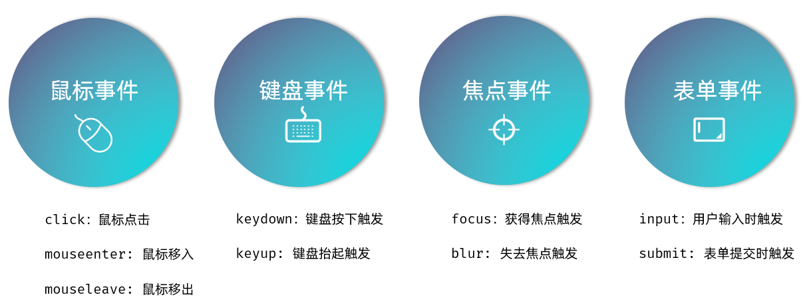

# 第二章：前端 Web 开发（JS + Vue + Ajax）

**目录：**

[TOC]

---

**介绍：**

在前面的课程中，我们已经学习了 HTML、CSS 的基础内容。我们知道 HTML 负责网页的结构，而 CSS 负责的是网页的表现；而要想让网页具备一定的交互效果、具有一定的动作行为，还得通过 JavaScript 来实现。

本章，我们就来讲解 JavaScript，这门语言会让我们的页面能够和用户进行交互。

**那么，什么是 JavaScript 呢？**

**JavaScript**（简称：**JS**）是一门跨平台、面向对象的脚本语言，是用来控制网页行为的，可以实现人机交互效果。

JavaScript 和 Java 是完全不同的语言，不论是概念还是设计；但是基础语法类似。

组成：
* ECMAScript：规定了 JS 基础语法核心知识，包括变量、数据类型、流程控制、函数、对象等。
* BOM：浏览器对象模型，用于操作浏览器本身；如：页面弹窗、地址栏操作、关闭窗口等。
* DOM：文档对象模型，用于操作 HTML 文档；如：改变标签内的内容、改变标签内字体样式等。

> 备注：ECMA 国际（前身为欧洲计算机制造商协会）制定了标准化的脚本程序设计语言 ECMAScript，这种语言得到广泛应用。而 JavaScript 是遵守 ECMAScript 的标准的（ES2024 是最新版本）。

## 一、JS 核心语法

### 1.1 JS 引入方式

同样，JS 代码也是书写在 HTML 中的。那么 HTML 中如何引入 JS 代码呢？

HTML 中引入 JS 代码主要通过下面的 2 种引入方式。

**第一种方式 - 内部脚本：**

内部脚本方式将 JS 代码定义在 HTML 页面中。
* JavaScript 代码必须位于 `<script></script>` 标签之间。
* 在 HTML 文档中，**可以在任意地方，放置任意数量的 `<script></script>`**。
* **一般会把脚本置于 <body> 元素的底部，可改善显示速度。**

示例代码：
```html
<!DOCTYPE html>
<html lang="en">
<head>
    <meta charset="UTF-8">
    <meta name="viewport" content="width=device-width, initial-scale=1.0">
    <title>JS 引入方式</title>
</head>
<body>

    <script>
        alert('Hello JS')
    </script>
</body>
</html>
```

**第二种方式 - 外部脚本：**

外部脚本方式将 JS 代码定义在外部 JS 文件中，然后引入到 HTML 页面中。
* 外部 JS 文件中，只包含 JS 代码，不包含 `<script>` 标签。
* 引入外部 JS 的 `<script>` 标签，必须是双标签。

示例代码：
* 在 js 目录下，定义一个 JS 文件 demo.js，在文件中编写 JS 代码。如下所示：
    ```javascript
    alert('Hello JS')
    ```
* 在 HTML 文件中，通过 <script></script> 引入 JS 文件 demo.js，如下：
    ```html
    <script src="js/demo.js"></script>
    ```

> 注意：
> 1. demo.js 中只有 JS 代码，没有 `<script>` 标签。
> 2. 通过 `<script></script>` 标签引入外部 JS 文件时，标签不能自闭合；如：`<script src="js/demo.js" />`。

JS 书写规范：
* 结束符：每行 JS 代码，结尾以分号结尾，而结尾的分号可有可无。（建议在一个项目中保持一致，要么全部都加，要么全部都不加。）
* 注释：单行注释、多行注释的写法，与 Java 中一致。

示例代码：

```html
<!-- 01.JS-引入方式.html -->

<!DOCTYPE html>
<html lang="en">
<head>
  <meta charset="UTF-8">
  <meta name="viewport" content="width=device-width, initial-scale=1.0">
  <title>JS-引入方式</title>
</head>
<body>

  <!-- <script>
    // 1. 内部脚本
    alert('Hello JS');
  </script> -->

  <!-- 2. 外部脚本 -->
  <script src="js/demo.js"></script>
</body>
</html>
```

```javascript
/* demo.js */

alert('Hello JavaScript');
```

### 1.2 JS 基础语法

#### 1.2.1 输出语句

在 JS 中有 3 种输出语句，分别是：
| api | 描述 |
| :--: | :--: |
| `window.alert(...)` | 警告框 |
| `document.write(...)` | 在 HTML 输出内容 |
| `console.log(...)` | 写入浏览器控制台 |

示例代码：
```html
<!-- 02.JS-基础语法.html -->

<!DOCTYPE html>
<html lang="en">
<head>
  <meta charset="UTF-8">
  <meta name="viewport" content="width=device-width, initial-scale=1.0">
  <title>JS-基础语法</title>
</head>
<body>
  

  <script>
    // 1. 声明变量
    // let a = 10;
    // a = "Hello";
    // a = true;

    // alert(a); // 弹出框

    // 2. 声明常量
    const PI = 3.14;
    // PI = 5.0;

    console.log(PI);  // 输出到控制台
    // document.write(PI); // 输出到 body 区域（不常用）
  </script>
</body>
</html>
```

#### 1.2.2 变量与常量

##### 1.2.2.1 变量

接下来，我们再来讲解 JS 中的变量。

在 JS 中，变量的声明和 Java 中还是不同的。
* JS 中主要通过 `let` 关键字来声明变量的。
* JS 是一门弱类型语言，变量是可以存放不同类型的值的。
* 变量名需要遵循如下规则：
  * 组成字符可以是任何字母、数字、下划线（`_`）或美元符号（`$`），且数字不能开头。
  * 变量名严格区分大小写；如：`name` 和 `Name` 是不同的变量。
  * 不能使用关键字作为变量名；如：`let`、`if`、`for` 等。

变量的声明示例如下所示：
```html
<script>
    // 变量
    let a = 20;
    a = "Hello";
    alert(a);
</script>
```

在上述的示例中，我们会看到，变量 `a` 既可以存数字，又可以存字符串，因为 JS 是弱类型语言。

> 注意：
>
> 在早期的 JS 中，声明变量还可以使用 var 关键字来声明。例如：
> ```html
> <body>
> 
>     <scrip>
>         // var 声明变量
>         var name = "A";
>         name = "B";
>         alert(name);
> 
>         var name = "C";
>         alert(name);
>     </script>
> </body>
> ```
>
> 打开浏览器运行之后，我们会发现，可以正常执行：第一次弹出 `B`，第二次弹出 `C`。我们看到 `name` 变量重复声明了，但是如果使用 `var` 关键字，是没有问题的，可以重复声明。
>
> `var` 声明的变量还有一些其他不严谨的地方，这里就不再一一列举了。所以这个声明变量的关键字并不严谨，**因此不推荐使用**。

#### 1.2.2.2 常量

在 JS 中，如果声明一个常量，需要使用 `const` 关键字。一旦声明，常量的值就不能改变（不可以重新赋值）。

如下所示：
```html
<body>

    <script>
        // 常量
        const PI = 3.14;
        PI = 3.15;
        alert(PI);
    </script>
</body>
```

浏览器打开之后，会报如下错误：


该错误就表示，常量不可以被重新分配值。

##### 1.2.2.3 举例

示例代码：
```html
<!-- 02.JS-基础语法.html -->

<!DOCTYPE html>
<html lang="en">
<head>
  <meta charset="UTF-8">
  <meta name="viewport" content="width=device-width, initial-scale=1.0">
  <title>JS-基础语法</title>
</head>
<body>
  

  <script>
    // 1. 声明变量
    // let a = 10;
    // a = "Hello";
    // a = true;

    // alert(a); // 弹出框

    // 2. 声明常量
    const PI = 3.14;
    // PI = 5.0;

    console.log(PI);  // 输出到控制台
    // document.write(PI); // 输出到 body 区域（不常用）
  </script>
</body>
</html>
```

#### 1.2.3 数据类型

虽然 JS 是弱数据类型的语言，但是 JS 中也存在数据类型。

JS 中的数据类型分为：原始数据类型和引用数据类型。

原始数据类型主要包含以下几种类型：
| 数据类型 | 描述 |
| :--: | :--: |
| `number` | 数字（整数、小数、NaN（Not a Number）） |
| `string` | 字符串，单引号（`'...'`）、双引号（`"..."`）、反引号（\``...`\`）皆可，正常使用推荐**单引号** |
| `boolean` | 布尔，`true`、`false` |
| `null` | 对象为空；JavaScript 是大小写敏感的，因此 `null`、`Null`、`NULL` 是完全不同的 |
| `undefined` | 当声明的变量未初始化时，该变量的默认值是 `undefined` |

使用 `typeof` 关键字可以返回变量的数据类型。

对于字符串类型的数据，除了可以使用双引号（`"..."`）、单引号（`'...'`）以外，还可以使用反引号（\``...`\`）。而使用反引号引起来的字符串，也称为**模板字符串**。
* 模板字符串的使用场景：拼接字符串和变量。
* 模板字符串的语法：
  * \``...`\`：反引号（英文输入模式下，键盘 tab 键上方波浪线 ~ 的键）。
  * 内容拼接时，使用 `${ }` 来引用变量。

示例代码：
```html
<!-- 03.JS-数据类型.html -->

<!DOCTYPE html>
<html lang="en">
<head>
  <meta charset="UTF-8">
  <meta name="viewport" content="width=device-width, initial-scale=1.0">
  <title>JS-数据类型</title>
</head>
<body>
  

  <script>
    //1. 数据类型
    // alert(typeof 10); // number
    // alert(typeof 1.5);  // number
    
    // alert(typeof true); // boolean
    // alert(typeof false);  // boolean

    // alert(typeof "Hello");  // string
    // alert(typeof 'JS'); // string
    // alert(typeof `JavaScript`); // string

    // alert(typeof null); // null ? -> object

    // let a ;
    // alert(typeof a);  // undefined

    // 2. 模板字符串 - 简化字符串拼接
    let name = 'Tom';
    let age = 18;

    console.log('我是 ' + name + '，我今年 ' + age + ' 岁');
    console.log(`我是 ${name}，我今年 ${age} 岁`);
    
    
  </script>
</body>
</html>
```

#### 1.2.4 函数

**函数（function）**是被设计用来执行特定任务的代码块，方便程序的封装复用。我们学习函数，主要就是学习 JS 中函数的定义及调用的语法。

##### 1.2.4.1 方式一

语法格式：
```javascript
function 函数名(参数1, 参数2, ...) {
  // 要执行的代码
}
```

因为 JavaScript 是弱数据类型的语言，所以有如下几点需要注意：
* 形参不需要声明类型，并且 JS 中不管什么类型都是 `let` 去声明，加上也没有意义。
* 返回值也不需要声明类型，直接 `return` 即可。

示例代码：
```javascript
function add(a, b) {
  return a + b;
}
```

如果要调用上述的函数 `add`，可以使用 `函数名称(实际参数列表)`：
```javascript
let result = add(10, 20);
alert(result);
```

我们在调用 `add` 函数时，再添加 2 个参数，修改代码如下：
```javascript
var result = add(10, 20, 30, 40);
alert(result);
```

浏览器打开，发现没有错误，并且依然弹出 `30`，这是为什么呢？

因为在 JavaScript 中，函数的调用只需要名称正确即可，可以不管参数列表。如上述案例，`10` 传递给了变量 `a`，`20` 传递给了变量 `b`，而 `30` 和 `40` 没有变量接受，但是不影响函数的正常调用。

> 注意：
>
> 由于 JS 是弱类型语言，形参、返回值都不需要指定类型。在调用函数时，实参个数与形参个数可以不一致，但是**建议一致**。

##### 1.2.4.2 方式二

刚才我们定义函数，是为函数指定了一个名字。那我们也可以不为函数指定名字，这一类的函数我们称之为**匿名函数**。那么，接下来的方式二就来介绍一下匿名函数的定义和调用。

匿名函数定义可以通过两种方式：**函数表达式** 和 **箭头函数**。

* 示例一（函数表达式）：
```javascript
var add = function (a, b) {
  return a + b;
}
```

* 示例二（**箭头函数**）：
```javascript
var add = (a, b) => {
  return a + b;
}
```

上述匿名函数声明好了之后，是将这个函数赋值给了 `add` 变量，那么我们就可以直接通过 `add` 函数直接调用。调用代码如下：
```javascript
let result = add(10, 20);
alert(result);
```

而箭头函数这种形式，在现在的前端开发中用得会更多一些。

示例代码：
```html
<!-- 04.JS-函数.html -->

<!DOCTYPE html>
<html lang="en">
<head>
  <meta charset="UTF-8">
  <meta name="viewport" content="width=device-width, initial-scale=1.0">
  <title>JS-函数</title>
</head>
<body>
  

  <script>
    // 1. 函数的定义及调用 - 具名函数
    // function add(a, b) {
    //   return a + b;
    // }

    // let result = add(10, 20, 50);
    // console.log(result);


    // 2. 函数定义及调用 - 匿名函数
    // 2.1 函数表达式
    // let add = function(a, b) {
    //   return a + b;
    // }

    // let result = add(100, 200);
    // console.log(result);

    // 2.2 箭头函数
    let add = (a, b) => {
      return a + b;
    }

    let result = add(1000, 2000);
    console.log(result);


  </script>
</body>
</html>
```

##### 1.2.4.3 自定义对象

在 JavaScript 中自定义对象特别简单，其语法格式如下：
```javascript
let 对象名 = {
  属性名1: 属性值1,
  属性名2: 属性值2,
  属性名3: 属性值3,
  方法名称: function(形参列表) {
    ...
  }
};
```

其中，上述函数定义的语法可以简化成如下格式：
```javascript
let 对象名 = {
  属性名1: 属性值1,
  属性名2: 属性值2,
  属性名3: 属性值3,
  方法名称() {
    ...
  }
}
```

我们可以通过如下语法调用属性：
```javascript
对象名.属性名
```

通过如下语法调用函数：
```javascript
对象名.方法名()
```

示例代码：
```html
<!-- 05.JS-自定义对象.html -->

<!DOCTYPE html>
<html lang="en">
<head>
  <meta charset="UTF-8">
  <meta name="viewport" content="width=device-width, initial-scale=1.0">
  <title>JS-函数</title>
</head>
<body>
  

  <script>
    // 1. 自定义对象

    // let user = {
    //   name: 'Tom',
    //   age: 18,
    //   gender: '男',
    //   sing: function() {
    //     alert(this.name + ' 悠悠地唱着最炫的民族风~');
    //   }
    // };

    let user = {
      name: 'Tom',
      age: 18,
      gender: '男',
      sing() {
        alert(this.name + ' 悠悠地唱着最炫的民族风~');
      }
    };

    // let user = {
    //   name: 'Tom',
    //   age: 18,
    //   gender: '男',
    //   sing: () => { // 注意：在箭头函数中，this 并不指向当前对象 - 指向的是当前对象的父级（不推荐）
    //     alert(this + ' 悠悠地唱着最炫的民族风~');
    //   }
    // };

    // 2. 调用对象属性 / 方法
    alert(user.name);
    user.sing();

  </script>
</body>
</html>
```

> 注意：
>
> 在定义对象中的方法时，尽量不要使用箭头函数；因为在箭头函数中，this 并不指向当前对象，指向的是当前对象的父级。

##### 1.2.4.4 JSON

JSON：**J**ava**S**cript **O**bject **N**otation，JavaScript 对象标记法。JSON 是通过 JS 对象标记法书写的**文本**，其格式如下：
```javascript
{
  "key":value,
  "key":value,
  "key":value
}
```

其中，`key` 必须使用引号并且是双引号标记，`value` 可以是任意数据类型。

由于语法简单，层级结构鲜明，现多用于作为**数据载体**，在网络中进行数据传输。



示例代码：
```html
<!-- 05.JS-自定义对象.html -->

<!DOCTYPE html>
<html lang="en">
<head>
  <meta charset="UTF-8">
  <meta name="viewport" content="width=device-width, initial-scale=1.0">
  <title>JS-函数</title>
</head>
<body>
  

  <script>
    // 1. 自定义对象

    // let user = {
    //   name: 'Tom',
    //   age: 18,
    //   gender: '男',
    //   sing: function() {
    //     alert(this.name + ' 悠悠地唱着最炫的民族风~');
    //   }
    // };

    let user = {
      name: 'Tom',
      age: 18,
      gender: '男',
      sing() {
        alert(this.name + ' 悠悠地唱着最炫的民族风~');
      }
    };

    // let user = {
    //   name: 'Tom',
    //   age: 18,
    //   gender: '男',
    //   sing: () => { // 注意：在箭头函数中，this 并不指向当前对象 - 指向的是当前对象的父级（不推荐）
    //     alert(this + ' 悠悠地唱着最炫的民族风~');
    //   }
    // };

    // 2. 调用对象属性 / 方法
    // alert(user.name);
    // user.sing();

    // 3. JSON - JS 对象标记法
    let person = {
      name: 'itcast',
      age: 18,
      gender: '男'
    };
    alert(JSON.stringify(person));  // JS 对象 -> JSON 字符串

    let personJson = '{"name": "heima", "age": 18}';
    alert(JSON.parse(personJson).name);

  </script>
</body>
</html>
```

API 说明：
* `JSON.stringify(...)`：作用就是将 JS 对象转换为 JSON 格式的字符串。
* `JSON.parse(...)`：作用就是将 JSON 格式的字符串，转换为 JS 对象。

#### 1.2.5 流程控制

在 JS 中，当然也存在对应的流程控制语句。常见的流程控制语句如下：
* `if ... else if ... else ...`。
* `switch`。
* `for`。
* `while`。
* `do ... while`。

而 JS 中的流程控制语句与 Java 中的流程控制语句的作用、执行机制都是一样的，此处不再赘述。

#### 1.2.6 JS DOM

##### 1.2.6.1 DOM 介绍

DOM（Document Object Model）：文档对象模型，也就是 JavaScript 将 HTML 文档的各个组成部分封装为对象。

DOM 其实我们并不陌生，之前在学习 XML 时就接触过；只不过 XML 文档中的标签需要我们写代码解析，而 HTML 文档是浏览器解析。

封装的对象分为：
* Document：整个文档对象，即整个 HTML 页面被封装为 Document 对象。
* Element：元素对象，即每一个标签都会被封装成一个元素对象。
* Attribute：属性对象，即每一个标签的属性都会被封装成一个属性对象。
* Text：文本对象，即每一对标签之间的文本内容都会被封装成一个文本对象。
* Comment：注释对象，即 HTML 文档中的注释会被封装成注释对象。

如下图，左边是 HTML 文档内容，右边是 DOM 树：


那么我们学习 DOM 技术有什么用呢？主要作用如下：
* 改变  HTML 元素的内容；
* 改变 HTML 元素的样式（CSS）；
* 对 HTML DOM 事件作出反应；
* 添加和删除 HTML 元素。

##### 1.2.6.2 DOM 操作

DOM 的核心思想：将网页的内容当做对象来处理，标签的所有属性在该对象上都可以找到；并且修改这个对象的属性，就会自动映射到标签身上。

document 对象：
* 网页中所有内容都封装在 document 对象中。
* 它提供的属性和方法都是用来访问和操作网页内容的；如：`document.write(...)`。

DOM 操作步骤：
1. 获取要操作的 DOM 元素对象。
2. 操作 DOM 对象的属性或方法（查阅文档）。

> 注意：
>
> 在查阅关于操作 DOM 对象的属性或方法的文档时，推荐 W3School 文档：[W3School 文档](https://www.w3school.com.cn/)。

我们可以通过如下两种方式来获取 DOM 元素：
* 根据 CSS 选择器来获取 DOM 元素，获取到匹配到的第一个元素：`document.querySelectoe('CSS 选择器');`。
* 根据 CSS 选择器来获取 DOM 元素，获取匹配到的所有元素：`document.querySelectorAll('CSS 选择器');`。

> 注意：
>
> 获取到的所有元素，会封装到一个 `NodeList` 结点集合中，是一个伪数组（有长度、有索引的数组，但没有 `push`、`pop` 等数组方法）。

示例代码：
```html
<!-- 07.JS-DOM.html -->

<!DOCTYPE html>
<html lang="en">
<head>
  <meta charset="UTF-8">
  <meta name="viewport" content="width=device-width, initial-scale=1.0">
  <title>JS-DOM</title>
</head>
<body>

  <h1 id="title1">11111</h1>
  <h1>22222</h1>
  <h1>33333</h1>

  <script>
    // 1. 修改第一个 h1 标签中的文本内容
    // 1.1 获取 DOM 对象
    // let h1 = document.querySelector('#title1');
    // let h1 = document.querySelector('h1');  // 获取第一个 h1 标签

    let hs = document.querySelectorAll('h1');

    // 1.2 调用 DOM 对象中的属性或方法
    // h1.innerHTML = '修改后的文本内容';
    hs[0].innerHTML = '修改后的文本内容';
  </script>
</body>
</html>
```

> 注意：
>
> 在早期的 JS 中，我们也可以通过如下方法获取 DOM 元素：
> * `document.getElementById(...)`：根据 `id` 属性值获取，返回单个 Element 对象。
> * `document.getElementsByTagName(...)`：根据标签名称获取，返回 Element 对象数组。
> * `document.getElementsByName()`：根据 `name` 属性值获取，返回 Element 对象数组。
> * `document.getElementsByClassName()`：根据 `class` 属性值获取，返回 Element 对象数组。

## 二、JS 事件监听

### 2.1 事件介绍

什么是事件呢？HTML 事件是发生在 HTML 元素上的“事情”。例如：
* 按钮被点击。
* 鼠标移到元素上。
* 输入框失去焦点。
* 按下键盘按键。
* ……

而我们可以给这些事件绑定函数，当事件触发时，可以自动地完成对应的功能，这就是事件监听。

JS 事件是 JS 非常重要的一部分，接下来我们进行事件的学习。那么我们对于 JavaScript 事件需要学习哪些内容呢？我们得知道有哪些常用事件，然后我们得学会如何给事件绑定函数。

所以主要围绕 2 点来学习：①. 事件监听、②. 常用事件。

### 2.2 事件监听语法

JS 事件监听的语法格式：
```javascript
事件源.addEventListener('事件类型', 事件触发执行的函数);
```

在上述的语法中包含三个要素：
* 事件源：哪个 DOM 元素触发了事件，要获取 DOM 元素。
* 事件类型：用什么方式触发；比如：鼠标单击 `click`，鼠标经过 `mouseover`。
* 事件触发执行的函数：要做什么事。

JavaScript 对于事件的绑定还提供了另外 2 种方式（早期版本）：

1). 通过 HTML 标签中的事件属性进行绑定

通过 HTML 标签中的 `on事件` 属性进行绑定。

例如一个按钮，我们对于按钮可以绑定单击事件，可以借助标签的 `onclick` 属性，属性值指向一个函数。

示例代码：
```html
<input type="button" id="btn1" value="点我一下试试1" onclick="on()">

<script>
  function on() {
    alert('按钮 1 被点击了 ……');
  };
</script>
```

2). 通过 DOM 中 Element 元素的事件属性进行绑定

依据我们学习过的 DOM 的知识点，我们知道 HTML 中的标签被加载成 Element 对象，所以我们也可以通过 Element 对象的属性来操作标签的属性。

语法格式如下：
```javascript
事件源.on事件 = function() {
  ...
}
```

例如一个按钮，我们对于按钮可以绑定单击事件，可以通过 DOM 元素的属性，为其做事件绑定。

示例代码：
```html
<body>
  <input type="button" id="btn2" value="点我一下试试2">
  <script>
    document.querySelector('#btn2').onclick = function() {
      alert("按钮 2 被点击了 ……");
    };
  </script>
</body>
```

整体代码如下：
```html
<!DOCTYPE html>
<html lang="en">
<head>
  <meta charset="UTF-8">
  <meta http-equiv="X-UA-Compatible" content="IE=edge">
  <meta name="viewport" content="width=device-width, initial-scale=1.0">
  <title>JS-事件-事件绑定</title>
</head>

<body>
  <input type="button" id="btn1" value="事件绑定1">
  <input type="button" id="btn2" value="事件绑定2">
  <script>
    document.querySelector("#btn1").addEventListener('click', () => {
      alert("按钮 1 被点击了 ……");
    })

    document.querySelector('#btn2').onclick = function() {
      alert("按钮 2 被点击了 ……");
    }
  </script>
</body>
</html>
```

> 注意：
>
> `addEventListener` 与 `on` 事件 区别：
> * `on` 方式 会被覆盖，`addEventListener` 方式 可以绑定多次，拥有更多特性，推荐使用 `addEventListener`。

示例代码：
```html
<!-- 08.JS-事件监听.html -->

<!DOCTYPE html>
<html lang="en">
<head>
  <meta charset="UTF-8">
  <meta name="viewport" content="width=device-width, initial-scale=1.0">
  <title>JS事件</title>
</head>
<body>
  
  <input type="button" id="btn1" value="点我一下试试1">
  <input type="button" id="btn2" value="点我一下试试2">

  <script>
    // 事件监听 - addEventListener（可以多次绑定同一事件）
    document.querySelector('#btn1').addEventListener('click', function() {
      console.log('试试就试试~~');
    });
    document.querySelector('#btn1').addEventListener('click', function() {
      console.log('试试就试试22~~');
    });

    // 事件绑定 - 早期写法 - onclick（如果多次绑定同一事件，覆盖）
    document.querySelector('#btn2').onclick = () => {
      console.log('试试就试试~~');
    };
    document.querySelector('#btn2').onclick = () => {
      console.log('试试就试试22~~');
    };
  </script>
</body>
</html>
```

### 2.3 隔行换色案例

**需求：** 实现鼠标移入数据行时，背景色改为 `#f2e2e2`；鼠标移出时，再将背景色改为白色。

**效果：**


示例代码：
```html
<!-- 09.JS-案例-员工列表.html -->

<!DOCTYPE html>
<html lang="zh-CN">
<head>
    <meta charset="UTF-8">
    <title>Tlias智能学习辅助系统</title>
    <style>
        /* 导航栏样式 */
        .navbar {
            background-color: #b5b3b3; /* 灰色背景 */
            
            display: flex; /* flex弹性布局 */
            justify-content: space-between; /* 左右对齐 */

            padding: 10px; /* 内边距 */
            align-items: center; /* 垂直居中 */
        }
        .navbar h1 {
            margin: 0; /* 移除默认的上下外边距 */
            font-weight: bold; /* 加粗 */
            color: white;
            /* 设置字体为楷体 */
            font-family: "楷体";
        }
        .navbar a {
            color: white; /* 链接颜色为白色 */
            text-decoration: none; /* 移除下划线 */
        }

        /* 搜索表单样式 */
        .search-form {
            display: flex;
            flex-wrap: nowrap;
            align-items: center;
            gap: 10px; /* 控件之间的间距 */
            margin: 20px 0;
        }
        .search-form input[type="text"], .search-form select {
            padding: 5px; /* 输入框内边距 */
            width: 260px; /* 宽度 */
        }
        .search-form button {
            padding: 5px 15px; /* 按钮内边距 */
        }

        /* 表格样式 */
        table {
            width: 100%;
            border-collapse: collapse;
        }
        th, td {
            border: 1px solid #ddd; /* 边框 */
            padding: 8px; /* 单元格内边距 */
            text-align: center; /* 左对齐 */
        }
        th {
            background-color: #f2f2f2;
            font-weight: bold;
        }
        .avatar {
            width: 30px;
            height: 30px;
        }

        /* 页脚样式 */
        .footer {
            background-color: #b5b3b3; /* 灰色背景 */
            color: white; /* 白色文字 */
            text-align: center; /* 居中文本 */
            padding: 10px 0; /* 上下内边距 */
            margin-top: 30px;
        }

        #container {
            width: 80%; /* 宽度为80% */
            margin: 0 auto; /* 水平居中 */
        }
    </style>
</head>
<body>
    <div id="container">
        <!-- 顶部导航栏 -->
        <div class="navbar">
            <h1>Tlias智能学习辅助系统</h1>
            <a href="#">退出登录</a>
        </div>

        <!-- 搜索表单区域 -->
        <form class="search-form" action="/search" method="post">
            <label for="name">姓名：</label>
            <input type="text" id="name" name="name" placeholder="请输入姓名">

            <label for="gender">性别：</label>
            <select id="gender" name="gender">
                <option value=""></option>
                <option value="1">男</option>
                <option value="2">女</option>
            </select>

            <label for="position">职位：</label>
            <select id="position" name="position">
                <option value=""></option>
                <option value="1">班主任</option>
                <option value="2">讲师</option>
                <option value="3">学工主管</option>
                <option value="4">教研主管</option>
                <option value="5">咨询师</option>
            </select>

            <button type="submit">查询</button>
            <button type="reset">清空</button>
        </form>

        <!-- 表格展示区 -->
        <table>
            <!-- 表头 -->
            <thead>
                <tr>
                    <th>姓名</th>
                    <th>性别</th>
                    <th>头像</th>
                    <th>职位</th>
                    <th>入职日期</th>
                    <th>最后操作时间</th>
                    <th>操作</th>
                </tr>
            </thead>

            <!-- 表格主体内容 -->
            <tbody>
                <tr>
                    <td>令狐冲</td>
                    <td>男</td>
                    <td></td>
                    <td>讲师</td>
                    <td>2021-06-15</td>
                    <td>2024-09-16 15:30</td>
                    <td class="action-buttons">
                        <button type="button">编辑</button>
                        <button type="button">删除</button>
                    </td>
                </tr>
                <tr>
                    <td>任盈盈</td>
                    <td>女</td>
                    <td></td>
                    <td>咨询师</td>
                    <td>2021-07-20</td>
                    <td>2024-09-17 09:00</td>
                    <td class="action-buttons">
                        <button type="button">编辑</button>
                        <button type="button">删除</button>
                    </td>
                </tr>
                <tr>
                    <td>向问天</td>
                    <td>男</td>
                    <td></td>
                    <td>班主任</td>
                    <td>2021-05-01</td>
                    <td>2024-09-15 17:45</td>
                    <td class="action-buttons">
                        <button type="button">编辑</button>
                        <button type="button">删除</button>
                    </td>
                </tr>
                <tr>
                    <td>任我行</td>
                    <td>男</td>
                    <td></td>
                    <td>教研主管</td>
                    <td>2021-05-01</td>
                    <td>2024-09-15 17:45</td>
                    <td class="action-buttons">
                        <button type="button">编辑</button>
                        <button type="button">删除</button>
                    </td>
                </tr>
                <tr>
                    <td>田伯光</td>
                    <td>男</td>
                    <td></td>
                    <td>班主任</td>
                    <td>2021-06-15</td>
                    <td>2024-09-16 15:30</td>
                    <td class="action-buttons">
                        <button type="button">编辑</button>
                        <button type="button">删除</button>
                    </td>
                </tr>
                <tr>
                    <td>不戒</td>
                    <td>女</td>
                    <td></td>
                    <td>班主任</td>
                    <td>2021-07-20</td>
                    <td>2024-09-17 09:00</td>
                    <td class="action-buttons">
                        <button type="button">编辑</button>
                        <button type="button">删除</button>
                    </td>
                </tr>
                <tr>
                    <td>左冷禅</td>
                    <td>男</td>
                    <td></td>
                    <td>班主任</td>
                    <td>2021-05-01</td>
                    <td>2024-09-15 17:45</td>
                    <td class="action-buttons">
                        <button type="button">编辑</button>
                        <button type="button">删除</button>
                    </td>
                </tr>
                <tr>
                    <td>定逸</td>
                    <td>女</td>
                    <td></td>
                    <td>班主任</td>
                    <td>2021-05-01</td>
                    <td>2024-09-15 17:45</td>
                    <td class="action-buttons">
                        <button type="button">编辑</button>
                        <button type="button">删除</button>
                    </td>
                </tr>
                <tr>
                    <td>东方兄弟</td>
                    <td>男</td>
                    <td></td>
                    <td>讲师</td>
                    <td>2021-05-01</td>
                    <td>2024-09-15 17:45</td>
                    <td class="action-buttons">
                        <button type="button">编辑</button>
                        <button type="button">删除</button>
                    </td>
                </tr>
                <tr>
                    <td>金庸</td>
                    <td>男</td>
                    <td></td>
                    <td>咨询师</td>
                    <td>2021-05-01</td>
                    <td>2024-09-15 17:45</td>
                    <td class="action-buttons">
                        <button type="button">编辑</button>
                        <button type="button">删除</button>
                    </td>
                </tr>
            </tbody>
        </table>

        <!-- 页脚版权区域 -->
        <footer class="footer">
            <p>江苏传智播客教育科技股份有限公司</p>
            <p>版权所有 Copyright 2006-2024 All Rights Reserved</p>
        </footer>
    </div>

    <script>
        // 需求：通过 JS 为上述的表格中数据行添加事件监听
        // 实现：鼠标进入后，背景色需要设置为 #f2e2e2；鼠标离开后，背景色需要设置为 #fff
        // （注意：需要使用 JS 新版本的语法）

        // 1. 获取所有的 tr 标签
        let trs = document.querySelectorAll('tr');

        // 2. 为每一个 tr 标签添加事件监听
        for (let i = 0; i < trs.length; i++) {
            trs[i].addEventListener('mouseenter', function() {  // mouseenter：鼠标进入
                this/* 或：trs[i] */.style.backgroundColor = '#f2e2e2';
            });

            trs[i].addEventListener('mouseleave', function() {  // mouseleave：鼠标离开
                this/* 或：trs[i] */.style.backgroundColor = '#fff';
            });
        }
    </script>
</body>
</html>
```

### 2.4 常见事件

上面案例中使用到了事件 `click`、`mouseenter`、`mouseleave`，那么都有哪些事件类型供我们使用呢？

以下为一些比较常用的事件属性：


示例代码：
```html
<!-- 10.JS-常见事件.html -->

<!DOCTYPE html>
<html lang="en">

<head>
    <meta charset="UTF-8">
    <meta http-equiv="X-UA-Compatible" content="IE=edge">
    <meta name="viewport" content="width=device-width, initial-scale=1.0">
    <title>JS-事件-常见事件</title>
</head>

<body>
    <form action="" style="text-align: center;">
        <input type="text" name="username" id="username">
        <input type="text" name="age" id="age">
        <input id="b1" type="submit" value="提交">
        <input id="b2" type="button" value="单击事件">
    </form>

    <br><br><br>

    <table width="800px" border="1" cellspacing="0" align="center">
        <tr>
            <th>学号</th>
            <th>姓名</th>
            <th>分数</th>
            <th>评语</th>
        </tr>
        <tr align="center">
            <td>001</td>
            <td>张三</td>
            <td>90</td>
            <td>很优秀</td>
        </tr>
        <tr align="center" id="last">
            <td>002</td>
            <td>李四</td>
            <td>92</td>
            <td>优秀</td>
        </tr>
    </table>

    
    <script>
        // click: 鼠标点击事件
        document.querySelector('#b2').addEventListener('click', () => {
            console.log("我被点击了...");
        })

        // mouseenter: 鼠标移入
        document.querySelector('#last').addEventListener('mouseenter', () => {
            console.log("鼠标移入了...");
        })

        // mouseleave: 鼠标移出
        document.querySelector('#last').addEventListener('mouseleave', () => {
            console.log("鼠标移出了...");
        })

        // keydown: 某个键盘的键被按下
        document.querySelector('#username').addEventListener('keydown', () => {
            console.log("键盘被按下了...");
        })

        // keyup: 某个键盘的键被抬起
        document.querySelector('#username').addEventListener('keyup', () => {
            console.log("键盘被抬起了...");
        })

        // blur: 元素失去焦点事件
        document.querySelector('#age').addEventListener('blur', () => {
            console.log("失去焦点...");
        })

        // focus: 元素获得焦点事件
        document.querySelector('#age').addEventListener('focus', () => {
            console.log("获得焦点...");
        })

        // input: 用户输入时触发
        document.querySelector('#age').addEventListener('input', () => {
            console.log("用户输入时触发...");
        })

        // submit: 提交表单事件
        document.querySelector('form').addEventListener('submit', () => {
            alert("表单被提交了...");
        })
    </script>
</body>

</html>
```