# 第三章：Web 后端基础（Maven 基础）

**目录：**

[TOC]

---

> 课程内容：
> * 初识 Maven。
> * Maven 概述。
>   * Maven 模型；
>   * Maven 仓库介绍；
>   * Maven 安装与配置。
> * IDEA 集成 Maven。
> * 依赖管理。
> * 单元测试。

## 一、初识 Maven

### 1.1 介绍


Maven 是一款用于管理和构建 Java 项目的工具，是 Apache 旗下的一个开源项目。

> Apache 软件基金会，成立于 1999 年 7 月，是目前世界上最大的最受欢迎的开源软件基金会，也是一个专门为支持开源项目而生的非盈利性组织。
>
> 开源项目：[Apache 开源项目](https://www.apache.org/index.html#projects-list "Apache 开源项目")。

我们之前在 JavaSE 阶段，没有使用 Maven，依然可以构建 Java 项目。我们为什么现在还要学习 Maven 呢？那么接下来，我们就来聊聊 Maven 的作用。

### 1.2 Maven 的作用

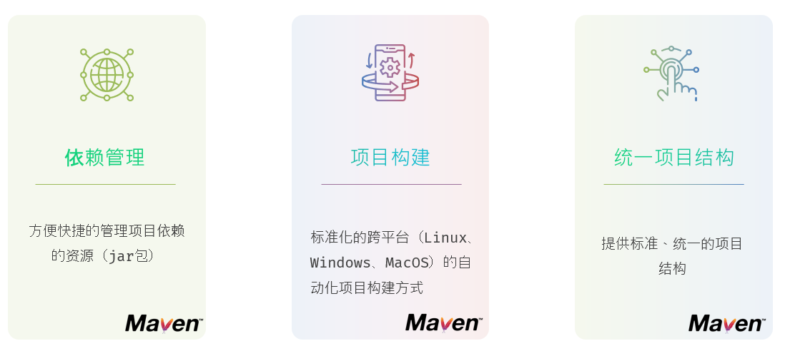

#### 1.2.1 依赖管理

方便快捷地管理项目依赖的资源（jar 包），避免版本冲突问题。

1). 使用 Maven 前

我们项目中要想使用某一个 jar 包，就需要把这个 jar 包从官方网站下载下来，然后再导入到项目中。然后在这个项目中，就可以使用这个 jar 包了。

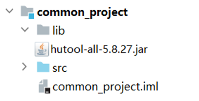

2). 使用 Maven 后

当使用 Maven 进行项目依赖（jar 包）管理，则可以很方便地解决这个问题。我们只需要在 Maven 项目的 pom.xml 文件中，添加一段如下图所示的配置即可实现：
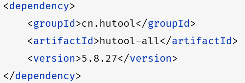

在 Maven 项目的配置文件中，加入上面这么一段配置信息之后，Maven 会自动地根据配置信息的描述，去下载对应的依赖；然后在项目中，就可以直接使用了。

#### 1.2.2 项目构建

Maven 还提供了标准化的跨平台的自动化构建方式。


如上图所示，我们开发了一套系统，代码需要经过编译、测试、打包、发布等过程，这些操作是所有项目中都需要做的，如果需要反复进行就显得特别麻烦；而 Maven 提供了一套简单的命令来完成项目构建。

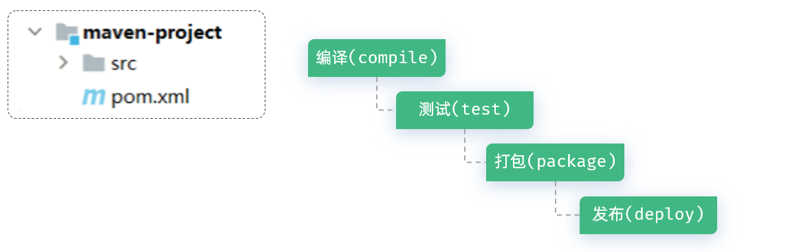

通过 Maven 中的命令，就可以很方便地完成项目的编译（compile）、测试（test）、打包（package）、发布（deploy）等操作。

而且这些操作都是跨平台的。也就是说，无论是 Windows 系统，还是 Linux 系统，还是 Mac 系统，这些命令都是支持的。

#### 1.2.3 统一项目结构

Maven 还提供了标准、统一的项目结构。

1). 未使用 Maven

由于 Java 的开发工具有很多，除了大家熟悉的 IDEA 以外，还有像早期的 Eclipse、MyEclipse。而不同的开发工具创建出来的 Java 项目的目录结构是存在差异的，那这就会出现一个问题：Eclipse 创建的 Java 项目，并不能直接导入 IDEA 中；IDEA 创建的 Java 项目，也没有办法直接导入到 Eclipse 中。

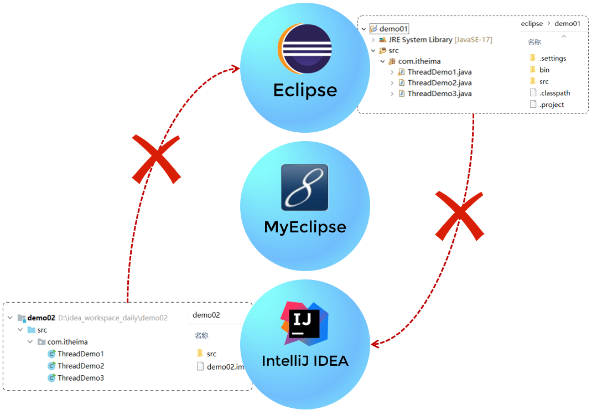

2). 使用 Maven

而如果我们使用了 Maven 这一款项目构建工具，它给我们提供了一套标准的 Java 项目目录。如下所示：
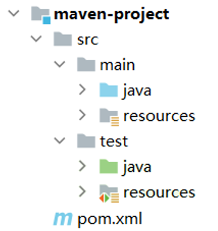

也就意味着，无论我们使用的是什么开发工具，只要是基于 Maven 构建的 Java 项目，最终的目录结构都是相同的，如下图所示：
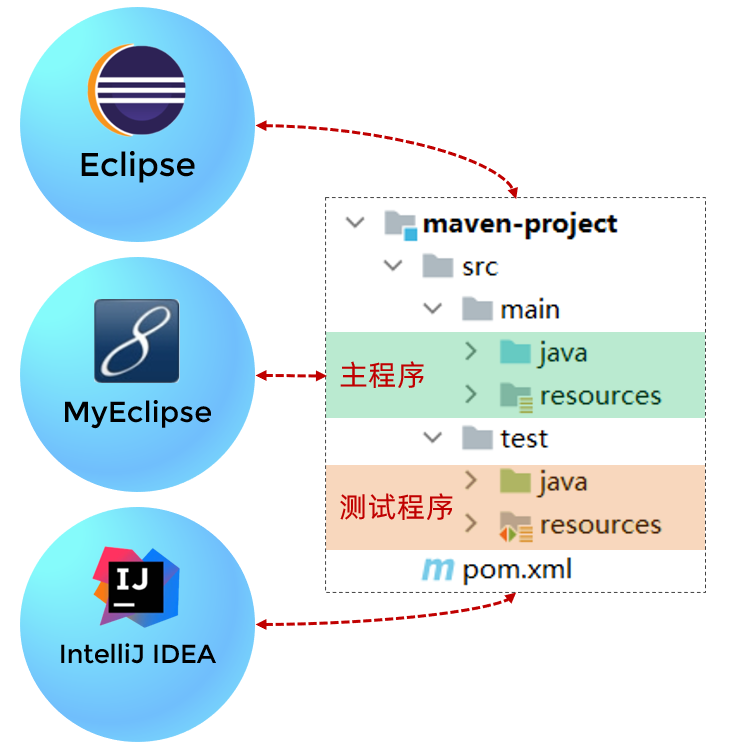

那这样呢，我们使用 Eclipse、MyEclipse、IDEA 创建的 Maven 项目，就可以在各个开发工具直接导入使用了，更加方便、快捷。

而在上面的 Maven 项目的目录结构中，main 目录下存放的是项目的源代码，test 目录下存放的是项目的测试代码。而无论是在 main 还是在 test 下，都有两个目录：一个是 java，用来存放源代码文件；另一个是 resource，用来存放配置文件。

总结 - 什么是 Maven：**Maven 就是一款管理和构建 Java 项目的工具。**

Maven 的内容讲解分为两个部分：Maven 核心和 Maven 进阶。

今天，我们先来讲解 Maven 核心部分的内容。在 Web 开发的最后，我们再来讲解 Maven 进阶部分的内容。

## 二、Maven 概述

### 2.1 Maven 介绍

Apache Maven 是一个项目管理和构建工具，它基于项目对象模型（Project Object Model，简称：POM）的概念，通过一小段描述信息来管理项目的构建、报告和文档。

Maven 官网：[Maven 官网](https://maven.apache.org/ "Maven 官网")。

Maven 的作用：
1. 方便的依赖管理。
2. 统一的项目结构。
3. 标准的项目构建流程。

### 2.2 Maven 模型

* 项目对象模型（Project Object Model）。
* 依赖管理模型（Dependency）。
* 构建生命周期 / 阶段（Build lifecycle & phases）。

1). 构建生命周期 / 阶段（Build lifecycle & phases）

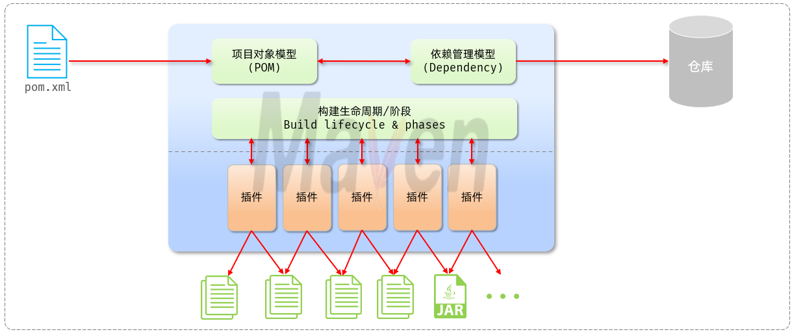

以上图中紫色框起来的部分，就是用来完成标准化构建流程。当我们需要编译，Maven 提供了一个编译插件供我们使用；当我们需要打包，Maven 就提供了一个打包插件供我们使用等。

2). 项目对象模型（Project Object Model）

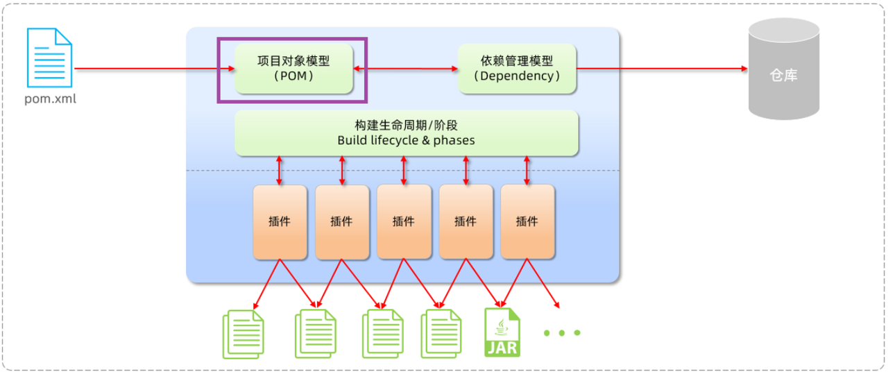

以上图中紫色框起来的部分属于项目对象模型，就是将我们自己的项目抽象成一个对象模型，有自己专属的坐标。如下图所示是一个 Maven 项目：
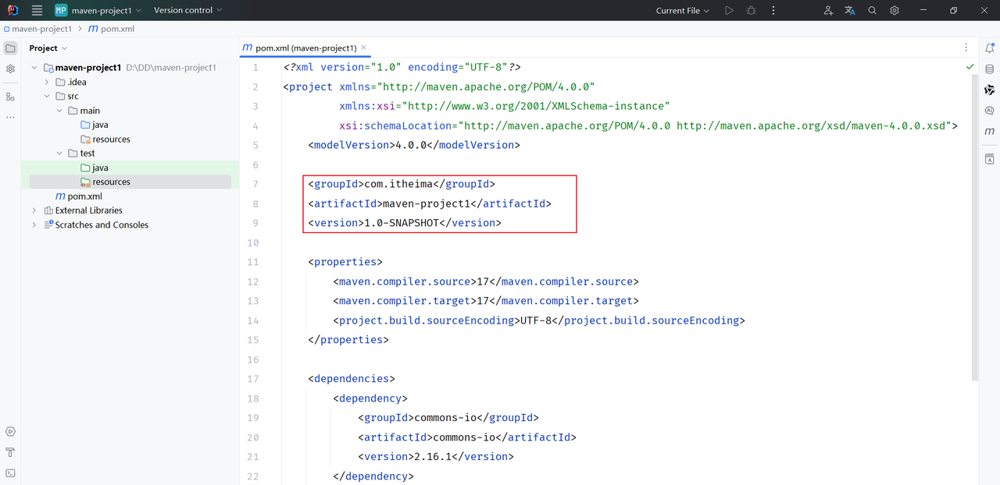

> 坐标，就是资源（jar 包）的唯一标识，通过坐标可以定位到所需资源（jar 包）位置。
>
> 坐标的组成部分：
> * groupId：组织名。
> * arfitactId：模块名。
> * version：版本号。

3). 依赖管理模型（Dependency）

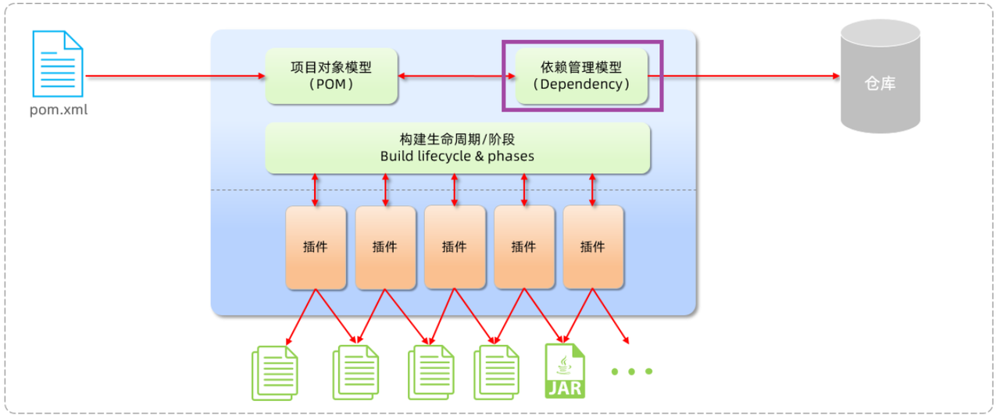

以上图中紫色框起来的部分属于依赖管理模型，是使用坐标来描述当前项目依赖哪些第三方 jar 包。

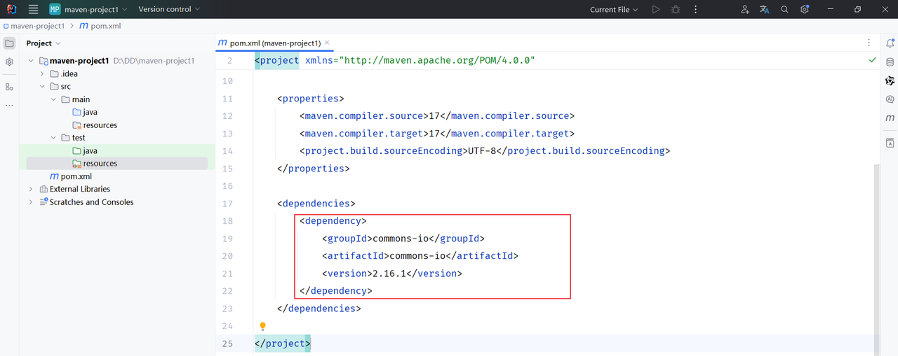

之前我们项目中需要 jar 包时，直接就把 jar 包复制到项目下的 lib 目录；而现在我们只需要在 pom.xml 中配置依赖的配置文件即可。而这个依赖对应的 jar 包其实就在我们本地电脑上的 Maven 仓库中。

如下图为示例本地的 Maven 仓库中的 jar 文件：
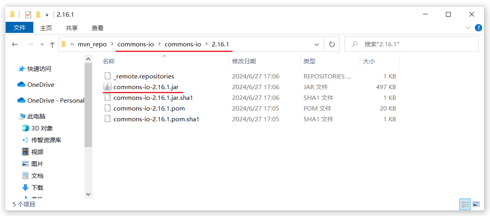

### 2.3 Maven 仓库

仓库：用于存储资源，管理各种 jar 包。

> **仓库的本质**就是一个目录（文件夹），这个目录被用来存储开发中所有依赖（就是 jar 包）和插件。

Maven 仓库分为：
* 本地仓库：自己计算机上的一个目录（用来存储 jar 包）。
* 中央仓库：由 Maven 团队维护的全球唯一的仓库；仓库地址：[中央仓库地址](https://repo1.maven.org/maven2/ "中央仓库地址")。
* 远程仓库（私服）：一般由公司团队搭建的私有仓库。

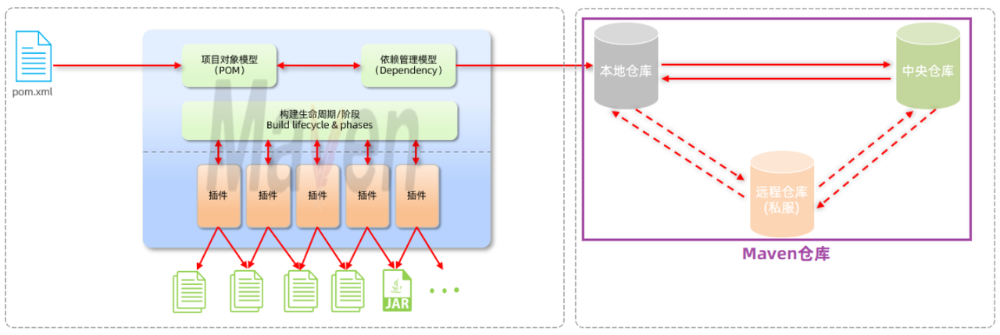

当项目中使用坐标引入对应依赖 jar 包后：
1. 首先会查找本地仓库中是否有对应的 jar 包。
    * 如果有，则在项目中直接引用。
    * 如果没有，则去中央仓库中下载对应的 jar 包到本地仓库。
2. 如果还可以搭建远程仓库（私服），将来 jar 包的查找顺序则变为：本地仓库 -> 远程仓库 -> 中央仓库。

### 2.4 Maven 安装

开始使用 Maven，首先要进行 Maven 的下载与安装。

##### 2.4.1 下载

下载地址：[Maven 下载地址](https://maven.apache.org/download.cgi "Maven 下载地址")。

##### 2.4.2 安装步骤

Maven 安装配置步骤：
1. 解压安装。
2. 配置仓库。
3. 配置阿里云私服。
4. 配置 Maven 环境变量。

1). 解压安装

解压缩后的目录结构如下：
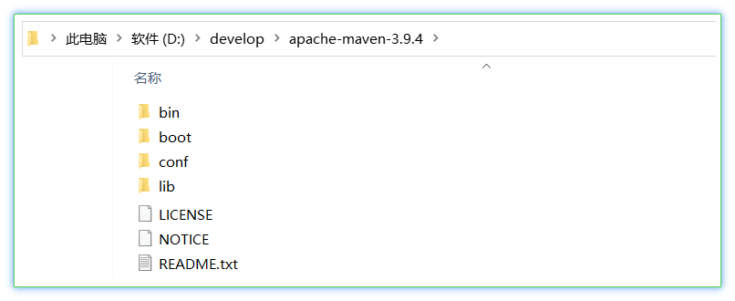

* bin 目录：存放的是可执行命令（mvn 命令，重点关注）。
* conf 目录：存放 Maven 的配置文件（settings.xml 配置文件后期需要修改）。
* lib 目录：存放 Maven 依赖的 jar 包（Maven 也是使用 Java 开发的，所以它也依赖其他的 jar 包）。

2). 配置本地仓库

1. 在自己计算机上新建一个目录（本地仓库，用来存储 jar 包）。

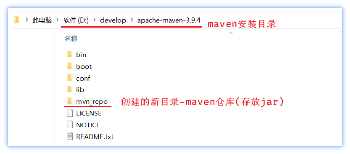

2. 进入到 conf 目录下修改 settings.xml 配置文件。
    1. 打开 settings.xml 文件，定位到 53 行。
    2. 复制 `<localRepository>` 标签，粘贴到注释的外面（55 行）。
    3. 复制之前新建的用来存储 jar 包的路径，替换掉 `<localRepository>` 标签体内容。

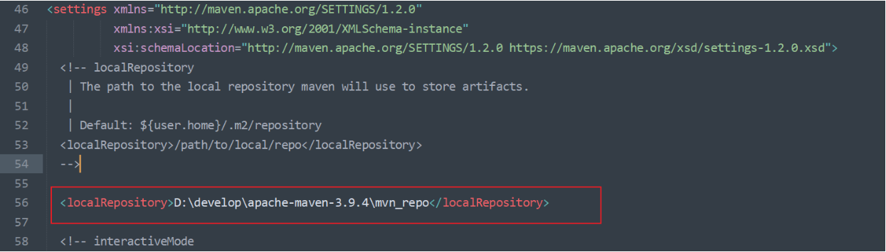

3). 配置阿里云私服

由于中央仓库在国外，所以下载 jar 包速度可能比较慢。而阿里公司提供了一个远程仓库，里面基本也都有开源项目的 jar 包。

进入到 conf 目录下修改 settings.xml 配置文件：
1. 打开 settings.xml 文件，定位到 160 行左右。
2. 在 `<mirrors>` 标签下为其添加子标签 `<mirror>`，内容如下：
    ```xml
    <mirror>
        <id>alimaven</id>
        <name>aliyun maven</name>
        <url>http://maven.aliyun.com/nexus/content/groups/public/</url>
        <mirrorOf>central</mirrorOf>
    </mirror>
    ```

注意配置的位置，在 `<mirrors>...</mirrors>` 中间添加配置。如下图所示：
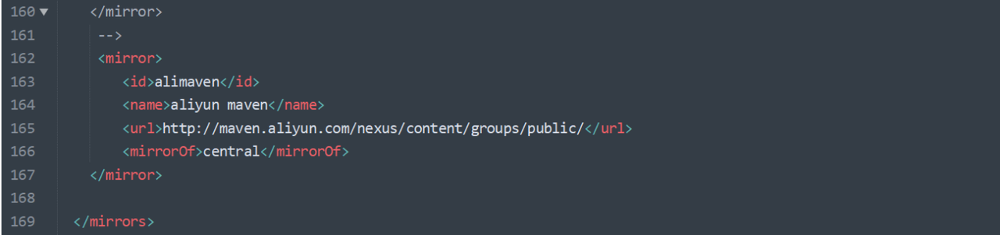

4). 配置环境变量

**Maven 环境变量的配置类似于 JDK 环境变量的配置一样。**

1. 在系统变量处新建一个变量 MAVEN_HOME；MAVEN_HOME 环境变量的值，设置为 Maven 的解压安装目录。

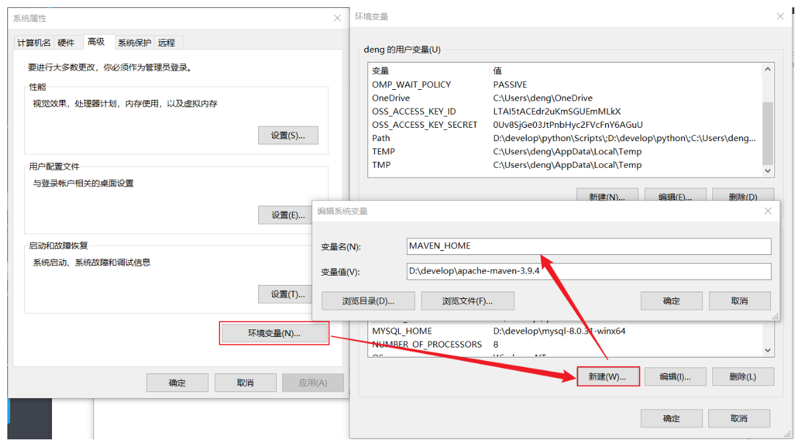

2. 在 Path 中进行配置；PATH 环境变量的值，设置为：`%MAVEN_HOME%\bin`。

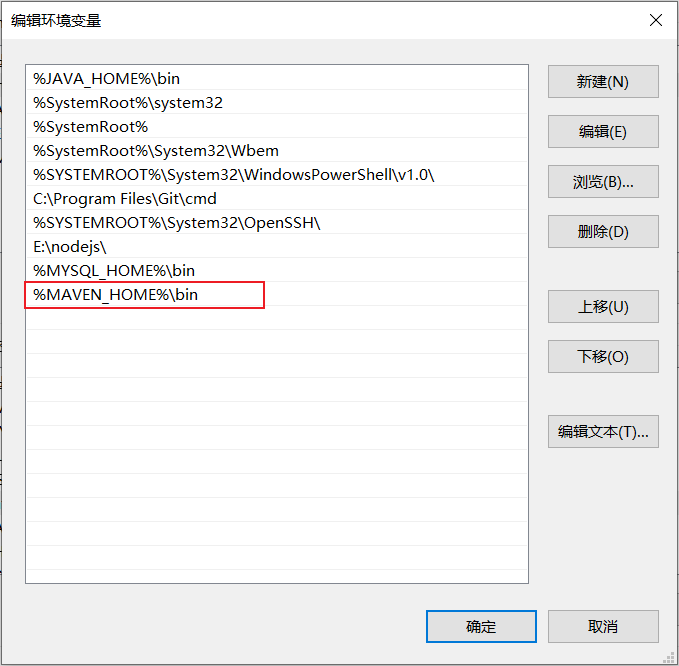

3. 打开 DOS 命令提示符进行验证。

命令为 `mvn -v`。

5). 配置关联的 JDK 版本（可选）

进入到 conf 目录下修改 settings.xml 配置文件，在 `<profiles>...</profiles>` 中增加如下配置：
```xml
<profile>
        <id>jdk-17</id>
        <activation>
                <activeByDefault>true</activeByDefault>
                <jdk>17</jdk>
        </activation>
        <properties>
                <maven.compiler.source>17</maven.compiler.source>
                <maven.compiler.target>17</maven.compiler.target>
                <maven.compiler.compilerVersion>17</maven.compiler.compilerVersion>
        </properties>
</profile>
```

## 三、IDEA 集成 Maven

我们要想在 IDEA 中使用 Maven 进行项目构建，就需要在 IDEA 中集成 Maven；那么就需要在 IDEA 中配置与 Maven 的关联。

### 3.1 创建 Maven 项目

#### 3.1.1 全局设置

1). 进入 IDEA 的欢迎界面

选择 IDEA 中 File -> Close Project -> Customize -> All settings。


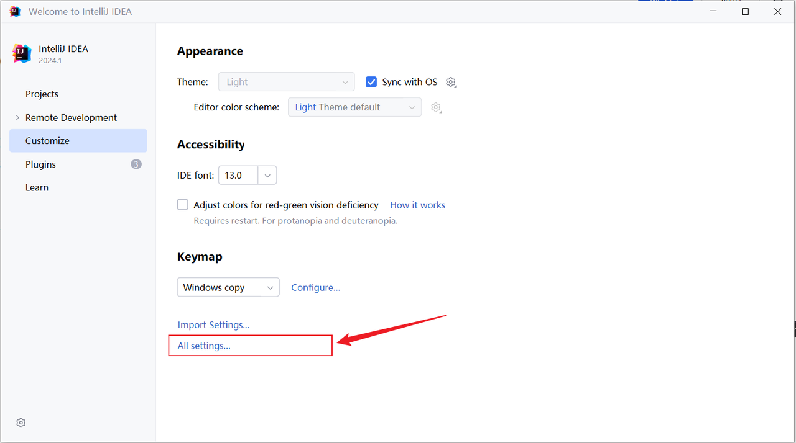

2). 打开 All settings，选择 Build, Execution, Deployment -> Build Tools -> Maven

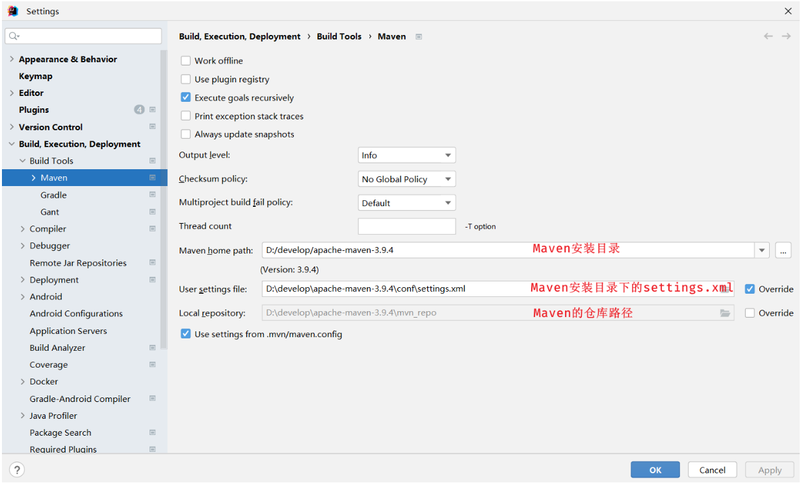

这里还需要在 Maven 下的 Runner 中配置 JDK 版本。

3). 配置工程的编译版本

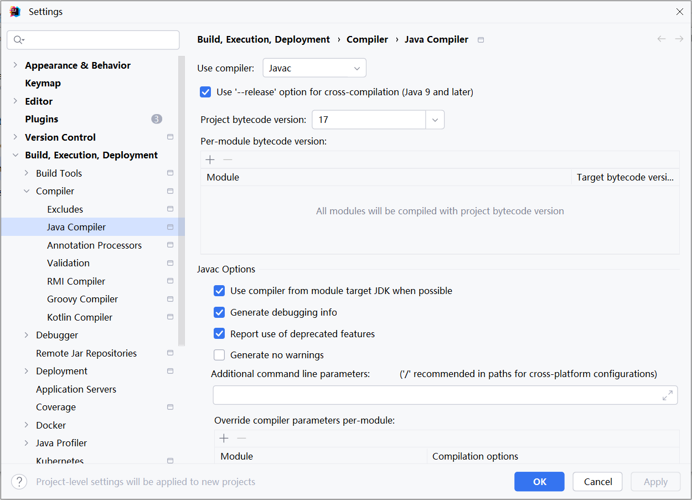

> 注意：
>
> Project bytecode version 默认为 Same as language level。

这里所设置的 Maven 的环境信息，并未指定任何一个 Project，此时设置的信息就属于全局配置信息。以后，我们再创建 Project，默认就是使用我们全局配置的信息。

#### 3.1.2 创建项目

1). 创建一个空项目，并为之命名

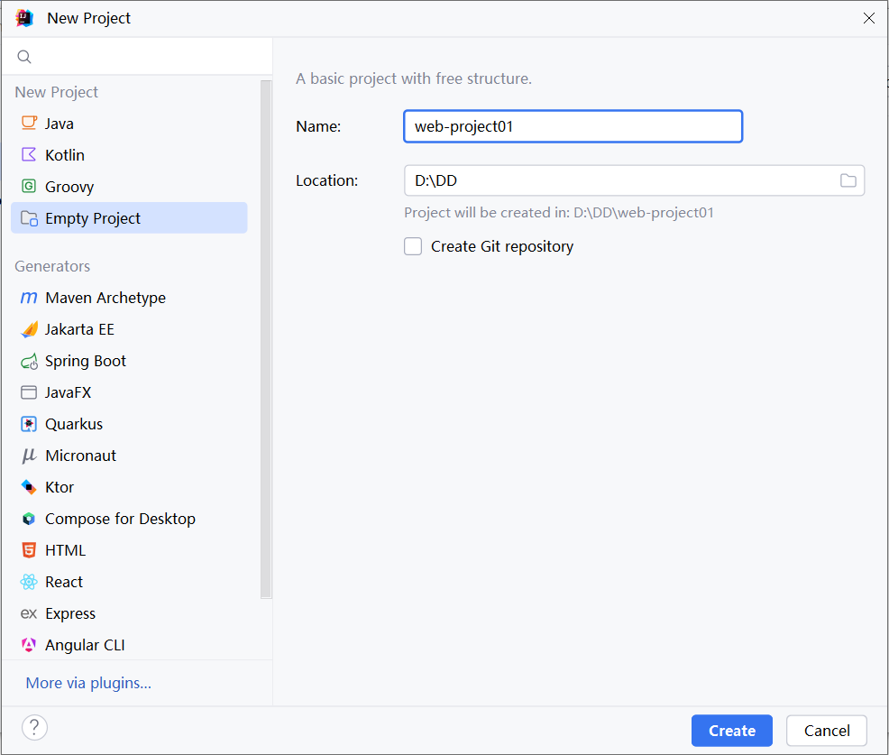

2). 创建好项目之后，进入项目中，设置 JDK 的版本号

选择小齿轮，选择 Project Structure：
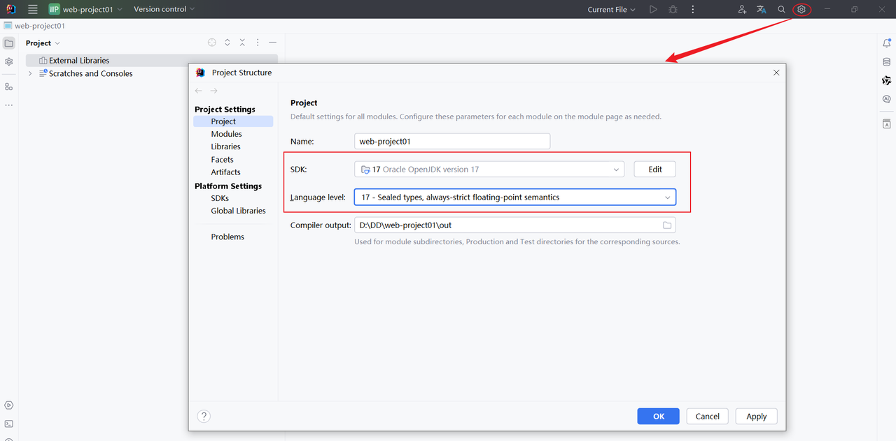

3). 创建模块，选择 Java 语言，选择 Maven，并填写模块的基本信息

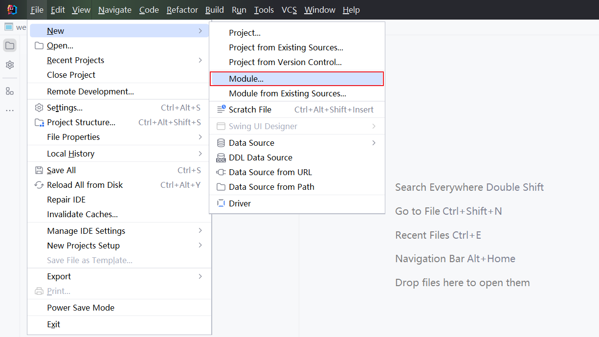

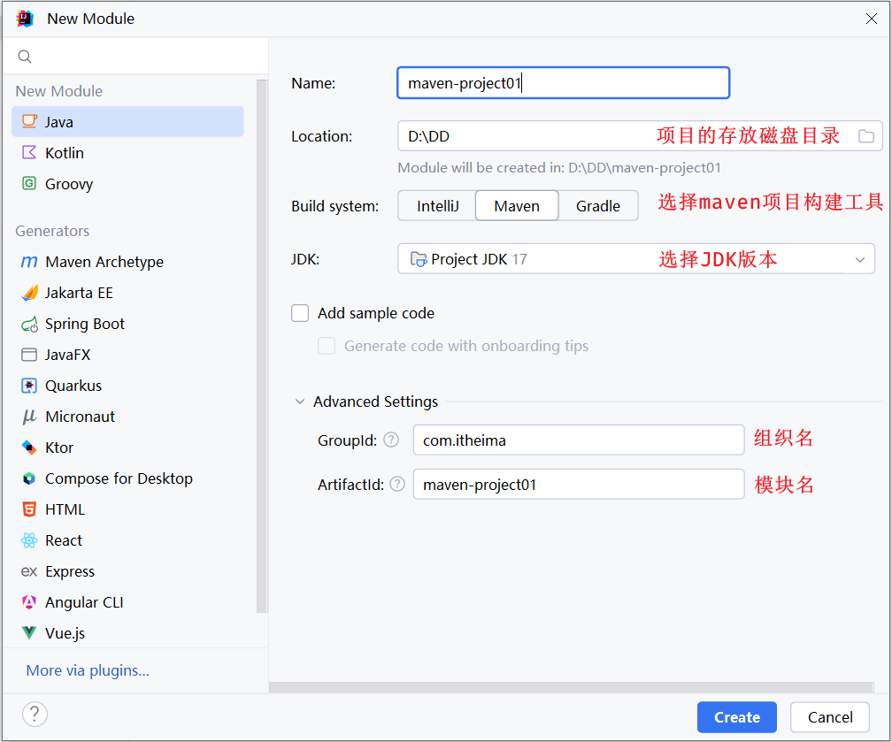

4). 在 Maven 项目中，创建类，并运行

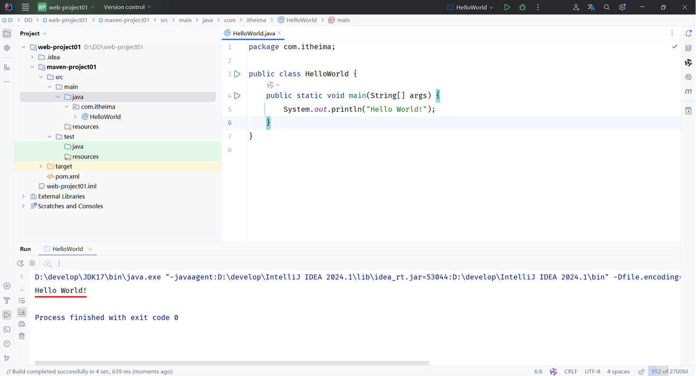

> Maven 项目的目录结构：
> ```
> maven-project01
>     |--- src（源代码目录和测试代码目录）
>         |--- main（源代码目录）
>             |--- java（源代码 Java 文件目录）
>             |--- resources（源代码配置文件目录）
>         |--- test（测试代码目录）
>             |--- java（测试代码 Java 目录）
>             |--- resources（测试代码配置文件目录）
>     |--- target（编译、打包生成文件存放目录）
> ```
>
> 以上为 Maven 项目的目录结构。

#### 3.1.3 pom 文件详解

POM（Project Object Model）：指的是项目对象模型，用来描述当前的 Maven 项目。

使用 pom.xml 文件来描述当前项目。pom.xml 文件如下：
```xml
<?xml version="1.0" encoding="UTF-8"?>
<project xmlns="http://maven.apache.org/POM/4.0.0"
         xmlns:xsi="http://www.w3.org/2001/XMLSchema-instance"
         xsi:schemaLocation="http://maven.apache.org/POM/4.0.0 http://maven.apache.org/xsd/maven-4.0.0.xsd">
    <!-- POM模型版本 -->
    <modelVersion>4.0.0</modelVersion>

    <!-- 当前项目坐标 -->
    <groupId>com.itheima</groupId>
    <artifactId>maven-project01</artifactId>
    <version>1.0-SNAPSHOT</version>
    
    <!-- 项目的JDK版本及编码 -->
    <properties>
        <maven.compiler.source>17</maven.compiler.source>
        <maven.compiler.target>17</maven.compiler.target>
        <project.build.sourceEncoding>UTF-8</project.build.sourceEncoding>
    </properties>

</project>
```

pom 文件详解：
* `<project>`：pom 文件的根标签，表示当前 Maven 项目。
* `<modelVersion>`：声明项目描述遵循哪一个 POM 模型版本。
  * 虽然模型本身的版本很少改变，但它仍然是必不可少的；目前 POM 模型版本是 4.0.0。
* 坐标：
  * `<groupId>`、`<artifactId>`、`<version>`。
  * 定位项目在本地仓库中的位置，由以上三个标签组成一个坐标。
* `<maven.compiler.source>`：编译 JDK 的版本。
* `<maven.compiler.target>`：运行 JDK 的版本。
* `<project.build.sourceEncoding>`：设置项目的字符集。

### 3.2 Maven 坐标

什么是坐标？
* Maven 中的坐标是**资源（jar）的唯一标识**，通过该坐标可以唯一定位资源位置。
* 使用坐标来定义项目或引入项目中需要的依赖。

Maven 坐标主要组成：
* `groupId`：定义当前 Maven 项目隶属组织名称（通常是域名反写）。
* `artifactId`：定义当前 Maven 项目名称（通常是模块名称）。
* `version`：定义当前项目版本号。
  * `SNAPSHOT`：功能不稳定、尚处于开发中的版本，即快照版本。
  * `RELEASE`：功能趋于稳定、当前更新停止，可以用于发行的版本。

如下图就是使用坐标表示一个项目：
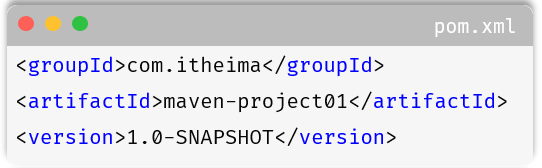

> 注意：
> * 上面所说的的资源可以是插件、依赖、当前项目。
> * 我们的项目如果被其他的项目依赖时，也是需要坐标来引入的。

### 3.3 导入 Maven 项目

在 IDEA 中导入 Maven 项目，有两种方式。

> 注意：
>
> 建议将要导入的 Maven 源代码项目复制到当前自己的项目目录下，再执行以下两种方式的导入操作。

1). 方式一：File -> Project Structure -> Modules -> Import Module -> 选择 Maven 项目的 pom.xml。

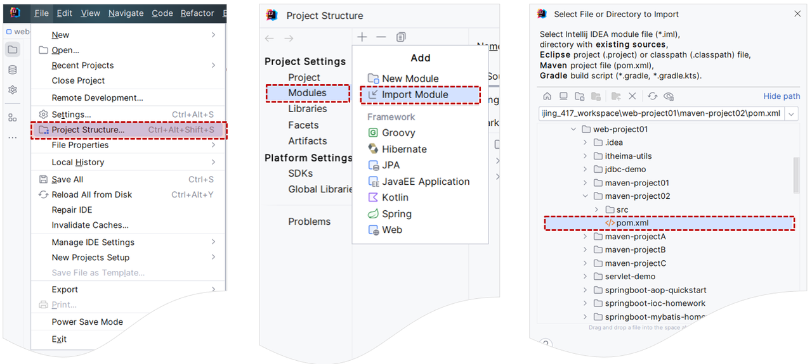

2). 方式二：Maven 面板 -> + (Add Maven Projects) -> 选择 Maven 项目的 pom.xml。

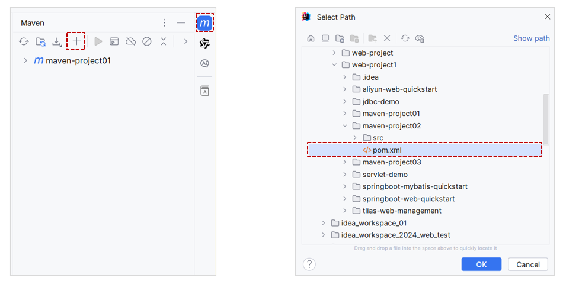

## 四、依赖管理

### 4.1 依赖配置

#### 4.1.1 基本配置

依赖：指当前项目中运行所需要的 jar 包；一个项目中可以引入多个依赖。

例如：在当前工程中，我们需要用到 logback 来记录日志，此时就可以在 Maven 工程的 pom.xml 文件中，引入 logback 的依赖。具体步骤如下：
1. 在 pom.xml 中编写 `<dependencies>` 标签。
2. 在 `<dependencies>` 标签中使用 `<dependency>` 引入坐标。
3. 定义坐标的 `groupId`、`artifactId`、`version`：
    ```xml
    <dependencies>
        <!-- 依赖 : spring-context -->
        <dependency>
            <groupId>org.springframework</groupId>
            <artifactId>spring-context</artifactId>
            <version>6.1.4</version>
        </dependency>
    </dependencies>
    ```
4. 点击刷新按钮，引入最新加入的坐标。
    * 刷新依赖：保证每一次引入新的依赖，或者修改现有的依赖配置，都可以加入最新的坐标。
    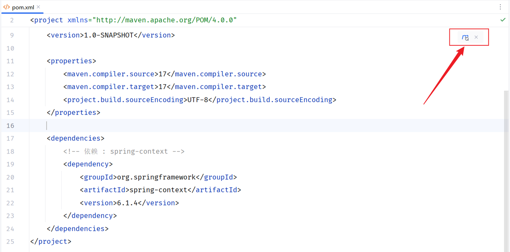

> 注意：
> 1. 如果引入的依赖在本地仓库中不存在，将会连接远程仓库 / 中央仓库，然后下载依赖（这个过程会比较耗时，耐心等待）。
> 2. 如果不知道依赖的坐标信息，可以到 mvn 的中央仓库（[mvn 中央仓库](https://mvnrepository.com/ "mvn 中央仓库")）中搜索。

#### 4.1.2 查找依赖

1). 利用中央仓库搜索的依赖坐标

以常见的 logback-classic 为例：
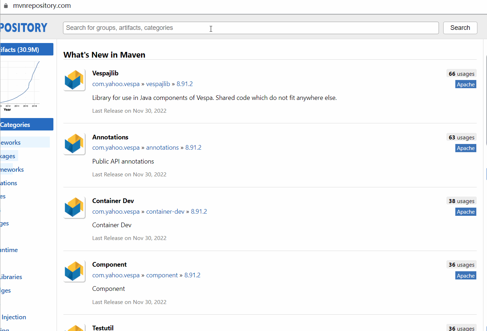

2). 利用 IDEA 工具搜索依赖

以常见的 logback-classic 为例：
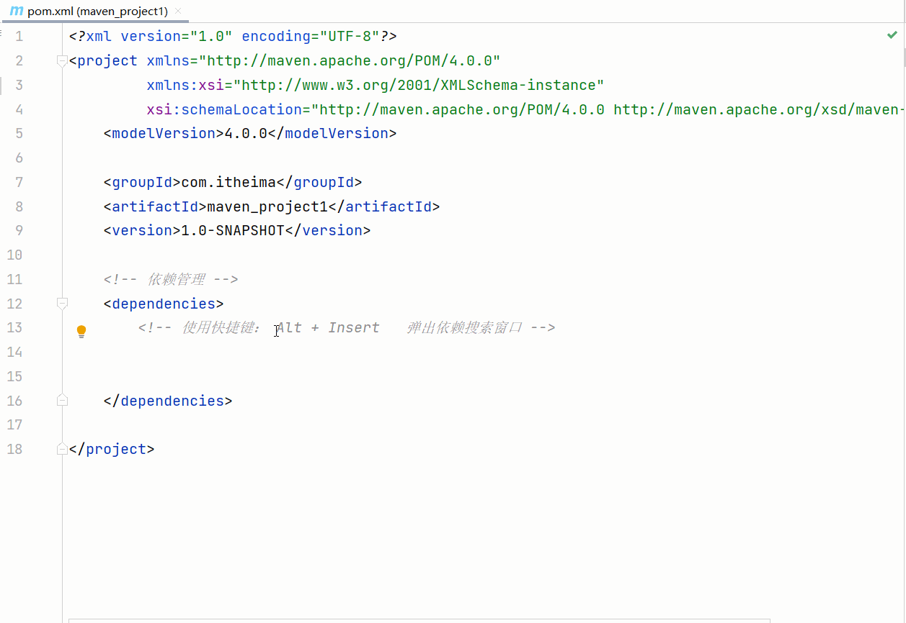

3). 熟练上手 Maven 后，快速导入依赖

以常见的 logback-classic 为例：
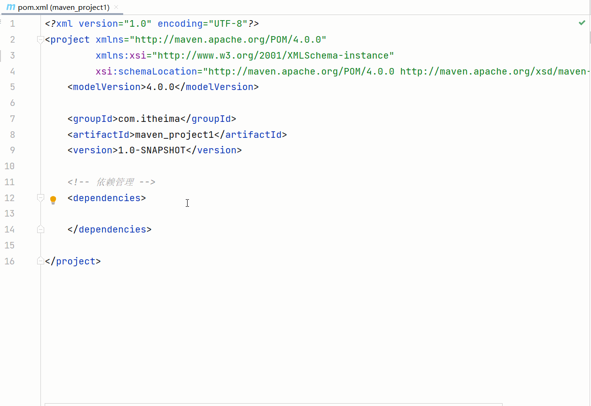

#### 4.1.3 依赖传递

我们上面在 pom.xml 中配置了一项依赖，就是 spring-context，但是我们通过右侧的 Maven 面板可以看到，其实引入进来的依赖并不是这一项，有非常多的依赖都被引入进来了。我们可以看到如下图所示：
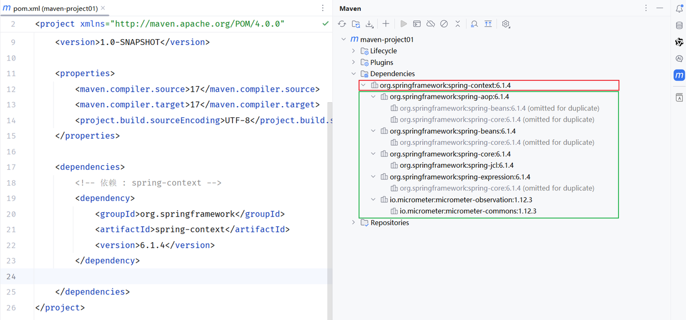

为什么会出现这样的现象呢？这里涉及到 Maven 中非常重要的一个特性，那就是 Maven 中的**依赖传递**。

所谓 Maven 的依赖传递，指的就是如果在 Maven 项目中，A 依赖了 B，B 依赖了 C，C 依赖了 D，那么在项目 A 中，也会有 C、D 依赖，因为依赖会传递。

那如果，传递下来的依赖，在项目开发中我们确实不需要，此时我们可以通过 Maven 中的排除依赖功能，来将这个依赖排除掉。

#### 4.1.4 排除依赖

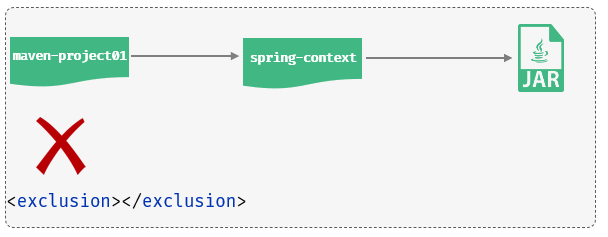

排除依赖：指主动断开依赖的资源，被排除的资源无需指定版本。

配置形式如下：
```xml
<dependency>
    <groupId>org.springframework</groupId>
    <artifactId>spring-context</artifactId>
    <version>6.1.4</version>

    <!--排除依赖, 主动断开依赖的资源-->
    <exclusions>
        <exclusion>
            <groupId>io.micrometer</groupId>
            <artifactId>micrometer-observation</artifactId>
        </exclusion>
    </exclusions>
</dependency>
```

依赖排除示例：
1. 默认通过 Maven 的依赖传递，传递下来了 micrometer-observation 的依赖：
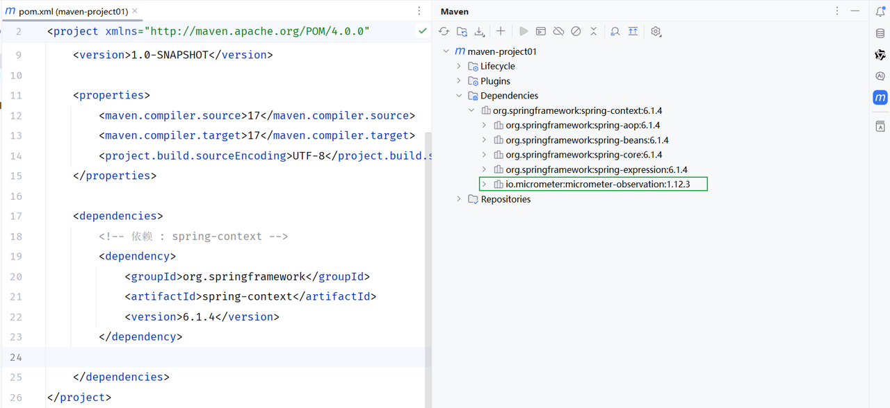
2. 加入排除依赖的配置之后，该依赖就被排除掉了：
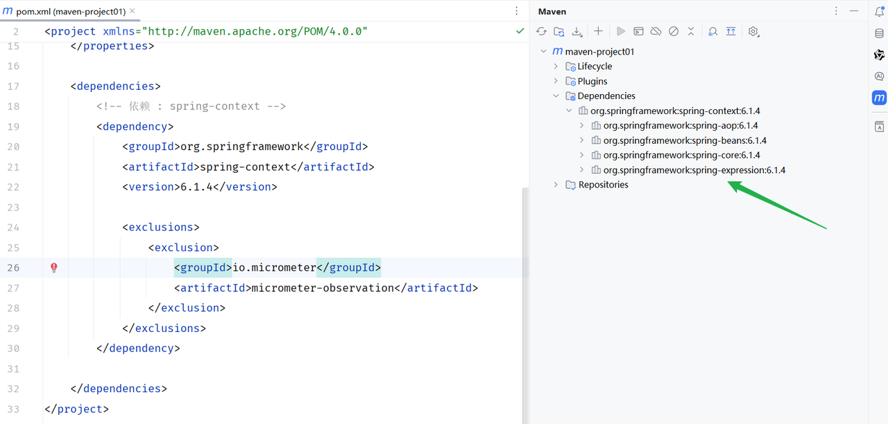

### 4.2 生命周期

#### 4.2.1 介绍

Maven 的生命周期就是为了对所有的构建过程进行抽象和统一。

Maven 总结了一套项目构建生命周期，这个生命周期包含了项目的清理、初始化、编译、测试、打包、集成测试、验证、部署和站点生成等几乎所有构建步骤。

Maven 对项目构建的生命周期划分为 3 套（相互独立）：

* clear：清理工作。
* default：核心工作；如：编译、测试、打包、安装、部署等。
* site：生成报告、发布站点等。

三套生命周期包含的具体的阶段如下图所示：
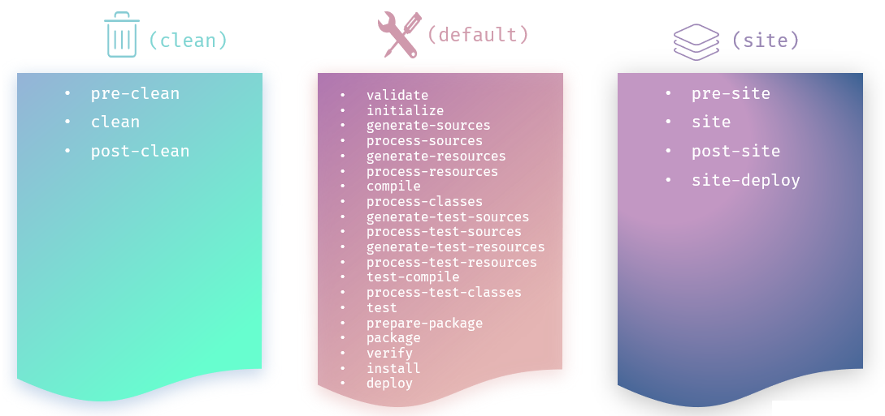

每套生命周期包含一些阶段（phase），阶段是有顺序的，后面的阶段依赖于前面的阶段。

我们主要关注以下几个阶段：
* clean：移除上一次构建生成的文件。
* compile：编译项目源代码。
* test：使用合适的单元测试框架运行测试（junit）。
* package：将编译后的文件打包；如：jar、war 等。
* install：安装项目到本地仓库。

Maven 的生命周期是抽象的，这意味着生命周期本身不做任何实际工作。**在 Maven 的设计中，实际任务（如源代码编译）都交由插件来完成。**

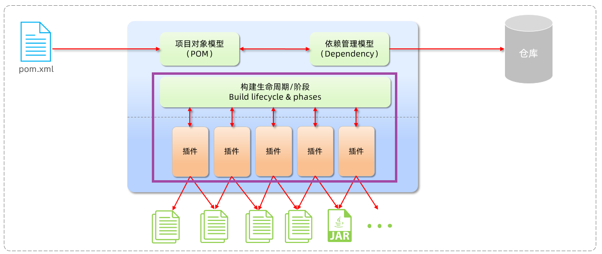

IDEA 工具为了方便程序员使用 Maven 生命周期，在右侧的 Maven 工具栏中，已给出快速访问通道：
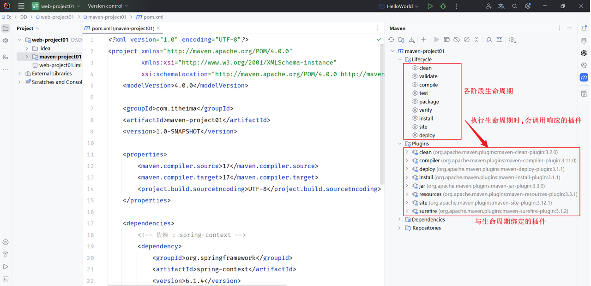

生命周期的顺序是：clean -> validate -> compile -> test -> package -> verify -> install -> site -> deploy。

我们需要关注的就是：clean -> compile -> test -> package -> install。

> 说明：
>
> 在**同一套**生命周期中，我们在执行后面的生命周期时，前面的生命周期都会执行。

> 思考：当运行 package 生命周期时，clean、compile 生命周期会不会运行？
>
> 答：clean 不会运行，compile 会运行。因为 compile 与 package 属于同一套生命周期，而 clean 与 package 不属于同一套生命周期。

#### 4.2.2 执行

在日常开发中，当我们要执行指定的生命周期时，有两种执行方式：
1. 在 IDEA 工具右侧的 Maven 工具栏中，选择对应的生命周期，双击执行。
2. 在 DOS 命令行中，通过 Maven 命令执行；例如：`mvn clean`、`mvn compile`、`mvn test`、`mvn package`、`mvn install`。

## 五、单元测试

### 5.1 介绍

**测试：** 是一种用来促进鉴定软件的正确性、完整性、安全性和质量的过程。

**阶段划分：** 单元测试、集合测试、系统测试、验收测试。


**测试方法：** 白盒测试、黑盒测试及灰盒测试。
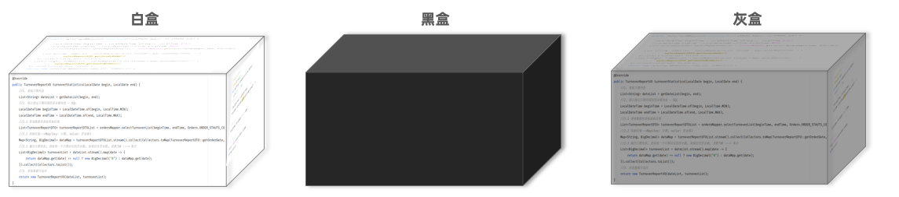


### 5.2 Junit 入门

#### 5.2.1 单元测试

单元测试：针对最小的功能单元（方法），编写测试代码对其正确性进行测试。

JUnit：最流行的 Java 测试框架之一，提供了一些功能，方便程序进行单元测试（第三方公司提供）。

#### 5.2.2 入门程序

需求：使用 JUnit，对 UserService 中的业务方法进行单元测试，测试其正确性。

1). 在 pom.xml 中，引入 JUnit 的依赖

```xml
<!-- JUnit 单元测试依赖 -->
<dependency>
    <groupId>org.junit.jupiter</groupId>
    <artifactId>junit-jupiter</artifactId>
    <version>5.9.1</version>
    <!-- <scope>test</scope> -->
</dependency>
```

2). 在 test/java 目录下，创建测试类，并编写对应的测试方法，并在方法上声明 `@Test` 注解。

```java
@Test
public void testGetAge(){
    Integer age = new UserService().getAge("110002200505091218");
    System.out.println(age);
}
```

3). 运行单元测试（测试通过：绿色；测试失败：红色）

> 注意：
> * 测试类的命名规范为：`XxxxTest`。
> * 测试方法的命名规范为：`public void xxx() { ... }`。
>
> 即：JUnit 单元测试类名命名规范为：`XxxxxTest`【规范】；JUnit 单元测试的方法，必须声明为 `public void`【规定】。

示例代码：
```java
/* UserServiceTest.java */

package com.anxin_hitsz;

/**
 * ClassName: UserServiceTest
 * Package: com.anxin_hitsz
 * Description:
 *      测试类
 * @Author AnXin
 * @Create 2026/3/3 21:17
 * @Version 1.0
 */

import org.junit.jupiter.api.Test;

/**
 * 测试类
 */
public class UserServiceTest {

    @Test
    public void testGetAge() {
        UserService userService = new UserService();
        Integer age = userService.getAge("100000200010011011");
        System.out.println(age);
    }

}

```

### 5.3 断言

JUnit 提供了一些辅助方法，用来帮我们确定被测试的方法是否按照预期的效果正常工作，这种方式称为**断言**。

| 断言方法 | 描述 |
| :--: | :--: |
| `Assertions.assertEquals(Object exp, Object act, String msg)` | 检查两个值是否相等，不相等就报错 |
| `Assertions.assertNotEquals(Object unexp, Object act, String msg)` | 检查两个值是否不相等，相等就报错 |
| `Assertions.assertNull(Object act, String msg)` | 检查对象是否为 `null`，不为 `null` 就报错  |
| `Assertions.assertNotNull(Object act, String msg)` | 检查对象是否不为 `null`，为 `null` 就报错 |
| `Assertions.assertTrue(boolean condition, String msg)` | 检查条件是否为 `true`，不为 `true` 就报错 |
| `Assertions.assertFalse(boolean condition, String msg)` | 检查条件是否为 `false`，不为 `false` 就报错 |
| `Assertions.assertSame(Object exp, Object act, String msg)` | 检查两个对象引用是否相等，不相等就报错 |
| `Assertions.assertThrows(Class expType, Executable exec, String msg)` | 检查程序运行抛出的异常，是否符合预期 |

> 注意：
>
> 上述方法形参中的最后一个参数 `msg`，表示错误提示信息，可以不指定（有对应的重载方法）。

示例代码：
```java
/* UserServiceTest.java */

package com.anxin_hitsz;

/**
 * ClassName: UserServiceTest
 * Package: com.anxin_hitsz
 * Description:
 *      测试类
 * @Author AnXin
 * @Create 2026/3/3 21:17
 * @Version 1.0
 */

import org.junit.jupiter.api.Assertions;
import org.junit.jupiter.api.Test;

/**
 * 测试类
 */
public class UserServiceTest {

    @Test
    public void testGetAge() {
        UserService userService = new UserService();
        Integer age = userService.getAge("100000200010011011");
        System.out.println(age);
    }

    @Test
    public void testGetGender() {
        UserService userService = new UserService();
        String gender = userService.getGender("100000200010011011");
        System.out.println(gender);
    }

    /**
     * 断言
     */
    @Test
    public void testGetGenderWithAssert() {
        UserService userService = new UserService();
        String gender = userService.getGender("100000200010011011");
        // 断言
//        Assertions.assertEquals("男", gender);
        Assertions.assertEquals("男", gender, "性别获取错误，有问题");
    }

    /**
     * 断言
     */
    @Test
    public void testGetGenderWithAssert2() {
        UserService userService = new UserService();
        String gender = userService.getGender("100000200010011011");
        // 断言
        Assertions.assertThrows(IllegalArgumentException.class, () -> {
            userService.getGender(null);
        });
    }

}

```

### 5.4  常见注解

在 JUnit 中还提供了一些注解，以增强其功能。常见的注解见下表：
| 注解 | 说明 | 备注 |
| :--: | :--: | :--: |
| `@Test` | 测试类中的方法用它修饰才能成为测试方法，才能启动执行 | 单元测试 |
| `@BeforeEach` | 用来修饰一个实例方法，该方法会在**每一个**测试方法执行之前执行一次 | 初始化资源（准备工作） |
| `@AfterEach` | 用来修饰一个实例方法，该方法会在**每一个**测试方法执行之后执行一次 | 释放资源（清理工作） |
| `@BeforeAll` | 用来修饰一个静态方法，该方法会在所有测试方法之前**只执行一次** | 初始化资源（准备工作） |
| `@AfterAll` | 用来修饰一个静态方法，该方法会在所有测试方法之后**只执行一次** | 释放资源（清理工作） |
| `@ParameterizedTest` | 参数化测试的注解（可以让单个测试运行多次，每次运行时仅参数不同） | 用了该注解，就不需要 `@Test` 注解了 |
| `@ValueSource` | 参数化测试的参数来源，赋予测试方法参数 | 与参数化测试注解配合使用 |
| `@DisplayName` | 指定测试类、测试方法显示的名称（默认为类名、方法名） | - |

示例代码：
```java
/* UserServiceTest.java */

package com.anxin_hitsz;

/**
 * ClassName: UserServiceTest
 * Package: com.anxin_hitsz
 * Description:
 *      测试类
 * @Author AnXin
 * @Create 2026/3/3 21:17
 * @Version 1.0
 */

import org.junit.jupiter.api.*;
import org.junit.jupiter.params.ParameterizedTest;
import org.junit.jupiter.params.provider.ValueSource;

/**
 * 测试类
 */
@DisplayName("用户信息测试类")
public class UserServiceTest {

//    @BeforeAll  // 在所有的单元测试方法运行之前，运行一次
//    public static void beforeAll() {
//        System.out.println("before All");
//    }
//    @AfterAll   // 在所有的单元测试方法运行之后，运行一次
//    public static void afterAll() {
//        System.out.println("after All");
//    }
//    @BeforeEach // 在每一个单元测试方法运行之前，都会运行一次
//    public void beforeEach() {
//        System.out.println("before Each");
//    }
//    @AfterEach  // 在每一个单元测试方法运行之后，都会运行一次
//    public void afterEach() {
//        System.out.println("after Each");
//    }

    @Test
    public void testGetAge() {
        UserService userService = new UserService();
        Integer age = userService.getAge("100000200010011011");
        System.out.println(age);
    }

    @Test
    public void testGetGender() {
        UserService userService = new UserService();
        String gender = userService.getGender("100000200010011011");
        System.out.println(gender);
    }

    /**
     * 断言
     */
    @Test
    public void testGetGenderWithAssert() {
        UserService userService = new UserService();
        String gender = userService.getGender("100000200010011011");
        // 断言
//        Assertions.assertEquals("男", gender);
        Assertions.assertEquals("男", gender, "性别获取错误，有问题");
    }

    /**
     * 断言
     */
    @Test
    public void testGetGenderWithAssert2() {
        UserService userService = new UserService();
        String gender = userService.getGender("100000200010011011");
        // 断言
        Assertions.assertThrows(IllegalArgumentException.class, () -> {
            userService.getGender(null);
        });
    }

    /**
     * 参数化测试
     */
    @DisplayName("测试用户性别")
    @ParameterizedTest
    @ValueSource(strings = { "100000200010011011", "100000200010011031", "100000200010011051" })
    public void testGetGender2(String idCard) {
        UserService userService = new UserService();
        String gender = userService.getGender(idCard);
        // 断言
        Assertions.assertEquals("男", gender);
    }

}

```

> 思考：在 Maven 项目中，test 目录存放单元测试的代码；是否可以在 main 目录中编写单元测试呢？
>
> 答：可以，但是**不规范**。

### 5.5 企业开发规范

原则：编写测试方法时，要尽可能地覆盖业务方法中所有可能的情况（尤其是边界值）。

示例代码：
```java
/* UserService2Test.java */

package com.anxin_hitsz;

import org.junit.jupiter.api.*;

/**
 * ClassName: UserService2Test
 * Package: com.anxin_hitsz
 * Description:
 *
 * @Author AnXin
 * @Create 2026/3/3 22:29
 * @Version 1.0
 */

/**
 * 测试类
 */
@DisplayName("用户信息测试类")
public class UserService2Test {

    private UserService userService;
    @BeforeEach
    public void setUp() {
        userService = new UserService();
    }

    /**
     * 测试获取性别 - null
     */
    @Test
    @DisplayName("获取性别 - null 值")
    public void testGetGender1() {
        Assertions.assertThrows(IllegalArgumentException.class, () -> {
            userService.getGender(null);
        });
    }

    /**
     * 测试获取性别 - ""
     */
    @Test
    @DisplayName("获取性别 - 空串")
    public void testGetGender2() {
        Assertions.assertThrows(IllegalArgumentException.class, () -> {
            userService.getGender("");
        });
    }

    /**
     * 测试获取性别 - 长度不足
     */
    @Test
    @DisplayName("获取性别 - 长度不足")
    public void testGetGender3() {
        Assertions.assertThrows(IllegalArgumentException.class, () -> {
            userService.getGender("110");
        });
    }

    /**
     * 测试获取性别 - 长度超出
     */
    @Test
    @DisplayName("获取性别 - 长度超出")
    public void testGetGender4() {
        Assertions.assertThrows(IllegalArgumentException.class, () -> {
            userService.getGender("1000002000100110111100000");
        });
    }

    /**
     * 测试获取性别 - 正常：男
     */
    @Test
    @DisplayName("获取性别 - 正常男性身份证")
    public void testGetGender5() {
        String gender = userService.getGender("100000200010011011");
        Assertions.assertEquals("男", gender);
    }

    /**
     * 测试获取性别 - 正常：女
     */
    @Test
    @DisplayName("获取性别 - 正常女性身份证")
    public void testGetGender6() {
        String gender = userService.getGender("100000200010011021");
        Assertions.assertEquals("女", gender);
    }

    // ----------------------- 测试获取年龄 -----------------------
    /**
     * 测试获取年龄 - 正常
     */
    @Test
    @DisplayName("获取年龄 - 正常身份证")
    public void testGetAge1() {
        Integer age = userService.getAge("100000200010011011");
        Assertions.assertEquals(25, age);
    }

    /**
     * 测试获取年龄 - null 值
     */
    @Test
    @DisplayName("获取年龄 - null 值")
    public void testGetAge2() {
        Assertions.assertThrows(IllegalArgumentException.class, () -> {
            userService.getAge(null);
        });
    }

    /**
     * 测试获取年龄 - 超长
     */
    @Test
    @DisplayName("获取年龄 - 长度超长")
    public void testGetAge3() {
        Assertions.assertThrows(IllegalArgumentException.class, () -> {
            userService.getAge("10000020001001101111");
        });
    }

    /**
     * 测试获取年龄 - 长度不足
     */
    @Test
    @DisplayName("获取年龄 - 长度不足")
    public void testGetAge4() {
        Assertions.assertThrows(IllegalArgumentException.class, () -> {
            userService.getAge("100000200010011");
        });
    }

}

```

我们也可以利用 IDEA 中的 AI 插件，基于 AI 帮助我们快速生成测试代码。

### 5.6 依赖范围

依赖的 jar 包，默认情况下，可以在任何地方使用：在 main 目录下，可以使用，在 test 目录下，也可以使用。

在 Maven 中，如何希望限制依赖的使用范围，可以通过 `<scope>...</scope>` 设置其作用范围。

作用范围：
* 主程序范围有效（main 文件夹范围内）。
* 测试程序范围有效（test 文件夹范围内）。
* 是否参与打包运行（package 指令范围内）。

可以在 pom.xml 中配置 `<scope></scope>`  属性来控制依赖范围：
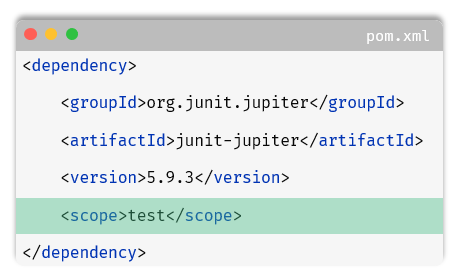

如果对 JUnit 单元测试的依赖设置 `scope` 为 `test`，就代表该依赖只是在测试程序中可以使用，在主程序中是无法使用的。所以我们会看到如下现象：
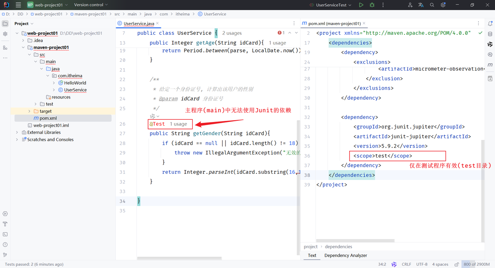

如上图所示，给 JUnit 依赖通过 `scope` 标签 指定依赖的作用范围，那么这个依赖 就只能作用在测试环境，其他环境下不能使用。

`scope` 的常见取值如下表所示：
| scope 值 | 主程序 | 测试程序 | 打包（运行） | 范例 |
| :--: | :--: | :--: | :--: | :--: |
| `compile`（默认） | Y | Y | Y | log4j |
| `test` | - | Y | - | junit |
| `provided` | Y | Y | - | servlet-api |
| `runtime` | - | Y | Y | jdbc 驱动 |