# 第四章：Web 后端基础（基础知识）

**目录：**

[TOC]

---

> 课程内容：
> * SpringBootWeb 入门。
> * HTTP 协议。
> * SpringBootWeb 案例。
> * 分层解耦。

前端页面资料可以部署在服务器上，然后打开浏览器就可以直接访问服务器上部署的前端页面了。

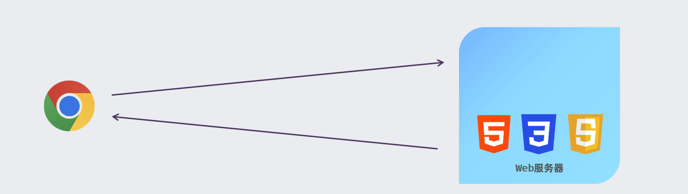

而像 HTML、CSS、JS 以及图片、音频、视频等这些资源，我们都称为**静态资源**。所谓静态资源，就是指在服务器上存储的不会改变的数据，通常不会根据用户的请求而变化。

与静态资源对应的还有一类资源，就是动态资源。所谓动态资源，就是指在服务器端上存储的、会根据用户请求和其他数据动态生成的，内容可能会在每次请求时都发生变化，例如 Servlet、JSP等（负责逻辑处理）。而 Servlet、JSP 这些技术现在早都被企业淘汰了，现在在企业项目开发中，都是直接基于 Spring 框架来构建动态资源。

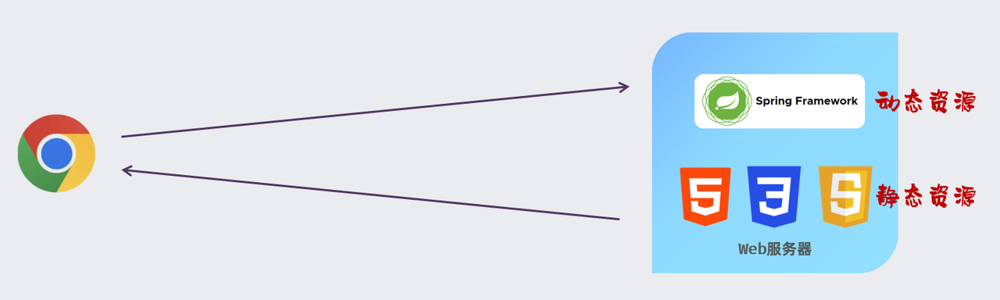

而对于我们 Java 程序开发的动态资源来说，我们通常会将这些动态资源部署在 Tomcat 这样的 Web 服务器中运行。而浏览器与服务器在通信的时候，基本都是基于 HTTP 协议的。

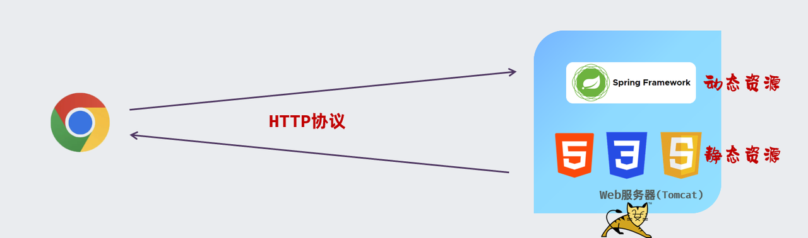

以上所描述的这种 **浏览器 / 服务器** 的架构模式，我们称之为：**BS 架构**。
* BS 架构：Browser / Server，浏览器  / 服务器架构模式。客户端只需要浏览器，应用程序的逻辑和数据都存储在服务端。
* CS 架构：Client / Server，客户端 / 服务器架构模式。需要单独开发维护客户端。

## 一、SpringBootWeb 入门

接下来，我们就要来讲解现在企业开发的主流技术 SpringBoot，并基于 SpringBoot 进行 Web 程序的开发。

### 1.1 概述

在正式学习 SpringBoot 之前，我们要先来了解一下什么是 Spring。

Spring 官网：[Spring 官网](https://spring.io "Spring 官网")。

Spring 家族旗下的技术中，最基础、最核心的是 SpringFramework；其他的 Spring 家族的技术，都是基于 SpringFramework 的。SpringFramework 中提供很多使用功能，如：依赖注入、事务管理、Web 开发支持、数据访问、消息服务等等。

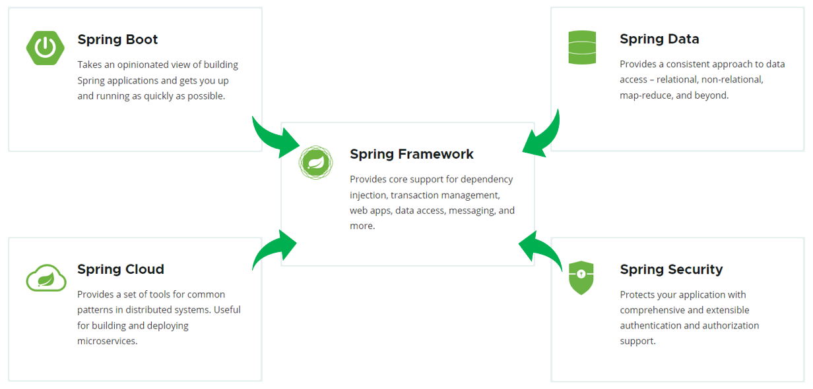

Spring 官方推荐我们从 SpringBoot 项目开始学习，通过 SpringBoot 可以帮助我们快速构建应用程序。

SpringBoot 可以帮助我们非常快速地构建应用程序、简化开发、提高效率。而直接基于 SpringBoot 进行项目构建和开发，不仅是 Spring 官方推荐地方式，也是现在企业开发的主流。

### 1.2 入门程序

#### 1.2.1 需求

需求：基于 SpringBoot 的方式开发一个 Web 应用，浏览器发起请求 `/hello` 后，给浏览器返回字符串 “`Hello xxx ~`”。

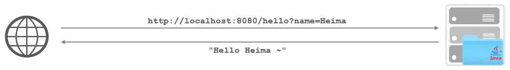

#### 1.2.2 开发步骤

第 1 步：创建 SpringBoot 工程，并勾选 Web 开发相关依赖。
第 2 步：定义 `HelloController` 类，添加方法 `hello`，并添加注解。

1). 创建 SpringBoot 工程（需要联网）

基于 Spring 官方骨架，创建 SpringBoot 工程：
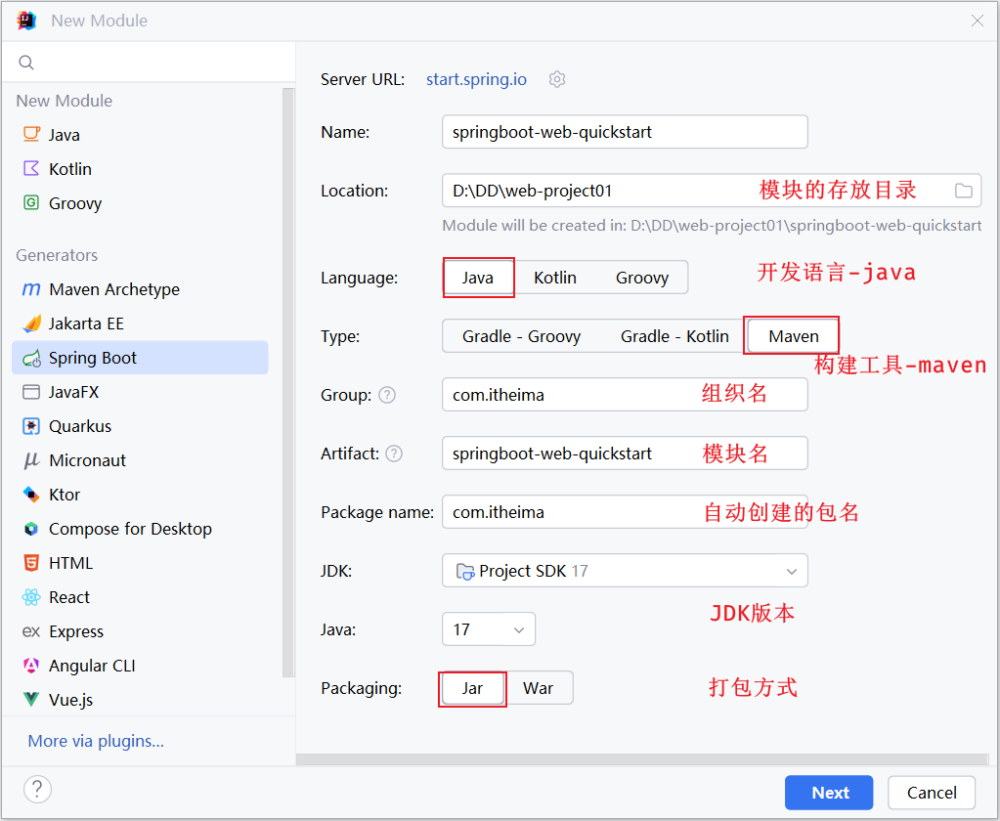

基本信息描述完毕之后，勾选 Web 开发相关依赖：
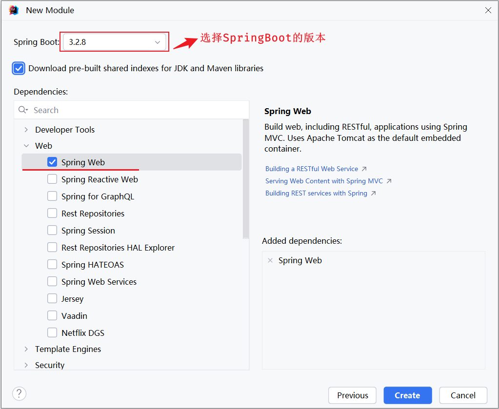

> 注意：
>
> SpringBoot 官方提供的脚手架，里面只能够选择 SpringBoot 的几个最新的版本；如果要选择其他相对低一点的版本，可以在 SpringBoot 项目创建完毕之后，修改项目的 pom.xml 文件中的版本号。

点击 Create 之后，就会联网创建这个 SpringBoot 工程。

创建好之后，结构如下：
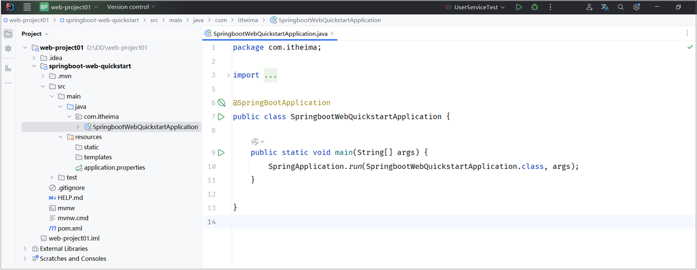

2). 定义 `HelloController` 类，添加方法 `hello`，并添加注解

在 com.xxx（例如：com.itheima；取决于你自己的域名及包名）这个包下新建一个类 `HelloController`：
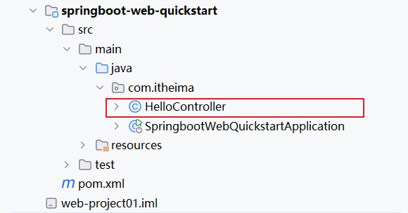

`HelloController` 中的内容，具体如下：
```java
package com.itheima;

import org.springframework.web.bind.annotation.RequestMapping;
import org.springframework.web.bind.annotation.RestController;

@RestController // 标识当前类是一个请求处理类
public class HelloController {

    @RequestMapping("/hello")   // 标识请求路径
    public String hello(String name){
        System.out.println("HelloController ... hello: " + name);
        return "Hello " + name;
    }

}
```

3). 运行测试

运行 SpringBoot 自动生成的引导类（标识有 `@SpringBootApplication` 注解的类）：
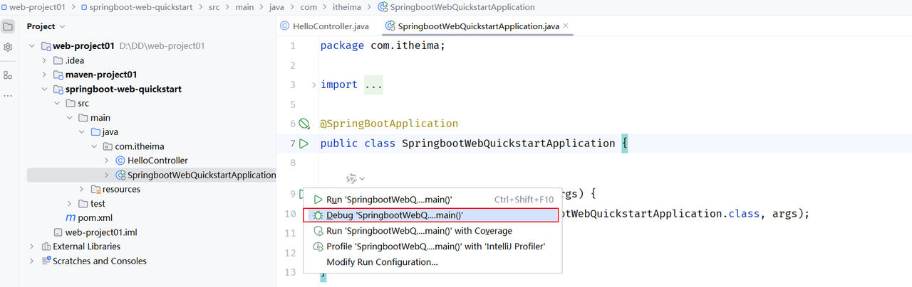

打开浏览器，输入 `http://localhost:8080/hello?name=itheima`：
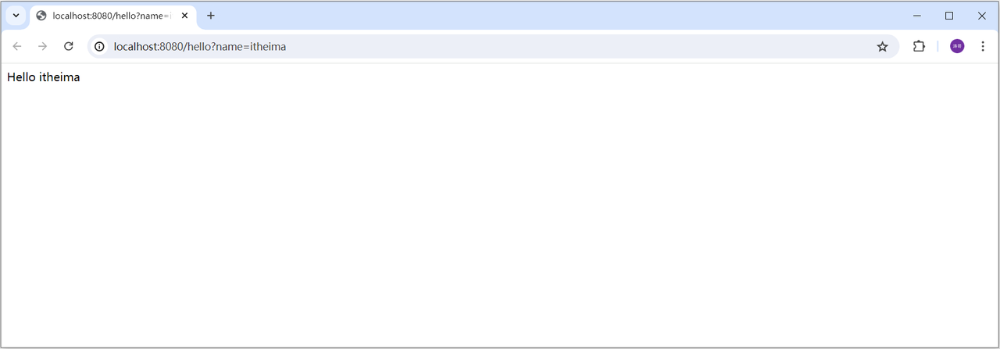

#### 1.2.3 常见问题

在联网基于 Spring 的脚手架创建 SpringBoot 项目，偶尔可能会因为网络的原因，无法链接到 SpringBoot 的脚手架网站。此时会出现如下现象：
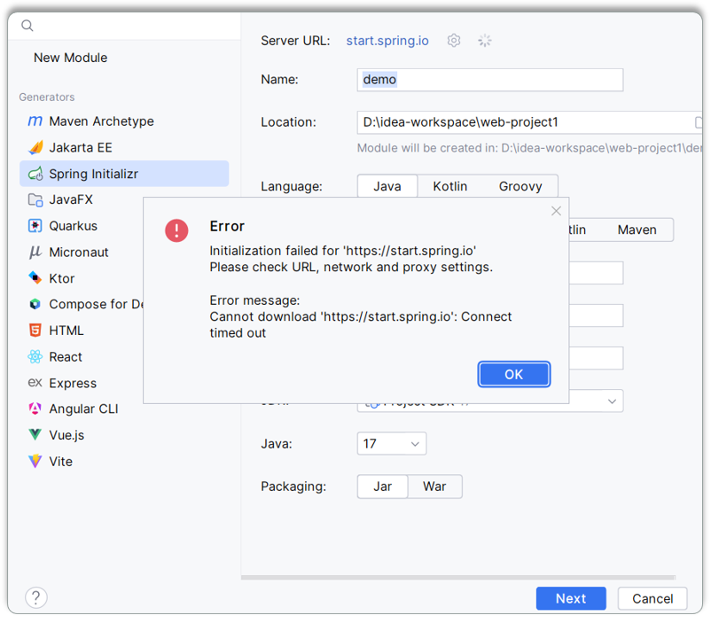

此时可以使用阿里云提供的脚手架，网址为：[阿里云提供的脚手架 - 网址](https://start.aliyun.com "阿里云提供的脚手架 - 网址")。如下图所示：
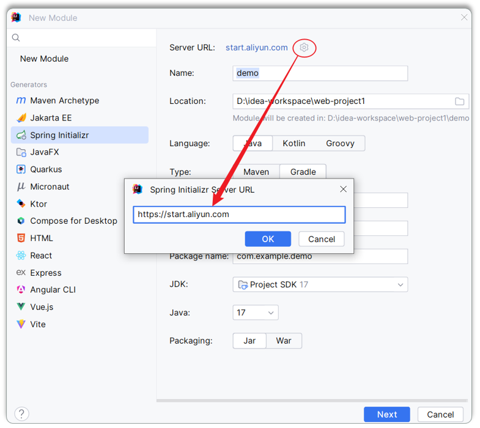

然后按照项目创建的向导，一步一步地创建项目即可。

### 1.3 入门解析

在上面，我们已经完成了 SpringBootWeb 的入门程序，并且测试通过。在入门程序中，我们发现，我们只需要一个 `main` 方法就可以将 Web 应用启动起来，然后就可以打开浏览器访问了。

那么接下来，我们需要明确两个问题。

1). 为什么一个 `main` 方法就可以将 Web 应用启动了？

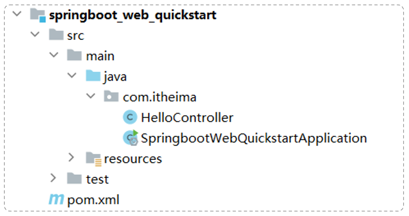

因为我们在创建 SpringBoot 项目的时候，选择了 Web 开发的起步依赖 spring-boot-starter-web。而 spring-boot-starter-web 依赖又依赖了 spring-boot-starter-tomcat，由于 Maven 的依赖传递特性，那么在我们创建的 SpringBoot 项目中也就已经有了 tomcat 的依赖，这个其实就是 SpringBoot 中内嵌的 tomcat。

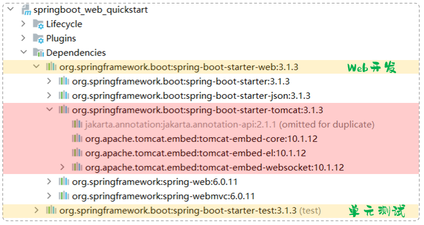

而我们运行引导类中的 `main` 方法，其实启动的就是 SpringBoot 中内嵌的 Tomcat 服务器；而我们所开发的项目，也会自动地部署在该 Tomcat 服务器中，并占用 8080 端口号。

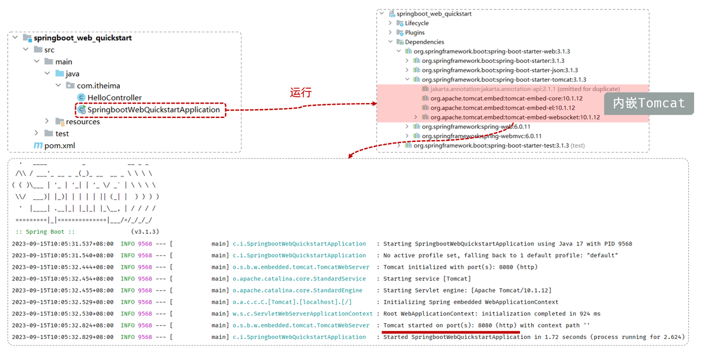

> **起步依赖：**
> * 一种为开发者提供简化配置和集成的机制，使得构建 Spring 应用程序更加轻松。起步依赖本质上是一组预定义的依赖项集合，它们一起提供了在特定场景下开发 Spring 应用所需的所有库和配置。
>   * spring-boot-starter-web：包含了 Web 应用开发所需要的常见依赖。
>   * spring-boot-starter-test：包含了单元测试所需要的常见依赖。
> * 官方提供的 starter：[官方提供的 starter](https://docs.spring.io/spring-boot/docs/3.1.3/reference/htmlsingle/#using.build-systems.starters "官方提供的 starter")。

## 二、HTTP 协议

### 2.1 HTTP 概述

#### 2.1.1 介绍


**HTTP**：**H**yper **T**ext **T**ransfer **P**rotocol（超文本传输协议），规定了浏览器与服务器之间数据传输的规则。
* HTTP 是互联网上应用最为广泛的一种网络协议。
* HTTP 协议要求：浏览器在向服务器发送请求数据时，或是服务器在向浏览器发送响应数据时，都必须按照固定的格式进行数据传输。

如果想知道 HTTP 协议的数据传输格式有哪些，可以打开浏览器，通过按键 `F12` 打开开发者工具，点击 Network（网络）来查看：
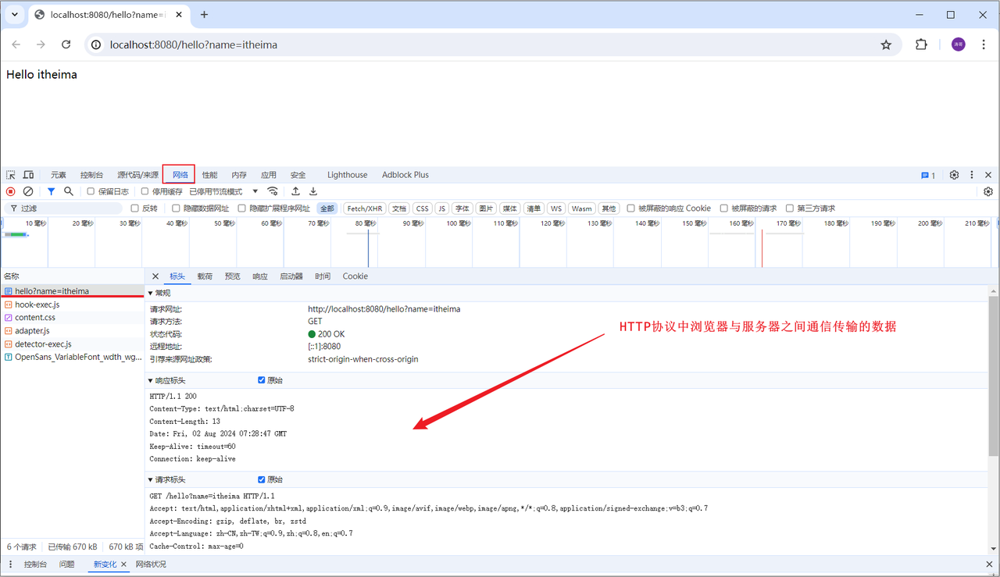

浏览器向服务器进行请求时，服务器按照固定的格式进行解析：
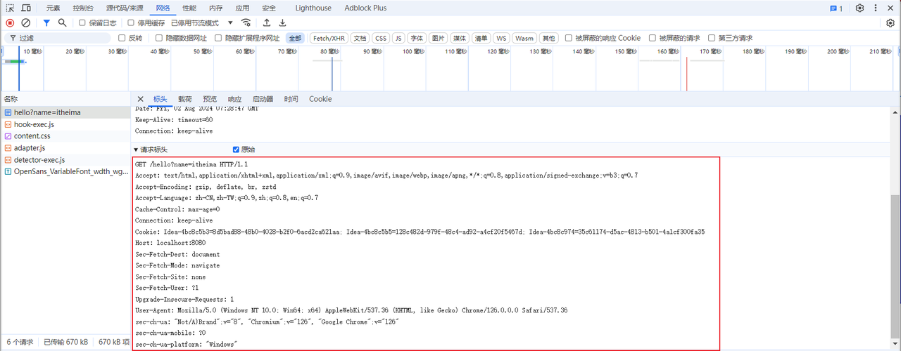

服务器向浏览器进行响应时，浏览器按照固定的格式进行解析：
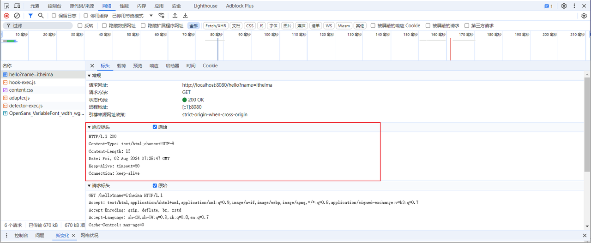

而我们学习 HTTP 协议，就是来学习请求和响应数据的具体格式内容。

#### 2.1.2 特点

HTTP 协议的特点：
* 基于 **TCP** 协议：面向连接，安全。

> TCP 是一种面向连接的（建立连接之前是需要经过三次握手）、可靠的、基于字节流的传输层通信协议，在数据传输方面更安全。

* 基于 **请求 - 响应** 模型：一次请求对应一次响应（先请求后响应）。

> 请求和响应是一一对应关系；没有请求，就没有响应。

* HTTP 协议是无状态协议：对于数据没有记忆能力，每次请求 - 响应都是独立的。

> 无状态指的是客户端发送 HTTP 请求给服务端之后，服务端根据请求响应数据；响应完后，不会记录任何信息。
> * 缺点：多次请求间不能共享数据。
> * 优点：速度快。
>
> 请求之间无法共享数据会引发问题。
> 
> 如京东购物，加入购物车和去购物车结算是两次请求。由于 HTTP 协议的无状态特性，加入购物车请求响应结束后，并未记录加入购物车的是何商品；发起去购物车结算的请求后，因为无法获取哪些商品加入了购物车，会导致此次请求无法正确展示数据。
>
> 具体使用的时候，我们发现京东是可以正常展示数据的。原因是 Java 早已考虑到这个问题，并提出了使用会话技术（Cookie、Session）来解决这个问题。

HTTP 协议规定了请求和响应数据的格式，那具体的格式是什么呢？

HTTP 协议又分为：**请求协议**和**响应协议**。我们分别详细剖析这两种协议的具体格式。

### 2.2 HTTP 请求协议

#### 2.2.1 介绍

**请求协议：** 浏览器将数据以请求格式发送到服务器，包括：**请求行**、**请求头**、**请求体**。

**GET 方式的请求协议：**

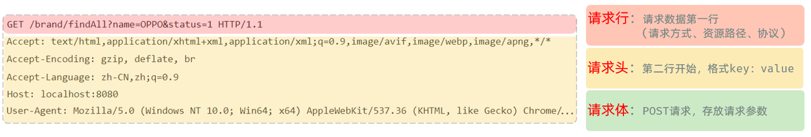

请求行（上图中红色部分）：HTTP 请求中的第一行数据，由 请求方式、资源路径、协议/版本 组成（之间使用空格分隔）。
* 请求方式：GET。
* 资源路径：`/brand/findAll?name=OPPO&status=1`。
  * 请求路径：`/brand/findAll`。
  * 请求参数：`name=OPPO&status=1`。
    * 请求参数是以 `key=value` 形式出现。
    * 多个请求参数之间使用 `&` 连接。
  * 请求路径和请求参数之间使用 `?` 连接。
* 协议/版本：HTTP/1.1。

请求头（上图中黄色部分）：第二行开始，上图黄色部分内容就是请求头，格式为 `key: value` 形式。
* HTTP 是个无状态的协议，所以在请求头设置浏览器的一些自身信息和想要响应的形式，这样服务器在收到信息后，就可以知道是谁、想要干什么了。
* 常见的 HTTP 请求头有：
    | 请求头 | 含义 |
    | :--: | :--: |
    | Host | 表示请求的主机名 |
    | User-Agent | 浏览器版本；例如：Chrome 浏览器的标识类似 `Mozilla/5.0 ... Chrome/79`，IE 浏览器的标识类似 `Mozilla/5.0 (Windows NT ...)like Gecko` |
    | Accept | 表示浏览器能接收的资源类型；例如：`text/*`、`image/*` 或者 `*/*`（表示所有） |
    | Accept-Language | 表示浏览器偏好的语言，服务器可以据此返回不同语言的网页 |
    | Accept-Encoding | 表示浏览器可以支持的压缩类型；例如：`gzip`、`deflate` 等 |
    | Content-Type | 请求主体的数据类型 |
    | Content-Length | 数据主体的大小（单位：字节） |

> 举例说明：服务端可以根据请求头中的内容来获取客户端的相关信息；有了这些信息，服务端就可以处理不同的业务需求。
>
> 例如：
> * 不同浏览器解析 HTML 和 CSS 标签的结果会有不一致，所以就会导致相同的代码在不同的浏览器会出现不同的效果。
> * 服务端根据客户端请求头中的数据获取到客户端的浏览器类型，就可以根据不同的浏览器设置不同的代码，来达到一致的效果。（这就是我们常说的浏览器兼容问题。）

请求体：存储请求参数。
* GET 请求的请求参数在请求行中，故不需要设置请求体。

**POST 方式的请求协议：**

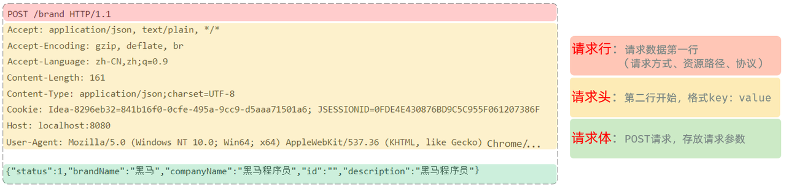

请求行（上图中红色部分）：包含请求方式、资源路径、协议/版本。
* 请求方式：POST。
* 资源路径：`/brand`。
* 协议/版本：HTTP/1.1。

请求头（上图中黄色部分）。

请求体（上图中绿色部分）：存储请求参数。
* 请求体和请求头之间是有一个空行隔开（作用：用于标记请求头结束）。

GET 请求和 POST 请求的区别：
| 区别方式 | GET 请求 | POST 请求 |
| :--: | :--: | :--: |
| 请求参数 | 请求参数在请求行中<br>例如：`/brand/findAll?name=OPPO&status=1` | 请求参数在请求体中 |
| 请求参数长度 | 请求参数长度有限制（浏览器不同，限制也不同） | 请求参数长度没有限制 |
| 安全性 | 安全性低<br>原因：请求参数暴露在浏览器地址栏中 | 安全性相对高 |

#### 2.2.2 获取请求数据

Web 服务器（Tomcat）对 HTTP 协议的请求数据进行解析，并进行了封装（HttpServletRequest），并在调用 Controller 方法的时候传递给了该方法。这样，就使得程序员不必直接对协议进行操作，让 Web 开发更加便捷。

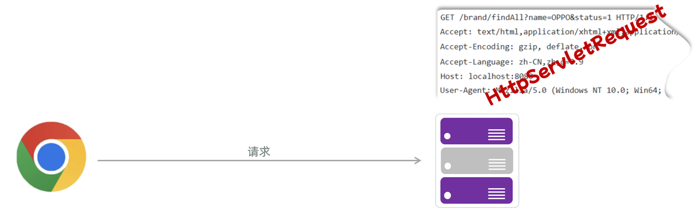

示例代码：
```java
/* RequestController.java */

package com.anxin_hitsz;

import jakarta.servlet.http.HttpServletRequest;
import org.springframework.web.bind.annotation.RequestMapping;
import org.springframework.web.bind.annotation.RestController;

/**
 * ClassName: RequestController
 * Package: com.anxin_hitsz
 * Description:
 *
 * @Author AnXin
 * @Create 2026/3/4 17:46
 * @Version 1.0
 */
@RestController
public class RequestController {

    @RequestMapping("/request")
    public String request(HttpServletRequest request) {
        // 1. 获取请求方式
        String method = request.getMethod();    // GET
        System.out.println("请求方式：" + method);

        // 2. 获取请求 url 地址
        String url = request.getRequestURI().toString();    // http://localhost:8080/request
        System.out.println("请求 url 地址：" + url);
        String uri = request.getRequestURI();   // /request
        System.out.println("请求 uri 地址：" + uri);

        // 3. 获取请求协议
        String protocol = request.getProtocol();    // HTTP/1.1
        System.out.println("请求协议：" + protocol);

        // 4. 获取请求参数 - name、age
        String name = request.getParameter("name");
        String age = request.getParameter("age");
        System.out.println("name：" + name + "；age：" + age);

        // 5. 获取请求头 - Accept
        String accept = request.getHeader("Accept");
        System.out.println("Accept：" + accept);

        return "OK";
    }

}

```

### 2.3 HTTP 响应协议

#### 2.3.1 格式介绍

**响应协议：** 服务器将数据以响应格式返回给浏览器，包括：**响应行**、**响应头**、**响应体**。

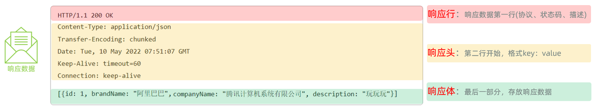

响应行（上图中红色部分）：响应数据的第一行。响应行由 协议及版本、响应状态码、状态码描述 组成。
* 协议/版本：HTTP/1.1。
* 响应状态码：200。
* 状态码描述：`OK`。

响应头（上图中黄色部分）：响应数据的第二行开始，格式为 `key: value` 形式。
* HTTP 是个无状态的协议，所以可以在请求头和响应头中设置一些信息和想要执行的动作，这样对方在收到信息后，就可以知道是谁、想要干什么了。
* 常见的 HTTP 响应头有：
    | 响应头 | 含义 |
    | :--: | :--: |
    | Content-Type | 表示该响应内容的类型；例如：`text/html`、`image/jpeg` |
    | Content-Length | 表示该响应内容的长度（字节数） |
    | Content-Encoding | 表示该响应压缩算法；例如：`gzip` |
    | Cache-Control | 指示客户端应如何缓存；例如：`max-age=300` 表示可以最多缓存 300 秒 |
    | Set-Cookie | 告诉浏览器为当前页面所在的域设置 cookie |

响应体（上图中绿色部分）：响应数据的最后一部分，存储响应的数据。
* 响应体和响应头之间有一个空行隔开（作用：用于标记响应头结束）。

#### 2.3.2 响应状态码

| 状态码分类 | 说明 |
| :--: | :--: |
| 1xx | **响应中** - 临时状态码，表示请求已经接受，告诉客户端应该继续请求，或者如果已经完成则忽略 |
| 2xx | **成功** - 表示请求已经被成功接收，处理已完成 |
| 3xx | **重定向** - 重定向到其它地方，让客户端再发起一个请求以完成整个处理 |
| 4xx | **客户端错误** - 处理发生错误，责任在客户端<br>例如：客户端在请求一个不存在的资源、客户端未被授权、禁止访问等 |
| 5xx | **服务器端错误** - 处理发生错误，责任在服务端<br>例如：服务端抛出异常、路由出错、HTTP 版本不支持等 |

状态码大全：[状态码大全](https://cloud.tencent.com/developer/chapter/13553 "状态码大全")。

关于响应状态码，我们先主要认识三个状态码，其余的等后期用到了再去掌握：
* `200 OK`：客户端请求成功。
* `404 Not Found`：请求资源不存在。
* `500 Internal Server Error`：服务端发生不可预期的错误。

#### 2.3.3 设置响应数据

Web 服务器对 HTTP 协议的响应数据进行了封装（HttpServletResponse），并在调用 Controller 方法的时候传递给了该方法。这样，就使得程序员不必直接对协议进行操作，让 Web 开发更加便捷。

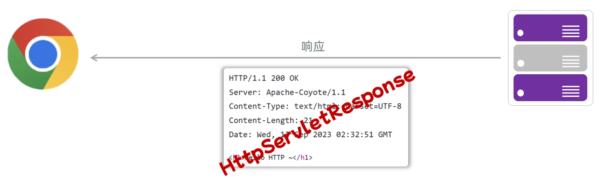

示例代码：
```java
/* ResponseController.java */

package com.anxin_hitsz;

import jakarta.servlet.http.HttpServletResponse;
import org.springframework.http.ResponseEntity;
import org.springframework.web.bind.annotation.RequestMapping;
import org.springframework.web.bind.annotation.RestController;

import java.io.IOException;

/**
 * ClassName: ResponseController
 * Package: com.anxin_hitsz
 * Description:
 *
 * @Author AnXin
 * @Create 2026/3/4 19:55
 * @Version 1.0
 */
@RestController
public class ResponseController {

    /**
     * 方式一：HttpServletResponse 设置响应数据
     */
    @RequestMapping("/response1")
    public void response1(HttpServletResponse response) throws IOException {
        // 1. 设置响应状态码
        response.setStatus(401);

        // 2. 设置响应头
        response.setHeader("name", "itheima");

        // 3. 设置响应体
        response.getWriter().write("<h1>hello response</h1>");

    }

    /**
     * 方式二：ResponseEntity -> Spring 中提供的方式
     */
    @RequestMapping("/response2")
    public ResponseEntity<String> response2() {
        return ResponseEntity
                .status(401)   // 响应状态码
                .header("name", "javaweb-ai")   // 响应头
                .body("<h1>hello response</h1>");   // 响应体
    }

}

```

> 注意：
>
> 响应状态码和响应头如果没有特殊要求的话，通常不手动设定；服务器会根据请求处理的逻辑，自动设置响应状态码和响应头。

## 三、SpringBootWeb 案例

### 3.1 需求说明

需求：基于 SpringBoot 开发 Web 程序，完成用户列表的渲染展示。

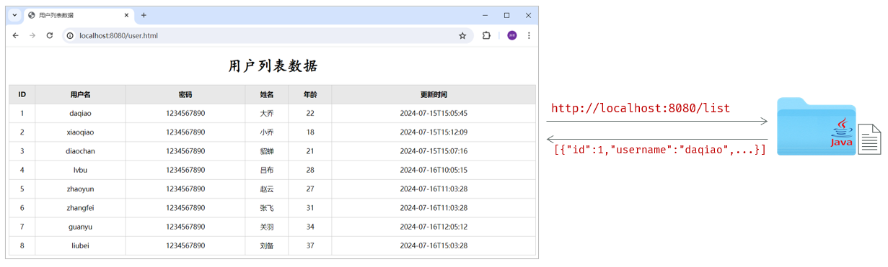

当在浏览器地址栏访问 [前端静态页面](http://localhost:8080/user.html "前端静态页面") 后，在前端页面上会发送 Ajax 请求，请求 [服务端](http://localhost:8080/list "服务端")；服务端程序加载 user.txt 文件中的数据，读取出来后，最终给前端页面响应 JSON 格式的数据；前端页面再将数据渲染展示在表格中。

### 3.2 代码实现

1). 准备工作 1：再创建一个 SpringBoot 工程，并勾选 Spring Web 依赖、Lombok 依赖

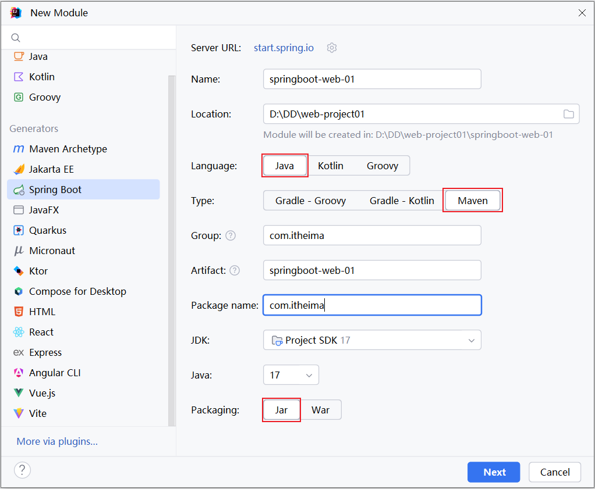

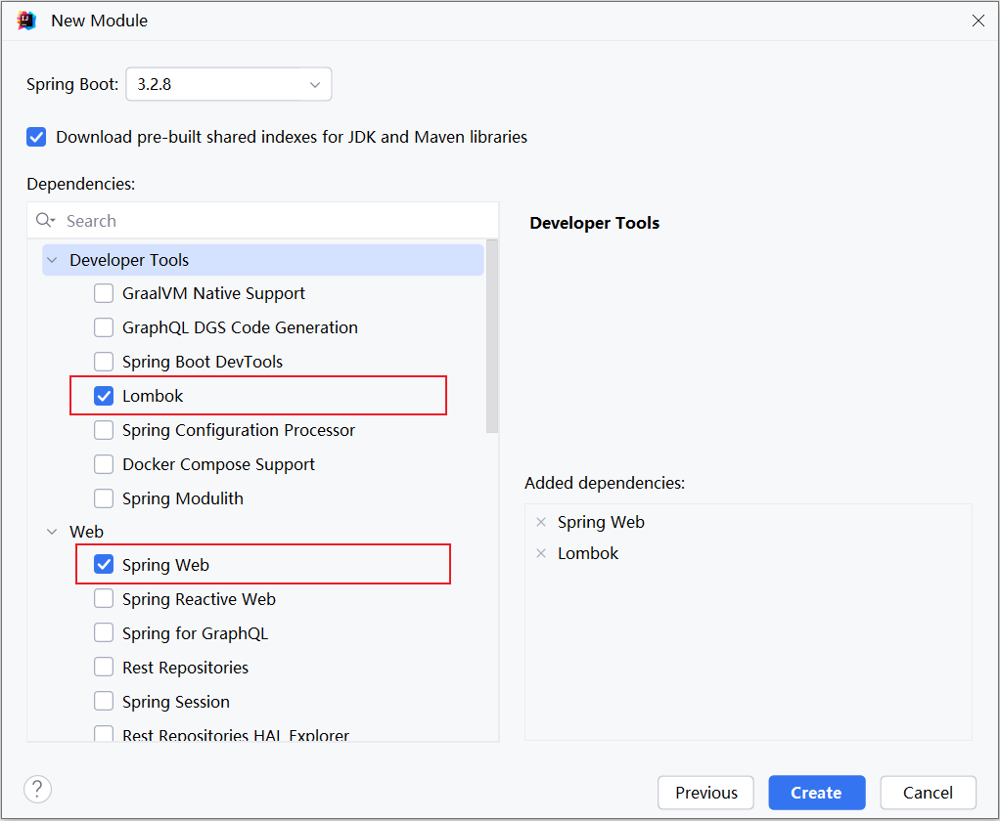

2). 准备工作 2：引入资料中准备好的数据文件 user.txt，以及 static 下的前端静态页面

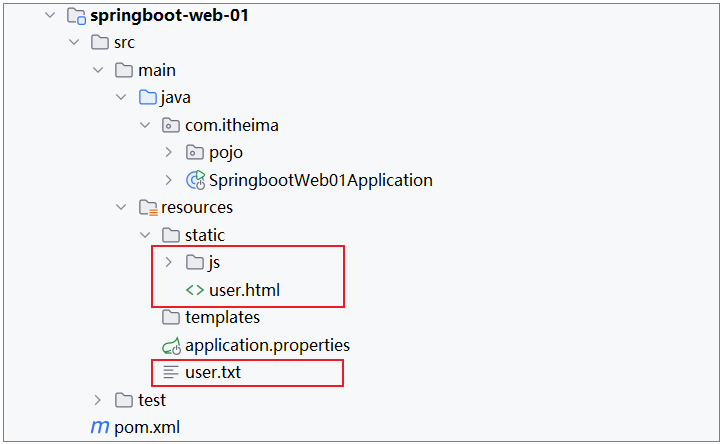

3). 准备工作 3：定义封装用户信息的实体类

在 com.xxx（例如：com.itheima；取决于你自己的域名及包名）下，再定义一个包 pojo，专门用来存放实体类；在该包下定义一个实体类 `User`。

示例代码：
```java
/* User.java */

package com.anxin_hitsz.pojo;

import lombok.AllArgsConstructor;
import lombok.Data;
import lombok.NoArgsConstructor;

import java.time.LocalDateTime;

/**
 * ClassName: User
 * Package: com.anxin_hitsz.pojo
 * Description:
 *
 * @Author AnXin
 * @Create 2026/3/4 20:42
 * @Version 1.0
 */

/**
 * 用户信息
 */
@Data
@NoArgsConstructor
@AllArgsConstructor
public class User {

    private Integer id;
    private String username;
    private String password;
    private String name;
    private Integer age;
    private LocalDateTime updateTime;

}

```

4). 开发服务端程序，接收请求，读取文本数据并响应

由于在案例中，需要读取文本中的数据，并且还需要将对象转为 JSON 格式，所以在这里，我们在项目中再引入一个非常常用的工具包 hutool；然后调用里面的工具类，就可以非常方便快捷地完成业务操作。

* pom.xml 中引入依赖

```java
<dependency>
    <groupId>cn.hutool</groupId>
    <artifactId>hutool-all</artifactId>
    <version>5.8.27</version>
</dependency>
```

* 在 com.xxx（例如：com.itheima；取决于你自己的域名及包名）包下新建一个子包 controller，在其中创建一个 `UserController` 类。

```java
/* UserController.java */

package com.anxin_hitsz.controller;

import cn.hutool.core.io.IoUtil;
import com.anxin_hitsz.pojo.User;
import org.springframework.web.bind.annotation.RequestMapping;
import org.springframework.web.bind.annotation.RestController;

import java.io.File;
import java.io.FileInputStream;
import java.io.FileNotFoundException;
import java.io.InputStream;
import java.nio.charset.StandardCharsets;
import java.time.LocalDateTime;
import java.time.format.DateTimeFormatter;
import java.util.ArrayList;
import java.util.List;
import java.util.stream.Collectors;

/**
 * ClassName: UserController
 * Package: com.anxin_hitsz.controller
 * Description:
 *
 * @Author AnXin
 * @Create 2026/3/4 20:46
 * @Version 1.0
 */

/**
 * 用户信息 Controller
 */
@RestController // @ResponseBody - 作用：将 Controller 的返回值直接作为响应体的数据直接响应；如果返回值是对象 / 集合 -> JSON 后响应
public class UserController {

    @RequestMapping("/list")
    public List<User> list() throws Exception {
        // 1. 加载并读取 user.txt 文件，获取用户数据
        InputStream in = this.getClass().getClassLoader().getResourceAsStream("user.txt");
        ArrayList<String> lines = IoUtil.readLines(in, StandardCharsets.UTF_8, new ArrayList<>());

        // 2. 解析用户信息，封装为 User 对象 -> list 集合
        List<User> userList = lines.stream().map(line -> {
            String[] parts = line.split(",");
            Integer id = Integer.parseInt(parts[0]);
            String username = parts[1];
            String password = parts[2];
            String name = parts[3];
            Integer age = Integer.parseInt(parts[4]);
            LocalDateTime updateTime = LocalDateTime.parse(parts[5], DateTimeFormatter.ofPattern("yyyy-MM-dd HH:mm:ss"));
            return new User(id, username, password, name, age, updateTime);
        }).toList();

        // 3. 返回数据（JSON 格式）
        return userList;

    }

}

```

> 注意：
>
> 在加载并读取 user.txt 文件以获取用户数据时：
> ```java
> // 1. 加载并读取 user.txt 文件，获取用户数据
> InputStream in = this.getClass().getClassLoader().getResourceAsStream("user.txt");
> ArrayList<String> lines = IoUtil.readLines(in, StandardCharsets.UTF_8, new ArrayList<>());
> ```
>
> 因为 src 下的 java 目录和 resources 目录编译后会在同一个目录下，可以通过字节码对象获取类的加载器，因此推荐以上述方式读取 resources 目录下的文件。

5). 启动服务测试，访问 http://localhost:8080/user.html

### 3.3 `@ResponseBody`

前面我们学习过 HTTP 协议的交互方式：请求响应模式（有请求就有响应）。那么 Controller 程序除了接收请求外，还可以进行响应。

在我们前面所编写的 Controller 方法中，都已经设置了响应数据。

Controller 方法中的 `return` 的结果，怎么就可以响应给浏览器呢？
* 答案：使用 `@ResponseBody` 注解。

`@ResponseBody` 注解：
* 类型：方法注解、类注解。
* 位置：书写在 Controller 方法上或类上。
* 作用：将方法返回值直接响应给浏览器；如果返回值类型是实体对象 / 集合，将会转换为 JSON 格式后再响应给浏览器。

但是再我们所书写的 Controller 中，只在类上添加了 `@RestController` 注解、方法上添加了 `@RequestMapping` 注解，并没有使用 `@ResponseBody` 注解，怎么给浏览器响应呢？

这是因为，我们在类上加了 `@RestController` 注解，而这个注解是由两个注解组合起来的，分别是：`@Controller`、`@ResponseBody`。那也就意味着，我们在类上已经添加了 `@ResponseBody` 注解了；而一旦在类上加了 `@ResponseBody` 注解，就相当于该类所有的方法中都已经添加了 `@ResponseBody` 注解。

> 提示：
>
> 前后端分离的项目中，一般直接在请求处理类上加 `@RestController` 注解，就无需在方法上加 `@ResponseBody` 注解了。

### 3.4 问题分析

上述案例的功能，我们虽然已经实现了，但是我们会发现案例中解析文本文件中的数据的代码、处理数据的逻辑代码、给页面响应的代码全部都堆积在一起了，即全部都写在 Controller 方法中了。

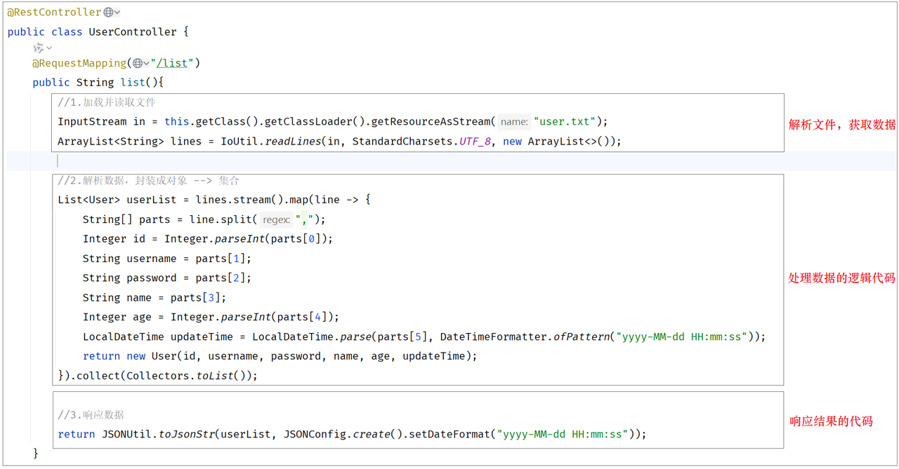

当前程序的这个业务逻辑还是比较简单的；如果业务逻辑再稍微复杂一点，我们会看到 Controller 方法的代码量将会较大。

这样会造成我们的整个工程代码的复用性比较差，而且代码难以维护。那如何解决这个问题呢？其实在现在的开发中，有非常成熟的解决思路，那就是分层开发。

## 四、分层解耦

### 4.1 三层架构

#### 4.1.1 介绍

在我们进行程序设计以及程序开发时，尽可能让每一个接口、类、方法的职责更单一一些（单一职责原则）。

> 单一职责原则：一个类或一个方法，就只做一件事情、只管一块功能。
>
> 这样就可以让类、接口、方法的复杂度更低，可读性更强，扩展性更好，也更利于后期的维护。

我们之前开发的程序，并不满足单一职责原则。下面我们来分析一下之前的程序：
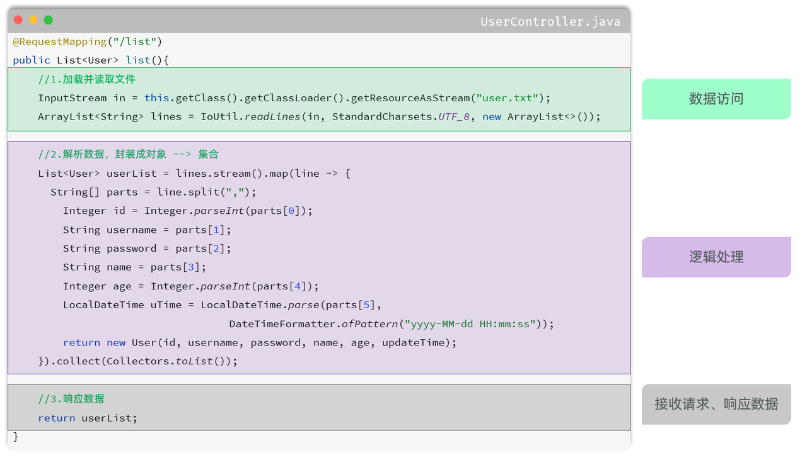

其实我们上述案例的处理逻辑从组成上可以分为三个部分：
* 数据访问：负责业务数据的维护操作，包括增、删、改、查等操作。
* 逻辑处理：负责业务逻辑处理的代码。
* 请求处理、响应数据：负责接收页面的请求、给页面响应数据。

按照上述的三个组成部分，在我们项目开发中，可以将代码分为三层，如下图所示：
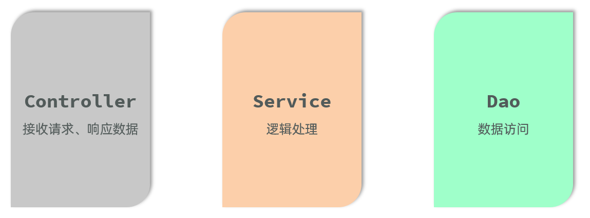

其中：
* Controller：控制层；接收前端发送的请求，对请求进行处理，并响应数据。
* Service：业务逻辑层；处理具体的业务逻辑。
* Dao：数据访问层（Data Access Object），也称为持久层；负责数据访问操作，包括数据的增、删、改、查。

基于三层架构的程序执行流程，如下图所示：
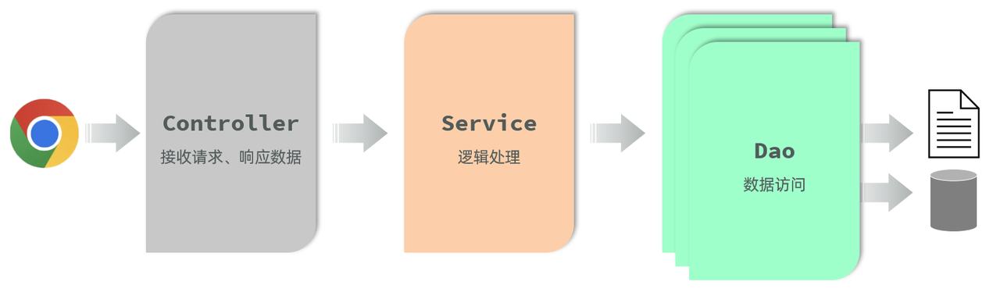
* 前端发起的请求，由 Controller 层接收（Controller 响应数据给前端）。
* Controller 层调用 Service 层来进行逻辑处理（Service 层处理完后，把处理结果返回给 Controller 层）。
* Service 层调用 Dao 层（逻辑处理过程中需要用到的一些数据要从 Dao 层获取）。
* Dao 层操作文件中的数据（Dao 拿到的数据会返回给 Service 层）。

> 思考：按照三层架构的思想，如果要对业务逻辑（Service 层）进行变更，会影响到 Controller 层和 Dao 层吗？
>
> 答案：不会影响。（程序的扩展性、维护性变得更好了。）

#### 4.1.2 代码拆分

我们使用三层架构的思想，来改造下之前的程序：
* 控制层包名：com.xxx.controller。
* 业务逻辑层包名：com.xxx.service。
* 数据访问层包名：com.xxx.dao。

> 注意：
> 
> com.xxx（例如：com.itheima）取决于你自己的域名及包名。
> 
> 以下不再赘述。

1). 控制层：接收前端发送的请求，对请求进行处理，并响应数据

在 com.xxx.controller 中创建 `UserController` 类，代码如下：
```java
/* controller/UserController.java */

package com.anxin_hitsz.controller;

import cn.hutool.core.io.IoUtil;
import com.anxin_hitsz.pojo.User;
import com.anxin_hitsz.service.UserService;
import com.anxin_hitsz.service.impl.UserServiceImpl;
import org.springframework.web.bind.annotation.RequestMapping;
import org.springframework.web.bind.annotation.RestController;

import java.io.File;
import java.io.FileInputStream;
import java.io.FileNotFoundException;
import java.io.InputStream;
import java.nio.charset.StandardCharsets;
import java.time.LocalDateTime;
import java.time.format.DateTimeFormatter;
import java.util.ArrayList;
import java.util.List;
import java.util.stream.Collectors;

/**
 * ClassName: UserController
 * Package: com.anxin_hitsz.controller
 * Description:
 *
 * @Author AnXin
 * @Create 2026/3/4 20:46
 * @Version 1.0
 */

/**
 * 用户信息 Controller
 */
@RestController // @ResponseBody - 作用：将 Controller 的返回值直接作为响应体的数据直接响应；如果返回值是对象 / 集合 -> JSON 后响应
public class UserController {

    private UserService userService = new UserServiceImpl();

    @RequestMapping("/list")
    public List<User> list() throws Exception {
        // 1. 调用 Service，获取数据
        List<User> userList = userService.findAll();

        // 2. 返回数据（JSON 格式）
        return userList;
    }

}

```

2). 业务逻辑层：处理具体的业务逻辑

在 com.xxx.service 中创建 `UserService` 接口，代码如下：
```java
/* service/UserService.java */

package com.anxin_hitsz.service;

import com.anxin_hitsz.pojo.User;

import java.util.List;

/**
 * ClassName: UserService
 * Package: com.anxin_hitsz.service
 * Description:
 *
 * @Author AnXin
 * @Create 2026/3/4 22:21
 * @Version 1.0
 */
public interface UserService {

    /**
     * 查询所有用户信息
     */
    public List<User> findAll();

}

```

在 com.xxx.service.impl 中创建 `UserServiceImpl` 接口，代码如下：
```java
/* service/impl/UserServiceImpl.java */

package com.anxin_hitsz.service.impl;

import com.anxin_hitsz.dao.UserDao;
import com.anxin_hitsz.dao.impl.UserDaoImpl;
import com.anxin_hitsz.pojo.User;
import com.anxin_hitsz.service.UserService;

import java.time.LocalDateTime;
import java.time.format.DateTimeFormatter;
import java.util.List;

/**
 * ClassName: UserServiceImpl
 * Package: com.anxin_hitsz.service.impl
 * Description:
 *
 * @Author AnXin
 * @Create 2026/3/4 22:22
 * @Version 1.0
 */
public class UserServiceImpl implements UserService {

    private UserDao userDao = new UserDaoImpl();

    @Override
    public List<User> findAll() {
        // 1. 调用 Dao，获取数据
        List<String> lines = userDao.findAll();

        // 2. 解析用户信息，封装为 User 对象 -> list 集合
        List<User> userList = lines.stream().map(line -> {
            String[] parts = line.split(",");
            Integer id = Integer.parseInt(parts[0]);
            String username = parts[1];
            String password = parts[2];
            String name = parts[3];
            Integer age = Integer.parseInt(parts[4]);
            LocalDateTime updateTime = LocalDateTime.parse(parts[5], DateTimeFormatter.ofPattern("yyyy-MM-dd HH:mm:ss"));
            return new User(id, username, password, name, age, updateTime);
        }).toList();

        return userList;
    }
}

```

3). 数据访问层：负责数据的访问操作，包含数据的增、删、改、查

在 com.xxx.dao 中创建 `UserDao` 接口，代码如下：
```java
/* dao/UserDao.java */

package com.anxin_hitsz.dao;

import com.anxin_hitsz.pojo.User;

import java.util.List;

/**
 * ClassName: UserDao
 * Package: com.anxin_hitsz.dao
 * Description:
 *
 * @Author AnXin
 * @Create 2026/3/4 22:20
 * @Version 1.0
 */
public interface UserDao {

    /**
     * 加载用户数据
     */
    public List<String> findAll();

}

```

在 com.xxx.dao.impl 中创建 `UserDaoImpl` 接口，代码如下：
```java
/* dao/impl/UserDaoImpl.java */

package com.anxin_hitsz.dao.impl;

import cn.hutool.core.io.IoUtil;
import com.anxin_hitsz.dao.UserDao;

import java.io.InputStream;
import java.nio.charset.StandardCharsets;
import java.util.ArrayList;
import java.util.List;

/**
 * ClassName: UserDaoImpl
 * Package: com.anxin_hitsz.dao.impl
 * Description:
 *
 * @Author AnXin
 * @Create 2026/3/4 22:21
 * @Version 1.0
 */
public class UserDaoImpl implements UserDao {
    @Override
    public List<String> findAll() {
        // 1. 加载并读取 user.txt 文件，获取用户数据
        InputStream in = this.getClass().getClassLoader().getResourceAsStream("user.txt");
        ArrayList<String> lines = IoUtil.readLines(in, StandardCharsets.UTF_8, new ArrayList<>());
        return lines;
    }
}

```

具体的请求调用流程：
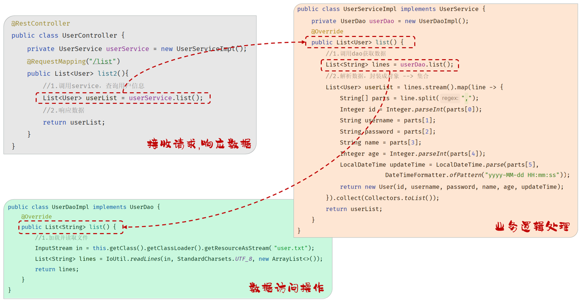

### 4.2 分层解耦

#### 4.2.1 问题分析

由于我们现在在程序中，需要什么对象，直接 `new` 一个对象 `new UserServiceImpl()`。

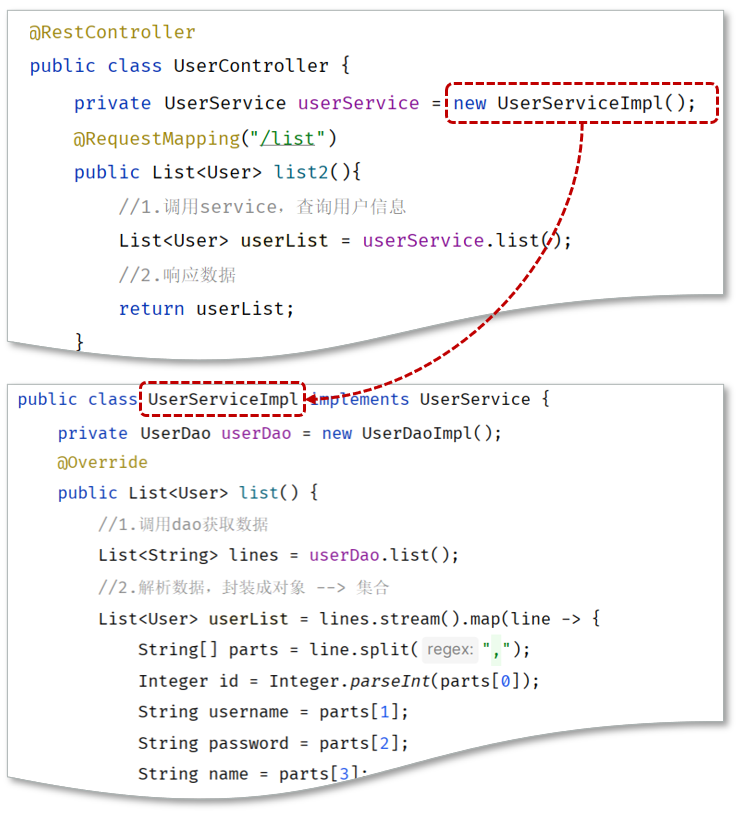

如果我们需要更换实现类，例如由于业务的变更，UserServiceImpl 不能满足现有的业务需求，我们需要切换为 UserServiceImpl2 这套实现，就需要修改 Controller 的代码，需要创建 UserServiceImpl2 的实现 `new UserServiceImpl2()`。

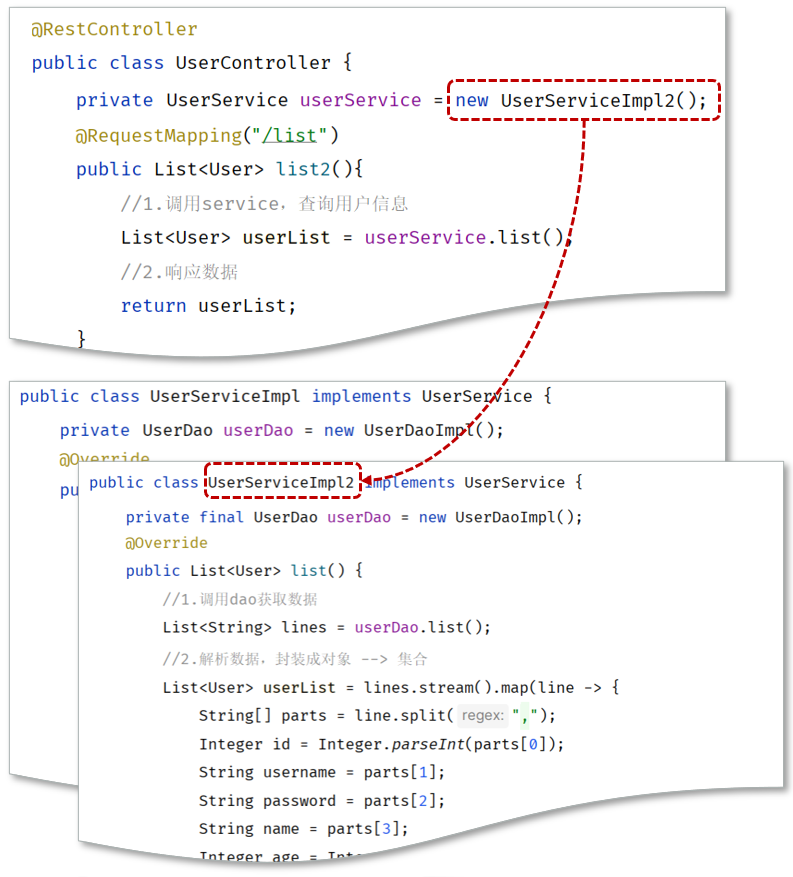

Service 中调用 Dao，也是类似的问题。

以上问题，我们称之为层与层之间 **耦合** 了。那什么是耦合呢？

首先需要了解软件开发涉及到的两个概念：内聚和耦合。
* **内聚**：软件中各个功能模块内部的功能联系。
* **耦合**：衡量软件中各个层 / 模块之间的依赖、关联的程度。

**软件设计原则：高内聚、低耦合。**
> **高内聚**：指的是一个模块中各个元素之间的联系的紧密程度；如果各个元素（语句、程序段）之间的联系程度越高，则内聚性越高，即“高内聚”。
>
> **低耦合**：指的是软件中各个层、模块之间的依赖关联程度越低越好。

目前层与层之间是存在耦合的，Controller 耦合了 Service、Service 耦合了 Dao。而“高内聚、低耦合”的目的是使程序模块的可重用性、移植性大大增强。

那最终我们的目标，就是做到层与层之间尽可能地降低耦合，甚至解除耦合。

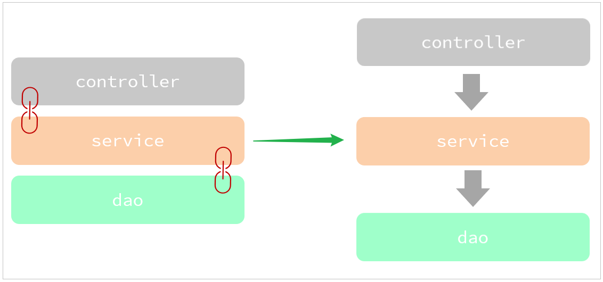

#### 4.2.2 解耦思路

之前我们在编写代码时，需要什么对象，就直接 `new` 一个就可以了。这种做法会导致层与层之间的代码耦合；当 Service 层的实现变了之后，我们还需要修改 Controller 层的代码。

那应该怎么解耦呢？

1). 首先，不能在 Controller 中使用 `new` 来创建对象

代码如下：
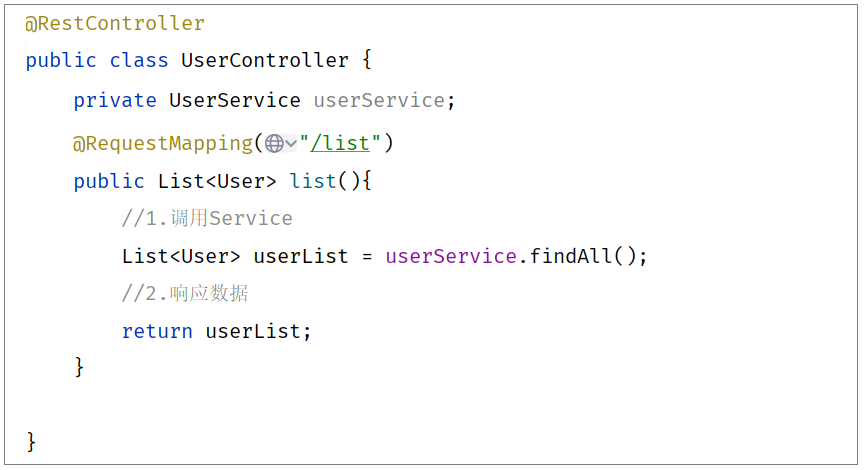

此时，就存在另一个问题了：不能 `new`，就意味着没有业务层对象（程序运行就报错）。怎么办呢？

我们的解决思路是：
* 提供一个容器，容器中存储一些对象（例如：UserService 对象）。
* Controller 程序从容器中获取 UserService 类型的对象。

2). 将要用到的对象交给一个容器管理

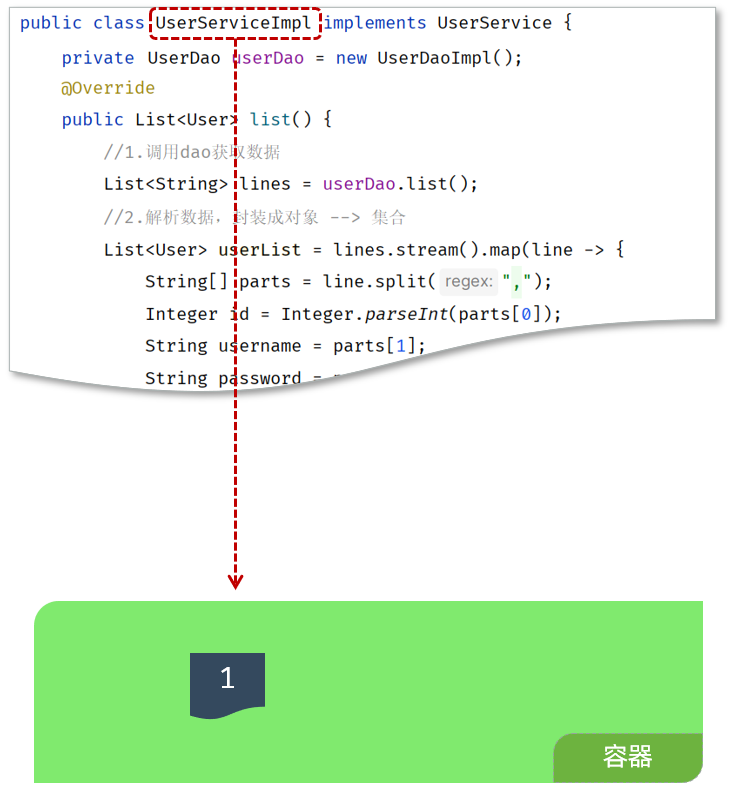

3). 应用程序中用到这个对象，就直接从容器中获取

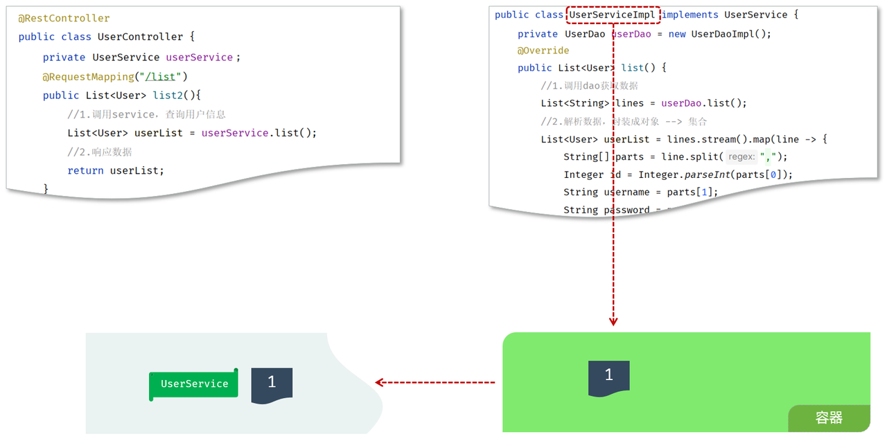

那问题来了，我们如何将对象交给容器管理呢？程序运行时，容器如何为程序提供依赖的对象呢？

我们想要实现上述解耦操作，就涉及到 Spring 中的两个核心概念：
* **控制反转**：**I**nversion **O**f **C**ontrol，简称 **IOC**。对象的创建控制权由程序自身转移到外部（容器），这种思想称为控制反转。
  * 对象的创建权由程序员主动创建转移到容器（由容器创建、管理对象）。这个容器称为：IOC 容器或 Spring 容器。
* **依赖注入**：**D**ependency **I**njection，简称 **DI**。容器为应用程序提供运行时所依赖的资源，称之为依赖注入。
  * 程序运行时需要某个资源，此时容器就为其提供这个资源。
  * 例如：UserController 程序运行时需要 UserService 对象，Spring 容器就为其提供并注入 UserService 对象。

**Bean 对象**：IOC 容器中创建、管理的对象，称之为 Bean 对象。

### 4.3 IOC&DI 入门

1). 将 Service 及 Dao 层的实现类，交给 IOC 容器管理

在实现类加上 `@Component` 注解，就代表把当前类产生的对象交给 IOC 容器管理。

示例代码：
```java

```

2). 为 Controller 及 Service 注入运行时所依赖的对象

示例代码：
```java

```

启动服务，运行测试。打开浏览器，地址栏直接访问：[访问地址](http://localhost:8080/user.html "访问地址")。

依然正常访问，就说明入门程序完成了；且已经完成了层与层之间的解耦。

### 4.4 IOC 详解

通过 IOC 和 DI 的入门程序，我们已经基本了解了 IOC 和 DI 的基础操作。接下来，我们需要学习 IOC 控制反转和 DI 依赖注入的细节。

#### 4.4.1 Bean 的声明

前面我们提到 IOC 控制反转，就是将对象的控制权交给 Spring 的 IOC 容器，由 IOC 容器创建及管理对象。IOC 容器创建的对象称为 Bean 对象。

在之前的入门案例中，要把某个对象交给 IOC 容器管理，需要在类上添加一个注解：`@Component`。

> 注意：
>
> 将一个类交给 IOC 容器管理时，`@Component` 是要加在实现类上，而非接口上。

而 Spring 框架为了更好地标识 Web 应用程序开发当中 Bean 对象到底归属于哪一层，又提供了 `@Component` 的衍生注解：
| 注解 | 说明 | 位置 |
| :--: | :--: | :--: |
| `@Component` | 声明 Bean 的基础注解 | 不属于以下三类时，用此注解 |
| `@Controller` | `@Component` 的衍生注解 | 标注在控制层类上 |
| `@Service` | `@Component` 的衍生注解 | 标注在业务层类上 |
| `@Repository` | `@Component` 的衍生注解 | 标注在数据访问层类上（由于与 MyBatis 整合，因此不常使用） |

那么此时，我们就可以使用 `@Service` 注解声明 Service 层的 Bean，使用 `@Repository` 注解声明 Dao 层的 Bean。

代码实现如下。

* Controller 层：

```java
/* controller/UserController.java */

package com.anxin_hitsz.controller;

import cn.hutool.core.io.IoUtil;
import com.anxin_hitsz.pojo.User;
import com.anxin_hitsz.service.UserService;
import com.anxin_hitsz.service.impl.UserServiceImpl;
import org.springframework.beans.factory.annotation.Autowired;
import org.springframework.web.bind.annotation.RequestMapping;
import org.springframework.web.bind.annotation.RestController;

import java.io.File;
import java.io.FileInputStream;
import java.io.FileNotFoundException;
import java.io.InputStream;
import java.nio.charset.StandardCharsets;
import java.time.LocalDateTime;
import java.time.format.DateTimeFormatter;
import java.util.ArrayList;
import java.util.List;
import java.util.stream.Collectors;

/**
 * ClassName: UserController
 * Package: com.anxin_hitsz.controller
 * Description:
 *
 * @Author AnXin
 * @Create 2026/3/4 20:46
 * @Version 1.0
 */

/**
 * 用户信息 Controller
 */
@RestController // @ResponseBody - 作用：将 Controller 的返回值直接作为响应体的数据直接响应；如果返回值是对象 / 集合 -> JSON 后响应
public class UserController {

    @Autowired  // 应用程序运行时，会自动地查询该类型的 Bean 对象，并赋值给该成员变量
    private UserService userService;

    @RequestMapping("/list")
    public List<User> list() throws Exception {
        // 1. 调用 Service，获取数据
        List<User> userList = userService.findAll();

        // 2. 返回数据（JSON 格式）
        return userList;
    }

}

```

* Service 层：

```java
/* service/impl/UserServiceImpl.java */

package com.anxin_hitsz.service.impl;

import com.anxin_hitsz.dao.UserDao;
import com.anxin_hitsz.dao.impl.UserDaoImpl;
import com.anxin_hitsz.pojo.User;
import com.anxin_hitsz.service.UserService;
import org.springframework.beans.factory.annotation.Autowired;
import org.springframework.stereotype.Component;

import java.time.LocalDateTime;
import java.time.format.DateTimeFormatter;
import java.util.List;

/**
 * ClassName: UserServiceImpl
 * Package: com.anxin_hitsz.service.impl
 * Description:
 *
 * @Author AnXin
 * @Create 2026/3/4 22:22
 * @Version 1.0
 */
@Component  // 将当前类交给 IOC 容器管理
public class UserServiceImpl implements UserService {

    @Autowired  // 应用程序运行时，会自动地查询该类型的 Bean 对象，并赋值给该成员变量
    private UserDao userDao;

    @Override
    public List<User> findAll() {
        // 1. 调用 Dao，获取数据
        List<String> lines = userDao.findAll();

        // 2. 解析用户信息，封装为 User 对象 -> list 集合
        List<User> userList = lines.stream().map(line -> {
            String[] parts = line.split(",");
            Integer id = Integer.parseInt(parts[0]);
            String username = parts[1];
            String password = parts[2];
            String name = parts[3];
            Integer age = Integer.parseInt(parts[4]);
            LocalDateTime updateTime = LocalDateTime.parse(parts[5], DateTimeFormatter.ofPattern("yyyy-MM-dd HH:mm:ss"));
            return new User(id, username, password, name, age, updateTime);
        }).toList();

        return userList;
    }
}

```

* Dao 层：

```java
/* dao/impl/UserDaoImpl.java */

package com.anxin_hitsz.dao.impl;

import cn.hutool.core.io.IoUtil;
import com.anxin_hitsz.dao.UserDao;
import org.springframework.stereotype.Component;

import java.io.InputStream;
import java.nio.charset.StandardCharsets;
import java.util.ArrayList;
import java.util.List;

/**
 * ClassName: UserDaoImpl
 * Package: com.anxin_hitsz.dao.impl
 * Description:
 *
 * @Author AnXin
 * @Create 2026/3/4 22:21
 * @Version 1.0
 */
@Component  // 将当前类交给 IOC 容器管理
public class UserDaoImpl implements UserDao {
    @Override
    public List<String> findAll() {
        // 1. 加载并读取 user.txt 文件，获取用户数据
        InputStream in = this.getClass().getClassLoader().getResourceAsStream("user.txt");
        ArrayList<String> lines = IoUtil.readLines(in, StandardCharsets.UTF_8, new ArrayList<>());
        return lines;
    }
}

```

> 注意：
> 1. 声明 Bean 的时候，可以通过注解的 `value` 属性指定 Bean 的名字；如果没有指定，默认为类名首字母小写。
> 2. 使用以上四个注解都可以声明 Bean，但是在 SpringBoot 集成 Web 开发中，声明控制器 Bean 只能用 `@Controller`。

#### 4.4.2 组件扫描

> 问题：使用前面学习的四个注解声明的 Bean，一定会生效吗？
>
> 答案：不一定。
> * 原因：Bean 想要生效，还需要被组件扫描。

前面声明 Bean 的四大注解，要想生效，还需要被组件扫描注解 `@ComponentScan` 扫描。

该注解虽然没有显示配置，但是实际上已经包含在了启动类声明注解 `@SpringBootApplication` 中，默认扫描的范围是启动类所在包及其子包。

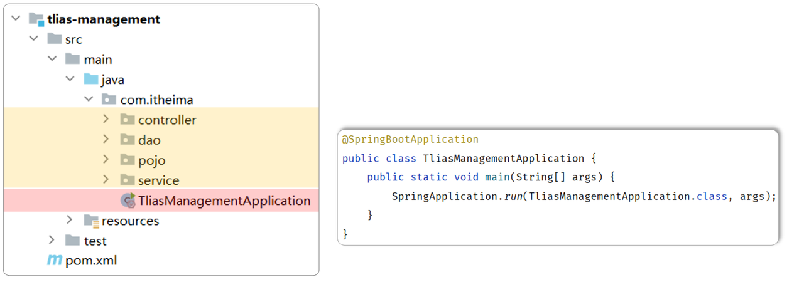

所以，我们在项目开发中，只需要按照如上项目结构，将项目中的所有的业务类，都放在启动类所在包的子包中，就无需考虑组件扫描问题。

### 4.5 DI 详解

上一小节我们讲解了控制反转 IOC 的细节。接下来，我们学习依赖注入 DI 的细节。

依赖注入，是指 IOC 容器要为应用程序去提供运行时所依赖的资源，而资源指的就是对象。

在入门程序案例中，我们使用了 `@Autowired` 这个注解完成了依赖注入的操作，而这个 Autowired 翻译过来叫：自动装配。

`@Autowired` 注解，默认是按照**类型**进行自动装配的（即：去 IOC 容器中找某个类型的对象，然后完成注入操作）。
> 入门程序举例：在 UserController 运行的时候，就要到 IOC 容器当中去查找 UserService 这个类型的对象；而我们的 IOC 容器中刚好有一个 UserService 这个类型的对象，所以就找到了这个类型的对象，完成注入操作。

#### 4.5.1 `@Autowired` 用法

`@Autowired` 进行依赖注入，常见的方式有如下三种：
* 方式一：属性注入。
* 方式二：构造函数注入。
* 方式三：setter 注入。

> 注意：
>
> 在项目开发中，基于 `@Autowired` 进行依赖注入时，基本都是第一种和第二种方式（官方推荐第二种方式，因为会更加规范）。但是在企业项目开发的很多项目中，也会选择第一种方式，因为更加简洁、高效（在规范性方面进行了妥协）。

##### 4.5.1.1 属性注入

语法格式：
```java
@RestController
public class UserController {

    // 方式一：属性注入
    @Autowired
    private UserService userService;

}
```

优点：代码简洁，方便快速开发。

缺点：隐藏了类之间的依赖关系，可能会破坏类的封装性。

##### 4.5.1.2 构造函数注入

语法格式：
```java
@RestController
public class UserController {

    // 方式二：构造器注入
    private final UserService userService;

    @Autowired  // 如果当前类中只存在一个构造函数，@Autowired 可以省略
    public UserController(UserService userService) {
        this.userService = userService;
    }

}
```

优点：能清晰地看到类的依赖关系，提高了代码的安全性。

缺点：代码繁琐；如果构造参数过多，可能会导致构造函数臃肿。

> 注意：
>
> 如果只有一个构造函数，`@Autowired` 注解可以省略。（通常来说，也只有一个构造函数。）

##### 4.5.1.3 setter 注入

语法格式：
```java
/**
 * 用户信息 Controller
 */
@RestController
public class UserController {

    // 方式三：setter 注入
    private UserService userService;

    @Autowired
    public void setUserService(UserService userService) {
        this.userService = userService;
    }

}
```

优点：保持了类的封装性，依赖关系更清晰。

缺点：需要额外编写 setter 方法，增加了代码量。

#### 4.5.2 注意事项

那么，如果在 IOC 容器中，存在多个相同类型的 Bean 对象，会出现什么情况呢？