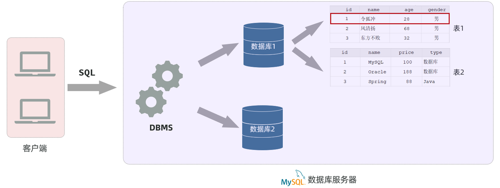
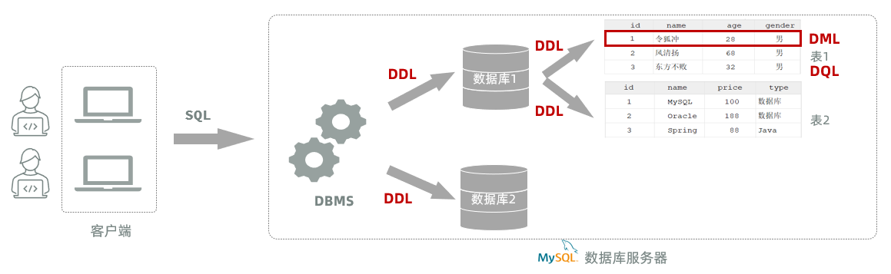
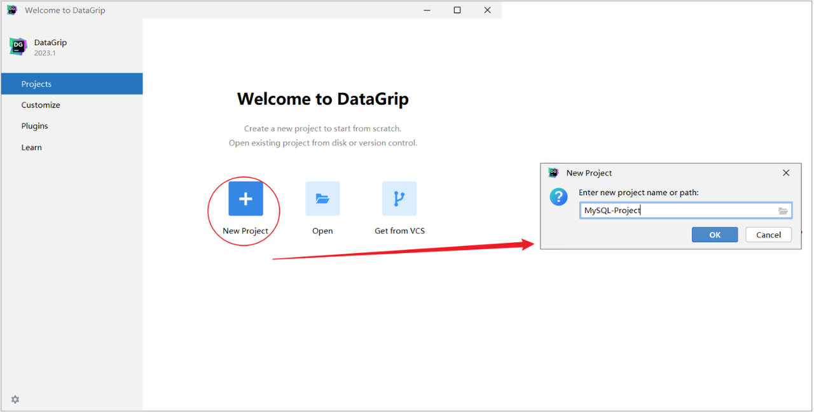
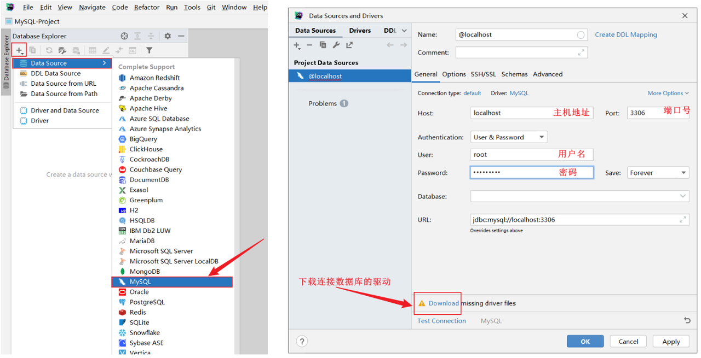
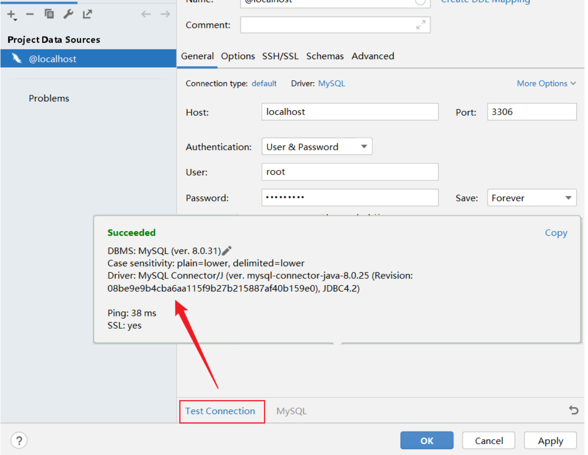
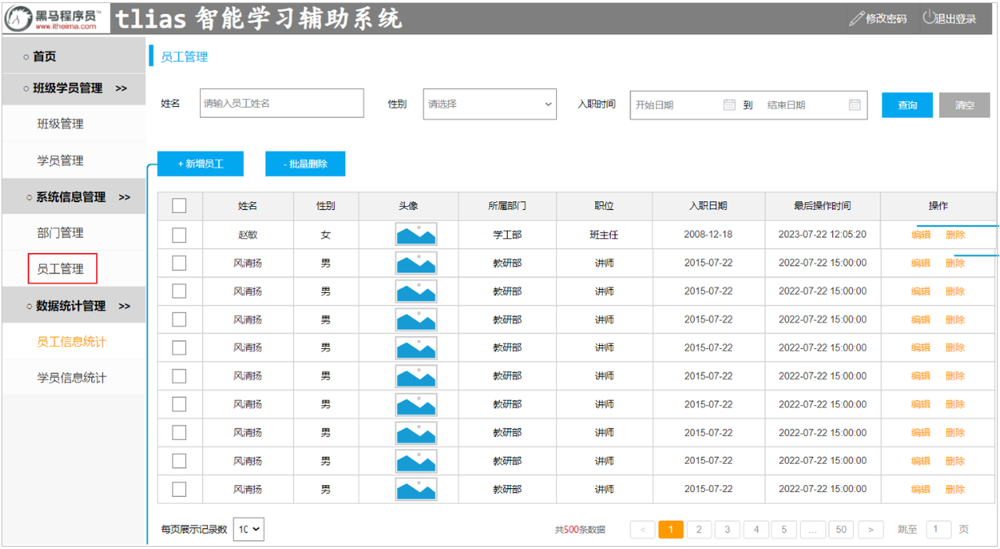
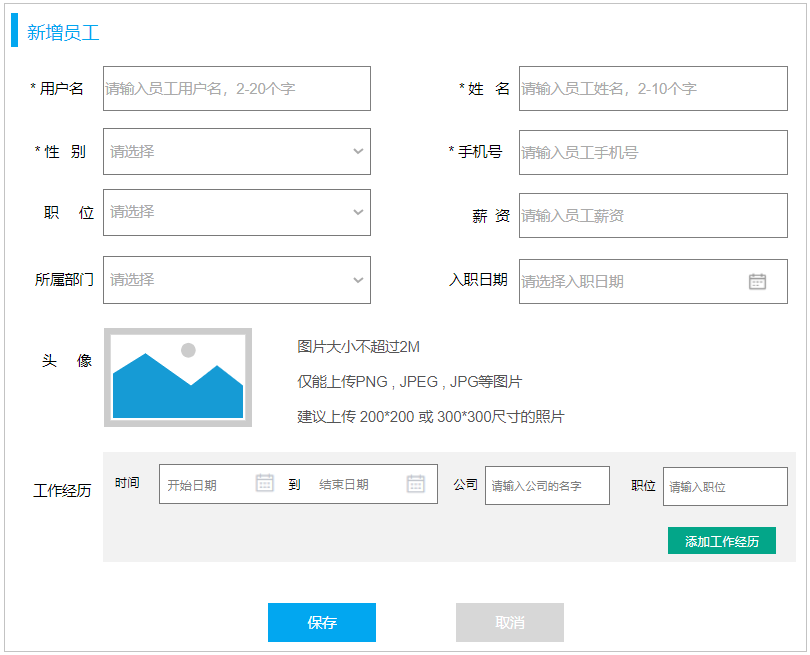
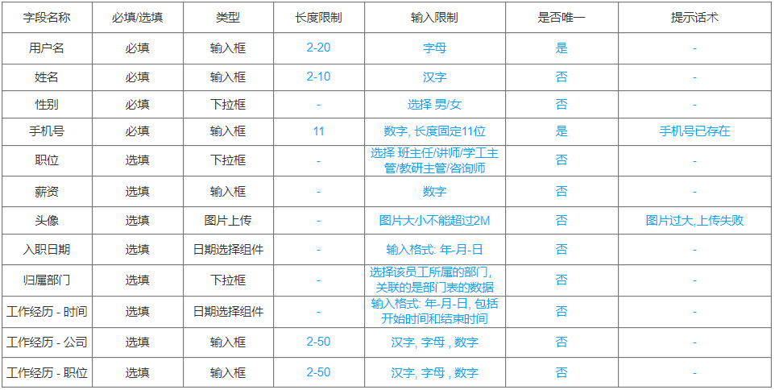

# 第五章：Web 后端基础（数据库）

**目录：**

[TOC]

---

## 一、前言

### 1.1 引言

在我们讲解 SpringBootWeb 基础知识（IOC、DI 等）的时候，我们讲到，在 Web 开发中，为了应用程序职责单一、方便维护，我们一般将 Web 应用程序分为三层，即：Controller、Service、Dao。

在真实的企业开发中，都会采用数据库来存储和管理数据。此时，Web 开发调用流程图如下所示：


那么本章，我们就要来学习数据库技术。

### 1.2 相关概念

首先来了解一下什么是数据库。

**数据库：** 英文为 **D**ata**B**ase，简称 **DB**；它是存储和管理数据的仓库。

数据是存储在数据库中的，我们需要通过数据库管理系统来操作数据库以及数据库中所存放的数据。

**数据库管理系统**（**D**ata**B**ase **M**anagement **S**ystem，简称 **DBMS**），是操作和管理数据库的大型软件。

在使用 DBMS 时，我们需要给 DBMS 发送指令，告诉 DBMS 我们要执行的是什么样的操作、要对哪个数据进行操作等，而这个指令就是 SQL 语句。

**SQL**（**S**tructured **Q**uery **L**anguage，简称 **SQL**）：结构化查询语言，它是操作关系型数据库的编程语言，定义了一套操作关系型数据库的统一标准。

> **结论：** 程序员给数据库管理系统（DBMS）发送 SQL 语句，再由数据库管理系统操作数据库当中的数据。

本章我们学习的数据库是现在互联网公司开发使用最为流行的 MySQL 数据库。

## 二、MySQL 概述

MySQL 官网：[MySQL 官网](https://dev.mysql.com/ "MySQL 官网")。

### 2.1 安装

官网下载地址：[官网下载地址](https://downloads.mysql.com/archives/community/ "官网下载地址")。

在线文档：[MySQL 安装文档](https://heuqqdmbyk.feishu.cn/wiki/ZRSFwACsRiBD2NkV7bmcrJhInme?from=from_copylink "MySQL 安装文档")。

### 2.2 连接

#### 2.2.1 介绍

MySQL 服务器启动完毕后，使用如下指令来连接 MySQL 服务器：
```bash
mysql -u用户名 -p密码 [-h数据库服务器的IP地址 -P端口号]
```
* `-h`：缺省此参数，则默认连接的是本地 127.0.0.1 的 MySQL 服务器。
* `-P`：缺省此参数，则默认连接的端口号是 3306。

上述指令，可以有两种形式：
* 密码直接在 `-p` 参数之后直接指定（这种方式不安全，密码直接以明文形式出现在命令行）。
* 密码在 `-p` 回车之后，在命令行中输入密码，然后回车。

#### 2.2.2 企业使用方式

上述的 MySQL 服务器是我们安装在本地的，这个仅仅是在我们学习阶段。在真实的企业开发中，MySQL 数据库服务器是不会在我们本地安装的，而是在公司的服务器上安装的；而服务器还需要放置在专门的 IDC 机房中，IDC 机房需要保证恒温、恒湿、恒压，而且还要保证网络、电源的可靠性（备用电源及网络）。

我们要想使用服务器上的这台 MySQL 服务器，就需要在我们的电脑上去远程连接这台 MySQL；而服务器上安装的 MySQL 数据库并不是我们自己一个人在访问，我们项目组的其他开发人员也是需要访问这台 MySQL 的。

以下演示通过 MySQL 的客户端命令行如何来连接服务器上部署的 MySQL：
```bash
mysql [-h数据库服务器的IP地址 -P端口号] -u用户名 -p密码
```

### 2.3 数据模型

在介绍 MySQL 的数据模型之前，需要先了解一个概念：关系型数据库。

#### 2.3.1 关系型数据库（RDBMS）

概念：建立在关系模型基础上，由多张相互连接的**二维表**组成的数据库；而所谓二维表，指的是由行和列组成的表。

> 注意：
>
> MySQL、Oracle、DB2、SQLServer 这些都是属于关系型数据库，里面都是基于二维表存储数据的。
> 
> **结论：** 基于二维表存储数据的数据库就称为关系型数据库；不是基于二维表存储数据的数据库，就是非关系型数据库（例如：Redis 就属于非关系型数据库）。

#### 2.3.2 数据模型

以下介绍 MySQL 的数据模型。

MySQL 是关系型数据库，是基于二维表进行数据存储的。具体的结构图如下：

* 通过 MySQL 客户端连接数据库管理系统 DBMS，然后通过 DBMS 操作数据库。
* 使用 MySQL 客户端，向数据库管理系统发送一条 SQL 语句，由数据库管理系统根据 SQL 语句指令去操作数据库中的表结构及数据。
* 一个数据库服务器中可以创建多个数据库，一个数据库中也可以包含多张表，而一张表中又可以包含多行记录。

> 在 MySQL 数据库服务器当中存储数据，需要：
> 1. 先去创建数据库（可以创建多个数据库，之间是相互独立的）。
> 2. 在数据库下再去创建数据表（一个数据库下可以创建多张表）。
> 3. 再将数据存放在数据表中（一张表可以存储多行数据）。

## 三、SQL 语句

SQL：结构化查询语言，是一门操作关系型数据库的编程语言，定义操作所有关系型数据库的统一标准。

SQL 语句根据其功能被分为四大类：DDL、DML、DQL、DCL。

| 分类 | 全称 | 说明 |
| :--: | :--: | :--: |
| DDL | Data Definition Language | 数据定义语言，用来定义数据库对象（数据库、表、字段） |
| DML | Data Manipulation Language | 数据操作语言，用来对数据库表中的数据进行增删改 |
| DQL | Data Query Language | 数据查询语言，用来查询数据库中表的记录 |
| DCL | Data Control Language | 数据控制语言，用来创建数据库用户、控制数据库的访问权限 |



> 注意：
>
> SQL 语句不区分大小写。

### 3.1 DDL 语句

#### 3.1.1 数据库操作

我们在进行数据库设计时，需要使用到刚才所介绍 SQL 分类中的 DDL 语句。

DDL 英文全称是 Data Definition Language（数据定义语言），用来定义数据库对象（数据库、表）。

DDL 中数据库的常见操作：查询、创建、使用、删除。

##### 3.1.1.1 查询数据库

查询所有数据库：
```sql
show databases;
```

查询当前数据库：
```sql
select database();
```

> 注意：
>
> 我们要操作某一个数据库，必须要切换到对应的数据库中。
>
> 通过指令：`select database()`，就可以查询到当前所处的数据库。

##### 3.1.1.2 创建数据库

语法格式：
```sql
create database [if not exists] 数据库名 [default charset utf8mb4];
```

创建数据库时，可以不指定字符集。因为在 MySQL 8 版本之后，默认的字符集就是 utf8mb4。

> 注意：
>
> 在同一个数据库服务器中，不能创建两个名称相同的数据库，否则将会报错。
>
> 可以使用 `if not exists` 来避免这个问题：
> ```sql
> -- 数据库不存在，则创建该数据库；如果存在则不创建
> create database if not exists itcast;
> ```
>
> 如上所示，即可解决该问题。

##### 3.1.1.3 使用数据库

语法格式：
```sql
use 数据库名;
```

我们要操作某一个数据库下的表时，就需要通过该指令切换到对应的数据库下，否则不能操作。

##### 3.1.1.4 删除数据库

语法格式：
```sql
drop database [if exists] 数据库名;
```
* 如果删除一个不存在的数据库，将会报错。
  * 可以加上参数 `if exists`，如果数据库存在再执行删除，否则不执行删除。

> 说明：
>
> 上述语法中的 `database`，也可以替换成 `schema`。
>
> 例如：`create schema db01;`、`show schemas;`。

#### 3.1.2 图形化工具

##### 3.1.2.1 介绍

在项目开发当中，通常为了提高开发效率，都会借助于现成的图形化管理工具来操作数据库。

目前 MySQL 主流的图形化界面工具有以下几种：


DataGrip 是 JetBrains 旗下的一款数据库管理工具，是管理和开发 MySQL、Oracle、PostgreSQL 的理想解决方案。

DataGrip 官网：[DataGrip 官网](https://www.jetbrains.com/zh-cn/datagrip/ "DataGrip 官网")。

##### 3.1.2.2 安装

在线文档：[DataGrip 安装文档](https://heuqqdmbyk.feishu.cn/wiki/FAa3wj0nYi4xGBksbFuchBK8nhe?from=from_copylink "DataGrip 安装文档")。

##### 3.1.2.3 连接数据库

1). 创建 Project



2). 创建连接



3). 测试连接

下载完驱动之后，可以点击 Test Connection 来测试一下是否可以正常地连接数据库：


然后点击 OK，就已经连接上了 MySQL 数据库了。

##### 3.1.2.4 编写 SQL 代码

我们可以在 Console 中编写 SQL 代码并执行。

示例代码：
```sql
-- MySQL01.sql

-- 查询所有数据库
show databases;

-- 切换数据库
use db01;

-- 查询当前正在使用的数据库
select database();

-- 创建数据库
create database db03;

-- 删除数据库
drop database db03;
```

#### 3.1.3 表操作

关于表结构的操作也是包含四个部分：创建表、查询表、修改表、删除表。

##### 3.1.3.1 创建

语法格式：
```sql
create table 表名(
    字段1 字段1类型 [约束] [comment '字段1注释'],
    字段2 字段2类型 [约束] [comment '字段2注释'],
    ...
    字段n 字段n类型 [约束] [comment '字段n注释']
) [comment '表注释'];
```

> 注意：
> * `[]` 中的内容为可选参数。
> * 最后一个字段后面没有逗号。

数据表创建完成，接下来可以往这张表结构当中来添加并存储数据。

> 注意：
>
> 想要限制字段所存储的数据，就需要用到数据库中的约束。

##### 3.1.3.2 约束

概念：所谓约束就是作用在表中字段上的规则，用于限制存储在表中的数据。

作用：保证数据库当中数据的正确性、有效性和完整性。

在 MySQL 数据库当中，提供了以下 5 种约束：
| 约束 | 描述 | 关键字 |
| :--: | :--: | :--: |
| 非空约束 | 限制该字段值不能为 null | `not null` |
| 唯一约束 | 保证字段的所有数据都是唯一的、不重复的 | `unique` |
| 主键约束 | 主键是一行数据的唯一标识，要求非空且唯一 | `primary key` |
| 默认约束 | 保存数据时，如果未指定该字段值，则采用默认值 | `default` |
| 外键约束 | 让两张表的数据建立连接，保证数据的一致性和完整性 | `foreign key` |

> 注意：
>
> 约束是作用于表中字段上的，可以在创建表 / 修改表的时候添加约束。

示例代码：
```sql
-- MySQL01.sql

-- -----------------------> DDL 表操作 <-----------------------
-- 创建表（约束）
create table user(
    id int primary key comment 'ID，唯一标识',  -- 主键约束
    username varchar(50) not null unique comment '用户名',    -- 非空 唯一
    name varchar(10) not null comment '姓名',    -- 非空
    age int comment '年龄',
    gender char(1) default '男' comment '性别'    -- 默认
) comment '用户信息表';
```

MySQL 提供关键字：`auto_increment`（自动增长）。

主键自增 - `auto_increment`：
* 每次插入新的行记录时，数据库自动生成 id 字段（主键）下的值。
* 具有 `auto_increment` 的数据列是一个正数序列开始增长（从 1 开始自增）。

示例代码：
```sql
-- MySQL01.sql

-- -----------------------> DDL 表操作 <-----------------------
-- 创建表（约束）
create table user(
    id int primary key auto_increment comment 'ID，唯一标识',  -- 主键约束 auto_increment
    username varchar(50) not null unique comment '用户名',    -- 非空 唯一
    name varchar(10) not null comment '姓名',    -- 非空
    age int comment '年龄',
    gender char(1) default '男' comment '性别'    -- 默认
) comment '用户信息表';
```

##### 3.1.3.3 数据类型

MySQL 中的数据类型有很多，主要分为三类：数值类型、字符串类型、日期时间类型。

###### 3.1.3.3.1 数值类型

| 类型 | 大小 | 有符号（SIGNED）范围 | 无符号（UNSIGNED）范围 | 描述 | 备注 |
| :--: | :--: | :--: | :--: | :--: | :--: |
| `TINYINT` | 1 byte | [-128, 127] | [0, 255] | 小整数值 | - |
| `SMALLINT` | 2 bytes | [-32768, 32767] | [0, 65535] | 大整数值 | - |
| `MEDIUMINT` | 3 bytes | [-8388608, 8388607] | [0, 16777215] | 大整数值 | - |
| `INT` / `INTEGER` | 4 bytes | [-2147483648, 2147483647] | [0, 4294967295] | 大整数值 | - |
| `BIGINT` | 8 bytes | [-2^63, 2^63 - 1] | [0, 2^64 - 1] | 极大整数值 | - |
| `FLOAT` | 4 bytes | [-3.402823466 E+38, 3.402823466351 E+38] | 0 和 [1.175494351 E-38, 3.402823466 E+38] | 单精度浮点数值 | `float(5, 2)`：`5` 表示整个数字长度，`2` 表示小数位个数 |
| `DOUBLE` | 8 bytes | [-1.7976931348623157 E+308, 1.7976931348623157 E+308] | 0 和 [2.2250738585072014 E-308, 1.7976931348623157 E+308] | 双精度浮点数值 | `double(5, 2)`：`5` 表示整个数字长度，`2` 表示小数位个数 |
| `DECIMAL` | - | 依赖于 M（精度）和 D（标度）的值 | 依赖于 M（精度）和 D（标度）的值 | 小数值（精确定点数） | `decimal(5, 2)`：`5` 表示整个数字长度，`2` 表示小数位个数 |

数值类型的选取原则：在满足业务需求的前提下，尽可能选择占用磁盘空间小的数据类型。

示例代码：
```sql
-- 年龄字段 -> 不会出现负数，而且人的年龄不会太大
  age tinyint unsigned

-- ID 字段 -> 不会出现负数，而且 ID 字段可能较大
  id int unsigned

-- 分数 -> 总分 100 分，最多出现一位小数
  score double(4, 1)
```

###### 3.1.3.3.2 字符串类型

| 类型 | 大小 | 描述 |
| :--: | :--: | :--: |
| `CHAR` | 0-255 bytes | 定长字符串（需要指定长度） |
| `VARCHAR` | 0-65535 bytes | 变长字符串（需要指定长度） |
| `TINYBLOB` | 0-255 bytes | 不超过 255 个字符的二进制数据 |
| `TINYTEXT` | 0-255 bytes | 短文本字符串 |
| `BLOB` | 0-65535 bytes | 二进制形式的长文本数据 |
| `TEXT` | 0-65535 bytes | 长文本数据 |
| `MEDIUMBLOB` | 0-16777215 bytes | 二进制形式的中等长度文本数据 |
| `MEDIUMTEXT` | 0-16777215 bytes | 中等长度文本数据 |
| `LONGBLOB` | 0-4294967295 bytes | 二进制形式的极大文本数据 |
| `LONGTEXT` | 0-4294967295 bytes | 极大文本数据 |

`CHAR` 与 `VARCHAR` 都可以描述字符串。`CHAR` 是定长字符串，指定长度多长，就占用多少个字符，和字段值的长度无关；而 `VARCHAR` 是变长字符串，指定的长度为最大占用长度。相对来说，`CHAR` 的性能会更高些，但浪费磁盘空间；而 `VARCHAR` 节约磁盘空间，但性能略低。

示例代码：
```sql
-- 定长字符串（需要指定长度）
  char(10)  -- 固定占用 10 个字符空间

-- 变长字符串（需要指定长度）
  varchar(10) -- 最多占用 10 个字符空间

-- 示例：
  username varchar(50)
  idcard  char(18)
  phone char(11)
```

###### 3.1.3.3.3 日期时间类型

| 类型 | 大小 | 范围 | 格式 | 描述 |
| :--: | :--: | :--: | :--: | :--: |
| `DATE` | 3 | 1000-01-01 至 9999-12-31 | YYYY-MM-DD | 日期值 |
| `TIME` | 3 | -838:59:59 至 838:59:59 | HH:MM:SS | 时间值或持续时间 |
| `YEAR` | 1 | 1901 至 2155 | YYYY | 年份值 |
| `DATETIME` | 8 | 1000-01-01 00:00:00 至 9999-12-31 23:59:59 | YYYY-MM-DD HH:MM:SS | 混合日期和时间值 |
| `TIMESTAMP` | 4 | 1970-01-01 00:00:01 至 2038-01-19 03:14:07 | YYYY-MM-DD HH:MM:SS | 混合日期和时间值，时间戳 |

示例代码：
```sql
-- 示例：

-- 生日字段
  birthday date -- 生日只需要年月日

-- 操作时间
  operateTime datetime  -- 操作时间需要精确到时分秒
```

##### 3.1.3.4 表结构设计 - 案例

**需求：** 根据产品原型 / 需求创建表（设计合理的数据类型、长度、约束）。

**产品原型及需求如下：**

1). 列表展示



2). 新增员工



3). 需求说明及字段限制



步骤：
1. 阅读产品原型及需求文档，查看数据表涉及到哪些字段。
2. 查看需求文档说明，确认各个字段的类型以及字段存储数据的长度限制。
3. 在页面原型中描述的基础字段的基础上，再增加额外的基础字段。

使用 SQL 创建表：
```sql
-- MySQL01.sql

-- 案例：设计员工表 emp
-- 基础字段：id - 主键；create_time - 创建时间；update_time - 修改时间
create table emp(
    id int unsigned primary key auto_increment comment 'ID：主键',
    username varchar(20) not null unique comment '用户名',
    password varchar(32) default '123456' comment '密码',
    name varchar(10) not null comment '姓名',
    gender tinyint unsigned not null comment '性别：1 - 男；2 - 女',
    phone char(11) not null unique comment '手机号',
    job tinyint unsigned comment '职位：1 - 班主任；2 - 讲师；3 - 学工主管；4 - 教研主管；5 - 咨询师',
    salary int unsigned comment '薪资',
    entry_date date comment '入职日期',
    image varchar(255) comment '头像',
    create_time datetime comment '创建时间',
    update_time datetime comment '修改时间'
) comment '员工表';
```

> 注意：
>
> 在定义数据库字段时，多个单词之间使用下划线 “`_`” 分隔。

除了使用 SQL 语句创建表外，我们还可以借助于图形化界面来创建表结构，这种创建方式会更加直观、更加方便。

> **设计表流程：**
> 1. 阅读页面原型及需求文档。
> 2. 基于页面原型和需求文档，确定原型字段（类型、长度限制、约束）。
> 3. 再增加表设计所需要的业务基础字段（id、create_time、update_time）：
>     * create_time：记录当前这条数据插入的时间。
>     * update_time：记录当前这条数据最后更新的时间。

##### 3.1.3.5 表操作 - 其他操作

以下讲解表结构的查询、修改、删除操作。

示例代码：
```sql
-- MySQL01.sql

-- 查询当前数据库所有表
show tables;

-- 查看表结构
desc emp;

-- 查看建表语句
show create table emp;

-- 字段：添加字段 qq varchar(13)
alter table emp add qq varchar(13) comment 'QQ 号码';

-- 字段：修改字段类型 qq varchar(15)
alter table emp modify qq varchar(15) comment 'QQ 号码';

-- 字段：修改字段名 qq -> qq_num varchar(15)
alter table emp change qq qq_num varchar(15) comment 'QQ 号码';

-- 字段：删除字段 qq_num
alter table emp drop column qq_num;

-- 修改表名
alter table emp rename to employee;

-- 删除表
drop table employee;
```

###### 3.1.3.5.1 查询数据库表

语法格式：
```sql
-- 查询当前数据库的所有表
show tables;

-- 查看指定的表结构
desc 表名;  -- 可以查看指定表的字段、字段的类型、是否可以为 null、是否存在 默认值等信息

-- 查询指定表的建表语句
show create table 表名;
```

###### 3.1.3.5.2 修改数据库表

添加字段：
```sql
-- 添加字段
alter table 表名 add 字段名 类型(长度) [comment '注释'] [约束];

-- 例如：为 tb_emp 表添加字段 qq，字段类型为 varchar(11)
alter table tb_emp add qq varchar(11) comment 'QQ 号码';
```

修改字段：
```sql
-- 修改字段类型
alter table 表名 modify 字段名 新数据类型（长度）;
-- 例如：修改 QQ 字段的字段类型，将其长度由 11 修改为 13
alter table tb_emp modify qq varchar(13) comment 'QQ 号码';

-- 修改字段名与字段类型
alter table 表名 change 旧字段名 新字段名 类型(长度) [comment '注释'] [约束];
-- 例如：修改 qq 字段名为 qq_num，字段类型 varchar(13)
alter table tb_emp change qq qq_num varchar(13) comment 'QQ 号码';
```

删除字段：
```sql
-- 删除字段
alter table 表名 drop column 字段名;

-- 例如：删除 tb_emp 表中的 qq_num 字段
alter table tb_emp drop column qq_num;
```

修改表名：
```sql
-- 修改表名
rename table 表名 to 新表名;
-- 或：
alter table 表名 rename to 新表名;

-- 例如：将当前的 emp 表的表名修改为 tb_emp
rename table emp to tb_emp;
-- 或：
alter table emp rename to tb_emp;
```

###### 3.1.3.5.2 删除数据库表

删除表结构：
```sql
-- 删除表
drop table [if exists] 表名;

-- 例如：如果 tb_emp 表存在，则删除 tb_emp 表
drop table if exists tb_emp;  -- 在删除表时，表中的全部数据也会被删除
```

> 注意：
>
> 关于表结构的查看、修改、删除操作，工作中一般都是直接基于图形化界面操作。

### 3.2 DML 语句

DML 英文全称是 Data Manipulation Language（数据操作语言），用来对数据库中表的数据记录进行增、删、改操作。
* 添加数据（`INSERT`）。
* 修改数据（`UPDATE`）。
* 删除数据（`DELETE`）。

#### 3.2.1 增加（`insert`）

向指定字段添加数据：
```sql
insert into 表名 (字段名1, 字段名2) values (值1, 值2);
```

全部字段添加数据：
```sql
insert into 表名 values (值1, 值2, ...);
```

批量添加数据（指定字段）：
```sql
insert into 表名 (字段名1, 字段名2) values (值1, 值2), (值1, 值2);
```

批量添加数据（全部字段）：
```sql
insert into 表名 values (值1, 值2, ...), (值1, 值2, ...);
```

示例代码：
```sql
-- MySQL01.sql

-- -----------------------> DML : 数据操作语言 <-----------------------
-- DML : 插入数据 - insert
-- 1. 为 emp 表的 username, password, name, gender, phone 字段插入值
insert into emp (username, password, name, gender, phone) values ('songjiang', '12345678', '宋江', '1', '13300001111');

-- insert into emp (username, password, name, gender, phone) values ('songjiang2songjiang222', '12345678', '宋江2', '1', '13300001117');

-- 2. 为 emp 表的 所有字段插入值
-- 方式 1：
insert into emp (id, username, password, name, gender, phone, job, salary, entry_date, image, create_time, update_time)
    values (null, 'linchong', '12345678', '林冲', '1', '13300001112', 1, 6000, '2020-01-01', '1.jpg', now(), now());
-- 方式 2：
insert into emp values (null, 'likui', '12345678', '李逵', '1', '13300001113', 1, 6000, '2020-01-01', '1.jpg', now(), now());

-- 3. 批量为 emp 表的 username, password, name, gender, phone  字段插入数据
insert into emp (username, password, name, gender, phone) values
    ('ruanxiaoer', '12345678', '阮小二', '1', '13300001114'), ('ruanxiaowu', '12345678', '阮小五', '1', '13300001115');
```

> 注意：
>
> `insert` 操作的注意事项：
> * 插入数据时，指定的字段顺序需要与值的顺序是一一对应的。
> * 字符串和日期型数据应该包含在引号中（单引号、双引号都可以运行，但是 DataGrip 中建议使用单引号）。
> * 插入的数据大小 / 长度，应该在字段的规定范围内。

#### 3.2.2 修改（`update`）

语法格式：
```sql
update 表名 set 字段名1 = 值1, 字段名2 = 值2, ... [where 条件];
```

示例代码：
```sql
-- MySQL01.sql

-- -----------------------> DML : 数据操作语言 <-----------------------
-- DML : 更新数据 - update
-- 1. 将 emp 表的ID为1员工 用户名更新为 'zhangsan', 姓名name字段更新为 '张三'
update emp set username = 'zhangsan', name = '张三' where id = 1;

-- 2. 将 emp 表的所有员工的入职日期更新为 '2010-01-01'
update emp set entry_date = '2010-01-01';
```

> 注意：
> * 修改语句的条件可以有，也可以没有；如果没有条件，则会修改整张表的所有数据。
> * 在修改数据时，一般需要同时修改公共字段 update_time，将其修改为当前操作时间。
> * 当进行修改全部数据操作时，会提示询问是否确认修改所有数据，直接点击 Execute 即可。

#### 3.2.3 删除（`delete`）

语法格式：
```sql
delete from 表名 [where 条件];
```

示例代码：
```sql
-- MySQL01.sql

-- -----------------------> DML : 数据操作语言 <-----------------------
-- DML : 删除数据 - delete
-- 1. 删除 emp 表中 ID为1的员工
delete from emp where id = 1;

-- 2. 删除 emp 表中的所有员工
delete from emp;
```

> 注意：
> * `delete` 语句的条件可以有，也可以没有；如果没有条件，则会删除整张表的所有数据。
> * `delete` 语句不能删除某一个字段的值（可以使用 `update`，将该字段值置为 `null` 即可）。
> * 当进行删除全部数据操作时，会提示询问是否确认删除所有数据，直接点击 Execute 即可。