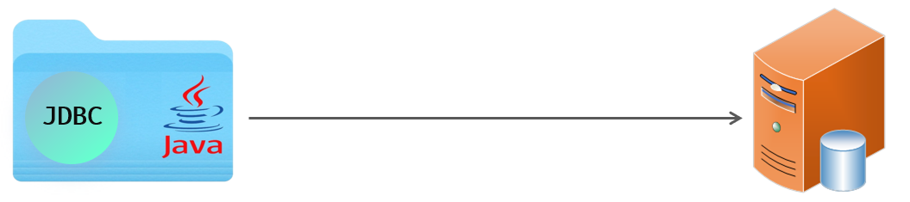
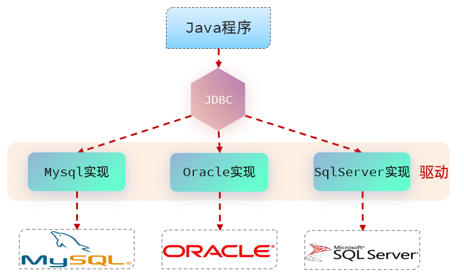
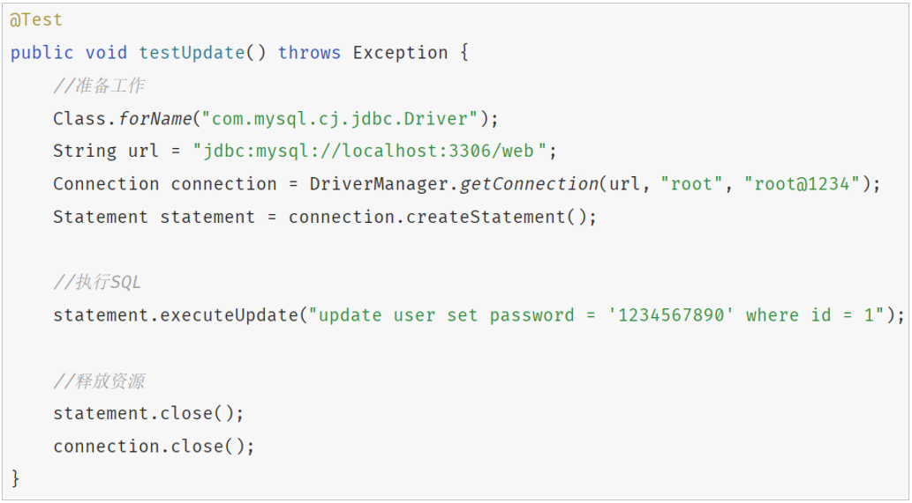
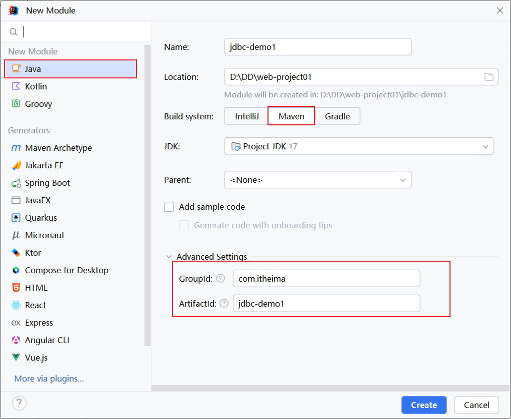
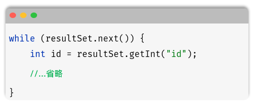

# 第六章：Web 后端基础（Java 操作数据库）

**目录：**

[TOC]

---

## 一、前言

在前面，我们学习 MySQL 数据库时，都是利用图形化客户端工具（如：IDEA、DataGrip）来操作数据库的。

作为后端程序开发人员，通常会使用 Java 程序来完成对数据库的操作。Java 程序操作数据库的技术有很多，而最为底层、最为基础的就是 JDBC。



**JDBC**（**J**ava **D**ata**B**ase **C**onnectivity）：使用 Java 语言操作关系型数据库的一套 API，是操作数据库最为基础、底层的技术。

但是使用 JDBC 来操作数据库，会比较繁琐。所以现在在企业项目开发中，一般都会使用基于 JDBC 的封装的高级框架，例如：MyBatis、MyBatis-Plus、Hibernate、SpringDataJPA。

本章，我们先来学习 JDBC 和 MyBatis。

## 二、JDBC

### 2.1 介绍

**JDBC**（**J**ava **D**ata**B**ase **C**onnectivity）：使用 Java 语言操作关系型数据库的一套 API。



本质：
* Sun 公司官方定义的一套操作所有关系型数据库的规范，即接口。
* 各个数据库厂商去实现这套接口，提供数据库驱动 jar 包。
* 我们可以使用这套接口（JDBC）编程，真正执行的代码是驱动 jar 包中的实现类。

有了 JDBC 之后，我们就可以直接在 Java 代码中来操作数据库了。只需要编写以下这样一段 Java 代码，就可以来操作数据库中的数据。示例代码如下：


### 2.2 更新数据

#### 2.2.1 需求

**需求：** 基于 JDBC 程序，执行 update 语句。

**本质：** 其本质就是基于 JDBC 程序，执行如下 update 语句，并将查询的结果输出到控制台。SQL 语句：
```sql
update user set age = 25 where id = 1;
```

#### 2.2.2 准备工作

1). 创建一个 Maven 项目



2). 创建一个数据库 web01，并在该数据库中创建 user 表

#### 2.2.3 代码实现

1). 在 pom.xml 文件中引入依赖

```xml
<dependencies>
    <dependency>
        <groupId>com.mysql</groupId>
        <artifactId>mysql-connector-j</artifactId>
        <version>9.3.0</version>
    </dependency>

    <dependency>
        <groupId>org.junit.jupiter</groupId>
        <artifactId>junit-jupiter</artifactId>
        <version>5.9.3</version>
        <scope>test</scope>
    </dependency>

    <dependency>
        <groupId>org.projectlombok</groupId>
        <artifactId>lombok</artifactId>
        <version>1.18.42</version>
        <scope>compile</scope>
    </dependency>
</dependencies>
```

> 注意：
>
> 如果 Lombok 版本太低，将会出现以下报错：
> ```bash
> java: java.lang.ExceptionInInitializerError
> com.sun.tools.javac.code.TypeTag :: UNKNOWN
> ```
>
> 解决方案：进入 Maven 仓库（[Maven 仓库](https://mvnrepository.com/ "Maven 仓库")）查询并选择 Lombok 最新版即可。

2). 在 src/main/test/java 目录下编写测试类，定义测试方法

示例代码：
```java
/* JdbcTest.java */

package com.anxin_hitsz;

import org.junit.jupiter.api.Test;

import java.sql.Connection;
import java.sql.DriverManager;
import java.sql.SQLException;
import java.sql.Statement;

/**
 * ClassName: JdbcTest
 * Package: com.anxin_hitsz
 * Description:
 *
 * @Author AnXin
 * @Create 2026/3/6 17:49
 * @Version 1.0
 */
public class JdbcTest {

    /**
     * JDBC 入门程序
     */
    @Test
    public void testUpdate() throws ClassNotFoundException, SQLException {
        // 1. 注册驱动
        Class.forName("com.mysql.cj.jdbc.Driver");

        // 2. 获取数据库连接
        String url = "jdbc:mysql://localhost:3306/web01";
        String username = "root";
        String password = "AnXin517985!";
        Connection connection = DriverManager.getConnection(url, username, password);

        // 3. 获取 SQL 语句执行对象
        Statement statement = connection.createStatement();

        // 4. 执行 SQL
        int cnt = statement.executeUpdate("update user set age = 25 where id = 1");   // DML
        System.out.println("SQL 执行完毕影响的记录数为：" + cnt);

        // 5. 释放资源
        statement.close();
        connection.close();

    }

}

```

### 2.3 查询数据

#### 2.3.1 需求

**需求：** 基于 JDBC 程序，执行 update 语句。

**本质：** 其本质就是基于 JDBC 程序，执行如下 update 语句，并将查询的结果输出到控制台。SQL 语句：
```sql

```

#### 2.3.2 准备工作

1). 创建一个 Maven 项目


2). 创建一个数据库 web01，并在该数据库中创建 user 表

#### 2.3.3 代码实现

1). 在 pom.xml 文件中引入依赖

```xml
<dependencies>
    <dependency>
        <groupId>com.mysql</groupId>
        <artifactId>mysql-connector-j</artifactId>
        <version>9.3.0</version>
    </dependency>

    <dependency>
        <groupId>org.junit.jupiter</groupId>
        <artifactId>junit-jupiter</artifactId>
        <version>5.9.3</version>
        <scope>test</scope>
    </dependency>

    <dependency>
        <groupId>org.projectlombok</groupId>
        <artifactId>lombok</artifactId>
        <version>1.18.42</version>
        <scope>compile</scope>
    </dependency>
</dependencies>
```

> 注意：
>
> 如果 Lombok 版本太低，将会出现以下报错：
> ```bash
> java: java.lang.ExceptionInInitializerError
> com.sun.tools.javac.code.TypeTag :: UNKNOWN
> ```
>
> 解决方案：进入 Maven 仓库（[Maven 仓库](https://mvnrepository.com/ "Maven 仓库")）查询并选择 Lombok 最新版即可。

2). 在 src/main/test/java 目录下编写测试类，定义测试方法

由于单元测试中的“用户名”和“密码”的值应该是动态的，是将来页面传递到服务端的，因此我们可以基于前面所讲解的 JUnit 中的参数化测试进行单元测试。

示例代码：
```java

```

如果在测试时，需要传递一组参数，可以使用 `@CsvSource` 注解。

#### 2.3.4 代码剖析

##### 2.3.4.1 ResultSet

`ResultSet`（结果集对象）：封装了 DQL 查询语句查询的结果。
* `next()`：将光标从当前位置向前移动一行，并判断当前行是否为有效行，返回值为 `boolean`。
  * `true`：有效行，当前行有数据。
  * `false`：无效行，当前行没有数据。
* `getXxx(...)`：获取数据，可以根据列的编号获取，也可以根据列名获取（推荐）。

结果解析步骤：


##### 2.3.4.2 预编译 SQL

我们在编写 SQL 语句的时候，有两种风格：

* 静态 SQL（参数硬编码）：

```java
conn.prepareStatement("SELECT * FROM user WHERE username = 'daqiao' AND password = '123456'");
ResultSet resultSet = pstmt.executeQuery();
```

上述方式中，参数值直接拼接在 SQL 语句中，参数值是写死的。

* 预编译 SQL（参数动态传递）：

```java
conn.prepareStatement("SELECT * FROM user WHERE username = ? AND password = ?");
pstmt.setString(1, "daqiao");
pstmt.setString(2, "123456");
ResultSet resultSet = pstmt.executeQuery();
```