# 第六章：Web 后端基础（Java 操作数据库）

**目录：**

[TOC]

---

## 一、前言

在前面，我们学习 MySQL 数据库时，都是利用图形化客户端工具（如：IDEA、DataGrip）来操作数据库的。

作为后端程序开发人员，通常会使用 Java 程序来完成对数据库的操作。Java 程序操作数据库的技术有很多，而最为底层、最为基础的就是 JDBC。


**JDBC**（**J**ava **D**ata**B**ase **C**onnectivity）：使用 Java 语言操作关系型数据库的一套 API，是操作数据库最为基础、底层的技术。

但是使用 JDBC 来操作数据库，会比较繁琐。所以现在在企业项目开发中，一般都会使用基于 JDBC 的封装的高级框架，例如：MyBatis、MyBatis-Plus、Hibernate、SpringDataJPA。

本章，我们先来学习 JDBC 和 MyBatis。

## 二、JDBC

### 2.1 介绍

**JDBC**（**J**ava **D**ata**B**ase **C**onnectivity）：使用 Java 语言操作关系型数据库的一套 API。


本质：
* Sun 公司官方定义的一套操作所有关系型数据库的规范，即接口。
* 各个数据库厂商去实现这套接口，提供数据库驱动 jar 包。
* 我们可以使用这套接口（JDBC）编程，真正执行的代码是驱动 jar 包中的实现类。

有了 JDBC 之后，我们就可以直接在 Java 代码中来操作数据库了。只需要编写以下这样一段 Java 代码，就可以来操作数据库中的数据。示例代码如下：


### 2.2 更新数据

#### 2.2.1 需求

**需求：** 基于 JDBC 程序，执行 update 语句。

**本质：** 其本质就是基于 JDBC 程序，执行如下 update 语句，并将查询的结果输出到控制台。SQL 语句：
```sql
update user set age = 25 where id = 1;
```

#### 2.2.2 准备工作

1). 创建一个 Maven 项目


2). 创建一个数据库 web01，并在该数据库中创建 user 表

#### 2.2.3 代码实现

1). 在 pom.xml 文件中引入依赖

```xml
<dependencies>
    <dependency>
        <groupId>com.mysql</groupId>
        <artifactId>mysql-connector-j</artifactId>
        <version>9.3.0</version>
    </dependency>

    <dependency>
        <groupId>org.junit.jupiter</groupId>
        <artifactId>junit-jupiter</artifactId>
        <version>5.9.3</version>
        <scope>test</scope>
    </dependency>

    <dependency>
        <groupId>org.projectlombok</groupId>
        <artifactId>lombok</artifactId>
        <version>1.18.42</version>
        <scope>compile</scope>
    </dependency>
</dependencies>
```

> 注意：
>
> 如果 Lombok 版本太低，将会出现以下报错：
> ```bash
> java: java.lang.ExceptionInInitializerError
> com.sun.tools.javac.code.TypeTag :: UNKNOWN
> ```
>
> 解决方案：进入 Maven 仓库（[Maven 仓库](https://mvnrepository.com/ "Maven 仓库")）查询并选择 Lombok 最新版即可。

2). 定义测试方法

在 src/main/test/java/com/xxx（xxx 取决于你自己的域名及包名，下文同理，不再赘述）目录下编写测试类，定义测试方法：
```java
/* JdbcTest.java */

package com.anxin_hitsz;

import org.junit.jupiter.api.Test;

import java.sql.Connection;
import java.sql.DriverManager;
import java.sql.SQLException;
import java.sql.Statement;

/**
 * ClassName: JdbcTest
 * Package: com.anxin_hitsz
 * Description:
 *
 * @Author AnXin
 * @Create 2026/3/6 17:49
 * @Version 1.0
 */
public class JdbcTest {

    /**
     * JDBC 入门程序
     */
    @Test
    public void testUpdate() throws ClassNotFoundException, SQLException {
        // 1. 注册驱动
        Class.forName("com.mysql.cj.jdbc.Driver");

        // 2. 获取数据库连接
        String url = "jdbc:mysql://localhost:3306/web01";
        String username = "root";
        String password = "AnXin517985!";
        Connection connection = DriverManager.getConnection(url, username, password);

        // 3. 获取 SQL 语句执行对象
        Statement statement = connection.createStatement();

        // 4. 执行 SQL
        int cnt = statement.executeUpdate("update user set age = 25 where id = 1");   // DML
        System.out.println("SQL 执行完毕影响的记录数为：" + cnt);

        // 5. 释放资源
        statement.close();
        connection.close();

    }

}

```

> 注意：
>
> JDBC 程序执行 DML 语句：
> ```java
> int rowsUpdated = pstmt.executeUpdate();
> ```
>
> 返回值是影响的记录数。

### 2.3 查询数据

#### 2.3.1 需求

**需求：** 基于 JDBC 程序，执行 select 语句。

**本质：** 其本质就是基于 JDBC 程序，执行如下 select 语句，并将查询的结果封装到 `User` 对象中。SQL 语句：
```sql
select * from user where username = 'daqiao' and password = '123456';
```

#### 2.3.2 准备工作

与 2.2.2 准备工作 一致，此处不再赘述。

#### 2.3.3 代码实现

1). 在 pom.xml 文件中引入依赖

与 2.2.3 代码实现 1). 一致，此处不再赘述。

2). 定义实体类 `User`

在 src/main/java/com/xxx/pojo 目录下创建 User.java，定义实体类：
```java
/* pojo/User.java */

package com.anxin_hitsz.pojo;

import lombok.AllArgsConstructor;
import lombok.Data;
import lombok.NoArgsConstructor;

/**
 * ClassName: User
 * Package: com.anxin_hitsz.pojo
 * Description:
 *
 * @Author AnXin
 * @Create 2026/3/6 19:35
 * @Version 1.0
 */
@Data
@AllArgsConstructor
@NoArgsConstructor
public class User {
    private Integer id;
    private String username;
    private String password;
    private String name;
    private Integer age;
}

```

2). 定义测试方法

在 src/main/test/java/com/xxx 目录下编写测试类，定义测试方法

由于单元测试中的“用户名”和“密码”的值应该是动态的，是将来页面传递到服务端的，因此我们可以基于前面所讲解的 JUnit 中的参数化测试进行单元测试。

示例代码（未使用 JUnit 中的参数化测试）：
```java
/* JdbcTest.java */

package com.anxin_hitsz;

import com.anxin_hitsz.pojo.User;
import org.junit.jupiter.api.Test;

import java.sql.*;

/**
 * ClassName: JdbcTest
 * Package: com.anxin_hitsz
 * Description:
 *
 * @Author AnXin
 * @Create 2026/3/6 17:49
 * @Version 1.0
 */
public class JdbcTest {

    /**
     * JDBC 入门程序
     */
    @Test
    public void testUpdate() throws ClassNotFoundException, SQLException {
        // 1. 注册驱动
        Class.forName("com.mysql.cj.jdbc.Driver");

        // 2. 获取数据库连接
        String url = "jdbc:mysql://localhost:3306/web01";
        String username = "root";
        String password = "AnXin517985!";
        Connection connection = DriverManager.getConnection(url, username, password);

        // 3. 获取 SQL 语句执行对象
        Statement statement = connection.createStatement();

        // 4. 执行 SQL
        int cnt = statement.executeUpdate("update user set age = 25 where id = 1");   // DML
        System.out.println("SQL 执行完毕影响的记录数为：" + cnt);

        // 5. 释放资源
        statement.close();
        connection.close();

    }

    @Test
    public void testSelect() {
        String URL = "jdbc:mysql://localhost:3306/web01";
        String USER = "root";
        String PASSWORD = "AnXin517985!";

        Connection conn = null;
        PreparedStatement stmt = null;
        ResultSet rs = null;    // 封装查询返回的结果

        try {
            // 1. 注册 JDBC 驱动
            Class.forName("com.mysql.cj.jdbc.Driver");

            // 2. 打开链接
            conn = DriverManager.getConnection(URL, USER, PASSWORD);

            // 3. 执行查询
            String sql = "SELECT id, username, password, name, age FROM user WHERE username = ? AND password = ?";    // 预编译 SQL
            stmt = conn.prepareStatement(sql);
            stmt.setString(1, "daqiao");
            stmt.setString(2, "123456");

            rs = stmt.executeQuery();

            // 4. 处理结果集
            while (rs.next()) {
                User user = new User(
                        rs.getInt("id"),
                        rs.getString("username"),
                        rs.getString("password"),
                        rs.getString("name"),
                        rs.getInt("age")
                );
                System.out.println(user);   // 使用 Lombok 的 @Data 自动生成的 toString 方法
            }
        } catch (SQLException se) {
            // Handle errors for JDBC
            se.printStackTrace();
        } catch(Exception e) {
            // Handle errors for Class.forName
            e.printStackTrace();
        } finally {
            // 5. 关闭资源
            try {
                if (rs != null) {
                    rs.close();
                }
                if (stmt != null) {
                    stmt.close();
                }
                if (conn != null) {
                    conn.close();
                }
            } catch (SQLException se) {
                se.printStackTrace();
            }
        }
    }

}

```

> 注意：
>
> JDBC 程序执行 DQL 语句：
> ```java
> ResultSet resultSet = pstmt.executeQuery();
> ```
>
> 返回值是查询结果集。

如果在测试时，需要传递一组参数，可以使用 `@CsvSource` 注解。

#### 2.3.4 代码剖析

##### 2.3.4.1 ResultSet

`ResultSet`（结果集对象）：封装了 DQL 查询语句查询的结果。
* `next()`：将光标从当前位置向下移动一行，并判断当前行是否为有效行，返回值为 `boolean`。
  * `true`：有效行，当前行有数据。
  * `false`：无效行，当前行没有数据。
* `getXxx(...)`：获取数据，可以根据列的编号获取，也可以根据列名获取（推荐）。

结果解析步骤：


##### 2.3.4.2 预编译 SQL

我们在编写 SQL 语句的时候，有两种风格：

* 静态 SQL（参数硬编码）：

```java
conn.prepareStatement("SELECT * FROM user WHERE username = 'daqiao' AND password = '123456'");
ResultSet resultSet = pstmt.executeQuery();
```

上述方式中，参数值直接拼接在 SQL 语句中，参数值是写死的。

* 预编译 SQL（参数动态传递）：

```java
conn.prepareStatement("SELECT * FROM user WHERE username = ? AND password = ?");
pstmt.setString(1, "daqiao");
pstmt.setString(2, "123456");
ResultSet resultSet = pstmt.executeQuery();
```

上述方式中，并未将参数值在 SQL 语句中写死，而是使用 “`?`” 进行占位，然后再指定每一个占位符对应的值是多少；而最终在执行 SQL 语句的时候，程序会将 SQL 语句 `SELECT * FROM user WHERE username = ? AND password = ?` 以及参数值 `("daqiao", "123456")` 都发送给数据库，然后在执行的时候，会使用参数值将 `?` 占位符替换掉。

上述这种预编译的 SQL，也是在项目开发中推荐使用的 SQL 语句。主要的作用有两个：
* 防止 SQL 注入。
* 性能更高。

接下来，我们就来介绍一下这两点。

###### 2.3.4.2.1 SQL 注入

SQL 注入：通过控制输入来修改事先定义好的 SQL 语句，以达到执行代码对服务器进行**攻击**的方法。

SQL 注入最典型的场景，就是用户登录功能。

我们可以通过**控制表单输入**，来修改事先定义好的 SQL 语句的含义，从而来攻击服务器。

出现 SQL 注入的现象，原因在于：**我们编写的 SQL 语句是基于字符串进行拼接的**。我们输入的用户名无所谓，例如 “`shfhsjfhja`”；而密码则是我们精心设计的，例如 “`' or '1' = '1`”。

那么最终拼接的 SQL 语句，如下所示：
```sql
select count(*) from emp where username = 'shfhsjfhja' and password = '' or '1' = '1';
```


我们知道，`or` 连接的条件，是 “或” 的关系，两者满足其一就可以。所以，虽然用户名密码输入错误，也是可以查询返回结果的；而只要查询到了数据，就说明用户名和密码是正确的。

###### 2.3.4.2.2 SQL 注入解决

通过预编译 SQL（`select * from user where username = ? and password = ?`），就可以直接解决上述 SQL 注入的问题。

通过控制台，可以看到输入的 SQL 语句，是预编译 SQL 语句：


在预编译 SQL 语句中，当我们执行的时候，会把整个 `' or '1' = '1` 作为一个完整的参数，赋值给第 2 个问号（`' or '1' = '1` 进行了转义，只当做字符串使用）。

那么此时再查询时，就查询不到对应的数据了，登录失败。

> 注意：
>
> 在以后的项目开发中，我们使用的基本全部都是预编译 SQL 语句。

###### 2.3.4.2.3 性能更高


## 三、MyBatis

### 3.1 介绍

MyBatis 是一款优秀的 **持久层** **框架**，用于简化 JDBC 的开发。

MyBatis 本是 Apache 的一个开源项目 iBatis。2010 年这个项目由 Apache 迁移到了 Google Code，并且改名为 MyBatis。2013 年 11 月迁移到 GitHub。

MyBatis 官网：[MyBatis 官网](https://mybatis.org/mybatis-3/zh_CN/index.html "MyBatis 官网")。

在上面我们提到了两个词：一个是持久层，另一个是框架。
* 持久层：指数据访问层（dao），是用来操作数据库的。
    
* 框架：是一个半成品软件，是一套可重用的、通用的、软件基础代码模型。在框架的基础上进行软件开发更加高效、规范、通用、可拓展。

通过 MyBatis 可以大大简化原生的 JDBC 程序的代码编写。

#### 3.1.1 快速入门

需求：使用 MyBatis 查询所有用户数据。

步骤：

1). 创建 SpringBoot 工程，并导入 MyBatis 的起步依赖、MySQL 的驱动包、Lombok。


项目工程创建完成后，自动在 pom.xml 文件中，导入 MyBatis 依赖和 MySQL 驱动依赖。如下图所示：


2). 数据准备：创建用户表 user，并创建对应的实体类 `User`

用户表 user 的创建可参考本章前处，此处不再赘述。

实体类的属性名与表中的字段名一一对应：
```java
/* pojo/User.java */

package com.anxin_hitsz.pojo;

import lombok.AllArgsConstructor;
import lombok.Data;
import lombok.NoArgsConstructor;

/**
 * ClassName: User
 * Package: com.anxin_hitsz.pojo
 * Description:
 *
 * @Author AnXin
 * @Create 2026/3/6 19:35
 * @Version 1.0
 */
@Data
@AllArgsConstructor
@NoArgsConstructor
public class User {
    private Integer id;
    private String username;
    private String password;
    private String name;
    private Integer age;
}

```

实体类放在 com.xxx.pojo 包下：


3). 配置 MyBatis

在 application.properties 中配置数据库的连接信息：
```properties
# 数据库访问的 url 地址
spring.datasource.url=jdbc:mysql://yourDatabaseIP:yourDatabasePort/yourDatabaseName
# 数据库驱动类类名
spring.datasource.driver-class-name=com.mysql.cj.jdbc.Driver
# 访问数据库 - 用户名
spring.datasource.username=yourUsername
# 访问数据库 - 密码
spring.datasource.password=yourPassword
```

4). 编写 MyBatis 程序：编写 MyBatis 的持久层接口，定义 SQL（**注解** / XML）

在创建出来的 SpringBoot 工程中，在引导类所在包下，再创建一个包 mapper。在 mapper 包下创建一个接口 `UserMapper`，这是一个持久层接口（MyBatis 的持久层接口命名规范为 `XxxMapper`，也称为 Mapper 接口）。

`UserMapper` 接口的内容如下：
```java
/* mapper/UserMapper.java */

package com.anxin_hitsz.mapper;

import com.anxin_hitsz.pojo.User;
import org.apache.ibatis.annotations.Mapper;
import org.apache.ibatis.annotations.Select;

import java.util.List;

/**
 * ClassName: UserMapper
 * Package: com.anxin_hitsz.mapper
 * Description:
 *
 * @Author AnXin
 * @Create 2026/3/6 22:04
 * @Version 1.0
 */
@Mapper // 应用程序在运行时，会自动地为该接口创建一个实现类对象（代理对象），并且会自动地将该实现类对象存入 IOC 容器 - Bean 对象
public interface UserMapper {

    /**
     * 查询所有用户
     */
    @Select("select * from user")
    public List<User> findAll();

}

```

> 注意：
>
> 注解说明：
> * `@Mapper` 注解：表示是 MyBatis 中的 Mapper 接口。
>   * 程序运行时，框架会自动生成接口的实现类对象（代理对象），并交给 Spring 的 IOC 容器管理。
> * `@Select` 注解：代表的就是 select 查询，用于书写 select 查询语句。

5). 单元测试

在创建出来的 SpringBoot 工程中，在 src 下的 test 目录下，已经自动帮我们创建好了测试类，并且在测试类上已经添加了注解 `@SpringBootTest`，代表该测试类已经与 SpringBoot 整合。

该测试类在运行时，会自动通过引导类加载 Spring 的环境（IOC 容器）。我们要测试哪一个 Bean 对象，就可以直接通过 `@Autowired` 注解直接将其注入，然后就可以测试了。

测试类代码如下：
```java
/* SpringbootMybatisQuickstartApplicationTests.java */

package com.anxin_hitsz;

import com.anxin_hitsz.mapper.UserMapper;
import com.anxin_hitsz.pojo.User;
import org.junit.jupiter.api.Test;
import org.springframework.beans.factory.annotation.Autowired;
import org.springframework.boot.test.context.SpringBootTest;

import java.util.List;

@SpringBootTest // SpringBoot 单元测试的注解 - 当前测试类中的测试方法运行时，会启动 SpringBoot 项目 - IOC 容器
class SpringbootMybatisQuickstartApplicationTests {

    @Autowired
    private UserMapper userMapper;

    @Test
    public void testFindAll() {
        List<User> userList = userMapper.findAll();
        userList.forEach(System.out::println);
    }

}

```

> 注意：测试类所在包，需要与引导类所在包相同。

#### 3.1.2 辅助配置

##### 3.1.2.1 配置 SQL 提示

默认我们在 UserMapper 接口上加的 @Select 注解中编写 SQL 语句是没有提示的。如果想让 IDEA 给我们提示对应的 SQL 语句，我们需要在 IDEA 中配置与 MySQL 数据库的连接。

可以做如下配置：


配置完成之后，发现 SQL 语句中的关键字有提示了，但还存在不识别表名（列名）的情况。
* 产生原因：IDEA 和数据库没有建立连接，不识别表信息。
* 解决方案：在 IDEA 中配置 MySQL 数据库连接。

按照如下方式，配置当前 IDEA 关联的 MySQL 数据库（必须要指定连接的是哪个数据库）：


> 注意：
>
> 该配置的目的，仅仅是为了在编写 SQL 语句时有语法提示（写错了会报错），不会影响运行，即使不配置也是可以的。

##### 3.1.2.2 配置 MyBatis 日志输出

默认情况下，在 MyBatis 中，SQl 语句执行时，我们并不能看到 SQL 语句的执行日志。

在 application.properties 加入如下配置，即可查看日志：
```properties
# mybatis 的配置
mybatis.configuration.log-impl=org.apache.ibatis.logging.stdout.StdOutImpl
```

打开上述开关之后，再次运行单元测试，即可看到控制台输出的 SQL 语句是什么样子的。

#### 3.1.3 JDBC VS MyBatis

JDBC 程序的**缺点**：
* url、username、password 等相关参数全部硬编码在 Java 代码中。
* 查询结果的解析、封装比较繁琐。
* 每一次操作数据库之前，先获取连接；操作完毕之后，关闭连接。频繁地获取连接、释放连接会造成资源浪费。

分析了 JDBC 的缺点之后，我们再来看一下在 MyBatis 中是如何解决这些问题的：
* 数据库连接四要素（驱动、链接、用户名、密码），都配置在 SpringBoot 默认的配置文件 application.properties 中。
* 查询结果的解析及封装，由 MyBatis 自动完成映射封装，我们无需关注。
* 在 MyBatis 中使用了数据库连接池技术，从而避免了频繁地创建连接、销毁连接而带来的资源浪费。


而对于 MyBatis 来说，我们在开发持久层程序操作数据库时，需要重点关注以下两个方面：
1. application.properties：
    ```properties
    # 驱动类名称
    spring.datasource.driver-class-name=com.mysql.cj.jdbc.Driver
    # 数据库连接的 url
    spring.datasource.url=jdbc:mysql://yourDatabaseIP:yourDatabasePort/yourDatabaseName
    # 连接数据库的用户名
    spring.datasource.username=yourUsername
    # 连接数据库的密码
    spring.datasource.password=yourPassword
    ```
2. Mapper 接口（编写 SQL 语句）：
    ```java
    @Mapper
    public interface UserMapper {
        @Select("select * from user")
        public List<User> list();
    }
    ```

#### 3.1.4 数据库连接池

在前面我们所讲解的 MyBatis 中，使用了数据库连接池技术，避免频繁地创建连接、销毁连接带来的资源浪费。下面我们就具体了解一下数据库连接池。

##### 3.1.4.1 介绍

1). 没有数据库连接池的情况


客户端执行 SQL 语句：要先创建一个新的连接对象，然后执行 SQL 语句，SQL 语句执行后又需要关闭连接对象从而释放资源；每次执行 SQL 时都需要创建连接、销毁连接。这种频繁的重复创建销毁的过程比较耗费计算机的性能。

2). 有数据库连接池的情况

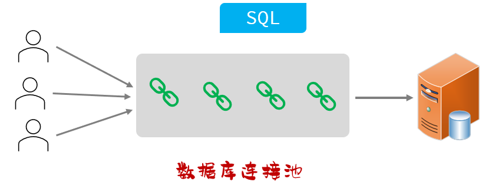

数据库连接池是一个容器，负责分配、管理数据库连接（Connection）。
* 程序在启动时，会在数据库连接池（容器）中，创建一定数量的 Connection 对象。

允许应用程序重复使用一个现有的数据库连接，而不是再重新建立一个。
* 客户端在执行 SQL 时，先从连接池中获取一个 Connection 对象，然后再执行 SQL 语句；SQL 语句执行完之后，释放 Connection 时就会把 Connection 对象归还给连接池（Connection 对象可以复用）。

释放空闲时间超过最大空闲时间的连接，来避免因为没有释放连接而引起的数据库连接遗漏。
* 客户端获取到 Connection 对象了，但是 Connection 对象并没有去访问数据库（处于空闲）；数据库连接池发现 Connection 对象的空闲时间 > 连接池中预设的最大空闲时间，此时数据库连接池就会自动释放掉这个连接对象。

数据库连接池的好处：
* 资源重用。
* 提升系统响应速度。
* 避免数据库连接遗漏。

##### 3.1.4.2 产品

官方（Sun）提供了数据库连接池的标准（`javax.sql.DataSource` 接口）。

功能 - 获取连接：
```java
public Connection getConnection() throws SQLException;
```

第三方组织必须按照 `DataSource` 接口实现。

常见的数据库连接池：C3P0、DBCP、Druid、Hikari（SpringBoot 默认）。

现在使用更多的是：Hikari、Druid（性能更优越）。

###### 3.1.4.2.1 Hikari（追光者）- 默认的连接池

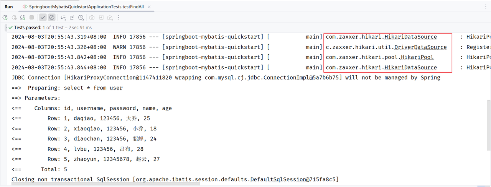

从控制台输出的日志，我们也可以看出，SpringBoot 底层默认使用的数据库连接池就是 Hikari。

###### 3.1.4.2.2 Druid（德鲁伊）

Druid 连接池是阿里巴巴开源的数据库连接池项目。

功能强大，性能优秀，是 Java 语言最好的数据库连接池之一。

如果我们想把默认的数据库连接池切换为 Druid 数据库连接池，只需要完成以下两步操作即可：
> 参考官方地址：[Druid 官方地址](https://github.com/alibaba/druid/tree/master/druid-spring-boot-starter "Druid 官方地址")。

1). 在 pom.xml 文件中引入依赖
```xml
<dependency>
    <!-- Druid 连接池依赖 -->
    <groupId>com.alibaba</groupId>
    <artifactId>druid-spring-boot-starter</artifactId>
    <version>1.2.19</version>
</dependency>
```
2). 在 application.properties 中引入数据库连接配置
```properties
spring.datasource.type=com.alibaba.druid.pool.DruidDataSource
spring.datasource.druid.driver-class-name=com.mysql.cj.jdbc.Driver
spring.datasource.druid.url=jdbc:mysql://localhost:3306/web
spring.datasource.druid.username=root
spring.datasource.druid.password=1234
```

#### 3.1.5 增删改查操作

##### 3.1.5.1 删除

需求：根据 ID 删除用户信息。

SQL 语句：
```sql
delete from user where id = 5;
```

Mapper 接口方法：
```java
/**
 * 根据 id 删除用户
 */
@Delete("delete from user where id  = #{id}")
public void deleteById(Integer id);
```

在 MyBatis 中，我们可以通过参数占位符号 “`#{...}`” 来占位，在调用 `deleteById` 方法时，传递的参数值最终会替换占位符。

DML 语句执行完毕，是有返回值的，我们可以为 Mapper 接口方法定义返回值来接收，如下所示：
```java
/**
 * 根据 id 删除用户
 */
@Delete("delete from user where id = #{id}")
public Integer deleteById(Integer id);
```

`Integer` 类型的返回值，表示 DML 语句执行完毕影响的记录数。

MyBatis 提供的符号有两个，一个是 `#{...}`，另一个是 `${...}`。区别如下：
| 符号 | 说明 | 场景 | 优缺点 |
| :--: | :--: | :--: | :--: |
| `#{...}` | 占位符：执行时，会将 `#{...}` 替换为 `?`，生成预编译 SQL | 参数值传递 | 安全、性能高（推荐） |
| `${...}` | 拼接符：直接将参数拼接在 SQL 语句中，存在 SQL 注入问题 | 表名、字段名动态设置时使用 | 不安全、性能低 |

> 注意：
>
> `${...}` 的使用场景示例：
> ```java
> @Select("select id, name, score from ${tableName} order by ${sortField}")
> ```
>
> 尽管如此，`${...}` 仍然不常用。

在企业项目开发中，强烈建议使用 `#{...}`。

##### 3.1.5.2 新增

需求：添加一个用户。

SQL 语句：
```sql
insert into user (username, password, name, age) values('Tom', '123456', '汤姆', 20);
```

Mapper 接口：
```java
/**
 * 添加用户
 */
@Insert("insert into user (username, password, name, age) values (#{username}, #{password}, #{name}, #{age})")
public void insert(User user);
```

如果在 SQL 语句中，我们需要传递多个参数，我们可以把多个参数封装到一个对象中；之后在 SQL 语句中，我们可以通过 “`#{对象属性名}`” 的方式，获取到对象中封装的属性值。

##### 3.1.5.3 修改

需求：根据 ID 更新用户信息。

SQL 语句：
```sql
update user set username = 'Tom', password = '123456', name = '汤姆', age = 20 where id = 1;
```

Mapper 接口方法：
```java
/**
 * 根据 id 更新用户信息
 */
@Update("update user set username = #{username}, password = #{password}, name = #{name}, age = #{age} where id = #{id}")
public void update(User user);
```

如果在 SQL 语句中，我们需要传递多个参数，我们可以把多个参数封装到一个对象中；之后在 SQL 语句中，我们可以通过 “`#{对象属性名}`” 的方式，获取到对象中封装的属性值。

##### 3.1.5.4 查询

需求：根据用户名和密码查询用户信息。

SQL 语句：
```sql
select * from  user where username = 'Tom' and password = '123456';
```

Mapper 接口方法：
```java
/**
 * 根据用户名和密码查询用户信息
 */
@Select("select * from user where username = #{username} and password = #{password}")
public User findByUsernameAndPassword(@Param("username") String username, @Param("password") String password);
```

`@Param` 注解的作用是为接口的方法形参起名称的；即如果接口方法形参中，需要传递多个参数，则需要通过 `@Param` 注解为参数起名字。使用 `@Param` 起的名称需要与 `@Select` 注解中 SQL 语句所包含的 `#{...}` 中的名称所对应。

由于用户名唯一，所以查询返回的结果最多只有一个，可以直接封装到一个对象中。

> 注意：
>
> 基于官方骨架创建的 SpringBoot 项目中，接口编译时会保留方法形参名，`@Param` 注解可以省略（以 `#{形参名}` 替代）；此时 `@Select` 注解中 SQL 语句所包含的 `#{...}` 中的名称需要与方法的形参名对应。
>
> 示例：
> 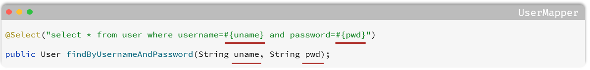
>
> 即：`@Param` 注解在多个形参、非官方骨架创建的 SpringBoot 项目中需要添加。

#### 3.1.6 XML 映射配置

MyBatis 的开发有两种方式：
* 注解。
* XML。

##### 3.1.6.1 XML 配置文件规范

使用 MyBatis 的注解方式，主要是来完成一些简单的增删改查功能。如果需要实现复杂的 SQL 功能，建议使用 XML 来配置映射语句，也就是将 SQL 语句写在 XML 配置文件中。

官方说明：[MyBatis 官方说明](https://mybatis.net.cn/getting-started.html "MyBatis 官方说明")。

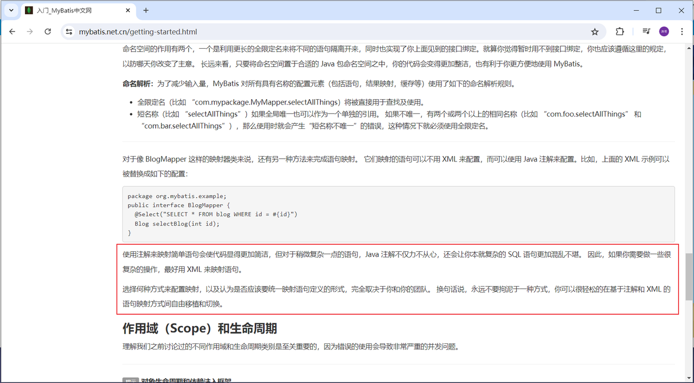

> 注意：
>
> 在 MyBatis 中使用 XML 映射文件方式开发，需要符合一定的规范：
> 1. XML 映射文件的名称与 Mapper 接口名称一致，并且将 XML 映射文件和 Mapper 接口放置在相同包下（同包同名）。
>       * 也可通过如下方式进行 XML 映射文件的辅助配置，配置 XML 映射文件的位置：
>           ```properties
>           # 指定 XML 映射配置文件的位置
>           mybatis.mapper-locations=classpath:mapper/*.xml
>           ```
> 2. XML 映射文件的 `namespace` 属性为 Mapper 接口全限定名一致。
> 3. XML 映射文件中 SQL 语句的 `id` 与 Mapper 接口中的方法名一致，并保持返回类型一致。

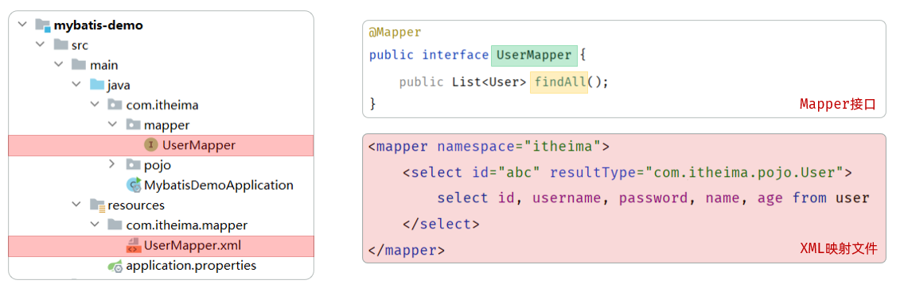

> 注意：
>
> `<select>` 标签：用于编写 select 查询语句。
> * `resultType` 属性，指的是查询返回的单条记录所封装的类型。

##### 3.1.6.2 XML 配置文件实现

1). 创建 XML 映射文件

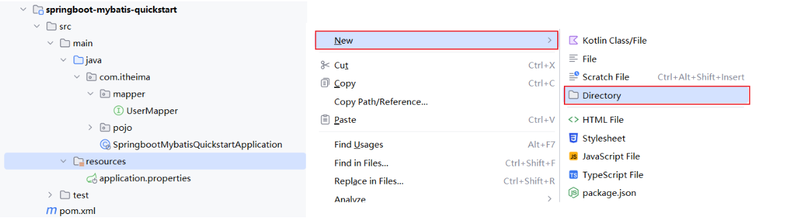

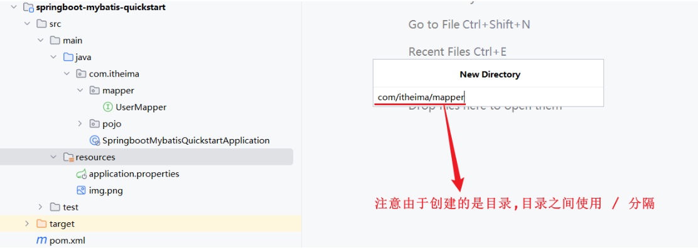

2). 编写 XML 映射文件

> 注意：
>
> XML 映射文件中的 dtd 约束，直接从 MyBatis 官网复制即可。

```xml
<?xml version="1.0" encoding="UTF-8" ?>
<!DOCTYPE mapper
  PUBLIC "-//mybatis.org//DTD Mapper 3.0//EN"
  "https://mybatis.org/dtd/mybatis-3-mapper.dtd">
<mapper namespace="">
 
</mapper>
```

3). 配置

a. XML 映射文件的 `namespace` 属性为 Mapper 接口全限定名
```xml
<?xml version="1.0" encoding="UTF-8" ?>
<!DOCTYPE mapper
        PUBLIC "-//mybatis.org//DTD Mapper 3.0//EN"
        "https://mybatis.org/dtd/mybatis-3-mapper.dtd">
<mapper namespace="com.itheima.mapper.UserMapper">

</mapper>
```

b. XML 映射文件中 SQL 语句的 `id` 与 Mapper 接口中的方法名一致，并保持返回类型一致
```xml
<?xml version="1.0" encoding="UTF-8" ?>
<!DOCTYPE mapper
        PUBLIC "-//mybatis.org//DTD Mapper 3.0//EN"
        "https://mybatis.org/dtd/mybatis-3-mapper.dtd">
<mapper namespace="com.itheima.mapper.EmpMapper">

    <!-- 查询操作 -->
    <!-- resultType：查询返回的单条记录所封装的类型 -->
    <select id="findAll" resultType="com.itheima.pojo.User">
        select * from user
    </select>
    
</mapper>
```

`resultType` 属性的值，与查询返回的单条记录封装的类型一致。

> 注意：
>
> 一个接口方法对应的 SQL 语句，要么使用注解配置，要么使用 XML 配置，切不可同时配置。

##### 3.1.6.3 MyBatisX 的使用

MyBatisX 是一款基于 IDEA 的快速开发 MyBatis 的插件，为效率而生。

在 IDEA 中的 File - Settings - Plugins 中即可下载并安装 MyBatisX 插件。

可通过 MyBatisX 快速定位：
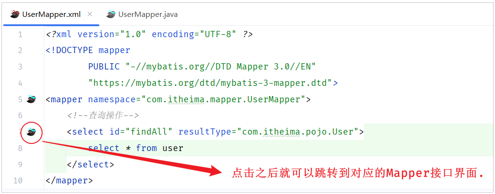

## 四、SpringBoot 配置文件

### 4.1 介绍

前面我们一直使用 SpringBoot 项目创建完毕后自带的 application.properties 进行属性的配置；而如果在项目中，我们需要配置大量的属性，采用 properties 配置文件这种 `key=value` 的配置形式，就会显得配置文件的层级结构不清晰，也比较臃肿。

其实，在 SpringBoot 项目当中是支持多种配置方式的。除了支持 properties 配置文件以外，还支持另一种类型的配置文件，即 yml 格式的配置文件。

yml 格式配置文件的名字为 application.yaml 或 application.yml，这两个配置文件的后缀名虽然不一样，但是里面配置的内容形式都是一模一样的。

> 注意：
>
> 在项目开发中，我们推荐使用 application.yml 配置文件来配置信息，简洁、明了、以数据为中心。

### 4.2 语法

yml 配置文件的基本语法：
* 大小写敏感。
* 数值前边必须有空格，作为分隔符。
* 使用缩进表示层级关系；缩进时，不允许使用 `Tab` 键，只能用空格（IDEA 中会自动将 `Tab` 转换为空格）。
* 缩进的空格数目不重要，只要相同层级的元素左侧对齐即可。
* `#` 表示注释，从这个字符一直到行尾，都会被解析器忽略。

示例：
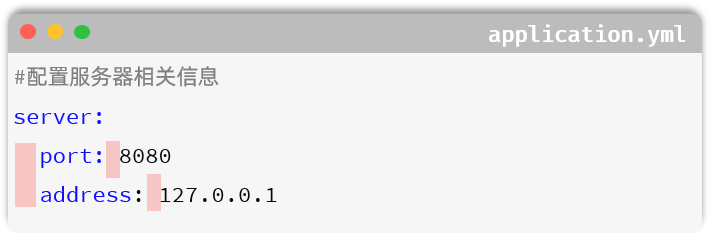

yml 文件中最为常见的数据格式有两类：
* 定义对象或 Map 集合。
* 定义数组、List 或 Set 集合。

对象 / Map 集合：
```yaml
user:
  name: Tom
  age: 18
  password: 123456
```

数组 / List / Set 集合：
```yaml
hobby:
  - java
  - game
  - sport
```

> 注意：
>
> 在 yml 格式的配置文件中，如果配置项的值是以 `0` 开头的，值需要使用 “`''`” 引起来，因为以 `0` 开头在 yml 中表示八进制的数据。

示例代码：
```yaml
# application.yml

# 定义对象 / Map 集合
user:
  name: Tom
  age: 18
  gender: 男

# 定义数组 / List / Set 集合
hobby:
  - Java
  - Game
  - Sport
```

### 4.3 案例

我们修改之前案例中使用的配置文件，变更为 application.yml 配置方式：
1). 修改 application.properties 名称为 _application.properties

* 名称可以随意更换，只要加载不到即可。

2). 创建新的配置文件：application.yml

* 原有的 application.properties 配置文件：
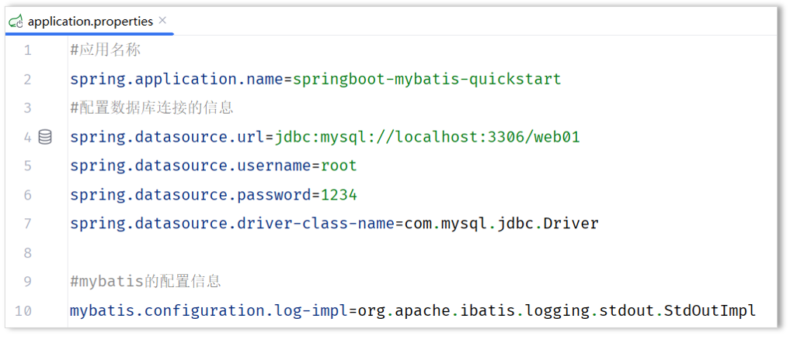

* 新建的 application.yml 配置文件：
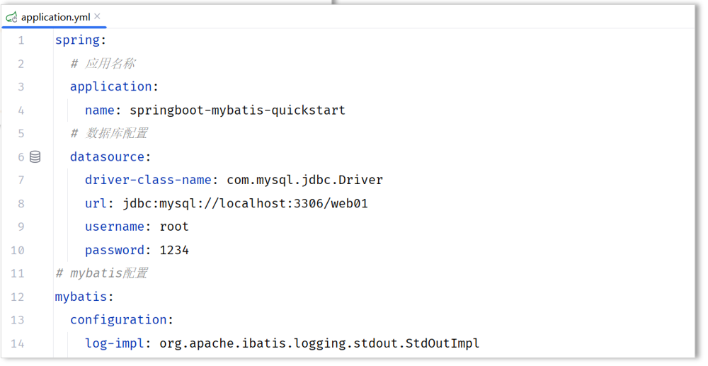

配置文件的内容如下：
```yaml
# 数据源配置
spring:
  datasource:
    driver-class-name: com.mysql.cj.jdbc.Driver
    url: jdbc:mysql://localhost:3306/web01
    username: root
    password: root@1234
# MyBatis 配置
mybatis:
  configuration:
    log-impl: org.apache.ibatis.logging.stdout.StdOutImpl
```