# 第六章：Web 后端基础（Java 操作数据库）

**目录：**

[TOC]

---

## 一、前言

在前面，我们学习 MySQL 数据库时，都是利用图形化客户端工具（如：IDEA、DataGrip）来操作数据库的。

作为后端程序开发人员，通常会使用 Java 程序来完成对数据库的操作。Java 程序操作数据库的技术有很多，而最为底层、最为基础的就是 JDBC。


**JDBC**（**J**ava **D**ata**B**ase **C**onnectivity）：使用 Java 语言操作关系型数据库的一套 API，是操作数据库最为基础、底层的技术。

但是使用 JDBC 来操作数据库，会比较繁琐。所以现在在企业项目开发中，一般都会使用基于 JDBC 的封装的高级框架，例如：MyBatis、MyBatis-Plus、Hibernate、SpringDataJPA。

本章，我们先来学习 JDBC 和 MyBatis。

## 二、JDBC

### 2.1 介绍

**JDBC**（**J**ava **D**ata**B**ase **C**onnectivity）：使用 Java 语言操作关系型数据库的一套 API。


本质：
* Sun 公司官方定义的一套操作所有关系型数据库的规范，即接口。
* 各个数据库厂商去实现这套接口，提供数据库驱动 jar 包。
* 我们可以使用这套接口（JDBC）编程，真正执行的代码是驱动 jar 包中的实现类。

有了 JDBC 之后，我们就可以直接在 Java 代码中来操作数据库了。只需要编写以下这样一段 Java 代码，就可以来操作数据库中的数据。示例代码如下：


### 2.2 更新数据

#### 2.2.1 需求

**需求：** 基于 JDBC 程序，执行 update 语句。

**本质：** 其本质就是基于 JDBC 程序，执行如下 update 语句，并将查询的结果输出到控制台。SQL 语句：
```sql
update user set age = 25 where id = 1;
```

#### 2.2.2 准备工作

1). 创建一个 Maven 项目


2). 创建一个数据库 web01，并在该数据库中创建 user 表

#### 2.2.3 代码实现

1). 在 pom.xml 文件中引入依赖

```xml
<dependencies>
    <dependency>
        <groupId>com.mysql</groupId>
        <artifactId>mysql-connector-j</artifactId>
        <version>9.3.0</version>
    </dependency>

    <dependency>
        <groupId>org.junit.jupiter</groupId>
        <artifactId>junit-jupiter</artifactId>
        <version>5.9.3</version>
        <scope>test</scope>
    </dependency>

    <dependency>
        <groupId>org.projectlombok</groupId>
        <artifactId>lombok</artifactId>
        <version>1.18.42</version>
        <scope>compile</scope>
    </dependency>
</dependencies>
```

> 注意：
>
> 如果 Lombok 版本太低，将会出现以下报错：
> ```bash
> java: java.lang.ExceptionInInitializerError
> com.sun.tools.javac.code.TypeTag :: UNKNOWN
> ```
>
> 解决方案：进入 Maven 仓库（[Maven 仓库](https://mvnrepository.com/ "Maven 仓库")）查询并选择 Lombok 最新版即可。

2). 定义测试方法

在 src/main/test/java/com/xxx（xxx 取决于你自己的域名及包名，下文同理，不再赘述）目录下编写测试类，定义测试方法：
```java
/* JdbcTest.java */

package com.anxin_hitsz;

import org.junit.jupiter.api.Test;

import java.sql.Connection;
import java.sql.DriverManager;
import java.sql.SQLException;
import java.sql.Statement;

/**
 * ClassName: JdbcTest
 * Package: com.anxin_hitsz
 * Description:
 *
 * @Author AnXin
 * @Create 2026/3/6 17:49
 * @Version 1.0
 */
public class JdbcTest {

    /**
     * JDBC 入门程序
     */
    @Test
    public void testUpdate() throws ClassNotFoundException, SQLException {
        // 1. 注册驱动
        Class.forName("com.mysql.cj.jdbc.Driver");

        // 2. 获取数据库连接
        String url = "jdbc:mysql://localhost:3306/web01";
        String username = "root";
        String password = "AnXin517985!";
        Connection connection = DriverManager.getConnection(url, username, password);

        // 3. 获取 SQL 语句执行对象
        Statement statement = connection.createStatement();

        // 4. 执行 SQL
        int cnt = statement.executeUpdate("update user set age = 25 where id = 1");   // DML
        System.out.println("SQL 执行完毕影响的记录数为：" + cnt);

        // 5. 释放资源
        statement.close();
        connection.close();

    }

}

```

> 注意：
>
> JDBC 程序执行 DML 语句：
> ```java
> int rowsUpdated = pstmt.executeUpdate();
> ```
>
> 返回值是影响的记录数。

### 2.3 查询数据

#### 2.3.1 需求

**需求：** 基于 JDBC 程序，执行 select 语句。

**本质：** 其本质就是基于 JDBC 程序，执行如下 select 语句，并将查询的结果封装到 `User` 对象中。SQL 语句：
```sql
select * from user where username = 'daqiao' and password = '123456';
```

#### 2.3.2 准备工作

与 2.2.2 准备工作 一致，此处不再赘述。

#### 2.3.3 代码实现

1). 在 pom.xml 文件中引入依赖

与 2.2.3 代码实现 1). 一致，此处不再赘述。

2). 定义实体类 `User`

在 src/main/java/com/xxx/pojo 目录下创建 User.java，定义实体类：
```java
/* pojo/User.java */

package com.anxin_hitsz.pojo;

import lombok.AllArgsConstructor;
import lombok.Data;
import lombok.NoArgsConstructor;

/**
 * ClassName: User
 * Package: com.anxin_hitsz.pojo
 * Description:
 *
 * @Author AnXin
 * @Create 2026/3/6 19:35
 * @Version 1.0
 */
@Data
@AllArgsConstructor
@NoArgsConstructor
public class User {
    private Integer id;
    private String username;
    private String password;
    private String name;
    private Integer age;
}

```

2). 定义测试方法

在 src/main/test/java/com/xxx 目录下编写测试类，定义测试方法

由于单元测试中的“用户名”和“密码”的值应该是动态的，是将来页面传递到服务端的，因此我们可以基于前面所讲解的 JUnit 中的参数化测试进行单元测试。

示例代码（未使用 JUnit 中的参数化测试）：
```java
/* JdbcTest.java */

package com.anxin_hitsz;

import com.anxin_hitsz.pojo.User;
import org.junit.jupiter.api.Test;

import java.sql.*;

/**
 * ClassName: JdbcTest
 * Package: com.anxin_hitsz
 * Description:
 *
 * @Author AnXin
 * @Create 2026/3/6 17:49
 * @Version 1.0
 */
public class JdbcTest {

    /**
     * JDBC 入门程序
     */
    @Test
    public void testUpdate() throws ClassNotFoundException, SQLException {
        // 1. 注册驱动
        Class.forName("com.mysql.cj.jdbc.Driver");

        // 2. 获取数据库连接
        String url = "jdbc:mysql://localhost:3306/web01";
        String username = "root";
        String password = "AnXin517985!";
        Connection connection = DriverManager.getConnection(url, username, password);

        // 3. 获取 SQL 语句执行对象
        Statement statement = connection.createStatement();

        // 4. 执行 SQL
        int cnt = statement.executeUpdate("update user set age = 25 where id = 1");   // DML
        System.out.println("SQL 执行完毕影响的记录数为：" + cnt);

        // 5. 释放资源
        statement.close();
        connection.close();

    }

    @Test
    public void testSelect() {
        String URL = "jdbc:mysql://localhost:3306/web01";
        String USER = "root";
        String PASSWORD = "AnXin517985!";

        Connection conn = null;
        PreparedStatement stmt = null;
        ResultSet rs = null;    // 封装查询返回的结果

        try {
            // 1. 注册 JDBC 驱动
            Class.forName("com.mysql.cj.jdbc.Driver");

            // 2. 打开链接
            conn = DriverManager.getConnection(URL, USER, PASSWORD);

            // 3. 执行查询
            String sql = "SELECT id, username, password, name, age FROM user WHERE username = ? AND password = ?";    // 预编译 SQL
            stmt = conn.prepareStatement(sql);
            stmt.setString(1, "daqiao");
            stmt.setString(2, "123456");

            rs = stmt.executeQuery();

            // 4. 处理结果集
            while (rs.next()) {
                User user = new User(
                        rs.getInt("id"),
                        rs.getString("username"),
                        rs.getString("password"),
                        rs.getString("name"),
                        rs.getInt("age")
                );
                System.out.println(user);   // 使用 Lombok 的 @Data 自动生成的 toString 方法
            }
        } catch (SQLException se) {
            // Handle errors for JDBC
            se.printStackTrace();
        } catch(Exception e) {
            // Handle errors for Class.forName
            e.printStackTrace();
        } finally {
            // 5. 关闭资源
            try {
                if (rs != null) {
                    rs.close();
                }
                if (stmt != null) {
                    stmt.close();
                }
                if (conn != null) {
                    conn.close();
                }
            } catch (SQLException se) {
                se.printStackTrace();
            }
        }
    }

}

```

> 注意：
>
> JDBC 程序执行 DQL 语句：
> ```java
> ResultSet resultSet = pstmt.executeQuery();
> ```
>
> 返回值是查询结果集。

如果在测试时，需要传递一组参数，可以使用 `@CsvSource` 注解。

#### 2.3.4 代码剖析

##### 2.3.4.1 ResultSet

`ResultSet`（结果集对象）：封装了 DQL 查询语句查询的结果。
* `next()`：将光标从当前位置向下移动一行，并判断当前行是否为有效行，返回值为 `boolean`。
  * `true`：有效行，当前行有数据。
  * `false`：无效行，当前行没有数据。
* `getXxx(...)`：获取数据，可以根据列的编号获取，也可以根据列名获取（推荐）。

结果解析步骤：


##### 2.3.4.2 预编译 SQL

我们在编写 SQL 语句的时候，有两种风格：

* 静态 SQL（参数硬编码）：

```java
conn.prepareStatement("SELECT * FROM user WHERE username = 'daqiao' AND password = '123456'");
ResultSet resultSet = pstmt.executeQuery();
```

上述方式中，参数值直接拼接在 SQL 语句中，参数值是写死的。

* 预编译 SQL（参数动态传递）：

```java
conn.prepareStatement("SELECT * FROM user WHERE username = ? AND password = ?");
pstmt.setString(1, "daqiao");
pstmt.setString(2, "123456");
ResultSet resultSet = pstmt.executeQuery();
```

上述方式中，并未将参数值在 SQL 语句中写死，而是使用 “`?`” 进行占位，然后再指定每一个占位符对应的值是多少；而最终在执行 SQL 语句的时候，程序会将 SQL 语句 `SELECT * FROM user WHERE username = ? AND password = ?` 以及参数值 `("daqiao", "123456")` 都发送给数据库，然后在执行的时候，会使用参数值将 `?` 占位符替换掉。

上述这种预编译的 SQL，也是在项目开发中推荐使用的 SQL 语句。主要的作用有两个：
* 防止 SQL 注入。
* 性能更高。

接下来，我们就来介绍一下这两点。

###### 2.3.4.2.1 SQL 注入

SQL 注入：通过控制输入来修改事先定义好的 SQL 语句，以达到执行代码对服务器进行**攻击**的方法。

SQL 注入最典型的场景，就是用户登录功能。

我们可以通过**控制表单输入**，来修改事先定义好的 SQL 语句的含义，从而来攻击服务器。

出现 SQL 注入的现象，原因在于：**我们编写的 SQL 语句是基于字符串进行拼接的**。我们输入的用户名无所谓，例如 “`shfhsjfhja`”；而密码则是我们精心设计的，例如 “`' or '1' = '1`”。

那么最终拼接的 SQL 语句，如下所示：
```sql
select count(*) from emp where username = 'shfhsjfhja' and password = '' or '1' = '1';
```

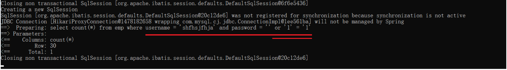

我们知道，`or` 连接的条件，是 “或” 的关系，两者满足其一就可以。所以，虽然用户名密码输入错误，也是可以查询返回结果的；而只要查询到了数据，就说明用户名和密码是正确的。

###### 2.3.4.2.2 SQL 注入解决

通过预编译 SQL（`select * from user where username = ? and password = ?`），就可以直接解决上述 SQL 注入的问题。

通过控制台，可以看到输入的 SQL 语句，是预编译 SQL 语句：
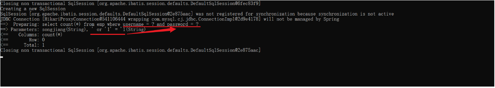

在预编译 SQL 语句中，当我们执行的时候，会把整个 `' or '1' = '1` 作为一个完整的参数，赋值给第 2 个问号（`' or '1' = '1` 进行了转义，只当做字符串使用）。

那么此时再查询时，就查询不到对应的数据了，登录失败。

> 注意：
>
> 在以后的项目开发中，我们使用的基本全部都是预编译 SQL 语句。

###### 2.3.4.2.3 性能更高

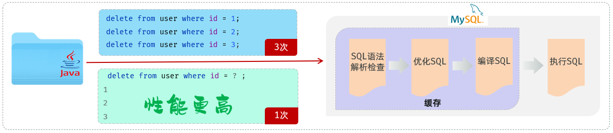

## 三、MyBatis

### 3.1 介绍

MyBatis 是一款优秀的 **持久层** **框架**，用于简化 JDBC 的开发。

MyBatis 本是 Apache 的一个开源项目 iBatis。2010 年这个项目由 Apache 迁移到了 Google Code，并且改名为 MyBatis。2013 年 11 月迁移到 GitHub。

MyBatis 官网：[MyBatis 官网](https://mybatis.org/mybatis-3/zh_CN/index.html "MyBatis 官网")。

在上面我们提到了两个词：一个是持久层，另一个是框架。
* 持久层：指数据访问层（dao），是用来操作数据库的。
    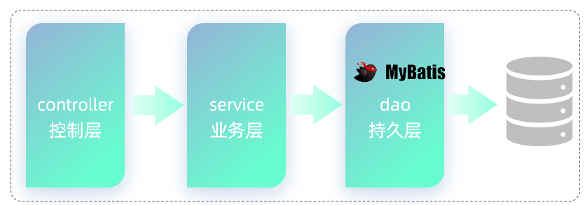
* 框架：是一个半成品软件，是一套可重用的、通用的、软件基础代码模型。在框架的基础上进行软件开发更加高效、规范、通用、可拓展。

通过 MyBatis 可以大大简化原生的 JDBC 程序的代码编写。

#### 3.1.1 快速入门

需求：使用 MyBatis 查询所有用户数据。

步骤：

1). 创建 SpringBoot 工程，并导入 MyBatis 的起步依赖、MySQL 的驱动包、Lombok。

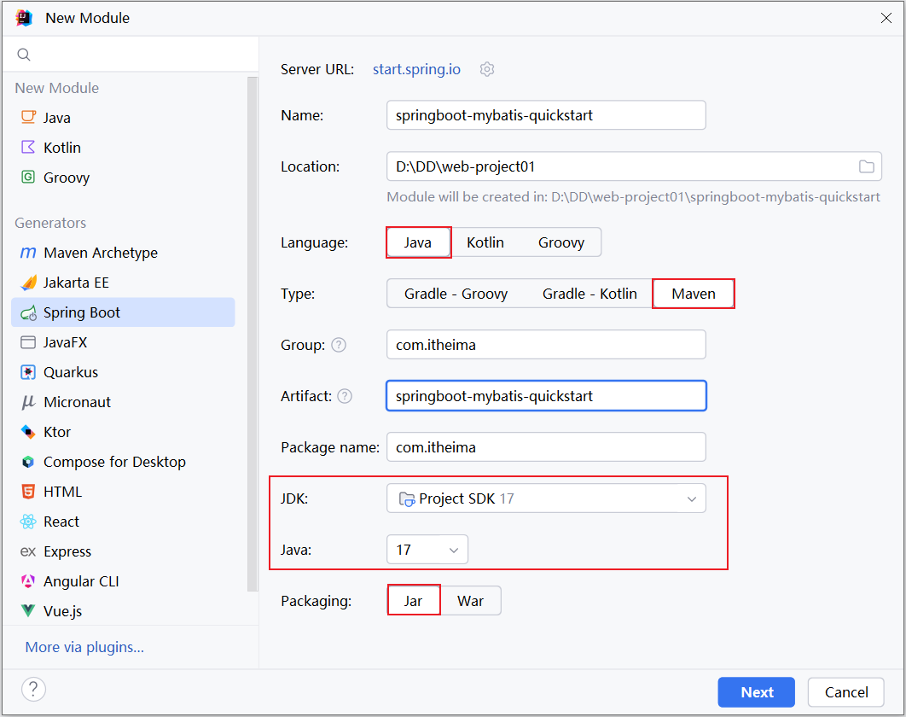

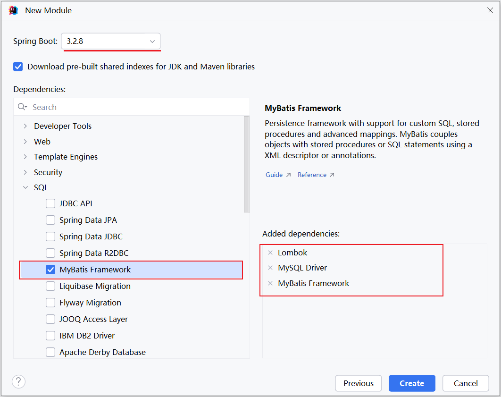

项目工程创建完成后，自动在 pom.xml 文件中，导入 MyBatis 依赖和 MySQL 驱动依赖。如下图所示：
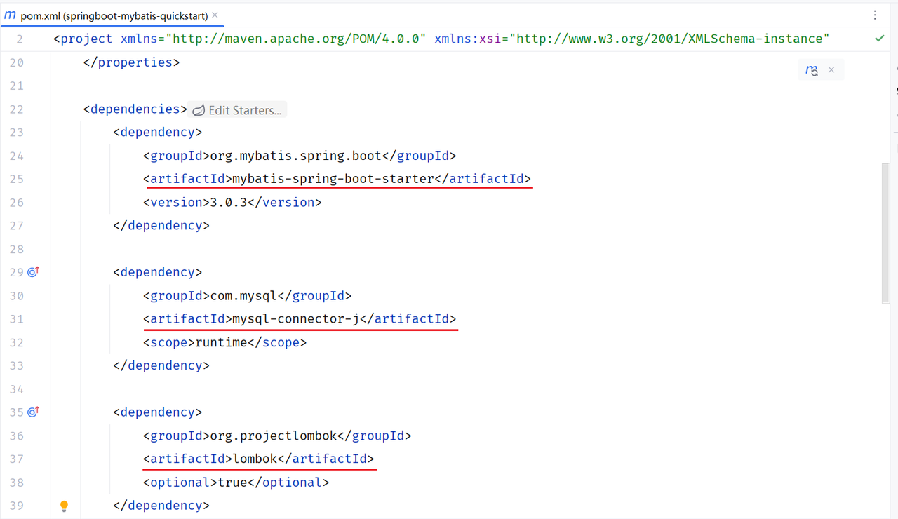

2). 数据准备：创建用户表 user，并创建对应的实体类 `User`

用户表 user 的创建可参考本章前处，此处不再赘述。

实体类的属性名与表中的字段名一一对应：
```java
/* pojo/User.java */

package com.anxin_hitsz.pojo;

import lombok.AllArgsConstructor;
import lombok.Data;
import lombok.NoArgsConstructor;

/**
 * ClassName: User
 * Package: com.anxin_hitsz.pojo
 * Description:
 *
 * @Author AnXin
 * @Create 2026/3/6 19:35
 * @Version 1.0
 */
@Data
@AllArgsConstructor
@NoArgsConstructor
public class User {
    private Integer id;
    private String username;
    private String password;
    private String name;
    private Integer age;
}

```

实体类放在 com.xxx.pojo 包下：
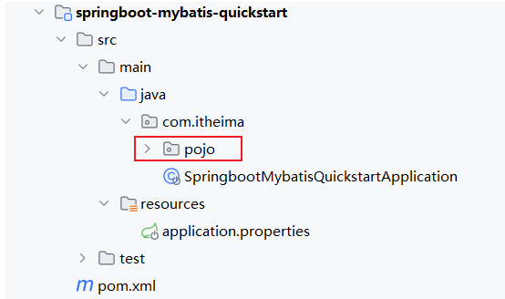

3). 配置 MyBatis

在 application.properties 中配置数据库的连接信息：
```properties
# 数据库访问的 url 地址
spring.datasource.url=jdbc:mysql://yourDatabaseIP:yourDatabasePort/yourDatabaseName
# 数据库驱动类类名
spring.datasource.driver-class-name=com.mysql.cj.jdbc.Driver
# 访问数据库 - 用户名
spring.datasource.username=yourUsername
# 访问数据库 - 密码
spring.datasource.password=yourPassword
```

4). 编写 MyBatis 程序：编写 MyBatis 的持久层接口，定义 SQL（**注解** / XML）

在创建出来的 SpringBoot 工程中，在引导类所在包下，再创建一个包 mapper。在 mapper 包下创建一个接口 `UserMapper`，这是一个持久层接口（MyBatis 的持久层接口命名规范为 `XxxMapper`，也称为 Mapper 接口）。

`UserMapper` 接口的内容如下：
```java
/* mapper/UserMapper.java */

package com.anxin_hitsz.mapper;

import com.anxin_hitsz.pojo.User;
import org.apache.ibatis.annotations.Mapper;
import org.apache.ibatis.annotations.Select;

import java.util.List;

/**
 * ClassName: UserMapper
 * Package: com.anxin_hitsz.mapper
 * Description:
 *
 * @Author AnXin
 * @Create 2026/3/6 22:04
 * @Version 1.0
 */
@Mapper // 应用程序在运行时，会自动地为该接口创建一个实现类对象（代理对象），并且会自动地将该实现类对象存入 IOC 容器 - Bean 对象
public interface UserMapper {

    /**
     * 查询所有用户
     */
    @Select("select * from user")
    public List<User> findAll();

}

```

> 注意：
>
> 注解说明：
> * `@Mapper` 注解：表示是 MyBatis 中的 Mapper 接口。
>   * 程序运行时，框架会自动生成接口的实现类对象（代理对象），并交给 Spring 的 IOC 容器管理。
> * `@Select` 注解：代表的就是 select 查询，用于书写 select 查询语句。

5). 单元测试

在创建出来的 SpringBoot 工程中，在 src 下的 test 目录下，已经自动帮我们创建好了测试类，并且在测试类上已经添加了注解 `@SpringBootTest`，代表该测试类已经与 SpringBoot 整合。

该测试类在运行时，会自动通过引导类加载 Spring 的环境（IOC 容器）。我们要测试哪一个 Bean 对象，就可以直接通过 `@Autowired` 注解直接将其注入，然后就可以测试了。

测试类代码如下：
```java
/* SpringbootMybatisQuickstartApplicationTests.java */

package com.anxin_hitsz;

import com.anxin_hitsz.mapper.UserMapper;
import com.anxin_hitsz.pojo.User;
import org.junit.jupiter.api.Test;
import org.springframework.beans.factory.annotation.Autowired;
import org.springframework.boot.test.context.SpringBootTest;

import java.util.List;

@SpringBootTest // SpringBoot 单元测试的注解 - 当前测试类中的测试方法运行时，会启动 SpringBoot 项目 - IOC 容器
class SpringbootMybatisQuickstartApplicationTests {

    @Autowired
    private UserMapper userMapper;

    @Test
    public void testFindAll() {
        List<User> userList = userMapper.findAll();
        userList.forEach(System.out::println);
    }

}

```

> 注意：测试类所在包，需要与引导类所在包相同。

#### 3.1.2 辅助配置

##### 3.1.2.1 配置 SQL 提示

默认我们在 UserMapper 接口上加的 @Select 注解中编写 SQL 语句是没有提示的。如果想让 IDEA 给我们提示对应的 SQL 语句，我们需要在 IDEA 中配置与 MySQL 数据库的连接。

可以做如下配置：
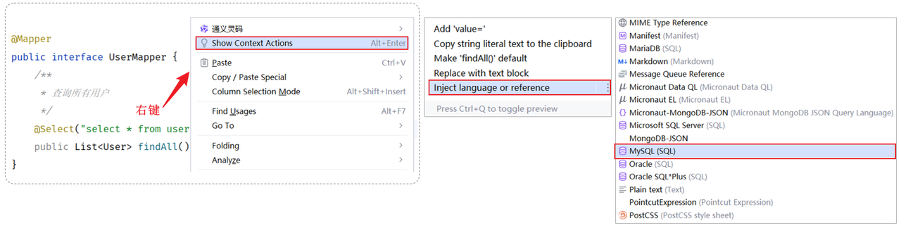

配置完成之后，发现 SQL 语句中的关键字有提示了，但还存在不识别表名（列名）的情况。
* 产生原因：IDEA 和数据库没有建立连接，不识别表信息。
* 解决方案：在 IDEA 中配置 MySQL 数据库连接。

按照如下方式，配置当前 IDEA 关联的 MySQL 数据库（必须要指定连接的是哪个数据库）：

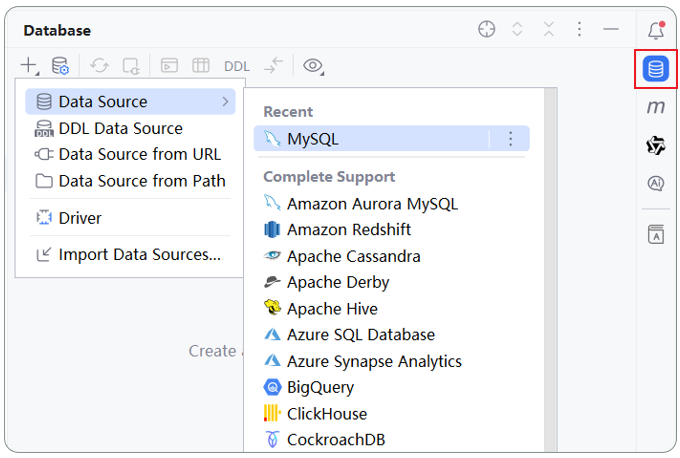

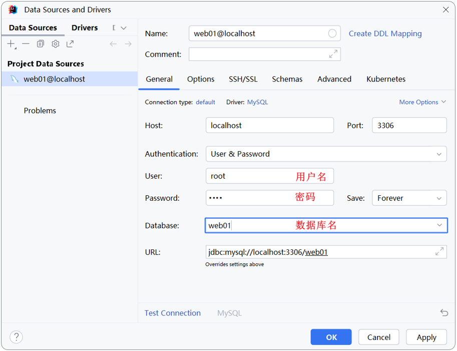

> 注意：
>
> 该配置的目的，仅仅是为了在编写 SQL 语句时有语法提示（写错了会报错），不会影响运行，即使不配置也是可以的。

##### 3.1.2.2 配置 MyBatis 日志输出

默认情况下，在 MyBatis 中，SQl 语句执行时，我们并不能看到 SQL 语句的执行日志。

在 application.properties 加入如下配置，即可查看日志：
```properties
# mybatis 的配置
mybatis.configuration.log-impl=org.apache.ibatis.logging.stdout.StdOutImpl
```

打开上述开关之后，再次运行单元测试，即可看到控制台输出的 SQL 语句是什么样子的。

#### 3.1.3 JDBC VS MyBatis

JDBC 程序的**缺点**：
* url、username、password 等相关参数全部硬编码在 Java 代码中。
* 查询结果的解析、封装比较繁琐。
* 每一次操作数据库之前，先获取连接；操作完毕之后，关闭连接。频繁地获取连接、释放连接会造成资源浪费。

分析了 JDBC 的缺点之后，我们再来看一下在 MyBatis 中是如何解决这些问题的：
* 数据库连接四要素（驱动、链接、用户名、密码），都配置在 SpringBoot 默认的配置文件 application.properties 中。
* 查询结果的解析及封装，由 MyBatis 自动完成映射封装，我们无需关注。
* 在 MyBatis 中使用了数据库连接池技术，从而避免了频繁地创建连接、销毁连接而带来的资源浪费。

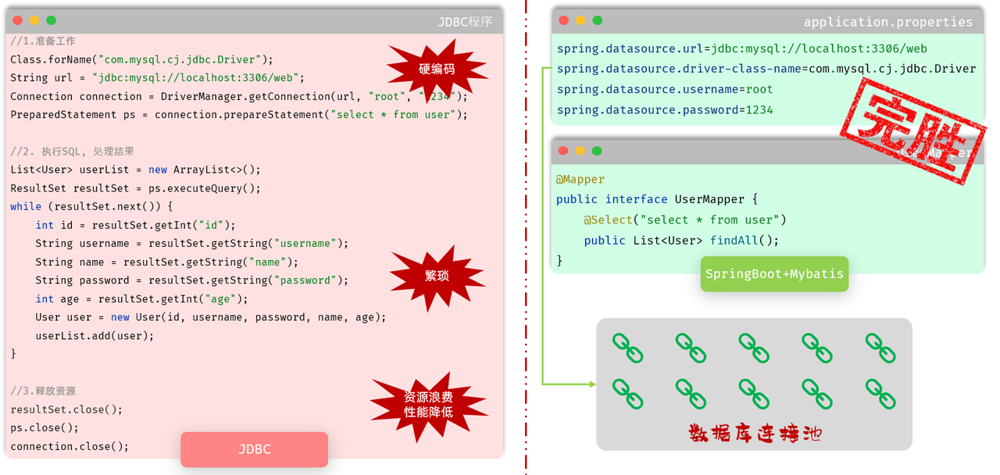

而对于 MyBatis 来说，我们在开发持久层程序操作数据库时，需要重点关注以下两个方面：
1. application.properties：
    ```properties
    # 驱动类名称
    spring.datasource.driver-class-name=com.mysql.cj.jdbc.Driver
    # 数据库连接的 url
    spring.datasource.url=jdbc:mysql://yourDatabaseIP:yourDatabasePort/yourDatabaseName
    # 连接数据库的用户名
    spring.datasource.username=yourUsername
    # 连接数据库的密码
    spring.datasource.password=yourPassword
    ```
2. Mapper 接口（编写 SQL 语句）：
    ```java
    @Mapper
    public interface UserMapper {
        @Select("select * from user")
        public List<User> list();
    }
    ```