# 第七章：后端 Web 实战（部门管理）

**目录：**

[TOC]

---

本章及之后，要完成一个大的综合案例：Tlias 智能学习辅助系统。

该案例中包含以下功能：

1). 部门管理


2). 员工管理


3). 员工信息统计


4). 学员信息统计


5). 班级、学员管理

> 注意：
>
> 在整个实战篇中，我们需要完成如下内容：
> * 部门管理：查询、新增、修改、删除。
> * 员工管理：
>   * 查询、新增、修改、删除。
>   * 文件上传。
> * 报表管理。
> * 登录认证。
> * 日志管理。
> * 班级管理。
> * 学员管理。

本章，我们先来完成第一个模块：部门管理。

## 一、准备工作

### 1.1 开发规范

#### 1.1.1 前后端分离开发

现在的企业项目开发有 2 种开发模式：**前后台混合开发**和**前后台分离开发**。

目前基本都是采用前后台分离开发方式，如下图所示：


在前后台分离开发方式中，前后台需要统一制定一套规范，前后台开发人员都需要遵循这套规范开发，这就是**接口文档**。

接口文档的内容是后台开发者根据产品经理提供的产品原型和需求文档所撰写出来的。

基于前后台分离开发的模式，后台开发者开发一个功能的具体流程如下图所示：


#### 1.1.2 Restful 风格

案例基于当前最为主流的前后端分离模式进行开发。


在前后端进行交互的时候，我们需要基于当前主流的 REST 风格的 API 接口进行交互。

**REST**（**RE**presentational **S**tate **T**ransfer）：表述性状态转换，是一种软件架构风格。

基于 REST 风格的 URL 如下：
* `http://localhost:8080/users/1`：GET - 查询 `id` 为 `1` 的用户。
* `http://localhost:8080/users`：POST - 新增用户。
* `http://localhost:8080/users`：PUT - 修改用户。
* `http://localhost:8080/users/1`：DELETE - 删除 `id` 为 `1` 的用户。

REST 风格 - 总结：通过 URL 定位要操作的资源，通过 HTTP 动词（请求方式）来描述具体的操作。

在 REST 风格的 URL 中，通过四种请求方式，来操作数据的增删改查：
* GET：查询。
* POST：新增。
* PUT：修改。
* DELETE：删除。

> 注意：
> * REST 是风格，是约定方式，约定不是规定，可以打破。
> * 描述模块的功能通常使用复数，也就是加 `s` 的格式来描述，表示此类资源，而非单个资源；例如：`users`、`emps`、`books` ……

#### 1.1.3 Apifox

后端开发对接口进行请求测试、前端开发对数据的获取及测试页面的渲染展示，我们可以借助一些接口测试工具（例如：Postman、Apipost、Apifox）等来完成。

我们采用功能更为强大的 Apifox 工具。

Apifox 是一款集成了 API 文档、API 调试、API Mock、API 测试的一体化协作平台。
* 作用：接口文档管理、接口请求测试、Mock 服务。

Apifox 官网：[Apifox 官网](https://apifox.com/ "Apifox 官网")。

### 1.2 工程搭建

1). 创建 SpringBoot 工程，并引入 Web 开发起步依赖、MyBatis、MySQL 驱动、Lombok。

创建项目：


2). 创建数据库及对应的表结构，并在 application.yml 中配置数据库的基本信息

创建 tlias 数据库，并准备 dept 部门表：
```sql
CREATE TABLE dept (
  id int unsigned PRIMARY KEY AUTO_INCREMENT COMMENT 'ID, 主键',
  name varchar(10) NOT NULL UNIQUE COMMENT '部门名称',
  create_time datetime DEFAULT NULL COMMENT '创建时间',
  update_time datetime DEFAULT NULL COMMENT '修改时间'
) COMMENT '部门表';

INSERT INTO dept VALUES (1,'学工部','2023-09-25 09:47:40','2024-07-25 09:47:40'),
                        (2,'教研部','2023-09-25 09:47:40','2024-08-09 15:17:04'),
                        (3,'咨询部','2023-09-25 09:47:40','2024-07-30 21:26:24'),
                        (4,'就业部','2023-09-25 09:47:40','2024-07-25 09:47:40'),
                        (5,'人事部','2023-09-25 09:47:40','2024-07-25 09:47:40'),
                        (6,'行政部','2023-11-30 20:56:37','2024-07-30 20:56:37');
```

在 application.yml 配置文件中配置数据库的连接信息：
```yaml
spring:
  application:
    name: tlias-web-management
  # 配置数据库的连接信息
  datasource:
    url: jdbc:mysql://localhost:3306/tlias
    driver-class-name: com.mysql.cj.jdbc.Driver
    username: root
    password: 1234
mybatis:
  configuration:
    log-impl: org.apache.ibatis.logging.stdout.StdOutImpl
```

3). 准备基础包结构，并引入实体类 `Dept` 及统一的响应结果封装类 `Result`

准备基础包结构：


在 pojo 中编写实体类 `Dept` 及统一的响应结果封装类 `Result`：
* 实体类 `Dept`：
```java
/* pojo/Dept.java */

package com.anxin_hitsz.pojo;

import lombok.AllArgsConstructor;
import lombok.Data;
import lombok.NoArgsConstructor;

import java.time.LocalDateTime;

/**
 * ClassName: Dept
 * Package: com.anxin_hitsz.pojo
 * Description:
 *
 * @Author AnXin
 * @Create 2026/3/8 13:14
 * @Version 1.0
 */
@Data
@NoArgsConstructor
@AllArgsConstructor
public class Dept {
    private Integer id;
    private String name;
    private LocalDateTime createTime;
    private LocalDateTime updateTime;
}

```
* 统一响应结果 `Result`：
```java
/* pojo/Result.java */

package com.anxin_hitsz.pojo;

import lombok.Data;

/**
 * ClassName: Result
 * Package: com.anxin_hitsz.pojo
 * Description:
 *
 * @Author AnXin
 * @Create 2026/3/8 13:17
 * @Version 1.0
 */

/**
 * 后端统一返回结果
 */
@Data
public class Result {

    private Integer code;   // 编码：1 - 成功；0 - 失败
    private String msg; // 错误信息
    private Object data;    // 数据

    public static Result success() {
        Result result = new Result();
        result.code = 1;
        result.msg = "success";
        return result;
    }

    public static Result success(Object object) {
        Result result = new Result();
        result.data = object;
        result.code = 1;
        result.msg = "success";
        return result;
    }

    public static Result error(String msg) {
        Result result = new Result();
        result.msg = msg;
        result.code = 0;
        return result;
    }

}

```

4). 填充项目代码

基础代码结构：


* `DeptMapper`：
```java
/* mapper/DeptMapper.java */

package com.anxin_hitsz.mapper;

import org.apache.ibatis.annotations.Mapper;

/**
 * ClassName: DeptMapper
 * Package: com.anxin_hitsz.mapper
 * Description:
 *
 * @Author AnXin
 * @Create 2026/3/8 13:21
 * @Version 1.0
 */
@Mapper
public interface DeptMapper {
}

```
* `DeptService`：
```java
/* service/DeptService.java */

package com.anxin_hitsz.service;

/**
 * ClassName: DeptService
 * Package: com.anxin_hitsz.service
 * Description:
 *
 * @Author AnXin
 * @Create 2026/3/8 13:22
 * @Version 1.0
 */
public interface DeptService {
}

```
* `DeptServiceImpl`：
```java
/* service/impl/DeptServiceImpl.java */

package com.anxin_hitsz.service.impl;

import com.anxin_hitsz.service.DeptService;
import org.springframework.stereotype.Service;

/**
 * ClassName: DeptServiceImpl
 * Package: com.anxin_hitsz.service.impl
 * Description:
 *
 * @Author AnXin
 * @Create 2026/3/8 13:22
 * @Version 1.0
 */
@Service
public class DeptServiceImpl implements DeptService {
}

```
* `DeptController`：
```java
/* controller/DeptController.java */

package com.anxin_hitsz.controller;

import org.springframework.stereotype.Controller;
import org.springframework.web.bind.annotation.RestController;

/**
 * ClassName: DeptController
 * Package: com.anxin_hitsz.controller
 * Description:
 *
 * @Author AnXin
 * @Create 2026/3/8 13:23
 * @Version 1.0
 */
@RestController
public class DeptController {
}

```

## 二、查询部门

### 2.1 基本实现

#### 2.1.1 需求

查询所有的部门数据，查询出来展示在部门管理的页面中。页面原型效果如下：


#### 2.1.2 接口描述

参照接口文档。

#### 2.1.3 实现思路

明确了查询部门的需求之后，再来梳理一下实现该功能时三层架构每一层的职责：
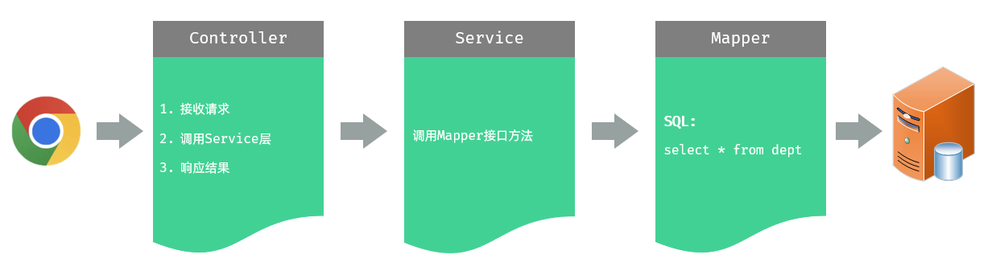
* Controller 层，负责接收前端发起的请求，并调用 Service 层查询部门数据，然后响应结果。
* Service 层，负责调用 Mapper 接口方法，查询所有部门数据。
* Mapper 层，执行查询所有部门数据的操作。

#### 2.1.4 代码实现

##### 2.1.4.1 Controller 层

示例代码：
```java
/* controller/DeptController.java */

package com.anxin_hitsz.controller;

import com.anxin_hitsz.pojo.Dept;
import com.anxin_hitsz.pojo.Result;
import com.anxin_hitsz.service.DeptService;
import org.springframework.beans.factory.annotation.Autowired;
import org.springframework.stereotype.Controller;
import org.springframework.web.bind.annotation.GetMapping;
import org.springframework.web.bind.annotation.RequestMapping;
import org.springframework.web.bind.annotation.RequestMethod;
import org.springframework.web.bind.annotation.RestController;

import java.util.List;

/**
 * ClassName: DeptController
 * Package: com.anxin_hitsz.controller
 * Description:
 *
 * @Author AnXin
 * @Create 2026/3/8 13:23
 * @Version 1.0
 */
@RestController
public class DeptController {

    @Autowired
    private DeptService deptService;

//    @RequestMapping(value = "/depts", method = RequestMethod.GET) // method：指定请求方式
    @GetMapping("/depts")
    public Result list() {
        System.out.println("查询全部部门数据");
        List<Dept> deptList = deptService.findAll();
        return Result.success(deptList);
    }

}

```

##### 2.1.4.2 Service 层

示例代码：
```java
/* service/DeptService.java */

package com.anxin_hitsz.service;

import com.anxin_hitsz.pojo.Dept;

import java.util.List;

/**
 * ClassName: DeptService
 * Package: com.anxin_hitsz.service
 * Description:
 *
 * @Author AnXin
 * @Create 2026/3/8 13:22
 * @Version 1.0
 */
public interface DeptService {
    /**
     * 查询所有部门
     */
    List<Dept> findAll();
}


/* service/impl/DeptServiceImpl.java */

package com.anxin_hitsz.service.impl;

import com.anxin_hitsz.mapper.DeptMapper;
import com.anxin_hitsz.pojo.Dept;
import com.anxin_hitsz.service.DeptService;
import org.springframework.beans.factory.annotation.Autowired;
import org.springframework.stereotype.Service;

import java.util.List;

/**
 * ClassName: DeptServiceImpl
 * Package: com.anxin_hitsz.service.impl
 * Description:
 *
 * @Author AnXin
 * @Create 2026/3/8 13:22
 * @Version 1.0
 */
@Service
public class DeptServiceImpl implements DeptService {

    @Autowired
    private DeptMapper deptMapper;

    @Override
    public List<Dept> findAll() {
        return deptMapper.findAll();
    }
}

```

##### 2.1.4.3 Mapper 层

示例代码：
```java
/* mapper/DeptMapper.java */

package com.anxin_hitsz.mapper;

import com.anxin_hitsz.pojo.Dept;
import org.apache.ibatis.annotations.Mapper;
import org.apache.ibatis.annotations.Select;

import java.util.List;

/**
 * ClassName: DeptMapper
 * Package: com.anxin_hitsz.mapper
 * Description:
 *
 * @Author AnXin
 * @Create 2026/3/8 13:21
 * @Version 1.0
 */
@Mapper
public interface DeptMapper {
    /**
     * 查询所有部门数据
     */
    @Select("select id, name, create_time, update_time from dept order by update_time desc")
    List<Dept> findAll();
}

```

#### 2.1.5 接口测试

启动项目，然后我们就可以打开 Apifox 进行测试了。

经过测试，我们发现，现在我们其实是可以通过任何方式（POST、PUT、DELETE 方式）的请求来访问“查询部门”这个接口的。

而在接口文档中，明确要求该接口的请求方式为 GET。那么如何限制请求方式呢？

1). 方式一：在 Controller 方法的 `@RequestMapping` 注解中通过 `method` 属性来限定
```java
@RestController
public class DeptController {

  @Autowired
  private DeptService deptService;

  /**
   * 查询部门列表
   */
  @RequestMapping(value = "/depts", method = RequestMethod.GET)
  public Result list() {
    List<Dept> deptList = deptService.findAll();
    return Result.success(deptList);
  }
}
```

2). 方式二：在 Controller 方法上使用 `@RequestMapping` 的衍生注解 `@GetMapping`，该注解就是标识当前方法必须以 GET 方式请求
```java
@RestController
public class DeptController {

  @Autowired
  private DeptService deptService;

  /**
   * 查询部门列表
   */
  @GetMapping("/depts")
  public Result list() {
    List<Dept> deptList = deptService.findAll();
    return Result.success(deptList);
  }
}
```

> 注意：
>
> 上述两种方式，在项目开发中，推荐使用第二种方式，简洁、优雅。
> * GET 方式：`@GetMapping`。
> * POST 方式：`@PostMapping`。
> * PUT 方式：`@PutMapping`。
> * DELETE 方式：`@DeleteMapping`。

#### 2.1.6 数据封装

在上述测试中，我们发现部门的数据中，`id`、`name` 两个属性是有值的，但是 `createTime`、`updateTime` 两个字段值并未成功封装，而数据库中是有对应的字段的。这是为什么呢？

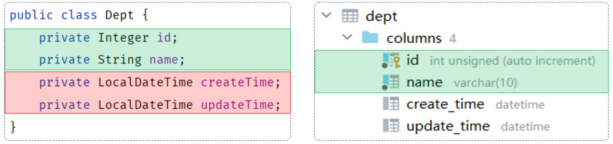

原因如下：
* 实体类属性名和数据库表查询返回的字段名一致，MyBatis 会自动封装。
* 如果实体类属性名和数据库表查询返回的字段名不一致，不能自动封装。

解决方案：
* 手动结果映射。
* 起别名。
* 开启驼峰命名。

##### 2.1.6.1 手动结果映射

在 DeptMapper 接口方法上，通过 `@Results` 及 `@Result` 进行手动结果映射。

示例代码：
```java
/* mapper/DeptMapper.java */

package com.anxin_hitsz.mapper;

import com.anxin_hitsz.pojo.Dept;
import org.apache.ibatis.annotations.Mapper;
import org.apache.ibatis.annotations.Result;
import org.apache.ibatis.annotations.Results;
import org.apache.ibatis.annotations.Select;

import java.util.List;

/**
 * ClassName: DeptMapper
 * Package: com.anxin_hitsz.mapper
 * Description:
 *
 * @Author AnXin
 * @Create 2026/3/8 13:21
 * @Version 1.0
 */
@Mapper
public interface DeptMapper {
    /**
     * 查询所有部门数据
     */
    // 方式一：手动结果映射
    @Results({
            @Result(column = "create_time", property = "createTime"),
            @Result(column = "update_time", property = "updateTime")
    })
    @Select("select id, name, create_time, update_time from dept order by update_time desc")
    List<Dept> findAll();
}

```

说明：
* `@Results` 注解源码：
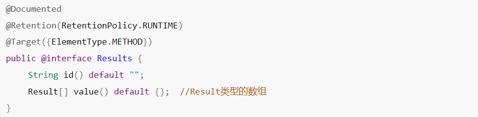
* `@Result` 注解源码：
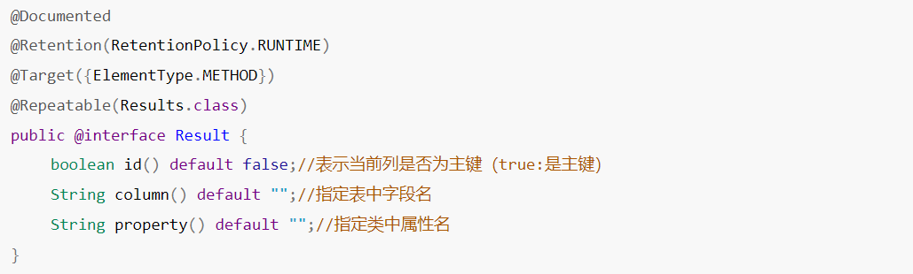

##### 2.1.6.2 起别名

在 SQL 语句中，对不一样的列名起别名，别名和实体类属性名一样。

示例代码：
```java
package com.anxin_hitsz.mapper;

import com.anxin_hitsz.pojo.Dept;
import org.apache.ibatis.annotations.Mapper;
import org.apache.ibatis.annotations.Result;
import org.apache.ibatis.annotations.Results;
import org.apache.ibatis.annotations.Select;

import java.util.List;

/**
 * ClassName: DeptMapper
 * Package: com.anxin_hitsz.mapper
 * Description:
 *
 * @Author AnXin
 * @Create 2026/3/8 13:21
 * @Version 1.0
 */
@Mapper
public interface DeptMapper {
    /**
     * 查询所有部门数据
     */
    // 方式一：手动结果映射
//    @Results({
//            @Result(column = "create_time", property = "createTime"),
//            @Result(column = "update_time", property = "updateTime")
//    })
//    @Select("select id, name, create_time, update_time from dept order by update_time desc")
//    List<Dept> findAll();

    // 方式二：起别名
    @Select("select id, name, create_time createTime, update_time updateTime from dept order by update_time desc")
    List<Dept> findAll();
}

```

#####  2.1.6.3 开启驼峰命名（推荐）

如果字段名与属性名符合驼峰命名规则，MyBatis 会自动通过驼峰命名规则映射。

驼峰命名规则：`abc_xyz` -> `abcXyz`。
* 表中字段名：`abc_xyz`。
* 类中属性名：`abcXyz`。

在 application.yml 中做如下配置，开启开关：
```yaml
mybatis:
  configuration:
    # 开启驼峰命名映射开关
    map-underscore-to-camel-case: true
```

> 注意：
>
> 要使用驼峰命名，前提是 **实体类的属性** 与 **数据库表中的字段名** 严格遵守驼峰命名。

示例代码：
```java
/* mapper/DeptMapper.java */

package com.anxin_hitsz.mapper;

import com.anxin_hitsz.pojo.Dept;
import org.apache.ibatis.annotations.Mapper;
import org.apache.ibatis.annotations.Result;
import org.apache.ibatis.annotations.Results;
import org.apache.ibatis.annotations.Select;

import java.util.List;

/**
 * ClassName: DeptMapper
 * Package: com.anxin_hitsz.mapper
 * Description:
 *
 * @Author AnXin
 * @Create 2026/3/8 13:21
 * @Version 1.0
 */
@Mapper
public interface DeptMapper {
    /**
     * 查询所有部门数据
     */
    // 方式一：手动结果映射
//    @Results({
//            @Result(column = "create_time", property = "createTime"),
//            @Result(column = "update_time", property = "updateTime")
//    })
//    @Select("select id, name, create_time, update_time from dept order by update_time desc")
//    List<Dept> findAll();

    // 方式二：起别名
//    @Select("select id, name, create_time createTime, update_time updateTime from dept order by update_time desc")
//    List<Dept> findAll();

    // 方式三：开启驼峰命名
    @Select("select id, name, create_time, update_time from dept order by update_time desc")
    List<Dept> findAll();
}

```

### 2.2 前后端联调

#### 2.2.1 联调测试

完成了查询部门的功能，我们也通过 Apifox 工具测试通过了。下面我们再基于前后端分离的方式进行接口联调。

具体操作如下：
1. 下载并安装 Nginx。
2. 双击 nginx.exe，启动 Nginx。
3. 打开浏览器，访问 http://localhost:90。

#### 2.2.2 请求访问流程

前端工程请求服务器的地址为 `http://localhost:90/api/depts`，是如何访问到后端的 Tomcat 服务器的？

其实这里，是通过前端服务 Nginx 中提供的 **反向代理** 功能实现的。

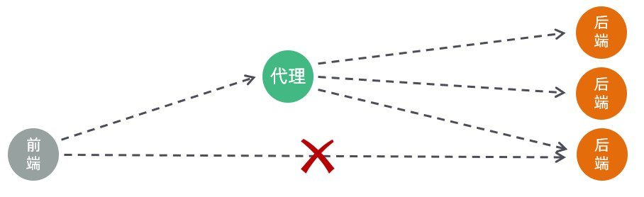

具体过程：
1. 浏览器发起请求，请求的是 localhost:90，那么其实请求的是 Nginx 服务器。
2. 在 Nginx 服务器中并没有对请求直接进行处理，而是将请求转发给了后端的 Tomcat 服务器，最终由 Tomcat 服务器来处理该请求。

这个过程就是通过 Nginx 的反向代理实现的。那为什么浏览器不直接请求后端的 Tomcat 服务器，而是直接请求 Nginx 服务器呢？主要有以下几点原因：
* 安全：由于后端的 Tomcat 服务器一般都会搭建集群，会有很多的服务器，把所有的 Tomcat 暴露给前端，让前端直接请求 Tomcat，对于后端服务器是比较危险的。
* 灵活：基于 Nginx 的反向代理实现更加灵活，后端想增加、减少服务器，对于前端来说是无感知的，只需要在 Nginx 中配置即可。
* 负载均衡：基于 Nginx 的反向代理，可以很方便地实现后端 Tomcat 地负载均衡操作。

具体的请问访问流程如下：
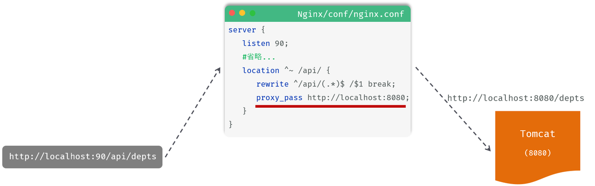
> 注意：
> * `location`：用于定义匹配特定 uri 请求的规则。
> * `^~ /api/`：表示精确匹配，即只匹配以 `/api/` 开头的路径。
> * `rewrite`：该指令用于重写匹配到的 uri 路径。
> * `proxy_pass`：该指令用于代理转发，将匹配到的请求转发给位于后端的指令服务器。

## 三、删除部门

### 3.1 需求

删除部门数据：在点击“删除”按钮之后，会根据 ID 删除部门数据。

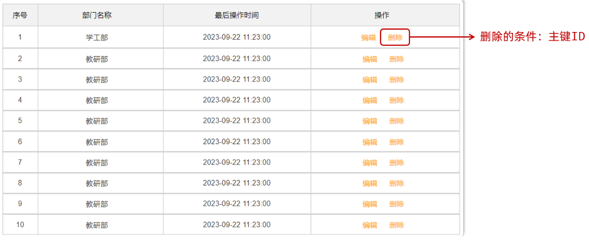

了解了需求之后，我们再去查看接口文档中关于删除部门的接口的描述，然后根据接口文档进行服务端接口的开发。

### 3.2 接口描述

参照接口文档。

### 3.3 思路分析

明确了删除部门的需求之后，再来梳理一下实现该功能时，三层架构每一层的职责：
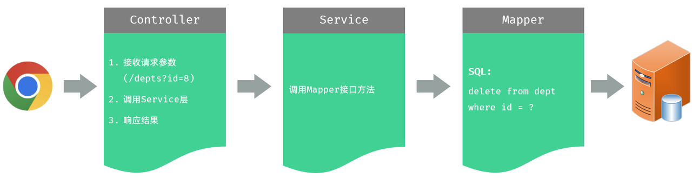

### 3.4 简单参数接收

在服务器端的 Controller 程序中获取前端传递的简单的请求参数，具体的方案有如下三种：

1). 方案一：通过原始的 `HttpServletRequest` 对象获取请求参数

```java
/**
 * 根据 ID 删除部门 - 简单参数接收：方式一（HttpServletRequest 获取请求参数）
 */
@DeleteMapping("/depts")
public Result delete(HttpServletRequest request) {
    String idStr = request.getParameter("id");
    int id = Integer.parseInt(idStr);

    System.out.println("根据 ID 删除部门：" + id);
    return Result.success();
}
```

这种方案实现较为繁琐，而且还需要进行手动类型转换。（**项目开发很少使用！**）

2). 方案二：通过 Spring 提供的 `@RequestParam` 注解，将请求参数绑定给方法形参

```java
/**
 * 根据 ID 删除部门 - 简单参数接收：方式二（通过 @RequestParam 注解获取请求参数）
 * 注意事项：一旦声明了 @RequestParam，该参数在请求时必须传递，如果不传递将会报错（默认 required 为 true）
 */
@DeleteMapping("/depts")
public Result delete(@RequestParam("id") Integer deptId) {
    System.out.println("根据 ID 删除部门：" + deptId);
    return Result.success();
}
```

`@RequestParam` 注解的 `value` 属性，需要与前端传递的参数名保持一致。

> 注意：
>
> `@RequestParam` 注解 `required` 属性默认为 `true`，代表该参数必须传递，如果不传递将报错。如果参数可选，可以将属性设置为 `false`。
>
> 示例代码：
> ```java
> /**
>  * 根据 ID 删除部门 - 简单参数接收：方式二（通过 @RequestParam 注解获取请求参数）
>  * 注意事项：一旦声明了 @RequestParam，该参数在请求时必须传递，如果不传递将会报错（默认 required 为 true）
>  */
> @DeleteMapping("/depts")
> public Result delete(@RequestParam(value = "id", required = false) Integer deptId) {
>     System.out.println("根据 ID 删除部门：" + deptId);
>     return Result.success();
> }
> ```
>
> 因此，一旦声明了 `@RequestParam`，该参数在请求时必须传递，如果不传递将会报错（默认 `required` 为 `true`）。

3). 方案三：如果请求参数名与形参变量名相同，直接定义方法形参即可接收（省略 `@RequestParam`）

```java
/**
 * 根据 ID 删除部门 - 简单参数接收：方式三（省略 @RequestParam - 前端传递的请求参数名与服务端方法形参名一致）
 */
@DeleteMapping("/depts")
public Result delete(Integer id) {
    System.out.println("根据 ID 删除部门：" + id);
    return Result.success();
}
```

对于以上的这三种方案，我们**推荐第三种方案**。

### 3.5 代码实现

#### 3.5.1 Controller 层

示例代码：
```java
/* controller/DeptController.java */

package com.anxin_hitsz.controller;

import com.anxin_hitsz.pojo.Dept;
import com.anxin_hitsz.pojo.Result;
import com.anxin_hitsz.service.DeptService;
import jakarta.servlet.http.HttpServletRequest;
import org.springframework.beans.factory.annotation.Autowired;
import org.springframework.stereotype.Controller;
import org.springframework.web.bind.annotation.*;

import java.util.List;

/**
 * ClassName: DeptController
 * Package: com.anxin_hitsz.controller
 * Description:
 *
 * @Author AnXin
 * @Create 2026/3/8 13:23
 * @Version 1.0
 */
@RestController
public class DeptController {

    @Autowired
    private DeptService deptService;

    /**
     * 查询部门列表
     */
//    @RequestMapping(value = "/depts", method = RequestMethod.GET) // method：指定请求方式
    @GetMapping("/depts")
    public Result list() {
        System.out.println("查询全部部门数据");
        List<Dept> deptList = deptService.findAll();
        return Result.success(deptList);
    }

    /**
     * 根据 ID 删除部门 - 简单参数接收：方式一（HttpServletRequest 获取请求参数）
     */
//    @DeleteMapping("/depts")
//    public Result delete(HttpServletRequest request) {
//        String idStr = request.getParameter("id");
//        int id = Integer.parseInt(idStr);
//
//        System.out.println("根据 ID 删除部门：" + id);
//        return Result.success();
//    }

    /**
     * 根据 ID 删除部门 - 简单参数接收：方式二（通过 @RequestParam 注解获取请求参数）
     * 注意事项：一旦声明了 @RequestParam，该参数在请求时必须传递，如果不传递将会报错（默认 required 为 true）
     */
//    @DeleteMapping("/depts")
//    public Result delete(@RequestParam(value = "id", required = false) Integer deptId) {
//        System.out.println("根据 ID 删除部门：" + deptId);
//        return Result.success();
//    }

    /**
     * 根据 ID 删除部门 - 简单参数接收：方式三（省略 @RequestParam - 前端传递的请求参数名与服务端方法形参名一致）
     */
    @DeleteMapping("/depts")
    public Result delete(Integer id) {
        System.out.println("根据 ID 删除部门：" + id);
        deptService.deleteById(id);
        return Result.success();
    }

}

```

#### 3.5.2 Service 层

示例代码：
```java
/* service/DeptService.java */

package com.anxin_hitsz.service;

import com.anxin_hitsz.pojo.Dept;

import java.util.List;

/**
 * ClassName: DeptService
 * Package: com.anxin_hitsz.service
 * Description:
 *
 * @Author AnXin
 * @Create 2026/3/8 13:22
 * @Version 1.0
 */
public interface DeptService {
    /**
     * 查询所有部门
     */
    List<Dept> findAll();

    /**
     * 根据 ID 删除部门
     */
    void deleteById(Integer id);
}


/* service/impl/DeptServiceImpl.java */

package com.anxin_hitsz.service.impl;

import com.anxin_hitsz.mapper.DeptMapper;
import com.anxin_hitsz.pojo.Dept;
import com.anxin_hitsz.service.DeptService;
import org.springframework.beans.factory.annotation.Autowired;
import org.springframework.stereotype.Service;

import java.util.List;

/**
 * ClassName: DeptServiceImpl
 * Package: com.anxin_hitsz.service.impl
 * Description:
 *
 * @Author AnXin
 * @Create 2026/3/8 13:22
 * @Version 1.0
 */
@Service
public class DeptServiceImpl implements DeptService {

    @Autowired
    private DeptMapper deptMapper;

    @Override
    public List<Dept> findAll() {
        return deptMapper.findAll();
    }

    @Override
    public void deleteById(Integer id) {
        deptMapper.deleteById(id);
    }
}

```

#### 3.5.3 Mapper 层

示例代码：
```java
/* mapper/DeptMapper.java */

package com.anxin_hitsz.mapper;

import com.anxin_hitsz.pojo.Dept;
import org.apache.ibatis.annotations.*;
import org.springframework.web.bind.annotation.DeleteMapping;

import java.util.List;

/**
 * ClassName: DeptMapper
 * Package: com.anxin_hitsz.mapper
 * Description:
 *
 * @Author AnXin
 * @Create 2026/3/8 13:21
 * @Version 1.0
 */
@Mapper
public interface DeptMapper {
    /**
     * 查询所有部门数据
     */
    // 方式一：手动结果映射
//    @Results({
//            @Result(column = "create_time", property = "createTime"),
//            @Result(column = "update_time", property = "updateTime")
//    })
//    @Select("select id, name, create_time, update_time from dept order by update_time desc")
//    List<Dept> findAll();

    // 方式二：起别名
//    @Select("select id, name, create_time createTime, update_time updateTime from dept order by update_time desc")
//    List<Dept> findAll();

    // 方式三：开启驼峰命名
    @Select("select id, name, create_time, update_time from dept order by update_time desc")
    List<Dept> findAll();

    /**
     * 根据 ID 删除部门
     */
    @Delete("delete from dept where id = #{id}")
    void deleteById(Integer id);
}

```

如果 Mapper 接口方法形参只有一个普通类型的参数，`#{...}` 里面的属性名可以随意编写，例如：`#{id}`、`#{value}`。

对于 DML 语句来说，执行完毕也是有返回值的，返回值代表的是增删改操作影响的记录数，所以可以将执行 DML 语句的方法返回值设置为 `Integer`。但是一般开发时，是不需要这个返回值的，所以也可以设置为 `void`。

代码编写完毕之后，我们就可以启动服务，进行测试了。

## 四、新增部门

### 4.1 需求

点击“新增部门”的按钮之后，弹出新增部门表单，填写部门名称之后，点击确定即可保存部门数据。

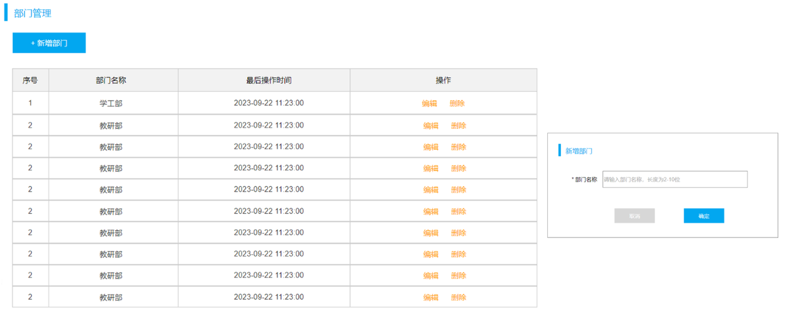

了解了需求之后，我们再去查看接口文档中关于新增部门的接口的描述，然后根据接口文档进行服务端接口的开发。

### 4.2 接口描述

参照接口文档。

### 4.3 思路分析

明确了新增部门的需求之后，再来梳理一下实现该功能时三层架构每一层的职责：
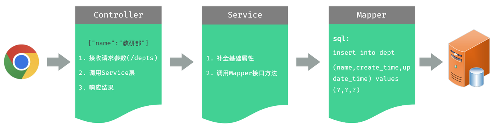

### 4.4 JSON 参数接收

以下讲解：在服务器端的 Controller 程序中，如何获取 JSON 格式的参数。

JSON 格式的参数，通常会使用一个实体对象进行接收。
* 规则：JSON 数据的键名与方法形参对象的属性名相同，并需要使用 `@RequestBody` 注解标识。

前端传递的请求参数格式为 JSON，内容如下：
```json
{
    "name":"教研部"
}
```

这里，我们可以通过一个对象来接收，只需要保证对象中有 `name` 属性即可：
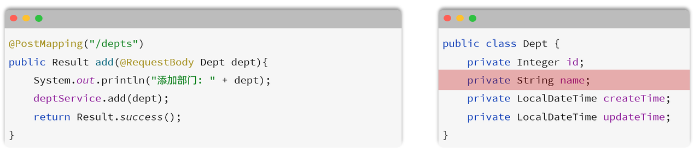

### 4.5 代码实现

#### 4.5.1 Controller 层

示例代码：
```java
/* controller/DeptController.java */

package com.anxin_hitsz.controller;

import com.anxin_hitsz.pojo.Dept;
import com.anxin_hitsz.pojo.Result;
import com.anxin_hitsz.service.DeptService;
import jakarta.servlet.http.HttpServletRequest;
import org.springframework.beans.factory.annotation.Autowired;
import org.springframework.stereotype.Controller;
import org.springframework.web.bind.annotation.*;

import java.util.List;

/**
 * ClassName: DeptController
 * Package: com.anxin_hitsz.controller
 * Description:
 *
 * @Author AnXin
 * @Create 2026/3/8 13:23
 * @Version 1.0
 */
@RestController
public class DeptController {

    @Autowired
    private DeptService deptService;

    /**
     * 查询部门列表
     */
//    @RequestMapping(value = "/depts", method = RequestMethod.GET) // method：指定请求方式
    @GetMapping("/depts")
    public Result list() {
        System.out.println("查询全部部门数据");
        List<Dept> deptList = deptService.findAll();
        return Result.success(deptList);
    }

    /**
     * 根据 ID 删除部门 - 简单参数接收：方式一（HttpServletRequest 获取请求参数）
     */
//    @DeleteMapping("/depts")
//    public Result delete(HttpServletRequest request) {
//        String idStr = request.getParameter("id");
//        int id = Integer.parseInt(idStr);
//
//        System.out.println("根据 ID 删除部门：" + id);
//        return Result.success();
//    }

    /**
     * 根据 ID 删除部门 - 简单参数接收：方式二（通过 @RequestParam 注解获取请求参数）
     * 注意事项：一旦声明了 @RequestParam，该参数在请求时必须传递，如果不传递将会报错（默认 required 为 true）
     */
//    @DeleteMapping("/depts")
//    public Result delete(@RequestParam(value = "id", required = false) Integer deptId) {
//        System.out.println("根据 ID 删除部门：" + deptId);
//        return Result.success();
//    }

    /**
     * 根据 ID 删除部门 - 简单参数接收：方式三（省略 @RequestParam - 前端传递的请求参数名与服务端方法形参名一致）
     */
    @DeleteMapping("/depts")
    public Result delete(Integer id) {
        System.out.println("根据 ID 删除部门：" + id);
        deptService.deleteById(id);
        return Result.success();
    }

    /**
     * 新增部门
     */
    @PostMapping("/depts")
    public Result add(@RequestBody Dept dept) {
        System.out.println("新增部门：" + dept);
        deptService.add(dept);
        return Result.success();
    }

}

```

#### 4.5.2 Service 层

示例代码：
```java
/* controller/DeptController.java */

package com.anxin_hitsz.service;

import com.anxin_hitsz.pojo.Dept;

import java.util.List;

/**
 * ClassName: DeptService
 * Package: com.anxin_hitsz.service
 * Description:
 *
 * @Author AnXin
 * @Create 2026/3/8 13:22
 * @Version 1.0
 */
public interface DeptService {
    /**
     * 查询所有部门
     */
    List<Dept> findAll();

    /**
     * 根据 ID 删除部门
     */
    void deleteById(Integer id);

    /**
     * 新增部门
     */
    void add(Dept dept);
}


/* service/impl/DeptServiceImpl.java */

package com.anxin_hitsz.service.impl;

import com.anxin_hitsz.mapper.DeptMapper;
import com.anxin_hitsz.pojo.Dept;
import com.anxin_hitsz.service.DeptService;
import org.springframework.beans.factory.annotation.Autowired;
import org.springframework.stereotype.Service;

import java.time.LocalDateTime;
import java.util.List;

/**
 * ClassName: DeptServiceImpl
 * Package: com.anxin_hitsz.service.impl
 * Description:
 *
 * @Author AnXin
 * @Create 2026/3/8 13:22
 * @Version 1.0
 */
@Service
public class DeptServiceImpl implements DeptService {

    @Autowired
    private DeptMapper deptMapper;

    @Override
    public List<Dept> findAll() {
        return deptMapper.findAll();
    }

    @Override
    public void deleteById(Integer id) {
        deptMapper.deleteById(id);
    }

    @Override
    public void add(Dept dept) {
        // 1. 补全基础属性 - createTime、updateTime
        dept.setCreateTime(LocalDateTime.now());
        dept.setUpdateTime(LocalDateTime.now());

        // 2. 调用 Mapper 接口方法插入数据
        deptMapper.insert(dept);
    }
}

```

#### 4.5.3 Mapper 层

示例代码：
```java
/* mapper/DeptMapper.java */

package com.anxin_hitsz.mapper;

import com.anxin_hitsz.pojo.Dept;
import org.apache.ibatis.annotations.*;
import org.springframework.web.bind.annotation.DeleteMapping;

import java.util.List;

/**
 * ClassName: DeptMapper
 * Package: com.anxin_hitsz.mapper
 * Description:
 *
 * @Author AnXin
 * @Create 2026/3/8 13:21
 * @Version 1.0
 */
@Mapper
public interface DeptMapper {
    /**
     * 查询所有部门数据
     */
    // 方式一：手动结果映射
//    @Results({
//            @Result(column = "create_time", property = "createTime"),
//            @Result(column = "update_time", property = "updateTime")
//    })
//    @Select("select id, name, create_time, update_time from dept order by update_time desc")
//    List<Dept> findAll();

    // 方式二：起别名
//    @Select("select id, name, create_time createTime, update_time updateTime from dept order by update_time desc")
//    List<Dept> findAll();

    // 方式三：开启驼峰命名
    @Select("select id, name, create_time, update_time from dept order by update_time desc")
    List<Dept> findAll();

    /**
     * 根据 ID 删除部门
     */
    @Delete("delete from dept where id = #{id}")
    void deleteById(Integer id);

    /**
     * 新增部门
     */
    @Insert("insert into dept (name, create_time, update_time) values (#{name}, #{createTime}, #{updateTime})")
    void insert(Dept dept);
}

```

如果在 Mapper 接口中，需要传递多个参数，可以把多个参数封装到一个对象中。在 SQL 语句中获取参数的时候，`#{...}` 里面写的是对象的属性名（**注意是属性名，而不是表的字段名**）。

代码编写完毕之后，我们就可以启动服务，进行测试了。

## 五、修改部门