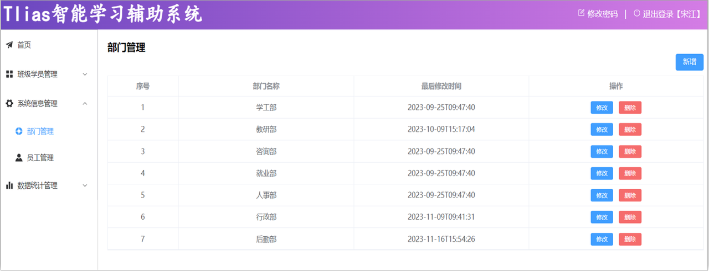
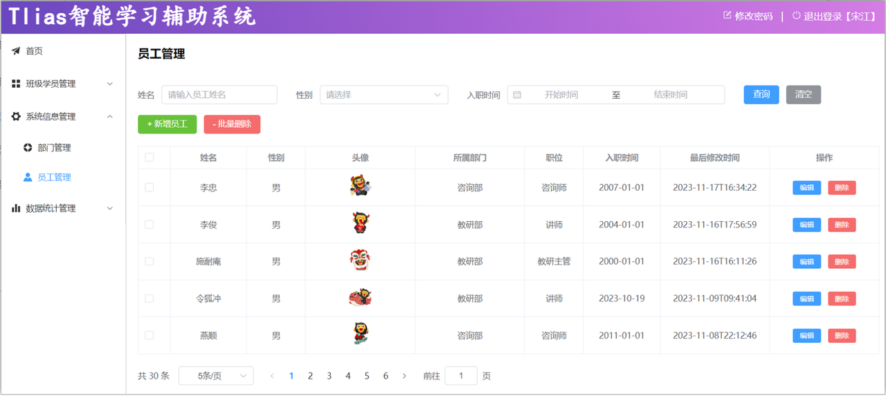
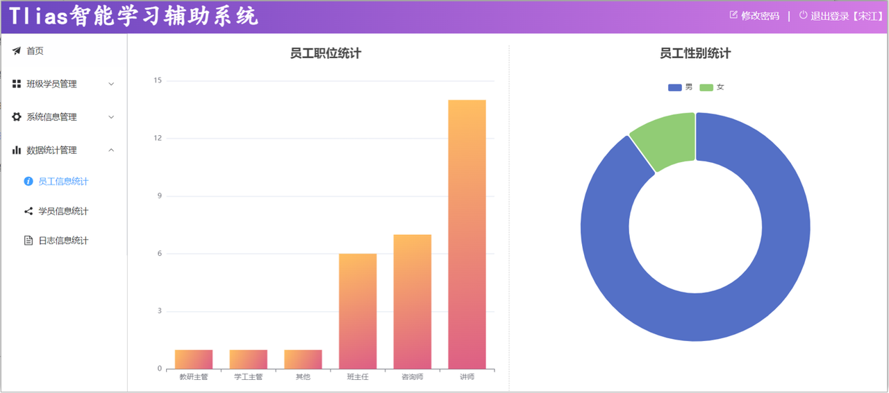
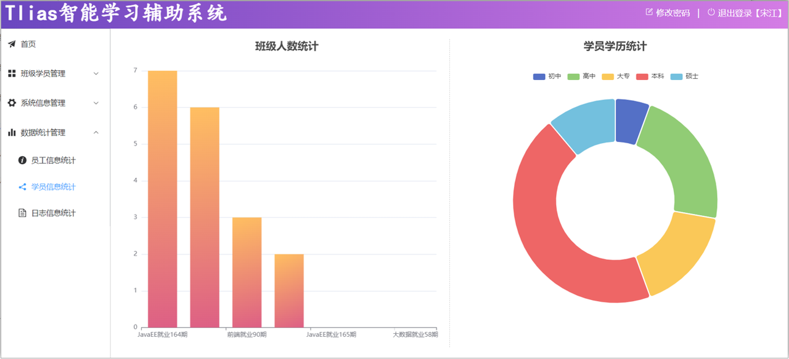
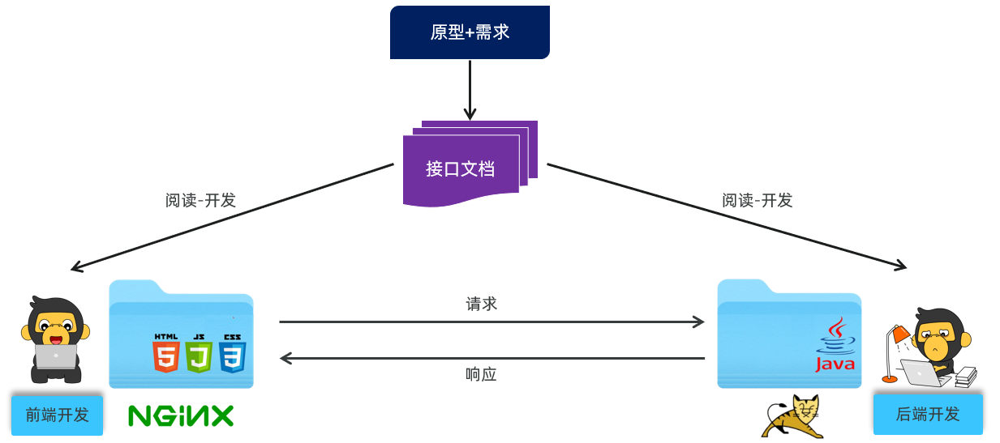
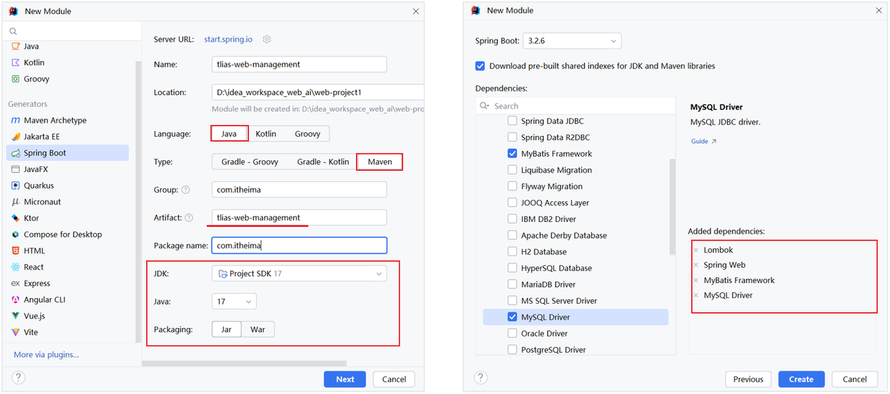
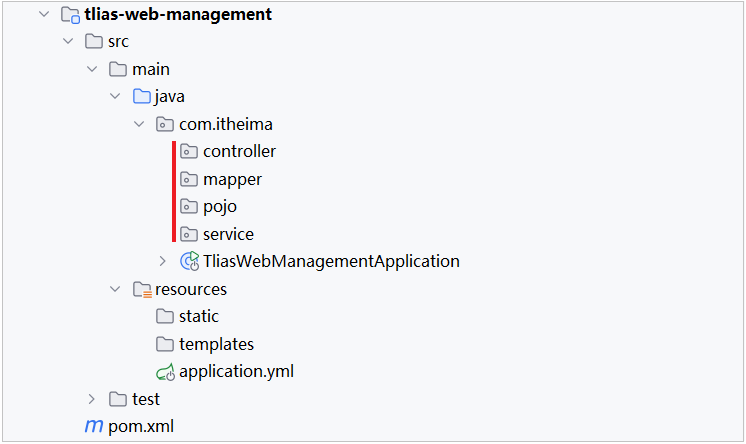
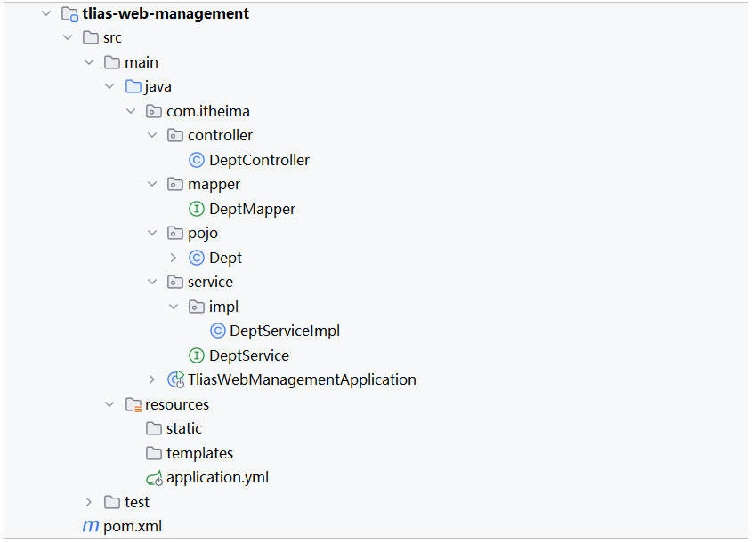
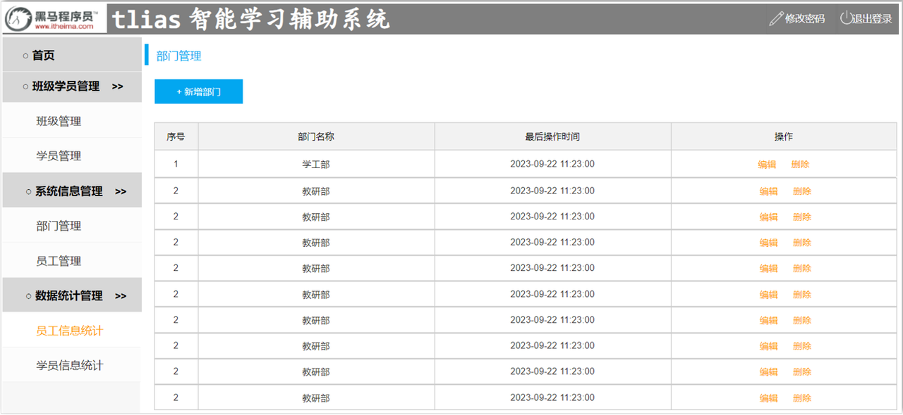

# 第七章：后端 Web 实战（部门管理）

**目录：**

[TOC]

---

本章及之后，要完成一个大的综合案例：Tlias 智能学习辅助系统。

该案例中包含以下功能：

1). 部门管理



2). 员工管理



3). 员工信息统计



4). 学员信息统计



5). 班级、学员管理

> 注意：
>
> 在整个实战篇中，我们需要完成如下内容：
> * 部门管理：查询、新增、修改、删除。
> * 员工管理：
>   * 查询、新增、修改、删除。
>   * 文件上传。
> * 报表管理。
> * 登录认证。
> * 日志管理。
> * 班级管理。
> * 学员管理。

本章，我们先来完成第一个模块：部门管理。

## 一、准备工作

### 1.1 开发规范

#### 1.1.1 前后端分离开发

现在的企业项目开发有 2 种开发模式：**前后台混合开发**和**前后台分离开发**。

目前基本都是采用前后台分离开发方式，如下图所示：


在前后台分离开发方式中，前后台需要统一制定一套规范，前后台开发人员都需要遵循这套规范开发，这就是**接口文档**。

接口文档的内容是后台开发者根据产品经理提供的产品原型和需求文档所撰写出来的。

基于前后台分离开发的模式，后台开发者开发一个功能的具体流程如下图所示：


#### 1.1.2 Restful 风格

案例基于当前最为主流的前后端分离模式进行开发。


在前后端进行交互的时候，我们需要基于当前主流的 REST 风格的 API 接口进行交互。

**REST**（**Re**presentational **S**tate **T**ransfer）：表述性状态转换，是一种软件架构风格。

基于 REST 风格的 URL 如下：
* `http://localhost:8080/users/1`：GET - 查询 `id` 为 `1` 的用户。
* `http://localhost:8080/users`：POST - 新增用户。
* `http://localhost:8080/users`：PUT - 修改用户。
* `http://localhost:8080/users/1`：DELETE - 删除 `id` 为 `1` 的用户。

REST 风格 - 总结：通过 URL 定位要操作的资源，通过 HTTP 动词（请求方式）来描述具体的操作。

在 REST 风格的 URL 中，通过四种请求方式，来操作数据的增删改查：
* GET：查询。
* POST：新增。
* PUT：修改。
* DELETE：删除。

> 注意：
> * REST 是风格，是约定方式，约定不是规定，可以打破。
> * 描述模块的功能通常使用复数，也就是加 `s` 的格式来描述，表示此类资源，而非单个资源；例如：`users`、`emps`、`books` ……

#### 1.1.3 Apifox

后端开发对接口进行请求测试、前端开发对数据的获取及测试页面的渲染展示，我们可以借助一些接口测试工具（例如：Postman、Apipost、Apifox）等来完成。

我们采用功能更为强大的 Apifox 工具。

Apifox 是一款集成了 API 文档、API 调试、API Mock、API 测试的一体化协作平台。
* 作用：接口文档管理、接口请求测试、Mock 服务。

Apifox 官网：[Apifox 官网](https://apifox.com/ "Apifox 官网")。

### 1.2 工程搭建

1). 创建 SpringBoot 工程，并引入 Web 开发起步依赖、MyBatis、MySQL 驱动、Lombok。

创建项目：


2). 创建数据库及对应的表结构，并在 application.yml 中配置数据库的基本信息

创建 tlias 数据库，并准备 dept 部门表：
```sql
CREATE TABLE dept (
  id int unsigned PRIMARY KEY AUTO_INCREMENT COMMENT 'ID, 主键',
  name varchar(10) NOT NULL UNIQUE COMMENT '部门名称',
  create_time datetime DEFAULT NULL COMMENT '创建时间',
  update_time datetime DEFAULT NULL COMMENT '修改时间'
) COMMENT '部门表';

INSERT INTO dept VALUES (1,'学工部','2023-09-25 09:47:40','2024-07-25 09:47:40'),
                      (2,'教研部','2023-09-25 09:47:40','2024-08-09 15:17:04'),
                      (3,'咨询部','2023-09-25 09:47:40','2024-07-30 21:26:24'),
                      (4,'就业部','2023-09-25 09:47:40','2024-07-25 09:47:40'),
                      (5,'人事部','2023-09-25 09:47:40','2024-07-25 09:47:40'),
                      (6,'行政部','2023-11-30 20:56:37','2024-07-30 20:56:37');
```

在 application.yml 配置文件中配置数据库的连接信息：
```yaml
spring:
  application:
    name: tlias-web-management
  # MySQL 连接配置
  datasource:
    driver-class-name: com.mysql.cj.jdbc.Driver
    url: jdbc:mysql://localhost:3306/tlias
    username: root
    password: 1234
mybatis:
  configuration:
    log-impl: org.apache.ibatis.logging.stdout.StdOutImpl
```

3). 准备基础包结构，并引入实体类 `Dept` 及统一的响应结果封装类 `Result`

准备基础包结构：


在 pojo 中编写实体类 `Dept` 及统一的响应结果封装类 `Result`：
* 实体类 `Dept`：
```java

```
* 统一响应结果 `Result`：
```java

```

4). 填充项目代码

基础代码结构：


* `DeptMapper`：
```java

```
* `DeptService`：
```java

```
* `DeptServiceImpl`：
```java

```
* `DeptController`：
```java

```

## 二、查询部门

### 2.1 基本实现

#### 2.1.1 需求

查询所有的部门数据，查询出来展示在部门管理的页面中。页面原型效果如下：
