# 第八章：后端 Web 实战（员工管理）

**目录：**

[TOC]

---

实现了部门管理的功能之后，接下来我们再来实现员工管理的功能。

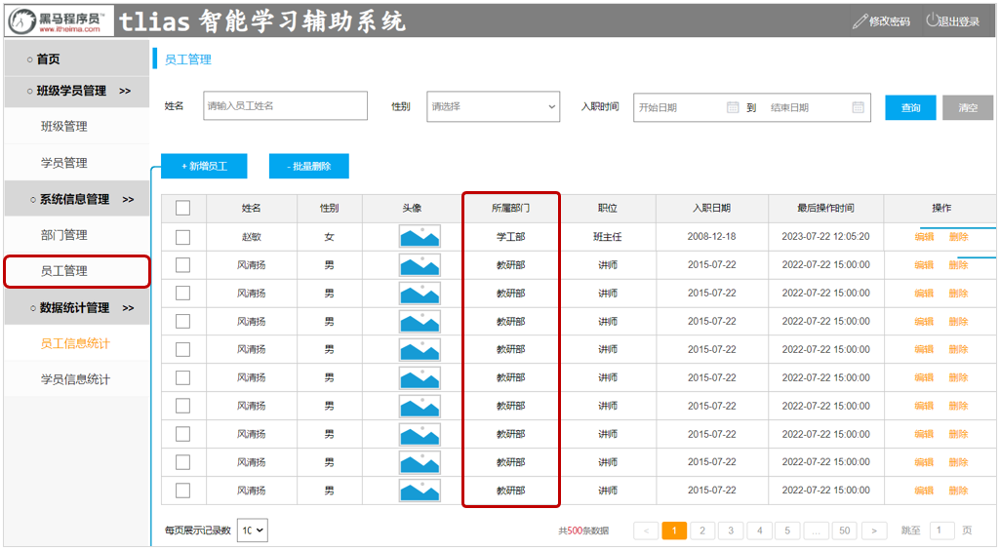

从页面原型中，我们可以看到，在查询员工信息的时候，除了要展示姓名、性别、头像、职位、入职日期、最后操作时间这些员工信息外，还要展示出所属部门。那此时就需要从两张表中查询数据，一张是部门表，一张是员工表；此时就会涉及到多表操作。

## 一、多表关系

由于业务之间相互关联，所以各个表结构之间也存在着各种联系，基本上分为三种：
* 一对多（多对一）。
* 多对多。
* 一对一。

### 1.1 一对多

场景：部门与员工的关系（一个部门下有多个员工）。

部门管理的页面原型：
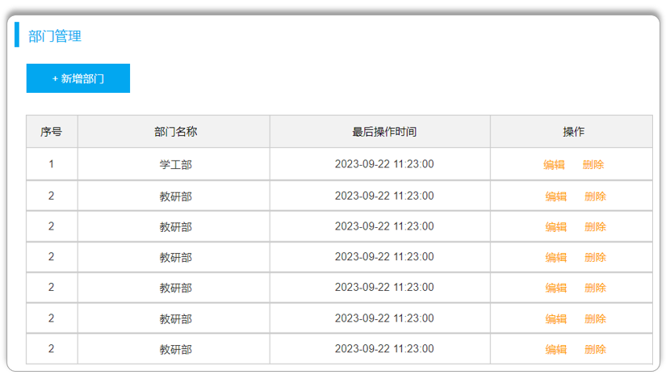

员工管理的页面原型：
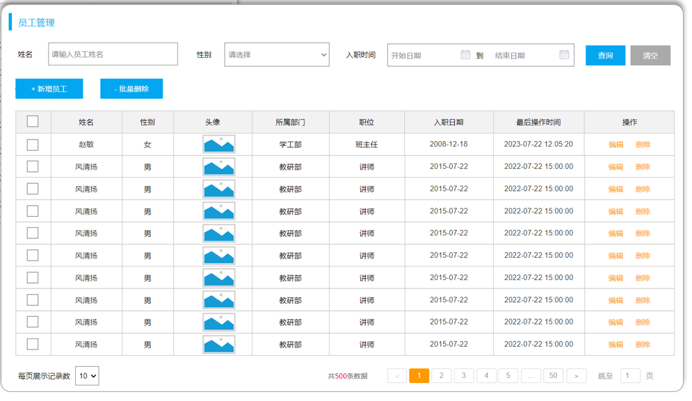

由于一个部门下，会关联多个员工，而一个员工是归属于某一个部门的。那么此时，我们就需要在 emp 表中增加一个字段 `dept_id` `来标识这个员工属于哪一个部门，dept_id` 关联的是 `dept` 的 `id`。如下所示：
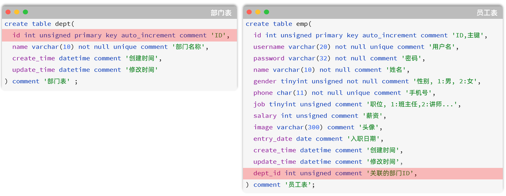

上述的 emp 员工表的 `dept_id` 字段，关联的是 dept 部门表的 `id`。部门表是“一”一方，也称为**父表**；员工表是“多”的一方，称之为**子表**。如下所示：
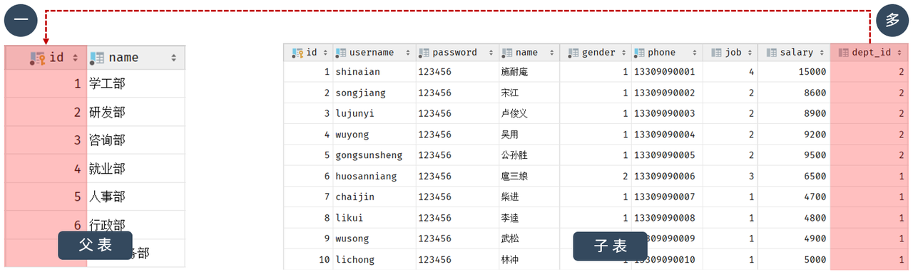

那么接下来，我们就可以将上述的两张表创建出来。

> 注意：
>
> 问题：一对多的表关系，在数据库层面该如何实现？
> * 在数据库表中“多”的一方添加字段，来关联“一”的一方的主键。

### 1.2 多表问题分析

现象：部门数据可以直接删除，然而还有部分员工归属于该部门下，此时就出现了数据的不完整、不一致的问题。

原因：目前上述的两张表，在数据库层面，并未建立关联，所以是无法保证数据的一致性和完整性的。

解决方案：通过数据库中的**外键约束**来解决。
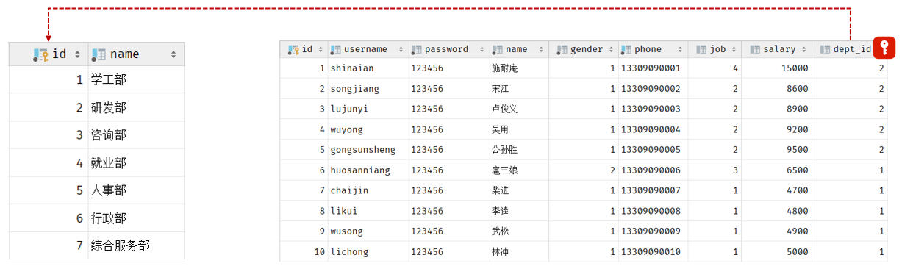

**外键约束：** 让两张表的数据建立连接，保证数据的一致性和完整性。
* 对应的关键字：`foreign key`。

外键约束语法：
```sql
-- 创建表时指定
create_table 表名 (
    字段名 数据类型,
    ...
    [constraint] [外键名称] foreign key (外键字段名) references 主表 (主表列名（字段名）)
);

-- 建完表后，添加外键
alter table 表名 add constraint 外键名称 foreign key (外键字段名) references 主表 (主表列名（字段名）);
```

接下来，我们就为员工表的 `dept_id` 建立外键约束，来关联部门表的主键。
1). 方式一：通过 SQL 语句操作
```sql
-- 修改表：添加外键约束
alter table emp add constraint fk_dept_id foreign key (dept_id) references dept(id);
```
2). 方式二：图形化界面操作
在左侧菜单栏，在 emp 表上右键，选择 Modify Table...：
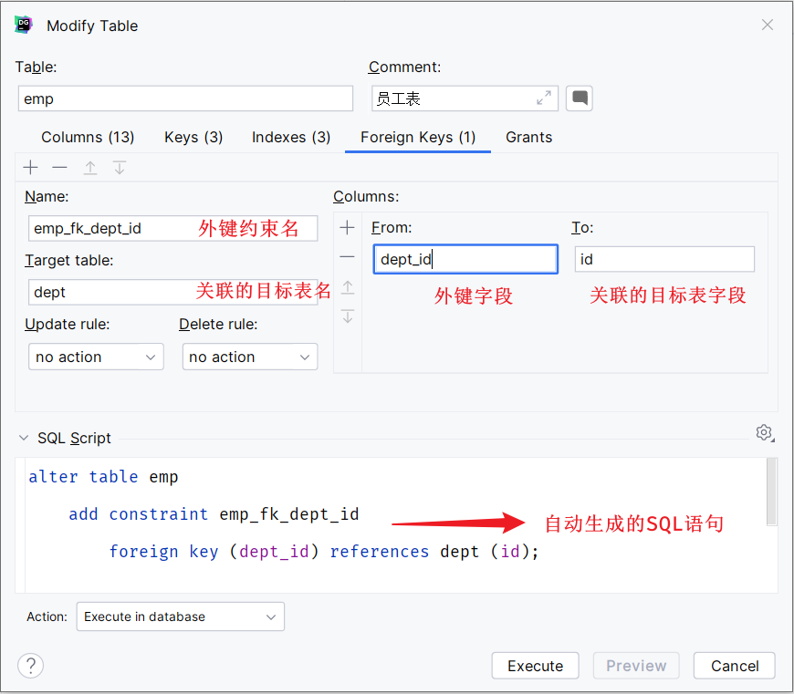

外键约束（foreign key）：保证了数据的完整性和一致性。

> 注意：
>
> 外键命名规范：外键命名一般以 `fk_` 开头。

#### 1.2.3 物理外键与逻辑外键

物理外键：
* 概念：使用 `foreign key` 定义外键关联另外一张表。
* 缺点：
  * 影响增、删、改的效率（需要检查外键关系）。
  * 仅用于单节点数据库，不适用于分布式、集群场景。
  * 容易引发数据库的死锁问题，消耗性能。

逻辑外键：
* 概念：在业务层逻辑中，解决外键关联。
* 功能：通过逻辑外键，就可以很方便地解决上述问题。

> 注意：
>
> 在现在的企业开发中，很少会使用物理外键，都是使用逻辑外键。甚至在一些数据库开发规范中，会明确指出禁止使用物理外键 `foreign key`。

### 1.3 一对一

一对一关系表在实际开发中应用起来比较简单，通常是用来做单表的拆分，也就是将一张大表拆分成两张小表，将大表中的一些基础字段放在一张表当中，将其他的字段放在另外一张表当中，以此来提高数据的操作效率。

一对一的应用场景：用户表（基本信息 + 身份信息）。

如果在业务系统当中，对用户的基本信息查询频率特别高，但是对于用户的身份信息查询频率很低，此时出于提高查询效率的考虑，我们就可以将这张大表拆分成两张小表，第一张表存放的是用户的基本信息，而第二张表存放的就是用户的身份信息。它们两者之间为一对一的关系，即一个用户只能对应一个身份证，而一个身份证也只能关联一个用户。

那么在数据库层面怎么去体现上述两者之间是一对一的关系呢？

其实，一对一我们可以看成一种特殊的一对多。因此，我们同样也可以通过通过外键来体现一对一之间的关系，只需要在任意一方来添加一个外键就可以了，并且设置外键为唯一的（`UNIQUE`）。

> 注意：
>
> 一对一：在任意一方加入外键，关联另外一方的主键，并且设置外键为唯一的（`UNIQUE`）。

### 1.4 多对多

多对多的关系在开发中也是比较常见的。例如：学生和课程的关系，一个学生可以选修多门课程，一门课程也可以供多个学生选修。

实现多对多关系：建立第三张中间表，中间表至少包含两个外键，分别关联两方主键。

> 注意：
>
> 多对多：需要建立一张中间表，中间表中有两个外键字段，分别关联两方的主键。

### 1.5 案例

下面通过一个综合案例加深对于多表关系的理解，并掌握多表设计的流程。

需求：
* 根据页面原型，设计员工管理模块涉及到的表结构。

步骤：
* 阅读页面原型及需求文档，分析各个模块涉及到的表结构，及表结构之间的关系。
* 根据页面原型及需求文档，分析各个表结构中具体的字段及约束。

分析可知，总共会涉及三张表，分别是：部门表、员工表、员工工作经历表。

最终，具体的表结构如下：
```sql
-- MySQL02.sql

-- 多表设计：案例
-- 表：dept(1) -> emp(n)；emp(1) -> emp_expr(n)
create table emp_expr (
    id int unsigned primary key auto_increment comment 'ID，主键',
    begin date comment '开始时间',
    end date comment '结束时间',
    company varchar(50) comment '公司名称',
    job varchar(50) comment '职位',
    emp_id int unsigned comment '关联的员工 ID'
) comment '工作经历表';
```

> 注意：
>
> 在上述的表结构设计中，我们使用的都是逻辑外键。

## 二、多表查询

### 2.1 概述

#### 2.1.1 数据准备

创建数据库，执行 SQL 脚本，此处不再赘述。

#### 2.1.2 介绍

多表查询：查询时从多张表中获取所需数据。
> 单表查询的 SQL 语句：
> ```sql
> select 字段列表 from 表名;
> ```
>
> 多表查询的 SQL 语句：
> ```sql
> select 字段列表 from 表1, 表2;
> ```
>
> 因此，要执行多表查询，只需要使用逗号分隔多张表即可。

查询用户表和部门表中的数据：
```sql
select * from emp, dept;
```

此时，将会列出员工表所有记录与部门表所有记录的所有组合情况，这种现象称之为 **笛卡尔积**。

**笛卡尔积：** 笛卡尔乘积是指在数学中，两个集合（A 集合和 B 集合）的所有组合情况。
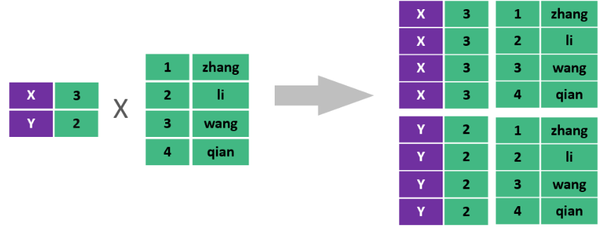

在多表查询时，需要消除无效的笛卡尔积，只保留表关联部分的数据：
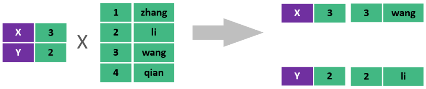

在 SQL 语句中，只需要给多表查询加上连接查询的条件即可去除无效的笛卡尔积：
```sql
select * from emp, dept where emp.dept_id = dept.id;
```

#### 2.1.3 分类

多表查询可以分为：

* 连接查询：
  * 内连接：基于“连接条件”匹配行（**并不是集合意义上的“交集”**）。
  * 外连接：
    * 左外连接：查询左表所有数据（包括两张表交集部分数据）。
    * 右外连接：查询右表所有数据（包括两张表交集部分数据）。
* 子查询。

### 2.2 内连接

内连接查询：基于“连接条件”匹配行，查询两表或多表中交集部分数据。

内连接从语法上可以分为：
* 隐式内连接。
* 显式内连接。

隐式内连接语法格式：
```sql
select 字段列表 from 表1, 表2 where 连接条件 ...;
```

显式内连接语法格式：
```sql
select 字段列表 from 表1 [inner] join 表2 on 连接条件 ...;
```

> 注意：
>
> 在多表联查时，我们指定字段时，需要在字段名前面加上表名，来指定具体是哪一张表的字段；例如：`emp.dept_id`。

给表起别名简化书写：
```sql
select 字段列表 from 表1 [as] 别名1, 表2 [as] 别名2 where 条件 ...;

select 字段列表 from 表1 别名1, 表2 别名2 where 条件 ...;   -- as 可以省略
```

> 注意：
>
> 一旦为表起了别名，就不能再使用表名来指定对应的字段了，此时只能够使用别名来指定字段。

示例代码：
```sql
-- MySQL03.sql

-- ============================= 内连接 =============================
-- A. 查询所有员工的 ID、姓名及所属的部门名称（隐式、显式内连接实现）
-- 隐式
select emp.id, emp.name, dept.name from emp, dept where emp.dept_id = dept.id;

-- 显式
select emp.id, emp.name, dept.name from emp inner join dept on emp.dept_id = dept.id;

-- 显式（inner 关键字可以省略）
select emp.id, emp.name, dept.name from emp join dept on emp.dept_id = dept.id;


-- B. 查询性别为男且工资高于 8000 的员工的 ID、姓名及所属的部门名称（隐式、显式内连接实现）
-- 隐式
select emp.id, emp.name, dept.name from emp, dept where emp.dept_id = dept.id and emp.gender = 1 and emp.salary > 8000;

-- 显式
select emp.id, emp.name, dept.name from emp join dept on emp.dept_id = dept.id where emp.gender = 1 and emp.salary > 8000;

-- 为表起别名
select e.id, e.name, d.name from emp e join dept d on e.dept_id = d.id where e.gender = 1 and e.salary > 8000;
```

### 2.3 外连接

外连接分为两种：左外连接和右外连接。

左外连接语法格式：
```sql
-- 左外连接：以 left join 关键字左边的表为主表，查询主表中所有数据，以及和主表匹配的右边表中的数据
select 字段列表 from 表1 left [outer] join 表2 on 连接条件 ...;
```
* 左外连接相当于查询表 1（左表）的所有数据，当然也包含表 1 和表 2 交集部分的数据。

右外连接语法格式：
```sql
-- 右外连接：以 right join 关键字右边的表为主表，查询主表中所有数据，以及和主表匹配的左边表中的数据
select 字段列表 from 表1 right [outer] join 表2 on 连接条件 ...;
```
* 右外连接相当于查询表 2（右表）的所有数据，当然也包括表 1 和表 2 交集部分的数据。

> 注意：
>
> 左外连接和右外连接是可以相互替换的，只需要调整连接查询时 SQL 语句中表的先后顺序就可以了。而我们在日常开发使用时，更偏向于左外连接。

示例代码：
```sql
-- MySQL03.sql

-- ============================= 外连接 =============================
-- A. 查询员工表所有员工的姓名和对应的部门名称（左外连接）
select e.name, d.name from emp e left outer join dept d on e.dept_id = d.id;

-- B. 查询部门表所有部门的名称和对应的员工名称（右外连接）
select d.name, e.name from emp e right outer join dept d on e.dept_id = d.id;

-- outer 关键字可以省略
select d.name, e.name from emp e right join dept d on e.dept_id = d.id;

-- C. 查询工资高于 8000 的所有员工的姓名和对应的部门名称（左外连接）
-- 方式一：左外连接
select e.name, d.name from emp e left join dept d on e.dept_id = d.id where e.salary > 8000;

-- 方式二：右外连接
select e.name, d.name from dept d right join emp e on e.dept_id = d.id where e.salary > 8000;
```

### 2.4 子查询

#### 2.4.1 介绍

SQL 语句中嵌套 select 语句，称为嵌套查询，又称为子查询。

语法格式：
```sql
SELECT * FROM t1 WHERE column1 = (SELECT column1 FROM t2 ...);
```

子查询外部的语句可以是 insert / update / delete / select 的任何一个，最常见的是 select。

根据子查询结果的不同分为：
* 标量子查询（子查询结果为单个值（一行一列））。
* 列子查询（子查询结果为一列，但可以是多行）。
* 行子查询（子查询结果为一行，但可以是多列）。
* 表子查询（子查询结果为多行多列（相当于子查询结果是一张表））。

子查询可以书写的位置：
* where 之后。
* from 之后。
* select 之后。

> 注意：
>
> 子查询的要点是：先对需求做拆分，明确具体的步骤；然后再逐条编写 SQL 语句；最终将多条 SQL 语句合并为一条。

#### 2.4.2 标量子查询

子查询返回的结果是单个值（数字、字符串、日期等），最简单的形式，这种子查询称为 **标量子查询**。

常用的操作符：`=`、`<>`、`>`、`>=`、`<`、`<=`。

示例代码：
```sql
-- MySQL03.sql

-- ============================= 子查询 =============================
-- 标量子查询
-- A. 查询最早入职的员工信息
-- a. 获取到最早入职时间
select min(entry_date) from emp;

-- b. 查询最早入职的员工信息
select * from emp where entry_date = (select min(entry_date) from emp);


-- B. 查询在“阮小五”入职之后入职的员工信息
-- a. 查询“阮小五”的入职时间
select entry_date from emp where name = '阮小五';

-- b. 查询在该时间之后入职的员工信息
select * from emp where entry_date > (select entry_date from emp where name = '阮小五');
```

#### 2.4.3 列子查询

子查询返回的结果是一列（可以是多行），这种子查询称为 **列子查询**。

常用的操作符：
| 操作符 | 描述 |
| :--: | :--: |
| `in` | 在指定的集合范围之内，多选一 |
| `not in` | 不在指定的集合范围之内 |

示例代码：
```sql
-- MySQL03.sql

-- ============================= 子查询 =============================
-- 列子查询
-- A. 查询“教研部”和“咨询部”的所有员工信息
-- a. 查询“教研部”和“咨询部”的部门 ID
select id from dept where name = '教研部' or name = '咨询部';

-- b. 查询指定部门 ID 的员工信息
select * from emp where dept_id in (select id from dept where name = '教研部' or name = '咨询部');
```

#### 2.4.4 行子查询

子查询返回的结果是一行（可以是多列），这种子查询称为 **行子查询**。

常用的操作符：`=`、`<>`、`IN`、`NOT IN`。

示例代码：
```sql
-- MySQL03.sql

-- ============================= 子查询 =============================
-- 行子查询
-- A. 查询与“李忠”的薪资及职位都相同的员工信息
-- a. 查询“李忠”的薪资及职位
select salary, job from emp where name = '李忠';

-- b. 查询指定薪资和职位的员工信息
select * from emp where salary = (select salary from emp where name = '李忠') and job = (select job from emp where name = '李忠');

-- 优化：
select * from emp where (salary, job) = (select salary, job from emp where name = '李忠');
```

#### 2.4.5 表子查询

子查询返回的结果是多行多列，常作为临时表，这种子查询称为 **表子查询**。

示例代码：
```sql
-- MySQL03.sql

-- ============================= 子查询 =============================
-- 表子查询
-- A. 获取每个部门中薪资最高的员工信息
-- a. 获取每个部门的最高薪资
select dept_id, max(salary) from emp group by dept_id;

-- b. 查询每个部门中薪资最高的员工信息
select * from emp e, (select dept_id, max(salary) max_sal from emp group by dept_id) a
    where e.dept_id = a.dept_id and e.salary = a.max_sal;
```

#### 2.4.6 案例

根据需求，完成多表查询的 SQL 语句的编写。

示例代码：
```sql
-- MySQL03.sql

-- 需求:
-- 1. 查询“教研部”性别为男，且在“2011-05-01”之后入职的员工信息
-- 表：dept、emp
select e.* from emp e, dept d where e.dept_id = d.id and d.name = '教研部' and e.gender = 1 and e.entry_date > '2011-05-01';


-- 2. 查询工资低于公司平均工资的且性别为男的员工信息
-- 表：emp
-- 2.1 查询公司平均工资
select avg(salary) from emp;

-- 2.2 查询工资低于公司平均工资的且性别为男的员工信息
select * from emp where salary < (select avg(salary) from emp) and gender = 1;


-- 3. 查询部门人数超过 10 人的部门名称
-- 表：dept、emp
select d.name, count(*) from emp e, dept d where e.dept_id = d.id group by d.name having count(*) > 10;


-- 4. 查询在“2010-05-01”后入职，且薪资高于 10000 的“教研部”员工信息，并根据薪资倒序排序
-- 表：dept、emp
select e.* from emp e, dept d where e.dept_id = d.id and e.entry_date > '2010-05-01'
                                and e.salary > 10000 and d.name = '教研部' order by e.salary desc;


-- 5. 查询工资低于本部门平均工资的员工信息
-- 5.1 查询每个部门的平均工资
select dept_id, avg(salary) avg_sal from emp group by dept_id;

-- 5.2 查询工资低于本部门平均工资的员工信息
select e.* from emp e, (select dept_id, avg(salary) avg_sal from emp group by dept_id) as a
           where e.dept_id = a.dept_id and e.salary < a.avg_sal;
```

## 三、员工列表查询

那接下来，我们要来完成的是员工列表的查询功能实现。具体的需求如下：
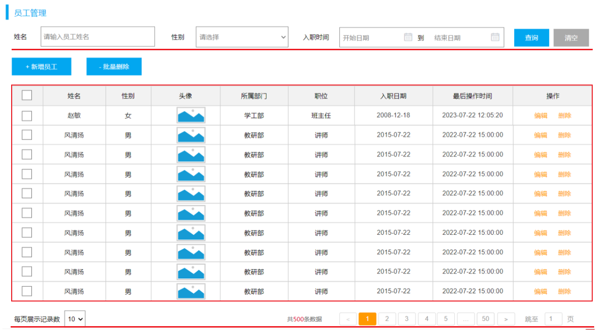

在查询员工列表数据时，既要查询员工的基本信息，还需要查询员工所属的部门名称，因此会涉及到多表查询的操作。而且，在查询员工列表数据时，既要考虑搜索栏中的查询条件，还要考虑对查询的结果进行分页处理。

### 3.1 准备工作

需求：查询所有员工信息，并查询出部门名称。

涉及到的表：emp、dept。

#### 3.1.1 基础代码准备

1). 创建员工管理相关表结构

此处不再赘述。

2). 准备 emp 表对应的实体类 `Emp`、`EmpExpr`

示例代码：
```java
/* pojo/Emp.java */

package com.anxin_hitsz.pojo;

import lombok.Data;

import java.time.LocalDate;
import java.time.LocalDateTime;

/**
 * ClassName: Emp
 * Package: com.anxin_hitsz.pojo
 * Description:
 *
 * @Author AnXin
 * @Create 2026/3/10 16:24
 * @Version 1.0
 */
@Data
public class Emp {
    private Integer id; // ID，主键
    private String username;    // 用户名
    private String password;    // 密码
    private String name;    // 姓名
    private Integer gender; // 性别：1 - 男；2 - 女
    private String phone;   // 手机号
    private Integer job;    // 职位：1 - 班主任；2 - 讲师；3 - 学工主管；4 - 教研主管；5 - 咨询师
    private Integer salary; // 薪资
    private String image;   // 头像
    private LocalDate entryDate;    // 入职日期
    private Integer deptId; // 关联的部门 ID
    private LocalDateTime createTime;   // 创建时间
    private LocalDateTime updateTime;   // 修改时间
}


/* pojo/EmpExpr.java */

package com.anxin_hitsz.pojo;

import lombok.Data;

import java.time.LocalDate;

/**
 * ClassName: EmpExpr
 * Package: com.anxin_hitsz.pojo
 * Description:
 *
 * @Author AnXin
 * @Create 2026/3/10 16:28
 * @Version 1.0
 */
@Data
public class EmpExpr {
    private Integer id; // ID
    private Integer empId;  // 员工 ID
    private LocalDate begin;    // 开始时间
    private LocalDate end;  // 结束时间
    private String company; // 公司名称
    private String job; // 职位
}

```

3). 准备 Emp 员工管理的基础结构，包括 Controller、Service、Mapper

示例代码：

* Mapper 层：
```java
/* mapper/EmpMapper.java */

package com.anxin_hitsz.mapper;

/**
 * ClassName: EmpMapper
 * Package: com.anxin_hitsz.mapper
 * Description:
 *
 * @Author AnXin
 * @Create 2026/3/10 16:30
 * @Version 1.0
 */

import org.apache.ibatis.annotations.Mapper;

/**
 * 员工信息
 */
@Mapper
public interface EmpMapper {
}


/* mapper/EmpExprMapper.java */

package com.anxin_hitsz.mapper;

import org.apache.ibatis.annotations.Mapper;

/**
 * ClassName: EmpExprMapper
 * Package: com.anxin_hitsz.mapper
 * Description:
 *
 * @Author AnXin
 * @Create 2026/3/10 16:30
 * @Version 1.0
 */

/**
 * 员工工作经历
 */
@Mapper
public interface EmpExprMapper {
}

```

* Service 层：
```java
/* service/EmpService.java */

package com.anxin_hitsz.service;

/**
 * ClassName: EmpService
 * Package: com.anxin_hitsz.service
 * Description:
 *
 * @Author AnXin
 * @Create 2026/3/10 16:31
 * @Version 1.0
 */
public interface EmpService {
}


/* service/impl/EmpServiceImpl.java */

package com.anxin_hitsz.service.impl;

import com.anxin_hitsz.service.EmpService;
import org.springframework.stereotype.Service;

/**
 * ClassName: EmpServiceImpl
 * Package: com.anxin_hitsz.service.impl
 * Description:
 *
 * @Author AnXin
 * @Create 2026/3/10 16:31
 * @Version 1.0
 */
@Service
public class EmpServiceImpl implements EmpService {
}

```

> 注意：
>
> 此处不需要构建 `EmpExpr` 类对应的 Service 层，因为 `EmpExpr` 类所涉及的表为 `Emp` 类所涉及的表的附属表。因此，只需要构建 `Emp` 类对应的 Service 层即可。

* Controller 层：
```java
/* controller/EmpController.java */

package com.anxin_hitsz.controller;

import lombok.extern.slf4j.Slf4j;
import org.springframework.web.bind.annotation.RestController;

/**
 * ClassName: EmpController
 * Package: com.anxin_hitsz.controller
 * Description:
 *
 * @Author AnXin
 * @Create 2026/3/10 16:33
 * @Version 1.0
 */

/**
 * 员工管理 Controller
 */
@Slf4j
@RestController
public class EmpController {
}

```

#### 3.1.2 SQL 与 Mapper 接口

1). SQL 语句编写

我们需要查询所有的员工数据及其关联的部门名称，也即意味着，即使员工没有部门，也需要将该员工查询出来。

所以，这里需要用左外连接实现。具体 SQL 语句如下：
```sql
-- MySQL04.sql

-- 查询所有的员工信息，以及员工归属的部门名称
select e.*, d.name deptName from emp e left join dept d on e.dept_id = d.id;
```

2). Mapper 接口方法定义

定义一个员工管理的 Mapper 接口 `EmpMapper`，并在其中完成员工信息的查询。

注意，上述 SQL 语句中，给部门名称起了别名 `deptName`，是因为在接口文档中，要求部门名称给前端返回的数据中，就必须叫 `deptName`。而这里，我们需要将查询返回的每一条记录都封装到 `Emp` 对象中，那么就必须保证查询返回的字段名与属性名是一一对应的。

此时，我们就需要在 `Emp` 中定义一个属性 `deptName` 用来封装部门名称。具体如下：
```java
/* pojo/Emp.java */

package com.anxin_hitsz.pojo;

import lombok.Data;

import java.time.LocalDate;
import java.time.LocalDateTime;

/**
 * ClassName: Emp
 * Package: com.anxin_hitsz.pojo
 * Description:
 *
 * @Author AnXin
 * @Create 2026/3/10 16:24
 * @Version 1.0
 */
@Data
public class Emp {
    private Integer id; // ID，主键
    private String username;    // 用户名
    private String password;    // 密码
    private String name;    // 姓名
    private Integer gender; // 性别：1 - 男；2 - 女
    private String phone;   // 手机号
    private Integer job;    // 职位：1 - 班主任；2 - 讲师；3 - 学工主管；4 - 教研主管；5 - 咨询师
    private Integer salary; // 薪资
    private String image;   // 头像
    private LocalDate entryDate;    // 入职日期
    private Integer deptId; // 关联的部门 ID
    private LocalDateTime createTime;   // 创建时间
    private LocalDateTime updateTime;   // 修改时间

    // 封装部门名称
    private String deptName;
}

```

运行单元测试后，我们通过控制台查看输出的数据，可以看到员工的信息、员工关联的部门名称都查询出来了。

### 3.2 分页查询

#### 3.2.1 分析

如果数据库中的数据有很多（假设有几千几万条）的时候，将数据全部展示出来肯定不现实；因此我们可以使用分页解决这个问题，每次只展示一页的数据，如果还想查看其他的数据，可以通过点击页码进行查询。

而在员工管理的需求中，就要求我们进行分页查询，展示出对应的数据。具体的页面原型如下：
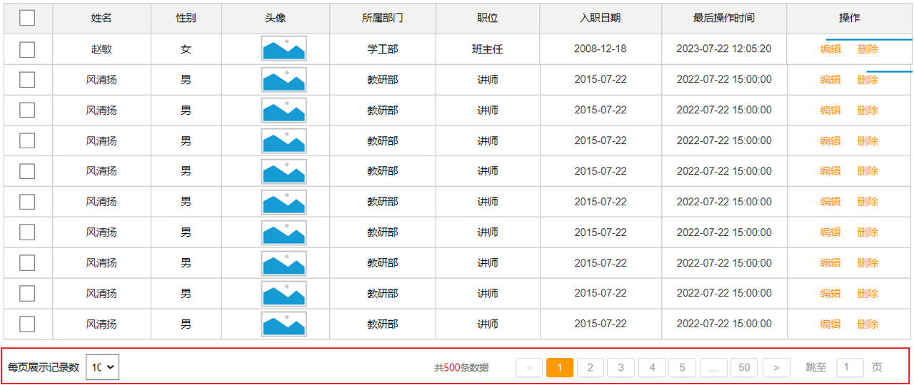

要想从数据库中进行分页查询，我们要使用 `LIMIT` 关键字，格式为 `limit 开始索引 每页显示的条数`，且开始索引的计算公式为 $开始索引 = (当前页码 - 1) \times 每页显示条数$。

我们继续基于页面原型进行分析，得出以下结论：
* 前端在请求服务端时，传递的参数：
  * 当前页码 page；
  * 每页显示条数 pageSize。
* 后端需要响应什么数据给前端：
  * 所查询到的数据列表（存储到 List 集合中）；
  * 总记录数 total。

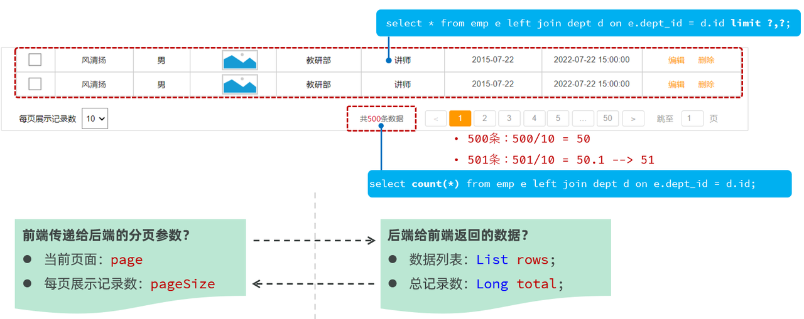

后端给前端返回的两部分数据我们通常封装到 `PageResult` 对象中，并将该对象转换为 JSON 格式的数据响应回给浏览器：
```java
/* pojo/PageResult.java */

package com.anxin_hitsz.pojo;

/**
 * ClassName: PageResult
 * Package: com.anxin_hitsz.pojo
 * Description:
 *
 * @Author AnXin
 * @Create 2026/3/10 17:18
 * @Version 1.0
 */

import lombok.AllArgsConstructor;
import lombok.Data;
import lombok.NoArgsConstructor;

import java.util.List;

/**
 * 分页结果封装类
 */
@Data
@NoArgsConstructor
@AllArgsConstructor
public class PageResult<T> {
    private Long total;
    private List<T> rows;
}

```

#### 3.2.2 接口描述

1). 基本信息

* 请求路径：/emps。
* 请求方式：GET。
* 接口描述：该接口用于员工列表数据的条件分页查询。

2). 请求参数

详见接口文档。

3). 响应数据

参数格式：application/json。

详见接口文档。

#### 3.2.3 原始方式

##### 3.2.3.1 代码实现

通过查看接口文档 - 员工列表查询：
* 请求路径：/emps。
* 请求方式：GET。
* 请求参数：跟随在请求路径后的参数字符串；例如：/emps?page=1&pageSize=10。
* 响应数据：JSON 格式。

示例代码：

* Controller 层：
```java
/* controller/EmpController.java */

package com.anxin_hitsz.controller;

import com.anxin_hitsz.pojo.Emp;
import com.anxin_hitsz.pojo.PageResult;
import com.anxin_hitsz.pojo.Result;
import com.anxin_hitsz.service.EmpService;
import lombok.extern.slf4j.Slf4j;
import org.springframework.beans.factory.annotation.Autowired;
import org.springframework.web.bind.annotation.*;

import java.util.List;

/**
 * ClassName: EmpController
 * Package: com.anxin_hitsz.controller
 * Description:
 *
 * @Author AnXin
 * @Create 2026/3/10 16:33
 * @Version 1.0
 */

/**
 * 员工管理 Controller
 */
@RequestMapping("/emps")
@Slf4j
@RestController
public class EmpController {

    @Autowired
    private EmpService empService;

    /**
     * 分页查询
     */
    @GetMapping
    public Result page(@RequestParam(defaultValue = "1") Integer page,
                       @RequestParam(defaultValue = "10") Integer pageSize) {
        log.info("分页查询: {}, {}", page, pageSize);
        PageResult<Emp> pageResult = empService.page(page, pageSize);
        return Result.success(pageResult);
    }

}

```

> 注意：
>
> `@RequestParam(defaultValue="默认值")` 可设置请求参数默认值。

* Service 层：
```java
/* service/EmpService.java */

package com.anxin_hitsz.service;

import com.anxin_hitsz.pojo.Emp;
import com.anxin_hitsz.pojo.PageResult;

/**
 * ClassName: EmpService
 * Package: com.anxin_hitsz.service
 * Description:
 *
 * @Author AnXin
 * @Create 2026/3/10 16:31
 * @Version 1.0
 */
public interface EmpService {
    /**
     * 分页查询
     * @param page 页码
     * @param pageSize 每页记录数
     * @return
     */
    PageResult<Emp> page(Integer page, Integer pageSize);

}


/* service/impl/EmpServiceImpl.java */

package com.anxin_hitsz.service.impl;

import com.anxin_hitsz.mapper.EmpMapper;
import com.anxin_hitsz.pojo.Emp;
import com.anxin_hitsz.pojo.PageResult;
import com.anxin_hitsz.service.EmpService;
import org.springframework.beans.factory.annotation.Autowired;
import org.springframework.stereotype.Service;

import java.util.List;

/**
 * ClassName: EmpServiceImpl
 * Package: com.anxin_hitsz.service.impl
 * Description:
 *
 * @Author AnXin
 * @Create 2026/3/10 16:31
 * @Version 1.0
 */
@Service
public class EmpServiceImpl implements EmpService {

    @Autowired
    private EmpMapper empMapper;

    @Override
    public PageResult<Emp> page(Integer page, Integer pageSize) {
        // 1. 调用 Mapper 接口，查询总记录数
        Long total = empMapper.count();

        // 2. 调用 Mapper 接口，查询结果列表
        Integer start = (page - 1) * pageSize;
        List<Emp> rows = empMapper.list(start, pageSize);

        // 3. 封装结果 PageResult
        return new PageResult<Emp>(total, rows);
    }
}

```

* Mapper 层：
```java
/* mapper/EmpMapper.java */

package com.anxin_hitsz.mapper;

/**
 * ClassName: EmpMapper
 * Package: com.anxin_hitsz.mapper
 * Description:
 *
 * @Author AnXin
 * @Create 2026/3/10 16:30
 * @Version 1.0
 */

import com.anxin_hitsz.pojo.Emp;
import org.apache.ibatis.annotations.Mapper;
import org.apache.ibatis.annotations.Select;

import java.util.List;

/**
 * 员工信息
 */
@Mapper
public interface EmpMapper {

    /**
     * 查询总记录数
     */
    @Select("select count(*) from emp e left join dept d on e.dept_id = d.id")
    public Long count();

    /**
     * 分页查询
     */
    @Select("select e.*, d.name deptName from emp e left join dept d on e.dept_id = d.id " +
            "order by e.update_time desc limit #{start}, #{pageSize}")
    public List<Emp> list(Integer start, Integer pageSize);

}

```

##### 3.2.3.2 功能测试

功能开发完成后，重新启动项目，使用 Apifox，发起 GET 请求。

##### 3.2.3.3 前后端联调

打开浏览器，测试后端功能接口。

点击下面的页码，可以正常地查询出对应的数据。

#### 3.2.4 PageHelper 分页插件

##### 3.2.4.1 介绍

分页查询的思路、步骤是比较固定的。在 Mapper 接口中定义两个方法执行两条不同的 SQL 语句：
1. 查询总记录数。
2. 指定页码的数据列表。

在 Service 中调用 Mapper 接口的两个方法，分别获取总记录数和查询结果列表，然后再将获取的数据结果封装到 PageBean 对象中。

因此，可以使用一些现成的分页插件来完成分页查询操作。对于 MyBatis 来讲，现在最主流的就是 PageHelper。

PageHelper 是第三方提供的 MyBatis 框架中的一款功能强大、方便易用的分页插件，支持任何形式的单表、多表的分页查询。

PageHelper 官网：[PageHelper 官网](https://pagehelper.github.io/ "PageHelper 官网")

##### 3.2.4.2 代码实现

当使用了 PageHelper 分页插件进行分页后，就无需在 Mapper 中进行手动分页了。在 Mapper 中，我们只需要进行正常的列表查询即可；在 Service 层中，调用 Mapper 的方法之前设置分页参数，在调用 Mapper 方法执行查询之后，解析分页结果，并将结果封装到 `PageResult` 对象中返回。

具体步骤：

1). 在 pom.xml 中引入依赖

```xml
<!-- 分页插件 PageHelper -->
<dependency>
    <groupId>com.github.pagehelper</groupId>
    <artifactId>pagehelper-spring-boot-starter</artifactId>
    <version>1.4.7</version>
</dependency>
```

2). `EmpMapper`

```java
/* mapper/EmpMapper.java */

package com.anxin_hitsz.mapper;

/**
 * ClassName: EmpMapper
 * Package: com.anxin_hitsz.mapper
 * Description:
 *
 * @Author AnXin
 * @Create 2026/3/10 16:30
 * @Version 1.0
 */

import com.anxin_hitsz.pojo.Emp;
import org.apache.ibatis.annotations.Mapper;
import org.apache.ibatis.annotations.Select;

import java.util.List;

/**
 * 员工信息
 */
@Mapper
public interface EmpMapper {

    // ------------------------------ 原始分页查询实现 ------------------------------
    /**
     * 查询总记录数
     */
//    @Select("select count(*) from emp e left join dept d on e.dept_id = d.id")
//    public Long count();

    /**
     * 分页查询
     */
//    @Select("select e.*, d.name deptName from emp e left join dept d on e.dept_id = d.id " +
//            "order by e.update_time desc limit #{start}, #{pageSize}")
//    public List<Emp> list(Integer start, Integer pageSize);


    @Select("select e.*, d.name deptName from emp e left join dept d on e.dept_id = d.id order by e.update_time desc")
    public List<Emp> list();

}

```

3). `EmpServiceImpl`

```java
/* service/impl/EmpServiceImpl.java */

package com.anxin_hitsz.service.impl;

import com.anxin_hitsz.mapper.EmpMapper;
import com.anxin_hitsz.pojo.Emp;
import com.anxin_hitsz.pojo.PageResult;
import com.anxin_hitsz.service.EmpService;
import com.github.pagehelper.Page;
import com.github.pagehelper.PageHelper;
import org.springframework.beans.factory.annotation.Autowired;
import org.springframework.stereotype.Service;

import java.util.List;

/**
 * ClassName: EmpServiceImpl
 * Package: com.anxin_hitsz.service.impl
 * Description:
 *
 * @Author AnXin
 * @Create 2026/3/10 16:31
 * @Version 1.0
 */
@Service
public class EmpServiceImpl implements EmpService {

    @Autowired
    private EmpMapper empMapper;

    /**
     * 原始分页查询
     * @param page 页码
     * @param pageSize 每页记录数
     * @return
     */
//    @Override
//    public PageResult<Emp> page(Integer page, Integer pageSize) {
//        // 1. 调用 Mapper 接口，查询总记录数
//        Long total = empMapper.count();
//
//        // 2. 调用 Mapper 接口，查询结果列表
//        Integer start = (page - 1) * pageSize;
//        List<Emp> rows = empMapper.list(start, pageSize);
//
//        // 3. 封装结果 PageResult
//        return new PageResult<Emp>(total, rows);
//    }

    /**
     * PageHelper 分页查询
     * @param page 页码
     * @param pageSize 每页记录数
     */
    @Override
    public PageResult<Emp> page(Integer page, Integer pageSize) {
        // 1. 设置分页参数（PageHelper）
        PageHelper.startPage(page, pageSize);

        // 2. 执行查询
        List<Emp> empList = empMapper.list();

        // 3. 解析查询结果，并封装
        Page<Emp> p = (Page<Emp>) empList;
        return new PageResult<Emp>(p.getTotal(), p.getResult());
    }

}

```

##### 3.2.4.3 功能测试

功能开发完成后，我们重启项目工程，打开 Apifox，发起 GET 请求，访问 http://localhost:8080/emps?page=1&pageSize=5。

我们可以看到数据可以正常查询返回，是可以正常实现分页查询的。

##### 3.2.4.4 实现机制

我们打开 IDEA 的控制台，可以看到在进行分页查询时，输出的 SQL 语句：
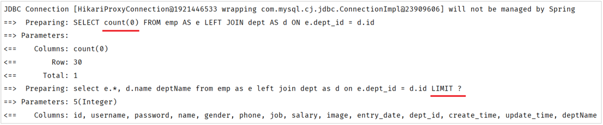

我们看到执行了两条 SQL 语句，而这两条 SQL 语句，其实是从我们在 Mapper 接口中定义的 SQL 演变而来的。
* 第一条 SQL 语句，用来查询总记录数：
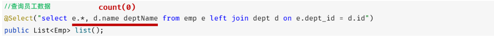
  * 其实就是将我们编写的 SQL 语句进行的改造增强，将查询返回的字段列表替换成了 `count(0)` 来统计总记录数。
* 第二条 SQL 语句，用来进行分页查询，查询指定页码对应的数据列表：
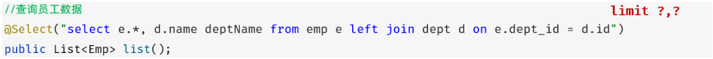
* 其实就是将我们编写的 SQL 语句进行的改造增强，在 SQL 语句之后拼接上了 `limit` 进行分页查询，而由于测试时查询的是第一页，起始索引是 0，所以简写为 `limit ?`。

而 PageHelper 在进行分页查询时，会执行上述两条 SQL 语句，并将查询到的总记录数与数据列表封装到了 `Page<Emp>` 对象中。我们在获取查询结果时，只需要调用 `Page` 对象的方法就可以获取。

> 注意：
> * PageHelper 实现分页查询时，SQL 语句的结尾一定不要加分号（`;`）。
> * PageHelper 只会对紧跟在其后的第一条 SQL 语句进行分页处理。

### 3.3 条件分页查询

完成了分页查询后，下面我们需要在分页查询的基础上，添加条件。

#### 3.3.1 需求

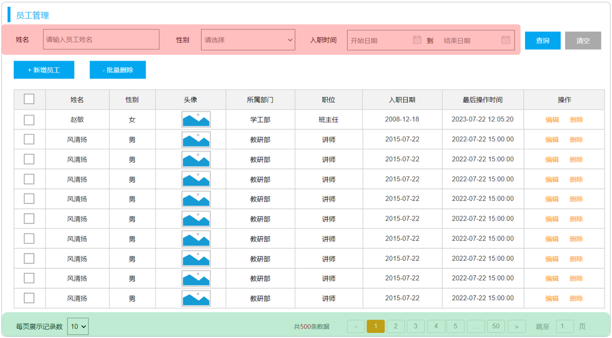

通过员工管理的页面原型，我们可以看到，员工列表页面的查询，不仅仅需要考虑分页，还需要考虑查询条件。

因此，接下来，我们需要考虑在之前实现的分页查询的基础上，再加上查询条件。

我们看到页面原型及需求中描述，搜索栏的搜索条件有三个，分别是：
* 姓名：模糊匹配。
* 性别：精确匹配。
* 入职日期：范围匹配。

#### 3.3.2 接口描述

参照接口文档。

#### 3.3.3 思路分析

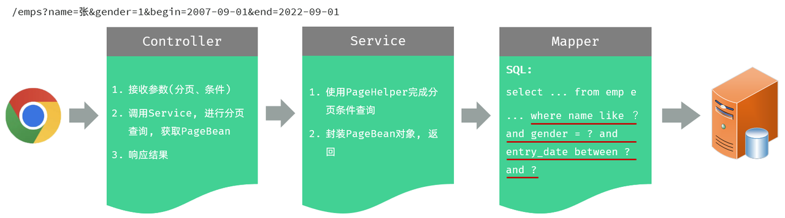

#### 3.3.4 功能开发

查看接口文档 - 员工列表查询。

在原有分页查询的代码的基础上进行改造。

1). 在 `EmpController` 方法中通过多个方法形参，依次接收请求参数

```java
/* controller/EmpController.java */

package com.anxin_hitsz.controller;

import com.anxin_hitsz.pojo.Emp;
import com.anxin_hitsz.pojo.PageResult;
import com.anxin_hitsz.pojo.Result;
import com.anxin_hitsz.service.EmpService;
import lombok.extern.slf4j.Slf4j;
import org.springframework.beans.factory.annotation.Autowired;
import org.springframework.format.annotation.DateTimeFormat;
import org.springframework.web.bind.annotation.*;

import java.time.LocalDate;
import java.util.List;

/**
 * ClassName: EmpController
 * Package: com.anxin_hitsz.controller
 * Description:
 *
 * @Author AnXin
 * @Create 2026/3/10 16:33
 * @Version 1.0
 */

/**
 * 员工管理 Controller
 */
@RequestMapping("/emps")
@Slf4j
@RestController
public class EmpController {

    @Autowired
    private EmpService empService;

    /**
     * 分页查询
     */
    @GetMapping
    public Result page(@RequestParam(defaultValue = "1") Integer page,
                       @RequestParam(defaultValue = "10") Integer pageSize,
                       String name,
                       Integer gender,
                       @DateTimeFormat(pattern = "yyyy-MM-dd") LocalDate begin,
                       @DateTimeFormat(pattern = "yyyy-MM-dd") LocalDate end) {
        log.info("分页查询: {}, {}, {}, {}, {}, {}", page, pageSize, name, gender, begin, end);
        PageResult<Emp> pageResult = empService.page(page, pageSize, name, gender, begin, end);
        return Result.success(pageResult);
    }

}

```

2). 修改 `EmpService` 及 `EmpServiceImpl` 中的代码逻辑

* `EmpService`：
```java
/* service/EmpService.java */

package com.anxin_hitsz.service;

import com.anxin_hitsz.pojo.Emp;
import com.anxin_hitsz.pojo.PageResult;

import java.time.LocalDate;

/**
 * ClassName: EmpService
 * Package: com.anxin_hitsz.service
 * Description:
 *
 * @Author AnXin
 * @Create 2026/3/10 16:31
 * @Version 1.0
 */
public interface EmpService {
    /**
     * 分页查询
     * @param page 页码
     * @param pageSize 每页记录数
     * @return
     */
    PageResult<Emp> page(Integer page, Integer pageSize, String name, Integer gender, LocalDate begin, LocalDate end);

}

```

* `EmpServiceImpl`：
```java
/* service/impl/EmpServiceImpl.java */

package com.anxin_hitsz.service.impl;

import com.anxin_hitsz.mapper.EmpMapper;
import com.anxin_hitsz.pojo.Emp;
import com.anxin_hitsz.pojo.PageResult;
import com.anxin_hitsz.service.EmpService;
import com.github.pagehelper.Page;
import com.github.pagehelper.PageHelper;
import org.springframework.beans.factory.annotation.Autowired;
import org.springframework.stereotype.Service;

import java.time.LocalDate;
import java.util.List;

/**
 * ClassName: EmpServiceImpl
 * Package: com.anxin_hitsz.service.impl
 * Description:
 *
 * @Author AnXin
 * @Create 2026/3/10 16:31
 * @Version 1.0
 */
@Service
public class EmpServiceImpl implements EmpService {

    @Autowired
    private EmpMapper empMapper;

    /**
     * 原始分页查询
     * @param page 页码
     * @param pageSize 每页记录数
     * @return
     */
//    @Override
//    public PageResult<Emp> page(Integer page, Integer pageSize) {
//        // 1. 调用 Mapper 接口，查询总记录数
//        Long total = empMapper.count();
//
//        // 2. 调用 Mapper 接口，查询结果列表
//        Integer start = (page - 1) * pageSize;
//        List<Emp> rows = empMapper.list(start, pageSize);
//
//        // 3. 封装结果 PageResult
//        return new PageResult<Emp>(total, rows);
//    }

    /**
     * PageHelper 分页查询
     * @param page 页码
     * @param pageSize 每页记录数
     * 注意事项：
     *         1. 定义的 SQL 语句结尾不能加分号 “;”
     *         2. PageHelper 仅仅能够对紧跟在其后的第一个查询语句进行分页处理
     */
    @Override
    public PageResult<Emp> page(Integer page, Integer pageSize, String name, Integer gender, LocalDate begin, LocalDate end) {
        // 1. 设置分页参数（PageHelper）
        PageHelper.startPage(page, pageSize);

        // 2. 执行查询
        List<Emp> empList = empMapper.list(name, gender, begin, end);

        // 3. 解析查询结果，并封装
        Page<Emp> p = (Page<Emp>) empList;
        return new PageResult<Emp>(p.getTotal(), p.getResult());
    }

}

```

3). 调整 `EmpMapper` 接口方法

```java
/* mapper/EmpMapper.java */

package com.anxin_hitsz.mapper;

/**
 * ClassName: EmpMapper
 * Package: com.anxin_hitsz.mapper
 * Description:
 *
 * @Author AnXin
 * @Create 2026/3/10 16:30
 * @Version 1.0
 */

import com.anxin_hitsz.pojo.Emp;
import org.apache.ibatis.annotations.Mapper;
import org.apache.ibatis.annotations.Select;

import java.time.LocalDate;
import java.util.List;

/**
 * 员工信息
 */
@Mapper
public interface EmpMapper {

    // ------------------------------ 原始分页查询实现 ------------------------------
    /**
     * 查询总记录数
     */
//    @Select("select count(*) from emp e left join dept d on e.dept_id = d.id")
//    public Long count();

    /**
     * 分页查询
     */
//    @Select("select e.*, d.name deptName from emp e left join dept d on e.dept_id = d.id " +
//            "order by e.update_time desc limit #{start}, #{pageSize}")
//    public List<Emp> list(Integer start, Integer pageSize);


//    @Select("select e.*, d.name deptName from emp e left join dept d on e.dept_id = d.id order by e.update_time desc")
    public List<Emp> list(String name, Integer gender, LocalDate begin, LocalDate end);

}

```

由于 SQL 语句比较复杂，建议将 SQL 语句配置在 XML 映射文件中。

4). 新增 Mapper 映射文件 EmpMapper.xml

```xml
<!-- EmpMapper.xml -->

<?xml version="1.0" encoding="UTF-8" ?>
<!DOCTYPE mapper
        PUBLIC "-//mybatis.org//DTD Mapper 3.0//EN"
        "http://mybatis.org/dtd/mybatis-3-mapper.dtd">
<mapper namespace="com.anxin_hitsz.mapper.EmpMapper">

    <select id="list" resultType="com.anxin_hitsz.pojo.Emp">
        select e.*, d.name deptName from emp e left join dept d on e.dept_id = d.id
        where
            e.name like concat('%', #{name}, '%')
            and e.gender = #{gender}
            and e.entry_date between #{begin} and #{end}
        order by e.update_time desc
    </select>

</mapper>
```

> 注意：
>
> 在SQL 语句中 `#{...}` 不可以被包括在 引号 `''` 之内，否则会被视为普通的字符而非占位符。因此，需要使用 `concat` 函数先完成字符串的拼接，再将其作为 `name` 字段的匹配条件。

开发完成后，进行功能测试。

测试时，需要注意传递的查询条件，有些查询条件是查不到数据的，因为数据库中没有符合条件的记录。

#### 3.3.5 程序优化 1

在上述分页条件查询中，请求参数比较多，因此在 Controller 层方法中接收请求参数的时候，也需要直接在 Controller 方法中声明与分页条件查询中请求参数数量一致的较多数量的参数。这样做，功能可以实现，但是不方便维护和管理。

因此，我们可以针对上述问题进行优化。

优化思路：定义一个实体类，来封装涉及到的请求参数。**需要保证，前端传递的请求参数和实体类的属性名是一样的。**

1). 定义实体类：`EmpQueryParam`

```java
/* pojo/EmpQueryParam.java */

package com.anxin_hitsz.pojo;

import lombok.Data;
import org.springframework.format.annotation.DateTimeFormat;

import java.time.LocalDate;

/**
 * ClassName: EmpQueryParam
 * Package: com.anxin_hitsz.pojo
 * Description:
 *
 * @Author AnXin
 * @Create 2026/3/10 21:39
 * @Version 1.0
 */
@Data
public class EmpQueryParam {
    private Integer page = 1;   // 页码
    private Integer pageSize = 10;  // 每页展示记录数
    private String name;    // 姓名
    private Integer gender; // 性别
    @DateTimeFormat(pattern = "yyyy-MM-dd")
    private LocalDate begin;    // 入职时间 - 开始
    @DateTimeFormat(pattern = "yyyy-MM-dd")
    private LocalDate end;  // 入职时间 - 结束
}

```

2). `EmpController` 接收请求参数

```java
/* controller/EmpController.java */

package com.anxin_hitsz.controller;

import com.anxin_hitsz.pojo.Emp;
import com.anxin_hitsz.pojo.EmpQueryParam;
import com.anxin_hitsz.pojo.PageResult;
import com.anxin_hitsz.pojo.Result;
import com.anxin_hitsz.service.EmpService;
import lombok.extern.slf4j.Slf4j;
import org.springframework.beans.factory.annotation.Autowired;
import org.springframework.format.annotation.DateTimeFormat;
import org.springframework.web.bind.annotation.*;

import java.time.LocalDate;
import java.util.List;

/**
 * ClassName: EmpController
 * Package: com.anxin_hitsz.controller
 * Description:
 *
 * @Author AnXin
 * @Create 2026/3/10 16:33
 * @Version 1.0
 */

/**
 * 员工管理 Controller
 */
@RequestMapping("/emps")
@Slf4j
@RestController
public class EmpController {

    @Autowired
    private EmpService empService;

    /**
     * 分页查询
     */
//    @GetMapping
//    public Result page(@RequestParam(defaultValue = "1") Integer page,
//                       @RequestParam(defaultValue = "10") Integer pageSize,
//                       String name,
//                       Integer gender,
//                       @DateTimeFormat(pattern = "yyyy-MM-dd") LocalDate begin,
//                       @DateTimeFormat(pattern = "yyyy-MM-dd") LocalDate end) {
//        log.info("分页查询: {}, {}, {}, {}, {}, {}", page, pageSize, name, gender, begin, end);
//        PageResult<Emp> pageResult = empService.page(page, pageSize, name, gender, begin, end);
//        return Result.success(pageResult);
//    }

    /**
     * 分页查询
     */
    @GetMapping
    public Result page(EmpQueryParam empQueryParam) {
        log.info("分页查询: {}", empQueryParam);
        PageResult<Emp> pageResult = empService.page(empQueryParam);
        return Result.success(pageResult);
    }

}

```

3). 修改 `EmpService` 接口方法

```java
/* service/EmpService.java */

package com.anxin_hitsz.service;

import com.anxin_hitsz.pojo.Emp;
import com.anxin_hitsz.pojo.EmpQueryParam;
import com.anxin_hitsz.pojo.PageResult;

import java.time.LocalDate;

/**
 * ClassName: EmpService
 * Package: com.anxin_hitsz.service
 * Description:
 *
 * @Author AnXin
 * @Create 2026/3/10 16:31
 * @Version 1.0
 */
public interface EmpService {

    /**
     * 分页查询
     */
    PageResult<Emp> page(EmpQueryParam empQueryParam);

    /**
     * 分页查询
     * @param page 页码
     * @param pageSize 每页记录数
     */
//    PageResult<Emp> page(Integer page, Integer pageSize, String name, Integer gender, LocalDate begin, LocalDate end);

}

```

4). 修改 `EmpServiceImpl` 中的 `page` 方法

```java
/* service/impl/EmpServiceImpl.java */

package com.anxin_hitsz.service.impl;

import com.anxin_hitsz.mapper.EmpMapper;
import com.anxin_hitsz.pojo.Emp;
import com.anxin_hitsz.pojo.EmpQueryParam;
import com.anxin_hitsz.pojo.PageResult;
import com.anxin_hitsz.service.EmpService;
import com.github.pagehelper.Page;
import com.github.pagehelper.PageHelper;
import org.springframework.beans.factory.annotation.Autowired;
import org.springframework.stereotype.Service;

import java.time.LocalDate;
import java.util.List;

/**
 * ClassName: EmpServiceImpl
 * Package: com.anxin_hitsz.service.impl
 * Description:
 *
 * @Author AnXin
 * @Create 2026/3/10 16:31
 * @Version 1.0
 */
@Service
public class EmpServiceImpl implements EmpService {

    @Autowired
    private EmpMapper empMapper;

    /**
     * 原始分页查询
     * @param page 页码
     * @param pageSize 每页记录数
     * @return
     */
//    @Override
//    public PageResult<Emp> page(Integer page, Integer pageSize) {
//        // 1. 调用 Mapper 接口，查询总记录数
//        Long total = empMapper.count();
//
//        // 2. 调用 Mapper 接口，查询结果列表
//        Integer start = (page - 1) * pageSize;
//        List<Emp> rows = empMapper.list(start, pageSize);
//
//        // 3. 封装结果 PageResult
//        return new PageResult<Emp>(total, rows);
//    }

    /**
     * PageHelper 分页查询
     * @param page 页码
     * @param pageSize 每页记录数
     * 注意事项：
     *         1. 定义的 SQL 语句结尾不能加分号 “;”
     *         2. PageHelper 仅仅能够对紧跟在其后的第一个查询语句进行分页处理
     */
//    @Override
//    public PageResult<Emp> page(Integer page, Integer pageSize, String name, Integer gender, LocalDate begin, LocalDate end) {
//        // 1. 设置分页参数（PageHelper）
//        PageHelper.startPage(page, pageSize);
//
//        // 2. 执行查询
//        List<Emp> empList = empMapper.list(name, gender, begin, end);
//
//        // 3. 解析查询结果，并封装
//        Page<Emp> p = (Page<Emp>) empList;
//        return new PageResult<Emp>(p.getTotal(), p.getResult());
//    }

    @Override
    public PageResult<Emp> page(EmpQueryParam empQueryParam) {
        // 1. 设置分页参数（PageHelper）
        PageHelper.startPage(empQueryParam.getPage(), empQueryParam.getPageSize());

        // 2. 执行查询
        List<Emp> empList = empMapper.list(empQueryParam);

        // 3. 解析查询结果，并封装
        Page<Emp> p = (Page<Emp>) empList;
        return new PageResult<Emp>(p.getTotal(), p.getResult());
    }

}

```

5). 修改 `EmpMapper` 接口方法

```java
/* mapper/EmpMapper.java */

package com.anxin_hitsz.mapper;

/**
 * ClassName: EmpMapper
 * Package: com.anxin_hitsz.mapper
 * Description:
 *
 * @Author AnXin
 * @Create 2026/3/10 16:30
 * @Version 1.0
 */

import com.anxin_hitsz.pojo.Emp;
import com.anxin_hitsz.pojo.EmpQueryParam;
import org.apache.ibatis.annotations.Mapper;
import org.apache.ibatis.annotations.Select;

import java.time.LocalDate;
import java.util.List;

/**
 * 员工信息
 */
@Mapper
public interface EmpMapper {

    // ------------------------------ 原始分页查询实现 ------------------------------
    /**
     * 查询总记录数
     */
//    @Select("select count(*) from emp e left join dept d on e.dept_id = d.id")
//    public Long count();

    /**
     * 分页查询
     */
//    @Select("select e.*, d.name deptName from emp e left join dept d on e.dept_id = d.id " +
//            "order by e.update_time desc limit #{start}, #{pageSize}")
//    public List<Emp> list(Integer start, Integer pageSize);


//    @Select("select e.*, d.name deptName from emp e left join dept d on e.dept_id = d.id order by e.update_time desc")
//    public List<Emp> list(String name, Integer gender, LocalDate begin, LocalDate end);

    /**
     * 条件查询员工信息
     */
    public List<Emp> list(EmpQueryParam empQueryParam);

}

```

EmpMapper.xml 中的配置无需修改。

代码优化完毕之后，重新启动运行测试，依然正常运行。

但是，当我们在测试的时候，页码输入负数，查询是有问题的，查不到对应的数据了。那其实在 PageHelper 中，我们可以通过合理化参数配置，来解决这个问题。直接在 application.yml 中，引入如下配置即可：
```yaml
pagehelper:
  reasonable: true
  helper-dialect: mysql
```

其中，`reasonable` 为分页合理化参数，默认值为 `false`。当该参数设置为 `true` 时，pageNum <= 0 时会查询第一页，pageNum > pages（即超过总数时）会查询最后一页；默认 `false` 时，直接根据参数进行查询。

#### 3.3.6 程序优化 2

当前，我们在查询的时候，Mapper 映射配置文件中的 SQL 语句中，查询条件是写死的。而我们在员工管理中，根据条件查询员工信息时，查询条件是可选的，可以输入也可以不输入。如下所示：


因此，上述 SQL 语句不应该是写死的，而应该根据用户输入的条件的变化而变化。

这里需要通过 MyBatis 中的 **动态 SQL** 来实现。

所谓动态 SQL，指的就是随着用户的输入或外部的条件的变化而变化的 SQL 语句。

具体的代码实现如下：
```xml
<!-- EmpMapper.xml -->

<?xml version="1.0" encoding="UTF-8" ?>
<!DOCTYPE mapper
        PUBLIC "-//mybatis.org//DTD Mapper 3.0//EN"
        "http://mybatis.org/dtd/mybatis-3-mapper.dtd">
<mapper namespace="com.anxin_hitsz.mapper.EmpMapper">

    <select id="list" resultType="com.anxin_hitsz.pojo.Emp">
        select e.*, d.name deptName from emp e left join dept d on e.dept_id = d.id
        <where>
            <if test="name != null and name != ''">
                e.name like concat('%', #{name}, '%')
            </if>
            <if test="gender != null">
                and e.gender = #{gender}
            </if>
            <if test="begin != null and end != null">
                and e.entry_date between #{begin} and #{end}
            </if>
        </where>
        order by e.update_time desc
    </select>

</mapper>
```

上述代码中，涉及到两个动态 SQL 标签的使用，分别为 `<if>` 和 `<where>`。这两个标签的具体作用如下：
* `<if>`：判断条件是否成立，如果条件为 `true`，则拼接 SQL。
* `<where>`：根据查询条件，来生成 `where` 关键字，并会自动去除条件前面多余的 `and` 或 `or`。

代码优化完毕后，重新启动服务，进行测试。我们可以看到，当我们输入不同的搜索条件时，会根据查询条件动态地拼接 SQL 语句。