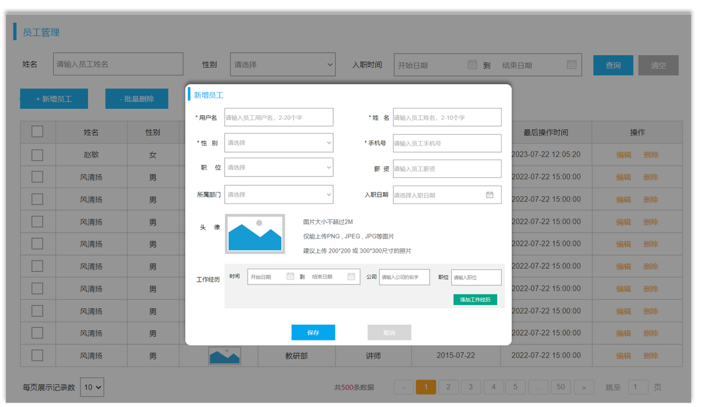
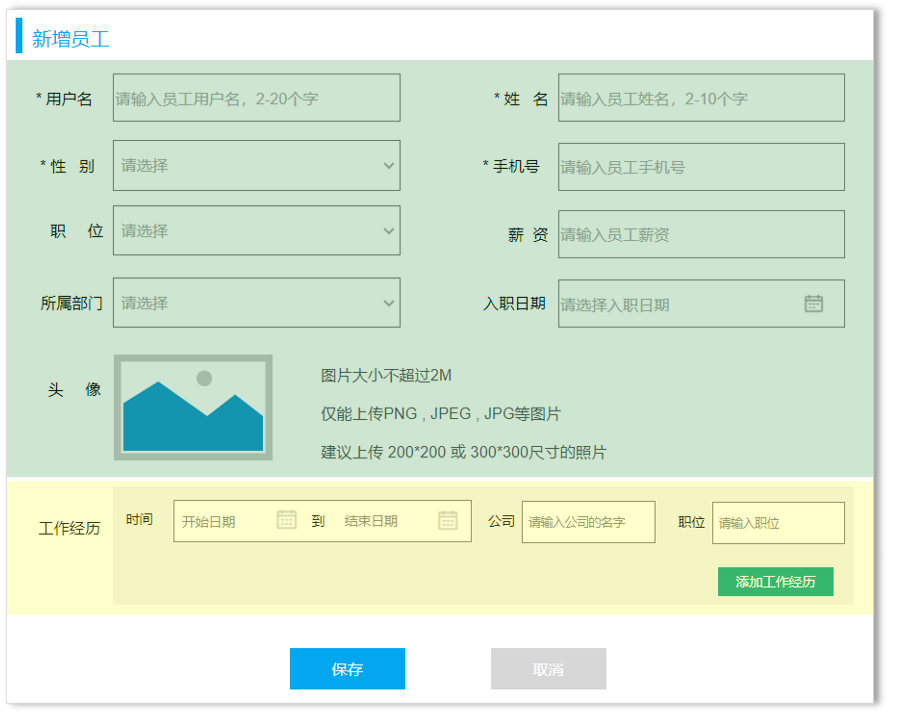
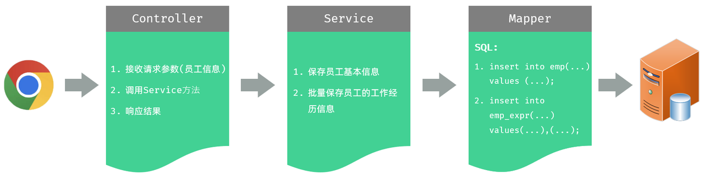
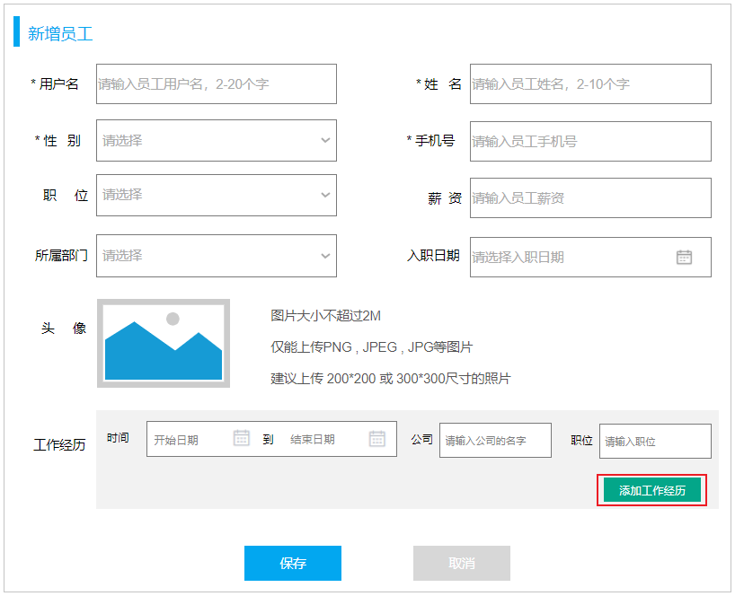

# 第九章：后端 Web 实战（员工管理）

**目录：**

[TOC]

---

完成了员工管理的列表查询功能之后，接下来，我们再来完成新增员工的功能。具体的需求如下：


在新增员工的时候涉及到两部分：新增员工、文件上传。

## 一、新增员工

### 1.1 需求



在新增员工的时候，在表单中，我们既要录入员工的基本信息，又要录入员工的工作经历信息。员工基本信息，对应的表结构是 emp 表；员工工作经历信息，对应的表结构是 emp_expr 表。所以这里我们需要操作两张表，往两张表中保存数据。

### 1.2 接口描述

参照接口文档。

### 1.3 思路分析

新增员工的具体流程：


> 注意：
> 
> 接口文档规定：
> * 请求路径：/emps。
> * 请求方式：POST。
> * 请求参数：JSON 格式数据。
> * 响应数据：JSON 格式数据。
>
> 问题 1：如何限定请求方式是 POST？
> * 答案：`@PostMapping`。
> 
> 问题 2：怎么在 Controller 中接收 JSON 格式的请求参数？
> * 答案：`@RequestBody`。

### 1.4 功能开发

#### 1.4.1 准备工作

准备 `EmpExprMapper` 接口及映射配置文件 EmpExprMapper.xml，并准备实体类接收前端传递的 JSON 格式的请求参数。

需要在 `Emp` 员工实体类中增加属性 `exprList` 来封装工作经历数据：
```java
/* pojo/Emp.java */

package com.anxin_hitsz.pojo;

import lombok.Data;

import java.time.LocalDate;
import java.time.LocalDateTime;
import java.util.List;

/**
 * ClassName: Emp
 * Package: com.anxin_hitsz.pojo
 * Description:
 *
 * @Author AnXin
 * @Create 2026/3/10 16:24
 * @Version 1.0
 */
@Data
public class Emp {
    private Integer id; // ID，主键
    private String username;    // 用户名
    private String password;    // 密码
    private String name;    // 姓名
    private Integer gender; // 性别：1 - 男；2 - 女
    private String phone;   // 手机号
    private Integer job;    // 职位：1 - 班主任；2 - 讲师；3 - 学工主管；4 - 教研主管；5 - 咨询师
    private Integer salary; // 薪资
    private String image;   // 头像
    private LocalDate entryDate;    // 入职日期
    private Integer deptId; // 关联的部门 ID
    private LocalDateTime createTime;   // 创建时间
    private LocalDateTime updateTime;   // 修改时间

    // 封装部门名称
    private String deptName;
    // 封装工作经历信息
    private List<EmpExpr> exprList;
}

```

#### 1.4.2 保存员工基本信息

1). Controller 层

```java
/* controller/EmpController.java */

package com.anxin_hitsz.controller;

import com.anxin_hitsz.pojo.Emp;
import com.anxin_hitsz.pojo.EmpQueryParam;
import com.anxin_hitsz.pojo.PageResult;
import com.anxin_hitsz.pojo.Result;
import com.anxin_hitsz.service.EmpService;
import lombok.extern.slf4j.Slf4j;
import org.springframework.beans.factory.annotation.Autowired;
import org.springframework.format.annotation.DateTimeFormat;
import org.springframework.web.bind.annotation.*;

import java.time.LocalDate;
import java.util.List;

/**
 * ClassName: EmpController
 * Package: com.anxin_hitsz.controller
 * Description:
 *
 * @Author AnXin
 * @Create 2026/3/10 16:33
 * @Version 1.0
 */

/**
 * 员工管理 Controller
 */
@RequestMapping("/emps")
@Slf4j
@RestController
public class EmpController {

    @Autowired
    private EmpService empService;

    /**
     * 分页查询
     */
//    @GetMapping
//    public Result page(@RequestParam(defaultValue = "1") Integer page,
//                       @RequestParam(defaultValue = "10") Integer pageSize,
//                       String name,
//                       Integer gender,
//                       @DateTimeFormat(pattern = "yyyy-MM-dd") LocalDate begin,
//                       @DateTimeFormat(pattern = "yyyy-MM-dd") LocalDate end) {
//        log.info("分页查询: {}, {}, {}, {}, {}, {}", page, pageSize, name, gender, begin, end);
//        PageResult<Emp> pageResult = empService.page(page, pageSize, name, gender, begin, end);
//        return Result.success(pageResult);
//    }

    /**
     * 分页查询
     */
    @GetMapping
    public Result page(EmpQueryParam empQueryParam) {
        log.info("分页查询: {}", empQueryParam);
        PageResult<Emp> pageResult = empService.page(empQueryParam);
        return Result.success(pageResult);
    }

    /**
     * 新增员工
     */
    @PostMapping
    public Result save(@RequestBody Emp emp) {
        log.info("新增员工: {}", emp);
        empService.save(emp);
        return Result.success();
    }

}

```

2). Service 层

```java
/* service/EmpService.java */

package com.anxin_hitsz.service;

import com.anxin_hitsz.pojo.Emp;
import com.anxin_hitsz.pojo.EmpQueryParam;
import com.anxin_hitsz.pojo.PageResult;

import java.time.LocalDate;

/**
 * ClassName: EmpService
 * Package: com.anxin_hitsz.service
 * Description:
 *
 * @Author AnXin
 * @Create 2026/3/10 16:31
 * @Version 1.0
 */
public interface EmpService {

    /**
     * 分页查询
     */
    PageResult<Emp> page(EmpQueryParam empQueryParam);

    /**
     * 新增员工信息
     */
    void save(Emp emp);

    /**
     * 分页查询
     * @param page 页码
     * @param pageSize 每页记录数
     */
//    PageResult<Emp> page(Integer page, Integer pageSize, String name, Integer gender, LocalDate begin, LocalDate end);

}


/* service/impl/EmpServiceImpl.java */

package com.anxin_hitsz.service.impl;

import com.anxin_hitsz.mapper.EmpMapper;
import com.anxin_hitsz.pojo.Emp;
import com.anxin_hitsz.pojo.EmpQueryParam;
import com.anxin_hitsz.pojo.PageResult;
import com.anxin_hitsz.service.EmpService;
import com.github.pagehelper.Page;
import com.github.pagehelper.PageHelper;
import org.springframework.beans.factory.annotation.Autowired;
import org.springframework.stereotype.Service;

import java.time.LocalDate;
import java.time.LocalDateTime;
import java.util.List;

/**
 * ClassName: EmpServiceImpl
 * Package: com.anxin_hitsz.service.impl
 * Description:
 *
 * @Author AnXin
 * @Create 2026/3/10 16:31
 * @Version 1.0
 */
@Service
public class EmpServiceImpl implements EmpService {

    @Autowired
    private EmpMapper empMapper;

    /**
     * 原始分页查询
     * @param page 页码
     * @param pageSize 每页记录数
     * @return
     */
//    @Override
//    public PageResult<Emp> page(Integer page, Integer pageSize) {
//        // 1. 调用 Mapper 接口，查询总记录数
//        Long total = empMapper.count();
//
//        // 2. 调用 Mapper 接口，查询结果列表
//        Integer start = (page - 1) * pageSize;
//        List<Emp> rows = empMapper.list(start, pageSize);
//
//        // 3. 封装结果 PageResult
//        return new PageResult<Emp>(total, rows);
//    }

    /**
     * PageHelper 分页查询
     * @param page 页码
     * @param pageSize 每页记录数
     * 注意事项：
     *         1. 定义的 SQL 语句结尾不能加分号 “;”
     *         2. PageHelper 仅仅能够对紧跟在其后的第一个查询语句进行分页处理
     */
//    @Override
//    public PageResult<Emp> page(Integer page, Integer pageSize, String name, Integer gender, LocalDate begin, LocalDate end) {
//        // 1. 设置分页参数（PageHelper）
//        PageHelper.startPage(page, pageSize);
//
//        // 2. 执行查询
//        List<Emp> empList = empMapper.list(name, gender, begin, end);
//
//        // 3. 解析查询结果，并封装
//        Page<Emp> p = (Page<Emp>) empList;
//        return new PageResult<Emp>(p.getTotal(), p.getResult());
//    }

    @Override
    public PageResult<Emp> page(EmpQueryParam empQueryParam) {
        // 1. 设置分页参数（PageHelper）
        PageHelper.startPage(empQueryParam.getPage(), empQueryParam.getPageSize());

        // 2. 执行查询
        List<Emp> empList = empMapper.list(empQueryParam);

        // 3. 解析查询结果，并封装
        Page<Emp> p = (Page<Emp>) empList;
        return new PageResult<Emp>(p.getTotal(), p.getResult());
    }

    @Override
    public void save(Emp emp) {
        // 1. 保存员工基本信息
        emp.setCreateTime(LocalDateTime.now());
        emp.setUpdateTime(LocalDateTime.now());
        empMapper.insert(emp);

        // 2. 保存员工工作经历信息

    }

}

```

3). Mapper 层

```java
/* mapper/EmpMapper.java */

package com.anxin_hitsz.mapper;

/**
 * ClassName: EmpMapper
 * Package: com.anxin_hitsz.mapper
 * Description:
 *
 * @Author AnXin
 * @Create 2026/3/10 16:30
 * @Version 1.0
 */

import com.anxin_hitsz.pojo.Emp;
import com.anxin_hitsz.pojo.EmpQueryParam;
import org.apache.ibatis.annotations.Insert;
import org.apache.ibatis.annotations.Mapper;
import org.apache.ibatis.annotations.Options;
import org.apache.ibatis.annotations.Select;

import java.time.LocalDate;
import java.util.List;

/**
 * 员工信息
 */
@Mapper
public interface EmpMapper {

    // ------------------------------ 原始分页查询实现 ------------------------------
    /**
     * 查询总记录数
     */
//    @Select("select count(*) from emp e left join dept d on e.dept_id = d.id")
//    public Long count();

    /**
     * 分页查询
     */
//    @Select("select e.*, d.name deptName from emp e left join dept d on e.dept_id = d.id " +
//            "order by e.update_time desc limit #{start}, #{pageSize}")
//    public List<Emp> list(Integer start, Integer pageSize);


//    @Select("select e.*, d.name deptName from emp e left join dept d on e.dept_id = d.id order by e.update_time desc")
//    public List<Emp> list(String name, Integer gender, LocalDate begin, LocalDate end);

    /**
     * 条件查询员工信息
     */
    public List<Emp> list(EmpQueryParam empQueryParam);

    /**
     * 新增员工基本信息
     */
    @Options(useGeneratedKeys = true, keyProperty = "id")   // 获取到生成的主键 - 主键返回
    @Insert("insert into emp (username, name, gender, phone, job, salary, image, entry_date, dept_id, create_time, update_time)" +
            " values (#{username}, #{name}, #{gender}, #{phone}, #{job}, #{salary}, #{image}, #{entryDate}, #{deptId}, #{createTime}, #{updateTime})")
    void insert(Emp emp);
}

```

> 注意：
>
> 主键返回：`@Options(useGeneratedKeys = true, keyProperty = "id")`。
> * 由于稍后，我们在保存工作经历信息的时候，需要记录是哪位员工的工作经历；所以，保存完员工信息之后，是需要获取到员工的 ID 的，那这里就需要通过 MyBatis 中提供的主键返回功能来获取。

#### 1.4.3 批量保存工作经历

##### 1.4.3.1 分析

一个员工，是可以有多段工作经历的；所以将来用户在页面上录入员工信息时，可以自己根据需要添加多段工作经历。页面原型展示如下：


所以，这里最终我们需要执行的是批量插入数据的 insert 语句。

##### 1.4.3.2 实现

1). `EmpServiceImpl`

```java
/* service/impl/EmpServiceImpl.java */

package com.anxin_hitsz.service.impl;

import com.anxin_hitsz.mapper.EmpExprMapper;
import com.anxin_hitsz.mapper.EmpMapper;
import com.anxin_hitsz.pojo.Emp;
import com.anxin_hitsz.pojo.EmpExpr;
import com.anxin_hitsz.pojo.EmpQueryParam;
import com.anxin_hitsz.pojo.PageResult;
import com.anxin_hitsz.service.EmpService;
import com.github.pagehelper.Page;
import com.github.pagehelper.PageHelper;
import org.springframework.beans.factory.annotation.Autowired;
import org.springframework.stereotype.Service;
import org.springframework.util.CollectionUtils;

import java.time.LocalDate;
import java.time.LocalDateTime;
import java.util.List;

/**
 * ClassName: EmpServiceImpl
 * Package: com.anxin_hitsz.service.impl
 * Description:
 *
 * @Author AnXin
 * @Create 2026/3/10 16:31
 * @Version 1.0
 */
@Service
public class EmpServiceImpl implements EmpService {

    @Autowired
    private EmpMapper empMapper;
    @Autowired
    private EmpExprMapper empExprMapper;

    /**
     * 原始分页查询
     * @param page 页码
     * @param pageSize 每页记录数
     * @return
     */
//    @Override
//    public PageResult<Emp> page(Integer page, Integer pageSize) {
//        // 1. 调用 Mapper 接口，查询总记录数
//        Long total = empMapper.count();
//
//        // 2. 调用 Mapper 接口，查询结果列表
//        Integer start = (page - 1) * pageSize;
//        List<Emp> rows = empMapper.list(start, pageSize);
//
//        // 3. 封装结果 PageResult
//        return new PageResult<Emp>(total, rows);
//    }

    /**
     * PageHelper 分页查询
     * @param page 页码
     * @param pageSize 每页记录数
     * 注意事项：
     *         1. 定义的 SQL 语句结尾不能加分号 “;”
     *         2. PageHelper 仅仅能够对紧跟在其后的第一个查询语句进行分页处理
     */
//    @Override
//    public PageResult<Emp> page(Integer page, Integer pageSize, String name, Integer gender, LocalDate begin, LocalDate end) {
//        // 1. 设置分页参数（PageHelper）
//        PageHelper.startPage(page, pageSize);
//
//        // 2. 执行查询
//        List<Emp> empList = empMapper.list(name, gender, begin, end);
//
//        // 3. 解析查询结果，并封装
//        Page<Emp> p = (Page<Emp>) empList;
//        return new PageResult<Emp>(p.getTotal(), p.getResult());
//    }

    @Override
    public PageResult<Emp> page(EmpQueryParam empQueryParam) {
        // 1. 设置分页参数（PageHelper）
        PageHelper.startPage(empQueryParam.getPage(), empQueryParam.getPageSize());

        // 2. 执行查询
        List<Emp> empList = empMapper.list(empQueryParam);

        // 3. 解析查询结果，并封装
        Page<Emp> p = (Page<Emp>) empList;
        return new PageResult<Emp>(p.getTotal(), p.getResult());
    }

    @Override
    public void save(Emp emp) {
        // 1. 保存员工基本信息
        emp.setCreateTime(LocalDateTime.now());
        emp.setUpdateTime(LocalDateTime.now());
        empMapper.insert(emp);

        // 2. 保存员工工作经历信息
        List<EmpExpr> exprList = emp.getExprList();
        if (!CollectionUtils.isEmpty(exprList)) {
            // 遍历集合，为 empId 赋值
            exprList.forEach(empExpr -> {
                empExpr.setEmpId(emp.getId());
            });
            empExprMapper.insertBatch(exprList);
        }
    }

}

```

2). `EmpExprMapper`

```java
/* mapper/EmpExprMapper.java */

package com.anxin_hitsz.mapper;

import com.anxin_hitsz.pojo.EmpExpr;
import org.apache.ibatis.annotations.Mapper;

import java.util.List;

/**
 * ClassName: EmpExprMapper
 * Package: com.anxin_hitsz.mapper
 * Description:
 *
 * @Author AnXin
 * @Create 2026/3/10 16:30
 * @Version 1.0
 */

/**
 * 员工工作经历
 */
@Mapper
public interface EmpExprMapper {
    /**
     * 批量保存员工的工作经历信息
     */
    void insertBatch(List<EmpExpr> exprList);
}

```

3). EmpExprMapper.xml

```xml
<!-- EmpExprMapper.xml -->

<?xml version="1.0" encoding="UTF-8" ?>
<!DOCTYPE mapper
        PUBLIC "-//mybatis.org//DTD Mapper 3.0//EN"
        "http://mybatis.org/dtd/mybatis-3-mapper.dtd">
<mapper namespace="com.anxin_hitsz.mapper.EmpExprMapper">

    <!-- 批量保存员工工作经历信息
        foreach 标签：
            collection：遍历的集合
            item：遍历出来的元素
            separator：每次循环之间的分隔符
    -->
    <insert id="insertBatch">
        insert into emp_expr (emp_id, begin, end, company, job) values
        <foreach collection="exprList" item="expr" separator=",">
            (#{expr.empId}, #{expr.begin}, #{expr.end}, #{expr.company}, #{expr.job})
        </foreach>
    </insert>

</mapper>
```

> 注意：
> 
> 这里需要用到 MyBatis 中的动态 SQL 里提供的 `<foreach>` 标签，该标签的作用是用来遍历循环。常见的属性说明：
> * `collection`：集合名称。
> * `item`：集合遍历出来的元素 / 项。
> * `separator`：每一次遍历使用的分隔符。
> * `open`：遍历开始前拼接的片段。
> * `close`：遍历结束后拼接的片段。
> 
> 上述的属性，是可选的，即并不是所有的都是必须的；可以自己根据实际需求，来指定对应的属性。

### 1.5 功能测试

代码开发完成后，重启服务器，打开 Apifox 发送 POST 请求，请求路径为 http://localhost:8080/emps。

请求完毕后，可以打开 IDEA 的控制台看到控制台输出的日志。

### 1.6 前后端联调

功能测试通过后，我们再打开浏览器，测试后端功能接口。

## 二、事务管理

### 2.1 问题分析

目前我们实现的新增员工功能中，操作了两次数据库，执行了两次 insert 操作：
1. 第一次：保存员工的基本信息到 emp 表中。
2. 第二次：保存员工的工作经历信息到 emp_expr 表中。

照此操作，如果保存员工的基本信息成功了，而保存员工的工作经历信息出错了，则程序会出现异常；即：员工表 emp 数据保存成功了，但是 emp_expr 员工工作经历信息表数据保存失败了。

那是否允许这种情况发生呢？

在开发中，此类情况是不允许发生的。因为这属于一个业务操作，如果保存员工信息成功了，而保存工作经历信息失败了，就会造成数据库数据的不完整、不一致。

那如何解决这个问题呢？这需要通过数据库中的 **事务** 来解决这个问题。

### 2.2 介绍

概念：事务是一组操作的集合，它是一个不可分割的工作单位。事务会把所有的操作作为一个整体，一起向系统提交或撤销操作请求；即：这些操作要么同时成功，要么同时失败。

> 注意：
>
> 默认 MySQL 的事务是自动提交的，也就是说，当执行一条 DML 语句，MySQL 会立即隐式地提交事务。

### 2.3 操作

事务控制主要包括三步操作：开启事务、提交事务 / 回滚事务。
* 需要在这组操作执行之前，先开启事务（`start transaction;` / `begin;`）。
* 所有操作如果全部都执行成功，则提交事务（`commit;`）。
* 如果这组操作中，有任何一个操作执行失败，都应该回滚事务（`rollback;`）。

语法格式：
```sql
-- 开启事务
start transaction;
-- 或：
begin;

-- 执行操作
...

-- 提交事务（全部成功）
commit;

-- 回滚事务（有一个失败）
rollback;
```

### 2.4 Spring 事务管理

#### 2.4.1 分析

Spring 框架当中已经把事务控制的代码都封装好了，并不需要我们手动实现。我们使用了 Spring 框架，只需要通过一个简单的注解 `@Transactional` 即可。

#### 2.4.2 `@Transactional` 注解

注解：`@Transactional`。

作用：在当前方法执行开始之前开启事务，方法执行完毕之后提交事务；如果在这个方法执行的过程当中出现了异常，就会进行事务的回滚操作。

位置：业务层（Service）的方法上、类上、接口上。
* 方法上（推荐）：当前方法交给 Spring 进行事务管理。
* 类上：当前类中所有的方法都交由 Spring 进行事务管理。
* 接口上：接口下所有的实现类中所有的方法都交给 Spring 进行事务管理。

示例代码：
```java
/* service/impl/EmpServiceImpl.java */

package com.anxin_hitsz.service.impl;

import com.anxin_hitsz.mapper.EmpExprMapper;
import com.anxin_hitsz.mapper.EmpMapper;
import com.anxin_hitsz.pojo.Emp;
import com.anxin_hitsz.pojo.EmpExpr;
import com.anxin_hitsz.pojo.EmpQueryParam;
import com.anxin_hitsz.pojo.PageResult;
import com.anxin_hitsz.service.EmpService;
import com.github.pagehelper.Page;
import com.github.pagehelper.PageHelper;
import org.springframework.beans.factory.annotation.Autowired;
import org.springframework.stereotype.Service;
import org.springframework.transaction.annotation.Transactional;
import org.springframework.util.CollectionUtils;

import java.time.LocalDate;
import java.time.LocalDateTime;
import java.util.List;

/**
 * ClassName: EmpServiceImpl
 * Package: com.anxin_hitsz.service.impl
 * Description:
 *
 * @Author AnXin
 * @Create 2026/3/10 16:31
 * @Version 1.0
 */
@Service
public class EmpServiceImpl implements EmpService {

    @Autowired
    private EmpMapper empMapper;
    @Autowired
    private EmpExprMapper empExprMapper;

    /**
     * 原始分页查询
     * @param page 页码
     * @param pageSize 每页记录数
     * @return
     */
//    @Override
//    public PageResult<Emp> page(Integer page, Integer pageSize) {
//        // 1. 调用 Mapper 接口，查询总记录数
//        Long total = empMapper.count();
//
//        // 2. 调用 Mapper 接口，查询结果列表
//        Integer start = (page - 1) * pageSize;
//        List<Emp> rows = empMapper.list(start, pageSize);
//
//        // 3. 封装结果 PageResult
//        return new PageResult<Emp>(total, rows);
//    }

    /**
     * PageHelper 分页查询
     * @param page 页码
     * @param pageSize 每页记录数
     * 注意事项：
     *         1. 定义的 SQL 语句结尾不能加分号 “;”
     *         2. PageHelper 仅仅能够对紧跟在其后的第一个查询语句进行分页处理
     */
//    @Override
//    public PageResult<Emp> page(Integer page, Integer pageSize, String name, Integer gender, LocalDate begin, LocalDate end) {
//        // 1. 设置分页参数（PageHelper）
//        PageHelper.startPage(page, pageSize);
//
//        // 2. 执行查询
//        List<Emp> empList = empMapper.list(name, gender, begin, end);
//
//        // 3. 解析查询结果，并封装
//        Page<Emp> p = (Page<Emp>) empList;
//        return new PageResult<Emp>(p.getTotal(), p.getResult());
//    }

    @Override
    public PageResult<Emp> page(EmpQueryParam empQueryParam) {
        // 1. 设置分页参数（PageHelper）
        PageHelper.startPage(empQueryParam.getPage(), empQueryParam.getPageSize());

        // 2. 执行查询
        List<Emp> empList = empMapper.list(empQueryParam);

        // 3. 解析查询结果，并封装
        Page<Emp> p = (Page<Emp>) empList;
        return new PageResult<Emp>(p.getTotal(), p.getResult());
    }

    @Transactional  // 事务管理
    @Override
    public void save(Emp emp) {
        // 1. 保存员工基本信息
        emp.setCreateTime(LocalDateTime.now());
        emp.setUpdateTime(LocalDateTime.now());
        empMapper.insert(emp);

        // 2. 保存员工工作经历信息
        List<EmpExpr> exprList = emp.getExprList();
        if (!CollectionUtils.isEmpty(exprList)) {
            // 遍历集合，为 empId 赋值
            exprList.forEach(empExpr -> {
                empExpr.setEmpId(emp.getId());
            });
            empExprMapper.insertBatch(exprList);
        }
    }

}

```

我们一般会在业务层中通过 `@Transactional` 注解来控制事务。因为在业务层中，一个业务功能可能会包含多个数据访问的操作，因此在业务层来控制事务，我们就可以将多个数据访问操作控制在一个事务范围内。

> 注意：
>
> 可以在 application.yml 配置文件中开启事务管理日志：
> ```yaml
> # 配置 Spring 事务管理日志级别
> logging: 
>   level: 
>     org.springframework.jdbc.support.JdbcTransactionManager: debug
> ```
>
> 这样就可以在控制台看到和事务相关的日志信息了。
>
> 同时，我们也可以启用 Grep Console 插件，对日志信息进行高亮。

#### 2.4.3 事务进阶

前面我们通过 Spring 事务管理注解 `@Transactional` 已经控制了业务层方法的事务。接下来，我们详细介绍一下 `@Transactional` 事务管理注解的使用细节，这里主要介绍 `@Transactional` 注解中的两个常见的属性：
* 异常回滚的属性：`rollbackFor`。
* 事务传播行为：`propagation`。

##### 2.4.3.1 `rollbackFor`

默认情况下，只有出现 RuntimeException（运行时异常）才会回滚事务。

假设我们想让所有的异常都回滚，需要来配置 `@Transactional` 注解中的 `rollbackFor` 属性，通过 `rollbackFor` 属性可以指定出现何种异常类型回滚事务。

示例代码：
```java
/* service/impl/EmpServiceImpl.java */

package com.anxin_hitsz.service.impl;

import com.anxin_hitsz.mapper.EmpExprMapper;
import com.anxin_hitsz.mapper.EmpMapper;
import com.anxin_hitsz.pojo.Emp;
import com.anxin_hitsz.pojo.EmpExpr;
import com.anxin_hitsz.pojo.EmpQueryParam;
import com.anxin_hitsz.pojo.PageResult;
import com.anxin_hitsz.service.EmpService;
import com.github.pagehelper.Page;
import com.github.pagehelper.PageHelper;
import org.springframework.beans.factory.annotation.Autowired;
import org.springframework.stereotype.Service;
import org.springframework.transaction.annotation.Transactional;
import org.springframework.util.CollectionUtils;

import java.time.LocalDate;
import java.time.LocalDateTime;
import java.util.List;

/**
 * ClassName: EmpServiceImpl
 * Package: com.anxin_hitsz.service.impl
 * Description:
 *
 * @Author AnXin
 * @Create 2026/3/10 16:31
 * @Version 1.0
 */
@Service
public class EmpServiceImpl implements EmpService {

    @Autowired
    private EmpMapper empMapper;
    @Autowired
    private EmpExprMapper empExprMapper;

    /**
     * 原始分页查询
     * @param page 页码
     * @param pageSize 每页记录数
     * @return
     */
//    @Override
//    public PageResult<Emp> page(Integer page, Integer pageSize) {
//        // 1. 调用 Mapper 接口，查询总记录数
//        Long total = empMapper.count();
//
//        // 2. 调用 Mapper 接口，查询结果列表
//        Integer start = (page - 1) * pageSize;
//        List<Emp> rows = empMapper.list(start, pageSize);
//
//        // 3. 封装结果 PageResult
//        return new PageResult<Emp>(total, rows);
//    }

    /**
     * PageHelper 分页查询
     * @param page 页码
     * @param pageSize 每页记录数
     * 注意事项：
     *         1. 定义的 SQL 语句结尾不能加分号 “;”
     *         2. PageHelper 仅仅能够对紧跟在其后的第一个查询语句进行分页处理
     */
//    @Override
//    public PageResult<Emp> page(Integer page, Integer pageSize, String name, Integer gender, LocalDate begin, LocalDate end) {
//        // 1. 设置分页参数（PageHelper）
//        PageHelper.startPage(page, pageSize);
//
//        // 2. 执行查询
//        List<Emp> empList = empMapper.list(name, gender, begin, end);
//
//        // 3. 解析查询结果，并封装
//        Page<Emp> p = (Page<Emp>) empList;
//        return new PageResult<Emp>(p.getTotal(), p.getResult());
//    }

    @Override
    public PageResult<Emp> page(EmpQueryParam empQueryParam) {
        // 1. 设置分页参数（PageHelper）
        PageHelper.startPage(empQueryParam.getPage(), empQueryParam.getPageSize());

        // 2. 执行查询
        List<Emp> empList = empMapper.list(empQueryParam);

        // 3. 解析查询结果，并封装
        Page<Emp> p = (Page<Emp>) empList;
        return new PageResult<Emp>(p.getTotal(), p.getResult());
    }

    @Transactional(rollbackFor = {Exception.class})  // 事务管理 - 默认出现运行时异常 RuntimeException 才会回滚
    @Override
    public void save(Emp emp) {
        // 1. 保存员工基本信息
        emp.setCreateTime(LocalDateTime.now());
        emp.setUpdateTime(LocalDateTime.now());
        empMapper.insert(emp);

        // 2. 保存员工工作经历信息
        List<EmpExpr> exprList = emp.getExprList();
        if (!CollectionUtils.isEmpty(exprList)) {
            // 遍历集合，为 empId 赋值
            exprList.forEach(empExpr -> {
                empExpr.setEmpId(emp.getId());
            });
            empExprMapper.insertBatch(exprList);
        }
    }

}

```

> 结论：
> * 在 Spring 的事务管理中，默认只有运行时异常 RuntimeException 才会回滚。
> * 如果还需要回滚指定类型的异常，可以通过 `rollbackFor` 属性来指定。

##### 2.4.3.2 `propagation`

###### 2.4.3.2.1 介绍

`propagation` 属性用来配置事务的传播行为。

事务的传播行为是指，当一个事务方法被另一个事务方法调用时，这个事务方法应该如何进行事务控制。

我们要想控制事务的传播行为，就需要在 `@Transactional` 注解的后面指定一个属性 `propagation`，通过 `propagation` 属性来指定传播行为。

常见的事务传播行为如下表所示：
| 属性值 | 含义 |
| :--: | :--: |
| `REQUIRED` | 【默认值】需要事务，有则加入，无则创建新事务 |
| `REQUIRES_NEW` | 需要新事物，无论有无，总是创建新事物 |
| `SUPPORTS` | 支持事务，有则加入，无则在无事务状态中运行 |
| `NOT_SUPPORTED` | 不支持事务，在无事务状态下运行，如果当前存在已有事务，则挂起当前事务 |
| `MANDATORY` | 必须有事务，否则抛异常 |
| `NEVER` | 必须无事务，否则抛异常 |
| ... | ... |

###### 2.4.3.2.2 案例

接下来，我们通过一个案例来演示事务传播行为 `propagation` 属性的使用。

**需求：** 在新增员工信息时，无论是成功还是失败，都要记录操作日志。

**步骤：**
1. 准备日志表 emp_log、实体类 `EmpLog`、Mapper 接口 `EmpLogMapper`。
2. 在新增员工时记录日志。

**准备工作：**

1). 创建数据库表 emp_log 日志表

```sql
-- MySQL04.sql

-- 创建员工日志表
create table emp_log(
                        id int unsigned primary key auto_increment comment 'ID，主键',
                        operate_time datetime comment '操作时间',
                        info varchar(2000) comment '日志信息'
) comment '员工日志表';
```

2). 创建实体类 `EmpLog`

```java
/* pojo/EmpLog.java */

package com.anxin_hitsz.pojo;

import lombok.AllArgsConstructor;
import lombok.Data;
import lombok.NoArgsConstructor;

import java.time.LocalDateTime;

@Data
@NoArgsConstructor
@AllArgsConstructor
public class EmpLog {
    private Integer id; //ID
    private LocalDateTime operateTime; //操作时间
    private String info; //详细信息
}

```

3). 实现 Mapper 接口 `EmpLogMapper`

```java
/* mapper/EmpLogMapper.java */

package com.anxin_hitsz.mapper;

import com.anxin_hitsz.pojo.EmpLog;
import org.apache.ibatis.annotations.Insert;
import org.apache.ibatis.annotations.Mapper;
import org.springframework.transaction.annotation.Propagation;
import org.springframework.transaction.annotation.Transactional;

@Mapper
public interface EmpLogMapper {

    @Insert("insert into emp_log (operate_time, info) values (#{operateTime}, #{info})")
    public void insert(EmpLog empLog);

}

```

4). 创建业务接口 `EmpLogService`

```java
/* service/EmpLogService.java */

package com.anxin_hitsz.service;

import com.anxin_hitsz.pojo.EmpLog;

public interface EmpLogService {

    public void insertLog(EmpLog empLog);

}

```

5). 实现业务实现类 `EmpLogServiceImpl`

```java
/* service/impl/EmpLogServiceImpl.java */

package com.anxin_hitsz.service.impl;

import com.anxin_hitsz.mapper.EmpLogMapper;
import com.anxin_hitsz.mapper.EmpLogMapper;
import com.anxin_hitsz.pojo.EmpLog;
import com.anxin_hitsz.service.EmpLogService;
import org.springframework.beans.factory.annotation.Autowired;
import org.springframework.stereotype.Service;
import org.springframework.transaction.annotation.Propagation;
import org.springframework.transaction.annotation.Transactional;

@Service
public class EmpLogServiceImpl implements EmpLogService {

    @Autowired
    private EmpLogMapper empLogMapper;
    
    @Transactional(propagation = Propagation.REQUIRES_NEW)  // 需要在一个新的事务中运行
    @Override
    public void insertLog(EmpLog empLog) {
        empLogMapper.insert(empLog);
    }
}

```

**代码实现：**

业务实现类 `EmpServiceImpl`：
```java
/* service/impl/EmpServiceImpl.java */

package com.anxin_hitsz.service.impl;

import com.anxin_hitsz.mapper.EmpExprMapper;
import com.anxin_hitsz.mapper.EmpLogMapper;
import com.anxin_hitsz.mapper.EmpMapper;
import com.anxin_hitsz.pojo.*;
import com.anxin_hitsz.service.EmpLogService;
import com.anxin_hitsz.service.EmpService;
import com.github.pagehelper.Page;
import com.github.pagehelper.PageHelper;
import org.springframework.beans.factory.annotation.Autowired;
import org.springframework.stereotype.Service;
import org.springframework.transaction.annotation.Transactional;
import org.springframework.util.CollectionUtils;

import java.time.LocalDate;
import java.time.LocalDateTime;
import java.util.List;

/**
 * ClassName: EmpServiceImpl
 * Package: com.anxin_hitsz.service.impl
 * Description:
 *
 * @Author AnXin
 * @Create 2026/3/10 16:31
 * @Version 1.0
 */
@Service
public class EmpServiceImpl implements EmpService {

    @Autowired
    private EmpMapper empMapper;
    @Autowired
    private EmpExprMapper empExprMapper;
    @Autowired
    private EmpLogService empLogService;

    /**
     * 原始分页查询
     * @param page 页码
     * @param pageSize 每页记录数
     * @return
     */
//    @Override
//    public PageResult<Emp> page(Integer page, Integer pageSize) {
//        // 1. 调用 Mapper 接口，查询总记录数
//        Long total = empMapper.count();
//
//        // 2. 调用 Mapper 接口，查询结果列表
//        Integer start = (page - 1) * pageSize;
//        List<Emp> rows = empMapper.list(start, pageSize);
//
//        // 3. 封装结果 PageResult
//        return new PageResult<Emp>(total, rows);
//    }

    /**
     * PageHelper 分页查询
     * @param page 页码
     * @param pageSize 每页记录数
     * 注意事项：
     *         1. 定义的 SQL 语句结尾不能加分号 “;”
     *         2. PageHelper 仅仅能够对紧跟在其后的第一个查询语句进行分页处理
     */
//    @Override
//    public PageResult<Emp> page(Integer page, Integer pageSize, String name, Integer gender, LocalDate begin, LocalDate end) {
//        // 1. 设置分页参数（PageHelper）
//        PageHelper.startPage(page, pageSize);
//
//        // 2. 执行查询
//        List<Emp> empList = empMapper.list(name, gender, begin, end);
//
//        // 3. 解析查询结果，并封装
//        Page<Emp> p = (Page<Emp>) empList;
//        return new PageResult<Emp>(p.getTotal(), p.getResult());
//    }

    @Override
    public PageResult<Emp> page(EmpQueryParam empQueryParam) {
        // 1. 设置分页参数（PageHelper）
        PageHelper.startPage(empQueryParam.getPage(), empQueryParam.getPageSize());

        // 2. 执行查询
        List<Emp> empList = empMapper.list(empQueryParam);

        // 3. 解析查询结果，并封装
        Page<Emp> p = (Page<Emp>) empList;
        return new PageResult<Emp>(p.getTotal(), p.getResult());
    }

    @Transactional(rollbackFor = {Exception.class})  // 事务管理 - 默认出现运行时异常 RuntimeException 才会回滚
    @Override
    public void save(Emp emp) {
        try {
            // 1. 保存员工基本信息
            emp.setCreateTime(LocalDateTime.now());
            emp.setUpdateTime(LocalDateTime.now());
            empMapper.insert(emp);

            // 2. 保存员工工作经历信息
            List<EmpExpr> exprList = emp.getExprList();
            if (!CollectionUtils.isEmpty(exprList)) {
                // 遍历集合，为 empId 赋值
                exprList.forEach(empExpr -> {
                    empExpr.setEmpId(emp.getId());
                });
                empExprMapper.insertBatch(exprList);
            }
        } finally {
            // 记录操作日志
            EmpLog empLog = new EmpLog(null, LocalDateTime.now(), "新增员工：" + emp);
            empLogService.insertLog(empLog);
        }
    }

}

```

**测试：**

重新启动 SpringBoot 服务，测试新增员工的操作，查看输出日志。

此时，EmpServiceImpl 中的 save 方法运行时，会开启一个业务；当调用 empLogService.insertLog(empLog) 时，也会创建一个新的业务。此时，当 insertLog 方法运行完毕之后，事务就已经提交了，即使外部的事务出现异常，内部已经提交的事务也不会回滚了，因为是两个独立的事务。

> 注意：
> * REQUIRED：大部分情况下都是用该传播行为即可。
> * REQUIRES_NEW：当我们不希望事务之间相互影响时，可以使用该传播行为；例如：下订单前需要记录日志，不论订单保存成功与否，都需要保证日志记录能够记录成功。

### 2.5 事务四大特性

事务的四大特性：
* 原子性（Atomicity）：事务是不可分割的最小单元，要么全部成功，要么全部失败。
* 一致性（Consistency）：事务完成时，必须使所有的数据都保持一致状态。
* 隔离性（Isolation）：数据库系统提供的隔离机制，保证事务在不受外部并发操作影响的独立环境下运行。
* 持久性（Durability）：事务一旦提交或回滚，它对数据库中的数据的改变就是永久的。

事务的四大特性简称为：ACID。