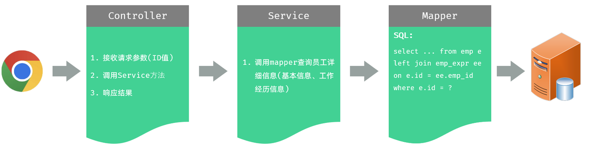
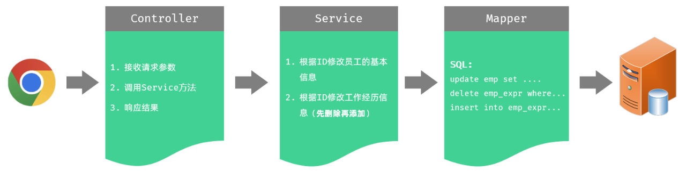
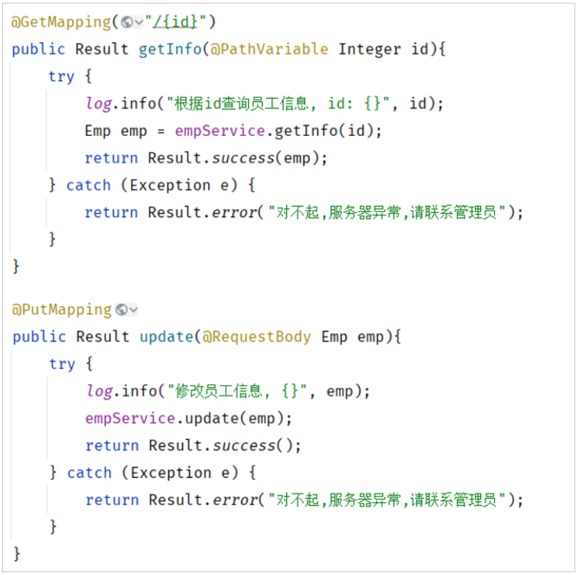
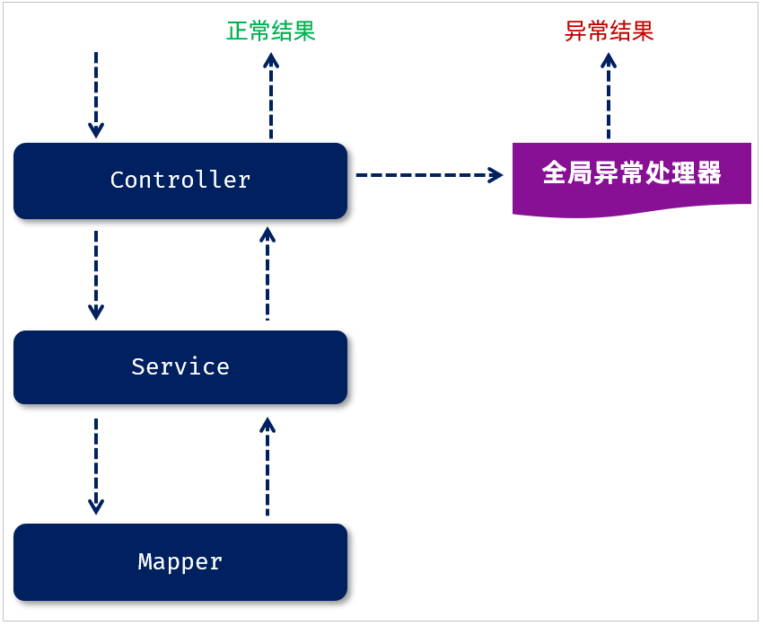

# 第十章：后端 Web 实战（员工管理）

**目录：**

[TOC]

---

我们已经完成了员工管理中的列表查询、新增员工的功能，那关于员工管理还有两个功能，分别是：修改员工、删除员工。

除了员工管理的功能以外，我们还要完成员工信息统计的功能，包括：员工职位统计、员工性别统计。

## 一、删除员工

### 1.1 需求


当我们勾选列表前面的复选框，然后点击“批量删除”按钮，就可以将这一批次的员工信息删除掉了；也可以只勾选一个复选框，仅删除一个员工信息。

### 1.2 接口文档

参照接口文档。

### 1.3 思路分析


### 1.4 功能开发

#### 1.4.1 Controller 层

首先考虑 Controller 接收参数的问题。

在 `EmpController` 中增加如下方法 `delete`，来执行批量删除员工的操作。

1). 方式一：在 Controller 方法中通过数组来接收

多个参数，默认可以将其封装到一个数组中，需要保证前端传递的参数名与方法形参名称保持一致。

```java
/* controller/EmpController.java */

package com.anxin_hitsz.controller;

import com.anxin_hitsz.pojo.Emp;
import com.anxin_hitsz.pojo.EmpQueryParam;
import com.anxin_hitsz.pojo.PageResult;
import com.anxin_hitsz.pojo.Result;
import com.anxin_hitsz.service.EmpService;
import lombok.extern.slf4j.Slf4j;
import org.springframework.beans.factory.annotation.Autowired;
import org.springframework.format.annotation.DateTimeFormat;
import org.springframework.web.bind.annotation.*;

import java.time.LocalDate;
import java.util.Arrays;
import java.util.List;

/**
 * ClassName: EmpController
 * Package: com.anxin_hitsz.controller
 * Description:
 *
 * @Author AnXin
 * @Create 2026/3/10 16:33
 * @Version 1.0
 */

/**
 * 员工管理 Controller
 */
@RequestMapping("/emps")
@Slf4j
@RestController
public class EmpController {

    @Autowired
    private EmpService empService;

    /**
     * 分页查询
     */
//    @GetMapping
//    public Result page(@RequestParam(defaultValue = "1") Integer page,
//                       @RequestParam(defaultValue = "10") Integer pageSize,
//                       String name,
//                       Integer gender,
//                       @DateTimeFormat(pattern = "yyyy-MM-dd") LocalDate begin,
//                       @DateTimeFormat(pattern = "yyyy-MM-dd") LocalDate end) {
//        log.info("分页查询: {}, {}, {}, {}, {}, {}", page, pageSize, name, gender, begin, end);
//        PageResult<Emp> pageResult = empService.page(page, pageSize, name, gender, begin, end);
//        return Result.success(pageResult);
//    }

    /**
     * 分页查询
     */
    @GetMapping
    public Result page(EmpQueryParam empQueryParam) {
        log.info("分页查询: {}", empQueryParam);
        PageResult<Emp> pageResult = empService.page(empQueryParam);
        return Result.success(pageResult);
    }

    /**
     * 新增员工
     */
    @PostMapping
    public Result save(@RequestBody Emp emp) {
        log.info("新增员工: {}", emp);
        empService.save(emp);
        return Result.success();
    }

    /**
     * 删除员工 - 数组
     */
    @DeleteMapping
    public Result delete(Integer[] ids) {
        log.info("删除员工: {}", Arrays.toString(ids));
        return Result.success();
    }

}

```

2). 方法二：在 Controller 方法中通过集合来接收

多个参数，也可以将其封装到一个 `List<Integer>` 集合中。如果要将其封装到一个集合中，需要在集合前面加上 `@RequestParam` 注解，且该 `@RequestParam` 注解是不可省略的。

```java
/* controller/EmpController.java */

package com.anxin_hitsz.controller;

import com.anxin_hitsz.pojo.Emp;
import com.anxin_hitsz.pojo.EmpQueryParam;
import com.anxin_hitsz.pojo.PageResult;
import com.anxin_hitsz.pojo.Result;
import com.anxin_hitsz.service.EmpService;
import lombok.extern.slf4j.Slf4j;
import org.springframework.beans.factory.annotation.Autowired;
import org.springframework.format.annotation.DateTimeFormat;
import org.springframework.web.bind.annotation.*;

import java.time.LocalDate;
import java.util.Arrays;
import java.util.List;

/**
 * ClassName: EmpController
 * Package: com.anxin_hitsz.controller
 * Description:
 *
 * @Author AnXin
 * @Create 2026/3/10 16:33
 * @Version 1.0
 */

/**
 * 员工管理 Controller
 */
@RequestMapping("/emps")
@Slf4j
@RestController
public class EmpController {

    @Autowired
    private EmpService empService;

    /**
     * 分页查询
     */
//    @GetMapping
//    public Result page(@RequestParam(defaultValue = "1") Integer page,
//                       @RequestParam(defaultValue = "10") Integer pageSize,
//                       String name,
//                       Integer gender,
//                       @DateTimeFormat(pattern = "yyyy-MM-dd") LocalDate begin,
//                       @DateTimeFormat(pattern = "yyyy-MM-dd") LocalDate end) {
//        log.info("分页查询: {}, {}, {}, {}, {}, {}", page, pageSize, name, gender, begin, end);
//        PageResult<Emp> pageResult = empService.page(page, pageSize, name, gender, begin, end);
//        return Result.success(pageResult);
//    }

    /**
     * 分页查询
     */
    @GetMapping
    public Result page(EmpQueryParam empQueryParam) {
        log.info("分页查询: {}", empQueryParam);
        PageResult<Emp> pageResult = empService.page(empQueryParam);
        return Result.success(pageResult);
    }

    /**
     * 新增员工
     */
    @PostMapping
    public Result save(@RequestBody Emp emp) {
        log.info("新增员工: {}", emp);
        empService.save(emp);
        return Result.success();
    }

    /**
     * 删除员工 - 数组
     */
//    @DeleteMapping
//    public Result delete(Integer[] ids) {
//        log.info("删除员工: {}", Arrays.toString(ids));
//        return Result.success();
//    }

    /**
     * 删除员工 - List
     */
    @DeleteMapping
    public Result delete(@RequestParam List<Integer> ids) {
        log.info("删除员工: {}", ids);
        return Result.success();
    }

}

```

两种方式，选择其中一种就可以。我们一般推荐选择集合，因为基于集合操作其中的元素会更加方便。

接下来，在 Controller 层中调用 Service 层，代码如下所示：
```java
/* controller/EmpController.java */

package com.anxin_hitsz.controller;

import com.anxin_hitsz.pojo.Emp;
import com.anxin_hitsz.pojo.EmpQueryParam;
import com.anxin_hitsz.pojo.PageResult;
import com.anxin_hitsz.pojo.Result;
import com.anxin_hitsz.service.EmpService;
import lombok.extern.slf4j.Slf4j;
import org.springframework.beans.factory.annotation.Autowired;
import org.springframework.format.annotation.DateTimeFormat;
import org.springframework.web.bind.annotation.*;

import java.time.LocalDate;
import java.util.Arrays;
import java.util.List;

/**
 * ClassName: EmpController
 * Package: com.anxin_hitsz.controller
 * Description:
 *
 * @Author AnXin
 * @Create 2026/3/10 16:33
 * @Version 1.0
 */

/**
 * 员工管理 Controller
 */
@RequestMapping("/emps")
@Slf4j
@RestController
public class EmpController {

    @Autowired
    private EmpService empService;

    /**
     * 分页查询
     */
//    @GetMapping
//    public Result page(@RequestParam(defaultValue = "1") Integer page,
//                       @RequestParam(defaultValue = "10") Integer pageSize,
//                       String name,
//                       Integer gender,
//                       @DateTimeFormat(pattern = "yyyy-MM-dd") LocalDate begin,
//                       @DateTimeFormat(pattern = "yyyy-MM-dd") LocalDate end) {
//        log.info("分页查询: {}, {}, {}, {}, {}, {}", page, pageSize, name, gender, begin, end);
//        PageResult<Emp> pageResult = empService.page(page, pageSize, name, gender, begin, end);
//        return Result.success(pageResult);
//    }

    /**
     * 分页查询
     */
    @GetMapping
    public Result page(EmpQueryParam empQueryParam) {
        log.info("分页查询: {}", empQueryParam);
        PageResult<Emp> pageResult = empService.page(empQueryParam);
        return Result.success(pageResult);
    }

    /**
     * 新增员工
     */
    @PostMapping
    public Result save(@RequestBody Emp emp) {
        log.info("新增员工: {}", emp);
        empService.save(emp);
        return Result.success();
    }

    /**
     * 删除员工 - 数组
     */
//    @DeleteMapping
//    public Result delete(Integer[] ids) {
//        log.info("删除员工: {}", Arrays.toString(ids));
//        return Result.success();
//    }

    /**
     * 删除员工 - List
     */
    @DeleteMapping
    public Result delete(@RequestParam List<Integer> ids) {
        log.info("删除员工: {}", ids);
        empService.delete(ids);
        return Result.success();
    }

}

```

#### 1.4.2 Service 层

1). 在接口 `EmpService` 中定义接口方法 `deleteByIds`

```java
/* service/EmpService.java */

package com.anxin_hitsz.service;

import com.anxin_hitsz.pojo.Emp;
import com.anxin_hitsz.pojo.EmpQueryParam;
import com.anxin_hitsz.pojo.PageResult;

import java.time.LocalDate;
import java.util.List;

/**
 * ClassName: EmpService
 * Package: com.anxin_hitsz.service
 * Description:
 *
 * @Author AnXin
 * @Create 2026/3/10 16:31
 * @Version 1.0
 */
public interface EmpService {

    /**
     * 分页查询
     */
    PageResult<Emp> page(EmpQueryParam empQueryParam);

    /**
     * 新增员工信息
     */
    void save(Emp emp);

    /**
     * 批量删除员工
     */
    void delete(List<Integer> ids);

    /**
     * 分页查询
     * @param page 页码
     * @param pageSize 每页记录数
     */
//    PageResult<Emp> page(Integer page, Integer pageSize, String name, Integer gender, LocalDate begin, LocalDate end);

}

```

2). 在实现类 `EmpServiceImpl` 中实现接口方法 `deleteByIds`

在删除员工信息时，既需要删除 emp 表中的员工基本信息，还需要删除 emp_expr 表中员工的工作经历信息。

```java
/* service/impl/EmpServiceImpl.java */

package com.anxin_hitsz.service.impl;

import com.anxin_hitsz.mapper.EmpExprMapper;
import com.anxin_hitsz.mapper.EmpLogMapper;
import com.anxin_hitsz.mapper.EmpMapper;
import com.anxin_hitsz.pojo.*;
import com.anxin_hitsz.service.EmpLogService;
import com.anxin_hitsz.service.EmpService;
import com.github.pagehelper.Page;
import com.github.pagehelper.PageHelper;
import org.springframework.beans.factory.annotation.Autowired;
import org.springframework.stereotype.Service;
import org.springframework.transaction.annotation.Transactional;
import org.springframework.util.CollectionUtils;

import java.time.LocalDate;
import java.time.LocalDateTime;
import java.util.List;

/**
 * ClassName: EmpServiceImpl
 * Package: com.anxin_hitsz.service.impl
 * Description:
 *
 * @Author AnXin
 * @Create 2026/3/10 16:31
 * @Version 1.0
 */
@Service
public class EmpServiceImpl implements EmpService {

    @Autowired
    private EmpMapper empMapper;
    @Autowired
    private EmpExprMapper empExprMapper;
    @Autowired
    private EmpLogService empLogService;

    /**
     * 原始分页查询
     * @param page 页码
     * @param pageSize 每页记录数
     * @return
     */
//    @Override
//    public PageResult<Emp> page(Integer page, Integer pageSize) {
//        // 1. 调用 Mapper 接口，查询总记录数
//        Long total = empMapper.count();
//
//        // 2. 调用 Mapper 接口，查询结果列表
//        Integer start = (page - 1) * pageSize;
//        List<Emp> rows = empMapper.list(start, pageSize);
//
//        // 3. 封装结果 PageResult
//        return new PageResult<Emp>(total, rows);
//    }

    /**
     * PageHelper 分页查询
     * @param page 页码
     * @param pageSize 每页记录数
     * 注意事项：
     *         1. 定义的 SQL 语句结尾不能加分号 “;”
     *         2. PageHelper 仅仅能够对紧跟在其后的第一个查询语句进行分页处理
     */
//    @Override
//    public PageResult<Emp> page(Integer page, Integer pageSize, String name, Integer gender, LocalDate begin, LocalDate end) {
//        // 1. 设置分页参数（PageHelper）
//        PageHelper.startPage(page, pageSize);
//
//        // 2. 执行查询
//        List<Emp> empList = empMapper.list(name, gender, begin, end);
//
//        // 3. 解析查询结果，并封装
//        Page<Emp> p = (Page<Emp>) empList;
//        return new PageResult<Emp>(p.getTotal(), p.getResult());
//    }

    @Override
    public PageResult<Emp> page(EmpQueryParam empQueryParam) {
        // 1. 设置分页参数（PageHelper）
        PageHelper.startPage(empQueryParam.getPage(), empQueryParam.getPageSize());

        // 2. 执行查询
        List<Emp> empList = empMapper.list(empQueryParam);

        // 3. 解析查询结果，并封装
        Page<Emp> p = (Page<Emp>) empList;
        return new PageResult<Emp>(p.getTotal(), p.getResult());
    }

    @Transactional(rollbackFor = {Exception.class})  // 事务管理 - 默认出现运行时异常 RuntimeException 才会回滚
    @Override
    public void save(Emp emp) {
        try {
            // 1. 保存员工基本信息
            emp.setCreateTime(LocalDateTime.now());
            emp.setUpdateTime(LocalDateTime.now());
            empMapper.insert(emp);

            // 2. 保存员工工作经历信息
            List<EmpExpr> exprList = emp.getExprList();
            if (!CollectionUtils.isEmpty(exprList)) {
                // 遍历集合，为 empId 赋值
                exprList.forEach(empExpr -> {
                    empExpr.setEmpId(emp.getId());
                });
                empExprMapper.insertBatch(exprList);
            }
        } finally {
            // 记录操作日志
            EmpLog empLog = new EmpLog(null, LocalDateTime.now(), "新增员工：" + emp);
            empLogService.insertLog(empLog);
        }
    }

    @Transactional(rollbackFor = {Exception.class})
    @Override
    public void delete(List<Integer> ids) {
        // 1. 批量删除员工基本信息
        empMapper.deleteByIds(ids);

        // 2. 批量删除员工的工作经历信息
        empExprMapper.deleteByEmpIds(ids);
    }

}

```

> 注意：
>
> 由于删除员工信息时，既要删除员工基本信息，又要删除员工工作经历信息，操作多次数据库的删除，所以这里需要进行**事务控制**。

#### 1.4.3 Mapper 层

1). 在 `EmpMapper` 接口中增加 `deleteByIds` 方法，实现批量删除员工基本信息

```java
/* mapper/EmpMapper.java */

package com.anxin_hitsz.mapper;

/**
 * ClassName: EmpMapper
 * Package: com.anxin_hitsz.mapper
 * Description:
 *
 * @Author AnXin
 * @Create 2026/3/10 16:30
 * @Version 1.0
 */

import com.anxin_hitsz.pojo.Emp;
import com.anxin_hitsz.pojo.EmpQueryParam;
import org.apache.ibatis.annotations.Insert;
import org.apache.ibatis.annotations.Mapper;
import org.apache.ibatis.annotations.Options;
import org.apache.ibatis.annotations.Select;

import java.time.LocalDate;
import java.util.List;

/**
 * 员工信息
 */
@Mapper
public interface EmpMapper {

    // ------------------------------ 原始分页查询实现 ------------------------------
    /**
     * 查询总记录数
     */
//    @Select("select count(*) from emp e left join dept d on e.dept_id = d.id")
//    public Long count();

    /**
     * 分页查询
     */
//    @Select("select e.*, d.name deptName from emp e left join dept d on e.dept_id = d.id " +
//            "order by e.update_time desc limit #{start}, #{pageSize}")
//    public List<Emp> list(Integer start, Integer pageSize);


//    @Select("select e.*, d.name deptName from emp e left join dept d on e.dept_id = d.id order by e.update_time desc")
//    public List<Emp> list(String name, Integer gender, LocalDate begin, LocalDate end);

    /**
     * 条件查询员工信息
     */
    public List<Emp> list(EmpQueryParam empQueryParam);

    /**
     * 新增员工基本信息
     */
    @Options(useGeneratedKeys = true, keyProperty = "id")   // 获取到生成的主键 - 主键返回
    @Insert("insert into emp (username, name, gender, phone, job, salary, image, entry_date, dept_id, create_time, update_time)" +
            " values (#{username}, #{name}, #{gender}, #{phone}, #{job}, #{salary}, #{image}, #{entryDate}, #{deptId}, #{createTime}, #{updateTime})")
    void insert(Emp emp);

    /**
     * 根据 ID 批量删除员工的基本信息
     */
    void deleteByIds(List<Integer> ids);
}

```

2). 在 EmpMapper.xml 配置文件中，配置对应的 SQL 语句

```xml
<!-- EmpMapper.xml -->

<?xml version="1.0" encoding="UTF-8" ?>
<!DOCTYPE mapper
        PUBLIC "-//mybatis.org//DTD Mapper 3.0//EN"
        "http://mybatis.org/dtd/mybatis-3-mapper.dtd">
<mapper namespace="com.anxin_hitsz.mapper.EmpMapper">
    <!-- 批量删除员工基本信息 -->
    <delete id="deleteByIds">
        delete from emp where id in
        <foreach collection="ids" item="id" separator="," open="(" close=")">
            #{id}
        </foreach>
    </delete>

    <select id="list" resultType="com.anxin_hitsz.pojo.Emp">
        select e.*, d.name deptName from emp e left join dept d on e.dept_id = d.id
        <where>
            <if test="name != null and name != ''">
                e.name like concat('%', #{name}, '%')
            </if>
            <if test="gender != null">
                and e.gender = #{gender}
            </if>
            <if test="begin != null and end != null">
                and e.entry_date between #{begin} and #{end}
            </if>
        </where>
        order by e.update_time desc
    </select>

</mapper>
```

3). 在 `EmpExprMapper` 接口中增加 `deleteByEmpIds` 方法，实现根据员工 ID 批量删除员工的工作经历信息

```java
/* mapper/EmpExprMapper.java */

package com.anxin_hitsz.mapper;

import com.anxin_hitsz.pojo.EmpExpr;
import org.apache.ibatis.annotations.Mapper;

import java.util.List;

/**
 * ClassName: EmpExprMapper
 * Package: com.anxin_hitsz.mapper
 * Description:
 *
 * @Author AnXin
 * @Create 2026/3/10 16:30
 * @Version 1.0
 */

/**
 * 员工工作经历
 */
@Mapper
public interface EmpExprMapper {
    /**
     * 批量保存员工的工作经历信息
     */
    void insertBatch(List<EmpExpr> exprList);

    /**
     * 根据员工 ID 批量删除员工工作经历
     */
    void deleteByEmpIds(List<Integer> empIds);
}

```

4). 在 EmpExprMapper.xml 配置文件中，配置对应的 SQL 语句

```xml
<!-- EmpExprMapper.xml -->

<?xml version="1.0" encoding="UTF-8" ?>
<!DOCTYPE mapper
        PUBLIC "-//mybatis.org//DTD Mapper 3.0//EN"
        "http://mybatis.org/dtd/mybatis-3-mapper.dtd">
<mapper namespace="com.anxin_hitsz.mapper.EmpExprMapper">

    <!-- 批量保存员工工作经历信息
        foreach 标签：
            collection：遍历的集合
            item：遍历出来的元素
            separator：每次循环之间的分隔符
    -->
    <insert id="insertBatch">
        insert into emp_expr (emp_id, begin, end, company, job) values
        <foreach collection="exprList" item="expr" separator=",">
            (#{expr.empId}, #{expr.begin}, #{expr.end}, #{expr.company}, #{expr.job})
        </foreach>
    </insert>

    <!-- 根据员工 ID 批量删除员工工作经历 -->
    <delete id="deleteByEmpIds">
        delete from emp_expr where emp_id in
        <foreach collection="empIds" item="empId" separator="," open="(" close=")">
            #{empId}
        </foreach>
    </delete>

</mapper>
```

### 1.5 功能测试

功能开发完成后，重启项目工程，打开 Apifox，发起 DELETE 请求。

观察控制台输出的 SQL 语句。

### 1.6 前后端联调

打开浏览器，测试后端功能接口。

## 二、修改员工

在进行修改员工信息的时候，我们首先先要根据员工的 ID 查询员工的详细信息用于页面回显展示，然后用户修改员工数据之后，点击保存按钮，就可以将修改的数据提交到服务端，保存到数据库。具体操作为：
1. 根据 ID 查询员工信息。
2. 保存修改的员工信息。

### 2.1 查询回显

#### 2.1.1 接口描述

参照接口文档。

#### 2.1.2 思路分析

在查询回显时，既需要查询出员工的基本信息，又需要查询出员工的工作经历信息。

具体的实现思路如下：


#### 2.1.3 代码实现

1). `EmpController` 添加 `getInfo` 方法用来根据 ID 查询员工数据，用于页面回显

```java
/* controller/EmpController.java */

package com.anxin_hitsz.controller;

import com.anxin_hitsz.pojo.Emp;
import com.anxin_hitsz.pojo.EmpQueryParam;
import com.anxin_hitsz.pojo.PageResult;
import com.anxin_hitsz.pojo.Result;
import com.anxin_hitsz.service.EmpService;
import lombok.extern.slf4j.Slf4j;
import org.springframework.beans.factory.annotation.Autowired;
import org.springframework.format.annotation.DateTimeFormat;
import org.springframework.web.bind.annotation.*;

import java.time.LocalDate;
import java.util.Arrays;
import java.util.List;

/**
 * ClassName: EmpController
 * Package: com.anxin_hitsz.controller
 * Description:
 *
 * @Author AnXin
 * @Create 2026/3/10 16:33
 * @Version 1.0
 */

/**
 * 员工管理 Controller
 */
@RequestMapping("/emps")
@Slf4j
@RestController
public class EmpController {

    @Autowired
    private EmpService empService;

    /**
     * 分页查询
     */
//    @GetMapping
//    public Result page(@RequestParam(defaultValue = "1") Integer page,
//                       @RequestParam(defaultValue = "10") Integer pageSize,
//                       String name,
//                       Integer gender,
//                       @DateTimeFormat(pattern = "yyyy-MM-dd") LocalDate begin,
//                       @DateTimeFormat(pattern = "yyyy-MM-dd") LocalDate end) {
//        log.info("分页查询: {}, {}, {}, {}, {}, {}", page, pageSize, name, gender, begin, end);
//        PageResult<Emp> pageResult = empService.page(page, pageSize, name, gender, begin, end);
//        return Result.success(pageResult);
//    }

    /**
     * 分页查询
     */
    @GetMapping
    public Result page(EmpQueryParam empQueryParam) {
        log.info("分页查询: {}", empQueryParam);
        PageResult<Emp> pageResult = empService.page(empQueryParam);
        return Result.success(pageResult);
    }

    /**
     * 新增员工
     */
    @PostMapping
    public Result save(@RequestBody Emp emp) {
        log.info("新增员工: {}", emp);
        empService.save(emp);
        return Result.success();
    }

    /**
     * 删除员工 - 数组
     */
//    @DeleteMapping
//    public Result delete(Integer[] ids) {
//        log.info("删除员工: {}", Arrays.toString(ids));
//        return Result.success();
//    }

    /**
     * 删除员工 - List
     */
    @DeleteMapping
    public Result delete(@RequestParam List<Integer> ids) {
        log.info("删除员工: {}", ids);
        empService.delete(ids);
        return Result.success();
    }

    /**
     * 根据 ID 查询员工信息
     */
    @GetMapping("/{id}")
    public Result getInfo(@PathVariable Integer id) {
        log.info("根据 ID 查询员工信息: {}", id);
        Emp emp = empService.getInfo(id);
        return Result.success(emp);
    }

}

```

2). `EmpService` 接口中增加 `getInfo` 方法

```java
/* service/EmpService.java */

package com.anxin_hitsz.service;

import com.anxin_hitsz.pojo.Emp;
import com.anxin_hitsz.pojo.EmpQueryParam;
import com.anxin_hitsz.pojo.PageResult;

import java.time.LocalDate;
import java.util.List;

/**
 * ClassName: EmpService
 * Package: com.anxin_hitsz.service
 * Description:
 *
 * @Author AnXin
 * @Create 2026/3/10 16:31
 * @Version 1.0
 */
public interface EmpService {

    /**
     * 分页查询
     */
    PageResult<Emp> page(EmpQueryParam empQueryParam);

    /**
     * 新增员工信息
     */
    void save(Emp emp);

    /**
     * 批量删除员工
     */
    void delete(List<Integer> ids);

    /**
     * 根据 ID 查询员工
     */
    Emp getInfo(Integer id);

    /**
     * 分页查询
     * @param page 页码
     * @param pageSize 每页记录数
     */
//    PageResult<Emp> page(Integer page, Integer pageSize, String name, Integer gender, LocalDate begin, LocalDate end);

}

```

3). `EmpServiceImpl` 实现类中实现 `getInfo` 方法

```java
/* service/impl/EmpServiceImpl.java */

package com.anxin_hitsz.service.impl;

import com.anxin_hitsz.mapper.EmpExprMapper;
import com.anxin_hitsz.mapper.EmpLogMapper;
import com.anxin_hitsz.mapper.EmpMapper;
import com.anxin_hitsz.pojo.*;
import com.anxin_hitsz.service.EmpLogService;
import com.anxin_hitsz.service.EmpService;
import com.github.pagehelper.Page;
import com.github.pagehelper.PageHelper;
import org.springframework.beans.factory.annotation.Autowired;
import org.springframework.stereotype.Service;
import org.springframework.transaction.annotation.Transactional;
import org.springframework.util.CollectionUtils;

import java.time.LocalDate;
import java.time.LocalDateTime;
import java.util.List;

/**
 * ClassName: EmpServiceImpl
 * Package: com.anxin_hitsz.service.impl
 * Description:
 *
 * @Author AnXin
 * @Create 2026/3/10 16:31
 * @Version 1.0
 */
@Service
public class EmpServiceImpl implements EmpService {

    @Autowired
    private EmpMapper empMapper;
    @Autowired
    private EmpExprMapper empExprMapper;
    @Autowired
    private EmpLogService empLogService;

    /**
     * 原始分页查询
     * @param page 页码
     * @param pageSize 每页记录数
     * @return
     */
//    @Override
//    public PageResult<Emp> page(Integer page, Integer pageSize) {
//        // 1. 调用 Mapper 接口，查询总记录数
//        Long total = empMapper.count();
//
//        // 2. 调用 Mapper 接口，查询结果列表
//        Integer start = (page - 1) * pageSize;
//        List<Emp> rows = empMapper.list(start, pageSize);
//
//        // 3. 封装结果 PageResult
//        return new PageResult<Emp>(total, rows);
//    }

    /**
     * PageHelper 分页查询
     * @param page 页码
     * @param pageSize 每页记录数
     * 注意事项：
     *         1. 定义的 SQL 语句结尾不能加分号 “;”
     *         2. PageHelper 仅仅能够对紧跟在其后的第一个查询语句进行分页处理
     */
//    @Override
//    public PageResult<Emp> page(Integer page, Integer pageSize, String name, Integer gender, LocalDate begin, LocalDate end) {
//        // 1. 设置分页参数（PageHelper）
//        PageHelper.startPage(page, pageSize);
//
//        // 2. 执行查询
//        List<Emp> empList = empMapper.list(name, gender, begin, end);
//
//        // 3. 解析查询结果，并封装
//        Page<Emp> p = (Page<Emp>) empList;
//        return new PageResult<Emp>(p.getTotal(), p.getResult());
//    }

    @Override
    public PageResult<Emp> page(EmpQueryParam empQueryParam) {
        // 1. 设置分页参数（PageHelper）
        PageHelper.startPage(empQueryParam.getPage(), empQueryParam.getPageSize());

        // 2. 执行查询
        List<Emp> empList = empMapper.list(empQueryParam);

        // 3. 解析查询结果，并封装
        Page<Emp> p = (Page<Emp>) empList;
        return new PageResult<Emp>(p.getTotal(), p.getResult());
    }

    @Transactional(rollbackFor = {Exception.class})  // 事务管理 - 默认出现运行时异常 RuntimeException 才会回滚
    @Override
    public void save(Emp emp) {
        try {
            // 1. 保存员工基本信息
            emp.setCreateTime(LocalDateTime.now());
            emp.setUpdateTime(LocalDateTime.now());
            empMapper.insert(emp);

            // 2. 保存员工工作经历信息
            List<EmpExpr> exprList = emp.getExprList();
            if (!CollectionUtils.isEmpty(exprList)) {
                // 遍历集合，为 empId 赋值
                exprList.forEach(empExpr -> {
                    empExpr.setEmpId(emp.getId());
                });
                empExprMapper.insertBatch(exprList);
            }
        } finally {
            // 记录操作日志
            EmpLog empLog = new EmpLog(null, LocalDateTime.now(), "新增员工：" + emp);
            empLogService.insertLog(empLog);
        }
    }

    @Transactional(rollbackFor = {Exception.class})
    @Override
    public void delete(List<Integer> ids) {
        // 1. 批量删除员工基本信息
        empMapper.deleteByIds(ids);

        // 2. 批量删除员工的工作经历信息
        empExprMapper.deleteByEmpIds(ids);
    }

    @Override
    public Emp getInfo(Integer id) {
        return empMapper.getById(id);
    }

}

```

4). `EmpMapper` 接口中增加 `getById` 方法

```java
/* mapper/EmpMapper.java */

package com.anxin_hitsz.mapper;

/**
 * ClassName: EmpMapper
 * Package: com.anxin_hitsz.mapper
 * Description:
 *
 * @Author AnXin
 * @Create 2026/3/10 16:30
 * @Version 1.0
 */

import com.anxin_hitsz.pojo.Emp;
import com.anxin_hitsz.pojo.EmpQueryParam;
import org.apache.ibatis.annotations.Insert;
import org.apache.ibatis.annotations.Mapper;
import org.apache.ibatis.annotations.Options;
import org.apache.ibatis.annotations.Select;

import java.time.LocalDate;
import java.util.List;

/**
 * 员工信息
 */
@Mapper
public interface EmpMapper {

    // ------------------------------ 原始分页查询实现 ------------------------------
    /**
     * 查询总记录数
     */
//    @Select("select count(*) from emp e left join dept d on e.dept_id = d.id")
//    public Long count();

    /**
     * 分页查询
     */
//    @Select("select e.*, d.name deptName from emp e left join dept d on e.dept_id = d.id " +
//            "order by e.update_time desc limit #{start}, #{pageSize}")
//    public List<Emp> list(Integer start, Integer pageSize);


//    @Select("select e.*, d.name deptName from emp e left join dept d on e.dept_id = d.id order by e.update_time desc")
//    public List<Emp> list(String name, Integer gender, LocalDate begin, LocalDate end);

    /**
     * 条件查询员工信息
     */
    public List<Emp> list(EmpQueryParam empQueryParam);

    /**
     * 新增员工基本信息
     */
    @Options(useGeneratedKeys = true, keyProperty = "id")   // 获取到生成的主键 - 主键返回
    @Insert("insert into emp (username, name, gender, phone, job, salary, image, entry_date, dept_id, create_time, update_time)" +
            " values (#{username}, #{name}, #{gender}, #{phone}, #{job}, #{salary}, #{image}, #{entryDate}, #{deptId}, #{createTime}, #{updateTime})")
    void insert(Emp emp);

    /**
     * 根据 ID 批量删除员工的基本信息
     */
    void deleteByIds(List<Integer> ids);

    /**
     * 根据 ID 查询员工信息以及工作经历信息
     */
    Emp getById(Integer id);
}

```

5). EmpMapper.xml 配置文件中定义对应的 SQL

```xml
<!-- EmpMapper.xml -->

<?xml version="1.0" encoding="UTF-8" ?>
<!DOCTYPE mapper
        PUBLIC "-//mybatis.org//DTD Mapper 3.0//EN"
        "http://mybatis.org/dtd/mybatis-3-mapper.dtd">
<mapper namespace="com.anxin_hitsz.mapper.EmpMapper">
    <!-- 批量删除员工基本信息 -->
    <delete id="deleteByIds">
        delete from emp where id in
        <foreach collection="ids" item="id" separator="," open="(" close=")">
            #{id}
        </foreach>
    </delete>

    <select id="list" resultType="com.anxin_hitsz.pojo.Emp">
        select e.*, d.name deptName from emp e left join dept d on e.dept_id = d.id
        <where>
            <if test="name != null and name != ''">
                e.name like concat('%', #{name}, '%')
            </if>
            <if test="gender != null">
                and e.gender = #{gender}
            </if>
            <if test="begin != null and end != null">
                and e.entry_date between #{begin} and #{end}
            </if>
        </where>
        order by e.update_time desc
    </select>

    <!-- 定义 ResultMap -->
    <resultMap id="empResultMap" type="com.anxin_hitsz.pojo.Emp">
        <id column="id" property="id"/>
        <result column="username" property="username"/>
        <result column="password" property="password"/>
        <result column="name" property="name"/>
        <result column="gender" property="gender"/>
        <result column="phone" property="phone"/>
        <result column="job" property="job"/>
        <result column="salary" property="salary"/>
        <result column="image" property="image"/>
        <result column="entry_date" property="entryDate"/>
        <result column="dept_id" property="deptId"/>
        <result column="create_time" property="createTime"/>
        <result column="update_time" property="updateTime"/>

        <!-- 封装工作经历信息 -->
        <collection property="exprList" ofType="com.anxin_hitsz.pojo.EmpExpr">
            <id column="ee_id" property="id"/>
            <result column="ee_empid" property="empId"/>
            <result column="ee_begin" property="begin"/>
            <result column="ee_end" property="end"/>
            <result column="ee_company" property="company"/>
            <result column="ee_job" property="job"/>
        </collection>
    </resultMap>

    <!-- 根据 ID 查询员工基本信息以及员工的工作经历信息 -->
    <select id="getById" resultMap="empResultMap">
        select
            e.*,
            ee.id ee_id,
            ee.emp_id ee_empid,
            ee.begin ee_begin,
            ee.end ee_end,
            ee.company ee_company,
            ee.job ee_job
        from emp e left join emp_expr ee on e.id = ee.emp_id
        where e.id =#{id}
    </select>

</mapper>
```

在这种一对多的查询中，我们要想成功封装结果，需要手动地基于 `<resultMap>` 来进行封装结果。

> 注意：
>
> MyBatis 中封装查询结果，什么时候用 `resultType`，什么时候用 `resultMap`？
> * 如果查询返回的字段名与实体的属性名可以直接对应上，用 `resultType`。
> * 如果查询返回的字段名与实体的属性名对应不上，或实体属性比较复杂，可以通过 `resultMap` 手动封装。

#### 2.1.4 Apifox 测试

重新启动服务，基于 Apifox 进行接口测试。

#### 2.1.5 前后端联调测试

打开浏览器，进行前后端联调测试。

### 2.2 修改员工

查询回显之后，就可以在页面上修改员工的信息了。
* 当用户修改完数据之后，点击保存按钮，就需要将数据提交到服务端，然后服务端需要将修改后的数据更新到数据库中。
* 而此次更新的时候，既需要更新员工的基本信息，又需要更新员工的工作经历信息。

#### 2.2.1 接口描述

参照接口文档。

#### 2.2.2 思路分析



#### 2.2.3 代码实现

1). `EmpController` 增加 `update` 方法接收请求参数，响应数据

```java
/* controller/EmpController.java */

package com.anxin_hitsz.controller;

import com.anxin_hitsz.pojo.Emp;
import com.anxin_hitsz.pojo.EmpQueryParam;
import com.anxin_hitsz.pojo.PageResult;
import com.anxin_hitsz.pojo.Result;
import com.anxin_hitsz.service.EmpService;
import lombok.extern.slf4j.Slf4j;
import org.springframework.beans.factory.annotation.Autowired;
import org.springframework.format.annotation.DateTimeFormat;
import org.springframework.web.bind.annotation.*;

import java.time.LocalDate;
import java.util.Arrays;
import java.util.List;

/**
 * ClassName: EmpController
 * Package: com.anxin_hitsz.controller
 * Description:
 *
 * @Author AnXin
 * @Create 2026/3/10 16:33
 * @Version 1.0
 */

/**
 * 员工管理 Controller
 */
@RequestMapping("/emps")
@Slf4j
@RestController
public class EmpController {

    @Autowired
    private EmpService empService;

    /**
     * 分页查询
     */
//    @GetMapping
//    public Result page(@RequestParam(defaultValue = "1") Integer page,
//                       @RequestParam(defaultValue = "10") Integer pageSize,
//                       String name,
//                       Integer gender,
//                       @DateTimeFormat(pattern = "yyyy-MM-dd") LocalDate begin,
//                       @DateTimeFormat(pattern = "yyyy-MM-dd") LocalDate end) {
//        log.info("分页查询: {}, {}, {}, {}, {}, {}", page, pageSize, name, gender, begin, end);
//        PageResult<Emp> pageResult = empService.page(page, pageSize, name, gender, begin, end);
//        return Result.success(pageResult);
//    }

    /**
     * 分页查询
     */
    @GetMapping
    public Result page(EmpQueryParam empQueryParam) {
        log.info("分页查询: {}", empQueryParam);
        PageResult<Emp> pageResult = empService.page(empQueryParam);
        return Result.success(pageResult);
    }

    /**
     * 新增员工
     */
    @PostMapping
    public Result save(@RequestBody Emp emp) {
        log.info("新增员工: {}", emp);
        empService.save(emp);
        return Result.success();
    }

    /**
     * 删除员工 - 数组
     */
//    @DeleteMapping
//    public Result delete(Integer[] ids) {
//        log.info("删除员工: {}", Arrays.toString(ids));
//        return Result.success();
//    }

    /**
     * 删除员工 - List
     */
    @DeleteMapping
    public Result delete(@RequestParam List<Integer> ids) {
        log.info("删除员工: {}", ids);
        empService.delete(ids);
        return Result.success();
    }

    /**
     * 根据 ID 查询员工信息
     */
    @GetMapping("/{id}")
    public Result getInfo(@PathVariable Integer id) {
        log.info("根据 ID 查询员工信息: {}", id);
        Emp emp = empService.getInfo(id);
        return Result.success(emp);
    }

    /**
     * 修改员工
     */
    @PutMapping
    public Result update(@RequestBody Emp emp) {
        log.info("修改员工: {}", emp);
        empService.update(emp);
        return Result.success();
    }

}

```

2). `EmpService` 接口增加 `update` 方法

```java
/* service/EmpService.java */

package com.anxin_hitsz.service;

import com.anxin_hitsz.pojo.Emp;
import com.anxin_hitsz.pojo.EmpQueryParam;
import com.anxin_hitsz.pojo.PageResult;

import java.time.LocalDate;
import java.util.List;

/**
 * ClassName: EmpService
 * Package: com.anxin_hitsz.service
 * Description:
 *
 * @Author AnXin
 * @Create 2026/3/10 16:31
 * @Version 1.0
 */
public interface EmpService {

    /**
     * 分页查询
     */
    PageResult<Emp> page(EmpQueryParam empQueryParam);

    /**
     * 新增员工信息
     */
    void save(Emp emp);

    /**
     * 批量删除员工
     */
    void delete(List<Integer> ids);

    /**
     * 根据 ID 查询员工
     */
    Emp getInfo(Integer id);

    /**
     * 修改员工
     */
    void update(Emp emp);

    /**
     * 分页查询
     * @param page 页码
     * @param pageSize 每页记录数
     */
//    PageResult<Emp> page(Integer page, Integer pageSize, String name, Integer gender, LocalDate begin, LocalDate end);

}

```

3). `EmpServiceImpl` 实现类实现 `update` 方法

```java
/* service/impl/EmpServiceImpl.java */

package com.anxin_hitsz.service.impl;

import com.anxin_hitsz.mapper.EmpExprMapper;
import com.anxin_hitsz.mapper.EmpLogMapper;
import com.anxin_hitsz.mapper.EmpMapper;
import com.anxin_hitsz.pojo.*;
import com.anxin_hitsz.service.EmpLogService;
import com.anxin_hitsz.service.EmpService;
import com.github.pagehelper.Page;
import com.github.pagehelper.PageHelper;
import org.springframework.beans.factory.annotation.Autowired;
import org.springframework.stereotype.Service;
import org.springframework.transaction.annotation.Transactional;
import org.springframework.util.CollectionUtils;

import java.time.LocalDate;
import java.time.LocalDateTime;
import java.util.Arrays;
import java.util.List;

/**
 * ClassName: EmpServiceImpl
 * Package: com.anxin_hitsz.service.impl
 * Description:
 *
 * @Author AnXin
 * @Create 2026/3/10 16:31
 * @Version 1.0
 */
@Service
public class EmpServiceImpl implements EmpService {

    @Autowired
    private EmpMapper empMapper;
    @Autowired
    private EmpExprMapper empExprMapper;
    @Autowired
    private EmpLogService empLogService;

    /**
     * 原始分页查询
     * @param page 页码
     * @param pageSize 每页记录数
     * @return
     */
//    @Override
//    public PageResult<Emp> page(Integer page, Integer pageSize) {
//        // 1. 调用 Mapper 接口，查询总记录数
//        Long total = empMapper.count();
//
//        // 2. 调用 Mapper 接口，查询结果列表
//        Integer start = (page - 1) * pageSize;
//        List<Emp> rows = empMapper.list(start, pageSize);
//
//        // 3. 封装结果 PageResult
//        return new PageResult<Emp>(total, rows);
//    }

    /**
     * PageHelper 分页查询
     * @param page 页码
     * @param pageSize 每页记录数
     * 注意事项：
     *         1. 定义的 SQL 语句结尾不能加分号 “;”
     *         2. PageHelper 仅仅能够对紧跟在其后的第一个查询语句进行分页处理
     */
//    @Override
//    public PageResult<Emp> page(Integer page, Integer pageSize, String name, Integer gender, LocalDate begin, LocalDate end) {
//        // 1. 设置分页参数（PageHelper）
//        PageHelper.startPage(page, pageSize);
//
//        // 2. 执行查询
//        List<Emp> empList = empMapper.list(name, gender, begin, end);
//
//        // 3. 解析查询结果，并封装
//        Page<Emp> p = (Page<Emp>) empList;
//        return new PageResult<Emp>(p.getTotal(), p.getResult());
//    }

    @Override
    public PageResult<Emp> page(EmpQueryParam empQueryParam) {
        // 1. 设置分页参数（PageHelper）
        PageHelper.startPage(empQueryParam.getPage(), empQueryParam.getPageSize());

        // 2. 执行查询
        List<Emp> empList = empMapper.list(empQueryParam);

        // 3. 解析查询结果，并封装
        Page<Emp> p = (Page<Emp>) empList;
        return new PageResult<Emp>(p.getTotal(), p.getResult());
    }

    @Transactional(rollbackFor = {Exception.class})  // 事务管理 - 默认出现运行时异常 RuntimeException 才会回滚
    @Override
    public void save(Emp emp) {
        try {
            // 1. 保存员工基本信息
            emp.setCreateTime(LocalDateTime.now());
            emp.setUpdateTime(LocalDateTime.now());
            empMapper.insert(emp);

            // 2. 保存员工工作经历信息
            List<EmpExpr> exprList = emp.getExprList();
            if (!CollectionUtils.isEmpty(exprList)) {
                // 遍历集合，为 empId 赋值
                exprList.forEach(empExpr -> {
                    empExpr.setEmpId(emp.getId());
                });
                empExprMapper.insertBatch(exprList);
            }
        } finally {
            // 记录操作日志
            EmpLog empLog = new EmpLog(null, LocalDateTime.now(), "新增员工：" + emp);
            empLogService.insertLog(empLog);
        }
    }

    @Transactional(rollbackFor = {Exception.class})
    @Override
    public void delete(List<Integer> ids) {
        // 1. 批量删除员工基本信息
        empMapper.deleteByIds(ids);

        // 2. 批量删除员工的工作经历信息
        empExprMapper.deleteByEmpIds(ids);
    }

    @Override
    public Emp getInfo(Integer id) {
        return empMapper.getById(id);
    }

    @Transactional(rollbackFor = Exception.class)
    @Override
    public void update(Emp emp) {
        // 1. 根据 ID 修改员工的基本信息
        emp.setUpdateTime(LocalDateTime.now());
        empMapper.updateById(emp);

        // 2. 根据 ID 修改员工的工作经历信息
        // 2.1 先根据员工 ID 删除原有的工作经历
        empExprMapper.deleteByEmpIds(Arrays.asList(emp.getId()));

        // 2.2 再添加这个员工新的工作经历
        List<EmpExpr> exprList = emp.getExprList();
        if (!CollectionUtils.isEmpty(exprList)) {
            exprList.forEach(empExpr -> empExpr.setEmpId(emp.getId()));
            empExprMapper.insertBatch(exprList);
        }

    }

}

```

4). `EmpMapper` 接口中增加 `updateById` 方法

```java
/* mapper/EmpMapper.java */

package com.anxin_hitsz.mapper;

/**
 * ClassName: EmpMapper
 * Package: com.anxin_hitsz.mapper
 * Description:
 *
 * @Author AnXin
 * @Create 2026/3/10 16:30
 * @Version 1.0
 */

import com.anxin_hitsz.pojo.Emp;
import com.anxin_hitsz.pojo.EmpQueryParam;
import org.apache.ibatis.annotations.Insert;
import org.apache.ibatis.annotations.Mapper;
import org.apache.ibatis.annotations.Options;
import org.apache.ibatis.annotations.Select;

import java.time.LocalDate;
import java.util.List;

/**
 * 员工信息
 */
@Mapper
public interface EmpMapper {

    // ------------------------------ 原始分页查询实现 ------------------------------
    /**
     * 查询总记录数
     */
//    @Select("select count(*) from emp e left join dept d on e.dept_id = d.id")
//    public Long count();

    /**
     * 分页查询
     */
//    @Select("select e.*, d.name deptName from emp e left join dept d on e.dept_id = d.id " +
//            "order by e.update_time desc limit #{start}, #{pageSize}")
//    public List<Emp> list(Integer start, Integer pageSize);


//    @Select("select e.*, d.name deptName from emp e left join dept d on e.dept_id = d.id order by e.update_time desc")
//    public List<Emp> list(String name, Integer gender, LocalDate begin, LocalDate end);

    /**
     * 条件查询员工信息
     */
    public List<Emp> list(EmpQueryParam empQueryParam);

    /**
     * 新增员工基本信息
     */
    @Options(useGeneratedKeys = true, keyProperty = "id")   // 获取到生成的主键 - 主键返回
    @Insert("insert into emp (username, name, gender, phone, job, salary, image, entry_date, dept_id, create_time, update_time)" +
            " values (#{username}, #{name}, #{gender}, #{phone}, #{job}, #{salary}, #{image}, #{entryDate}, #{deptId}, #{createTime}, #{updateTime})")
    void insert(Emp emp);

    /**
     * 根据 ID 批量删除员工的基本信息
     */
    void deleteByIds(List<Integer> ids);

    /**
     * 根据 ID 查询员工信息以及工作经历信息
     */
    Emp getById(Integer id);

    /**
     * 根据 ID 更新员工基本信息
     */
    void updateById(Emp emp);
}

```

5). EmpMapper.xml 配置文件中定义对应的 SQL 语句，基于动态 SQL 更新员工信息

```xml
<!-- EmpMapper.xml -->

<?xml version="1.0" encoding="UTF-8" ?>
<!DOCTYPE mapper
        PUBLIC "-//mybatis.org//DTD Mapper 3.0//EN"
        "http://mybatis.org/dtd/mybatis-3-mapper.dtd">
<mapper namespace="com.anxin_hitsz.mapper.EmpMapper">

    <!-- 根据 ID 更新员工基本信息 -->
    <!-- set 标签：1. 会自动生成 set 关键字；2. 会自动删除掉更新字段后多余的 “,” -->
    <update id="updateById">
        update emp
        <set>
            <if test="username != null and username != ''">username = #{username}, </if>
            <if test="password != null and password != ''">password = #{password}, </if>
            <if test="name != null and name != ''">name = #{name}, </if>
            <if test="gender != null">gender = #{gender}, </if>
            <if test="phone != null and phone != ''">phone = #{phone}, </if>
            <if test="job != null">job = #{job}, </if>
            <if test="salary != null">salary = #{salary}, </if>
            <if test="image != null and image != ''">image = #{image}, </if>
            <if test="entryDate != null">entry_date = #{entryDate}, </if>
            <if test="deptId != null">dept_id = #{deptId}, </if>
            <if test="updateTime != null">update_time = #{updateTime}</if>
        </set>
        where id = #{id}
    </update>

    <!-- 批量删除员工基本信息 -->
    <delete id="deleteByIds">
        delete from emp where id in
        <foreach collection="ids" item="id" separator="," open="(" close=")">
            #{id}
        </foreach>
    </delete>

    <select id="list" resultType="com.anxin_hitsz.pojo.Emp">
        select e.*, d.name deptName from emp e left join dept d on e.dept_id = d.id
        <where>
            <if test="name != null and name != ''">
                e.name like concat('%', #{name}, '%')
            </if>
            <if test="gender != null">
                and e.gender = #{gender}
            </if>
            <if test="begin != null and end != null">
                and e.entry_date between #{begin} and #{end}
            </if>
        </where>
        order by e.update_time desc
    </select>

    <!-- 定义 ResultMap -->
    <resultMap id="empResultMap" type="com.anxin_hitsz.pojo.Emp">
        <id column="id" property="id"/>
        <result column="username" property="username"/>
        <result column="password" property="password"/>
        <result column="name" property="name"/>
        <result column="gender" property="gender"/>
        <result column="phone" property="phone"/>
        <result column="job" property="job"/>
        <result column="salary" property="salary"/>
        <result column="image" property="image"/>
        <result column="entry_date" property="entryDate"/>
        <result column="dept_id" property="deptId"/>
        <result column="create_time" property="createTime"/>
        <result column="update_time" property="updateTime"/>

        <!-- 封装工作经历信息 -->
        <collection property="exprList" ofType="com.anxin_hitsz.pojo.EmpExpr">
            <id column="ee_id" property="id"/>
            <result column="ee_empid" property="empId"/>
            <result column="ee_begin" property="begin"/>
            <result column="ee_end" property="end"/>
            <result column="ee_company" property="company"/>
            <result column="ee_job" property="job"/>
        </collection>
    </resultMap>

    <!-- 根据 ID 查询员工基本信息以及员工的工作经历信息 -->
    <select id="getById" resultMap="empResultMap">
        select
            e.*,
            ee.id ee_id,
            ee.emp_id ee_empid,
            ee.begin ee_begin,
            ee.end ee_end,
            ee.company ee_company,
            ee.job ee_job
        from emp e left join emp_expr ee on e.id = ee.emp_id
        where e.id =#{id}
    </select>

</mapper>
```

#### 2.2.4 Apifox 测试

重新启动服务，打开 Apifox 进行接口测试。

#### 2.2.5 前后端联调

打开浏览器，进行前后端联调测试。

编辑员工信息并点击“保存”之后，查看更新后的数据。

## 三、异常处理

### 3.1 问题分析

当我们在修改部门数据的时候，如果输入一个在数据库表中已经存在的手机号，点击“保存”按钮之后，前端提示了错误信息，但是返回的结果并不是统一的响应结果，而是框架默认返回的错误结果。

出现异常之后，最终服务端给前端响应回来的数据是一个 JSON 格式的数据，但这种 JSON 格式的数据并不是我们开发规范中所提到的统一响应结果 `Result`。由于返回的数据不符合开发规范，所以前端并不能解析出响应的 JSON 数据。

当前案例项目没有做任何的异常处理。

当我们没有做任何的异常处理时，我们三层架构处理异常的方案：
1. Mapper 接口在操作数据库的时候出错了，此时异常会往上抛（谁调用 Mapper 就抛给谁），会抛给 Service。
2. Service 中也存在异常了，会抛给 Controller。
3. 而在 Controller 中，我们也没有做任何的异常处理，所以最终异常会再往上抛。最终抛给框架之后，框架就会返回一个 JSON 格式的数据，里面封装的就是错误的信息；但是框架返回的 JSON 格式的数据并不符合我们的开发规范。

### 3.2 解决方案

那么在三层架构项目中，出现了异常，该如何处理？

1). （不推荐）方案一：在所有 Controller 的所有方法中进行 `try ... catch` 处理

缺点：代码臃肿。



2). （推荐）方案二：全局异常处理器

优点：简单、优雅。



### 3.3 全局异常处理器

定义全局异常处理器，即定义一个类，在类上加上一个注解 `@RestControllerAdvice`；加上这个注解，就代表我们定义了一个全局异常处理器。

在全局异常处理器中，需要定义一个方法来捕获异常，在这个方法上需要加上注解 `@ExceptionHandler`。通过 `@ExceptionHandler` 注解中的 `value` 属性来指定我们要捕获的是哪一类型的异常。

示例代码：
```java
/* exception/GlobalExceptionHandler.java */

package com.anxin_hitsz.exception;

import com.anxin_hitsz.pojo.Result;
import lombok.extern.slf4j.Slf4j;
import org.springframework.dao.DuplicateKeyException;
import org.springframework.web.bind.annotation.ExceptionHandler;
import org.springframework.web.bind.annotation.RestControllerAdvice;

/**
 * ClassName: GlobalExceptionHandler
 * Package: com.anxin_hitsz.exception
 * Description:
 *
 * @Author AnXin
 * @Create 2026/3/13 20:58
 * @Version 1.0
 */

/**
 * 全局异常处理器
 */
@Slf4j
@RestControllerAdvice
public class GlobalExceptionHandler {

    @ExceptionHandler
    public Result handleException(Exception e) {
        log.error("程序出错了", e);
        return Result.error("出错了，请联系管理员");
    }

    @ExceptionHandler
    public Result handleDuplicateKeyException(DuplicateKeyException e) {
        log.error("程序出错了", e);
        String message = e.getMessage();
        int i = message.indexOf("Duplicate entry");
        String errMsg = message.substring(i);
        String[] arr = errMsg.split(" ");
        return Result.error(arr[2] + " 已存在");
    }

}

```

> 注意：
> * `@RestControllerAdvice` = `@ControllerAdvice` + `@ResponseBody`。
> * 处理异常的方法返回值会转换为 JSON 后再响应给前端。

重新启动 SpringBoot 服务，打开浏览器，再来测试一下修改员工这个操作。我们依然设置已存在的手机号，此时我们可以看到，出现异常之后，异常已经被全局异常处理器捕获了；而返回的错误信息被前端程序正常解析，然后提示出了对应的错误提示信息。

> 注意：
>
> 以上就是全局异常处理器的使用，主要涉及到两个注解：
> * `@RestControllerAdvice`：表示当前类为全局异常处理器。
> * `@ExceptionHandler`：指定可以捕获哪种类型的异常进行处理。

## 四、员工信息统计

员工管理的增删改查功能我们已开发完成。接下来，我们再来完成员工信息统计的接口开发。对于这些图形报表的开发，其实都是基于线程的一些图形报表的组件开发的；例如：Echarts、HighCharts 等。

而报表的制作，主要由前端开发，引入对应的组件（例如：ECharts）即可；服务端开发仅需为其提供数据即可。

ECharts 官网：[ECharts 官网](https://echarts.apache.org/zh/index.html "ECharts 官网")。

### 4.1 职位统计

#### 4.1.1 需求

对于这类的图形报表，服务端要做的就是为其提供数据即可。

我们可以通过官方的示例，看到提供的数据其实就是 X 轴展示的信息和对应的数据。

#### 4.1.2 接口描述

参照接口文档。

#### 4.1.3 代码实现

1). 定义封装结果对象 `JobOption`

在 pojo 包中定义实体类 `JobOption`：
```java

```

2). 定义 `ReportController`，并添加方法

```java

```

3). 定义 `ReportService` 接口，并添加接口方法

```java

```

4). 定义 `ReportServiceImpl` 实现类，并实现方法

```java

```

5). 定义 `EmpMapper` 接口

需要统计的是员工的信息，所以需要操作的是员工表。因此向 EmpMapper 接口添加代码：
```java

```

> 注意：
>
> 如果查询的记录需要封装到 Map 中，可以通过 `@MapKey` 注解指定返回的 map 中的唯一标识所对应的字段。（也可以不指定。）