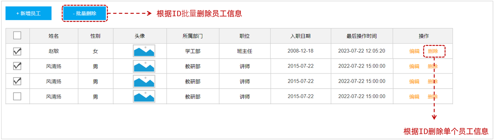
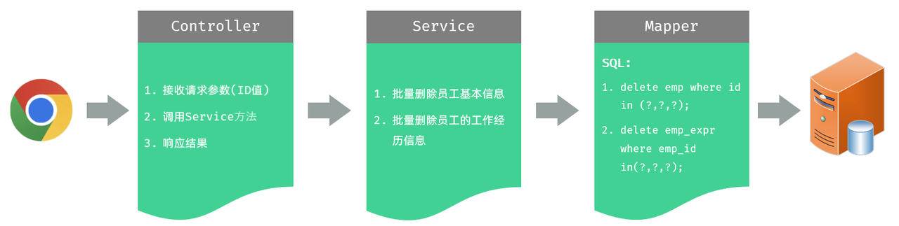

# 第十章：后端 Web 实战（员工管理）

**目录：**

[TOC]

---

我们已经完成了员工管理中的列表查询、新增员工的功能，那关于员工管理还有两个功能，分别是：修改员工、删除员工。

除了员工管理的功能以外，我们还要完成员工信息统计的功能，包括：员工职位统计、员工性别统计。

## 一、删除员工

### 1.1 需求



当我们勾选列表前面的复选框，然后点击“批量删除”按钮，就可以将这一批次的员工信息删除掉了；也可以只勾选一个复选框，仅删除一个员工信息。

### 1.2 接口文档

参照接口文档。

### 1.3 思路分析



### 1.4 功能开发

#### 1.4.1 Controller 层

首先考虑 Controller 接收参数的问题。

在 `EmpController` 中增加如下方法 `delete`，来执行批量删除员工的操作。

1). 方式一：在 Controller 方法中通过数组来接收

多个参数，默认可以将其封装到一个数组中，需要保证前端传递的参数名与方法形参名称保持一致。

```java
/* controller/EmpController.java */

package com.anxin_hitsz.controller;

import com.anxin_hitsz.pojo.Emp;
import com.anxin_hitsz.pojo.EmpQueryParam;
import com.anxin_hitsz.pojo.PageResult;
import com.anxin_hitsz.pojo.Result;
import com.anxin_hitsz.service.EmpService;
import lombok.extern.slf4j.Slf4j;
import org.springframework.beans.factory.annotation.Autowired;
import org.springframework.format.annotation.DateTimeFormat;
import org.springframework.web.bind.annotation.*;

import java.time.LocalDate;
import java.util.Arrays;
import java.util.List;

/**
 * ClassName: EmpController
 * Package: com.anxin_hitsz.controller
 * Description:
 *
 * @Author AnXin
 * @Create 2026/3/10 16:33
 * @Version 1.0
 */

/**
 * 员工管理 Controller
 */
@RequestMapping("/emps")
@Slf4j
@RestController
public class EmpController {

    @Autowired
    private EmpService empService;

    /**
     * 分页查询
     */
//    @GetMapping
//    public Result page(@RequestParam(defaultValue = "1") Integer page,
//                       @RequestParam(defaultValue = "10") Integer pageSize,
//                       String name,
//                       Integer gender,
//                       @DateTimeFormat(pattern = "yyyy-MM-dd") LocalDate begin,
//                       @DateTimeFormat(pattern = "yyyy-MM-dd") LocalDate end) {
//        log.info("分页查询: {}, {}, {}, {}, {}, {}", page, pageSize, name, gender, begin, end);
//        PageResult<Emp> pageResult = empService.page(page, pageSize, name, gender, begin, end);
//        return Result.success(pageResult);
//    }

    /**
     * 分页查询
     */
    @GetMapping
    public Result page(EmpQueryParam empQueryParam) {
        log.info("分页查询: {}", empQueryParam);
        PageResult<Emp> pageResult = empService.page(empQueryParam);
        return Result.success(pageResult);
    }

    /**
     * 新增员工
     */
    @PostMapping
    public Result save(@RequestBody Emp emp) {
        log.info("新增员工: {}", emp);
        empService.save(emp);
        return Result.success();
    }

    /**
     * 删除员工 - 数组
     */
    @DeleteMapping
    public Result delete(Integer[] ids) {
        log.info("删除员工: {}", Arrays.toString(ids));
        return Result.success();
    }

}

```

2). 方法二：在 Controller 方法中通过集合来接收

多个参数，也可以将其封装到一个 `List<Integer>` 集合中。如果要将其封装到一个集合中，需要在集合前面加上 `@RequestParam` 注解，且该 `@RequestParam` 注解是不可省略的。

```java
/* controller/EmpController.java */

package com.anxin_hitsz.controller;

import com.anxin_hitsz.pojo.Emp;
import com.anxin_hitsz.pojo.EmpQueryParam;
import com.anxin_hitsz.pojo.PageResult;
import com.anxin_hitsz.pojo.Result;
import com.anxin_hitsz.service.EmpService;
import lombok.extern.slf4j.Slf4j;
import org.springframework.beans.factory.annotation.Autowired;
import org.springframework.format.annotation.DateTimeFormat;
import org.springframework.web.bind.annotation.*;

import java.time.LocalDate;
import java.util.Arrays;
import java.util.List;

/**
 * ClassName: EmpController
 * Package: com.anxin_hitsz.controller
 * Description:
 *
 * @Author AnXin
 * @Create 2026/3/10 16:33
 * @Version 1.0
 */

/**
 * 员工管理 Controller
 */
@RequestMapping("/emps")
@Slf4j
@RestController
public class EmpController {

    @Autowired
    private EmpService empService;

    /**
     * 分页查询
     */
//    @GetMapping
//    public Result page(@RequestParam(defaultValue = "1") Integer page,
//                       @RequestParam(defaultValue = "10") Integer pageSize,
//                       String name,
//                       Integer gender,
//                       @DateTimeFormat(pattern = "yyyy-MM-dd") LocalDate begin,
//                       @DateTimeFormat(pattern = "yyyy-MM-dd") LocalDate end) {
//        log.info("分页查询: {}, {}, {}, {}, {}, {}", page, pageSize, name, gender, begin, end);
//        PageResult<Emp> pageResult = empService.page(page, pageSize, name, gender, begin, end);
//        return Result.success(pageResult);
//    }

    /**
     * 分页查询
     */
    @GetMapping
    public Result page(EmpQueryParam empQueryParam) {
        log.info("分页查询: {}", empQueryParam);
        PageResult<Emp> pageResult = empService.page(empQueryParam);
        return Result.success(pageResult);
    }

    /**
     * 新增员工
     */
    @PostMapping
    public Result save(@RequestBody Emp emp) {
        log.info("新增员工: {}", emp);
        empService.save(emp);
        return Result.success();
    }

    /**
     * 删除员工 - 数组
     */
//    @DeleteMapping
//    public Result delete(Integer[] ids) {
//        log.info("删除员工: {}", Arrays.toString(ids));
//        return Result.success();
//    }

    /**
     * 删除员工 - List
     */
    @DeleteMapping
    public Result delete(@RequestParam List<Integer> ids) {
        log.info("删除员工: {}", ids);
        return Result.success();
    }

}

```

两种方式，选择其中一种就可以。我们一般推荐选择集合，因为基于集合操作其中的元素会更加方便。

接下来，在 Controller 层中调用 Service 层，代码如下所示：
```java
/* controller/EmpController.java */

package com.anxin_hitsz.controller;

import com.anxin_hitsz.pojo.Emp;
import com.anxin_hitsz.pojo.EmpQueryParam;
import com.anxin_hitsz.pojo.PageResult;
import com.anxin_hitsz.pojo.Result;
import com.anxin_hitsz.service.EmpService;
import lombok.extern.slf4j.Slf4j;
import org.springframework.beans.factory.annotation.Autowired;
import org.springframework.format.annotation.DateTimeFormat;
import org.springframework.web.bind.annotation.*;

import java.time.LocalDate;
import java.util.Arrays;
import java.util.List;

/**
 * ClassName: EmpController
 * Package: com.anxin_hitsz.controller
 * Description:
 *
 * @Author AnXin
 * @Create 2026/3/10 16:33
 * @Version 1.0
 */

/**
 * 员工管理 Controller
 */
@RequestMapping("/emps")
@Slf4j
@RestController
public class EmpController {

    @Autowired
    private EmpService empService;

    /**
     * 分页查询
     */
//    @GetMapping
//    public Result page(@RequestParam(defaultValue = "1") Integer page,
//                       @RequestParam(defaultValue = "10") Integer pageSize,
//                       String name,
//                       Integer gender,
//                       @DateTimeFormat(pattern = "yyyy-MM-dd") LocalDate begin,
//                       @DateTimeFormat(pattern = "yyyy-MM-dd") LocalDate end) {
//        log.info("分页查询: {}, {}, {}, {}, {}, {}", page, pageSize, name, gender, begin, end);
//        PageResult<Emp> pageResult = empService.page(page, pageSize, name, gender, begin, end);
//        return Result.success(pageResult);
//    }

    /**
     * 分页查询
     */
    @GetMapping
    public Result page(EmpQueryParam empQueryParam) {
        log.info("分页查询: {}", empQueryParam);
        PageResult<Emp> pageResult = empService.page(empQueryParam);
        return Result.success(pageResult);
    }

    /**
     * 新增员工
     */
    @PostMapping
    public Result save(@RequestBody Emp emp) {
        log.info("新增员工: {}", emp);
        empService.save(emp);
        return Result.success();
    }

    /**
     * 删除员工 - 数组
     */
//    @DeleteMapping
//    public Result delete(Integer[] ids) {
//        log.info("删除员工: {}", Arrays.toString(ids));
//        return Result.success();
//    }

    /**
     * 删除员工 - List
     */
    @DeleteMapping
    public Result delete(@RequestParam List<Integer> ids) {
        log.info("删除员工: {}", ids);
        empService.delete(ids);
        return Result.success();
    }

}

```

#### 1.4.2 Service 层

1). 在接口 `EmpService` 中定义接口方法 `deleteByIds`

```java
/* service/EmpService.java */

package com.anxin_hitsz.service;

import com.anxin_hitsz.pojo.Emp;
import com.anxin_hitsz.pojo.EmpQueryParam;
import com.anxin_hitsz.pojo.PageResult;

import java.time.LocalDate;
import java.util.List;

/**
 * ClassName: EmpService
 * Package: com.anxin_hitsz.service
 * Description:
 *
 * @Author AnXin
 * @Create 2026/3/10 16:31
 * @Version 1.0
 */
public interface EmpService {

    /**
     * 分页查询
     */
    PageResult<Emp> page(EmpQueryParam empQueryParam);

    /**
     * 新增员工信息
     */
    void save(Emp emp);

    /**
     * 批量删除员工
     */
    void delete(List<Integer> ids);

    /**
     * 分页查询
     * @param page 页码
     * @param pageSize 每页记录数
     */
//    PageResult<Emp> page(Integer page, Integer pageSize, String name, Integer gender, LocalDate begin, LocalDate end);

}

```

2). 在实现类 `EmpServiceImpl` 中实现接口方法 `deleteByIds`

在删除员工信息时，既需要删除 emp 表中的员工基本信息，还需要删除 emp_expr 表中员工的工作经历信息。

```java
/* service/impl/EmpServiceImpl.java */

package com.anxin_hitsz.service.impl;

import com.anxin_hitsz.mapper.EmpExprMapper;
import com.anxin_hitsz.mapper.EmpLogMapper;
import com.anxin_hitsz.mapper.EmpMapper;
import com.anxin_hitsz.pojo.*;
import com.anxin_hitsz.service.EmpLogService;
import com.anxin_hitsz.service.EmpService;
import com.github.pagehelper.Page;
import com.github.pagehelper.PageHelper;
import org.springframework.beans.factory.annotation.Autowired;
import org.springframework.stereotype.Service;
import org.springframework.transaction.annotation.Transactional;
import org.springframework.util.CollectionUtils;

import java.time.LocalDate;
import java.time.LocalDateTime;
import java.util.List;

/**
 * ClassName: EmpServiceImpl
 * Package: com.anxin_hitsz.service.impl
 * Description:
 *
 * @Author AnXin
 * @Create 2026/3/10 16:31
 * @Version 1.0
 */
@Service
public class EmpServiceImpl implements EmpService {

    @Autowired
    private EmpMapper empMapper;
    @Autowired
    private EmpExprMapper empExprMapper;
    @Autowired
    private EmpLogService empLogService;

    /**
     * 原始分页查询
     * @param page 页码
     * @param pageSize 每页记录数
     * @return
     */
//    @Override
//    public PageResult<Emp> page(Integer page, Integer pageSize) {
//        // 1. 调用 Mapper 接口，查询总记录数
//        Long total = empMapper.count();
//
//        // 2. 调用 Mapper 接口，查询结果列表
//        Integer start = (page - 1) * pageSize;
//        List<Emp> rows = empMapper.list(start, pageSize);
//
//        // 3. 封装结果 PageResult
//        return new PageResult<Emp>(total, rows);
//    }

    /**
     * PageHelper 分页查询
     * @param page 页码
     * @param pageSize 每页记录数
     * 注意事项：
     *         1. 定义的 SQL 语句结尾不能加分号 “;”
     *         2. PageHelper 仅仅能够对紧跟在其后的第一个查询语句进行分页处理
     */
//    @Override
//    public PageResult<Emp> page(Integer page, Integer pageSize, String name, Integer gender, LocalDate begin, LocalDate end) {
//        // 1. 设置分页参数（PageHelper）
//        PageHelper.startPage(page, pageSize);
//
//        // 2. 执行查询
//        List<Emp> empList = empMapper.list(name, gender, begin, end);
//
//        // 3. 解析查询结果，并封装
//        Page<Emp> p = (Page<Emp>) empList;
//        return new PageResult<Emp>(p.getTotal(), p.getResult());
//    }

    @Override
    public PageResult<Emp> page(EmpQueryParam empQueryParam) {
        // 1. 设置分页参数（PageHelper）
        PageHelper.startPage(empQueryParam.getPage(), empQueryParam.getPageSize());

        // 2. 执行查询
        List<Emp> empList = empMapper.list(empQueryParam);

        // 3. 解析查询结果，并封装
        Page<Emp> p = (Page<Emp>) empList;
        return new PageResult<Emp>(p.getTotal(), p.getResult());
    }

    @Transactional(rollbackFor = {Exception.class})  // 事务管理 - 默认出现运行时异常 RuntimeException 才会回滚
    @Override
    public void save(Emp emp) {
        try {
            // 1. 保存员工基本信息
            emp.setCreateTime(LocalDateTime.now());
            emp.setUpdateTime(LocalDateTime.now());
            empMapper.insert(emp);

            // 2. 保存员工工作经历信息
            List<EmpExpr> exprList = emp.getExprList();
            if (!CollectionUtils.isEmpty(exprList)) {
                // 遍历集合，为 empId 赋值
                exprList.forEach(empExpr -> {
                    empExpr.setEmpId(emp.getId());
                });
                empExprMapper.insertBatch(exprList);
            }
        } finally {
            // 记录操作日志
            EmpLog empLog = new EmpLog(null, LocalDateTime.now(), "新增员工：" + emp);
            empLogService.insertLog(empLog);
        }
    }

    @Transactional(rollbackFor = {Exception.class})
    @Override
    public void delete(List<Integer> ids) {
        // 1. 批量删除员工基本信息
        empMapper.deleteByIds(ids);

        // 2. 批量删除员工的工作经历信息
        empExprMapper.deleteByEmpIds(ids);
    }

}

```

> 注意：
>
> 由于删除员工信息时，既要删除员工基本信息，又要删除员工工作经历信息，操作多次数据库的删除，所以这里需要进行**事务控制**。

#### 1.4.3 Mapper 层

1). 在 `EmpMapper` 接口中增加 `deleteByIds` 方法，实现批量删除员工基本信息

```java
/* mapper/EmpMapper.java */

package com.anxin_hitsz.mapper;

/**
 * ClassName: EmpMapper
 * Package: com.anxin_hitsz.mapper
 * Description:
 *
 * @Author AnXin
 * @Create 2026/3/10 16:30
 * @Version 1.0
 */

import com.anxin_hitsz.pojo.Emp;
import com.anxin_hitsz.pojo.EmpQueryParam;
import org.apache.ibatis.annotations.Insert;
import org.apache.ibatis.annotations.Mapper;
import org.apache.ibatis.annotations.Options;
import org.apache.ibatis.annotations.Select;

import java.time.LocalDate;
import java.util.List;

/**
 * 员工信息
 */
@Mapper
public interface EmpMapper {

    // ------------------------------ 原始分页查询实现 ------------------------------
    /**
     * 查询总记录数
     */
//    @Select("select count(*) from emp e left join dept d on e.dept_id = d.id")
//    public Long count();

    /**
     * 分页查询
     */
//    @Select("select e.*, d.name deptName from emp e left join dept d on e.dept_id = d.id " +
//            "order by e.update_time desc limit #{start}, #{pageSize}")
//    public List<Emp> list(Integer start, Integer pageSize);


//    @Select("select e.*, d.name deptName from emp e left join dept d on e.dept_id = d.id order by e.update_time desc")
//    public List<Emp> list(String name, Integer gender, LocalDate begin, LocalDate end);

    /**
     * 条件查询员工信息
     */
    public List<Emp> list(EmpQueryParam empQueryParam);

    /**
     * 新增员工基本信息
     */
    @Options(useGeneratedKeys = true, keyProperty = "id")   // 获取到生成的主键 - 主键返回
    @Insert("insert into emp (username, name, gender, phone, job, salary, image, entry_date, dept_id, create_time, update_time)" +
            " values (#{username}, #{name}, #{gender}, #{phone}, #{job}, #{salary}, #{image}, #{entryDate}, #{deptId}, #{createTime}, #{updateTime})")
    void insert(Emp emp);

    /**
     * 根据 ID 批量删除员工的基本信息
     */
    void deleteByIds(List<Integer> ids);
}

```

2). 在 EmpMapper.xml 配置文件中，配置对应的 SQL 语句

```xml
<!-- EmpMapper.xml -->

<?xml version="1.0" encoding="UTF-8" ?>
<!DOCTYPE mapper
        PUBLIC "-//mybatis.org//DTD Mapper 3.0//EN"
        "http://mybatis.org/dtd/mybatis-3-mapper.dtd">
<mapper namespace="com.anxin_hitsz.mapper.EmpMapper">
    <!-- 批量删除员工基本信息 -->
    <delete id="deleteByIds">
        delete from emp where id in
        <foreach collection="ids" item="id" separator="," open="(" close=")">
            #{id}
        </foreach>
    </delete>

    <select id="list" resultType="com.anxin_hitsz.pojo.Emp">
        select e.*, d.name deptName from emp e left join dept d on e.dept_id = d.id
        <where>
            <if test="name != null and name != ''">
                e.name like concat('%', #{name}, '%')
            </if>
            <if test="gender != null">
                and e.gender = #{gender}
            </if>
            <if test="begin != null and end != null">
                and e.entry_date between #{begin} and #{end}
            </if>
        </where>
        order by e.update_time desc
    </select>

</mapper>
```

3). 在 `EmpExprMapper` 接口中增加 `deleteByEmpIds` 方法，实现根据员工 ID 批量删除员工的工作经历信息

```java
/* mapper/EmpExprMapper.java */

package com.anxin_hitsz.mapper;

import com.anxin_hitsz.pojo.EmpExpr;
import org.apache.ibatis.annotations.Mapper;

import java.util.List;

/**
 * ClassName: EmpExprMapper
 * Package: com.anxin_hitsz.mapper
 * Description:
 *
 * @Author AnXin
 * @Create 2026/3/10 16:30
 * @Version 1.0
 */

/**
 * 员工工作经历
 */
@Mapper
public interface EmpExprMapper {
    /**
     * 批量保存员工的工作经历信息
     */
    void insertBatch(List<EmpExpr> exprList);

    /**
     * 根据员工 ID 批量删除员工工作经历
     */
    void deleteByEmpIds(List<Integer> empIds);
}

```

4). 在 EmpExprMapper.xml 配置文件中，配置对应的 SQL 语句

```xml
<!-- EmpExprMapper.xml -->

<?xml version="1.0" encoding="UTF-8" ?>
<!DOCTYPE mapper
        PUBLIC "-//mybatis.org//DTD Mapper 3.0//EN"
        "http://mybatis.org/dtd/mybatis-3-mapper.dtd">
<mapper namespace="com.anxin_hitsz.mapper.EmpExprMapper">

    <!-- 批量保存员工工作经历信息
        foreach 标签：
            collection：遍历的集合
            item：遍历出来的元素
            separator：每次循环之间的分隔符
    -->
    <insert id="insertBatch">
        insert into emp_expr (emp_id, begin, end, company, job) values
        <foreach collection="exprList" item="expr" separator=",">
            (#{expr.empId}, #{expr.begin}, #{expr.end}, #{expr.company}, #{expr.job})
        </foreach>
    </insert>

    <!-- 根据员工 ID 批量删除员工工作经历 -->
    <delete id="deleteByEmpIds">
        delete from emp_expr where emp_id in
        <foreach collection="empIds" item="empId" separator="," open="(" close=")">
            #{empId}
        </foreach>
    </delete>

</mapper>
```

### 1.5 功能测试

功能开发完成后，重启项目工程，打开 Apifox，发起 DELETE 请求。

观察控制台输出的 SQL 语句。

### 1.6 前后端联调

打开浏览器，测试后端功能接口。